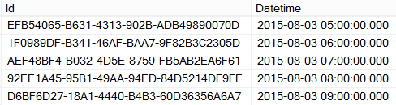
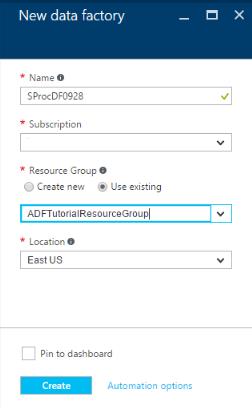

<properties 
    pageTitle="SQLServer gespeicherte Prozedur für die Aktivität" 
    description="Erfahren Sie, wie Sie die SQL Server gespeicherte Prozedur Aktivität verwenden können, um eine gespeicherte Prozedur in einer SQL Azure-Datenbank oder Azure SQL-Data Warehouse aus einer Data Factory Verkaufspipeline aufzurufen." 
    services="data-factory" 
    documentationCenter="" 
    authors="spelluru" 
    manager="jhubbard" 
    editor="monicar"/>

<tags 
    ms.service="data-factory" 
    ms.workload="data-services" 
    ms.tgt_pltfrm="na" 
    ms.devlang="na" 
    ms.topic="article" 
    ms.date="09/30/2016" 
    ms.author="spelluru"/>

# SQLServer gespeicherte Prozedur für die Aktivität
> [AZURE.SELECTOR]
[Struktur](data-factory-hive-activity.md)  
[Schwein](data-factory-pig-activity.md)  
[MapReduce](data-factory-map-reduce.md)  
[Hadoop Streaming](data-factory-hadoop-streaming-activity.md)
[Computer Learning](data-factory-azure-ml-batch-execution-activity.md) 
[Gespeicherte Prozedur](data-factory-stored-proc-activity.md)
[Daten dem Analytics U SQL](data-factory-usql-activity.md)
[benutzerdefinierten .NET](data-factory-use-custom-activities.md)

Die Aktivität SQL Server gespeicherte Prozedur in einer Daten Factory [Verkaufspipeline](data-factory-create-pipelines.md) können Sie eine gespeicherte Prozedur in einem der folgenden Datenspeicher aufrufen: 

- SQL Azure-Datenbank 
- SQL Azure Datawarehouse  
- SQL Server-Datenbank in Ihrem Unternehmen oder eine Azure-virtuellen Computer. Sie müssen Datenverwaltungsgateway installieren, auf dem Computer, der die Datenbank hostet oder auf einem separaten Computer, um zu vermeiden, Anspruch auf Ressource mit der Datenbank. Datenverwaltungsgateway ist eine Software, die eine Verbindung herstellt Datenquellen/Datenquellen in eine sichere und verwaltete Möglichkeit in Azure-virtuellen Computern in der Cloud Services hosed lokalen. Siehe [Verschieben von Daten zwischen lokalen und Cloud](data-factory-move-data-between-onprem-and-cloud.md) Artikel Details des Datenverwaltungsgateways. 

In diesem Artikel basiert auf den [Daten Transformationsaktivitäten](data-factory-data-transformation-activities.md) Artikel eine allgemeine Übersicht über Datentransformation und der unterstützten Transformationsaktivitäten bietet.

## Exemplarische Vorgehensweise

### Beispiel für die Tabelle und eine gespeicherte Prozedur
1. Erstellen Sie in der folgenden **Tabelle** in Ihrer Azure SQL-Datenbank mithilfe von SQL Server Management Studio oder ein anderes Programm, das Sie mit vertraut sind. Die Spalte Datetimestamp ist das Datum und die Uhrzeit, wann die entsprechende ID generiert wird. 

        CREATE TABLE dbo.sampletable
        (
            Id uniqueidentifier,
            datetimestamp nvarchar(127)
        )
        GO

        CREATE CLUSTERED INDEX ClusteredID ON dbo.sampletable(Id);
        GO

    ID ist eindeutig identifiziert und der Datetimestamp Spalte Datum und Uhrzeit, wann die entsprechende ID generiert wird.
    

    > [AZURE.NOTE] In diesem Beispiel Azure SQL-Datenbank verwendet, aber funktioniert auf die gleiche Weise für Azure SQL-Data Warehouse und SQL Server-Datenbank. 
2. Erstellen Sie die folgende **gespeicherte Prozedur** , die Daten in der **Sampletable**Fügt ein.

        CREATE PROCEDURE sp_sample @DateTime nvarchar(127)
        AS
        
        BEGIN
            INSERT INTO [sampletable]
            VALUES (newid(), @DateTime)
        END

    > [AZURE.IMPORTANT] **Name** und **zur Groß-und Kleinschreibung** des Parameters (DateTime in diesem Beispiel) müssen mit der Parameter in der Verkaufspipeline/Aktivität JSON angegebenen übereinstimmen. Vergewissern Sie sich, die in der Definition der gespeicherten Prozedur **@** als Präfix für den Parameter verwendet wird.
    
### Erstellen Sie eine Factory Daten  
4. Melden Sie sich [Azure-Portal](https://portal.azure.com/)an. 
5. Klicken Sie auf **neu** , klicken Sie auf das Menü links auf **Intelligence + Analytics**, und klicken Sie auf **Daten Factory**.
    
       
4.  Geben Sie in die **neuen Daten Factory** Blade **SProcDF** ein. Azure Data Factory-Namen sind **global eindeutig**. Sie müssen den Namen der Factory Daten mit Ihrem Namen, aktivieren Sie die erfolgreiche Erstellung der Factory Präfix.

          
3.  Wählen Sie Ihr **Abonnement Azure**aus. 
4.  Führen Sie für **Ressourcengruppe**die folgenden Schritte aus: 
    1.  Klicken Sie auf **neu erstellen** , und geben Sie einen Namen für die Ressourcengruppe.
    2.  Klicken Sie auf **vorhandene verwenden** , und wählen Sie eine vorhandene Ressourcengruppe aus.  
5.  Wählen Sie den **Speicherort** für die Factory Daten aus.
6.  Wählen Sie, dass Sie die Daten Factory auf dem Dashboard nächste Mal anzeigen können, die Sie melden Sie sich **an Dashboard anheften** . 
6.  Klicken Sie auf die **neuen Daten Factory** -Blade auf **Erstellen** .
6.  Sie sehen die Daten Factory im **Dashboard** des Portals Azure erstellt wird. Nachdem die Daten Factory erfolgreich erstellt wurde, wird die Factory Seite, die den Inhalt der Factory Daten angezeigt wird.
    

### Erstellen eines SQL Azure-Verknüpfte-Diensts  
Nach dem Erstellen der Daten Factory, erstellen Sie einen SQL Azure-Verknüpfte Dienst, den Azure SQL-Datenbank mit den Daten Factory verknüpft. Diese Datenbank enthält die Sampletable Tabellen- und Sp_sample gespeicherte Prozedur.

7.  Klicken Sie auf **Autor und Bereitstellen von** auf dem **Daten Factory** -Blade für **SProcDF** , um die Daten Factory-Editor zu starten.
2.  Klicken Sie auf der Befehlsleiste auf **neue Daten speichern möchten** , und wählen Sie **Azure SQL-Datenbank**. Es sollte das JSON-Skript zum Erstellen eines SQL Azure-Verknüpfte Diensts im Editor angezeigt. 

    
4. Klicken Sie in das JSON-Skript vorzunehmen: 
    1. Ersetzen Sie ** &lt;Servername&gt; ** mit dem Namen des Servers Azure SQL-Datenbank.
    2. Ersetzen Sie ** &lt;Datenbankname&gt; ** mit der Datenbank, in dem Sie die Tabelle und der gespeicherten Prozedur erstellt.
    3. Ersetzen Sie ** &lt; username@servername ** für das Benutzerkonto, das in der Datenbank zugreifen können.
    4. Ersetzen Sie ** &lt;Kennwort&gt; ** durch das Kennwort für das Benutzerkonto. 

    
5. Klicken Sie auf der Befehlsleiste verknüpften Dienst bereitstellen auf **Bereitstellen** . Bestätigen Sie, dass Sie die AzureSqlLinkedService in der Strukturansicht auf der linken Seite angezeigt. 

    

### Erstellen Sie ein Dataset Ausgabe
6. Klicken Sie auf **... Weitere** klicken Sie auf der Symbolleiste, klicken Sie auf **Neues Dataset**, und klicken Sie auf **SQL Azure**. **Neues Dataset** auf der Befehlsleiste und select **SQL Azure**.

    
7. Das folgende Skript JSON in in den JSON-Editor kopieren und einfügen.

        {               
            "name": "sprocsampleout",
            "properties": {
                "type": "AzureSqlTable",
                "linkedServiceName": "AzureSqlLinkedService",
                "typeProperties": {
                    "tableName": "sampletable"
                },
                "availability": {
                    "frequency": "Hour",
                    "interval": 1
                }
            }
        }
7. Klicken Sie auf der Befehlsleiste Dataset bereitstellen auf **Bereitstellen** . Bestätigen Sie, um das Dataset in der Strukturansicht anzuzeigen. 

    

### Erstellen Sie eine Verkaufspipeline mit SqlServerStoredProcedure Aktivität
Nun erstellen wir eine Verkaufspipeline mit einem SqlServerStoredProcedure Aktivität.
 
9. Klicken Sie auf **... Weitere** auf den Befehl Balken-, und klicken Sie auf **neue Verkaufspipeline**. 
9. Einfügen Sie kopieren und den folgenden JSON-Codeausschnitt. Legen Sie die **StoredProcedureName** auf **Sp_sample**. Name und Groß-und Kleinschreibung des Parameters **DateTime** müssen den Namen und die Groß-/Kleinschreibung des Parameters in der Definition der gespeicherten Prozedur übereinstimmen.  

        {
            "name": "SprocActivitySamplePipeline",
            "properties": {
                "activities": [
                    {
                        "type": "SqlServerStoredProcedure",
                        "typeProperties": {
                            "storedProcedureName": "sp_sample",
                            "storedProcedureParameters": {
                                "DateTime": "$$Text.Format('{0:yyyy-MM-dd HH:mm:ss}', SliceStart)"
                            }
                        },
                        "outputs": [
                            {
                                "name": "sprocsampleout"
                            }
                        ],
                        "scheduler": {
                            "frequency": "Hour",
                            "interval": 1
                        },
                        "name": "SprocActivitySample"
                    }
                ],
                "start": "2016-08-02T00:00:00Z",
                "end": "2016-08-02T05:00:00Z",
                "isPaused": false
            }
        }

    Wenn Sie für einen Parameter null übergeben müssen, verwenden Sie die Syntax: "param1": null (Kleinbuchstaben). 
9. Klicken Sie auf der Symbolleiste der Verkaufspipeline bereitstellen auf **Bereitstellen** .  

### Überwachen der Verkaufspipeline

6. Klicken Sie auf **X** Daten Factory-Editor Blades schließen und zurück zu den Daten Factory Blade zu navigieren, und klicken Sie auf **Diagramm**.

    
7. In der **Diagrammansicht**finden Sie unter Übersicht über die Pipelines und Datasets in diesem Lernprogramm verwendet. 

    
8. Doppelklicken Sie in der Diagrammansicht auf das Dataset **Sprocsampleout**. Sie sehen die Segmente in den Zustand bereit. Da ein Segment für jede Stunde zwischen die Start- und Endzeit aus den JSON erzeugt wird sollten fünf Segmente vor.

     
10. Wenn ein Segment **eingeschaltet** ist, Ausführen einer * *Wählen* Sie aus Sampletable** Abfrage der SQL Azure-Datenbank zu überprüfen, ob die Daten von der gespeicherten Prozedur in der Tabelle eingefügt wurden.

    

    Ausführliche Informationen zur Überwachung Azure Daten Factory Pipelines finden Sie unter [Überwachen der Verkaufspipeline](data-factory-monitor-manage-pipelines.md) .  

> [AZURE.NOTE] In diesem Beispiel enthält die SprocActivitySample keine Eingaben an. Wenn Sie diese Aktivität mit einer Aktivität vor-(d. h., vorherige Verarbeitung) verketten möchten, die Ausgaben der übergeordneten Aktivität als Eingaben in dieser Aktivität verwendet werden können. In diesem Fall wird diese Aktivität nicht ausgeführt, bis die übergeordneten Aktivität abgeschlossen ist, und die Ausgaben übergeordneten Aktivitäten (in bereit Status) verfügbar sind. Die Eingaben können nicht direkt als Parameter an die gespeicherte Prozedur Aktivität verwendet werden

## JSON-format
    {
        "name": "SQLSPROCActivity",
        "description": "description", 
        "type": "SqlServerStoredProcedure",
        "inputs":  [ { "name": "inputtable"  } ],
        "outputs":  [ { "name": "outputtable" } ],
        "typeProperties":
        {
            "storedProcedureName": "<name of the stored procedure>",
            "storedProcedureParameters":  
            {
                "param1": "param1Value"
                …
            }
        }
    }

## JSON-Eigenschaften

Eigenschaft | Beschreibung | Erforderlich
-------- | ----------- | --------
Namen | Name der Aktivität | Ja
Beschreibung | Text zur Beschreibung, wofür die Aktivität verwendet wird | Nein
Typ | SqlServerStoredProcedure | Ja
Eingaben | Optional. Wenn Sie eine Eingabe-Dataset angeben, verfügbar sein muss (in 'Bereit' Status) für die gespeicherte Prozedur Aktivität ausführen. Das Eingabe-Dataset kann nicht als Parameter in der gespeicherten Prozedur genutzt werden. Hiermit wird nur die Abhängigkeit zu überprüfen, bevor Sie die gespeicherte Prozedur Aktivität starten. | Nein
Ausgaben | Sie müssen ein Dataset Ausgabe für eine gespeicherte Prozedur Aktivität angeben. Die Ausgabe Dataset gibt den **Zeitplan** für die gespeicherte Prozedur Aktivität (stündlich, wöchentlich, monatlich usw..) an.   Das Ausgabe Dataset muss einen **verknüpften Dienst** verwenden, das auf einer SQL Azure-Datenbank oder einer Azure SQL-Data Warehouse oder einer SQL Server-Datenbank in der gespeicherte Prozedur, die ausgeführt werden sollen.   Das Ausgabe Dataset kann als eine Möglichkeit, das Ergebnis der gespeicherten Prozedur für nachfolgende Verarbeitung, indem Sie eine andere Aktivität ([Verkettung Aktivitäten](data-factory-scheduling-and-execution.md#chaining-activities)) in der Verkaufspipeline übergeben dienen. Jedoch schreibt Daten Factory automatisch die Ausgabe einer gespeicherten Prozedur zu diesem Dataset nicht. Es ist die gespeicherte Prozedur, die in einer SQL-Tabelle, die schreibt auf das Ausgabe Dataset verweist.   In einigen Fällen kann das Ausgabe Dataset ein **Dataset-platzhalterprodukt**, nur verwendet, um den Zeitplan für die Ausführung der gespeicherten Prozedur Aktivität angeben. | Ja
storedProcedureName | Geben Sie den Namen der gespeicherten Prozedur den SQL Azure-Datenbank oder Azure SQL Data Warehouse vom Dienst verknüpften dargestellt wird, das die Ausgangsdaten verwendet. | Ja
storedProcedureParameters | Geben Sie Werte für Parameter der gespeicherten Prozedur ein. Wenn Sie für einen Parameter null übergeben müssen, verwenden Sie die Syntax: "param1": Null (alle Kleinbuchstaben). Im folgenden Beispiel, um Informationen zur Verwendung dieser Eigenschaft finden Sie unter.| Nein

## Einen statischen Wert übergeben 
Nun sehen Sie sich eine andere Spalte mit dem Namen 'Szenario' hinzufügen, in der Tabelle, einen statischen Wert 'Document Stichprobe' bezeichnet.

    CREATE PROCEDURE sp_sample @DateTime nvarchar(127) , @Scenario nvarchar(127)
    
    AS
    
    BEGIN
        INSERT INTO [sampletable]
        VALUES (newid(), @DateTime, @Scenario)
    END

Übergeben Sie nun den Parameter Szenario und den Wert aus der gespeicherten Prozedur Aktivität aus. Im Abschnitt TypeProperties im vorherigen Beispiel sieht wie im folgenden Codeausschnitt aus:

    "typeProperties":
    {
        "storedProcedureName": "sp_sample",
        "storedProcedureParameters": 
        {
            "DateTime": "$$Text.Format('{0:yyyy-MM-dd HH:mm:ss}', SliceStart)",
            "Scenario": "Document sample"
        }
    }

