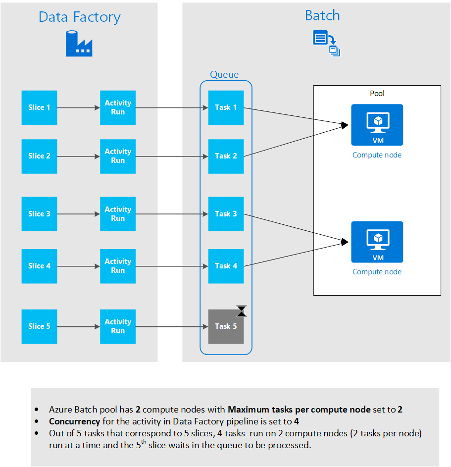

<properties
    pageTitle="Verwenden Sie benutzerdefinierte Aktivitäten in einer Azure Data Factory Verkaufspipeline"
    description="Informationen Sie zum Erstellen von benutzerdefinierten Aktivitäten und deren Verwendung in einer Azure Data Factory Verkaufspipeline."
    services="data-factory"
    documentationCenter=""
    authors="spelluru"
    manager="jhubbard"
    editor="monicar"/>

<tags
    ms.service="data-factory"
    ms.workload="data-services"
    ms.tgt_pltfrm="na"
    ms.devlang="na"
    ms.topic="article"
    ms.date="10/17/2016"
    ms.author="spelluru"/>

# Verwenden Sie benutzerdefinierte Aktivitäten in einer Azure Data Factory Verkaufspipeline
> [AZURE.SELECTOR]
[Struktur](data-factory-hive-activity.md)  
[Schwein](data-factory-pig-activity.md)  
[MapReduce](data-factory-map-reduce.md)  
[Hadoop Streaming](data-factory-hadoop-streaming-activity.md)
[Computer Learning](data-factory-azure-ml-batch-execution-activity.md) 
[Gespeicherte Prozedur](data-factory-stored-proc-activity.md)
[Daten dem Analytics U SQL](data-factory-usql-activity.md)
[benutzerdefinierten .NET](data-factory-use-custom-activities.md)

Es gibt zwei Arten von Aktivitäten, die Sie in einer Azure Data Factory Verkaufspipeline verwenden können.
 
- [Daten Bewegung Aktivitäten](data-factory-data-movement-activities.md) zum Verschieben von Daten zwischen [Datenspeicher unterstützt](data-factory-data-movement-activities.md#supported-data-stores).
- [Daten Transformationsaktivitäten](data-factory-data-transformation-activities.md) bei der Verwendung von Transformation/Prozess Daten berechnet wie Azure HDInsight, Azure Stapel und Azure maschinellen Schulung. Beispiel: HDInsight Struktur und Computer Learning Stapel Datenausführungsverhinderung.  

Wenn Sie müssen zum Verschieben von Daten zu/aus einem Datenspeicher, die nicht von Azure Daten Factory unterstützt wird, können Sie eine benutzerdefinierte .NET Aktivität mit Ihrer eigenen Daten Bewegung Logik erstellen und verwenden die Aktivität in der Verkaufspipeline. 

Wenn Sie müssen Transformation/Daten in eine Möglichkeit Prozess, der von Daten Factory nicht unterstützt wird, können Sie auf ähnliche Weise, erstellen eine benutzerdefinierte Aktivität mit Ihrer eigenen Logik Datenverarbeitung und die Aktivität in der Verkaufspipeline verwenden.

> [AZURE.NOTE] Datenverwaltungsgateway unterstützt nur die Aktivität kopieren und gespeicherte Prozedur Aktivität derzeit in Daten Factory. Es ist nicht möglich, das Gateway aus einer benutzerdefinierten Aktivität Zugriff auf lokale Datenquellen zu verwenden.
 
Sie können die benutzerdefinierte .NET Aktivität ausführen mithilfe eines **Stapel Azure** -Diensts oder eine **Azure HDInsight** Cluster konfigurieren.   

Die folgende exemplarische Vorgehensweise bietet eine schrittweise Anleitung zum Erstellen einer benutzerdefinierten .NET Aktivität und benutzerdefinierten Aktivität in einer Verkaufspipeline. Die exemplarische Vorgehensweise verwendet den Dienst **Azure Stapel** verknüpft. Verwenden der Azure HDInsight stattdessen Dienst verknüpft, erstellen Sie einen verknüpften Dienst des Typs **HDInsight** (Wenn Sie Ihre eigenen HDInsight Cluster verwenden) oder **HDInsightOnDemand** (wenn die gewünschten Daten Factory zum Erstellen einer HDInsight Cluster bei Bedarf), und verwenden sie im Abschnitt Aktivität der Verkaufspipeline JSON (**LinkedServiceName**). Finden Sie unter [verwenden Azure HDInsight verknüpft Services](#use-azure-hdinsight-linked-services) Abschnitt detaillierte Informationen zur Verwendung von Azure HDInsight zum Ausführen benutzerdefinierten Aktivität.

> [AZURE.IMPORTANT] Festlegen von 4.5.2-Version von .NET Framework als Ziel-Framework für ein .NET benutzerdefinierter Aktivität Projekt in Visual Studio. Benutzerdefinierte Aktivitäten, die später als 4.5.2 für .NET Framework-Versionen kompilierte unterstützt Daten Factory nicht.   

## Exemplarische Vorgehensweise 

### Erforderliche Komponenten

- Visual Studio 2012/2013/2015
- [Azure.NET SDK] herunterladen und installieren[azure-developer-center]

### Azure Stapel erforderliche Komponenten
Führen Sie in der Anleitung erfahren Sie Ihre benutzerdefinierten .NET Aktivitäten mit Azure Stapel als berechnen Ressource aus. Finden Sie unter [Grundlagen Azure Stapel] [ batch-technical-overview] für einen Überblick über den Stapel Azure service und finden Sie unter [Erste Schritte mit der Bibliothek Azure Stapel für .NET] [ batch-get-started] mit dem Dienst Azure Stapel schnellen Einstieg.

Für das Lernprogramm müssen Sie ein Stapel Azure-Konto mit einem Ressourcenpool von virtuellen Maschinen zu erstellen. Hier sind die Schritte aus:

1. Erstellen Sie ein **Stapel Azure-Konto** mithilfe der [Azure-Portal](http://manage.windowsazure.com)an. Finden Sie unter [Erstellen und verwalten ein Kontos Azure Stapel] [ batch-create-account] Artikel Anweisungen. Beachten Sie die gedrückt Azure Stapel Konto Name und Konto an.

    Sie können auch [Neu-AzureBatchAccount] [ new-azure-batch-account] -Cmdlet zum Erstellen eines Kontos Azure Stapel. Finden Sie unter [Verwenden von Azure PowerShell verwalten Azure Stapel Konto] [ azure-batch-blog] detaillierte Informationen zum Verwenden dieser Cmdlets.
2. Erstellen einer **Azure Stapel Ressourcenpool**an.
    1. Im [Portal Azure](https://portal.azure.com)klicken Sie im linken Menü auf **Durchsuchen** , und klicken Sie auf **Stapel Konten**. 
    2. Wählen Sie Ihr Konto Azure Stapel, um das **Konto Stapel** Blade zu öffnen. 
    3. Klicken Sie auf die Kachel **Pools** .
    4. Klicken Sie in das Blade **Pools** auf Schaltfläche auf der Symbolleiste auf einem Ressourcenpool hinzufügen hinzufügen.
        1. Geben Sie eine ID für den Ressourcenpool (**Pool-ID**) ein. Beachten Sie die **Pool-ID**an. benötigt die Daten Factory-Lösung erstellen. 
        2. Geben Sie für die Einstellung der Familie Betriebssystem **Windows Server 2012 R2** an.
        3. Wählen Sie einen **Knoten Preisgestaltung Ebene**aus. 
        3. Geben Sie **2** als Wert für die Einstellung **Dedizierter Ziel** ein.
        4. **2** als Wert für die Einstellung **Max Vorgänge pro Knoten** eingeben.
    5. Klicken Sie auf **OK** , um den Ressourcenpool zu erstellen. 
 
    [Neu-AzureBatchPool](https://msdn.microsoft.com/library/mt628690.aspx) -Cmdlet können Sie auch um eine Azure Stapel Ressourcenpool zu erstellen.    

### Allgemeinen Schritte 
1.  **Erstellen eine benutzerdefinierte Aktivität** , eine Verkaufspipeline Factory Daten verwenden. Die benutzerdefinierte Aktivität in diesem Beispiel enthält die Daten Transformation/Verarbeitung Logik. 
    1.  Erstellen eines Projekts .NET Class Library in Visual Studio, fügen Sie den Code zum Verarbeiten von Eingabedaten und Kompilieren des Projekts. 
    2.  ZIP alle binären Dateien und PDB-Datei (optional) in den Ausgabeordner an.  
    3.  Laden Sie die Zip-Datei in Azure Blob-Speicher hoch. Ausführliche Anleitung finden Sie im Abschnitt benutzerdefinierter Aktivität erstellen. 
2. **Erstellen einer Azure Daten Factory, die die benutzerdefinierte Aktivität verwendet**:
    1. Erstellen Sie eine Fabrik Azure-Daten ein.
    2. Erstellen von verknüpften Diensten.
        1. AzureStorageLinkedService: Benötigtes Material Speicher Anmeldeinformationen für den Zugriff auf Blobs.
        2. AzureBatchLinkedService: Gibt Azure Stapel wie zu berechnen.
    3. Erstellen Sie Datasets.
        1. InputDataset: Gibt die Speichercontainer und Ordner, für die Eingabewerte Blobs an.
        1. OuputDataset: Gibt die Speichercontainer und Ordner für die Ausgabe Blobs an.
    2. Erstellen Sie eine Verkaufspipeline, die die benutzerdefinierte Aktivität verwendet.
    3. Führen Sie und Testen Sie der Verkaufspipeline.
    4. Debuggen der Verkaufspipeline an.

## Erstellen Sie benutzerdefinierten Aktivität
Zum Erstellen einer benutzerdefinierten Aktivität für .NET erstellen Sie ein **.NET Class Library** -Projekt mit einer Klasse, die **IDotNetActivity** Schnittstelle implementiert. Diese Schnittstelle verfügt über nur eine Methode: [Ausführen](https://msdn.microsoft.com/library/azure/mt603945.aspx) und der zugehörigen Signatur ist:

    public IDictionary<string, string> Execute(
            IEnumerable<LinkedService> linkedServices, 
            IEnumerable<Dataset> datasets, 
            Activity activity, 
            IActivityLogger logger)
        

Diese Methode verwendet vier Parameter:

- **LinkedServices**. Diese Eigenschaft ist eine aufzählbare Liste von verknüpften Diensten, die ein-/Ausgabe Datenquellen verknüpft (zum Beispiel: Azure BLOB-Speicher) Fabrik Daten. In diesem Beispiel ist nur eine verknüpfte Dienst vom Typ Azure-Speicher für ein- und Ausgaben verwendet. 
- **Datasets**. Diese Eigenschaft ist eine aufzählbare Liste von Datasets. Sie können diesen Parameter verwenden, an die Speicherorte und die Verwendung von Eingabe- und Datasets definierten Schemas.
- **Aktivität**. Diese Eigenschaft stellt die aktuelle berechnen Entität – in diesem Fall keinen Stapel Azure.
- **Protokollierung**. Dieses Objekt ermöglicht das Debuggen-Kommentare als das Protokoll "Benutzer" für die Verkaufspipeline Fläche schreiben. 

Die Methode gibt ein Wörterbuch, das zum benutzerdefinierte Aktivitäten in der Zukunft verketten verwendet werden kann. Diese Funktion ist noch nicht verfügbar, also ein leeres Wörterbuch aus der Methode zurückgegeben.  

### Vorgehensweise 
1.  Erstellen eines Projekts **.NET Class Library** .
    <ol type="a">
        <li>Starten Sie <b>Visual Studio 2015</b> oder <b>Visual Studio 2013</b> oder <b>Visual Studio 2012</b>.</li>
        <li>Klicken Sie auf <b>Datei</b>, zeigen Sie auf <b>neu</b>, und klicken Sie auf <b>Projekt</b>.</li>
        <li>Erweitern Sie <b>Vorlagen</b>, und wählen Sie <b>C#</b>. In dieser Anleitung erfahren Sie Sie verwenden c#, jedoch können Sie jeder benutzerdefinierten Aktivität entwickeln.</li>
        <li>Wählen Sie aus der Liste mit Projekttypen auf der rechten Seite <b>Class-Bibliothek</b> aus.</li>
        <li>Geben Sie <b>MyDotNetActivity</b> für den <b>Namen</b>ein.</li>
        <li>Wählen Sie <b>C:\ADFGetStarted</b> für den <b>Speicherort</b>aus.</li>
        <li>Klicken Sie auf <b>OK</b> , um das Projekt zu erstellen.</li>
    </ol>
2.  Klicken Sie auf **Extras**, zeigen Sie auf **NuGet-Paket-Manager**, und klicken Sie auf **Paket-Manager-Konsole**.
3.  Führen Sie in der Paket-Manager-Konsole den folgenden Befehl aus, um **Microsoft.Azure.Management.DataFactories**zu importieren.

        Install-Package Microsoft.Azure.Management.DataFactories

4. Importieren des **Azure-Speicher** NuGet-Pakets in dem Projekt.

        Install-Package Azure.Storage

5. Fügen Sie die folgenden Aussagen zur **Verwendung** mit der Quelldatei im Projekt an hinzu.

        using System.IO;
        using System.Globalization;
        using System.Diagnostics;
        using System.Linq;

        using Microsoft.Azure.Management.DataFactories.Models;
        using Microsoft.Azure.Management.DataFactories.Runtime;

        using Microsoft.WindowsAzure.Storage;
        using Microsoft.WindowsAzure.Storage.Blob;

6. Ändern Sie den Namen des **Namespace** in **MyDotNetActivityNS**ein.

        namespace MyDotNetActivityNS

7. Ändern Sie den Namen der Klasse in **MyDotNetActivity** und leiten Sie ihn aus der **IDotNetActivity** Schnittstelle wie im folgenden Codeausschnitt dargestellt:

        public class MyDotNetActivity : IDotNetActivity

8. Implementieren Sie (hinzufügen) **Ausführen** der Methode der **IDotNetActivity** Schnittstelle der Klasse **MyDotNetActivity** , und kopieren Sie den folgenden Code in der Methode.

    Im folgende Beispiel ermittelt die Anzahl von Vorkommen des Suchbegriffs ("Microsoft") in jeder Blob mit Daten Segment verknüpft ist. 

        /// 

        /// Execute method is the only method of IDotNetActivity interface you must implement. 
        /// In this sample, the method invokes the Calculate method to perform the core logic.  
        /// 

        public IDictionary<string, string> Execute(
            IEnumerable<LinkedService> linkedServices,
            IEnumerable<Dataset> datasets,
            Activity activity,
            IActivityLogger logger)
        {
            // to get extended properties (for example: SliceStart)
            DotNetActivity dotNetActivity = (DotNetActivity)activity.TypeProperties;
            string sliceStartString = dotNetActivity.ExtendedProperties["SliceStart"];

            // to log all extended properties           
            IDictionary<string, string> extendedProperties = dotNetActivity.ExtendedProperties;
            logger.Write("Logging extended properties if any...");
            foreach (KeyValuePair<string, string> entry in extendedProperties)
            {
                logger.Write("<key:{0}> <value:{1}>", entry.Key, entry.Value);
            }
        
            // declare types for input and output data stores
            AzureStorageLinkedService inputLinkedService;

            // declare dataset types
            CustomDataset inputLocation;
            AzureBlobDataset outputLocation;

            Dataset inputDataset = datasets.Single(dataset => dataset.Name == activity.Inputs.Single().Name);
            inputLocation = inputDataset.Properties.TypeProperties as CustomDataset;

            foreach (LinkedService ls in linkedServices)
                logger.Write("linkedService.Name {0}", ls.Name);

            // using First method instead of Single since we are using the same 
            // Azure Storage linked service for input and output. 
            inputLinkedService = linkedServices.First(
                linkedService =>
                linkedService.Name ==
                inputDataset.Properties.LinkedServiceName).Properties.TypeProperties
                as AzureStorageLinkedService;

            string connectionString = inputLinkedService.ConnectionString; 

            // To create an input storage client.
            string folderPath = GetFolderPath(inputDataset);
            string output = string.Empty; // for use later.

            // create storage client for input. Pass the connection string.
            CloudStorageAccount inputStorageAccount = CloudStorageAccount.Parse(connectionString);
            CloudBlobClient inputClient = inputStorageAccount.CreateCloudBlobClient();

            // initialize the continuation token before using it in the do-while loop.
            BlobContinuationToken continuationToken = null;
            do
            {   // get the list of input blobs from the input storage client object.
                BlobResultSegment blobList = inputClient.ListBlobsSegmented(folderPath,
                                         true,
                                         BlobListingDetails.Metadata,
                                         null,
                                         continuationToken,
                                         null,
                                         null);
                
                // Calculate method returns the number of occurrences of 
                // the search term (“Microsoft”) in each blob associated
                // with the data slice. definition of the method is shown in the next step.
 
                output = Calculate(blobList, logger, folderPath, ref continuationToken, "Microsoft");

            } while (continuationToken != null);

            // get the output dataset using the name of the dataset matched to a name in the Activity output collection.
            Dataset outputDataset = datasets.Single(dataset => dataset.Name == activity.Outputs.Single().Name);
            // convert to blob location object.
            outputLocation = outputDataset.Properties.TypeProperties as AzureBlobDataset;

            folderPath = GetFolderPath(outputDataset);

            logger.Write("Writing blob to the folder: {0}", folderPath);

            // create a storage object for the output blob.
            CloudStorageAccount outputStorageAccount = CloudStorageAccount.Parse(connectionString);
            // write the name of the file. 
            Uri outputBlobUri = new Uri(outputStorageAccount.BlobEndpoint, folderPath + "/" + GetFileName(outputDataset));

            logger.Write("output blob URI: {0}", outputBlobUri.ToString());
            // create a blob and upload the output text.
            CloudBlockBlob outputBlob = new CloudBlockBlob(outputBlobUri, outputStorageAccount.Credentials);
            logger.Write("Writing {0} to the output blob", output);
            outputBlob.UploadText(output);

            // The dictionary can be used to chain custom activities together in the future.
            // This feature is not implemented yet, so just return an empty dictionary.  

            return new Dictionary<string, string>();
        }

9. Fügen Sie die folgenden Helper Methoden. Die Methode **Ausführen** ruft diese Methoden Helper. Die Methode **GetConnectionString** Ruft die Verbindungszeichenfolge Azure-Speicher und die Methode **GetFolderPath** Ruft die Blob-Position ab. Die **Calculate** -Methode isoliert, vor allem den Code, der einzelnen Blob durchläuft.

        /// 

        /// Gets the folderPath value from the input/output dataset.
        /// 

        private static string GetFolderPath(Dataset dataArtifact)
        {
            if (dataArtifact == null || dataArtifact.Properties == null)
            {
                return null;
            }

            AzureBlobDataset blobDataset = dataArtifact.Properties.TypeProperties as AzureBlobDataset;
            if (blobDataset == null)
            {
                return null;
            }

            return blobDataset.FolderPath;
        }

        /// 

        /// Gets the fileName value from the input/output dataset.   
        /// 

        private static string GetFileName(Dataset dataArtifact)
        {
            if (dataArtifact == null || dataArtifact.Properties == null)
            {
                return null;
            }

            AzureBlobDataset blobDataset = dataArtifact.Properties.TypeProperties as AzureBlobDataset;
            if (blobDataset == null)
            {
                return null;
            }

            return blobDataset.FileName;
        }

        /// 

        /// Iterates through each blob (file) in the folder, counts the number of instances of search term in the file, 
        /// and prepares the output text that is written to the output blob. 
        /// 

        public static string Calculate(BlobResultSegment Bresult, IActivityLogger logger, string folderPath, ref BlobContinuationToken token, string searchTerm)
        {
            string output = string.Empty;
            logger.Write("number of blobs found: {0}", Bresult.Results.Count<IListBlobItem>());
            foreach (IListBlobItem listBlobItem in Bresult.Results)
            {
                CloudBlockBlob inputBlob = listBlobItem as CloudBlockBlob;
                if ((inputBlob != null) && (inputBlob.Name.IndexOf("$$$.$$$") == -1))
                {
                    string blobText = inputBlob.DownloadText(Encoding.ASCII, null, null, null);
                    logger.Write("input blob text: {0}", blobText);
                    string[] source = blobText.Split(new char[] { '.', '?', '!', ' ', ';', ':', ',' }, StringSplitOptions.RemoveEmptyEntries);
                    var matchQuery = from word in source
                                     where word.ToLowerInvariant() == searchTerm.ToLowerInvariant()
                                     select word;
                    int wordCount = matchQuery.Count();
                    output += string.Format("{0} occurrences(s) of the search term \"{1}\" were found in the file {2}.\r\n", wordCount, searchTerm, inputBlob.Name);
                }
            }
            return output;
        }

    Die Methode "GetFolderPath" gibt den Pfad zu dem Ordner, dem auf das Dataset verweist, und die GetFileName-Methode gibt den Namen der Blob-Datei, der auf das Dataset verweist. Wenn Sie HavefolderPath definiert mithilfe von Variablen wie {Jahr}, {Monat}, {Day} usw., die Methode gibt die Zeichenfolge dargestelltes ist, ohne sie durch die Laufzeitwerte ersetzt werden. Siehe Abschnitt Details zum Zugriff auf SliceStart, SliceEnd usw. zu [Access erweiterte Eigenschaften](#access-extended-properties) .    
    
            "name": "InputDataset",
            "properties": {
                "type": "AzureBlob",
                "linkedServiceName": "AzureStorageLinkedService",
                "typeProperties": {
                    "fileName": "file.txt",
                    "folderPath": "adftutorial/inputfolder/",
    
    Die Calculate-Methode berechnet die Anzahl der Instanzen des Schlüsselworts Microsoft in der Eingabewerte Dateien (Blobs im Ordner). Der Suchbegriff ist ("Microsoft") in den Code hartcodierte.

10. Kompilieren Sie das Projekt an. Klicken Sie im Menü auf **Erstellen** , und klicken Sie auf die **Lösung erstellen**.

    > [AZURE.IMPORTANT] Festlegen 4.5.2-Version von .NET Framework als Ziel-Framework für ein Projekt: mit der rechten Maustaste in des Projekts, und klicken Sie auf **Eigenschaften** , um das Zielframework festzulegen. Benutzerdefinierte Aktivitäten, die später als 4.5.2 für .NET Framework-Versionen kompilierte unterstützt Daten Factory nicht. 
11. Starten Sie **Windows-Explorer**, und navigieren Sie zum **Bin\debug** oder **Bin\release** Ordner je nach Typ der erstellen.
12. Erstellen einer Zipdatei **MyDotNetActivity.zip** , die alle Binärdateien enthält die <project folder>Ordner \bin\Debug. Sie möchten die **MyDotNetActivity.pdb** -Datei einfügen, sodass Sie weitere Details wie Zeilennummer im Quellcode, die das Problem verursacht abzurufen, wenn ein Fehler ist aufgetreten. Alle Dateien in der Zipdatei für die benutzerdefinierte Aktivität muss auf der **obersten Ebene** mit keine Sub-Ordner.

    
13. Hochladen von **MyDotNetActivity.zip** als Blob in den Container Blob: **Customactivitycontainer** in der Azure Blob-Speicher, dass der **AzureStorageLinkedService** -Dienst in der **ADFTutorialDataFactory** verknüpft verwendet.  Erstellen der Blob Container **Customactivitycontainer** an, wenn es nicht bereits vorhanden ist.

> [AZURE.NOTE] Wenn Sie eine Lösung in Visual Studio, die ein Projekt Factory Daten enthält dieses .NET Aktivitäten in Projekt hinzufügen, und fügen Sie einen Verweis zu .NET Aktivitäten in Projekt aus dem Projekt der Daten Factory-Anwendung, müssen Sie nicht die letzten beiden Schritte manuell die Zip-Datei erstellen und es auf den Azure Blob-Speicher hochladen. Wenn Sie Daten Factory Personen mit Visual Studio veröffentlichen, werden diese Schritte vom Veröffentlichungsprozesses automatisch durchgeführt. Erstellen und Veröffentlichen von Daten Factory Personen mit Visual Studio, finden Sie unter [Erstellen Ihrer ersten Verkaufspipeline mit Visual Studio](data-factory-build-your-first-pipeline-using-vs.md) und [Kopieren von Daten aus Azure Blob zu SQL Azure](data-factory-copy-activity-tutorial-using-visual-studio.md) -Artikel lernen.  

### Methode ausführen

Dieser Abschnitt enthält weitere Details und Hinweise zu den Code in der Methode **Ausführen** .
 
1. Die Mitglieder für die Eingabewerte Auflistung durchlaufen finden Sie in den Namespace [Microsoft.WindowsAzure.Storage.Blob](https://msdn.microsoft.com/library/azure/microsoft.windowsazure.storage.blob.aspx) . Durchlaufen der Blob-Auflistung erfordert die Verwendung der Klasse **BlobContinuationToken** . Im Wesentlichen müssen Sie verwenden, führen Sie eine-während der Schleife mit dem Token als das Verfahren für die Schleife beendet wird. Weitere Informationen finden Sie unter [Verwenden von .NET Blob-Speicher](../storage/storage-dotnet-how-to-use-blobs.md). Eine einfache Schleife lautet:

        // Initialize the continuation token.
        BlobContinuationToken continuationToken = null;
        do
        {   
            // Get the list of input blobs from the input storage client object.
            BlobResultSegment blobList = inputClient.ListBlobsSegmented(folderPath,
                                      true,
                                      BlobListingDetails.Metadata,
                                      null,
                                      continuationToken,
                                      null,
                                      null);
            // Return a string derived from parsing each blob.
            output = Calculate(blobList, logger, folderPath, ref continuationToken, "Microsoft");
        } while (continuationToken != null);

    Finden Sie in der Dokumentation für die [ListBlobsSegmented](https://msdn.microsoft.com/library/jj717596.aspx) -Methode.

2.  Der Code für die Arbeit durch das Festlegen von Blobs logisch wechselt innerhalb der-während der Schleife. In der Methode **Ausführen** , führen Sie die-während der Schleife für die Liste der Blobs an eine Methode namens **berechnen**übergibt. Die Methode gibt eine Zeichenfolgenvariablen, mit dem Namen wird das Ergebnis der Probleme durchlaufen alle Blobs in das Segment **Ausgabe** an. 

    Es gibt die Anzahl der Vorkommen des Suchbegriffs (**Microsoft**), in dem Blob an die **Calculate** -Methode übergeben. 

            output += string.Format("{0} occurrences of the search term \"{1}\" were found in the file {2}.\r\n", wordCount, searchTerm, inputBlob.Name);

3.  Sobald die **Calculate** -Methode die Arbeit abgeschlossen hat, müssen sie eine neue Blob geschrieben werden. Damit Sie für jede Gruppe von Blobs verarbeitet werden sollen, ein neuer Blob mit den Ergebnissen geschrieben werden kann. Um eine neue Blob zu schreiben, müssen Sie zuerst suchen Sie das Ausgabe Dataset. 

            // Get the output dataset using the name of the dataset matched to a name in the Activity output collection.
            Dataset outputDataset = datasets.Single(dataset => dataset.Name == activity.Outputs.Single().Name);

            // Convert to blob location object.
            outputLocation = outputDataset.Properties.TypeProperties as AzureBlobDataset;

4.  Der Code ruft auch eine Methode Helper: **GetFolderPath** zum Abrufen des Ordnerpfads (der Name der Speicher-Container).
 
            folderPath = GetFolderPath(outputDataset);

    Die **GetFolderPath** wandelt das DataSet-Objekt, das eine AzureBlobDataSet, die eine Eigenschaft namens Ordnerpfad hat.
            
            AzureBlobDataset blobDataset = dataArtifact.Properties.TypeProperties as AzureBlobDataset;
            
            return blobDataset.FolderPath;

5.  Der Code Ruft die **GetFileName** -Methode, um den Dateinamen (Blob Name) abzurufen.  

            AzureBlobDataset blobDataset = dataArtifact.Properties.TypeProperties as AzureBlobDataset;

            return blobDataset.FileName;

6.  Der Name der Datei wird durch Erstellen einer URI-Objekt geschrieben. Der URI-Konstruktor verwendet die Eigenschaft **BlobEndpoint** , um den Containernamen zurück. Der Ordnername Pfad und Dateinamen werden zum Erstellen des Ausgabe BLOBs-URI hinzugefügt.  

            // Write the name of the file. 
            Uri outputBlobUri = new Uri(outputStorageAccount.BlobEndpoint, folderPath + "/" + GetFileName(outputDataset));

7.  Der Name der Datei geschrieben wurde, und Sie können nun die Ausgabezeichenfolge aus der Calculate-Methode schreiben, in ein neues Blob:

            // Create a blob and upload the output text.
            CloudBlockBlob outputBlob = new CloudBlockBlob(outputBlobUri, outputStorageAccount.Credentials);
            logger.Write("Writing {0} to the output blob", output);
            outputBlob.UploadText(output);

## Erstellen Sie die Daten Factory mit Azure-portal

Im Abschnitt **Erstellen benutzerdefinierten Aktivität** erstellt eine benutzerdefinierte Aktivität und die Zip-Datei mit Binärdateien und PDB-Datei zu einem Container Azure Blob hochgeladen. In diesem Abschnitt erstellen Sie eine Azure- **Daten Factory** mit **Verkaufspipeline** , die die **benutzerdefinierte Aktivität**verwendet.
 
Das Eingabe-Dataset für die benutzerdefinierte Aktivität stellt die Blobs (Dateien) in den Ordner Eingabewerte (Adftutorial\inputfolder) Blob-Speicher. Das Ausgabe Dataset für die Aktivität stellt die Ausgabe Blobs in der Ausgabeordner (Adftutorial\outputfolder) im BLOB-Speicher. 

Erstellen Sie eine Datei mit dem Namen **Datei.txt** mit dem folgenden Inhalt und Hochladen auf **Adftutorial\inputfolder** (Adftutorial ist der Name des Containers Azure Blob und Inputfolder ist der Name des Ordners im Container).

    test custom activity Microsoft test custom activity Microsoft

Der Eingabewerte Ordner entspricht einer Segment in Azure Data Factory, auch wenn der Ordner zwei oder mehr Dateien hat. Wenn Sie jedes Segment von der Verkaufspipeline verarbeitet wird, durchläuft benutzerdefinierte Aktivität alle Blobs im Ordner "Eingabe" für die Segment. 

Sie sehen, dass eine Datei mit in den Ordner Adftutorial\output mit einer oder mehreren Zeilen (identisch mit Anzahl der im Ordner "Eingabe" Blobs) ausgeben:
 
    2 occurrences(s) of the search term "Microsoft" were found in the file inputfolder/2015-11-16-00/file.txt.

Hier sind die Schritte, die Sie in diesem Abschnitt ausführen:

1. Erstellen Sie eine **Fabrik Daten**ein.
2. **Verknüpfte Services** für den Stapel Azure Pool virtueller Computer, auf der die benutzerdefinierte Aktivität ausgeführt wird und der Azure-Speicher, die die Eingabe/Ausgabe Blobs enthält. 
2. Eingabe- und **Datasets** , die Eingabe und Ausgabe von benutzerdefinierter Aktivität darstellen. 
3. **Verkaufspipeline** , die die benutzerdefinierte Aktivität verwendet.
4. **Daten Factory**. Sie erstellen eine beim Veröffentlichen diese Elemente in Azure. 

> [AZURE.NOTE] Erstellen Sie die **Datei.txt** und Hochladen Sie es zu einem Container Blob, wenn Sie dies nicht bereits getan haben. Finden Sie unter oben beschrieben vor.  

### Schritt 1: Erstellen der Factory Daten

1.  Führen Sie nach der Anmeldung Azure-Portal an die folgenden Schritte aus:
    1.  Klicken Sie im Menü links auf **neu** .
    2.  Klicken Sie auf **Daten + Analytics** in das **neue** Blade.
    3.  Klicken Sie auf das Blade **Daten Analytics** **Data Factory** .
2.  Geben Sie in das **neue Daten Factory** Blade **CustomActivityFactory** für den Namen ein. Der Name der Factory Azure-Daten muss global eindeutig sein. Wenn Sie die Fehlermeldung: **Factory Data Source Name "CustomActivityFactory" ist nicht verfügbar**, ändern Sie den Namen der Factory Daten (z. B. **YournameCustomActivityFactory**), und versuchen Sie erneut erstellen.
3.  Klicken Sie auf **RESSOURCENGRUPPENNAMEN**, und wählen Sie eine vorhandene Ressourcengruppe oder erstellen Sie eine Ressourcengruppe. 
4.  Stellen Sie sicher, dass Sie die richtige **Abonnement** und die **Region** verwenden, in dem die Daten Factory erstellt werden soll. 
5.  Klicken Sie auf die **neuen Daten Factory** -Blade auf **Erstellen** .
6.  Sie sehen die Daten Factory im **Dashboard** des Portals Azure erstellt wird.
7.  Nachdem die Daten Factory erfolgreich erstellt wurde, wird das Blade Factory Daten, das Sie den Inhalt der Daten Factory anzeigt.

### Schritt 2: Erstellen von verknüpften Diensten

Verknüpfte Services Datenspeicher verknüpfen oder Dienste für eine Fabrik Azure-Daten zu berechnen. In diesem Schritt verknüpfen Sie Ihre Azure-Speicher-Konto und Azure Stapel Konto mit Ihrer Daten Factory ein.

#### Erstellen von Azure verknüpft Speicherdienst

1.  Klicken Sie auf die **Autor und Bereitstellen** Kachel auf dem **Daten FACTORY** -Blade für **CustomActivityFactory**. Sie sehen die Daten Factory-Editor.
2.  Klicken Sie auf der Befehlsleiste auf **neue Daten speichern möchten** , und wählen Sie **Azure-Speicher**. Es sollte das JSON-Skript zum Erstellen einer Azure verknüpft Speicherdienst im Editor angezeigt.
3.  Ersetzen Sie **Kontonamen** durch den Namen Ihrer Azure-Speicher-Konto und **kontoschlüssel** zusammen mit der Tastenkombination für das Konto ein Azure-Speicher. So erhalten Sie Ihre Zugriffstaste Speicher finden Sie unter [anzeigen, kopieren und neu generieren Speicher Zugriffstasten](../storage/storage-create-storage-account.md#view-copy-and-regenerate-storage-access-keys).
4.  Klicken Sie auf der Befehlsleiste verknüpften Dienst bereitstellen auf **Bereitstellen** .

#### Erstellen von Azure Stapel verknüpft-Dienst

2. Klicken Sie in den Daten Factory-Editor auf der Befehlsleiste auf **neu zu berechnen** , und wählen Sie **Azure Stapel** aus dem Menü.
3. Nehmen Sie die folgenden Änderungen an das JSON-Skript ein:
    1. Geben Sie die Namen Azure-Konto für die Eigenschaft **Kontoname** . Die **URL** aus dem **Stapel Azure-Konto Blade** befindet sich in folgendem Format: http://**Kontoname**. region.batch.azure.com. Für die **BatchUri** -Eigenschaft in den JSON müssen Sie **Entfernen "Kontoname."** aus der URL und die Verwendung der **Kontoname** für die **Kontoname** JSON-Eigenschaft.
    2. Geben Sie den Stapel Azure-kontoschlüssel für die Eigenschaft **AccessKey** an. 
    3. Geben Sie den Namen der erstellten Ressourcenpool als Teil der erforderlichen Komponenten für die Eigenschaft **an** . Sie können auch die ID des dem Pool anstelle des Namens des Pool angeben.
    4. Geben Sie für die Eigenschaft **BatchUri** Azure Stapel URI ein. Finden Sie Hinweise über für **Kontoname** Eigenschaft aus. Beispiel: https://westus.batch.azure.com.  
    5. Geben Sie die **AzureStorageLinkedService** für die Eigenschaft **LinkedServiceName** an.
        
            {
              "name": "AzureBatchLinkedService",
              "properties": {
                "type": "AzureBatch",
                "typeProperties": {
                  "accountName": "myazurebatchaccount",
                  "batchUri": "https://westus.batch.azure.com",
                  "accessKey": "<yourbatchaccountkey>",
                  "poolName": "myazurebatchpool",
                  "linkedServiceName": "AzureStorageLinkedService"
                }
              }
            }

        Für die Eigenschaft **Pool** können Sie auch die ID des dem Pool anstelle des Namens des Pool angeben.

    > [AZURE.NOTE] Der Dienst Daten Factory unterstützt eine Option bei Bedarf für Azure Stapel nicht wie bei HDInsight. Sie können eigene Ressourcenpool Azure Stapel nur in einer Factory Azure-Daten verwenden.
    
### Schritt 3: Erstellen von datasets
In diesem Schritt erstellen Sie Datasets um Eingabe- und Daten darstellen.

#### Erstellen von dataset
1.  Klicken Sie im **Editor** für die Daten Factory auf der Symbolleiste auf die Schaltfläche **neue Dataset** aus, und klicken Sie im Dropdown-Menü auf **Azure Blob-Speicher** .
2.  Ersetzen Sie die JSON im rechten Bereich mit den folgenden JSON-Codeausschnitt:

            {
                "name": "InputDataset",
                "properties": {
                    "type": "AzureBlob",
                    "linkedServiceName": "AzureStorageLinkedService",
                    "typeProperties": {
                        "folderPath": "adftutorial/customactivityinput/",
                        "format": {
                            "type": "TextFormat"
                        }
                    },
                    "availability": {
                        "frequency": "Hour",
                        "interval": 1
                    },
                    "external": true,
                    "policy": {}
                }
            }

    Sie erstellen eine Verkaufspipeline später in dieser Anleitung erfahren mit Startzeit: 2015-11-16T00:00:00Z und die Endzeit: 2015-11-16T05:00:00Z. Geplante Daten stündlich, berechnet werden, damit es 5/Ausgang Segmente gibt (zwischen **00**: 00:00 -> **05**: 00:00). 

    Die **Häufigkeit** und die **Intervall** für die Eingabe-Dataset wird festgelegt, **Stunde** und **1**, was bedeutet, dass das Segment Eingabewerte stündlich verfügbar ist. In diesem Beispiel ist es derselben Datei (Datei.txt) in der Intputfolder. 

    Hier sind die Startzeiten für jedes Segment, das durch SliceStart Systemvariable in den oben angegebenen JSON-Codeausschnitt dargestellt wird. 

    
3.  Klicken Sie auf der Symbolleiste auf erstellen und Bereitstellen der **InputDataset**auf **Bereitstellen** . Bestätigen Sie, dass Sie die Nachricht **Wurde erfolgreich erstellt Tabelle** finden Sie in der Titelleiste des Editors.

#### Erstellen Sie ein Dataset Ausgabe

1. Klicken Sie in den **Daten Factory-Editor**auf **Neues Dataset**, und klicken Sie dann auf der Befehlsleiste auf **Azure Blob-Speicher** .
2. Ersetzen Sie im rechten Bereich das JSON-Skript mit dem folgenden JSON-Skript ein:

        {
            "name": "OutputDataset",
            "properties": {
                "type": "AzureBlob",
                "linkedServiceName": "AzureStorageLinkedService",
                "typeProperties": {
                    "fileName": "{slice}.txt",
                    "folderPath": "adftutorial/customactivityoutput/",
                    "partitionedBy": [
                        {
                            "name": "slice",
                            "value": {
                                "type": "DateTime",
                                "date": "SliceStart",
                                "format": "yyyy-MM-dd-HH"
                            }
                        }
                    ]
                },
                "availability": {
                    "frequency": "Hour",
                    "interval": 1
                }
            }
        }

    Ausgabeort ist **Adftutorial/Customactivityoutput/** und Dateinamen für die Ausgabe gleich JJJJ-MM-TT-HH.txt, wobei JJJJ-MM-TT-HH Jahr, Monat, Datum und die Stunde des Segments produziert werden ist. Finden Sie unter [Entwicklerreferenz] [ adf-developer-reference] Details.

    Eine Ausgabe Blob-Datei wird für jedes Eingabewerte Segment generiert. So sieht wie eine Ausgabedatei für jedes Segment benannt wird. Die Ausgabedateien werden in einem Ausgabeordner generiert: **Adftutorial\customactivityoutput**.

  	| Segment | Startzeit | Die Ausgabedatei |
  	| :---- | :--------- | :---------- | 
  	| 1 | 2015-11-16T00:00:00 | 2015-11-16-00.txt |
  	| 2 | 2015-11-16T01:00:00 | 2015-11-16-01.txt |
  	| 3 | 2015-11-16T02:00:00 | 2015-11-16-02.txt |
  	| 4 | 2015-11-16T03:00:00 | 2015-11-16-03.txt |
  	| 5 | 2015-11-16T04:00:00 | 2015-11-16-04.txt |

    Denken Sie daran, dass alle Dateien in einem Ordner Eingabe eines Segments mit den oben genannten Startzeiten gehören. Bei der Verarbeitung dieses Segments, benutzerdefinierte Aktivität werden alle Dateien scannt und erzeugt eine Zeile in der Ausgabedatei mit der Anzahl von Vorkommen des Suchbegriff ("Microsoft"). Wenn drei Dateien in der Inputfolder vorhanden sind, werden drei Zeilen, in der Ausgabedatei für jedes stündlich Segment: 2015-11-16-00.txt 2015 11 16:01:00:00.txt, usw.. 

2. Klicken Sie auf der Befehlsleiste für die Bereitstellung der **OutputDataset**auf **Bereitstellen** .

### Erstellen und Ausführen einer Verkaufspipeline verwendet, die die benutzerdefinierte Aktivität

1. Klicken Sie in den Daten Factory-Editor auf **neue Verkaufspipeline** auf der Befehlsleiste. Wenn Sie den Befehl nicht angezeigt werden, klicken Sie auf **... (Auslassungspunkte)** um ihn anzuzeigen.
2. Ersetzen Sie die JSON im rechten Bereich mit den folgenden JSON-Skript aus. 

        {
          "name": "ADFTutorialPipelineCustom",
          "properties": {
            "description": "Use custom activity",
            "activities": [
              {
                "Name": "MyDotNetActivity",
                "Type": "DotNetActivity",
                "Inputs": [
                  {
                    "Name": "InputDataset"
                  }
                ],
                "Outputs": [
                  {
                    "Name": "OutputDataset"
                  }
                ],
                "LinkedServiceName": "AzureBatchLinkedService",
                "typeProperties": {
                  "AssemblyName": "MyDotNetActivity.dll",
                  "EntryPoint": "MyDotNetActivityNS.MyDotNetActivity",
                  "PackageLinkedService": "AzureStorageLinkedService",
                  "PackageFile": "customactivitycontainer/MyDotNetActivity.zip",
                  "extendedProperties": {
                    "SliceStart": "$$Text.Format('{0:yyyyMMddHH-mm}', Time.AddMinutes(SliceStart, 0))"
                  }
                },
                "Policy": {
                  "Concurrency": 2,
                  "ExecutionPriorityOrder": "OldestFirst",
                  "Retry": 3,
                  "Timeout": "00:30:00",
                  "Delay": "00:00:00"
                }
              }
            ],
            "start": "2015-11-16T00:00:00Z",
            "end": "2015-11-16T05:00:00Z",
            "isPaused": false
          }
        }

    Beachten Sie die folgenden Punkte:

    - **Parallelität** wird auf **2** festgelegt, sodass zwei Segmente von 2 virtuellen Computern im Pool Azure Stapel parallel verarbeitet werden.
    - Es gibt eine Aktivität im Abschnitt Aktivitäten und ist vom Typ: **DotNetActivity**.
    - **AssemblyName** festgelegt ist, auf den Namen der DLL: **MyDotnetActivity.dll**.
    - **Einstiegspunkt** ist **MyDotNetActivityNS.MyDotNetActivity**festgelegt.
    - **PackageLinkedService** wird auf **AzureStorageLinkedService** festgelegt, die auf die Blob-Speicher verweist, die die benutzerdefinierte Aktivität Zip-Datei enthält. Wenn Sie verschiedene Azure-Speicher Konten für/Ausgang Dateien und die Zip-Datei mit benutzerdefinierter Aktivität verwenden, erstellen Sie eine andere Azure verknüpft Speicherdienst. In diesem Artikel wird vorausgesetzt, dass Sie das gleiche Speicher Azure-Konto verwenden.
    - **PackageFile** ist **customactivitycontainer/MyDotNetActivity.zip**festgelegt. Es ist im Format: containerforthezip/nameofthezip.zip.
    - Die benutzerdefinierte Aktion verwendet **InputDataset** als Eingabe und **OutputDataset** in der Ausgabe.
    - Die Eigenschaft LinkedServiceName benutzerdefinierter Aktivität verweist auf **AzureBatchLinkedService**, Azure Data Factory weist, die die benutzerdefinierte Aktivität auf Azure Stapel virtuellen Computern ausgeführt werden muss.
    - **IsPaused** -Eigenschaft wird standardmäßig auf **false** festgelegt. Der Verkaufspipeline wird sofort in diesem Beispiel wird ausgeführt, da die Segmente in der Vergangenheit zu starten. Legen Sie diese Eigenschaft auf True, wenn der Verkaufspipeline zeigen, und legen Sie dafür falsch neu starten zurück. 
    - Die **Start-** und **Endzeiten** sind **fünf** Stunden auseinander und stündlich, Segmente hergestellt werden, damit nach der Verkaufspipeline fünf Segmente gefertigt wurden. 

4. Klicken Sie auf der Befehlsleiste in der Verkaufspipeline bereitstellen auf **Bereitstellen** .

### Überwachen der Verkaufspipeline
 
8. Klicken Sie in vorher Factory Daten in der Azure-Portal auf **Diagramm**.
    
    
 
9. Klicken Sie in der Diagrammansicht nun auf die OutputDataset.
 
    

10. Sollte angezeigt werden, dass die fünf Ausgabe Segmente im Zustand bereit sind, wenn bereits produziert wurden.

    
    
12. Stellen Sie sicher, dass die Ausgabedateien in den Blob-Speicher im Container **Adftutorial** generiert werden.

    ![Ausgabe von benutzerdefinierter Aktivität][image-data-factory-ouput-from-custom-activity]

9. Wenn Sie die Ausgabedatei öffnen, sollten Sie die Ausgabe ähnlich wie die folgende Ausgabe finden Sie unter:

    2 Vorkommen (s) für den Suchbegriff "Microsoft" wurden in der Datei inputfolder/2015-11-16-00/file.txt gefunden.

10. Verwenden der [Azure-Portal] [ azure-preview-portal] oder Azure PowerShell-Cmdlets Ihrer Daten Factory, Pipelines und Datasets zu überwachen. Sie können Nachrichten aus dem **ActivityLogger** in den Code für die benutzerdefinierte Aktion in den Protokollen (insbesondere Benutzer-0.log) sehen, die Sie aus dem Portal oder mithilfe des Cmdlets herunterladen können.

    ![Herunterladen von Protokollen von benutzerdefinierter Aktivität][image-data-factory-download-logs-from-custom-activity]

Detaillierte Überwachung Datasets und Pipelines finden Sie unter [Überwachen und Verwalten von Pipelines](data-factory-monitor-manage-pipelines.md) .      

### Integration von Daten Factory und Stapel
Der Dienst Daten Factory erstellt eine Position in Azure-Blatt, mit dem Namen: **Adf-Poolname:job-Funktionen Länge und LÄNGEB**. 

Für jede Aktivität Ausführen eines Segments wird eine Aufgabe erstellt. Falls 10 Segmente zu verarbeitenden bereit sind, werden diese Stelle 10 Aufgaben erstellt. Sie können veranlassen, dass mehr als ein Segment parallel ausgeführt werden, wenn Sie mehrere berechnen Knoten im Pool verfügen. Sie können auch mehrere Segmente auf demselben Computer ausgeführt wird, wenn die maximale Vorgänge pro berechnen Knoten auf > 1 festgelegt haben. 

Das folgende Diagramm veranschaulicht die Beziehung zwischen Azure Data Factory und Stapel Aufgaben. 

## Debuggen der Verkaufspipeline
Für das Debuggen umfasst einige einfache Methoden:

1.  Wenn Sie die folgende Fehlermeldung angezeigt wird, vergewissern Sie sich, dass der Name der Klasse in die Datei mit dem Namen übereinstimmt, die, den Sie für die Eigenschaft **Einstiegspunkt** in der Verkaufspipeline JSON angegeben haben. In der obigen Anleitung erfahren Sie, Name der Klasse ist: MyDotNetActivity und der Einstiegspunkt in das JSON handelt: MyDotNetActivityNS. **MyDotNetActivity**. 

            MyDotNetActivity assembly does not exist or doesn't implement the type Microsoft.DataFactories.Runtime.IDotNetActivity properly

    Wenn die Namen übereinstimmen, bestätigen Sie, dass alle Binärdateien im **Stammordner** der Zip-Datei befinden. Das heißt, wenn Sie die Zip-Datei öffnen, sollte die Dateien im Stammordner, nicht auf alle untergeordneten Ordner angezeigt werden.   
2.  Wenn das Segment Eingabewerte nicht **bereit**festgelegt ist, dass die Eingabewerte Ordnerstruktur ist richtig und **Datei.txt** vorhanden ist, in die Eingabewerte Ordner. 
2.  Verwenden Sie in der Methode **Ausführen** Ihrer benutzerdefinierten Aktivität das Objekt **IActivityLogger** Informationen protokollieren, mit dem Sie Probleme beheben können. Die protokollierten Nachrichten angezeigt, in der Benutzer-Protokolldateien (eine oder mehrere Dateien mit dem Namen: Benutzer-0.log, 1.log-Benutzer, Benutzer-2.log.). 

    Klicken Sie in das Blade **OutputDataset** auf das Segment, um das **Segment Daten** Blade für diese Segment finden Sie unter. Sie sehen, für die Segment **Aktivität ausgeführt wird** . Es sollte eine Aktivität für das Segment ausführen angezeigt. Wenn Sie in der Befehlsleiste ausführen klicken, können Sie eine andere Aktivität abspielen für das gleiche Segment starten. 

    Wenn Sie die Aktivität ausführen klicken, wird die **Aktivität ausführen DETAILS** Blade mit einer Liste der Protokolldateien. Sie finden Sie unter protokollierte Nachrichten in der Datei user_0.log. Wenn ein Fehler auftritt, sehen Sie drei Aktivität ausgeführt, weil "Wiederholen" die Anzahl der in der Verkaufspipeline/Aktivität JSON auf 3 festgelegt ist. Wenn Sie die Aktivität ausführen klicken, wird die Protokolldateien, die Sie überprüfen können, um den Fehler zu beheben. 

    Klicken Sie in der Liste der Protokolldateien auf der **Benutzer-0.log**. Im rechten Bereich werden die Ergebnisse mithilfe der Methode **IActivityLogger.Write** . Wenn Sie alle Nachrichten angezeigt werden, überprüfen Sie, ob stehen Ihnen weitere Protokolldateien mit dem Namen: user_1.log, user_2.log usw.. Andernfalls kann der Code fehlgeschlagen sein, nachdem die letzte Nachricht protokolliert.

    Sie sollten auch **System-0.log** für alle Fehlermeldungen und Ausnahmen.

3.  Einbeziehen Sie **PDB** -Datei in Zip-Datei, damit die Fehlerdetails haben Informationen, wie etwa **Anrufen Stapel** aus, wenn ein Fehler auftritt.
4.  Alle Dateien in der Zipdatei für die benutzerdefinierte Aktivität muss auf der **obersten Ebene** mit keine Sub-Ordner.
5.  Stellen Sie sicher, dass der **AssemblyName** (MyDotNetActivity.dll), **Einstiegspunkt**(MyDotNetActivityNS.MyDotNetActivity), **PackageFile** (customactivitycontainer/MyDotNetActivity.zip) und **PackageLinkedService** (sollte zeigen auf den Azure Blob-Speicher, die die Zip-Datei enthält) zum richtigen Werte festgelegt sind. 
6.  Wenn Sie einen Fehler behoben und das Segment erneut aufbereiten möchten, mit der rechten Maustaste in des Segments im das Blade **OutputDataset** , und klicken Sie auf **Ausführen**. 
7.  Benutzerdefinierte Aktivität verwendet **die App aus dem Paket** nicht, wenn der Code jede beliebige Verbindungszeichenfolge aus der Konfigurationsdatei liest, es nicht zur Laufzeit funktioniert. Die bewährte Methode bei Verwendung von Azure Stapel ist vertrauliche Daten in einer **Azure KeyVault**halten, verwenden ein Zertifikat webbasierten Dienst Tilgungsanteile zum Schutz der **Keyvault**und das Zertifikat Azure Stapel Pool verteilen. Der .NET benutzerdefinierte Aktivität kann Kennwörter dann der KeyVault zur Laufzeit zugreifen. Diese Lösung ist eine generische Lösung und kann auf einen beliebigen geheim, nicht nur die Verbindungszeichenfolge skalieren.

    Es ist ein einfacher dieses Problem zu umgehen (jedoch nicht empfohlen): Sie können Erstellen einer **SQL Azure verknüpft Dienst** mit Verbindung Zeichenfolge Einstellungen, erstellen Sie ein Dataset aus, die den verknüpften Dienst verwendet und das Dataset als eine-platzhalterprodukt Eingabe-Dataset in die benutzerdefinierte .NET Aktivität zu verketten. Anschließend können Sie die verknüpfte Dienst Verbindungszeichenfolge den Code ein benutzerdefinierter Aktivität zugreifen und es sollte funktionieren zur Laufzeit.  

## Aktualisieren Sie die benutzerdefinierte Aktivität
Wenn Sie den Code für die benutzerdefinierte Aktion aktualisieren, ihn zu erstellen und die Zip-Datei, die neue Binärdateien auf den Blob-Speicher enthält hochladen.

## Kopieren/Verschieben von Daten 
Kopieren Aktivität kopiert Daten aus einem Datenspeicher **Quelle** zu einem Datenspeicher **Empfänger** ein. Die Liste der für die Aktivität kopieren als Quellen und Empfängern unterstützt Datenspeicher finden Sie unter [unterstützte Datenspeicher](data-factory-data-movement-activities.md#supported-data-stores) . 

Wenn Sie müssen zum Verschieben von Daten zu/aus einem Datenspeicher, die von der **Aktivität kopieren**nicht unterstützt wird, können Sie die **benutzerdefinierte Aktivität** in Factory Daten mit Ihrer eigenen Logik verwenden für die Daten verschieben/kopieren. Finden Sie unter [HTTP-Daten Downloader Stichprobe](https://github.com/Azure/Azure-DataFactory/tree/master/Samples/HttpDataDownloaderSample) auf GitHub ein.  

## AppDomain isolation 
Finden Sie unter [Cross AppDomain Stichprobe](https://github.com/Azure/Azure-DataFactory/tree/master/Samples/CrossAppDomainDotNetActivitySample) , die Sie veranschaulicht, wie eine benutzerdefinierte .NET Aktivität für Azure Daten Factory verfassen, die nicht zu Assemblyversionen untersuchten Azure Data Factory Startprogramm für ein (beispielsweise WindowsAzure.Storage v4.3.0, Newtonsoft.Json v6.0.x, usw.) definiert ist.

## Access erweiterte Eigenschaften
Deklarieren Sie erweiterte Eigenschaften in der Aktivität JSON wie unten dargestellt: 

    "typeProperties": {
      "AssemblyName": "MyDotNetActivity.dll",
      "EntryPoint": "MyDotNetActivityNS.MyDotNetActivity",
      "PackageLinkedService": "AzureStorageLinkedService",
      "PackageFile": "customactivitycontainer/MyDotNetActivity.zip",
      "extendedProperties": {
        "SliceStart": "$$Text.Format('{0:yyyyMMddHH-mm}', Time.AddMinutes(SliceStart, 0))",
        "DataFactoryName": "CustomActivityFactory"
      }
    },

In den Code, es gibt zwei erweiterte Eigenschaften: **SliceStart** und **DataFactoryName**. Der Wert für SliceStart basiert auf der Variable SliceStart System. Eine Liste der unterstützten Systemvariablen finden Sie unter [Systemvariablen](data-factory-scheduling-and-execution.md#data-factory-system-variables) . Der Wert für DataFactoryName ist hartcodierte zu "CustomActivityFactory". 

Verwenden Sie den Zugriff auf diese erweiterten Eigenschaften in der Methode **Ausführen** ähnlichen Code wie den folgenden Code ein: 

    // to get extended properties (for example: SliceStart)
    DotNetActivity dotNetActivity = (DotNetActivity)activity.TypeProperties;
    string sliceStartString = dotNetActivity.ExtendedProperties["SliceStart"];

    // to log all extended properties                               
    IDictionary<string, string> extendedProperties = dotNetActivity.ExtendedProperties;
    logger.Write("Logging extended properties if any...");
    foreach (KeyValuePair<string, string> entry in extendedProperties)
    {
        logger.Write("<key:{0}> <value:{1}>", entry.Key, entry.Value);
    }

## Automatische Skalierung Feature Azure Blattnamen
Sie können auch eine Azure Stapel Ressourcenpool mit **automatisch skalieren** Feature erstellen. Sie können beispielsweise ein Ressourcenpool Azure Stapel mit 0 dedizierten virtuellen Computern und einer automatisch skalieren Formel basierend auf die Anzahl der anstehenden Aufgaben erstellen:

Virtueller pro ausstehende Vorgänge jeweils ein Computer (zum Beispiel: fünf anstehenden Aufgaben-fünf virtuellen Computern >):

    pendingTaskSampleVector=$PendingTasks.GetSample(600 * TimeInterval_Second);
    $TargetDedicated = max(pendingTaskSampleVector);

Max von einem virtuellen Computer ohne Rücksicht auf die Anzahl der anstehenden Aufgaben nacheinander:

    pendingTaskSampleVector=$PendingTasks.GetSample(600 * TimeInterval_Second);
    $TargetDedicated = (max(pendingTaskSampleVector)>0)?1:0;

Details finden Sie unter [automatisch skalieren Knoten in einem Stapel Azure-Pool zu berechnen](../batch/batch-automatic-scaling.md) . 

Wenn der Pool der Standard- [AutoScaleEvaluationInterval](https://msdn.microsoft.com/library/azure/dn820173.aspx)verwendet wird, konnte der Stapel Dienst den virtuellen Computer ausführen vorbereitender Schritte vor dem Ausführen benutzerdefinierten Aktivität 15-30 Minuten dauern.  Wenn der Ressourcenpool eines anderen AutoScaleEvaluationInterval verwendet wird, könnte ein Dienst Stapel AutoScaleEvaluationInterval + 10 Minuten dauern.

## Verwenden von Azure HDInsight verknüpft services
In der Anleitung erfahren Sie verwendet Sie zum Ausführen benutzerdefinierten Aktivität Azure Blatt berechnen. Sie können auch eigene HDInsight Cluster verwenden oder Daten Factory einen bei Bedarf HDInsight Cluster erstellen und die benutzerdefinierte Aktivität HDInsight Cluster ausgeführt haben. Hier sind die allgemeinen Schritte für die Verwendung eines HDInsight Clusters ein.  

1. Erstellen Sie einen Dienst Azure HDInsight verknüpft.   
2. Verwenden Sie HDInsight verknüpft Dienst anstelle von **AzureBatchLinkedService** in der Verkaufspipeline JSON. 

Sie möchten die ** **Starten** und** Endzeiten für die Verkaufspipeline ändern, damit Sie das Szenario mit dem Dienst Azure HDInsight testen können.

#### Erstellen von Azure HDInsight verknüpft-Dienst 
Der Dienst Azure Data Factory unterstützt das Erstellen von einem Cluster bei Bedarf und zum Verarbeiten von Eingaben zu erzeugen, Ausgabedaten verwenden. Eigene Cluster können Sie auch die gleiche ausführen. Wenn Sie bei Bedarf HDInsight Cluster verwenden, wird für jedes Segment ein Cluster erstellt. Wenn Sie Ihre eigenen HDInsight Cluster verwenden, der Cluster bereit sind, das Segment sofort zu verarbeiten ist. Daher, wenn Sie bei Bedarf Cluster verwenden, wird möglicherweise nicht die Ausgabedaten angezeigt so schnell wie bei Ihrer eigenen Cluster Verwendung.

> [AZURE.NOTE] Zur Laufzeit ausgeführt wird eine Instanz einer Aktivität .NET nur auf einem Worker-Knoten im Cluster HDInsight ein; Es kann nicht skaliert werden, um auf mehreren Knoten auszuführen. Mehrere Instanzen von .NET Aktivität können parallel auf anderen Knoten im Cluster HDInsight ausgeführt werden.

##### Einen bei Bedarf HDInsight Cluster verwenden

1. Im **Portal Azure**-klicken Sie in der Daten Factory-Homepage auf **Autor und Bereitstellen** .
2. Klicken Sie in den Daten Factory-Editor auf der Befehlsleiste auf **neu zu berechnen** und wählen Sie **bei Bedarf HDInsight Cluster** im Menü aus.
2. Nehmen Sie die folgenden Änderungen an das JSON-Skript ein:
    1. Geben Sie für die Eigenschaft **ClusterSize** die Größe des HDInsight Cluster ein.
    3. Geben Sie für die Eigenschaft **TimeToLive** an, wie lange der Kunden im Leerlauf sein kann, bevor sie gelöscht wird.
    4. Geben Sie für **die Eigenschaft** die HDInsight-Version, die Sie verwenden möchten. Wenn Sie diese Eigenschaft ausschließen, wird die neueste Version verwendet.  
    5. Geben Sie für die **LinkedServiceName**, **AzureStorageLinkedService** , dass Sie in die erste erstellt haben Lernprogramm gestartet.

            {
                "name": "HDInsightOnDemandLinkedService",
                "properties": {
                    "type": "HDInsightOnDemand",
                    "typeProperties": {
                        "clusterSize": 4,
                        "timeToLive": "00:05:00",
                        "osType": "Windows",
                        "linkedServiceName": "AzureStorageLinkedService",
                    }
                }
            }

2. Klicken Sie auf der Befehlsleiste verknüpften Dienst bereitstellen auf **Bereitstellen** .

##### So verwenden Sie Ihre eigenen HDInsight cluster

1. Im **Portal Azure**-klicken Sie in der Daten Factory-Homepage auf **Autor und Bereitstellen** .
2. Klicken Sie in den **Daten Factory-Editor**auf der Befehlsleiste auf **neu zu berechnen** , und wählen Sie aus dem Menü **HDInsight Cluster** .
2. Nehmen Sie die folgenden Änderungen an das JSON-Skript ein:
    1. Geben Sie die URL für die Eigenschaft **ClusterUri** für Ihre HDInsight. Beispiel: https://<clustername>.azurehdinsight.net/     
    2. Geben Sie den Benutzernamen, der Zugriff auf den Cluster HDInsight hat, für die Eigenschaft **UserName** .
    3. Geben Sie für die Eigenschaft **Kennwort** das Kennwort für den Benutzer ein.
    4. Geben Sie für die Eigenschaft **LinkedServiceName** **AzureStorageLinkedService**ein. Sie hatten diesen Dienst verknüpfte in das erste Schritte-Lernprogramm erstellt haben.

2. Klicken Sie auf der Befehlsleiste verknüpften Dienst bereitstellen auf **Bereitstellen** .

Weitere Informationen finden Sie in der [verknüpfte Diensten zu berechnen](data-factory-compute-linked-services.md) . 

Verwenden Sie in der **Verkaufspipeline JSON**-HDInsight (bei Bedarf oder eigene) Dienst verknüpft: 

    {
      "name": "ADFTutorialPipelineCustom",
      "properties": {
        "description": "Use custom activity",
        "activities": [
          {
            "Name": "MyDotNetActivity",
            "Type": "DotNetActivity",
            "Inputs": [
              {
                "Name": "InputDataset"
              }
            ],
            "Outputs": [
              {
                "Name": "OutputDataset"
              }
            ],
            "LinkedServiceName": "HDInsightOnDemandLinkedService",
            "typeProperties": {
              "AssemblyName": "MyDotNetActivity.dll",
              "EntryPoint": "MyDotNetActivityNS.MyDotNetActivity",
              "PackageLinkedService": "AzureStorageLinkedService",
              "PackageFile": "customactivitycontainer/MyDotNetActivity.zip",
              "extendedProperties": {
                "SliceStart": "$$Text.Format('{0:yyyyMMddHH-mm}', Time.AddMinutes(SliceStart, 0))"
              }
            },
            "Policy": {
              "Concurrency": 2,
              "ExecutionPriorityOrder": "OldestFirst",
              "Retry": 3,
              "Timeout": "00:30:00",
              "Delay": "00:00:00"
            }
          }
        ],
        "start": "2015-11-16T00:00:00Z",
        "end": "2015-11-16T05:00:00Z",
        "isPaused": false
      }
    }

## Beispiele

Beispiel | Welche benutzerdefinierter Aktivität werden 
------ | ----------- 
[HTTP-Daten Downloader](https://github.com/Azure/Azure-DataFactory/tree/master/Samples/HttpDataDownloaderSample). | Mithilfe von Daten aus einem HTTP-Endpunkt zu Azure BLOB-Speicher mit benutzerdefinierter Aktivität c# in Daten Factory heruntergeladen.
[Beispiel für Twitter-Grüße Analyse](https://github.com/Azure/Azure-DataFactory/tree/master/Samples/TwitterAnalysisSample-CustomC%23Activity) | Ruft eine Azure ML Modell und Stimmung Ausdrücken Analyse, bewerten, Vorhersage usw. an.
[Führen Sie R Skript](https://github.com/Azure/Azure-DataFactory/tree/master/Samples/RunRScriptUsingADFSample). | Ruft R Skript durch Ausführen der RScript.exe im HDInsight Cluster enthalten, der bereits R installiert enthält. 
[Cross AppDomain .NET Aktivität](https://github.com/Azure/Azure-DataFactory/tree/master/Samples/CrossAppDomainDotNetActivitySample) | Unterschiedliche Assemblyversionen aus, indem Sie die Daten Factory Startprogramm für das verwendeten Schriftarten verwendet  
 

## Siehe auch

[Azure Daten Factory Updates: Ausführen ADF benutzerdefinierte .NET Aktivitäten mit Azure Stapel](https://azure.microsoft.com/blog/2015/05/01/azure-data-factory-updates-execute-adf-custom-net-activities-using-azure-batch/).

[batch-net-library]: ../batch/batch-dotnet-get-started.md
[batch-create-account]: ../batch/batch-account-create-portal.md
[batch-technical-overview]: ../batch/batch-technical-overview.md
[batch-get-started]: ../batch/batch-dotnet-get-started.md
[use-custom-activities]: data-factory-use-custom-activities.md
[troubleshoot]: data-factory-troubleshoot.md
[data-factory-introduction]: data-factory-introduction.md
[azure-powershell-install]: https://github.com/Azure/azure-sdk-tools/releases

[developer-reference]: http://go.microsoft.com/fwlink/?LinkId=516908
[cmdlet-reference]: http://go.microsoft.com/fwlink/?LinkId=517456

[new-azure-batch-account]: https://msdn.microsoft.com/library/mt125880.aspx
[new-azure-batch-pool]: https://msdn.microsoft.com/library/mt125936.aspx
[azure-batch-blog]: http://blogs.technet.com/b/windowshpc/archive/2014/10/28/using-azure-powershell-to-manage-azure-batch-account.aspx

[nuget-package]: http://go.microsoft.com/fwlink/?LinkId=517478
[azure-developer-center]: http://azure.microsoft.com/develop/net/
[adf-developer-reference]: http://go.microsoft.com/fwlink/?LinkId=516908
[azure-preview-portal]: https://portal.azure.com/

[adfgetstarted]: data-factory-copy-data-from-azure-blob-storage-to-sql-database.md
[hivewalkthrough]: data-factory-data-transformation-activities.md

[image-data-factory-ouput-from-custom-activity]: ./media/data-factory-use-custom-activities/OutputFilesFromCustomActivity.png

[image-data-factory-download-logs-from-custom-activity]: ./media/data-factory-use-custom-activities/DownloadLogsFromCustomActivity.png
