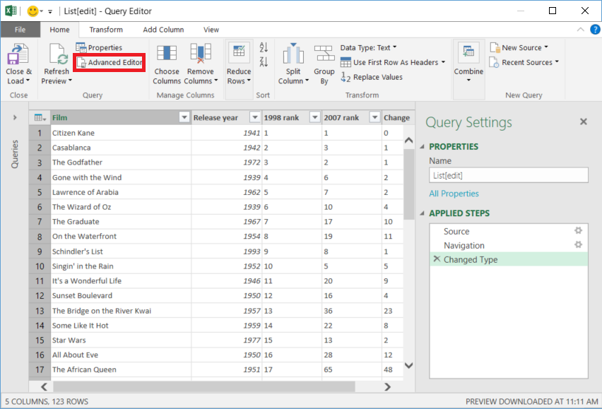
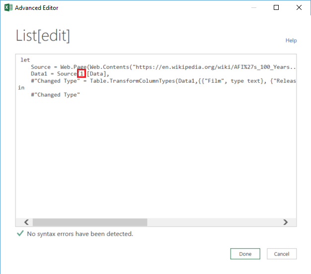

<properties 
    pageTitle="Verschieben von Daten aus der Tabelle "Web" | Factory Azure-Daten" 
    description="Informationen Sie zum Verschieben von Daten aus lokalen einer Tabelle in eine Webseite Azure Data Factory verwenden." 
    services="data-factory" 
    documentationCenter="" 
    authors="linda33wj" 
    manager="jhubbard" 
    editor="monicar"/>

<tags 
    ms.service="data-factory" 
    ms.workload="data-services" 
    ms.tgt_pltfrm="na" 
    ms.devlang="na" 
    ms.topic="article" 
    ms.date="09/26/2016" 
    ms.author="jingwang"/>

# Verschieben von Daten aus einer Web Tabellenquelle Azure Data Factory verwenden
In diesem Artikel wird beschrieben, wie Sie die Aktivität kopieren in einer Factory Azure-Daten zum Kopieren von Daten aus einer Tabelle in eine Webseite in einer anderen Datenspeicher verwenden können. In diesem Artikel wird im Artikel [Daten Bewegung Aktivitäten](data-factory-data-movement-activities.md) , die eine allgemeine Übersicht über das Verschieben von Daten mit Aktivität kopieren und unterstützten Data Store Kombinationen bietet erstellt.

Daten Factory unterstützt derzeit nur verschieben Daten aus einer Webtabelle andere Datenspeicher, aber nicht Verschieben von Daten aus anderen Daten zu einem Web Tabelle Ziel speichert.

> [AZURE.NOTE] Dieser Web-Connector unterstützt derzeit nur extrahieren Tabelleninhalt aus einer HTML-Seite.

## Beispiel: Kopieren Sie Daten aus Webtabelle in Azure Blob

Im folgenden Beispiel gezeigt:

1.  Eine verknüpfte Dienst vom Typ [Web](#web-linked-service-properties).
2.  Eine verknüpfte Dienst vom Typ [AzureStorage](data-factory-azure-blob-connector.md#azure-storage-linked-service-properties).
3.  Eine Eingabe- [Dataset](data-factory-create-datasets.md) vom Typ [WebTable](#WebTable-dataset-properties).
4.  Eine Ausgabe [Dataset](data-factory-create-datasets.md) vom Typ [AzureBlob](data-factory-azure-blob-connector.md#azure-blob-dataset-type-properties).
4.  Eine [Verkaufspipeline](data-factory-create-pipelines.md) mit Aktivität kopieren, die [WebSource](#websource-copy-activity-type-properties) und [BlobSink](data-factory-azure-blob-connector.md#azure-blob-copy-activity-type-properties)verwendet.

Im Beispiel kopiert Daten aus einer Webtabelle in eine Azure Blob stündlich. Die JSON-Eigenschaften, die in diesen Beispielen verwendete werden in den Beispielen folgen Abschnitten beschrieben. 

Im folgende Beispiel veranschaulicht, wie Daten aus einer Webtabelle zu einer Azure Blob zu kopieren. Daten können jedoch direkt auf die im Artikel [Daten Bewegung Aktivitäten](data-factory-data-movement-activities.md) angegeben ist, verwenden Sie die Aktivität kopieren in Azure Data Factory senken kopiert werden. 

**Web verknüpft service** In diesem Beispiel wird den Webdienst verknüpft mit anonyme Authentifizierung. Finden Sie unter [Web verknüpft Dienst](#web-linked-service-properties) Abschnitt für unterschiedliche Arten von Authentifizierung, die Sie verwenden können. 

    {
        "name": "WebLinkedService",
        "properties":
        {
            "type": "Web",
            "typeProperties":
            {
                "authenticationType": "Anonymous",
                "url" : "https://en.wikipedia.org/wiki/"
            }
        }
    }

**Azure verknüpft Speicherdienst**

    {
      "name": "AzureStorageLinkedService",
      "properties": {
        "type": "AzureStorage",
        "typeProperties": {
          "connectionString": "DefaultEndpointsProtocol=https;AccountName=<accountname>;AccountKey=<accountkey>"
        }
      }
    }

**Eingabe WebTable-dataset** **Externe** auf **true** festlegen informiert dem Daten Factory-Dienst an, dass das Dataset externe Daten Fabrik Wert und nicht durch eine Aktivität in der Factory Daten erstellt wird.

> [AZURE.NOTE] Finden Sie [erste Index einer Tabelle in einer HTML-Seite](#get-index-of-a-table-in-an-html-page) im Abschnitt vor, um die erste Index einer Tabelle in einer HTML-Seite.  

    
    {
        "name": "WebTableInput",
        "properties": {
            "type": "WebTable",
            "linkedServiceName": "WebLinkedService",
            "typeProperties": {
                "index": 1,
                "path": "AFI's_100_Years...100_Movies"
            },
            "external": true,
            "availability": {
                "frequency": "Hour",
                "interval":  1
            }
        }
    }

**Azure Blob ausgeben dataset**

Jede Stunde Daten in einer neuen Blob geschrieben (Häufigkeit: Stunde, Intervall: 1). 

    {
        "name": "AzureBlobOutput",
        "properties":
        {
            "type": "AzureBlob",
            "linkedServiceName": "AzureStorageLinkedService",
            "typeProperties":
            {
                "folderPath": "adfgetstarted/Movies"
            },
            "availability":
            {
                "frequency": "Hour",
                "interval": 1
            }
        }
    }

**Pipeline mit Aktivität kopieren**

Der Verkaufspipeline enthält eine Kopie Aktivitäten, die darauf konfiguriert ist, verwenden Sie die oben angegebenen Eingabe und Datasets ausgeben und stündlich ausführen geplant ist. Klicken Sie in der Verkaufspipeline JSON-Definition der Typ der **Quelle** auf **WebSource** festgelegt ist, und Typ der **Empfänger** auf **BlobSink**festgelegt ist. 

Die Liste der Eigenschaften von der WebSource unterstützt finden Sie unter [WebSource Schrifteigenschaften](#websource-copy-activity-type-properties) . 
    
    {  
        "name":"SamplePipeline",
        "properties":{  
        "start":"2014-06-01T18:00:00",
        "end":"2014-06-01T19:00:00",
        "description":"pipeline with copy activity",
        "activities":[  
          {
            "name": "WebTableToAzureBlob",
            "description": "Copy from a Web table to an Azure blob",
            "type": "Copy",
            "inputs": [
              {
                "name": "WebTableInput"
              }
            ],
            "outputs": [
              {
                "name": "AzureBlobOutput"
              }
            ],
            "typeProperties": {
              "source": {
                "type": "WebSource"
              },
              "sink": {
                "type": "BlobSink"
              }
            },
           "scheduler": {
              "frequency": "Hour",
              "interval": 1
            },
            "policy": {
              "concurrency": 1,
              "executionPriorityOrder": "OldestFirst",
              "retry": 0,
              "timeout": "01:00:00"
            }
          }
          ]
       }
    }

## Eigenschaften des verknüpften Web

Die folgende Tabelle enthält eine Beschreibung für den JSON-Elemente, die speziell für verknüpfte Webdienst.

| Eigenschaft | Beschreibung | Erforderlich |
| -------- | ----------- | -------- | 
| Typ | Die Eigenschaft muss auf festgelegt sein: **Web** | Ja | 
| URL | URL der Web-Quelle | Ja |
| authenticationType | Anonyme oder grundlegende. | Ja |
| Benutzername | Der Benutzername für Standardauthentifizierung. | Ja (für Standardauthentifizierung)
| Kennwort | Kennwort für die Standardauthentifizierung. | Ja (für Standardauthentifizierung)

### Anonyme Authentifizierung

    {
        "name": "web",
        "properties":
        {
            "type": "Web",
            "typeProperties":
            {
                "authenticationType": "Anonymous",
                "url" : "https://en.wikipedia.org/wiki/"
            }
        }
    }

### Mithilfe der Standardauthentifizierung
    
    {
        "name": "web",
        "properties":
        {
            "type": "Web",
            "typeProperties":
            {
                "authenticationType": "basic",
                "url" : "http://myit.mycompany.com/",
                "userName": "Administrator",
                "password": "password"
            }
        }
    }

## WebTable Datensatzeigenschaften

Eine vollständige Liste der Abschnitte und Eigenschaften, die zum Definieren von Datasets zur Verfügung finden Sie im Artikel [Datasets erstellen](data-factory-create-datasets.md) . Abschnitte wie Struktur, Verfügbarkeit und Richtlinie eines Datasets JSON ähneln für alle Dataset-Typen (Azure SQL Azure Blob, Azure Table usw..).

Im Abschnitt **TypeProperties** unterscheidet sich für jede Art von Dataset und enthält Informationen über den Speicherort der Daten im Datenspeicher. Im Abschnitt TypeProperties für Dataset vom Typ **WebTable** weist die folgenden Eigenschaften

Eigenschaft | Beschreibung | Erforderlich
:-------- | :----------- | :--------
Typ    | Typ des Datasets. **WebTable** muss festgelegt werden | Ja
Pfad | Ein relativer URL, die der Ressource, die die Tabelle enthält. | Nein. Wenn der Pfad nicht angegeben ist, wird nur die URL, die in der Dienstdefinition verknüpfte angegebenen verwendet. 
Index | Der Index der Tabelle in der Ressource. Finden Sie [erste Index einer Tabelle in einer HTML-Seite](#get-index-of-a-table-in-an-html-page) im Abschnitt vor, um die erste Index einer Tabelle in einer HTML-Seite. | Ja

**Beispiel:**

    {
        "name": "WebTableInput",
        "properties": {
            "type": "WebTable",
            "linkedServiceName": "WebLinkedService",
            "typeProperties": {
                "index": 1,
                "path": "AFI's_100_Years...100_Movies"
            },
            "external": true,
            "availability": {
                "frequency": "Hour",
                "interval":  1
            }
        }
    }

## WebSource - Schrifteigenschaften Aktivität kopieren

Eine vollständige Liste der Abschnitte und Eigenschaften zum Definieren von Aktivitäten verfügbar sind finden Sie unter Artikel [Pipelines erstellen](data-factory-create-pipelines.md) . Eigenschaften wie Name, Beschreibung, Eingabe- und Tabellen und Richtlinie stehen für alle Arten von Aktivitäten. 

Im Abschnitt TypeProperties der Aktivität verfügbaren Eigenschaften variieren andererseits bei jeder Aktivität. Aktivitäten, kopieren variieren je nach den Typen von Datenquellen und senken.

Wenn die Quelle in der Kopie Aktivität vom Typ **WebSource**ist, werden keine zusätzlichen Eigenschaften derzeit unterstützt. 

## Abrufen von Index einer Tabelle in einer HTML-Seite

1. Starten Sie **Excel 2016** , und wechseln Sie zu der Registerkarte **Daten** .  
2. Klicken Sie auf der Symbolleiste auf **Neue Abfrage** , zeigen Sie auf **Aus anderen Quellen** , und klicken Sie auf **Aus dem Web**.
    
     
3. Geben Sie im Dialogfeld **Aus dem Web** **URL** , die Sie in verknüpften JSON-Dienst verwenden möchten (beispielsweise: https://en.wikipedia.org/wiki/) zusammen mit den Pfad, die Sie für das Dataset angeben möchten (zum Beispiel: AFI % 27s_100_Years... 100_Movies), und klicken Sie auf **OK**. 

     

    In diesem Beispiel verwendete URL: https://en.wikipedia.org/wiki/AFI%27s_100_Years...100_Movies 
4.  Wenn **Access von Webinhalten** -Dialogfeld angezeigt wird, wählen Sie die richtige **URL**, **Authentifizierung**, und klicken Sie auf **Verbinden**. 

    
5.  Klicken Sie auf ein Element **Tabelle** finden Sie unter Inhalt aus der Tabelle, und klicken Sie dann auf Schaltfläche **Bearbeiten** , klicken Sie unten in der Strukturansicht.  

     

5. Klicken Sie im **Abfrage-Editor** klicken Sie auf der Symbolleiste auf die Schaltfläche **Erweiterter Editor** .

    

6. Klicken Sie im Dialogfeld Erweiterter Editor ist die Anzahl neben "Quelle" den Index.

     

Wenn Sie Excel 2013 verwenden, verwenden Sie [Microsoft Power Query für Excel](https://www.microsoft.com/download/details.aspx?id=39379) können Sie um den Index zu gelangen. Finden Sie im Artikel Details [zu einer Webseite verbinden](https://support.office.com/article/Connect-to-a-web-page-Power-Query-b2725d67-c9e8-43e6-a590-c0a175bd64d8) . Die beschriebenen Schritte, wenn Sie [Microsoft Power BI für Desktop](https://powerbi.microsoft.com/desktop/)verwenden. 

[AZURE.INCLUDE [data-factory-column-mapping](../../includes/data-factory-column-mapping.md)]

[AZURE.INCLUDE [data-factory-structure-for-rectangualr-datasets](../../includes/data-factory-structure-for-rectangualr-datasets.md)]

## Leistung und optimieren  
Finden Sie unter [Kopieren Aktivität Leistung und Optimieren von Leitfaden für](data-factory-copy-activity-performance.md) die Leistung Einfluss der Daten Bewegung (Kopieren Aktivität) in Azure Data Factory und verschiedene Methoden zum Optimieren sie wichtige Faktoren lernen.
