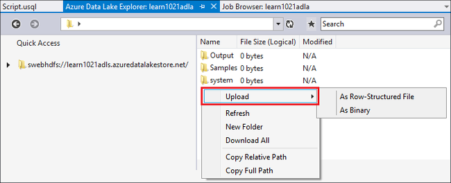
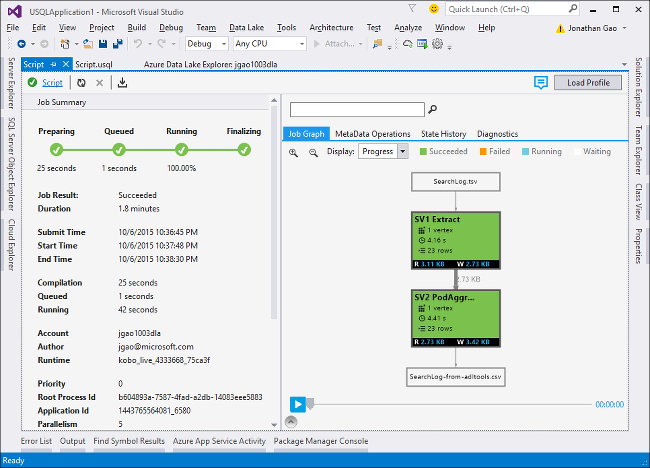

<properties
   pageTitle="Entwickeln Sie U-SQL-Skripts mit dem Datentools für Visual Studio | Azure"
   description="Erfahren Sie, wie Daten dem Tools für Visual Studio, so entwickeln und U-SQL-Testskripts zu installieren. "
   services="data-lake-analytics"
   documentationCenter=""
   authors="edmacauley"
   manager="jhubbard"
   editor="cgronlun"/>

<tags
   ms.service="data-lake-analytics"
   ms.devlang="na"
   ms.topic="get-started-article"
   ms.tgt_pltfrm="na"
   ms.workload="big-data"
   ms.date="05/16/2016"
   ms.author="edmaca"/>

# Lernprogramm: Entwickeln Sie U-SQL-Skripts mit dem Datentools für Visual Studio

[AZURE.INCLUDE [get-started-selector](../../includes/data-lake-analytics-selector-get-started.md)]

Erfahren Sie, wie Daten dem Tools für Visual Studio installiert und dem Datentools für Visual Studio schreiben und Testen U-SQL-Skripts verwenden.

U-SQL ist eine hyper-skalierbare, hochgradig extensible Sprache zur Vorbereitung, Transformieren und Analysieren von alle Daten in den Daten Sees und darüber hinaus. Weitere Informationen finden Sie unter [U-SQL-Referenz] (http://go.microsoft.com/fwlink/p/?LinkId=691348).

##Erforderliche Komponenten

- **Visual Studio 2015, Visual Studio 2013 aktualisieren 4 oder Visual Studio 2012. Enterprise (Ultimate/Premium), Professional, Community-Editionen unterstützte; Express Edition wird nicht unterstützt. Visual Studio "15" wird derzeit nicht unterstützt, und wir arbeiten an, die aus.**
- **Microsoft Azure SDK für .NET Version 2.7.1 oder höher**.  Installieren Sie es über das [Web Plattform Installer](http://www.microsoft.com/web/downloads/platform.aspx)aus.
- Die **[Daten dem Tools für Visual Studio](http://aka.ms/adltoolsvs)**.

    Sobald die Daten dem Tools für Visual Studio installiert ist, sehen Sie einen Knoten "Daten dem Analytics" im Server-Explorer unter dem Knoten "Azure" (Sie können Server-Explorer öffnen, indem Sie Strg + Alt + S drücken).

- **Wechseln Sie in den folgenden zwei Abschnitten in [Erste Schritte mit Azure Daten dem Analytics Azure-Portal verwenden](data-lake-analytics-get-started-portal.md)**.

    - [Erstellen eines Azure Daten dem Analytics-Kontos](data-lake-analytics-get-started-portal.md#create_adl_analytics_account).
    - [SearchLog.tsv zu dem Datenspeicher Standardkonto hochladen](data-lake-analytics-get-started-portal.md#update-data-to-the-default-adl-storage-account).

    Erleichtern kann ein PowerShell-Skript Stichprobe Erstellen eines Diensts Daten dem analytischen und Hochladen der Quelldatei für die Daten in [Appx-A PowerShell Stichproben Vorbereiten auf das Lernprogramm](data-lake-analytics-data-lake-tools-get-started.md#appx-a-powershell-sample-for-preparing-the-tutorial)gefunden werden.

    Die Daten dem Tools unterstützt keine Daten dem Analytics-Konten erstellen. Daher müssen Sie es mithilfe des Azure-Portals Azure PowerShell, .NET SDK oder Azure CLI erstellen. Wenn Sie ein Projekt Daten dem Analytics ausgeführt, benötigen Sie einige Daten. Obwohl die Daten dem Tools Hochladen von Daten unterstützt, werden Sie im Portal verwenden, um die Beispieldaten, um dieses Lernprogramms folgen erleichtern hochzuladen.

## Herstellen einer Verbindung Azure mit

**Verbindung zu Daten dem Analytics**

1. Öffnen Sie Visual Studio.
2. Klicken Sie im Menü **Ansicht** auf **Server-Explorer** um Server-Explorer zu öffnen. Oder drücken Sie die **[STRG] + [ALT] + S**.
3. Mit der rechten Maustaste **Azure**, klicken Sie auf "Verbindung zu Microsoft Azure-Abonnement", und folgen Sie den Anweisungen.
4. **Server-Explorer**erweitern Sie **Azure**und erweitern Sie dann die **Daten dem Analytics**. Eine Liste Ihrer Daten dem Analytics-Konten gilt angezeigt werden, wenn eine vorhanden sind. Sie können keine Daten dem Analytics-Konten von Visual Studio erstellen. Zum Erstellen eines Kontos, finden Sie unter [Erste Schritte mit Azure Daten dem Analytics Azure-Portal verwenden](data-lake-analytics-get-started-portal.md) oder [Erste Schritte mit Azure Daten dem Analytics Azure PowerShell verwenden](data-lake-analytics-get-started-powershell.md).

## Hochladen von Daten-Quelldateien

Sie haben einige Daten im Abschnitt **vorbereitende** zuvor im Lernprogramm hochgeladen.  

Für den Fall, dass Sie Ihre eigenen Daten verwenden möchten, sind hier die Vorgehensweise zum Hochladen von Daten aus der dem Datentools.

**Zum Hochladen von Dateien mit dem abhängige Azure Daten Lake-Konto**

1. Aus dem **Server-Explorer**erweitern Sie nacheinander **Azure**, erweitern Sie die **Daten dem Analytics**, Ihr Konto Daten dem Analytics, **Speicher-Konten**. Sie müssen des Standardkontos dem Datenspeicher und die verknüpften Daten dem Speicher-Konten und die verknüpften Azure-Speicher-Konten finden Sie unter. Das Daten Lake Standardkonto weist eine Bezeichnung "Standardkonto Speicher".
2. Mit der rechten Maustaste in dem Datenspeicher Standardkonto aus, und klicken Sie dann auf **Explorer**.  Es wird die Daten dem Tools für Visual Studio-Explorer-Fenster geöffnet.  In der linken Seite wird einer Strukturansicht die Inhaltsansicht auf der rechten Seite ist.
3. Navigieren Sie zu dem Ordner, in dem Sie Dateien hochladen möchten,
4. Mit der rechten Maustaste in eines leeren Bereich, und klicken Sie dann auf **Hochladen**.

    

**Zum Hochladen von Dateien mit einem verknüpften Azure Blob-Speicher-Konto**

1. Aus dem **Server-Explorer**erweitern Sie nacheinander **Azure**, erweitern Sie die **Daten dem Analytics**, Ihr Konto Daten dem Analytics, **Speicher-Konten**. Sie müssen des Standardkontos dem Datenspeicher und die verknüpften Daten dem Speicher-Konten und die verknüpften Azure-Speicher-Konten finden Sie unter.
2. Erweitern Sie das Konto Azure-Speicher.
3. Mit der rechten Maustaste in des Containers, in dem Sie Dateien hochladen möchten, und klicken Sie dann auf **Explorer**. Wenn Sie einen Container besitzen, müssen Sie zuerst eine mithilfe der Azure-Portal, Azure PowerShell oder andere Tools erstellen.
4. Navigieren Sie zu dem Ordner, in dem Sie Dateien hochladen möchten,
5. Mit der rechten Maustaste in eines leeren Bereich, und klicken Sie dann auf **Hochladen**.

## Entwickeln Sie U-SQL-Skripts

Die Daten dem Analytics Aufträge werden in die Sprache U-SQL geschrieben. Weitere Informationen zu U-SQL finden Sie unter [Erste Schritte mit U-SQL-Sprache](data-lake-analytics-u-sql-get-started.md) und [U-SQL-Sprache-Referenz](http://go.microsoft.com/fwlink/?LinkId=691348).

**Erstellen und Senden eines Auftrags Daten dem Analytics**

1. Im Menü **Datei** klicken Sie auf **neu**, und klicken Sie dann auf **Projekt**.
2. Wählen Sie den **U-SQL** -Projekttyp aus.

    

3. Klicken Sie auf **OK**. Visual Studio erstellt eine Lösung mit einer **Script.usql** -Datei.
4. Geben Sie das folgende Skript in **Script.usql**aus:

        @searchlog =
            EXTRACT UserId          int,
                    Start           DateTime,
                    Region          string,
                    Query           string,
                    Duration        int?,
                    Urls            string,
                    ClickedUrls     string
            FROM "/Samples/Data/SearchLog.tsv"
            USING Extractors.Tsv();

        @res =
            SELECT *
            FROM @searchlog;        

        OUTPUT @res   
            TO "/Output/SearchLog-from-Data-Lake.csv"
        USING Outputters.Csv();

    Dieses U-SQL-Skript liest die Quelldatei mit **Extractors.Tsv()**und erstellt dann eine CSV-Datei mit **Outputters.Csv()**.

    Ändern Sie die beiden Pfade nicht, es sei denn, Sie die Quelldatei in einem anderen Speicherort kopiert.  Daten Lake Analytics erstellt den Ausgabeordner aus, wenn es nicht vorhanden ist.

    Es ist einfacher Verwendung relativer Pfade für Dateien im Standardmodus Daten Lake Konten gespeichert. Sie können auch absolute Pfade verwenden.  Beispielsweise

        adl://<Data LakeStorageAccountName>.azuredatalakestore.net:443/Samples/Data/SearchLog.tsv

    Sie müssen absolute Pfade Zugriff auf Dateien verknüpfte Speicherkonten verwenden.  Die Syntax für Dateien, die in verknüpften Speicher Azure-Konto gespeichert ist:

        wasb://<BlobContainerName>@<StorageAccountName>.blob.core.windows.net/Samples/Data/SearchLog.tsv

    >[AZURE.NOTE] Azure Blob-Container mit öffentlichen Blobs oder öffentlichen Container Zugriffsberechtigungen werden derzeit nicht unterstützt.  

    Beachten Sie die folgenden Features:

    - **IntelliSense**

        Namen automatisch abgeschlossen, und die Mitglieder für Rowset, Klassen, Datenbanken, Schemas und Benutzer definierten Objekten (UDOs) angezeigt werden soll.

        IntelliSense für Katalog Personen (Datenbanken, Schemas, Tabellen, UDOs usw.) ist im Zusammenhang mit Ihrem Konto berechnen. Sie können die aktuellen aktiven berechnen-Konto, Datenbank und das Schema in der oberen Symbolleiste überprüfen und wechseln sie über die Dropdown-Listen.

    - **Erweitern* von Spalten**

        Klicken Sie auf der rechten Seite des *, Sie sind blaue Unterstreichung finden Sie unter der *. Bewegen Sie den Mauszeiger auf der blauen Unterstreichung, und klicken Sie dann auf den Pfeil nach unten.
        

        **Spalten zu erweitern**, klicken Sie auf das Tool ersetzt die * mit den Spaltennamen.

    - **Automatische Formatierung**

        Benutzer können ändert den Einzug des basierend auf dem Code U-SQL-Skripts-Struktur unter Bearbeiten > erweitert:

        - Format-Dokument (STRG + E, D): Formatiert, das ganze Dokument   
        - Auswahl formatieren (STRG + K, STRG + F): Die Auswahl formatiert. Wenn keine Auswahl getroffen wurde, formatiert diese Tastenkombination die Linie, die, der sich der Cursor befindet.  

        Klicken Sie unter Tools können konfiguriert werden, die gesamte Formatierung von Regeln -> Optionen -> Text-Editor - > SIP -> Formatierung.  
    - **Intelligenter Einzug**

        Daten Lake Tools für Visual Studio kann Ausdrücke automatisch Einzug, während Sie Skripts schreiben. Dieses Feature ist standardmäßig deaktiviert, aktivieren Sie zunächst U überprüfen, müssen Benutzer-SQL-Optionen > und Einstellungen -> Optionen -> intelligenten Einzug aktivieren.

    - **Wechseln Sie zur Definition und suchen alle Verweise**

        Mit der rechten Maustaste in des Namens einer RowSet/Parameter/Spalte/UDO usw., und dann auf Gehe zu Definition (F12) können Sie zu deren Definition navigieren. Indem Sie auf alle Verweise suchen (UMSCHALT + F12), werden alle Verweise angezeigt.

    - **Einfügen von Azure Pfad**

        Anstatt Azure Dateipfad und Typ erinnern, manuell, wenn Sie Daten dem Tools für Visual Studio-Skript schreiben bietet eine einfache Möglichkeit: mit der rechten Maustaste im Editor, klicken Sie auf Azure Pfad einfügen. Navigieren Sie zu der Datei im Dialogfeld Azure Blob-Browser. Klicken Sie auf **OK**. der Dateipfad wird in den Code eingefügt.

5. Geben Sie die Daten dem Analytics-Konto, die Datenbank und das Schema. Sie können **(lokal)** zum Ausführen des Skripts lokal für den testen Zweck auswählen. Weitere Informationen finden Sie unter [U-SQL ausführen lokal](#run-u-sql-locally).

    

    Weitere Informationen finden Sie unter [verwenden U-SQL-Katalog](data-lake-analytics-use-u-sql-catalog.md).

5. Mit der rechten Maustaste **Script.usql** **Lösung-Explorer**und klicken Sie dann auf **Skript erstellen**. Überprüfen Sie das Ergebnis im Ausgabebereich aus.
6. **Lösung-Explorer**mit der rechten Maustaste **Script.usql**und klicken Sie dann auf **Skript übermitteln**. Optional können Sie auch **übermitteln** von Script.usql Bereich klicken.  Finden Sie im vorherige Bildschirmfoto.  Klicken Sie auf den Pfeil nach unten neben der Schaltfläche senden, und übermitteln Sie mithilfe der Optionen Advance:
7. **Name der Position**angeben, überprüfen Sie die **Analytics-Konto**, und klicken Sie dann auf **Senden**. Einreichung Ergebnisse und Position Link sind aus den Daten dem Tools für Visual Studio führt Fenster, wenn die Übermittlung abgeschlossen ist.

    

8. Sie müssen die Schaltfläche Aktualisieren, um finden Sie unter der aktuellen Status und Aktualisieren des Bildschirms klicken. Wann wird der Erfolge Auftrag den **Auftrag Graph**, **Metatag Datenoperationen**, **Bundesstaat Verlauf**, **Diagnose**angezeigt:

    

    * Zusammenfassung der Position. Zeigen Sie die Zusammenfassungsinformationen der aktuellen Position, z. B.: Zustand, den Fortschritt, Ausführung dauert, Laufzeit Namen usw. Absender.   
    * Job-Details. Ausführliche Informationen zu diesen Auftrag werden bereitgestellt, einschließlich Skript, Ressourcen, Scheitelpunkt Ausführung anzeigen.
    * Position-Diagramm. Vier Diagramme werden bereitgestellt, um die Informationen des Projekts visualisieren: Fortschritt, Daten lesen, Daten geschrieben, Ausführung dauert, Mittelwert Ausführung dauert pro Knoten, Eingabe Durchsatz, Durchsatz Ausgabe.
    * Metadaten Vorgänge. Es werden alle Vorgänge der Metadaten.
    * Bundesland Verlauf.
    * Diagnose. Daten Lake Tools für Visual Studio wird die Ausführung Auftrags automatisch diagnostizieren. Benachrichtigungen erhalten, wenn es einige Fehler oder Leistungsprobleme in ihre Arbeit gibt. Position Teil Diagnose (TBD-Link) Weitere Informationen finden Sie unter.

**So überprüfen Sie den Job-Status**

1. Vom Server-Explorer erweitern Sie **Azure**, **Daten dem Analytics**, den Daten dem Analytics Kontonamen
2. Doppelklicken Sie auf **Aufträge** , um die Liste der Aufträge.
2. Klicken Sie auf ein Projekt, um den Status anzuzeigen.

**Um die Ausgabe der Position anzuzeigen.**

1. Aus dem **Server-Explorer** **Azure**erweitern, erweitern Sie die **Daten dem Analytics**, erweitern Sie Ihre Daten dem Analytics-Konto, **Speicherkonten**erweitern, mit der rechten Maustaste in dem Datenspeicher Standardkonto und klicken Sie dann auf **Explorer**.
2.  Doppelklicken Sie auf **die Ausgabe** , um den Ordner zu öffnen.
3.  Doppelklicken Sie auf **SearchLog-aus-adltools.csv**.

###Position Wiedergabe

Position Wiedergabe können Sie Ausführung Projektfortschritt ansehen und visuell Leistung Bildschirmdarstellung auftreten und Engpässe erkennen. Dieses Feature kann verwendet werden, bevor Auftragsabschluss Ausführung (d. h. während der Zeit, die der Auftrag aktiv ausgeführt wird) als auch nach Abschluss die Ausführung. Wiedergabe während der Ausführung des Auftrags ausführen lässt, dass den Benutzer den Fortschritt auf die aktuelle Uhrzeit wiedergeben.

**Anzeigen des Ausführung Projektstatus**  

1. Klicken Sie auf der oberen rechten Ecke auf **Profil laden** . Finden Sie in der vorherigen Screenshot.
2. Klicken Sie auf die Wiedergabeschaltfläche klicken Sie auf der unteren linken Ecke, um die Ausführung des Projektstatus zu überprüfen.
3. Während der Wiedergabe klicken Sie auf **Anhalten** , um es zu beenden oder die Statusanzeige direkt an eine bestimmte Position zu ziehen.

###Wärmebilds

Daten Lake Tools für Visual Studio bietet auswählbaren Farbe-überlagert an Auftrag an, den Fortschritt, Daten i/o, Ausführung dauert, e/a-Durchsatz der einzelnen Phasen. Durch diese können Benutzer direkt und intuitiv potenzieller Probleme und Verteilung der Auftrag-Eigenschaften ermitteln. Wählen Sie eine Datenquelle aus der Dropdownliste angezeigt werden.  

## Führen Sie die SQL-U lokal

Verwenden die U-SQL lokale Benutzeroberfläche in Visual Studio ausführen, können Sie die folgenden Schritte ausführen:

- Führen Sie lokal, U-SQL-Skripts zusammen mit C#-Assemblys aus.
- Debuggen Sie C#-Assemblys lokal.
- Lokale Datenbanken erstellen/löschen/Ansicht, Assemblys, Schemas und Tabellen im Server-Explorer genauso wie möglich für Azure Daten dem Analytics-Dienst.

Sehen Sie ein *Lokales* Konto in Visual Studio, und das Installationsprogramm erstellt eine *DataRoot* Ordner ansässig *C:\LocalRunRoot*. Der Ordner DataRoot wird verwendet:

- Store Metadaten einschließlich Tabellen, Datenbanken, Runtime(CLR)-TVFs usw..
- Für eine bestimmte Skript: Wenn ein relativer Pfad in/Ausgang Pfaden verwiesen wird, wir werden Nachschlagen der DataRoot (wie bei Pfad des Skripts, wenn die It Eingabe des)
- Der Ordner DataRoot wird nicht verwiesen werden, wenn Sie versuchen, eine Assembly registrieren, und verwenden einen relativen Pfad (siehe "Verwenden von Assemblys ausführen beim lokalen ausführen" Webpart für weitere Details)

Das folgende Video wird gezeigt, das lokale Ausführen U-SQL-Feature:

>[AZURE.VIDEO usql-localrun]

### Bekannte Probleme und Einschränkungen

- Tabelle/DB usw. können keine im Server-Explorer für das lokale Konto erstellt werden.
- Wenn ein relativer Pfad verwiesen wird:

    - In Skript Eingabe (EXTRAHIEREN * FROM "/ Pfad/Abc") – der DataRoot Pfad und den Skriptpfad durchsucht.
    - In der Ausgabe des Skripts (Ausgabe in "Pfad/Abc"): als Ausgabeordner der Pfad DataRoot verwendet werden.
    - In Assemblyregistrierung (CREATE ASSEMBLY Xyz aus "/ Path/Abc"): der Skriptpfad werden durchsucht, aber nicht die DataRoot.
    - In registriert Tabellenwertfunktion/Ansicht oder anderen Personen Metadaten: den Pfad DataRoot werden durchsucht, aber nicht den Pfad.

    Für Skripts auf Daten Lake Dienst ausgeführt wurde, Speicher Standardkonto wird als Stammordner verwendet und entsprechend durchsucht werden sollen.

### Testen Sie lokal U-SQL-Skripts
Anweisungen zum Entwickeln von U-SQL-Skripts finden Sie unter [entwickeln U-SQL-Skripts](#develop-and-test-u-sql-scripts). So erstellen und Ausführen von U-SQL-Skripts lokal, wählen Sie in der Dropdownliste Cluster **(lokal)** aus, und klicken Sie auf **Absenden**. Stellen Sie sicher, dass Sie die richtigen Daten auf die verwiesen wird - entweder finden Sie in den absoluten Pfad oder setzen Sie die Daten unter dem Ordner DataRoot.

Sie können auch mit der rechten Maustaste ein Skript und dann klicken Sie im Kontextmenü auf **Lokale planen ausführen** , oder drücken Sie **STRG + F5** , um Trigger lokale ausführen.

### Verwenden von Assemblys in lokalen ausführen

Es gibt zwei Verfahren zum Ausführen von angepassten C#-Dateien aus:

- Schreiben von Assemblys CodeBehind-Datei, und die Assemblys automatisch registriert und werden gelöscht, nachdem Sie das Skript abgeschlossen ist.
- Erstellen Sie einer C#-Assemblyprojekt und registrieren Sie die Ausgabe Dll mit dem lokalen Konto über ein Skript wie unter. Bitte beachten Sie, dass der Pfad relativ zum das Skript statt in den Ordner DataRoot an.

### Debuggen von Skripts und C#-Assemblys lokal

Sie können C#-Assemblys Debuggen, ohne übermitteln und zum Azure Daten dem Analytics Dienst registrieren. Sie können Haltepunkte sowohl die CodeBehind-Datei und in einem verwiesen wird C#-Projekt festlegen.

**Debuggen lokalen Code in CodeBehind-Datei**
1.  Legen Sie Haltepunkte in der CodeBehind-Datei ein.
2.  Drücken Sie **F5** , um das Skript lokal Debuggen aus.

Das folgende Verfahren funktioniert nur in Visual Studio 2015. In älteren Visual Studio müssen Sie möglicherweise die Pdb-Dateien manuell hinzufügen.

**Lokalen Code in einem verwiesen wird C#-Projekt debuggen**
1.  Erstellen Sie einer C#-Assemblyprojekt und erstellen Sie, um die Ausgabe Dll generieren.
2.  Registrieren Sie die Dll mit einer U-SQL-Anweisung ein:

        CREATE ASSEMBLY assemblyname FROM @"..\..\path\to\output\.dll";
3.  Legen Sie Haltepunkte in der C#-Code ein.
4.  Drücken Sie **F5** , um das Skript mit Verweisen auf die C#-Dll lokal Debuggen aus.  

##Siehe auch

Um mit Daten dem Analytics verschiedene Tools verwenden anzufangen, finden Sie unter:

- [Erste Schritte mit Daten dem Analytics mit Azure-portal](data-lake-analytics-get-started-portal.md)
- [Erste Schritte mit Daten dem Analytics mithilfe der PowerShell Azure](data-lake-analytics-get-started-powershell.md)
- [Erste Schritte mit Daten dem Analytics mit .NET SDK](data-lake-analytics-get-started-net-sdk.md)
- [Debuggen von C#-Code in U-SQL-Aufträge](data-lake-analytics-debug-u-sql-jobs.md)

Um weitere Themen zur Entwicklung finden Sie unter:

- [Analysieren von Daten dem Analytics mit Blogs](data-lake-analytics-analyze-weblogs.md)
- [Entwickeln Sie U-SQL-Skripts mit dem Datentools für Visual Studio](data-lake-analytics-data-lake-tools-get-started.md)
- [Erste Schritte mit Azure Daten dem Analytics U-SQL-Sprache](data-lake-analytics-u-sql-get-started.md)
- [Entwickeln Sie U-SQL benutzerdefinierte Operatoren für Daten dem Analytics Aufträge](data-lake-analytics-u-sql-develop-user-defined-operators.md)

##Vorbereiten des Lernprogramms AppX A PowerShell Stichproben

Das folgende PowerShell-Skript vorbereitet ein Azure Daten dem Analytics-Konto und die Quelldaten für Sie, damit Sie zur [entwickeln U-SQL-Skripts](data-lake-analytics-data-lake-tools-get-started.md#develop-u-sql-scripts)springen können.

    #region - used for creating Azure service names
    $nameToken = "<Enter an alias>"
    $namePrefix = $nameToken.ToLower() + (Get-Date -Format "MMdd")
    #endregion

    #region - service names
    $resourceGroupName = $namePrefix + "rg"
    $dataLakeStoreName = $namePrefix + "adas"
    $dataLakeAnalyticsName = $namePrefix + "adla"
    $location = "East US 2"
    #endregion

    # Treat all errors as terminating
    $ErrorActionPreference = "Stop"

    #region - Connect to Azure subscription
    Write-Host "`nConnecting to your Azure subscription ..." -ForegroundColor Green
    try{Get-AzureRmContext}
    catch{Login-AzureRmAccount}
    #endregion

    #region - Create an Azure Data Lake Analytics service account
    Write-Host "Create a resource group ..." -ForegroundColor Green
    New-AzureRmResourceGroup `
        -Name  $resourceGroupName `
        -Location $location

    Write-Host "Create a Data Lake account ..."  -ForegroundColor Green
    New-AzureRmDataLakeStoreAccount `
        -ResourceGroupName $resourceGroupName `
        -Name $dataLakeStoreName `
        -Location $location

    Write-Host "Create a Data Lake Analytics account ..."  -ForegroundColor Green
    New-AzureRmDataLakeAnalyticsAccount `
        -Name $dataLakeAnalyticsName `
        -ResourceGroupName $resourceGroupName `
        -Location $location `
        -DefaultDataLake $dataLakeStoreName

    Write-Host "The newly created Data Lake Analytics account ..."  -ForegroundColor Green
    Get-AzureRmDataLakeAnalyticsAccount `
        -ResourceGroupName $resourceGroupName `
        -Name $dataLakeAnalyticsName  
    #endregion

    #region - prepare the source data
    Write-Host "Import the source data ..."  -ForegroundColor Green
    $localFolder = "C:\Tutorials\Downloads\" # A temp location for the file.
    $storageAccount = "adltutorials"  # Don't modify this value.
    $container = "adls-sample-data"  #Don't modify this value.

    # Create the temp location  
    New-Item -Path $localFolder -ItemType Directory -Force

    # Download the sample file from Azure Blob storage
    $context = New-AzureStorageContext -StorageAccountName $storageAccount -Anonymous
    $blobs = Azure\Get-AzureStorageBlob -Container $container -Context $context
    $blobs | Get-AzureStorageBlobContent -Context $context -Destination $localFolder

    # Upload the file to the default Data Lake Store account    
    Import-AzureRmDataLakeStoreItem -AccountName $dataLakeStoreName -Path $localFolder"SearchLog.tsv" -Destination "/Samples/Data/SearchLog.tsv"

    Write-Host "List the source data ..."  -ForegroundColor Green
    Get-AzureRmDataLakeStoreChildItem -Account $dataLakeStoreName -Path  "/Samples/Data/"
    #endregion
