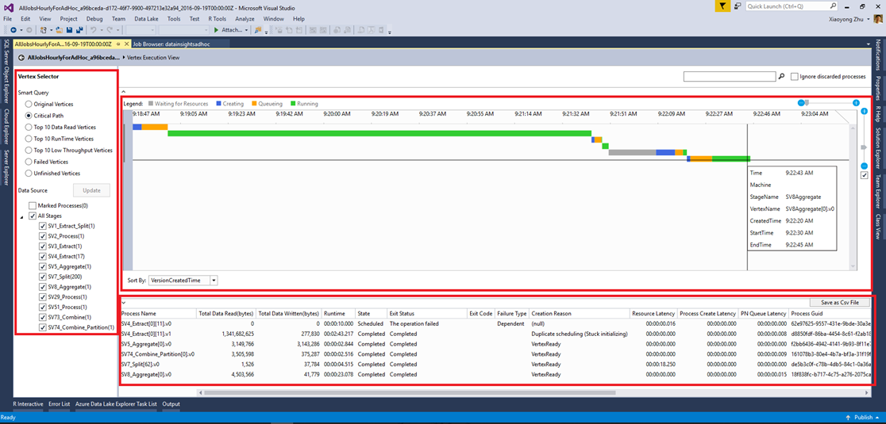

<properties 
   pageTitle="Verwenden die Ansicht Scheitelpunkt Ausführung in Lake Datentools für Visual Studio | Microsoft Azure" 
   description="Erfahren Sie, wie die Scheitelpunkt Ausführung Ansicht Prüfung Daten dem Analytics Projekten verwenden." 
   services="data-lake-analytics" 
   documentationCenter="" 
   authors="mumian" 
   manager="jhubbard" 
   editor="cgronlun"/>
 
<tags
   ms.service="data-lake-analytics"
   ms.devlang="na"
   ms.topic="article"
   ms.tgt_pltfrm="na"
   ms.workload="big-data" 
   ms.date="10/13/2016"
   ms.author="jgao"/>

# Verwenden der Ansicht Ausführung Scheitelpunkt in Lake Datentools für Visual Studio

Erfahren Sie, wie die Scheitelpunkt Ausführung Ansicht Prüfung Daten dem Analytics Projekten verwenden.

## Erforderliche Komponenten

- Einige grundlegende Kenntnisse mit dem Datentools für Visual Studio um U-SQL-Skript zu entwickeln.  Finden Sie unter [Lernprogramm: Entwickeln U-SQL-Skripts mit dem Datentools für Visual Studio](data-lake-analytics-data-lake-tools-get-started.md).

## Öffnen der Ausführung Scheitelpunkt

Für ein bestimmtes Projekt können Sie den Link "Scheitelpunkt Ausführung Ansicht" in der unteren linken Ecke klicken. Sie möglicherweise aufgefordert, zuerst Laden von Profilen und dauert einige Zeit abhängig von der Netzwerkkonnektivität.

## Grundlegendes zu Scheitelpunkt Ausführung anzeigen

Nach der Eingabe der Scheitelpunkt Ausführung Ansicht, gibt es drei Teilen:

- Scheitelpunkt Ansichtsauswahl: auf der linken Seite ist der Ansichtsauswahl Scheitelpunkt.  Sie können die Scheitelpunkte von Features auswählen (z. B. Top 10-Daten lesen, oder wählen Sie Stufe).

    Eine der am häufigsten verwendeten verwendeten Filter ist die Scheitelpunkte auf dem kritischen Weg. Kritischer Weg ist der längsten Pfad eines Auftrags U-SQL. Es ist sinnvoll, für Ihre Aufträge optimieren, indem Sie überprüfen, welche Scheitelpunkt die längste Zeit in Anspruch nimmt.

- Klicken Sie im Bereich oben in der Mitte:

    

    Diese Ansicht enthält auch den laufenden Status der alle Scheitelpunkte. Wandelt entsprechend die Uhrzeit auf dem lokalen Computer sowie zeigt verschiedene Status in unterschiedlichen Farben.

- Im mittleren Bereich von unten:

    

    - Name des Prozesses: Der Name der Instanz Scheitelpunkt. Es besteht aus unterschiedlichen Bereichen in StageName | VertexName | VertexRunInstance. Beispielsweise der SV7_Split [62] .v1 Scheitelpunkt steht für die zweite Instanz eines laufenden (.v1, Index beginnt mit 0) Scheitelpunkt Zahl 62 Phase SV7_Split.
    - Total Daten schreibgeschützt: Die Daten wurde durch diese Eckpunkts gelesen/geschrieben.
    - Bundesstaat/beenden Status: Der endgültigen Status bei der Scheitelpunkt eingestellt ist.
    - Beenden Code/Fehlertyp: Der Fehler bei der Scheitelpunkt fehlgeschlagen ist.
    - Grund der Erstellung: Warum der Scheitelpunkt erstellt wurde.
    - Ressource Wartezeit/Prozess Wartezeit/TN Warteschlange Wartezeit: die Zeit für den Scheitelpunkt für Ressourcen, warten, Daten zu verarbeiten, und klicken Sie in der Warteschlange bleiben.
    - GUID der Prozess/Ersteller: GUID für den aktuellen laufenden Scheitelpunkt oder seinen Ersteller.
    - Version: der N-ter-Instanz von den laufenden Scheitelpunkt (das System möglicherweise neue Instanzen von eines Eckpunkts planen, für viele Gründe, beispielsweise Failover, Redundanz usw. zu berechnen.)
    - Version Mal erstellt.
    - Verarbeiten erstellen Start Uhrzeit/Prozess in Warteschlange Uhrzeit/Prozess Start Uhrzeit/Prozess abgeschlossen Uhrzeit: Wenn die Scheitelpunkt Erstellung; startet Beim Starten des Prozesses Scheitelpunkt Warteschlange; Wenn die bestimmte Scheitelpunkt startet; Wenn die bestimmte Scheitelpunkt abgeschlossen ist.

## Nächste Schritte

- Um einen Überblick über die Daten dem Analytics zu gelangen, finden Sie unter [Übersicht über die Azure Daten dem Analytics](data-lake-analytics-overview.md).
- Um anzufangen U SQL Anwendungen entwickeln, finden Sie unter [entwickeln U-SQL-Skripts, die mit dem Datentools für Visual Studio](data-lake-analytics-data-lake-tools-get-started.md).
- U-SQL finden Sie unter [Erste Schritte mit Azure Daten dem Analytics U-SQL-Sprache](data-lake-analytics-u-sql-get-started.md).
- Verwaltungsaufgaben finden Sie unter [Verwalten von Azure Daten dem Analytics verwenden Azure-Portal](data-lake-analytics-manage-use-portal.md).
- Zum Melden von Diagnoseinformationen finden Sie unter [Zugreifen auf Diagnose Protokolle für Azure Daten dem Analytics](data-lake-analytics-diagnostic-logs.md)
- Eine komplexe Abfrage finden Sie unter [Analysieren Website Protokolle Azure Daten dem Analytics verwenden](data-lake-analytics-analyze-weblogs.md).
- Job-Details finden Sie unter [verwenden Position im Browser und in Auftrag Ansicht für Azure Daten dem Analytics Aufträge](data-lake-analytics-data-lake-tools-view-jobs.md)