<properties 
   pageTitle="Verwenden Sie Position im Browser und in Auftrag Ansicht für Azure Daten dem Analytics Aufträge | Microsoft Azure" 
   description="Informationen Sie zum Auftrag im Browser und in Auftrag Ansicht für Azure Daten dem Analytics Projekte verwenden. " 
   services="data-lake-analytics" 
   documentationCenter="" 
   authors="mumian" 
   manager="jhubbard" 
   editor="cgronlun"/>
 
<tags
   ms.service="data-lake-analytics"
   ms.devlang="na"
   ms.topic="article"
   ms.tgt_pltfrm="na"
   ms.workload="big-data" 
   ms.date="10/17/2016"
   ms.author="jgao"/>

# Verwenden Sie Position im Browser und in Auftrag Ansicht für Azure Daten dem Analytics Aufträge

Der Dienst Azure Daten dem Analytics archiviert die übermittelten Projekte in einer [Abfrage zu speichern](#query-store). In diesem Artikel erfahren Sie, wie Position im Browser und in Auftrag anzeigen in Azure Daten dem Tools für Visual Studio verwenden, zurückliegende Auftragsinformationen zu finden. 

Standardmäßig archiviert der Daten dem Analytics-Dienst die Einzelvorgänge 30 Tage lang. Die Gültigkeitsdauer kann vom Azure-Portal konfiguriert werden, indem Sie die angepasste Ablaufrichtlinie konfigurieren. Sie werden nicht auf die Position Informationen nach Ablauf zugreifen können. 

## Erforderliche Komponenten

Finden Sie unter [Dem Datentools für Visual Studio-Erforderliche Komponenten](data-lake-analytics-data-lake-tools-get-started.md#prerequisites).

## Öffnen Sie den Auftrag Browser

Im Auftrag Browser zugegriffen werden per **Server-Explorer > Azure > Daten dem Analytics > Aufträge** in Visual Studio.  Im Browser können Sie die Abfrage Speichern eines Kontos Daten dem Analytics zugreifen. Position Browser zeigt die Abfrage Store in der linken Seite die grundlegenden Informationen zu Aufträge und Position der Ansicht auf der rechten Seite die detaillierte Informationen über ein Projekt anzeigt.

## Position anzeigen

Position Ansicht zeigt die detaillierte Informationen eines Auftrags. Klicken Sie zum Öffnen eines Projekts können Sie doppelklicken Sie auf eine Position im Auftrag Browser, oder öffnen Sie sie aus dem Menü Daten Lake durch Klicken auf die Position anzeigen. Ein Dialogfeld mit den Auftrag URL aufgefüllt sollte angezeigt werden.

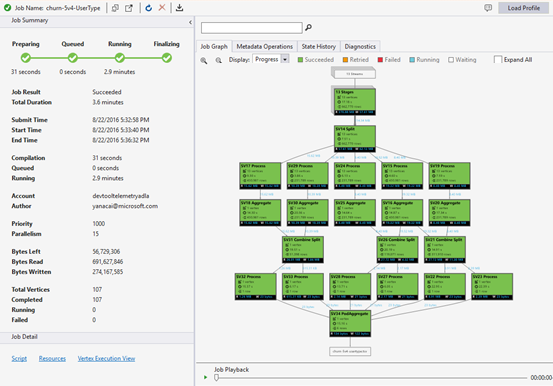

Position Ansicht enthält:

- Zusammenfassung der Position

    Aktualisieren Sie den Auftrag Ansicht finden Sie weitere aktuelle Informationen der ausgeführten Aufträge.

    - Projektstatus (Größenachse):

        Projektstatus werden die Phasen Position:

        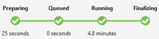

        - Vorbereiten: Hochladen Sie Ihr Skript in der Cloud, kompilieren und optimieren das Skript mithilfe des Diensts für Kompilierung.
        - In der Warteschlange: Aufträge werden in der Warteschlange Molke, die sie zur genügend Ressourcen anstehen, oder die Einzelvorgänge überschreiten die maximale gleichzeitige Einzelvorgänge pro Konto Einschränkung. Die Einstellung für die Priorität bestimmt die Reihenfolge der Aufträge – je niedriger der Wert, desto höher die Priorität.
        - Ausführung: Der Auftrag wird in Ihrem Konto Daten dem Analytics tatsächlich ausgeführt.
        - Abschließen der: Der Auftrag ist (beispielsweise die Datei abschließen) durchführen.

        Das Projekt kann in jeder Phase fehl. Angenommen, eine Kompilierungsfehler in der Phase vorbereiten, Timeoutfehler in einer Phase in Warteschlange und Fehler bei der Ausführung im Ausführung Phase, usw..

    - Grundlegende Informationen

        Die grundlegende Aufgabe Informationen werden im unteren Teil des Bereichs Auftrag Zusammenfassung.

        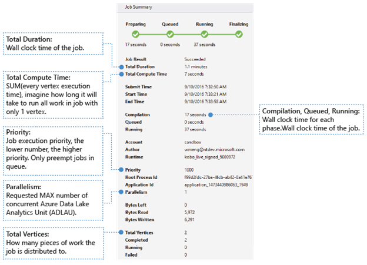
        
        - Position Ergebnis: Erfolgreich war oder nicht. Das Projekt kann in jeder Phase ein Fehler auftreten.
        - Gesamtdauer: Wand Systemzeit (Dauer) zwischen übermitteln Zeit und die Endzeit.
        - Berechnen Gesamtzeit: Die Summe von jedem Ausführung Scheitelpunkt, können Sie es als die Zeit berücksichtigen, die der Auftrag in nur eine Scheitelpunkt ausgeführt wird. Scheitelpunkte gesamt finden Sie weitere Informationen zu den Scheitelpunkt finden Sie unter.
        - : Übermitteln/Anfangs-/Ende die Uhrzeit beim Dienst Daten dem Analytics Auftrag Einreichung/startet den Auftrag/enden den Auftrag erfolgreich oder nicht ausführen empfängt.
        - Eine Kompilierung/in Warteschlange/Ausführung: Wand Uhr Zeit der Phase vorbereiten/in Warteschlange/Ausführung.
        - Konto: Die Daten dem Analytics-Konto zum Ausführen des Auftrags verwendet.
        - Autor: Den Benutzer, den Auftrag übermittelt, sind möglich einer realen Person oder ein Benutzerkonto System.
        - Priority: Die Priorität des Projekts. Je niedriger der Wert, desto höher die Priorität. Er wirkt sich nur auf die Reihenfolge der Einzelvorgänge in der Warteschlange. Festlegen höheren Priorität laufenden Einzelvorgänge nicht trennen.
        - Parallelität: Die angeforderte maximale Anzahl von gleichzeitigen Azure Daten dem Analytics Einheiten (ADLAUs), QuickInfos Eckpunkte. Aktuell, einen Scheitelpunkt ist gleich ein virtueller Computer mit zwei virtuelle Core und sechs GB RAM, obwohl dies aktualisiert werden konnten in Zukunft Daten dem Analytics aktualisiert.
        - Links Bytes: Bytes, die verarbeitet werden müssen, bis der Auftrag abgeschlossen ist.
        - Bytes gelesen/geschrieben: Bytes, die gelesen/geschrieben seit den Auftrag Schritte ausgeführt wurden.
        - Gesamte Scheitelpunkte: der Auftrag ist in vielen Bestandteile der Arbeit aufgeteilt, jeden Teil der Arbeit ein Eckpunkts aufgerufen wird. Dieser Wert beschreibt, wie viele Bestandteile der Arbeit, die von der Auftrag besteht aus. Können Sie einen Eckpunkt als Einheit einfacher Prozess, QuickInfos Azure Daten dem Analytics Einheit (ADLAU), berücksichtigen und Eckpunkte in Parallelism ausgeführt werden können. 
        - Abgeschlossen/Ausführung/fehlgeschlagen: Die Anzahl der Eckpunkte abgeschlossen / / Fehler beim Ausführen. Scheitelpunkte können schlägt fehl, weil beide User Code und System-Fehler, aber das System Wiederholungsversuche Scheitelpunkte konnte nicht automatisch ein paar Mal. Wenn Sie der Scheitelpunkt weiterhin nach Wiederholung fehlgeschlagen ist, wird das gesamte Projekt fehl.

- Position-Diagramm

    Ein U-SQL-Skript stellt die Logik der Transformieren von Eingabedaten zu Ausgabedaten. Das Skript ist kompiliert und zu einem Ausführungsplan physische in der Phase vorbereiten optimiert. Position Graph besteht darin, den Ausführungsplan physische anzeigen.  Das folgende Diagramm veranschaulicht den Prozess:

    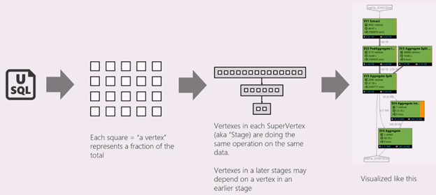

    Ein Projekt ist in vielen Bestandteile der Arbeit aufgeteilt. Jedes Teil der Arbeit heißt ein Eckpunkts. Die Scheitelpunkte sind als Super Scheitelpunkt (QuickInfos Phase) gruppiert, und als Auftrag Graph visualisiert. Die Phasen Anzeigen der grünen Phase Placards im Auftrag Diagramm

    Jeder Scheitelpunkt in einer Phase ist die gleiche Arten von Arbeiten mit verschiedenen Teile der gleichen Daten ausführen. Wenn Sie eine Datei mit einem TB Daten haben und es gibt hundert Scheitelpunkte daraus lesen, wird jede von ihnen beispielsweise einen Ausschnitt lesen. Diese Eckpunkte sind in derselben Phase und dadurch identisch zu verschiedenen Teilen der gleichen Eingabewerte Datei arbeiten gruppiert.

    - Phase Informationen

        In einer bestimmten Phase werden einige Zahlen in der Placard angezeigt.

        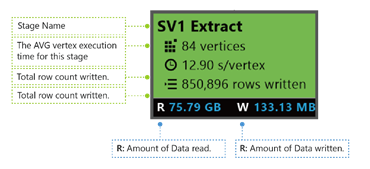

        - Sv1 erstellt Extrahieren: der Name einer Phase, die mit dem Namen, indem Sie eine Zahl und der Vorgang Methode.
        - 84 Scheitelpunkte: die Gesamtzahl der Eckpunkte in dieser Phase. In der Abbildung zeigt an, wie viele Bestandteile der Arbeit in dieser Phase dividiert wird.
        - 12.90 s/Scheitelpunkt: die Zeitdauer für die Ausführung von Mittelwert Scheitelpunkt für diese Stufe. Diese Abbildung wird berechnet, indem die Summe (jedes Mal Scheitelpunkt Ausführung) / (Gesamtzahl der Scheitelpunkt). Was bedeutet, dass Sie alle in Parallelism ausgeführt Scheitelpunkte konnte zuweisen, wird für die gesamte Phase in 12.90 abgeschlossen s. Daher auch wenn alle die Arbeit in dieser Phase seriell ausgeführt wird, wäre die Kosten #vertices * Mittelwert der Zeit.
        - 850,895 Zeilen geschrieben: Gesamtzahl der Zeile in dieser Phase geschrieben wurde.
        - R/b Datenmenge gelesen/geschrieben in dieser Phase in Byte.
        - Farben: Farben sind in der Phase verwendet, um die verschiedenen Scheitelpunkt Status angeben.

            - Grün zeigt an, dass der Scheitelpunkt wurde erfolgreich abgeschlossen ist.
            - Orange zeigt an, dass der Scheitelpunkt wiederholt wird. Der wiederholt Scheitelpunkt ist ein Fehler aufgetreten, doch wird durch das System automatisch und erfolgreich wiederholt, und die generelle Phase erfolgreich abgeschlossen wurde. Wenn Sie der Scheitelpunkt wiederholt aber weiterhin fehlgeschlagen ist, wird die Farbe Rot und das gesamte Projekt fehlgeschlagen ist.
            - Rot zeigt Fehler beim, was bedeutet, dass bestimmte eines Eckpunkts hatte wurde wiederholt mehrmals vom System jedoch weiterhin fehlgeschlagen ist. Dieses Szenario bewirkt, dass das gesamte Projekt fehlschlägt.
            - Blau bedeutet, dass bestimmte eines Eckpunkts ausgeführt wird.
            - Weiß zeigt an, den Scheitelpunkt wartet. Der Scheitelpunkt möglicherweise warten auf werden geplant werden, nachdem ein ADLAU verfügbar wird, oder es möglicherweise auf Eingabe warten werden, da deren Eingabedaten möglicherweise nicht bereit.

        Finden Sie weitere Details für die betreffende Phase, durch bewegen den Mauszeiger nach einem Zustand:

        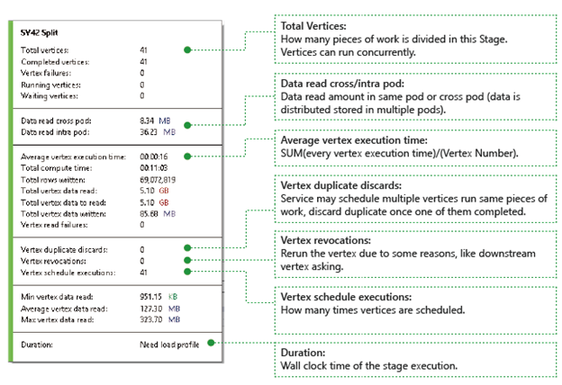

    - Scheitelpunkte: Beschreibt die Scheitelpunkte Details, wie viele Scheitelpunkte insgesamt, wie viele Scheitelpunkte abgeschlossen haben, sind beispielsweise diese fehlgeschlagen ist oder weiterhin Ausführung/wartet usw. an.
    - Lesen von Daten übergreifend/innerhalb Pod: Dateien und Daten werden in verteilten Dateisystem in mehreren folgende gespeichert. Der Wert hier beschrieben, wie viele Daten in der gleichen Pod oder cross Pod gelesen wurde.
    - Berechnen Gesamtzeit: die Summe von jedem Ausführung Scheitelpunkt, in der Phase, Sie können Beachten sie die Zeit, die es würde, wenn alle in der Phase Arbeiten in nur eine Scheitelpunkt ausgeführt wird.
    - Daten und Zeilen geschrieben/gelesen: Zeigt an, wie viel Daten Zeilen wurden gelesen/geschrieben oder gelesen werden müssen.
    - Scheitelpunkt Fehler beim Lesen: Beschreibt, wie viele Scheitelpunkte während gelesenen Daten durchgeführt wurde.
    - Doppelte Scheitelpunkt verwirft: ein Eckpunkts zu langsam wird ausgeführt, kann das System mehrere Scheitelpunkte zum Ausführen der gleichen Teil der Arbeit planen. Nachdem Sie einen der Eckpunkte erfolgreich abgeschlossen werden Reductant Eckpunkte verworfen. Doppelte verwirft Scheitelpunkt Einträge die Anzahl der Eckpunkte, die in der Phase als doppelten verworfen werden.
    - Scheitelpunkt Revocations: der Scheitelpunkt war erfolgreich, aber erhalten erneut einige aus Gründen später ausführen. Wenn untergeordneten Scheitelpunkt zwischen-XT für Eingabedaten verliert, wird es beispielsweise den übergeordneten Scheitelpunkt erneut ausgeführt lassen.
    - Scheitelpunkt Terminplan Ausführungen: die Gesamtzeit, die die Scheitelpunkte geplant wurden.
    - Min/Mittelwert/Max Scheitelpunkt Daten lesen: das Minimum/Maximum/Mittelwert von jeder Scheitelpunkt Daten lesen.
    - Dauer: Die Wand Uhr eine Phase dauert, müssen Sie diesen Wert finden Profil zu laden.

    - Position Wiedergabe

        Daten Lake Analytics führt Aufträge und archiviert die Scheitelpunkte Informationen der Einzelvorgänge, z. B. ausgeführt, wenn die Scheitelpunkte beendet, gestartet werden, fehlgeschlagen ist und wie diese sind erneut versucht, usw.. Alle Informationen automatisch in den Abfrage-Store protokolliert und in deren Auftrag Profil gespeichert. Sie können das Profil Auftrag über "Laden Profil" im Auftrag Ansicht herunterladen und können Sie den Auftrag Wiedergabe nach dem Herunterladen der Position Profil anzeigen.

        Position Wiedergabe ist eine Visualisierung verkörpert der geblieben im Cluster. Es hilft Ihnen bei der Ausführung Projektfortschritt ansehen und visuell Leistung Bildschirmdarstellung auftreten und Engpässe in kürzester Zeit (weniger als 30s normalerweise) erkennen.

    - Position Wärme Karte anzeigen 

        Auftrag Wärmebilds kann in der Dropdownliste Anzeige im Auftrag Diagramm ausgewählt werden. 
        
        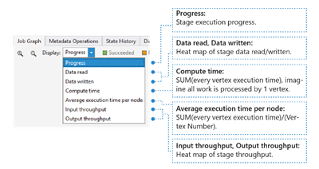

        Es wird der ein-/Ausgabe, Zeit und Durchsatz wärmebilds eines Auftrags, über den Sie können finden, der Auftrag für die meiste Zeit benötigt, oder gibt an, ob Ihre Aufgabe einer e/a-Begrenzungslinie Auftrag ist usw..

        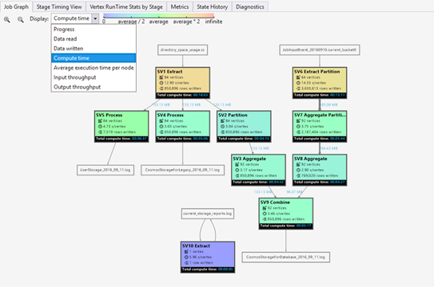
        
        - Status: Die Ausführung des Auftrags Fortschreiten, finden Sie unter Informationen in der [Phase Informationen](#stage-information).
        - Daten gelesen/geschrieben: die wärmebilds total Daten in den einzelnen Phasen gelesen/geschrieben.
        - Zeit zu berechnen: die wärmebilds Summe (jedes Mal Scheitelpunkt Ausführung), Sie können Antwort auf diese Frage wie lange dauert, wenn alle Arbeit in der Phase mit nur 1 Scheitelpunkt ausgeführt wird.
        - Durchschnittliche Ausführung Zeit pro Knoten: die wärmebilds Summe (jedes Mal Scheitelpunkt Ausführung) / (Scheitelpunkt Zahl). D. h., wenn Sie alle Scheitelpunkte in Parallelism ausgeführt zuweisen konnte, wird für die gesamte Phase in diesem Zeitrahmen erfolgen.
        - Ein-/Ausgabe Durchsatz: der wärmebilds/Ausgang Durchsatz der einzelnen Phasen, können Sie Ihrer Position ist ein e/a-gebundenen Auftrag durch diese bestätigen.

- Metadaten Vorgänge

    Sie können einige Metadaten Operationen in Ihrem U-SQL-Skript, wie eine Datenbank erstellen, legen Sie eine Tabelle, usw.. Diese Vorgänge werden in Metadatenvorgang nach der Kompilierung angezeigt. Sie können Assertionen finden, Personen erstellen, Personen hierher ziehen.

    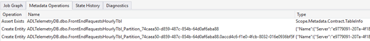
    
- Bundesland Verlauf

    Den Bundesstaat Verlauf wird auch im Auftrag Zusammenfassung visualisiert können, sondern es weitere Details finden Sie hier. Sie können die detaillierte Informationen suchen, während der Ausführung der Schritte, wenn Sie der Auftrag in der Warteschlange, vorbereitet ist, ist abgelaufen. Finden Sie auch wie oft der Auftrag kompiliert wurde (der CcsAttempts: 1), wird die Position des Versands zum Cluster tatsächlich (Details: Position zu Cluster verteilen) usw..

    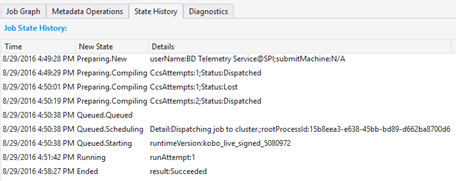
    
- Diagnose

    Das Tool werden die Ausführung Auftrags automatisch aus. Sie erhalten Benachrichtigungen, wenn einige Fehler oder Leistungsprobleme in Ihre Aufträge vorhanden sind. Bitte beachten Sie, dass Sie zum Herunterladen des Profils, damit Sie hier vollständige Informationen zu erhalten müssen. 

    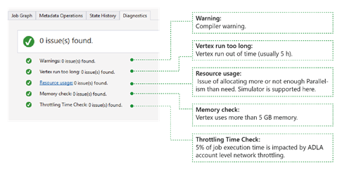

    - Warnungen: Eine Warnung wird hier mit Compiler Warnung. Klicken Sie auf "x Probleme"-Link, um weitere Details zu haben, sobald die Benachrichtigung angezeigt wird.
    - Scheitelpunkt ausführen zu lang: Wenn Sie einen beliebigen Scheitelpunkt aus (z. B. 5 Stunden) ausgeführt wird, Probleme werden, finden Sie hier.
    - Ressource: Einsatz: Wenn Sie weitere oder zu wenig Parallelität als müssen belegt, Probleme werden, finden Sie hier. Sie können auch klicken Sie auf Ressource: Einsatz hinzu, um weitere Informationen hierzu finden Sie unter und Ausführen von Was-wäre-wenn-Szenarien, um eine bessere ressourcenzuteilung finden (Weitere Informationen hierzu finden Sie in diesem Handbuch).
    - Arbeitsspeicher überprüfen: Wenn Sie einen beliebigen Scheitelpunkt mehr als 5 GB Arbeitsspeicher verwendet, Probleme werden, finden Sie hier. Ausführung des Auftrags möglicherweise vom System abgebrochen erhalten, wenn Sie mehr Speicher als Einschränkung System verwendet.

## Job-Details

Position Details Zeigt die detaillierte Informationen des Projekts, einschließlich Skript, Ressourcen und Scheitelpunkt Ausführung anzeigen.

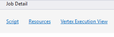
    

- Skript

    Das U-SQL-Skript des Projekts wird in der Abfrage gespeichert. Sie können das ursprüngliche U-SQL-Skript anzeigen und erneut senden, falls erforderlich.

- Ressourcen

    Sie können die Position Kompilierung Ausgaben im Abfrage-Store bis Ressourcen gespeicherte Suchen. Finden Sie beispielsweise "algebra.xml" der verwendet wird, um das Diagramm Position anzuzeigen, die Assemblys, die Sie sich registriert usw. hier.

- Scheitelpunkt Ausführung anzeigen

    Scheitelpunkte zeigt Ausführungsdetails. Das Profil Auftrag archiviert jeder Scheitelpunkt Ausführungsprotokoll, beispielsweise total Daten gelesen/geschrieben, Runtime, Bundesstaat usw. an. Durch diese Ansicht erhalten Sie weitere Details wie ein Auftrag ausgeführt wurde. Weitere Informationen finden Sie unter [Verwenden der Ausführung Ansicht Scheitelpunkt, in dem Datentools für Visual Studio](data-lake-analytics-data-lake-tools-use-vertex-execution-view.md).

## Nächste Schritte

- Um einen Überblick über die Daten dem Analytics zu gelangen, finden Sie unter [Übersicht über die Azure Daten dem Analytics](data-lake-analytics-overview.md).
- Um anzufangen U SQL Anwendungen entwickeln, finden Sie unter [entwickeln U-SQL-Skripts, die mit dem Datentools für Visual Studio](data-lake-analytics-data-lake-tools-get-started.md).
- U-SQL finden Sie unter [Erste Schritte mit Azure Daten dem Analytics U-SQL-Sprache](data-lake-analytics-u-sql-get-started.md).
- Verwaltungsaufgaben finden Sie unter [Verwalten von Azure Daten dem Analytics verwenden Azure-Portal](data-lake-analytics-manage-use-portal.md).
- Zum Melden von Diagnoseinformationen finden Sie unter [Zugreifen auf Diagnose Protokolle für Azure Daten dem Analytics](data-lake-analytics-diagnostic-logs.md)
- Eine komplexe Abfrage finden Sie unter [Analysieren Website Protokolle Azure Daten dem Analytics verwenden](data-lake-analytics-analyze-weblogs.md).
- Zum Verwenden Scheitelpunkt Ausführung Ansicht finden Sie unter [Verwenden der Ausführung Ansicht Scheitelpunkt, in dem Datentools für Visual Studio](data-lake-analytics-data-lake-tools-use-vertex-execution-view.md)
