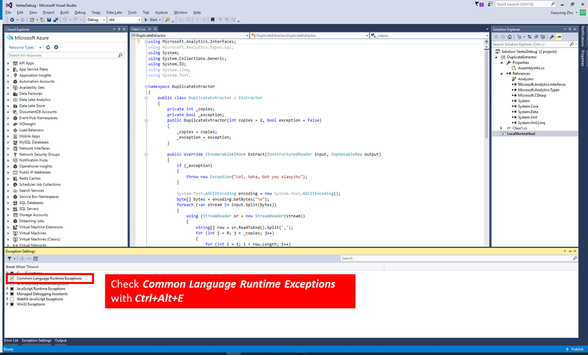

<properties 
   pageTitle="U-SQL-Aufträge Debuggen | Microsoft Azure" 
   description="Erfahren Sie, wie U SQL Fehler beim Scheitelpunkt mit Visual Studio debuggen. " 
   services="data-lake-analytics" 
   documentationCenter="" 
   authors="mumian" 
   manager="jhubbard" 
   editor="cgronlun"/>
 
<tags
   ms.service="data-lake-analytics"
   ms.devlang="na"
   ms.topic="article"
   ms.tgt_pltfrm="na"
   ms.workload="big-data" 
   ms.date="09/02/2016"
   ms.author="jgao"/>

#Debuggen von C#-Code in SQL-U für Daten dem Analytics Aufträge 

Erfahren Sie, wie Azure Daten dem Visual Studio-Tools zum Debuggen fehlgeschlagene U-SQL-Aufträge aufgrund von Fehlern in Benutzercode verwenden. 

Das Visual Studio-Tool können Sie kompilierte Code und notwendigen Scheitelpunktdaten aus Cluster zu verfolgen und zu debuggen fehlgeschlagene Aufträge herunterladen.

Große Datensysteme bieten normalerweise Erweiterbarkeitsmodells über Sprachen wie Java, c#, Python, usw. an. Viele diese Systeme bieten eingeschränkte Laufzeit Debuggen von Informationen, die schwer zu Laufzeitfehler in benutzerdefiniertem Code Debuggen ermöglicht. Die neuesten Tools für Visual Studio verfügt über ein Feature namens "Fehler beim Scheitelpunkt Debuggen". Dieses Feature verwenden, können Sie die Laufzeitdaten aus Azure zu lokalen Arbeitsstationen herunterladen, damit Sie Fehler beim Verwenden der gleichen Laufzeit und genauen Eingabedaten aus der Cloud benutzerdefinierten C#-Code Debuggen können.  Nachdem die Probleme behoben wurden, können Sie den überarbeiteten Code in Azure aus den Tools erneut ausführen.

Einer video-Präsentation dieser Funktion finden Sie unter [den benutzerdefinierten Code in Azure Daten dem Analytics Debuggen](https://mix.office.com/watch/1bt17ibztohcb).

>[AZURE.NOTE] Visual Studio möglicherweise hängen oder stürzt ab, wenn Sie die folgenden zwei Windows-Upgrades besitzen: [Microsoft Visual C++ 2015 Redistributable Update 2](https://www.microsoft.com/download/details.aspx?id=51682), [Universal C Runtime für Windows](https://www.microsoft.com/download/details.aspx?id=50410&wa=wsignin1.0).

##Erforderliche Komponenten
-   Nicht mehr über [die ersten Schritte](data-lake-analytics-data-lake-tools-get-started.md) Artikel haben angezeigt werden.

## Erstellen und Konfigurieren von Debuggen von Projekten

Wenn Sie einen fehlerhaften Auftrag Daten dem Visual Studio-Tool öffnen, erhalten Sie eine Benachrichtigung. Die ausführliche Fehlerinformationen werden in der Registerkarte zurück und die gelbe benachrichtigen Leiste am oberen Rand der Fenster dargestellt werden. 

**Herunterladen von Scheitelpunkt, und erstellen eine Lösung Debuggen**

1.  Öffnen Sie einen fehlerhaften U-SQL-Auftrag in Visual Studio.
2.  Klicken Sie auf **herunterladen** , um die erforderlichen Ressourcen und Eingabewerte Streams herunterladen. Klicken Sie auf **Wiederholen** , wenn der Download fehlgeschlagen ist.
3.  Nachdem der Download abgeschlossen ist, um eine lokale Debuggen Projekt zu erstellen, klicken Sie auf **Öffnen** . Eine neue Visual Studio-Lösung **VertexDebug** mit einem leeren Projekt aufgerufen **LocalVertexHost** aufgerufen wird erstellt.

Wenn benutzerdefinierte Operatoren in U-SQL-Code hinter (Script.usql.cs) verwendet werden, müssen Sie ein Projekt Klassen Bibliothek c# mit den benutzerdefinierten Operatoren Code erstellen und das Projekt in der Lösung VertexDebug einbeziehen.

Wenn Sie zu Ihrer Datenbank Daten dem Analytics DLL-Assemblys registriert haben, müssen Sie den Quellcode der Assemblys in der Lösung VertexDebug hinzufügen.
 
Wenn Sie eine separate C#-Klasse-Bibliothek für Ihr U-SQL-Code und registriert DLL-Assemblys zu Ihrer Daten dem Analytics-Datenbank erstellt haben, müssen Sie die Lösung VertexDebug das Quellprojekt C#-Assemblys hinzufügen.

In einigen wenigen Fällen verwenden Sie benutzerdefinierte Operatoren in U SQL CodeBehind-Datei (Script.usql.cs), in der ursprünglichen Lösung. Wenn Sie in diesem Fall möchten, müssen Sie eine C#-Bibliothek mit dem Quellcode erstellen und Ändern der Name der nach dem Vorkommen im Cluster registriert. Sie können den Assemblynamen im Cluster registriert ist, indem Sie das Skript, das im Cluster ausgeführt haben, erhalten. Können Sie dies tun, indem Sie den Auftrag U SQL öffnen und klicken Sie auf "Skript" im Fenster "Projekt". 

**So konfigurieren Sie die Lösung**

1.  Lösung-Explorer mit der rechten Maustaste soeben erstellten C#-Projekt, und klicken Sie dann auf **Eigenschaften**.
2.  Legen Sie den Pfad der Ausgabe als LocalVertexHost Projekt arbeiten Pfad ein. Sie können LocalVertexHost Projekt arbeiten Directory Pfad durch LocalVertexHost Eigenschaften abrufen.
3.  C#-Projekte zu erstellen, um die PDB-Datei in das Projekt LocalVertexHost Directory arbeiten setzen, oder Sie können die PDB-Datei manuell in diesen Ordner kopieren.
4.  Überprüfen Sie in den **Einstellungen Ausnahme**Common Language Runtime-Ausnahmen:

 
##Debuggen Sie den Auftrag

Nachdem Sie eine Lösung Debuggen erstellt haben, indem Sie den Scheitelpunkt herunterladen und die Umgebung konfiguriert haben, können Sie das Debuggen von U-SQL-Code beginnen.

1.  Lösung-Explorer mit der rechten Maustaste in des **LocalVertexHost** Projekts, die, das Sie soeben erstellt haben, zeigen Sie auf **Debuggen**, und klicken Sie dann auf **neue Instanz starten**. Die LocalVertexHost muss als die Start-Projekt festgelegt werden. Sie möglicherweise die folgende Meldung zum ersten Mal anzeigen, die Sie ignorieren können. Es kann bis zu einer Minute auf dem Bildschirm Debuggen abzurufenden dauern.
 
    

4.  Verwenden Sie Visual Studio-basierte Debuggen Experience (anzeigen, Variablen, usw.), um das Problem zu beheben. 
5.  Nachdem Sie ein Problem festgestellt haben, korrigieren Sie den Code, und erstellen Sie C#-Projekt neu, bevor Sie es erneut testen, bis alle Probleme gelöst sind. Nachdem das Debuggen wurde erfolgreich, die folgende Meldung mit Ausgabefenster abgeschlossen 

        The Program ‘LocalVertexHost.exe’ has exited with code 0 (0x0).
 
##Senden Sie den Auftrag erneut.

Nachdem Sie das Debuggen von U-SQL-Code abgeschlossen haben, können Sie den fehlerhaften Auftrag erneut.

1. Neue DLL-Assemblys zu Ihrer Datenbank ADLA zu registrieren.

    1.  Erweitern Sie den Knoten **Datenbanken** vom Server-Explorer/Cloud Explorer Daten dem Visual Studio-Tool 
    2.  Mit der rechten Maustaste in Assemblys auf Register Assemblys. 
    3.  Registrieren Sie sich Ihre neue DLL-Assemblys in der Datenbank ADLA.
 
2.  Oder den C#-Code in script.usql.cs – C#-CodeBehind-Datei kopieren.
3.  Senden Sie Ihre Aufgabe erneut.

##Nächste Schritte

- [Lernprogramm: Erste Schritte mit Azure Daten dem Analytics U-SQL-Sprache](data-lake-analytics-u-sql-get-started.md)
- [Lernprogramm: Entwickeln Sie U-SQL-Skripts mit dem Datentools für Visual Studio](data-lake-analytics-data-lake-tools-get-started.md)
- [Entwickeln Sie benutzerdefinierte U SQL Operatoren für Azure Daten dem Analytics Aufträge](data-lake-analytics-u-sql-develop-user-defined-operators.md)

