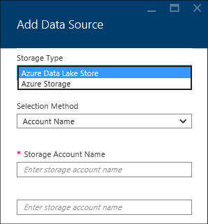
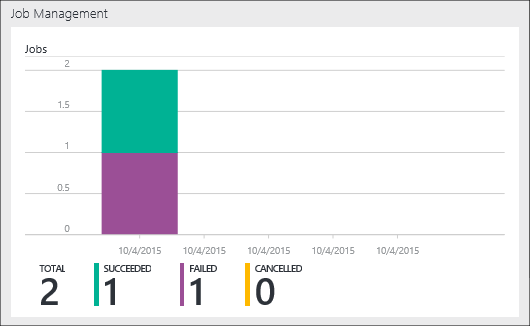

<properties 
   pageTitle="Verwalten von Azure Daten dem Analytics über das Azure-Portal | Azure" 
   description="Erfahren Sie, wie Daten dem Analytics Konten, Datenquellen, Benutzer und Projekte verwalten." 
   services="data-lake-analytics" 
   documentationCenter="" 
   authors="edmacauley" 
   manager="jhubbard" 
   editor="cgronlun"/>
 
<tags
   ms.service="data-lake-analytics"
   ms.devlang="na"
   ms.topic="article"
   ms.tgt_pltfrm="na"
   ms.workload="big-data" 
   ms.date="10/06/2016"
   ms.author="edmaca"/>

# Verwalten von Azure Daten dem Analytics mit Azure-portal

[AZURE.INCLUDE [manage-selector](../../includes/data-lake-analytics-selector-manage.md)]

Informationen Sie zum Verwalten von Azure Daten dem Analytics-Konten, Konto Datenquellen, Benutzern und Aufträge mithilfe des Azure-Portals. Um Management-Themen mit anderen Tools anzuzeigen, klicken Sie auf das tabstoppauswahlsymbol am oberen Rand der Seite.

**Erforderliche Komponenten**

Bevor Sie dieses Lernprogramm beginnen, müssen Sie die folgenden Elemente:

- **Ein Azure-Abonnement**. Finden Sie [kostenlose Testversion Azure abrufen](https://azure.microsoft.com/pricing/free-trial/).

<!-- ################################ -->
<!-- ################################ -->
## Verwalten von Konten

Vor dem Ausführen von Daten dem Analytics Aufträge, müssen Sie ein Daten dem Analytics-Konto verfügen. Im Gegensatz zu Azure HDInsight bezahlen Sie nur ein Daten dem Analytics-Konto bei der Ausführung eines Auftrags.  Sie Zahlen nur für die Zeit an, wenn sie ein Projekt ausgeführt wird.  Weitere Informationen finden Sie unter [Azure Daten dem Analytics Übersicht](data-lake-analytics-overview.md).  

**Erstellen eines Daten dem Analytics-Kontos**

1. Melden Sie sich auf der [Azure-Portal](https://portal.azure.com)an.
2. Klicken Sie auf **neu**, klicken Sie auf **Intelligence + Analytics**, und klicken Sie dann auf **Daten dem Analytics**.
3. Geben Sie ein, oder wählen Sie die folgenden Werte aus:

    

    - **Name**: Benennen Sie das Daten dem Analytics-Konto.
    - **Abonnements**: Wählen Sie das Azure-Abonnement für das Konto Analytics verwendet.
    - **Ressourcengruppe**. Wählen Sie eine vorhandene Azure Ressourcengruppe oder erstellen Sie einen neuen. Azure Ressourcenmanager können Sie für die Arbeit mit den Ressourcen in der Anwendung als Gruppe. Weitere Informationen finden Sie unter [Azure Ressourcenmanager Übersicht](resource-group-overview.md). 
    - **Speicherort**. Wählen Sie eine Azure Data Center für die Daten dem Analytics-Konto an. 
    - **Dem Datenspeicher**: jeder Daten dem Analytics Konto verfügt ein abhängige Lake Datenspeicher-Konto. Die Daten dem Analytics-Konto und das abhängige Lake Datenspeicher Konto müssen sich in derselben Azure Data Center befinden. Führen Sie die Anweisung zum Erstellen eines neuen Kontos mit Lake Datenspeicher oder wählen Sie ein vorhandenes Layout aus.

8. Klicken Sie auf **Erstellen**. Es wird auf der Startseite des Portals. Eine neue Kachel wird mit der Bezeichnung "Bereitstellen von Azure Daten dem Analytics" mit der StartBoard hinzugefügt. Es dauert einen Moment, ein Konto Daten dem Analytics erstellen. Wenn Sie das Konto erstellt wurde, wird im Portal des Kontos auf einem neuen Blade geöffnet.

Nachdem ein Daten dem Analytics-Konto erstellt wurde, können Sie zusätzliche Lake Datenspeicher-Konten und Azure-Speicher-Konten hinzufügen. Anweisungen finden Sie unter [Verwalten von Daten dem Analytics Datenquellen zu berücksichtigen](data-lake-analytics-manage-use-portal.md#manage-account-data-sources).

**Um ein Konto Daten dem Analytics Access oder zu öffnen**

1. Melden Sie sich auf der [Azure-Portal](https://portal.azure.com/)an.
2. Klicken Sie im Menü links auf **Daten dem Analytics** .  Wenn Sie es nicht sehen, klicken Sie auf **Weitere Dienste**, und klicken Sie dann auf **Daten dem Analytics** unter **Intelligence + Analytics**.
3. Klicken Sie auf die Daten dem Analytics-Konto, das Sie zugreifen möchten. Es wird das Konto in einem neuen Blade geöffnet.

**So löschen Sie ein Konto Daten dem Analytics**

1. Öffnen Sie die Daten dem Analytics-Firma, die Sie löschen möchten. Anweisungen finden Sie unter [Access Daten dem Analytics-Konten](#access-adla-account).
2. Klicken Sie im Menü der Schaltfläche am oberen Rand der Blade auf **Löschen** .
3. Geben Sie den Namen des Kontos ein, und klicken Sie dann auf **Löschen**.

Löschen eines Kontos Daten dem Analytics wird die abhängigen Lake Datenspeicher Konten nicht gelöscht. Löschen von dem Datenspeicher Konten Anweisungen finden Sie unter [Löschen dem Datenspeicher Account](data-lake-store-get-started-portal.md#delete-azure-data-lake-store-account).

<!-- ################################ -->
<!-- ################################ -->
## Verwalten von Datenquellen Konto

Daten Lake Analytics unterstützt derzeit die folgenden Datenquellen:

- [Azure Lake Datenspeicher](../data-lake-store/data-lake-store-overview.md)
- [Azure-Speicher](../storage/storage-introduction.md)

Wenn Sie ein Konto Daten dem Analytics erstellen, müssen Sie ein Azure Lake Datenspeicher Konto werden im Speicher Standardkonto festlegen. Das Lake Datenspeicher Standardkonto dient zum Auftrag Metadaten und Position Überwachungsprotokolle speichern. Nachdem Sie ein Konto Daten dem Analytics erstellt haben, können Sie zusätzliche Lake Datenspeicher Konten und/oder Speicher Azure-Konto hinzufügen. 

**Zum Suchen von Daten Lake Speicher Standardkonto**

- Öffnen Sie das Daten dem Analytics-Konto, das Sie verwalten möchten. Anweisungen finden Sie unter [Access Daten dem Analytics-Konten](#access-adla-account). Im **wesentlichen**ist der standardmäßigen Daten Lake Store dargestellt:

    

**Hinzufügen weiterer Datenquellen**

1. Öffnen Sie das Daten dem Analytics-Konto, das Sie verwalten möchten. Anweisungen finden Sie unter [Access Daten dem Analytics-Konten](#access-adla-account).
2. Klicken Sie auf **Einstellungen** , und klicken Sie dann auf **Datenquellen**. Das dort aufgeführte Lake Datenspeicher Standardkonto wird angezeigt. 
3. Klicken Sie auf die **Datenquelle hinzufügen**.

    

    Zum Hinzufügen eines Kontos Azure Lake Datenspeicher benötigen Sie das Konto Name und Zugriffsrechte für das Konto in der Lage sein, die sie Abfragen.
    Wenn eine Azure Blob-Speicher hinzufügen möchten, benötigen Sie das Speicherkonto und die Konto-Taste, indem Sie mit dem Speicherkonto im Portal gefunden werden kann.

**Zum Erforschen von Datenquellen**  

1. Öffnen Sie das Analytics-Konto, das Sie verwalten möchten. Anweisungen finden Sie unter [Access Daten dem Analytics-Konten](#access-adla-account).
2. Klicken Sie auf **Einstellungen** , und klicken Sie dann auf **Daten-Explorer**. 
 
    
    
3. Klicken Sie auf eine Lake Datenspeicher-Konto, um das Konto zu öffnen.

    
    
    Für jedes Konto Lake Datenspeicher können Sie
    
    - **Neuer Ordner**: neuen Ordner hinzufügen.
    - **Hochladen**: Hochladen von Dateien mit dem Konto Speicher von Ihrem Computer.
    - **Access**: Konfigurieren von Access Berechtigungen.
    - **Ordner umbenennen**: Umbenennen eines Ordners.
    - **Ordnereigenschaften**: Anzeigen der Eigenschaften der Datei oder einen Ordner, wie WASB Pfad, WEBHDFS, Zeit usw. letzte Änderung.
    - **Ordner löschen**: Löschen eines Ordners.

**Zum Hochladen von Dateien mit dem Datenspeicher-Konto**

1. Klicken Sie im Portal aus dem linken Menü klicken Sie auf **Durchsuchen** , und klicken Sie dann auf **Dem Datenspeicher**.
2. Klicken Sie auf das Lake Datenspeicher-Konto, dem Daten, die hochgeladen werden soll. Das dem Datenspeicher Standardkonto finden Sie [hier](#default-adl-account).
3. Klicken Sie im oberen Menü auf **Daten-Explorer** .
4. Klicken Sie auf **Neues Verzeichnis** , um einen neuen Ordner erstellen, oder klicken Sie auf einen Ordnernamen ein, um Ordner zu ändern.
6. Klicken Sie auf **Hochladen** , im oberen Menü Datei hochladen.

**Zum Hochladen von Dateien mit Azure Blob-Speicher-Konto**

[Hochladen von Daten für Hadoop Aufträge in HDInsight](../hdinsight/hdinsight-upload-data.md)finden Sie unter.  Die Informationen beziehen sich auf Daten dem Analytics.

## Verwalten von Benutzern

Daten Lake Analytics verwendet Access rollenbasierte Steuerelement mit Azure Active Directory. Wenn Sie ein Konto Daten dem Analytics erstellen, wird eine Rolle "Abonnement Administratoren" das Konto hinzugefügt. Sie können weitere Benutzer und Sicherheitsgruppen mit den folgenden Rollen hinzufügen:

|Rolle|Beschreibung|
|----|-----------|
|Besitzer|Können Sie alles, einschließlich des Zugriffs auf Ressourcen verwalten.|
|Mitwirkenden|Der Zugriff auf das Portal. Senden und Aufträge zu überwachen. Um Aufträge senden können, benötigt ein Mitwirkender die Berechtigung Lese- oder Schreibzugriff auf die Lake Datenspeicher-Konten.|
|DataLakeAnalyticsDeveloper | Übermitteln, überwachen und Aufträge abbrechen.  Diese Benutzer können nur ihre eigenen Aufträge abbrechen. Sie können nicht ihr eigenes Konto verwalten, z. B. Hinzufügen von Benutzern, Berechtigungen ändern oder löschen Sie das Konto. Um Aufträge ausgeführt werden können, benötigen sie Lese- oder Schreibzugriff auf die Lake Datenspeicher-Konten     | 
|Reader|Können Sie alles anzeigen, aber keine Änderungen vornehmen.|  
|DevTest Labs Benutzer|Können Sie alles anzeigen, und verbinden, starten, neu und war(en) virtuelle Computern.|  
|Access-Administrator für Benutzer|Können Sie die zur Verwaltung des Benutzerzugriffs auf Azure Ressourcen.|  

Informationen zum Erstellen von Azure-Active Directory-Benutzer und Sicherheitsgruppen finden Sie unter [Was ist Azure Active Directory](../active-directory/active-directory-whatis.md).

**Hinzufügen von Benutzern oder Sicherheitsgruppen mit einem Daten dem Analytics-Konto**

1. Öffnen Sie das Analytics-Konto, das Sie verwalten möchten. Anweisungen finden Sie unter [Access Daten dem Analytics-Konten](#access-adla-account).
2. Klicken Sie auf **Einstellungen**, und klicken Sie dann auf **Benutzer**. Sie können auch den **Zugriff** auf die Titelleiste **Essentials** , wie im folgenden Screenshot dargestellt klicken:

    
3. Klicken Sie aus dem **Benutzer** Blade auf **Hinzufügen**.
4. Wählen Sie eine Rolle und Hinzufügen eines Benutzers, und klicken Sie dann auf **OK**.

**Hinweis: Wenn diese Benutzer oder eine Sicherheitsgruppe Aufträge senden muss, müssen sie die Lake Datenspeicher als auch die Berechtigung erteilt werden. Weitere Informationen finden Sie unter [Secure in dem Datenspeicher gespeicherten Daten](../data-lake-store/data-lake-store-secure-data.md).**

<!-- ################################ -->
<!-- ################################ -->
## Verwalten von Projekten

Sie müssen ein Daten dem Analytics-Konto verfügen, bevor Sie U-SQL Server-Aufträge ausgeführt werden können.  Weitere Informationen finden Sie unter [Verwalten von Daten dem Analytics-Konten](#manage-data-lake-analytics-accounts).

**Beim Erstellen eines Auftrags**

1. Öffnen Sie das Analytics-Konto, das Sie verwalten möchten. Anweisungen finden Sie unter [Access Daten dem Analytics-Konten](#access-adla-account).
2. Klicken Sie auf die **neue Position**.

    

    Sie sind kein neuer Blade ähnliche finden Sie unter:

    

    Sie können für jedes Projekt konfigurieren

  	|Namen|Beschreibung|
  	|----|-----------|
  	|Name der Position|Geben Sie den Namen des Projekts aus.|
  	|Priorität|Niedrigere Zahl verfügt höherer Priorität. Wenn zwei Aufträge sowohl in der Warteschlange werden, die eine mit niedriger führt Priorität zuerst|
  	|Parallelität |Maximale Anzahl von Prozessen berechnen, die gleichzeitig ausgeführt werden können. Erhöhung dieser Zahl verbessern Sie der Leistung können jedoch auch erhöhen Sie Kosten können.|
  	|Skript|Geben Sie das U-SQL-Skript für den Auftrag ein.|

    Der gleichen Schnittstelle, können Sie auch die Verknüpfen von Datenquellen durchsuchen und zusätzliche Dateien auf die verknüpfte Datenquellen hinzuzufügen. 
3. Wenn Sie den Auftrag senden möchten, klicken Sie auf **Projekt übermitteln** .

**Übermitteln Sie ein Projekt**

Finden Sie unter [Erstellen von Daten dem Analytics Aufträge](#create-job).

**Um Aufträge zu überwachen**

1. Öffnen Sie das Analytics-Konto, das Sie verwalten möchten. Anweisungen finden Sie unter [Access Daten dem Analytics-Konten](#access-adla-account). Bereich "Projektmanagement" zeigt die grundlegende Aufgabe Informationen:

    

3. Klicken Sie auf **Projektmanagement** , wie in den vorherigen Screenshot dargestellt.

    

4. Klicken Sie auf ein Projekt aus den Listen. Oder klicken Sie auf **Filtern** Sie die Einzelvorgänge finden können:

    

    Sie können Aufträge nach **Zeitraum**, **Projektname**und **Autor**filtern.
5. Wenn Sie den Auftrag erneut senden möchten, klicken Sie auf **erneut senden** .

**Um einen Auftrag erneut senden.**

Finden Sie unter [Monitor Daten dem Analytics Aufträge](#monitor-jobs).

##Verwendung der Monitor-Konto

**Zum Überwachen der Verwendung von Konto**

1. Öffnen Sie das Analytics-Konto, das Sie verwalten möchten. Anweisungen finden Sie unter [Access Daten dem Analytics-Konten](#access-adla-account). Klicken Sie im Bereich Verwendung zeigt die Verwendung:

    

2. Doppelklicken Sie auf den Bereich, um weitere Informationen hierzu finden Sie unter.

##Ansicht U SQL Katalog

[U-SQL-Katalog](data-lake-analytics-use-u-sql-catalog.md) dient zum Strukturieren von Daten und Code, damit nach U-SQL-Skripts gemeinsam genutzt werden können. Der Katalog ermöglicht die höchste Performance mit Daten in Azure Daten Lake möglich. Aus dem Azure-Portal können Sie U SQL Katalog anzuzeigen.

**Durchsuchen des U SQL Katalogs**

1. Öffnen Sie das Analytics-Konto, das Sie verwalten möchten. Anweisungen finden Sie unter [Access Daten dem Analytics-Konten](#access-adla-account).
2. Klicken Sie im oberen Menü auf **Daten-Explorer** .
3. Erweitern Sie **Katalog**, **master**, **Tabellen oder **Werte Tabellenfunktionen**, oder **Assemblys **. Das folgende Bildschirmabbild zeigt eine Tabellenwertfunktion.

    

<!-- ################################ -->
<!-- ################################ -->
## Verwenden von Azure Ressourcenmanager Gruppen

Applikationen bestehen normalerweise aus vielen Komponenten, beispielsweise eine Web app, Datenbank, Datenbankserver, Speicher und Drittanbieter-Dienste. Azure Ressourcenmanager können Sie für die Arbeit mit den Ressourcen in der Anwendung als Gruppe, als eine Ressourcengruppe Azure bezeichnet. Sie können bereitstellen, aktualisieren, überwachen oder alle Ressourcen für eine Anwendung in einem einzigen, koordinierte Vorgang löschen. Verwenden Sie eine Vorlage für Bereitstellung und dieser Vorlage für die verschiedenen Umgebungen wie testen, Staging oder Fertigung arbeiten kann. Sie können die Abrechnung für Ihre Organisation verdeutlichen möchten, indem Sie die Rollup-Kosten für die gesamte Gruppe anzeigen. Weitere Informationen finden Sie unter [Azure Ressourcenmanager Übersicht](../azure-resource-manager/resource-group-overview.md). 

Ein Daten dem Analytics-Dienst kann die folgenden Komponenten umfassen:

- Azure Daten Lake Analytics-Konto
- Erforderliches Standard Azure Lake Datenspeicher-Konto
- Zusätzliche Azure Lake Datenspeicher-Konten
- Zusätzlicher Speicher Azure-Konten

Sie können alle diese Komponenten im Rahmen einer Ressourcenmanagement Group unter leichter verwalten erstellen.

Ein Daten dem Analytics-Konto und die Speicherkonten abhängige müssen in derselben Azure Data Center platziert werden.
Die Ressourcenmanagement Group unter kann jedoch in einem anderen Data Center befinden.  

##Siehe auch 

- [Übersicht über Microsoft Azure-Daten Lake Analytics](data-lake-analytics-overview.md)
- [Erste Schritte mit Daten dem Analytics mit Azure-portal](data-lake-analytics-get-started-portal.md)
- [Verwalten von Azure Daten dem Analytics mithilfe der PowerShell Azure](data-lake-analytics-manage-use-powershell.md)
- [Überwachen Sie und Behandeln von Problemen mit Azure Daten dem Analytics-Aufträge mithilfe von Azure-portal](data-lake-analytics-monitor-and-troubleshoot-jobs-tutorial.md)

