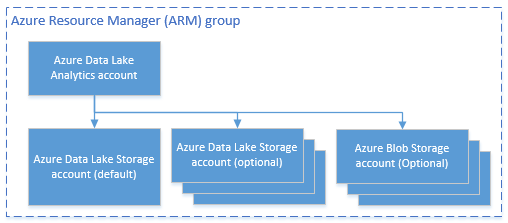

<properties 
   pageTitle="Verwalten von Azure Daten dem Analytics mithilfe der PowerShell Azure | Azure" 
   description="Erfahren Sie, wie Daten dem Analytics Aufträge, Datenquellen, Benutzer verwalten. " 
   services="data-lake-analytics" 
   documentationCenter="" 
   authors="edmacauley" 
   manager="jhubbard" 
   editor="cgronlun"/>
 
<tags
   ms.service="data-lake-analytics"
   ms.devlang="na"
   ms.topic="article"
   ms.tgt_pltfrm="na"
   ms.workload="big-data" 
   ms.date="05/16/2016"
   ms.author="edmaca"/>

# Verwalten von Azure Daten dem Analytics mithilfe der PowerShell Azure

[AZURE.INCLUDE [manage-selector](../../includes/data-lake-analytics-selector-manage.md)]

Informationen Sie zum Verwalten von Azure Daten dem Analytics-Konten, Datenquellen, Benutzern und Aufträge mithilfe der PowerShell Azure. Um Management-Themen mit anderen Tools anzuzeigen, klicken Sie auf der Registerkarte wählen Sie oben.

**Erforderliche Komponenten**

Bevor Sie dieses Lernprogramm beginnen, benötigen Sie Folgendes:

- **Ein Azure-Abonnement**. Finden Sie [kostenlose Testversion Azure abrufen](https://azure.microsoft.com/pricing/free-trial/).

<!-- ################################ -->
<!-- ################################ -->

##Installieren von Azure PowerShell 1.0 oder größer

Siehe Abschnitt vorbereitende [Mithilfe von Azure PowerShell Azure Ressourcenmanager](powershell-azure-resource-manager.md#prerequisites).
    
## Verwalten von Konten

Vor dem Ausführen von Daten dem Analytics Aufträge, müssen Sie ein Daten dem Analytics-Konto verfügen. Im Gegensatz zu Azure-HDInsight bezahlen nicht Sie für ein Konto Analytics, wenn sie ein Projekt nicht ausgeführt wird.  Sie Zahlen nur für die Zeit an, wenn sie ein Projekt ausgeführt wird.  Weitere Informationen finden Sie unter [Azure Daten dem Analytics Übersicht](data-lake-analytics-overview.md).  

###Erstellen von Konten

    $resourceGroupName = "<ResourceGroupName>"
    $dataLakeStoreName = "<DataLakeAccountName>"
    $dataLakeAnalyticsAccountName = "<DataLakeAnalyticsAccountName>"
    $location = "<Microsoft Data Center>"
    
    Write-Host "Create a resource group ..." -ForegroundColor Green
    New-AzureRmResourceGroup `
        -Name  $resourceGroupName `
        -Location $location
    
    Write-Host "Create a Data Lake account ..."  -ForegroundColor Green
    New-AzureRmDataLakeStoreAccount `
        -ResourceGroupName $resourceGroupName `
        -Name $dataLakeStoreName `
        -Location $location 
    
    Write-Host "Create a Data Lake Analytics account ..."  -ForegroundColor Green
    New-AzureRmDataLakeAnalyticsAccount `
        -Name $dataLakeAnalyticsAccountName `
        -ResourceGroupName $resourceGroupName `
        -Location $location `
        -DefaultDataLake $dataLakeStoreName
    
    Write-Host "The newly created Data Lake Analytics account ..."  -ForegroundColor Green
    Get-AzureRmDataLakeAnalyticsAccount `
        -ResourceGroupName $resourceGroupName `
        -Name $dataLakeAnalyticsAccountName  

Sie können auch eine Vorlage Ressourcengruppe Azure verwenden. Eine Vorlage zum Erstellen einer Daten dem Analytics-Konto und das abhängige Lake Datenspeicher-Konto ist in [Anhang A](#appendix-a). Speichern Sie die Vorlage in einer Datei mit .json Vorlage, und verwenden Sie dann das folgende PowerShell-Skript aufgerufen werden:

    $AzureSubscriptionID = "<Your Azure Subscription ID>"
    
    $ResourceGroupName = "<New Azure Resource Group Name>"
    $Location = "EAST US 2"
    $DefaultDataLakeStoreAccountName = "<New Data Lake Store Account Name>"
    $DataLakeAnalyticsAccountName = "<New Data Lake Analytics Account Name>"
    
    $DeploymentName = "MyDataLakeAnalyticsDeployment"
    $ARMTemplateFile = "E:\Tutorials\ADL\ARMTemplate\azuredeploy.json"  # update the Json template path 
    
    Login-AzureRmAccount
    
    Select-AzureRmSubscription -SubscriptionId $AzureSubscriptionID
    
    # Create the resource group
    New-AzureRmResourceGroup -Name $ResourceGroupName -Location $Location
    
    # Create the Data Lake Analytics account with the default Data Lake Store account.
    $parameters = @{"adlAnalyticsName"=$DataLakeAnalyticsAccountName; "adlStoreName"=$DefaultDataLakeStoreAccountName}
    New-AzureRmResourceGroupDeployment -Name $DeploymentName -ResourceGroupName $ResourceGroupName -TemplateFile $ARMTemplateFile -TemplateParameterObject $parameters 

 
###Liste-Konto

Liste Daten Lake Analytics Konten innerhalb des aktuellen Abonnements

    Get-AzureRmDataLakeAnalyticsAccount
    
Die Ausgabe:

    Id         : /subscriptions/xxxxxxxxxxxxxxxxxxxxxxxxxxxxxxxxxxxx/resourceGroups/learn1021rg/providers/Microsoft.DataLakeAnalytics/accounts/learn1021adla
    Location   : eastus2
    Name       : learn1021adla
    Properties : Microsoft.Azure.Management.DataLake.Analytics.Models.DataLakeAnalyticsAccountProperties
    Tags       : {}
    Type       : Microsoft.DataLakeAnalytics/accounts

Liste Daten Lake Analytics Konten innerhalb einer bestimmten Ressourcengruppe

    Get-AzureRmDataLakeAnalyticsAccount -ResourceGroupName $resourceGroupName

Anzeigen von Details eines bestimmten Daten dem Analytics-Kontos

    Get-AzureRmDataLakeAnalyticsAccount -Name $adlAnalyticsAccountName

Testen Sie eine bestimmte Daten dem Analytics-Konto vorhanden

    Test-AzureRmDataLakeAnalyticsAccount -Name $adlAnalyticsAccountName

Das Cmdlet gibt **True** oder **False**zurück.

###Löschen Sie die Daten dem Analytics-Konten

    $resourceGroupName = "<ResourceGroupName>"
    $dataLakeAnalyticsAccountName = "<DataLakeAnalyticsAccountName>"
    
    Remove-AzureRmDataLakeAnalyticsAccount -Name $dataLakeAnalyticsAccountName 

Löschen Daten Lake Analytics-Konto wird das abhängige dem Datenspeicher-Konto nicht gelöscht werden. Das folgende Beispiel löscht die Daten dem Analytics-Konto und das Lake Datenspeicher Standardkonto

    $resourceGroupName = "<ResourceGroupName>"
    $dataLakeAnalyticsAccountName = "<DataLakeAnalyticsAccountName>"
    $dataLakeStoreName = (Get-AzureRmDataLakeAnalyticsAccount -ResourceGroupName $resourceGroupName -Name $dataLakeAnalyticAccountName).Properties.DefaultDataLakeAccount

    Remove-AzureRmDataLakeAnalyticsAccount -ResourceGroupName $resourceGroupName -Name $dataLakeAnalyticAccountName 
    Remove-AzureRmDataLakeStoreAccount -ResourceGroupName $resourceGroupName -Name $dataLakeStoreName

<!-- ################################ -->
<!-- ################################ -->
## Verwalten von Datenquellen Konto

Daten Lake Analytics unterstützt derzeit die folgenden Datenquellen:

- [Azure Lake Datenspeicher](../data-lake-store/data-lake-store-overview.md)
- [Azure-Speicher](storage-introduction.md)

Wenn Sie ein Konto Analytics erstellen, müssen Sie ein Azure Daten dem Speicher Konto werden im Speicher Standardkonto festlegen. Das Lake Datenspeicher Standardkonto dient zum Auftrag Metadaten und Position Überwachungsprotokolle speichern. Nachdem Sie ein Konto Analytics erstellt haben, können Sie zusätzliche dem Datenspeicher Konten und/oder Speicher Azure-Konto hinzufügen. 

### Suchen nach dem Lake Datenspeicher Standardkonto

    $resourceGroupName = "<ResourceGroupName>"
    $dataLakeAnalyticsAccountName = "<DataLakeAnalyticsAccountName>"
    $dataLakeStoreName = (Get-AzureRmDataLakeAnalyticsAccount -ResourceGroupName $resourceGroupName -Name $dataLakeAnalyticAccountName).Properties.DefaultDataLakeAccount

### Fügen Sie weitere Azure Blob-Speicher-Konten hinzu

    $resourceGroupName = "<ResourceGroupName>"
    $dataLakeAnalyticsAccountName = "<DataLakeAnalyticsAccountName>"
    $AzureStorageAccountName = "<AzureStorageAccountName>"
    $AzureStorageAccountKey = "<AzureStorageAccountKey>"
    
    Add-AzureRmDataLakeAnalyticsDataSource -ResourceGroupName $resourceGroupName -Account $dataLakeAnalyticAccountName -AzureBlob $AzureStorageAccountName -AccessKey $AzureStorageAccountKey

### Fügen Sie weitere Lake Datenspeicher-Konten hinzu

    $resourceGroupName = "<ResourceGroupName>"
    $dataLakeAnalyticsAccountName = "<DataLakeAnalyticsAccountName>"
    $AzureDataLakeName = "<DataLakeStoreName>"
    
    Add-AzureRmDataLakeAnalyticsDataSource -ResourceGroupName $resourceGroupName -Account $dataLakeAnalyticAccountName -DataLake $AzureDataLakeName 

### Liste der Datenquellen:

    $resourceGroupName = "<ResourceGroupName>"
    $dataLakeAnalyticsAccountName = "<DataLakeAnalyticsAccountName>"

    (Get-AzureRmDataLakeAnalyticsAccount -ResourceGroupName $resourceGroupName -Name $dataLakeAnalyticAccountName).Properties.DataLakeStoreAccounts
    (Get-AzureRmDataLakeAnalyticsAccount -ResourceGroupName $resourceGroupName -Name $dataLakeAnalyticAccountName).Properties.StorageAccounts
    

<!-- ################################ -->
<!-- ################################ -->
## Verwalten von Projekten

Sie müssen ein Daten dem Analytics-Konto verfügen, bevor Sie ein Projekt erstellen können.  Weitere Informationen finden Sie unter [Verwalten von Daten dem Analytics-Konten](#manage-data-lake-analytics-accounts).

### Liste Aufträge

    $dataLakeAnalyticsAccountName = "<DataLakeAnalyticsAccountName>"
    
    Get-AzureRmDataLakeAnalyticsJob -Account $dataLakeAnalyticAccountName
    
    Get-AzureRmDataLakeAnalyticsJob -Account $dataLakeAnalyticAccountName -State Running, Queued
    #States: Accepted, Compiling, Ended, New, Paused, Queued, Running, Scheduling, Starting
    
    Get-AzureRmDataLakeAnalyticsJob -Account $dataLakeAnalyticAccountName -Result Cancelled
    #Results: Cancelled, Failed, None, Successed 
    
    Get-AzureRmDataLakeAnalyticsJob -Account $dataLakeAnalyticAccountName -Name <Job Name>
    Get-AzureRmDataLakeAnalyticsJob -Account $dataLakeAnalyticAccountName -Submitter <Job submitter>

    # List all jobs submitted on January 1 (local time)
    Get-AzureRmDataLakeAnalyticsJob -Account $dataLakeAnalyticAccountName `
        -SubmittedAfter "2015/01/01"
        -SubmittedBefore "2015/01/02"   

    # List all jobs that succeeded on January 1 after 2 pm (UTC time)
    Get-AzureRmDataLakeAnalyticsJob -Account $dataLakeAnalyticAccountName `
        -State Ended
        -Result Succeeded
        -SubmittedAfter "2015/01/01 2:00 PM -0"
        -SubmittedBefore "2015/01/02 -0"

    # List all jobs submitted in the past hour
    Get-AzureRmDataLakeAnalyticsJob -Account $dataLakeAnalyticAccountName `
        -SubmittedAfter (Get-Date).AddHours(-1)

### Abrufen von Job-details

    $dataLakeAnalyticsAccountName = "<DataLakeAnalyticsAccountName>"
    Get-AzureRmDataLakeAnalyticsJob -Account $dataLakeAnalyticAccountName -JobID <Job ID>
    
### Aufträge senden

    $dataLakeAnalyticsAccountName = "<DataLakeAnalyticsAccountName>"

    #Pass script via path
    Submit-AzureRmDataLakeAnalyticsJob -Account $dataLakeAnalyticAccountName `
        -Name $jobName `
        -ScriptPath $scriptPath

    #Pass script contents
    Submit-AzureRmDataLakeAnalyticsJob -Account $dataLakeAnalyticAccountName `
        -Name $jobName `
        -Script $scriptContents

> [AZURE.NOTE] Die standardmäßige Priorität eines Auftrags ist 1000 und der Standard-Grad der Parallelität für ein Projekt 1.

### Aufträge abbrechen

    Stop-AzureRmDataLakeAnalyticsJob -Account $dataLakeAnalyticAccountName `
        -JobID $jobID

## Verwalten von Katalogelementen

U-SQL-Katalogs dient zum Strukturieren von Daten und Code, damit nach U-SQL-Skripts gemeinsam genutzt werden können. Der Katalog ermöglicht die höchste Performance mit Daten in Azure Daten Lake möglich. Weitere Informationen finden Sie unter [verwenden U-SQL-Katalog](data-lake-analytics-use-u-sql-catalog.md).

###Katalog von Listenelementen

    #List databases
    Get-AzureRmDataLakeAnalyticsCatalogItem `
        -Account $adlAnalyticsAccountName `
        -ItemType Database
    
    
    
    #List tables
    Get-AzureRmDataLakeAnalyticsCatalogItem `
        -Account $adlAnalyticsAccountName `
        -ItemType Table `
        -Path "master.dbo"

###Katalog Elementdetails abrufen 

    #Get a database
    Get-AzureRmDataLakeAnalyticsCatalogItem `
        -Account $adlAnalyticsAccountName `
        -ItemType Database `
        -Path "master"
    
    #Get a table
    Get-AzureRmDataLakeAnalyticsCatalogItem `
        -Account $adlAnalyticsAccountName `
        -ItemType Table `
        -Path "master.dbo.mytable"

###Testen Sie Vorhandensein Katalogelement

    Test-AzureRmDataLakeAnalyticsCatalogItem  `
        -Account $adlAnalyticsAccountName `
        -ItemType Database `
        -Path "master"

###Katalog geheim erstellen
    New-AzureRmDataLakeAnalyticsCatalogSecret  `
            -Account $adlAnalyticsAccountName `
            -DatabaseName "master" `
            -Secret (Get-Credential -UserName "username" -Message "Enter the password")

### Ändern der Katalog geheim
    Set-AzureRmDataLakeAnalyticsCatalogSecret  `
            -Account $adlAnalyticsAccountName `
            -DatabaseName "master" `
            -Secret (Get-Credential -UserName "username" -Message "Enter the password")

###Katalog geheim löschen
    Remove-AzureRmDataLakeAnalyticsCatalogSecret  `
            -Account $adlAnalyticsAccountName `
            -DatabaseName "master"

## Verwenden von Azure Ressourcenmanager Gruppen

Applikationen bestehen normalerweise aus vielen Komponenten, beispielsweise eine Web app, Datenbank, Datenbankserver, Speicher und 3rd Party-Dienste. Azure Ressource-Manager (Cloud) ermöglicht es Ihnen für die Arbeit mit den Ressourcen in der Anwendung als Gruppe, als eine Ressourcengruppe Azure bezeichnet. Bereitstellen können, aktualisieren, überwachen oder alle Ressourcen für eine Anwendung in einem einzigen, koordinierte Vorgang löschen. Verwenden Sie eine Vorlage für Bereitstellung und dieser Vorlage für die verschiedenen Umgebungen z. B. Tests, Staging und Herstellung arbeiten kann. Sie können die Abrechnung für Ihre Organisation verdeutlichen möchten, indem Sie die Rollup-Kosten für die gesamte Gruppe anzeigen. Weitere Informationen finden Sie unter [Azure Ressourcenmanager Übersicht](../azure-resource-manager/resource-group-overview.md). 

Ein Daten dem Analytics-Dienst kann die folgenden Komponenten umfassen:

- Azure Daten Lake Analytics-Konto
- Erforderliche Azure Daten dem Speicher Standardkonto
- Zusätzliche Azure Daten Lake Speicher-Konten
- Zusätzlicher Speicher Azure-Konten

Sie können alle diese Komponenten im Rahmen einer Gruppe von Cloud leichter verwalten erstellen.

Ein Daten dem Analytics-Konto und die Speicherkonten abhängige müssen in derselben Azure Data Center platziert werden.
Die Cloud Gruppe kann jedoch in einem anderen Data Center befinden.  

##Siehe auch 

- [Übersicht über Microsoft Azure-Daten Lake Analytics](data-lake-analytics-overview.md)
- [Erste Schritte mit Daten dem Analytics mithilfe von Azure-Portal](data-lake-analytics-get-started-portal.md)
- [Verwalten von Azure Daten dem Analytics mithilfe von Azure-Portal](data-lake-analytics-manage-use-portal.md)
- [Überwachen Sie und Behandeln von Problemen mit Azure Daten dem Analytics Aufträge mithilfe von Azure-Portal](data-lake-analytics-monitor-and-troubleshoot-jobs-tutorial.md)

##Anhang A - Daten dem Analytics Cloud-Vorlage

Die folgende Cloud-Vorlage kann zum Bereitstellen einer Daten dem Analytics und deren abhängigen Lake Datenspeicher-Konto verwendet werden.  Als Json-Datei zu speichern Sie, und klicken Sie dann mit der PowerShell-Skript rufen Sie die Vorlage. Weitere Informationen finden Sie unter [Bereitstellen einer Anwendung mit Azure Ressourcenmanager Vorlage](../resource-group-template-deploy.md#deploy-with-powershell) und [Azure Ressourcenmanager Authoring-Vorlagen](../resource-group-authoring-templates.md).

    {
      "$schema": "http://schema.management.azure.com/schemas/2015-01-01/deploymentTemplate.json#",
      "contentVersion": "1.0.0.0",
      "parameters": {
        "adlAnalyticsName": {
          "type": "string",
          "metadata": {
            "description": "The name of the Data Lake Analytics account to create."
          }
        },
        "adlStoreName": {
          "type": "string",
          "metadata": {
            "description": "The name of the Data Lake Store account to create."
          }
        }
      },
      "resources": [
        {
          "name": "[parameters('adlStoreName')]",
          "type": "Microsoft.DataLakeStore/accounts",
          "location": "East US 2",
          "apiVersion": "2015-10-01-preview",
          "dependsOn": [ ],
          "tags": { }
        },
        {
          "name": "[parameters('adlAnalyticsName')]",
          "type": "Microsoft.DataLakeAnalytics/accounts",
          "location": "East US 2",
          "apiVersion": "2015-10-01-preview",
          "dependsOn": [ "[concat('Microsoft.DataLakeStore/accounts/',parameters('adlStoreName'))]" ],
          "tags": { },
          "properties": {
            "defaultDataLakeStoreAccount": "[parameters('adlStoreName')]",
            "dataLakeStoreAccounts": [
              { "name": "[parameters('adlStoreName')]" }
            ]
          }
        }
      ],
      "outputs": {
        "adlAnalyticsAccount": {
          "type": "object",
          "value": "[reference(resourceId('Microsoft.DataLakeAnalytics/accounts',parameters('adlAnalyticsName')))]"
        },
        "adlStoreAccount": {
          "type": "object",
          "value": "[reference(resourceId('Microsoft.DataLakeStore/accounts',parameters('adlStoreName')))]"
        }
      }
    }

