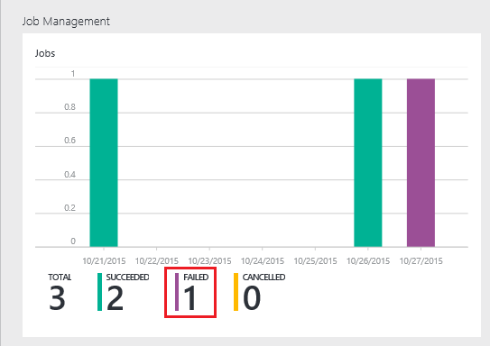

<properties 
   pageTitle="Behandeln von Problemen mit Azure Daten dem Analytics Aufträge mithilfe von Azure-Portal | Azure" 
   description="Erfahren Sie, wie Sie mithilfe des Portals Azure Daten dem Analytics Aufträge beheben. " 
   services="data-lake-analytics" 
   documentationCenter="" 
   authors="edmacauley" 
   manager="jhubbard" 
   editor="cgronlun"/>
 
<tags
   ms.service="data-lake-analytics"
   ms.devlang="na"
   ms.topic="article"
   ms.tgt_pltfrm="na"
   ms.workload="big-data" 
   ms.date="05/16/2016"
   ms.author="edmaca"/>

# Behandeln von Problemen mit Azure Daten dem Analytics Aufträge mithilfe von Azure-Portal

Erfahren Sie, wie Sie mithilfe des Portals Azure Daten dem Analytics Aufträge beheben.

In diesem Lernprogramm werden Sie für die Einrichtung einer fehlende Quelle Datei Problem und Azure-Portal verwenden, um das Problem zu beheben.

**Erforderliche Komponenten**

Bevor Sie dieses Lernprogramm beginnen, benötigen Sie Folgendes:

- **Grundlegende Kenntnisse Daten dem Analytics beruflichen Position Prozess**. Finden Sie unter [Erste Schritte mit Azure Daten dem Analytics Azure-Portal verwenden](data-lake-analytics-get-started-portal.md).
- **A Daten dem Analytics-Konto**. Finden Sie unter [Erste Schritte mit Azure Daten dem Analytics Azure-Portal verwenden](data-lake-analytics-get-started-portal.md#create-adl-analytics-account).
- **Kopieren Sie die Beispieldaten zu dem Datenspeicher Standardkonto**.  Finden Sie unter [Vorbereiten Quelldaten](data-lake-analytics-get-started-portal.md#prepare-source-data)

##Senden eines Auftrags Daten dem Analytics

Erstellen Sie nun einen U-SQL-Auftrag mit einem Dateinamen Ungültige Quelle.  

**Übermitteln Sie den Auftrag**

1. Klicken Sie im Portal Azure in der oberen linken Ecke auf **Microsoft Azure** .
2. Klicken Sie auf die Kachel mit Ihren Daten dem Analytics Kontonamen ein.  Es wurde hier angeheftet, wenn das Konto erstellt wurde.
Wenn das Konto nicht vorhanden fixiert ist, finden Sie unter [Öffnen einer Firma Analytics Portal](data-lake-analytics-manage-use-portal.md#access-adla-account).
3. Klicken Sie im oberen Menü auf **Neue Position** .
4. Geben Sie einen Namen für die Position, und das folgende U-SQL-Skript ein:

        @searchlog =
            EXTRACT UserId          int,
                    Start           DateTime,
                    Region          string,
                    Query           string,
                    Duration        int?,
                    Urls            string,
                    ClickedUrls     string
            FROM "/Samples/Data/SearchLog.tsv1"
            USING Extractors.Tsv();
        
        OUTPUT @searchlog   
            TO "/output/SearchLog-from-adls.csv"
        USING Outputters.Csv();

    Die Quelldatei, die im Skript definiert ist **/Samples/Data/SearchLog.tsv1**, wo sie **/Samples/Data/SearchLog.tsv**werden muss.
     
5. Klicken Sie oben auf **Auftrag senden** . Eine neue Position Detailbereichs wird geöffnet. Klicken Sie auf der Titelleiste wird den Status. Es dauert ein paar Minuten auf Fertig stellen. Klicken Sie auf **Aktualisieren** , um den aktuellen Status zu gelangen.
6. Warten Sie, bis der Status in **fehlgeschlagen**geändert wird.  Wenn Sie der Auftrag **erfolgreich**ist, ist es, da Sie den Ordner befinden entfernt haben. Finden Sie im Abschnitt **erforderliche** am Anfang des Lernprogramms.

Möglicherweise Fragen Sie – warum es so lange, bis für eine kleine Stelle dauert.  Denken Sie daran, dass die Daten dem Analytics ausgelegt ist zu große Daten zu verarbeiten.  Es scheint, wenn eine große Datenmenge mit seiner verteilten System Verarbeitung.

Lassen Sie uns wird davon ausgegangen, dass Sie den Auftrag übermittelt, und schließen Sie das Portal.  Im nächsten Abschnitt erfahren Sie, wie den Auftrag behandelt.

## Behandeln von Problemen mit der Position

Im letzten Abschnitt Sie haben einen Auftrag übermittelt, und der Auftrag fehlgeschlagen ist.  

**Um alle Einzelvorgänge anzuzeigen.**

1. Klicken Sie im Portal Azure in der oberen linken Ecke auf **Microsoft Azure** .
2. Klicken Sie auf die Kachel mit Ihren Daten dem Analytics Kontonamen ein.  Der Auftrag Zusammenfassung werden auf der Kachel **Projektmanagement** .

    
    
    Der Auftrag Management bietet Ihnen Überblick über den Status der Position. Beachten Sie, dass ein fehlerhafte Auftrag vorhanden ist.
   
3. Klicken Sie auf die Kachel **Projektmanagement** , um die Projekte anzuzeigen. Die Aufträge werden in **ausgeführt**, **in der Warteschlange**und **beendete**kategorisiert. Der fehlerhafte Auftrag im Abschnitt **abgeschlossen** wird angezeigt. Erste Zeile in der Liste werden muss. Wenn Sie viele Einzelvorgänge haben, können Sie den **Filter** , um Sie Aufträge suchen zu klicken.

    

4. Klicken Sie auf der fehlerhafte Auftrag aus der Liste, um die Details in einem neuen Blade zu öffnen:

    
    
    Achten Sie auf die Schaltfläche **erneut senden** . Nachdem Sie das Problem beheben, können Sie den Auftrag erneut.

5. Klicken Sie auf die markierten Teil aus dem vorherigen Screenshot, um die Fehlerdetails zu öffnen.  Sie sind ungefähr wie folgt angezeigt:

    

    Sie werden darüber informiert, dass der Quellordner nicht gefunden wird.
    
6. Klicken Sie auf **Skript duplizieren**.
7. Aktualisieren Sie den Pfad **von** der folgende aus:

    "/ Samples/Data/SearchLog.tsv"

8. Klicken Sie auf die **Position zu übermitteln**.

##Siehe auch

- [Azure Daten Lake Analytics (Übersicht)](data-lake-analytics-overview.md)
- [Erste Schritte mit Azure Daten dem Analytics mithilfe der PowerShell Azure](data-lake-analytics-get-started-powershell.md)
- [Erste Schritte mit Azure Daten dem Analytics und U-SQL mit Visual Studio](data-lake-analytics-u-sql-get-started.md)
- [Verwalten von Azure Daten dem Analytics mithilfe von Azure-Portal](data-lake-analytics-manage-use-portal.md)

