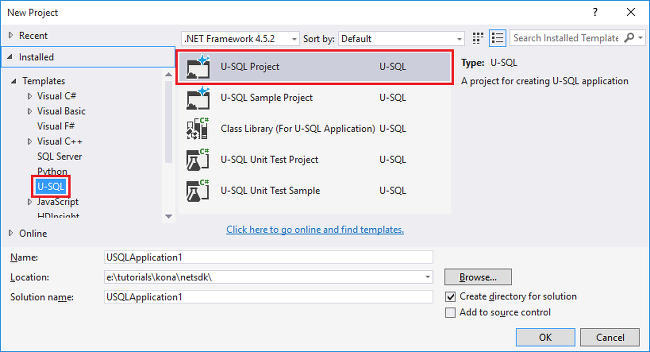

<properties 
   pageTitle="Entwickeln Sie benutzerdefinierte U SQL Operatoren für Azure Daten dem Analytics Aufträge | Azure" 
   description="Informationen Sie zum Entwickeln Sie benutzerdefinierte Operatoren, um in den Daten dem Analytics Aufträge wiederverwendet und verwendet werden. " 
   services="data-lake-analytics" 
   documentationCenter="" 
   authors="edmacauley" 
   manager="jhubbard" 
   editor="cgronlun"/>
 
<tags
   ms.service="data-lake-analytics"
   ms.devlang="na"
   ms.topic="article"
   ms.tgt_pltfrm="na"
   ms.workload="big-data" 
   ms.date="05/16/2016"
   ms.author="edmaca"/>

# Entwickeln Sie benutzerdefinierte U SQL Operatoren für Azure Daten dem Analytics Aufträge

Informationen Sie zum Entwickeln Sie benutzerdefinierte Operatoren, um in den Daten dem Analytics Aufträge wiederverwendet und verwendet werden. Sie können einen benutzerdefinierten Operator zum Konvertieren von Land Namen entwickeln.

##Erforderliche Komponenten

- Visual Studio 2015, Visual Studio 2013 aktualisieren 4 oder Visual Studio 2012 mit Visual C++ installiert 
- Microsoft Azure SDK für .NET Version 2,5 oder höher.  Installieren Sie es mit dem Installer-Plattform aus.
- Ein Daten dem Analytics-Konto.  Finden Sie unter [Erste Schritte mit Azure Daten dem Analytics Azure-Portal verwenden](data-lake-analytics-get-started-portal.md).
- Navigieren Sie in das [Erste Schritte mit Azure Daten dem Analytics U-SQL Studio](data-lake-analytics-u-sql-get-started.md) Lernprogramm.
- Verbinden mit Azure, finden Sie unter [Erste Schritte mit Azure Daten dem Analytics U SQL Studio](data-lake-analytics-u-sql-get-started.md#connect-to-azure). 
- Hochladen der Quelldaten, finden Sie unter [Erste Schritte mit Azure Daten dem Analytics U SQL Studio](data-lake-analytics-u-sql-get-started.md#upload-source-data-files). 

## Definieren und Verwenden von benutzerdefinierten Operators in SQL-U

**Erstellen und Senden eines U-SQL-Auftrags** 

1. Im Menü **Datei** klicken Sie auf **neu**, und klicken Sie dann auf **Projekt**.
2. Wählen Sie den **U-SQL** -Projekttyp aus.

    

3. Klicken Sie auf **OK**. Visual Studio erstellt eine Lösung mit einer Script.usql-Datei.
4. **Lösung Explorer**erweitern Sie Script.usql, und doppelklicken Sie dann auf **Script.usql.cs**.
5. Fügen Sie den folgenden Code in die Datei ein:

        using Microsoft.Analytics.Interfaces;
        using System.Collections.Generic;
        
        namespace USQL_UDO
        {
            public class CountryName : IProcessor
            {
                private static IDictionary<string, string> CountryTranslation = new Dictionary<string, string>
                {
                    {
                        "Deutschland", "Germany"
                    },
                    {
                        "Schwiiz", "Switzerland"
                    },
                    {
                        "UK", "United Kingdom"
                    },
                    {
                        "USA", "United States of America"
                    },
                    {
                        "中国", "PR China"
                    }
                };
        
                public override IRow Process(IRow input, IUpdatableRow output)
                {
        
                    string UserID = input.Get<string>("UserID");
                    string Name = input.Get<string>("Name");
                    string Address = input.Get<string>("Address");
                    string City = input.Get<string>("City");
                    string State = input.Get<string>("State");
                    string PostalCode = input.Get<string>("PostalCode");
                    string Country = input.Get<string>("Country");
                    string Phone = input.Get<string>("Phone");
        
                    if (CountryTranslation.Keys.Contains(Country))
                    {
                        Country = CountryTranslation[Country];
                    }
                    output.Set<string>(0, UserID);
                    output.Set<string>(1, Name);
                    output.Set<string>(2, Address);
                    output.Set<string>(3, City);
                    output.Set<string>(4, State);
                    output.Set<string>(5, PostalCode);
                    output.Set<string>(6, Country);
                    output.Set<string>(7, Phone);
        
                    return output.AsReadOnly();
                }
            }
        }

5. Öffnen Sie Script.usql, und fügen Sie das folgende U-SQL-Skript:

        @drivers =
            EXTRACT UserID      string,
                    Name        string,
                    Address     string,
                    City        string,
                    State       string,
                    PostalCode  string,
                    Country     string,
                    Phone       string
            FROM "/Samples/Data/AmbulanceData/Drivers.txt"
            USING Extractors.Tsv(Encoding.Unicode);
        
        @drivers_CountryName =
            PROCESS @drivers
            PRODUCE UserID string,
                    Name string,
                    Address string,
                    City string,
                    State string,
                    PostalCode string,
                    Country string,
                    Phone string
            USING new USQL_UDO.CountryName();    
        
        OUTPUT @drivers_CountryName
            TO "/Samples/Outputs/Drivers.csv"
            USING Outputters.Csv(Encoding.Unicode);

6. Klicken Sie mit der rechten Maustaste auf **Script.usql** **Lösung-Explorer**und klicken Sie dann auf **Skript erstellen**.
6. **Lösung-Explorer**klicken Sie mit der rechten Maustaste auf **Script.usql**und klicken Sie dann auf **Skript übermitteln**.
7. Wenn Sie noch nicht die Verbindung zu Ihrem Abonnement Azure, werden Sie auffordern zur Eingabe Ihrer Kontoanmeldeinformationen Azure.
7. Klicken Sie auf **Absenden**. Einreichung Ergebnisse und Position Link stehen im Fenster Ergebnisse bei die Übermittlung abgeschlossen ist.
8. Sie müssen die Schaltfläche Aktualisieren, um finden Sie unter der aktuellen Status und Aktualisieren des Bildschirms klicken.

**Um die Ausgabe der Position anzuzeigen.**

1. Aus dem **Server-Explorer** **Azure**erweitern, erweitern Sie die **Daten dem Analytics**, erweitern Sie Ihre Daten dem Analytics-Konto, **Speicherkonten**erweitern, mit der rechten Maustaste in der Standard-Speicher und klicken Sie dann auf **Explorer**. 
2. Erweitern Sie Beispiele Ausgaben, und doppelklicken Sie dann auf **Treiber.csv**.

##Siehe auch

- [Erste Schritte mit Daten dem Analytics mithilfe der PowerShell](data-lake-analytics-get-started-powershell.md)
- [Erste Schritte mit Daten dem Analytics über das Azure-portal](data-lake-analytics-get-started-portal.md)
- [Verwenden von dem Datentools für Visual Studio für die Entwicklung von Applications U-SQL](data-lake-analytics-data-lake-tools-get-started.md)
