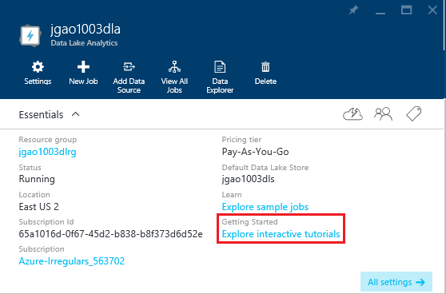

<properties 
   pageTitle="Erfahren Sie, Daten dem Analytics und U-SQL Azure-Portal interaktive-Lernprogramme verwenden | Azure" 
   description="Schnellstart mit Daten dem Analytics und U-SQL zu lernen. " 
   services="data-lake-analytics" 
   documentationCenter="" 
   authors="edmacauley" 
   manager="jhubbard" 
   editor="cgronlun"/>
 
<tags
   ms.service="data-lake-analytics"
   ms.devlang="na"
   ms.topic="get-started-article"
   ms.tgt_pltfrm="na"
   ms.workload="big-data" 
   ms.date="05/16/2016"
   ms.author="edmaca"/>

# Verwenden der interaktiven Azure Daten dem Analytics-Lernprogramme

Der Azure-Portal bietet ein interaktives Lernprogramm für Sie erste Schritte mit Daten dem Analytics. In diesem Artikel wird gezeigt, wie anhand des Lernprogramms zum Analysieren von Website-Protokolle zu wechseln.

>[AZURE.NOTE]Wenn Sie über die gleichen Lernprogramm verwenden Visual Studio wechseln möchten, finden Sie unter [Analysieren Website Protokolle Daten dem Analytics verwenden](data-lake-analytics-analyze-weblogs.md).
>Weitere interaktive Lernprogramme im Portal hinzugefügt werden.

Andere Lernprogramme finden Sie unter:

- [Erste Schritte mit Daten dem Analytics mithilfe von Azure-Portal](data-lake-analytics-get-started-portal.md)
- [Erste Schritte mit Daten dem Analytics mithilfe der PowerShell Azure](data-lake-analytics-get-started-powershell.md)
- [Erste Schritte mit Daten dem Analytics mit .NET SDK](data-lake-analytics-get-started-net-sdk.md)
- [Entwickeln Sie U-SQL-Skripts mit dem Datentools für Visual Studio](data-lake-analytics-data-lake-tools-get-started.md) 

**Erforderliche Komponenten**

Bevor Sie dieses Lernprogramm beginnen, benötigen Sie Folgendes:

- **A Daten dem Analytics-Konto**.  Finden Sie unter [Erste Schritte mit Azure Daten dem Analytics Azure-Portal verwenden](data-lake-analytics-get-started-portal.md).

##Erstellen Sie die Daten dem Analytics-Konto 

Sie müssen ein Daten dem Analytics-Konto verfügen, bevor Sie alle weiteren Einzelvorgänge ausführen können.

Jedes Daten dem Analytics-Konto hat eine [Azure dem Datenspeicher](../data-lake-store/data-lake-store-overview.md) Konto Abhängigkeit.  Dieses Konto wird als Standardkonto Lake Datenspeicher bezeichnet.  Sie können das Konto Lake Datenspeicher erstellen, im voraus, oder wenn Sie Ihre Daten dem Analytics-Konto erstellen. In diesem Lernprogramm erstellen Sie das Konto Lake Datenspeicher mit Analytics-Konto

**Erstellen eines Daten dem Analytics-Kontos**

1. Melden Sie sich auf der [Azure-Portal](https://portal.azure.com/signin/index/?Microsoft_Azure_Kona=true&Microsoft_Azure_DataLake=true&hubsExtension_ItemHideKey=AzureDataLake_BigStorage%2cAzureKona_BigCompute).
2. Klicken Sie auf **Microsoft Azure** , in der oberen linken Ecke, um die StartBoard zu öffnen.
3. Klicken Sie auf die Kachel **Marketplace** .  
3. Geben Sie **Azure Daten dem Analytics** in das Suchfeld auf das Blade **Alles** , und drücken Sie die **EINGABETASTE**. Sie sind in der Liste **Azure Daten dem Analytics** angezeigt.
4. Klicken Sie in der Liste auf **Azure Daten dem Analytics** .
5. Klicken Sie auf **Erstellen** an den Fuß des Blades.
6. Geben Sie ein, oder wählen Sie Folgendes aus:

    

    - **Name**: Name des Kontos Analytics.
    - **Dem Datenspeicher**: jeder Daten dem Analytics Konto verfügt ein abhängige Lake Datenspeicher-Konto. Die Daten dem Analytics-Konto und das abhängige Lake Datenspeicher Konto müssen sich in derselben Azure Data Center befinden. Führen Sie die Anweisung zum Erstellen eines neuen Kontos mit Lake Datenspeicher oder wählen Sie ein vorhandenes Layout aus.
    - **Abonnements**: Wählen Sie das Azure-Abonnement für das Konto Analytics verwendet.
    - **Ressourcengruppe**. Wählen Sie eine vorhandene Azure Ressourcengruppe oder erstellen Sie einen neuen. Applikationen bestehen normalerweise aus vielen Komponenten, beispielsweise eine Web app, Datenbank, Datenbankserver, Speicher und 3rd Party-Dienste. Azure Ressource-Manager (Cloud) ermöglicht es Ihnen für die Arbeit mit den Ressourcen in der Anwendung als Gruppe, als eine Ressourcengruppe Azure bezeichnet. Bereitstellen können, aktualisieren, überwachen oder alle Ressourcen für eine Anwendung in einem einzigen, koordinierte Vorgang löschen. Verwenden Sie eine Vorlage für Bereitstellung und dieser Vorlage für die verschiedenen Umgebungen z. B. Tests, Staging und Herstellung arbeiten kann. Sie können die Abrechnung für Ihre Organisation verdeutlichen möchten, indem Sie die Rollup-Kosten für die gesamte Gruppe anzeigen. Weitere Informationen finden Sie unter [Azure Ressourcenmanager Übersicht](azure-resource-manager/resource-group-overview.md). 
    - **Speicherort**. Wählen Sie eine Azure Data Center für die Daten dem Analytics-Konto an. 
7. Wählen Sie **an Startboard anheften**. Dies ist erforderlich, damit Sie dieses Lernprogramms folgen.
8. Klicken Sie auf **Erstellen**. Es wird mit dem Portal StartBoard. Eine neue Kachel wird mit der Bezeichnung "Bereitstellen von Azure Daten dem Analytics" mit der Startseite hinzugefügt. Es dauert einen Moment, ein Konto Daten dem Analytics erstellen. Wenn Sie das Konto erstellt wurde, wird im Portal des Kontos auf einem neuen Blade geöffnet.

    

##Interaktives Lernprogramm Website Log Analyse ausführen

**So öffnen Sie das Website Log Analytics interaktive Lernprogramm**

1. Klicken Sie aus dem Portal auf **Microsoft Azure** aus dem linken Menü, um die StartBoard zu öffnen.
2. Klicken Sie auf die Kachel, die mit Ihrem Konto Daten dem Analytics verknüpft ist.
3. Klicken Sie auf **Durchsuchen, interaktive Lernprogramme** aus der Leiste **Essentials** .

    

4. Wenn Sie sehen eine orangefarbenen Warnung Spruch "Beispiele nicht ordnungsgemäß eingerichtet, klicken Sie auf...", und klicken Sie auf **Kopieren von Beispieldaten** , um die Beispieldaten in das Lake Datenspeicher Standardkonto zu kopieren. Interaktive Lernprogramm benötigt Daten ausführen.
5. Klicken Sie auf **Website Log Analytics**, aus dem Blade **Interaktive Lernprogramme** . Im Portal wird in einem neuen Portal Blade des Lernprogramms geöffnet.
5. Klicken Sie auf **1 Einleitung** , und folgen Sie dann die Anweisungen

##Siehe auch

- [Übersicht über Microsoft Azure-Daten Lake Analytics](data-lake-analytics-overview.md)
- [Erste Schritte mit Daten dem Analytics mithilfe von Azure-Portal](data-lake-analytics-get-started-portal.md)
- [Erste Schritte mit Daten dem Analytics mithilfe der PowerShell Azure](data-lake-analytics-get-started-powershell.md)
- [Entwickeln Sie U-SQL-Skripts mit dem Datentools für Visual Studio](data-lake-analytics-data-lake-tools-get-started.md)
- [Analysieren von Website-Protokolle mit Azure Daten dem Analytics](data-lake-analytics-analyze-weblogs.md)
