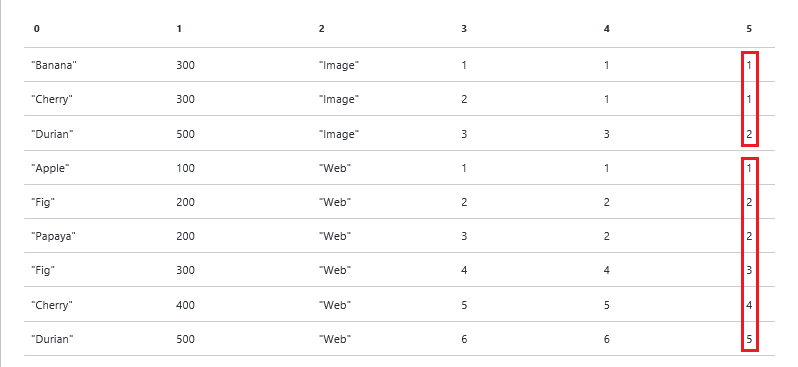

<properties 
   pageTitle="Mithilfe von U-SQL-Funktionen für Aufträge Azure Daten dem Aanlytics | Azure" 
   description="Erfahren Sie, wie U SQL Fensterfunktionen verwenden. " 
   services="data-lake-analytics" 
   documentationCenter="" 
   authors="edmacauley" 
   manager="jhubbard" 
   editor="cgronlun"/>
 
<tags
   ms.service="data-lake-analytics"
   ms.devlang="na"
   ms.topic="article"
   ms.tgt_pltfrm="na"
   ms.workload="big-data" 
   ms.date="05/16/2016"
   ms.author="edmaca"/>

# Verwenden von U-SQL-Fenster für Azure Daten dem Analytics Aufträge  

Fensterfunktionen wurden in der ISO/ANSI SQL-Standard in 2003 eingeführt werden. U-SQL nimmt eine Teilmenge der Fensterfunktionen durch den ANSI SQL-Standard definiert.

Fensterfunktionen werden verwendet, um die Berechnung innerhalb Mengen von Zeilen, so genannte *Windows*führen. Windows werden durch die OVER-Klausel definiert. Fensterfunktionen werden einige wichtige Szenarios in äußerst effizient lösen.

In diesem Handbuch Learning mithilfe von zwei Stichproben Datasets Sie einige Beispielszenario durchzuführen, Fensterfunktionen angewendet werden kann. Weitere Informationen finden Sie unter [U-SQL-Referenz](http://go.microsoft.com/fwlink/p/?LinkId=691348).

Diese Funktionen sind in eingestuft werden: 

- [Aggregationsfunktionen reporting](#reporting-aggregation-functions), wie z. B. Summe oder Mittelwert
- [Rangfolgen Funktionen](#ranking-functions), wie z. B. DENSE_RANK, soll, NTILE und Rang
- [Analysefunktionen](#analytic-functions)wie Verteilungsfunktion, Quantile zwischen oder greift auf Daten aus einer vorherigen Zeile in das gleiche Ergebnis ohne Verwendung eines Selbstjoins festlegen

**Voraussetzungen für:**

- Navigieren Sie in den folgenden zwei Lernprogramme:

    - [Erste Schritte mit Azure Daten dem Tools für Visual Studio](data-lake-analytics-data-lake-tools-get-started.md).
    - [Erste Schritte mit U-SQL Azure Daten dem Analytics Aufträge](data-lake-analytics-u-sql-get-started.md).
- Erstellen eines Daten dem analytisches-Kontos an, wie in [Erste Schritte mit Azure Daten dem Tools für Visual Studio](data-lake-analytics-data-lake-tools-get-started.md)beschrieben.
- Erstellen Sie ein Projekt Visual Studio U-SQL aus, wie in [Erste Schritte mit U-SQL Azure Daten dem Analytics Aufträge](data-lake-analytics-u-sql-get-started.md)beschrieben.

## Beispiel für datasets

In diesem Lernprogramm verwendet zwei Datasets:

- QueryLog 

    QueryLog stellt eine Liste der Was Personen in Suchmaschine gesucht. Jedes Abfrageprotokoll enthält:
    
        - Query - What the user was searching for.
        - Latency - How fast the query came back to the user in milliseconds.
        - Vertical - What kind of content the user was interested in (Web links, Images, Videos).
    
    Kopieren Sie und fügen Sie die folgenden Script in Ihr Projekt U-SQL zum Erstellen des Rowsets QueryLog ein:
    
        @querylog = 
            SELECT * FROM ( VALUES
                ("Banana"  , 300, "Image" ),
                ("Cherry"  , 300, "Image" ),
                ("Durian"  , 500, "Image" ),
                ("Apple"   , 100, "Web"   ),
                ("Fig"     , 200, "Web"   ),
                ("Papaya"  , 200, "Web"   ),
                ("Avocado" , 300, "Web"   ),
                ("Cherry"  , 400, "Web"   ),
                ("Durian"  , 500, "Web"   ) )
            AS T(Query,Latency,Vertical);
    
    In der Praxis werden die Daten wahrscheinlich in einer Datendatei gespeichert. Sie möchten die Daten innerhalb eines Tabstopps getrennten Datei mit dem folgenden Code zugreifen: 
    
        @querylog = 
        EXTRACT 
            Query    string, 
            Latency  int, 
            Vertical string
        FROM "/Samples/QueryLog.tsv"
        USING Extractors.Tsv();

- Mitarbeiter

    Das Mitarbeiter Dataset umfasst die folgenden Felder:
   
        - EmpID - Employee ID.
        - EmpName  Employee name.
        - DeptName - Department name. 
        - DeptID - Deparment ID.
        - Salary - Employee salary.

    Kopieren Sie und fügen Sie das folgende Skript in Ihr Projekt U-SQL für Construcint Mitarbeiter Rowset:

        @employees = 
            SELECT * FROM ( VALUES
                (1, "Noah",   "Engineering", 100, 10000),
                (2, "Sophia", "Engineering", 100, 20000),
                (3, "Liam",   "Engineering", 100, 30000),
                (4, "Emma",   "HR",          200, 10000),
                (5, "Jacob",  "HR",          200, 10000),
                (6, "Olivia", "HR",          200, 10000),
                (7, "Mason",  "Executive",   300, 50000),
                (8, "Ava",    "Marketing",   400, 15000),
                (9, "Ethan",  "Marketing",   400, 10000) )
            AS T(EmpID, EmpName, DeptName, DeptID, Salary);
    
    Die folgende Anweisung zeigt das Rowset extrahieren, die aus einer Datendatei erstellen.
    
        @employees = 
        EXTRACT 
            EmpID    int, 
            EmpName  string, 
            DeptName string, 
            DeptID   int, 
            Salary   int
        FROM "/Samples/Employees.tsv"
        USING Extractors.Tsv();

Wenn Sie die Beispiele im Lernprogramm testen, müssen Sie die Rowset Definitionen hinzufügen. U-SQL müssen Sie nur die Rowsets definieren, die verwendet werden. Einige Beispiele benötigen nur dann ein Rowset.

Sie müssen außerdem folgende Anweisung zum Ausgeben Ergebnisrowset mit einer Datendatei hinzufügen:

    OUTPUT @result TO "/wfresult.csv" 
        USING Outputters.Csv();
 
 Die meisten Beispiele verwenden Sie die Variable mit der Bezeichnung **@result** für die Ergebnisse.

## Vergleichen von Fensterfunktionen auf Gruppierung

Windowing und Gruppierung im Prinzip durch verknüpft sind auch andere. Es empfiehlt sich, diese Beziehung zu verstehen.

### Verwenden Sie Aggregation und gruppieren

Die folgende Abfrage verwendet eine Aggregation, um die Summe der Gehälter aller Mitarbeiter zu berechnen:

    @result = 
        SELECT 
            SUM(Salary) AS TotalSalary
        FROM @employees;
    
>[AZURE.NOTE] Anweisungen zum Testen und überprüfen die Ausgabe finden Sie unter [Erste Schritte mit U-SQL Azure Daten dem Analytics Aufträge](data-lake-analytics-u-sql-get-started.md).

Das Ergebnis ist eine einzelne Zeile mit einer einzigen Spalte an. Die $165000 ist die Summe der Werte aus der gesamten Tabelle Gehälter. 

|TotalSalary
|-----------
|165000

>[AZURE.NOTE] Wenn Sie mit Windows-Funktionen vertraut sind, ist es hilfreich, beachten Sie die Zahlen in den Ausgaben.  

Die folgende Anweisung verwenden die GROUP BY-Klausel, um die gesamte Salery für jede Abteilung zu berechnen:

    @result=
        SELECT DeptName, SUM(Salary) AS SalaryByDept
        FROM @employees
        GROUP BY DeptName;

Die Ergebnisse sind:

|DeptName|SalaryByDept
|--------|------------
|Technik|60000
|PERSONALWESEN|30000
|Geschäftsleitung|50000
|Marketing|25000

Die Summe der Spalte SalaryByDept ist $165000, die den Betrag im letzten Skript erfüllt.
 
Die Anzahl der dort in beiden Fällen sind, dass weniger Zeilen als Eingabe Zeilen ausgeben:
 
- Ohne GROUP BY reduziert die Aggregation aller Zeilen in einer einzigen Zeile ein. 
- Mit GROUP BY gibt es N Ausgabezeilen, wobei N der Anzahl eindeutiger Werte ist, die in den Daten, In diesem Fall angezeigt werden in der Ausgabe 4 Zeilen werden sollen.

###  Verwenden eines Fensters (Funktion)

Die OVER-Klausel im folgenden Beispiel ist leer. Hiermit wird "Fenster", um alle Zeilen aufzunehmen, definiert. Die Summe in diesem Beispiel wird auf der OVER-Klausel angewendet, die vorangehenden.

Sie können diese Abfrage als gelesen: "Die Summe der Gehälter über ein Fenster aller Zeilen".

    @result=
        SELECT
            EmpName,
            SUM(Salary) OVER( ) AS SalaryAllDepts
        FROM @employees;

Im Gegensatz zu GROUP BY sind vorhanden, wie viele Zeilen als Eingabe Zeilen ausgeben: 

|EmpName|TotalAllDepts
|-------|--------------------
|Noah|165000
|Sophia|165000
|Liam|165000
|Emma|165000
|Jakob|165000
|Olivia|165000
|Mason|165000
|AVA|165000
|Ethan|165000

Der Wert von 165000 (die Summe aller Gehälter) wird in jeder Ausgabezeile platziert. Die Summe stammt aus dem "Fenster" aller Zeilen, damit sie die höchsten Gehälter enthält. 

Im nächsten Beispiel wird veranschaulicht, wie "Fenster", um eine Liste aller Mitarbeiter, der Abteilung und die Summe der Gehälter für die Abteilung zu optimieren. PARTITION BY wird die OVER-Klausel hinzugefügt.

    @result=
    SELECT
        EmpName, DeptName,
        SUM(Salary) OVER( PARTITION BY DeptName ) AS SalaryByDept
    FROM @employees;

Die Ergebnisse sind:

|EmpName|DeptName|SalaryByDep
|-------|--------|-------------------
|Noah|Technik|60000
|Sophia|Technik|60000
|Liam|Technik|60000
|Mason|Geschäftsleitung|50000
|Emma|PERSONALWESEN|30000
|Jakob|PERSONALWESEN|30000
|Olivia|PERSONALWESEN|30000
|AVA|Marketing|25000
|Ethan|Marketing|25000

Es gibt erneut, die gleiche Anzahl von Zeilen als Ausgabezeilen. Jede Zeile wird jedoch eine Summe der Gehälter für die entsprechende Abteilung hat.

## Aggregationsfunktionen Reporting

Fensterfunktionen unterstützt auch die folgenden Aggregate an:

- ZÄHLEN
- SUMME
- MIN
- MAX
- MITTELWERT
- STABW
- VARIANZ

Syntax:

    <AggregateFunction>( [DISTINCT] <expression>) [<OVER_clause>]

Hinweis: 

- Standardmäßig ignorieren Aggregatfunktionen außer COUNT, null-Werte.
- Wenn Aggregatfunktionen zusammen mit der OVER-Klausel angegeben sind, ist die ORDER BY-Klausel in der OVER-Klausel nicht zulässig.

### Verwenden Sie Summe

Im folgende Beispiel wird eine Summe der Gehälter pro Abteilung für jede Zeile von hinzugefügt:
 
    @result=
        SELECT 
            *,
            SUM(Salary) OVER( PARTITION BY DeptName ) AS TotalByDept
        FROM @employees;

So sieht das Ergebnis aus:

|EmpID|EmpName|DeptName|DeptID|Gehälter|TotalByDept
|-----|-------|--------|------|------|-----------
|1|Noah|Technik|100|10000|60000
|2|Sophia|Technik|100|20000|60000
|3|Liam|Technik|100|30000|60000
|7|Mason|Geschäftsleitung|300|50000|50000
|4|Emma|PERSONALWESEN|200|10000|30000
|5|Jakob|PERSONALWESEN|200|10000|30000
|6|Olivia|PERSONALWESEN|200|10000|30000
|8|AVA|Marketing|400|15000|25000
|9|Ethan|Marketing|400|10000|25000

### Verwendung von zählen

Im folgende Beispiel wird jede Zeile die gesamte Zahl Mitarbeiter in jeder Abteilung angezeigt ein zusätzliches Feld hinzugefügt.

    @result =
        SELECT *, 
            COUNT(*) OVER(PARTITION BY DeptName) AS CountByDept 
        FROM @employees;

Das Ergebnis:

|EmpID|EmpName|DeptName|DeptID|Gehälter|CountByDept
|-----|-------|--------|------|------|-----------
|1|Noah|Technik|100|10000|3
|2|Sophia|Technik|100|20000|3
|3|Liam|Technik|100|30000|3
|7|Mason|Geschäftsleitung|300|50000|1
|4|Emma|PERSONALWESEN|200|10000|3
|5|Jakob|PERSONALWESEN|200|10000|3
|6|Olivia|PERSONALWESEN|200|10000|3
|8|AVA|Marketing|400|15000|2
|9|Ethan|Marketing|400|10000|2

### Verwenden Sie MIN und MAX

Im folgende Beispiel fügt ein zusätzliches Feld in jeder Zeile die niedrigste Gehälter jede Abteilung angezeigt:

    @result =
        SELECT 
            *,
            MIN(Salary) OVER( PARTITION BY DeptName ) AS MinSalary
        FROM @employees;

Das Ergebnis:

|EmpID|EmpName|DeptName|DeptID|Gehälter|MinSalary
|-----|-------|--------|------|-------------|----------------
|1|Noah|Technik|100|10000|10000
|2|Sophia|Technik|100|20000|10000
|3|Liam|Technik|100|30000|10000
|7|Mason|Geschäftsleitung|300|50000|50000
|4|Emma|PERSONALWESEN|200|10000|10000
|5|Jakob|PERSONALWESEN|200|10000|10000
|6|Olivia|PERSONALWESEN|200|10000|10000
|8|AVA|Marketing|400|15000|10000
|9|Ethan|Marketing|400|10000|10000

MAX, ersetzen Sie MIN, und probieren Sie es aus.

## Rangfolgen Funktionen

Rangfolgefunktionen durch die PARTITION BY-Klausel und über Klauseln definiert den für jede Zeile in jeder Partition Rangfolgenwert (Long) zurück. Die Reihenfolge der den Rang wird durch die ORDER BY in der OVER-Klausel gesteuert.

Im folgenden werden unterstützt Rangfolgen Funktionen:

- RANG
- DENSE_RANK 
- NTILE
- SOLL

**Syntax:**

    [ RANK() | DENSE_RANK() | ROW_NUMBER() | NTILE(<numgroups>) ]
        OVER (
            [PARTITION BY <identifier, > …[n]]
            [ORDER BY <identifier, > …[n] [ASC|DESC]] 
    ) AS <alias>

- Die ORDER BY-Klausel ist optional für Rangfolgen Funktionen. Wenn ORDER BY angegeben ist, klicken Sie dann sie die Reihenfolge für die Rangfolge bestimmt. Wenn dann U SQL Werte basierend auf der Reihenfolge weist keine ORDER BY angegeben ist Datensatz gelesen. Daher in nicht deterministischen Wert der Zeilennummer, Rang oder dicht resultierender Rang in der Groß-/Kleinschreibung wurden oder BY-Klausel nicht angegeben ist.
- NTILE erfordert einen Ausdruck, der eine positive ganze Zahl ergibt. Diese Zahl gibt die Anzahl der Gruppen in die einzelnen Partitionen unterteilt werden muss. Dieser Bezeichner ist nur in Verbindung mit der Funktion Rangfolgen NTILE verwendet. 

Weitere Informationen zu den OVER-Klausel finden Sie unter [U-SQL-Referenz]().

Zeilen in einem Fenster soll, Rang und DENSE_RANK Nummern zugewiesen. Statt ihnen separat bedecken, ist es mehr intuitive zu sehen, wie sie mit der Eingabe derselben reagieren.

    @result =
    SELECT 
        *,
        ROW_NUMBER() OVER (PARTITION BY Vertical ORDER BY Latency) AS RowNumber,
        RANK() OVER (PARTITION BY Vertical ORDER BY Latency) AS Rank, 
        DENSE_RANK() OVER (PARTITION BY Vertical ORDER BY Latency) AS DenseRank 
    FROM @querylog;
        
Beachten Sie, dass die Klauseln OVER identisch sind. Das Ergebnis:

|Abfrage|Wartezeit: int|Vertikal|RowNumber|Rang|DenseRank
|-----|-----------|--------|--------------|---------|--------------
|Bananen|300|Bild|1|1|1
|Cherry|300|Bild|2|1|1
|Durian|500|Bild|3|3|2
|Apple|100|Web|1|1|1
|Abb.|200|Web|2|2|2
|Papayafrucht|200|Web|3|2|2
|Abb.|300|Web|4|4|3
|Cherry|400|Web|5|5|4
|Durian|500|Web|6|6|5

### SOLL

In jedem Fenster (vertikal, entweder Bild oder Web), die Zeile Zahl erhöht sich um 1 nach Wartezeit sortiert.  

### RANG

Abweicht ROW_NUMBER(), berücksichtigt RANK() den Wert von der Wartezeit, die in der ORDER BY-Klausel für das Fenster angegeben wird.

Rang beginnt mit (1,1,3), da die ersten beiden Werte für Wartezeit identisch sind. Klicken Sie dann ist der nächste Wert 3, da der Wert für die Wartezeit 500 verschoben wurde, klicken Sie auf. Die Taste zeigen, dass, obwohl doppelte Werte die gleiche Rangzahl angegeben werden, die Rangzahl "zum nächsten soll Wert überspringen wird". Sie können dieses Muster, wiederholen Sie die Abfolge (2,2,4) in der vertikalen Web anzeigen.

### DENSE_RANK
    
DENSE_RANK ist wie außer es "Überspringen nicht" in den nächsten soll stattdessen Rangfolge, dass es auf die nächste Zahl in der Sequenz wechselt. Beachten Sie die folgen (1,1,2) und (2,2,3) in der Stichprobe.

### Hinweise

- Wenn ORDER BY angegeben ist als Rangfolgen Funktion ohne eine Reihenfolge Rowset angewendet werden sollen. Dies führt zu Fehlern in nicht deterministische Verhalten auf wie die Funktion Rangfolgen angewendet wird
- Es gibt keine Garantie, dass die Zeilen zurückgegeben, die von einer Abfrage verwenden soll genau mit jeder Ausführung angeordnet werden, werden, wenn Folgendes zutrifft.

    - Werte in der Spalte partitionierten sind eindeutig.
    - Die ORDER BY-Spalten Werte sind eindeutig.
    - Kombinationen von Werten der Spalte Partition und ORDER BY-Spalten sind eindeutig.

### NTILE

NTILE verteilt die Zeilen in einer geordneten Partition in einer bestimmten Anzahl von Gruppen. Die Gruppen werden nummeriert, beginnend mit 1. 

Im folgenden Beispiel wird die Menge der Zeilen in jeder Partition in 4 Gruppen in der Reihenfolge der Abfragewartezeit (vertikal) teilt und gibt die Anzahl der Gruppe für jede Zeile. 

Das Bild vertikal weist 3 Zeilen, daher hat es 3 Gruppen. 

Die vertikale Web weist 6 Zeilen, die zwei zusätzlichen Zeilen werden an die beiden ersten Optionsgruppen verteilt. Die weist warum es 2 Zeilen in der Gruppe 1 und 2-Gruppe, und nur 1 Zeile 3 und Gruppe 4 gruppieren.  

    @result =
        SELECT 
            *,
            NTILE(4) OVER(PARTITION BY Vertical ORDER BY Latency) AS Quartile   
        FROM @querylog;
        
Das Ergebnis:

|Abfrage|Wartezeit|Vertikal|QUARTILE
|-----|-----------|--------|-------------
|Bananen|300|Bild|1
|Cherry|300|Bild|2
|Durian|500|Bild|3
|Apple|100|Web|1
|Abb.|200|Web|1
|Papayafrucht|200|Web|2
|Abb.|300|Web|2
|Cherry|400|Web|3
|Durian|500|Web|4

NTILE hat einen Parameter ("Numgroups"). Numgroups ist eine positive Ganzzahl oder lange Konstante Ausdruck, der die Anzahl der Gruppen gibt an, in dem jede Partition aufgeteilt werden muss. 

- Ist die Anzahl der Zeilen in der Partition gleichmäßig durch Numgroups dividiert werden die Gruppen gleicher Größe haben. 
- Ist die Anzahl der Zeilen in einer Partition nicht Numgroups dividiert werden kann, wird dies dazu führen, dass Gruppen von zwei Größen, die sich unterscheiden, indem Sie ein Element. Größere Gruppen werden vor kleineren Gruppen in der Reihenfolge durch die OVER-Klausel angegeben. 

Beispiel:

- 100 Zeilen in 4 Gruppen unterteilt: [25, 25, 25, 25]
- 102 Zeilen in 4 Gruppen devided: [26, 26, 25, 25]

### Top N Datensätzen pro Partition über Rang, DENSE_RANK oder soll

Viele Benutzer möchten nur erste n Zeilen pro Gruppe auswählen. Dies ist nicht möglich, mit der herkömmlichen GROUP BY. 

Sie haben gelernt, dass im folgenden Beispiel wird am Anfang des Abschnitts Funktionen Rangfolge. Es wird nicht Top N-Einträge für jede Partition angezeigt:

    @result =
    SELECT 
        *,
        ROW_NUMBER() OVER (PARTITION BY Vertical ORDER BY Latency) AS RowNumber,
        RANK() OVER (PARTITION BY Vertical ORDER BY Latency) AS Rank,
        DENSE_RANK() OVER (PARTITION BY Vertical ORDER BY Latency) AS DenseRank
    FROM @querylog;

Das Ergebnis:

|Abfrage|Wartezeit|Vertikal|Rang|DenseRank|RowNumber
|-----|-----------|--------|---------|--------------|--------------
|Bananen|300|Bild|1|1|1
|Cherry|300|Bild|1|1|2
|Durian|500|Bild|3|2|3
|Apple|100|Web|1|1|1
|Abb.|200|Web|2|2|2
|Papayafrucht|200|Web|2|2|3
|Abb.|300|Web|4|3|4
|Cherry|400|Web|5|4|5
|Durian|500|Web|6|5|6

### TOP N mit DICHT Rang

Im folgenden Beispiel wird jede Gruppe ohne Lücken sequenziellen Rang Nummerierung der Zeilen in jedem Fensterabschnitt Windowing die oberen 3 Datensätze zurückgibt.

    @result =
    SELECT 
        *,
        DENSE_RANK() OVER (PARTITION BY Vertical ORDER BY Latency) AS DenseRank
    FROM @querylog;
    
    @result = 
        SELECT *
        FROM @result
        WHERE DenseRank <= 3;

Das Ergebnis:

|Abfrage|Wartezeit|Vertikal|DenseRank
|-----|-----------|--------|--------------
|Bananen|300|Bild|1
|Cherry|300|Bild|1
|Durian|500|Bild|2
|Apple|100|Web|1
|Abb.|200|Web|2
|Papayafrucht|200|Web|2
|Abb.|300|Web|3

### TOP N mit Rang

    @result =
        SELECT 
            *,
            RANK() OVER (PARTITION BY Vertical ORDER BY Latency) AS Rank
        FROM @querylog;
    
    @result = 
        SELECT *
        FROM @result
        WHERE Rank <= 3;

Das Ergebnis:    

|Abfrage|Wartezeit|Vertikal|Rang
|-----|-----------|--------|---------
|Bananen|300|Bild|1
|Cherry|300|Bild|1
|Durian|500|Bild|3
|Apple|100|Web|1
|Abb.|200|Web|2
|Papayafrucht|200|Web|2

### TOP N mit soll

    @result =
        SELECT 
            *,
            ROW_NUMBER() OVER (PARTITION BY Vertical ORDER BY Latency) AS RowNumber
        FROM @querylog;
    
    @result = 
        SELECT *
        FROM @result
        WHERE RowNumber <= 3;

Das Ergebnis:   
    
|Abfrage|Wartezeit|Vertikal|RowNumber
|-----|-----------|--------|--------------
|Bananen|300|Bild|1
|Cherry|300|Bild|2
|Durian|500|Bild|3
|Apple|100|Web|1
|Abb.|200|Web|2
|Papayafrucht|200|Web|3

### Zuweisen von Globally Unique Zeilennummer

Es ist häufig sinnvoll, um jede Zeile eine global eindeutige Nummer zuzuweisen. Dies ist einfach (und effizienter als die Verwendung eines Reduzierstücks) mit den Rangfolgefunktionen.

    @result =
        SELECT 
            *,
            ROW_NUMBER() OVER () AS RowNumber
        FROM @querylog;

<!-- ################################################### -->
## Analysefunktionen

Analysefunktionen dienen zu verstehen, die Verteilung der Werte in Windows. Das häufigste Szenario für die Verwendung von Analysefunktionen ist die Berechnung der Quantile zwischen.

**Unterstützte Fensterfunktionen eingeblendetem**

- CUME_DIST 
- PERCENT_RANK
- PERCENTILE_CONT
- PERCENTILE_DISC

### CUME_DIST  

CUME_DIST berechnet die relative Position eines angegebenen Werts in einer Gruppe von Werten. Sie berechnet den Prozentsatz der Abfragen, die eine Wartezeit, die kleiner als oder gleich die aktuellen Abfragewartezeit in der gleichen vertikalen aufweisen. Bei einer Zeile R geteilt Voraussetzung aufsteigender Reihenfolge CUME_DIST R die Anzahl der Zeilen mit Werten kleiner oder gleich dem Wert von R ist durch die Anzahl der Zeilen im Resultset Partition oder Abfrage ausgewertet. CUME_DIST gibt Zahlen im Bereich von 0 < x < = 1.

**Syntax**

    CUME_DIST() 
        OVER (
            [PARTITION BY <identifier, > …[n]]
            ORDER BY <identifier, > …[n] [ASC|DESC] 
    ) AS <alias>

Im folgende Beispiel wird die CUME_DIST-Funktion zum Berechnen des Wartezeit Quantils für jede Abfrage innerhalb einer vertikalen verwendet. 

    @result=
        SELECT 
            *,
            CUME_DIST() OVER(PARTITION BY Vertical ORDER BY Latency) AS CumeDist
        FROM @querylog;

Das Ergebnis:
    
|Abfrage|Wartezeit|Vertikal|CumeDist
|-----|-----------|--------|---------------
|Durian|500|Bild|1
|Bananen|300|Bild|0.666666666666667
|Cherry|300|Bild|0.666666666666667
|Durian|500|Web|1
|Cherry|400|Web|0.833333333333333
|Abb.|300|Web|0.666666666666667
|Abb.|200|Web|0,5
|Papayafrucht|200|Web|0,5
|Apple|100|Web|0.166666666666667

6 Zeilen vorhanden sind, in die Partition mit Partitionsschlüssel "Web" (4 Zeile und nach unten):

- Es gibt 6 Zeilen mit dem Wert gleich oder kleiner als 500, damit gleich der CUME_DIST bis 6/6 = 1
- 5 Zeilen vorhanden sind, damit die CUME_DIST bis 5/6 gleich = mit dem Wert gleich oder kleiner als 400, 0,83
- Es gibt 4 Zeilen mit dem Wert gleich oder kleiner als 300, damit die CUME_DIST bis 4/6 gleich = 0.66
- Es gibt 3 Zeilen mit dem Wert gleich oder kleiner als 200, damit die CUME_DIST bis 3/6 gleich = 0,5. Es gibt zwei Zeilen mit demselben Wartezeitwert ein.
- Es gibt 1 Zeile mit dem Wert gleich oder kleiner als 100, damit die CUME_DIST bis 1/6 gleich = 0,16. 

**Hinweise zur Verwendung:**

- Anpassen von Werten, die immer auf den gleichen Wert der Verteilungsfunktion ausgewertet werden.
- NULL-Werte werden als die niedrigsten möglichen Werte behandelt.
- Sie müssen die ORDER BY-Klausel zum Berechnen der CUME_DIST angeben.
- CUME_DIST ähnelt der PERCENT_RANK-Funktion

Hinweis: Die ORDER BY-Klausel ist nicht zulässig, wenn die SELECT-Anweisung Ausgabe nicht folgen. Daher bestimmt die ORDER BY-Klausel in der OUTPUT-Anweisung die Anzeigereihenfolge des resultierenden Rowsets.

### PERCENT_RANK

PERCENT_RANK berechnet den relativen Rang einer Zeile in einer Gruppe von Zeilen an. PERCENT_RANK wird verwendet, um die relative Tabelle eines Werts in einen oder Partition ausgewertet werden soll. Der zurückgegebene PERCENT_RANK Wertebereich ist größer als 0 und kleiner oder gleich 1. Im Gegensatz zu CUME_DIST ist PERCENT_RANK immer 0 für die erste Zeile aus.
    
**Syntax**

    PERCENT_RANK() 
        OVER (
            [PARTITION BY <identifier, > …[n]]
            ORDER BY <identifier, > …[n] [ASC|DESC] 
        ) AS <alias>

**Notizen**

- Die erste Zeile in einer Reihe verfügt über eine PERCENT_RANK von 0.
- NULL-Werte werden als die niedrigsten möglichen Werte behandelt.
- Sie müssen die ORDER BY-Klausel zum Berechnen von PERCENT_RANK angeben.
- CUME_DIST ähnelt der PERCENT_RANK-Funktion 

Im folgende Beispiel wird die PERCENT_RANK-Funktion zum Berechnen des Wartezeit Quantils für jede Abfrage innerhalb einer vertikalen verwendet. 

Unterteilen von Zeilen in das Resultset von einem vertikalen PARTITION BY-Klausel angegeben. Die ORDER BY-Klausel in der OVER-Klausel ordnet die Zeilen auf jeder Partition an. 

Der von der PERCENT_RANK-Funktion zurückgegebene Wert stellt den Rang der Abfragen Wartezeit innerhalb einer vertikalen als Prozentwert an. 

    @result=
        SELECT 
            *,
            PERCENT_RANK() OVER(PARTITION BY Vertical ORDER BY Latency) AS PercentRank
        FROM @querylog;

Das Ergebnis:

|Abfrage|Wartezeit: int|Vertikal|Quantilsrang
|-----|-----------|--------|------------------
|Bananen|300|Bild|0
|Cherry|300|Bild|0
|Durian|500|Bild|1
|Apple|100|Web|0
|Abb.|200|Web|0,2
|Papayafrucht|200|Web|0,2
|Abb.|300|Web|0,6
|Cherry|400|Web|0.8
|Durian|500|Web|1

### PERCENTILE_CONT & PERCENTILE_DISC

Diese beiden Funktionen berechnet ein Quantils basierend auf einer kontinuierliche oder diskrete Verteilung der Werte in den Spalten an.

**Syntax**

    [PERCENTILE_CONT | PERCENTILE_DISC] ( numeric_literal ) 
        WITHIN GROUP ( ORDER BY <identifier> [ ASC | DESC ] )
        OVER ( [ PARTITION BY <identifier,>…[n] ] ) AS <alias>

**Numeric_literal** – das Quantil zu berechnen. Der Wert muss zwischen 0,0 und 1,0 liegen.

IN der Gruppe (sortiert nach <identifier> [ASC | DESC]) – gibt eine Liste der numerischen Werte berechnen das Quantil über das Sortieren und an. Bezeichner für nur eine Spalte zulässig ist. Der Ausdruck muss einen numerischen Typ ausgewertet werden. Andere Datentypen sind nicht zulässig. Die Standardsortierreihenfolge ist Aufsteigend.

ÜBER ([PARTITION BY < Bezeichner, >... [n]]) – teilt Eingaberowset in Partitionen gemäß der Partitionsschlüssel auf das Quantil-Funktion angewendet wird. Weitere Informationen finden Sie unter RANGFOLGEN Abschnitt dieses Dokuments.
Hinweis: Alle NULL-Werte aus der Datenmenge werden ignoriert.

**PERCENTILE_CONT** berechnet ein Quantils basierend auf einer kontinuierlichen Verteilung der Wert der Spalte. Das Ergebnis wird interpoliert und möglicherweise nicht gleich eine der spezifischen Werten in der Spalte. 

**PERCENTILE_DISC** berechnet das Quantil basierend auf einer separaten Verteilung der Werte in den Spalten an. Das Ergebnis ist in der Spalte einen bestimmten Wert gleich. Kurzum, PERCENTILE_DISC, im Gegensatz dazu zu PERCENTILE_CONT, immer gibt eine tatsächliche (ursprüngliche Eingabe) Wert.

Sie können sehen, wie beide im folgenden Beispiel wird anhand der versucht, suchen Sie den Median funktionieren (Quantil = 0,50) Wert für Wartezeit innerhalb jeder vertikal

    @result = 
        SELECT 
            Vertical, 
            Query,
            PERCENTILE_CONT(0.5) 
                WITHIN GROUP (ORDER BY Latency)
                OVER ( PARTITION BY Vertical ) AS PercentileCont50,
            PERCENTILE_DISC(0.5) 
                WITHIN GROUP (ORDER BY Latency) 
                OVER ( PARTITION BY Vertical ) AS PercentileDisc50 
        
        FROM @querylog;

Das Ergebnis:

|Abfrage|Wartezeit: int|Vertikal|PercentileCont50|PercentilDisc50
|-----|-----------|--------|-------------------|----------------
|Bananen|300|Bild|300|300
|Cherry|300|Bild|300|300
|Durian|500|Bild|300|300
|Apple|100|Web|250|200
|Abb.|200|Web|250|200
|Papayafrucht|200|Web|250|200
|Abb.|300|Web|250|200
|Cherry|400|Web|250|200
|Durian|500|Web|250|200

Für PERCENTILE_CONT, da die Werte interpoliert werden können, ist der Median für Web 250, obwohl keine Abfrage im Web vertikale eine Wartezeit von 250 hatte. 

PERCENTILE_DISC nicht Werte, interpoliert werden, damit der Median für Web ist 200 - also eine tatsächliche Wert in die Eingabewerte Zeilen gefunden.

## Siehe auch

- [Übersicht über Microsoft Azure-Daten Lake Analytics](data-lake-analytics-overview.md)
- [Erste Schritte mit Daten dem Analytics mithilfe von Azure-Portal](data-lake-analytics-get-started-portal.md)
- [Erste Schritte mit Daten dem Analytics mithilfe der PowerShell Azure](data-lake-analytics-get-started-powershell.md)
- [Entwickeln Sie U-SQL-Skripts mit dem Datentools für Visual Studio](data-lake-analytics-data-lake-tools-get-started.md)
- [Verwenden der interaktiven Azure Daten dem Analytics-Lernprogramme](data-lake-analytics-use-interactive-tutorials.md)
- [Analysieren von Website-Protokolle mit Azure Daten dem Analytics](data-lake-analytics-analyze-weblogs.md)
- [Erste Schritte mit Azure Daten dem Analytics U-SQL-Sprache](data-lake-analytics-u-sql-get-started.md)
- [Verwalten von Azure Daten dem Analytics mithilfe von Azure-Portal](data-lake-analytics-manage-use-portal.md)
- [Verwalten von Azure Daten dem Analytics mithilfe der PowerShell Azure](data-lake-analytics-manage-use-powershell.md)
- [Überwachen Sie und Behandeln von Problemen mit Azure Daten dem Analytics Aufträge mithilfe von Azure-Portal](data-lake-analytics-monitor-and-troubleshoot-jobs-tutorial.md)
