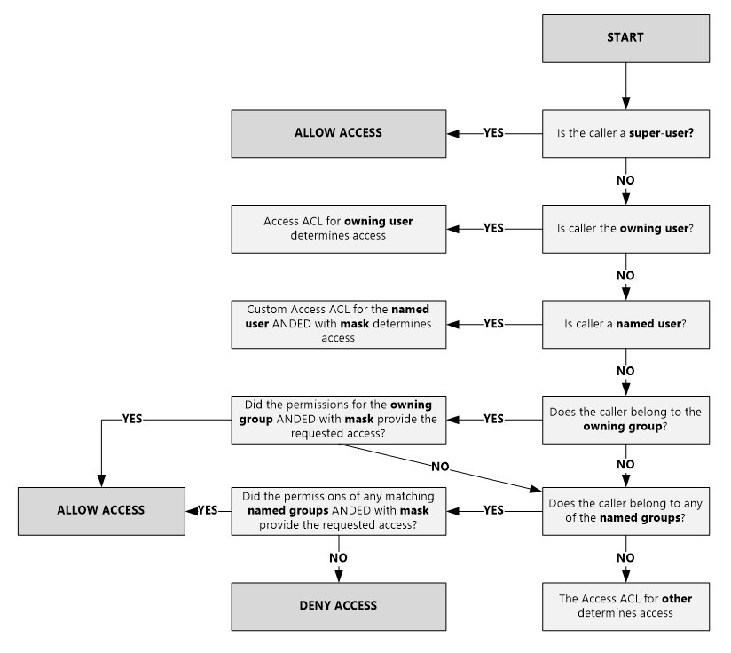
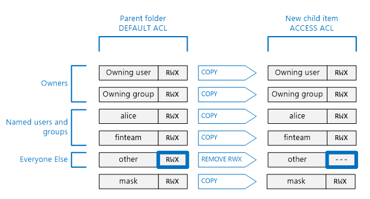

<properties
   pageTitle="Übersicht über Access Control in Lake Datenspeicher | Microsoft Azure"
   description="Verstehen, wie Zugriff auf Steuerelement im Azure Lake Datenspeicher"
   services="data-lake-store"
   documentationCenter=""
   authors="nitinme"
   manager="jhubbard"
   editor="cgronlun"/>

<tags
   ms.service="data-lake-store"
   ms.devlang="na"
   ms.topic="get-started-article"
   ms.tgt_pltfrm="na"
   ms.workload="big-data"
   ms.date="09/06/2016"
   ms.author="nitinme"/>

# Access-Steuerelement in Azure Lake Datenspeicher

Lake Datenspeicher implementiert eine Access-Steuerelement-Modell, die von HDFS und wiederum von das POSIX-Modell abgeleitet wird. In diesem Artikel werden die Grundlagen des Modells Steuerelement Zugriff für Lake Datenspeicher zusammengefasst. Erfahren Sie, dass weitere Informationen zu den HDFS Zugriff auf Steuerelement Modell finden Sie unter [HDFS Berechtigungen](https://hadoop.apache.org/docs/current/hadoop-project-dist/hadoop-hdfs/HdfsPermissionsGuide.html).

## Access Control Lists für Dateien und Ordner

Es gibt zwei Arten von Access Steuerelement Zugriffssteuerungslisten - **Access ACLs** und **ACLs Standard**aus.

* **Access-ACLs** – diese Steuerelement Zugriff auf ein Objekt. Dateien und Ordner müssen Access ACLs.

* **ACLs Standard** – "Vorlage" ACLs zugeordnet einen Ordner, der die Access-ACLs für alle untergeordneten Elemente erstellt haben, klicken Sie unter diesen Ordner zu bestimmen. Dateien haben keine ACLs Standard.

Sowohl Access ACLs und Standard ACLs müssen dieselbe Struktur.

>[AZURE.NOTE] Ändern der Standard-ACL für ein übergeordnetes Element wirkt sich nicht auf die Access-ACL oder Standard-ACL untergeordneter Elemente, die bereits vorhanden sind.

## Benutzer und Identitäten

Alle Dateien und Ordner besteht aus unterschiedliche Berechtigungen für diese Identitäten:

* Der übergeordnete Benutzer der Datei
* Der übergeordneten Gruppe
* Benannte Benutzer
* Benannte Gruppen
* Alle anderen Benutzer

Die Identitäten der Benutzer und Gruppen sind Azure Active Directory (AAD) Identitäten, damit es sei denn, eine "Benutzer", im Kontext Lake Datenspeicher, nichts anderes angegeben ist, kann entweder bedeuten einen AAD-Benutzer oder eine Sicherheitsgruppe AAD.

## Berechtigungen

Die Berechtigungen für ein Objekt Dateisystem sind **Lesen**, **Schreiben**und **Ausführen** , und klicken Sie auf Dateien und Ordner wie in der nachfolgenden Tabelle dargestellt verwendet werden können.

|            |    Datei     |   Ordner |
|------------|-------------|----------|
| **Read (R)** | Der Inhalt einer Datei können gelesen werden. | Erfordert **Lesen** und **Ausführen** , um den Inhalt des Ordners anzuzeigen.|
| **Schreiben (W)** | Schreiben oder an eine Datei anfügen können | Erfordert **schreiben, und führen Sie** zum Erstellen von untergeordneten Elemente in einem Ordner. |
| **Ausführen (X)** | Nichts im Kontext Lake Datenspeicher bedeutet nicht | Durchlaufen der untergeordneten Elemente eines Ordners erforderlich. |

### Kurze Formulare für Berechtigungen

**RWX**wird verwendet, um **Weitere + Schreiben + Ausführen**anzugeben. Eine weitere komprimierte numerische Form vorhanden ist, in dem **gelesen = 4**, **Schreiben = 2**, und **Ausführen = 1** und deren Summe stellt die Berechtigungen. Nachstehend sind einige Beispiele für ein.

| Numerische form | Kurze Formular |      Was dies bedeutet     |
|--------------|------------|------------------------|
| 7            | RWX        | Lesen Sie + schreiben Sie + ausführen |
| 5            | R-X        | Lesen und ausführen         |
| 4            | R –        | Lesen                   |
| 0            | ---        | Keine Berechtigungen         |

### Berechtigungen erben nicht

Im Modell POSIX-Schreibweise von Lake Datenspeicher verwendet werden Berechtigungen für ein Element auf das Element selbst gespeichert. Kurzum, können die Berechtigungen für ein Element aus der übergeordneten Elemente geerbt werden.

## Häufige Szenarien, die im Zusammenhang mit Berechtigungen

Hier sind einige häufige Szenarien zu verstehen, welche Berechtigungen für bestimmte Operationen auf einem Konto Lake Datenspeicher erforderlich sind.

### Berechtigungen für das Lesen einer Datei

* Für die Datei zu lesenden - benötigt Anrufer **Schreibberechtigungen**
* Für alle Ordner in der Ordnerstruktur, die die Datei - enthalten erforderlich der Anrufer **Ausführen** Berechtigungen

### Berechtigungen für das Anfügen einer Datei

* Für die Datei - angefügt werden benötigt Anrufer **Schreiben von** Berechtigungen
* Für alle Ordner, die die Datei - enthalten erforderlich der Anrufer **Ausführen** Berechtigungen

### Berechtigungen für das Löschen einer Datei

* Für den übergeordneten Ordner - benötigt Anrufer **Schreiben + Ausführen** Berechtigungen
* Für alle anderen Ordner in den Pfad der Datei - benötigt Anrufer **Ausführen** Berechtigungen

>[AZURE.NOTE] Schreiben Sie die Berechtigungen für die Datei ist nicht erforderlich, um die Datei zu löschen, solange die oben zwei Bedingungen erfüllt sind.

### Berechtigungen für einen Ordner auflisten

* Für den Ordner, um auflisten - benötigt Anrufer **gelesen + ausführen** Berechtigungen
* Für alle übergeordneten Ordner - benötigt Anrufer **Ausführen** Berechtigungen

## Anzeigen von Berechtigungen in der Azure-portal

Klicken Sie aus **Daten-Explorer** Blade Lake Datenspeicher des Kontos auf **Access** , um die ACLs für eine Datei oder einen Ordner anzuzeigen. Klicken Sie in den folgenden Screenshot auf Access, um die ACLs für den **Katalog** Ordner unter dem Konto **Mydatastore** anzuzeigen.

Klicken Sie anschließend aus dem Blade **Zugriff** auf **Einfache anzeigen** , um die einfacher anzuzeigen.

Klicken Sie auf **Erweiterte Ansicht** , um die erweiterte Ansicht anzuzeigen.

## Der übergeordnete Benutzer

Ein übergeordnete Benutzer hat die am häufigsten Rechte aller Benutzer im Datenspeicher Lake. Ein übergeordnete Benutzer:

* weist RWX Berechtigungen auf **Alle** Dateien und Ordner
* Ändern Sie die Berechtigungen für eine Datei oder einen Ordner können.
* können die übergeordnete Benutzer oder der übergeordneten Gruppe einzelner Dateien oder Ordner ändern.

In Azure umfasst ein Konto Lake Datenspeicher mehrere Azure Rollen:

* Besitzer
* Mitwirkenden
* Leser
* Usw.

Jede Person in der Rolle **Eigentümer** für ein Konto Lake Datenspeicher wird automatisch eine hervorragende für dieses Konto. Informationen finden Sie unter Weitere Informationen zu Azure Rolle basierend Access Steuerelement (RBAC) [rollenbasierte Access steuern](../active-directory/role-based-access-control-configure.md).

## Der übergeordnete Benutzer

Der Benutzer, der das Element erstellt wird automatisch der übergeordnete Benutzer des Elements. Ein übergeordnete Benutzer kann:

* Ändern der Berechtigungen von einer Datei, die im Besitz ist
* Ändern der übergeordneten Gruppe einer Datei, die gehört, solange der übergeordnete Benutzer auch ein Mitglied der Zielgruppe ist.

>[AZURE.NOTE] Ändern die übergeordnete Benutzer **können nicht** den übergeordneten Benutzer einer anderen Besitzer Datei. Nur übergeordneter Benutzer können der übergeordneten Benutzer eine Datei oder eines Ordners ändern.

## Der übergeordneten Gruppe

In den ACLs POSIX ist jeder Benutzer "primäre Gruppe" zugeordnet. Beispielsweise kann der Finanzgruppe "" Benutzer "Alice" angehören. Alice möglicherweise zu mehreren Gruppen angehören, jedoch eine Gruppe immer als ihre primäre Gruppe festgelegt ist. Im POSIX Wenn Alice eine Datei erstellt wird die übergeordnete Gruppe dieser Datei auf dem primären Gruppe festlegen "Finanzen" in diesem Fall ist.
 
Wenn ein neues Dateisystem Element erstellt wird, weist Lake Datenspeicher einen Wert in der übergeordneten Gruppe. 

* **Fall 1** : der Stammordner "/". Dieser Ordner wird erstellt, wenn ein Konto Lake Datenspeicher erstellt wird. In diesem Fall wird die übergeordnete Gruppe für den Benutzer festgelegt, die das Konto erstellt hat.
* **Fall 2** (jeder anderen Kiste) – Wenn Sie ein neues Element erstellt wurde, wird die übergeordnete Gruppe vom übergeordneten Ordner kopiert.

Die übergeordnete Gruppe kann durch geändert werden:
* Alle Benutzer übergeordneter
* Der übergeordnete Benutzer, wenn der übergeordnete Benutzer auch ein Mitglied der Zielgruppe ist.

## Access Kontrollkästchen Algorithmus

Die folgende Abbildung zeigt den Access Kontrollkästchen Algorithmus für Lake Datenspeicher Konten.

## Das Eingabeformat und "effektive Berechtigungen"

Die **Maske** ist ein RWX-Wert, der Zugriff für **benannte Benutzer**, die **Gruppe Besitzer**und **benannte Gruppen** beschränkt, bei der Durchführung des Algorithmus überprüft Access verwendet wird. Hier sind die wichtigsten Punkte für die Maske aus. 

* Das Eingabeformat erstellt "effektive Berechtigungen", d. h., ändert die Berechtigungen zum Zeitpunkt der Zugriff zu überprüfen.
* Das Eingabeformat kann Dateibesitzer und alle übergeordneter Benutzer direkt bearbeitet werden.
* Die Maske hat die Möglichkeit zum Entfernen von Berechtigungen, um die effektive Berechtigung zu erstellen. Das Eingabeformat **kann nicht** hinzufügen die effektive Berechtigung Berechtigungen. 

Lassen Sie uns betrachten Sie einige Beispiele für aus. Nachstehend, wird das Eingabeformat auf **RWX**, festgelegt, was bedeutet, dass das Eingabeformat keine Berechtigungen entfernt werden. Beachten Sie, dass die effektiven Berechtigungen für benannte Benutzer, übergeordnete Gruppe und benannte Gruppe während das Kontrollkästchen Zugriff nicht geändert werden.

Im folgenden Beispiel wird die Maske auf **R-X**festgelegt. Ja, es für **Benutzer mit dem Namen**, **Gruppe Besitzer**und zum Zeitpunkt der Zugriff **mit dem Namen Gruppe** **deaktiviert die Berechtigung Schreiben** überprüfen.

Als Referenz hier in dem das Eingabeformat für eine Datei oder einen Ordner im Portal Azure angezeigt wird.

>[AZURE.NOTE] Für ein neues Konto Lake Datenspeicher die Maske für die Access-ACL und Standard-ACL des Stammordners ("/") zu RWX übernommen.

## Berechtigungen für neue Dateien und Ordner

Wenn Sie eine neue Datei oder einen Ordner unter einem vorhandenen Ordner erstellt wurde, bestimmt die Standard-ACL für den übergeordneten Ordner:

* Ein Unterordner Standard-ACL und Access-ACL
* Einer untergeordnete Datei Access ACL (Dateien haben keine Standard-ACL)

### Eine untergeordnete Datei oder des Ordners Access ACL

Wenn eine untergeordnete Datei oder einen Ordner erstellt wurde, wird als der untergeordneten Datei oder des Ordners Access ACL Standard-ACL des übergeordneten Elements kopiert. Auch, wenn **andere** Benutzer RWX Berechtigungen im des übergeordneten Elements Standard-ACL verfügt, vollständig aus der untergeordneten Elemente Access ACL entfernt.

In den meisten Fällen ist die obige Informationen müssen sollten Sie erfahren, wie ein untergeordnetes Element des Access ACL bestimmt wird. Jedoch, wenn Sie mit dem POSIX-Systemen vertraut sind und die genaue verstehen, wie diese Transformation erreicht ist, finden Sie im Abschnitt [Umasks-Rolle bei der Erstellung der ACL für neue Dateien und Ordner](#umasks-role-in-creating-the-access-acl-for-new-files-and-folders) weiter unten in diesem Artikel aus.
 

### Ein Unterordner Standard-ACL

Bei ein untergeordneten Ordner unter einem übergeordneten Ordner erstellt wurde, wird des übergeordneten Ordners Standard-ACL über, kopiert, wie es, zu des untergeordneten Ordners Standard-ACL ist.

## Grundlegendes zu ACLs in Lake Datenspeicher Erweiterte Themen

Im folgenden werden ein paar Erweiterte Themen, die Ihnen helfen zu verstehen, wie ACLs für Lake Datenspeicher Dateien oder Ordner festgelegt werden.

### Die Umask-Rolle bei der Erstellung der ACL für neue Dateien und Ordner

In einem POSIX-kompatiblen System ist das allgemeine Konzept an, dass die Umask ein 9-Bit-Wert für den übergeordneten Ordner verwendet, um die Berechtigung für **Besitzer (Benutzer)**, **Gruppe Besitzer**und **andere** auf eine neue untergeordnete Datei oder des Ordners Access ACL transformieren ist. Bits von einer Umask bestimmen, welche Bits in der untergeordneten Elemente Access ACL auszuschalten. Daher ist es verwendet wird, um die Weitergabe von Berechtigungen für Besitzer (Benutzer), Gruppe Besitzer Selektives zu verhindern und andere.
  
Ein HDFS-System ist die Umask in der Regel eine Website organisationsweite Konfigurationsoption, die von Administratoren gesteuert wird. Lake Datenspeicher verwendet ein **Konto organisationsweite Umask** , die nicht geändert werden kann. Die folgende Tabelle zeigt die Daten Lake Store Umask.

| Benutzergruppe  | Einstellung | Klicken Sie auf neues untergeordnetes Element Access ACL Effekt |
|------------ |---------|---------------------------------------|
| Besitzer (Benutzer) | ---     | Keine Auswirkung                             |
| Übergeordnete Gruppe| ---     | Keine Auswirkung                             |
| Andere       | RWX     | Entfernen von gelesen + schreiben + ausführen         | 

Die folgende Abbildung zeigt diese Umask in Aktion. Der Effekt besteht darin, **Lesen Sie + schreiben + ausführen** für **andere** Benutzer entfernen. Da die Umask Bits für **Besitzer (Benutzer)** und **Gruppe besitzt**keinen angegeben haben, werden diese Berechtigungen nicht umgewandelt.

 

### Das Kurznotizen bit

Das Kurznotizen Bit ist ein erweitertes Feature eines Dateisystems POSIX. Im Kontext Lake Datenspeicher ist es wahrscheinlich nicht, dass das Kurznotizen Bit benötigt werden.

Die nachfolgenden Tabelle wird aufgezeigt, wie das Kurznotizen Bit Lake Datenspeicher arbeitet.

| Benutzergruppe         | Datei    | Ordner |
|--------------------|---------|-------------------------|
| Kurznotizen Bit **aus** | Keine Auswirkung   | Keine Auswirkung           |
| Kurznotizen Bit **auf**  | Keine Auswirkung   | Verhindert, dass jede Person mit Ausnahme von **übergeordneter Benutzer** und den **Besitzer (Benutzer)** für ein untergeordnetes Element löschen oder Umbenennen dieses untergeordnetes Element.               |

Das Kurznotizen Bit wird der Azure-Portal nicht angezeigt.

## Häufig gestellte Fragen für ACLs in Lake Datenspeicher

Hier sind einige Fragen, die häufig in Bezug auf ACLs in Lake Datenspeicher ergibt.

### Muss ich mich Unterstützung für ACLs aktivieren?

Nein. Access-Steuerelement über ACLs ist immer auf für ein Konto Lake Datenspeicher.

### Welche Berechtigungen sind erforderlich auf rekursiv löschen einen Ordner und seinen Inhalt?

* Der übergeordneten Ordner müssen **Schreiben + Ausführen**.
* Der Ordner gelöscht werden soll, und jeder Ordner darin, erfordert **Lesen + Schreiben + Ausführen**.
>[AZURE.NOTE] Löschen von Dateien in Ordnern werden nicht erfordert Schreiben auf diese Dateien. Darüber hinaus den Stammordner "/" **nie** gelöscht werden können.

### Wer als Besitzer einer Datei oder eines Ordners festgelegt ist?

Der Ersteller einer Datei oder eines Ordners Besitzer der.

### Wer ist bei der Erstellung der übergeordneten Gruppe eine Datei oder einen Ordner festgelegte?

Es wird aus der übergeordneten Gruppe, der den übergeordneten Ordner kopiert, unter dem die neue Datei oder einen Ordner erstellt wird.

### Ich bin der übergeordnete Benutzer einer Datei, aber ich habe kein RWX Berechtigungen, die ich benötige. Was muss ich tun?

Der übergeordnete Benutzer kann einfach die Berechtigungen der Datei selbst RWX Berechtigungen erteilen benötigten ändern.

### Unterstützt Lake Datenspeicher Vererbung von ACLs?

Nein.

### Was ist der Unterschied zwischen Eingabeformat und Umask?

| Eingabeformat | umask|
|------|------|
| Die **Eingabeformat** -Eigenschaft wird auf alle Dateien und Ordner zur Verfügung. | Die **Umask** ist eine Eigenschaft des Kontos Lake Datenspeicher. Ja, es nur einen einzigen Umask im Datenspeicher Lake ist.    |
| Die Eingabeformat-Eigenschaft auf eine Datei oder einen Ordner kann vom übergeordneten Benutzer oder der übergeordneten Gruppe einer Datei oder eine hervorragende geändert werden. | Die Eigenschaft Umask kann von jedem Benutzer, auch ein übergeordnete Benutzer geändert werden. Es ist ein Wert nicht geändert werden, Konstanten.|
| Die Eingabeformat-Eigenschaft wird verwendet, während der Algorithmus überprüft Access zur Laufzeit um festzustellen, ob ein Benutzer über die Berechtigung zum Ausführen einer Operation für eine Datei oder einen Ordner verfügt. Die Rolle des Eingabeformats ist die Erstellung "effektive Berechtigungen" zum Zeitpunkt der Access-Kontrollkästchen. | Die Umask wird während überprüft Access gar nicht verwendet. Die Umask wird verwendet, um die ACL neue untergeordneter Elemente eines Ordners zu bestimmen. |
| Die Maske ist eine 3-Bit RWX Wert, der benannte Benutzer, benannte Gruppe und übergeordnete Benutzer zum Zeitpunkt der Access-Kontrollkästchen gilt.| Die Umask ist ein 9-Bit-Wert, der der übergeordnete Benutzer, übergeordnete Gruppe und andere eines neuen untergeordneten gilt.| 

### Wo kann näher POSIX Access Steuerelementmodell mich?

* [http://www.vanemery.com/Linux/ACL/POSIX_ACL_on_Linux.HTML](http://www.vanemery.com/Linux/ACL/POSIX_ACL_on_Linux.html)

* [HDFS Berechtigung Leitfaden](http://hadoop.apache.org/docs/current/hadoop-project-dist/hadoop-hdfs/HdfsPermissionsGuide.html) 

* [POSIX HÄUFIG GESTELLTE FRAGEN](http://www.opengroup.org/austin/papers/posix_faq.html)

* [POSIX 1003.1 2008](http://standards.ieee.org/findstds/standard/1003.1-2008.html)

* [POSIX 1003.1e 1997](http://users.suse.com/~agruen/acl/posix/Posix_1003.1e-990310.pdf)

* [POSIX ACL für Linux](http://users.suse.com/~agruen/acl/linux-acls/online/)

* [Verwenden von Access Control Lists auf Linux ACL](http://bencane.com/2012/05/27/acl-using-access-control-lists-on-linux/)

## Siehe auch

* [Übersicht über Azure Lake Datenspeicher](data-lake-store-overview.md)

* [Erste Schritte mit Azure Daten Lake Analytics](../data-lake-analytics/data-lake-analytics-get-started-portal.md)

