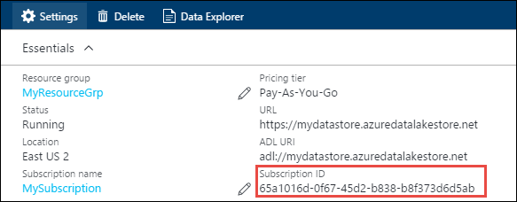
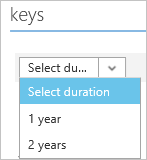

<properties
   pageTitle="Mit Lake Datenspeicher mithilfe von Active Directory authentifizieren | Microsoft Azure"
   description="Informationen Sie zum Authentifizieren mit Lake Datenspeicher mithilfe von Active Directory"
   services="data-lake-store"
   documentationCenter=""
   authors="nitinme"
   manager="jhubbard"
   editor="cgronlun"/>

<tags
   ms.service="data-lake-store"
   ms.devlang="na"
   ms.topic="article"
   ms.tgt_pltfrm="na"
   ms.workload="big-data"
   ms.date="10/17/2016"
   ms.author="nitinme"/>

# Service-embedseksamen-Authentifizierung mit Lake Datenspeicher mit Azure Active Directory

> [AZURE.SELECTOR]
- [Dienst-Authentifizierung](data-lake-store-authenticate-using-active-directory.md)
- [Endbenutzer-Authentifizierung](data-lake-store-end-user-authenticate-using-active-directory.md)

Azure Lake Datenspeicher verwendet Azure Active Directory für die Authentifizierung ein. Vor der Erstellung einer Anwendungs, die mit Azure Lake Datenspeicher oder Azure Daten dem Analytics funktioniert, müssen Sie zuerst entscheiden, wie Sie Ihrer Anwendung mit Azure Active Directory (Azure AD) authentifizieren möchten. Die beiden wichtigsten Optionen sind:

* Endbenutzer-Authentifizierung, und 
* Dienst-Authentifizierung. 

Diese beiden Optionen zu Fehlern in der Anwendung bereitgestellt werden, mit einem Token OAuth 2.0, die jeder Anforderung versucht, Azure Lake Datenspeicher oder Azure Daten dem Analytics zugeordnet wird.

Dieser Artikel beschreibt, wie erstellen eine Azure AD-Webanwendung für Dienst-Authentifizierung. Anweisungen Azure AD-Anwendungskonfiguration für Endbenutzer-Authentifizierung finden Sie unter [Endbenutzer-Authentifizierung mit dem Datenspeicher verwenden Azure Active Directory](data-lake-store-end-user-authenticate-using-active-directory.md).

## Erforderliche Komponenten

* Ein Azure-Abonnement. Finden Sie [kostenlose Testversion Azure abrufen](https://azure.microsoft.com/pricing/free-trial/).
* Ihr Abonnement-ID an. Sie können ihn vom Azure-Portal abrufen. Sie beträgt beispielsweise aus dem Lake Datenspeicher Konto Blade zur Verfügung.

    

* Ihren Azure AD-Domänennamen ein. Sie können ihn durch bewegen den Mauszeiger in der oberen rechten Ecke des Portals Azure abrufen. Im folgenden Screenshot der Domänenname ist **contoso.microsoft.com**und die GUID in Klammern ist die ID des Mandanten 

    

## Dienst-Authentifizierung

Dies wird empfohlen, wenn Sie Ihrer Anwendung automatisch Authentifizierung mit Azure AD, ohne dass ein Endbenutzer ihre Anmeldeinformationen bereitstellen möchten. Ihrer Anwendung wird möglicherweise selbst authentifizieren für lange seine gültig sind die in der Reihenfolge der Jahre werden angepasst werden kann.

### Was muss ich zu diesem Ansatz?

* Azure AD-Domänennamen. Dies ist bereits in der Voraussetzung dieses Artikels aufgeführt.

* Azure AD- **Web-Anwendung**.

* Client-ID für das Web Azure AD-Anwendung.

* Client-Kennwort für das Web Azure AD-Anwendung.

* Für die Webanwendung Azure AD-Endpunkt Token.

* Aktivieren des Zugriffs für die Azure AD-Webanwendung auf die der Lake Datenspeicher Dateiordner oder die Daten dem Analytics-Konto, das mit arbeiten soll.

Anweisungen zum Erstellen einer Azure AD-Web-Anwendung, und konfigurieren Sie ihn für die oben aufgeführten Anforderungen finden Sie unter Abschnitt unten [eine Active Directory-Anwendung erstellen](#create-an-active-directory-application) .

>[AZURE.NOTE] Standardmäßig ist die Azure AD-Anwendung konfiguriert das Geheimnis Client verwenden, die Sie von der Azure AD-Anwendung abrufen können. Jedoch wenn Sie die Anwendung Azure AD-stattdessen ein Zertifikat verwenden möchten, müssen Sie die Azure AD-Webanwendung mithilfe der PowerShell Azure erstellen, wie bei [erstellen einen Dienst mit Zertifikat Hauptbenutzer](../resource-group-authenticate-service-principal.md#create-service-principal-with-certificate)beschrieben.

## Erstellen einer Active Directory-Anwendung

In diesem Abschnitt, die Informationen zum Erstellen und Konfigurieren einer Webanwendung Azure AD-für Dienst-Authentifizierung mit Azure Lake Datenspeicher lernen wir Azure Active Directory verwenden. 

### Schritt 1: Erstellen einer Azure Active Directory-Anwendung

>[AZURE.NOTE] Verwenden Sie die folgenden Schritte aus Azure-Portal aus. Sie können auch eine Azure AD-Anwendung mit [Azure PowerShell](../resource-group-authenticate-service-principal.md) oder [Azure CLI](../resource-group-authenticate-service-principal-cli.md)erstellen.

1. Melden Sie sich bei Ihrem Konto Azure über das [klassische Portal](https://manage.windowsazure.com/)aus.

2. Wählen Sie im linken Bereich aus **Active Directory** .

     
     
3. Wählen Sie die Active Directory, die Sie zum Erstellen der neuen Anwendungs verwenden möchten. Wenn Sie mehrere Active Directory haben, möchten Sie normalerweise die Anwendung im Verzeichnis zu erstellen, in dem sich Ihr Abonnement befindet. Sie können nur Zugriff auf Ressource in Ihrem Abonnement für Applikationen in demselben Verzeichnis wie Ihr Abonnement gewähren.  

     
    
    
3. Wenn die Anwendungen in Ihrem Verzeichnis anzeigen möchten, klicken Sie auf on **Applications**.

     

4. Wenn Sie eine Anwendung in diesem Verzeichnis erstellt haben, bevor Sie erhalten sollen auf die folgende Abbildung einer ähnlichen. Klicken Sie auf **eine Anwendung hinzufügen**

     

     Oder klicken Sie im unteren Bereich auf **Hinzufügen** .

     

6. Geben Sie einen Namen für die Anwendung, und wählen Sie den Typ der Anwendung, die Sie erstellen möchten. In diesem Lernprogramm erstellen Sie eine **WEB-Anwendung und/oder WEB-API** , und klicken Sie auf die Schaltfläche Weiter.

     

7. Füllen Sie die Eigenschaften für Ihre app ein. **Melden Sie sich auf URL**vorsehen Sie den URI zu einer Website, die eine Anwendung beschreibt. Das Vorhandensein der Website wird nicht überprüft. Bieten Sie für **APP-ID-URI**des URIS, Ihrer Anwendung bezeichnet.

     

    Klicken Sie auf das Häkchen zum Abschließen des Assistenten, und erstellen Sie die Anwendung.

### Schritt 2: Abrufen von Client-Id, Client geheim und token Endpunkt

Wenn programmgesteuert anmelden, benötigen Sie die Id für eine Anwendung. Wenn die Anwendung unter einem eigenen Anmeldeinformationen ausgeführt wird, benötigen Sie auch eine Authentifizierung-Taste.

1. Klicken Sie auf die Registerkarte **Konfigurieren** Ihrer Anwendung Kennwort konfigurieren.

     

2. Kopieren Sie die **CLIENT-ID**an.
  
     

3. Wenn die Anwendung unter einem eigenen Anmeldeinformationen ausgeführt wird, führen Sie einen Bildlauf nach unten bis zum Abschnitt **Tasten** , und wählen Sie aus, wie lange Sie Ihr Kennwort gültig sein soll.

     

4. Wählen Sie **Speichern** , um Ihre Schlüssel zu erstellen.

    

    Der gespeicherte Schlüssel wird angezeigt, und kopieren Sie sie. Die Taste später abrufen, sodass es jetzt kopieren müssen ist nicht möglich.

    

5. Abrufen des token Endpunkts, indem Sie die **Ansicht Endpunkte** am unteren Rand des Bildschirms und Abrufen des Werts für das Feld **Token OAuth 2.0-Endpunkt** an, wie unten dargestellt.  

    

### Schritt 3: Weisen Sie die Anwendung Azure AD-Azure Lake Datenspeicher Konto-Datei oder eines Ordners (nur für Dienst-Authentifizierung)

1. Melden Sie sich auf der neuen [Azure-Portal](https://portal.azure.com) , und öffnen Sie die Azure Lake Datenspeicher Firma, die Sie zuvor erstellten der Azure-Active Directory-Anwendung zuordnen möchten.

1. Klicken Sie in Ihrem Konto Blade Lake Datenspeicher auf **Daten-Explorer**.

    ![Verzeichnisse erstellen, in dem Datenspeicher-Konto] (./media/data-lake-store-authenticate-using-active-directory/adl.start.data.explorer.png "Verzeichnisse erstellen, in dem Daten-Konto")

2. Klicken Sie in der Blade **Daten-Explorer** auf die Datei oder den Ordner, für die Sie Zugriff auf die Azure AD-Anwendung angeben möchten, und klicken Sie dann auf **Access**. Zum Konfigurieren des Zugriffs auf eine Datei, müssen Sie **Access** aus dem Blade **Dateivorschau** klicken.

    ![Festlegen von ACLs auf dem Daten Dateisystem] (./media/data-lake-store-authenticate-using-active-directory/adl.acl.1.png "Festlegen von ACLs auf dem Daten Dateisystem")

3. Das **Access** -Blade Listet die Zugriff auf standard und die bereits zugewiesen werden im Stammordner benutzerspezifische. Klicken Sie auf das Symbol **Hinzufügen** , um Stufe ACLs hinzuzufügen.

    ![Standard- und benutzerdefinierte Liste-Zugriff] (./media/data-lake-store-authenticate-using-active-directory/adl.acl.2.png "Standard- und benutzerdefinierte Liste-Zugriff")

4. Klicken Sie auf das Symbol **Hinzufügen** , um das Blade **Benutzerdefinierte Access hinzufügen** zu öffnen. Klicken Sie in diesem Blade auf **Benutzer oder Gruppe auswählen**, und suchen Sie auf **Benutzer oder Gruppe auswählen** Blade für die Sicherheitsgruppe, die Sie zuvor in Azure Active Directory erstellt haben. Wenn Sie viele Gruppen für die Suche verfügen, verwenden Sie im Textfeld oben zum Filtern auf den Gruppennamen. Klicken Sie auf die Gruppe, die Sie hinzufügen, und klicken Sie auf **auswählen**möchten.

    ![Hinzufügen einer Gruppe] (./media/data-lake-store-authenticate-using-active-directory/adl.acl.3.png "Hinzufügen einer Gruppe")

5. Klicken Sie auf **Berechtigungen auswählen**, wählen Sie die Berechtigungen und ACL oder beide zugreifen, ob Sie die Berechtigungen als Standard-ACL zuweisen möchten, auf. Klicken Sie auf **OK**.

    ![Zuweisen von Berechtigungen zu einer Gruppe] (./media/data-lake-store-authenticate-using-active-directory/adl.acl.4.png "Zuweisen von Berechtigungen zu einer Gruppe")

    Weitere Informationen zu Berechtigungen in Lake Datenspeicher und Standard/Access Zugriffssteuerungslisten finden Sie unter [Access Control in dem Datenspeicher](data-lake-store-access-control.md).

6. Das Blade **Benutzerdefinierte Access hinzufügen** klicken Sie auf **OK**. Durch die zugeordneten Berechtigungen, die neu hinzugefügte Gruppe wird jetzt in der **Access** -Blade aufgeführt.

    ![Zuweisen von Berechtigungen zu einer Gruppe] (./media/data-lake-store-authenticate-using-active-directory/adl.acl.5.png "Zuweisen von Berechtigungen zu einer Gruppe") 

## Nächste Schritte

In diesem Artikel erstellt eine Web-Anwendung Azure AD- und gesammelten Informationen, die Sie in Ihrer Clientanwendungen müssen, verwenden von .NET SDK, Java SDK usw. zu erstellen. Sie können nun in den folgenden Artikeln fortfahren, die Informationen zum Verwenden der Web-Anwendungs Azure AD-zuerst mit Lake Datenspeicher authentifizieren, und führen Sie dann auf andere Vorgänge im Speicher sprechen.

- [Erste Schritte mit Azure Lake Datenspeicher mit .NET SDK](data-lake-store-get-started-net-sdk.md)
- [Erste Schritte mit Azure Lake Datenspeicher mit Java SDK](data-lake-store-get-started-java-sdk.md)
