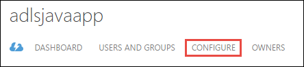
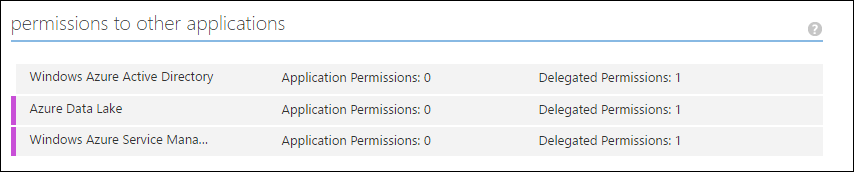

<properties
   pageTitle="Mit Lake Datenspeicher mithilfe von Active Directory authentifizieren | Microsoft Azure"
   description="Informationen Sie zum Authentifizieren mit Lake Datenspeicher mithilfe von Active Directory"
   services="data-lake-store"
   documentationCenter=""
   authors="nitinme"
   manager="jhubbard"
   editor="cgronlun"/>

<tags
   ms.service="data-lake-store"
   ms.devlang="na"
   ms.topic="article"
   ms.tgt_pltfrm="na"
   ms.workload="big-data"
   ms.date="10/17/2016"
   ms.author="nitinme"/>

# Endbenutzer-Authentifizierung mit Lake Datenspeicher mit Azure Active Directory

> [AZURE.SELECTOR]
- [Dienst-Authentifizierung](data-lake-store-authenticate-using-active-directory.md)
- [Endbenutzer-Authentifizierung](data-lake-store-end-user-authenticate-using-active-directory.md)

Azure Lake Datenspeicher verwendet Azure Active Directory für die Authentifizierung ein. Vor der Erstellung einer Anwendungs, die mit Azure Lake Datenspeicher oder Azure Daten dem Analytics funktioniert, müssen Sie zuerst entscheiden, wie Sie Ihrer Anwendung mit Azure Active Directory (Azure AD) authentifizieren möchten. Die beiden wichtigsten Optionen sind:

* Endbenutzer-Authentifizierung, und 
* Dienst-Authentifizierung. 

Diese beiden Optionen zu Fehlern in der Anwendung bereitgestellt werden, mit einem Token OAuth 2.0, die jeder Anforderung versucht, Azure Lake Datenspeicher oder Azure Daten dem Analytics zugeordnet wird.

Dieser Artikel beschreibt, wie erstellen eine Azure AD-Webanwendung für Endbenutzer-Authentifizierung. Anweisungen Azure AD-Anwendungskonfiguration für Dienst-Authentifizierung finden Sie unter [Authentifizierung Dienst, mit dem Datenspeicher verwenden Azure Active Directory](data-lake-store-authenticate-using-active-directory.md).

## Erforderliche Komponenten

* Ein Azure-Abonnement. Finden Sie [kostenlose Testversion Azure abrufen](https://azure.microsoft.com/pricing/free-trial/).
* Ihr Abonnement-ID an. Sie können ihn vom Azure-Portal abrufen. Sie beträgt beispielsweise aus dem Lake Datenspeicher Konto Blade zur Verfügung.

    

* Ihren Azure AD-Domänennamen ein. Sie können ihn durch bewegen den Mauszeiger in der oberen rechten Ecke des Portals Azure abrufen. Im folgenden Screenshot der Domänenname ist **contoso.microsoft.com**und die GUID in Klammern ist die ID des Mandanten 

    

## Endbenutzer-Authentifizierung

Dies wird empfohlen, wenn Sie einen Endbenutzer an Ihrer Anwendung über Azure AD anmelden möchten. Die Anwendung wird auf Azure Ressourcen mit der gleichen Ebene von Access als Endbenutzer zugreifen, die angemeldet sein. Ihre Endbenutzer müssen ihre Anmeldeinformationen in regelmäßigen Abständen in der Reihenfolge für eine Anwendung zum Verwalten von Access angeben.

Müssen den Endbenutzer, melden Sie sich als Ergebnis ist, dass die Anwendung einer Access-Token und ein Token aktualisieren angegeben ist. Das Access-Token erhält an jede Anforderung Lake Datenspeicher oder Daten dem Analytics vorgenommen, und es ist eine Stunde standardmäßig zulässig. Das Token aktualisieren kann verwendet werden, um ein neues Access Token zu erhalten, und es gilt für bis zu zwei Wochen standardmäßig Wenn regelmäßig verwendet. Sie können zwei verschiedene Ansätze für Endbenutzer Log in.

### Verwenden das Popup OAuth 2.0

Ihrer Anwendung kann ein OAuth 2.0 Autorisierung Popup, auslösen, in dem der Endbenutzer seine Anwendungsinformationen eingeben kann. Diesem Popupfenster funktioniert auch mit dem Prozess Azure AD zweifaktorielle Varianzanalyse Authentifizierung (2FA) ein, falls erforderlich. 

>[AZURE.NOTE] Diese Methode ist noch nicht in der Azure AD Authentifizierung Bibliothek (ADAL) für Python oder Java unterstützt.

### Direkt übergeben in Benutzeranmeldeinformationen.

Die Anwendung kann Benutzeranmeldeinformationen direkt zu Azure AD bereitstellen. Diese Methode funktioniert nur mit Organisations-ID-Benutzerkonten; Es ist nicht kompatibel mit persönlich / "live-ID" Benutzerkonten, einschließlich der Enden @outlook.com oder @live.com. Diese Methode ist außerdem nicht kompatibel mit Benutzerkonten, die Azure AD zweifaktorielle Varianzanalyse Authentifizierung (2FA) erforderlich ist.

### Was muss ich zu diesem Ansatz?

* Azure AD-Domänennamen. Dies ist bereits in der Voraussetzung dieses Artikels aufgeführt.

* Azure AD- **Webanwendung**

* Client-ID für die Azure AD-Webanwendung

* Antworten URI für die Azure AD-Webanwendung

* Delegierte Festlegen von Berechtigungen

Anweisungen zum Erstellen einer Azure AD-Web-Anwendung, und konfigurieren Sie ihn für die oben aufgeführten Anforderungen finden Sie unter Abschnitt unten [eine Active Directory-Anwendung erstellen](#create-an-active-directory-application) . 

## Erstellen einer Active Directory-Anwendung

In diesem Abschnitt, die Informationen zum Erstellen und Konfigurieren einer Webanwendung Azure AD-für Endbenutzer-Authentifizierung mit Azure Lake Datenspeicher lernen wir Azure Active Directory verwenden.

### Schritt 1: Erstellen einer Azure Active Directory-Anwendung

>[AZURE.NOTE] Verwenden Sie die folgenden Schritte aus Azure-Portal aus. Sie können auch eine Azure AD-Anwendung mit [Azure PowerShell](../resource-group-authenticate-service-principal.md) oder [Azure CLI](../resource-group-authenticate-service-principal-cli.md)erstellen.

1. Melden Sie sich bei Ihrem Konto Azure über das [klassische Portal](https://manage.windowsazure.com/)aus.

2. Wählen Sie im linken Bereich aus **Active Directory** .

     
     
3. Wählen Sie die Active Directory, die Sie zum Erstellen der neuen Anwendungs verwenden möchten. Wenn Sie mehrere Active Directory haben, möchten Sie normalerweise die Anwendung im Verzeichnis zu erstellen, in dem sich Ihr Abonnement befindet. Sie können nur Zugriff auf Ressource in Ihrem Abonnement für Applikationen in demselben Verzeichnis wie Ihr Abonnement gewähren.  

     
    
    
3. Wenn die Anwendungen in Ihrem Verzeichnis anzeigen möchten, klicken Sie auf on **Applications**.

     

4. Wenn Sie eine Anwendung in diesem Verzeichnis erstellt haben, bevor Sie erhalten sollen auf die folgende Abbildung einer ähnlichen. Klicken Sie auf **eine Anwendung hinzufügen**

     

     Oder klicken Sie im unteren Bereich auf **Hinzufügen** .

     

6. Geben Sie einen Namen für die Anwendung, und wählen Sie den Typ der Anwendung, die Sie erstellen möchten. In diesem Lernprogramm erstellen Sie eine **WEB-Anwendung und/oder WEB-API** , und klicken Sie auf die Schaltfläche Weiter.

     

7. Füllen Sie die Eigenschaften für Ihre app ein. **Melden Sie sich auf URL**vorsehen Sie den URI zu einer Website, die eine Anwendung beschreibt. Das Vorhandensein der Website wird nicht überprüft. Bieten Sie für **APP-ID-URI**des URIS, Ihrer Anwendung bezeichnet.

     

    Klicken Sie auf das Häkchen zum Abschließen des Assistenten, und erstellen Sie die Anwendung.

### Schritt 2: Rufen Sie Client-Id ab, Antworten Sie URI und festlegen zugewiesenen Berechtigungen

1. Klicken Sie auf die Registerkarte **Konfigurieren** Ihrer Anwendung Kennwort konfigurieren.

     

2. Kopieren Sie die **CLIENT-ID**an.
  
     

3. Kopieren Sie im Abschnitt für **einmaliges Anmelden** der **Antwort URI**aus.

    

4. Klicken Sie unter **Berechtigungen für andere Programme**klicken Sie auf **Anwendung hinzufügen**

    

5. Wählen Sie **Die Daten dem Azure** und **Windows** **Azure Service Management-API**im Assistenten **Berechtigungen für andere Programme** , und klicken Sie auf das Häkchen.

6. Standardmäßig ist die **Delegierte Berechtigungen** für die neu hinzugefügten Dienste auf NULL gesetzt. Klicken Sie auf die Dropdownliste für die Daten Lake Azure und Windows Azure-Verwaltungsdienst **Delegierte Berechtigungen** , und wählen Sie die verfügbaren Kontrollkästchen aus, um die Werte auf 1 festgelegt. Das Ergebnis sieht folgendermaßen aus.

     

7. Klicken Sie auf **Speichern**.

## Nächste Schritte

In diesem Artikel erstellt eine Web-Anwendung Azure AD- und gesammelten Informationen, die Sie in Ihrer Clientanwendungen müssen, verwenden von .NET SDK, Java SDK usw. zu erstellen. Sie können nun in den folgenden Artikeln fortfahren, die Informationen zum Verwenden der Web-Anwendungs Azure AD-zuerst mit Lake Datenspeicher authentifizieren, und führen Sie dann auf andere Vorgänge im Speicher sprechen.

- [Erste Schritte mit Azure Lake Datenspeicher mit .NET SDK](data-lake-store-get-started-net-sdk.md)
- [Erste Schritte mit Azure Lake Datenspeicher mit Java SDK](data-lake-store-get-started-java-sdk.md)
