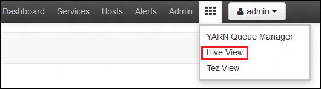

<properties
   pageTitle="Erstellen Sie HDInsight Cluster mit Azure Lake Datenspeicher mit dem Portal | Azure"
   description="Verwenden Sie zum Erstellen und Verwenden von HDInsight Cluster mit Azure Lake Datenspeicher Azure-Portal"
   services="data-lake-store,hdinsight" 
   documentationCenter=""
   authors="nitinme"
   manager="jhubbard"
   editor="cgronlun"/>

<tags
   ms.service="data-lake-store"
   ms.devlang="na"
   ms.topic="article"
   ms.tgt_pltfrm="na"
   ms.workload="big-data"
   ms.date="10/21/2016"
   ms.author="nitinme"/>

# Erstellen eines HDInsight Clusters mit Lake Datenspeicher mithilfe von Azure-Portal

> [AZURE.SELECTOR]
- [Mithilfe von Portal](data-lake-store-hdinsight-hadoop-use-portal.md)
- [Mithilfe der PowerShell](data-lake-store-hdinsight-hadoop-use-powershell.md)
- [Verwenden von Ressourcenmanager](data-lake-store-hdinsight-hadoop-use-resource-manager-template.md)

Informationen Sie zum Azure-Portal verwenden, um einen HDInsight-Cluster (Hadoop, HBase, Spark oder Storm) mit Zugriff auf Azure Lake Datenspeicher zu erstellen. Einige wichtige Hinweise in dieser Version:

* Als zusätzlichen Speicherkonto kann nur **für Spark Cluster (Linux) und Hadoop Cluster (Windows und Linux)**, die Lake Datenspeicher verwendet werden. Das Standardkonto-Speicher für die solche Cluster werden weiterhin Azure Speicher Blobs (WASB).

* **Für Storm Cluster (Windows und Linux)**, die Lake Datenspeicher können zum Schreiben von Daten aus einer Suchtopologie Storm verwendet werden. Lake Datenspeicher können auch verwendet werden Bezug Daten gespeichert werden, die dann gelesen werden können durch eine Storm Suchtopologie. Weitere Informationen finden Sie unter [Verwenden dem Datenspeicher in einer Suchtopologie Storm](#use-data-lake-store-in-a-storm-topology).

* **Für HBase Cluster (Windows und Linux)**, die Datenspeicher Lake kann als ein Standardspeicher sowie weiteren Speicherplatz verwendet werden. Weitere Informationen finden Sie unter [Verwenden dem Datenspeicher mit HBase Cluster](#use-data-lake-store-with-hbase-clusters).

> [AZURE.NOTE] Einige wichtige Punkte beachten. 
> 
> * Option zum Erstellen von HDInsight Cluster mit Zugriff auf Lake Datenspeicher steht nur für HDInsight Versionen 3,2 und 3.4 (für Hadoop, HBase und Storm Cluster auf Windows als auch Linux). Für Spark Cluster auf Linux ist diese Option nur auf HDInsight 3.4 Cluster verfügbar.
>
> * Wie zuvor erwähnt, ist Lake Datenspeicher als Standardspeicher für bestimmte Clustertypen (HBase) und weiteren Speicherplatz für andere Clustertypen (Hadoop, Spark Storm) verfügbar. Lake Datenspeicher als Konto zusätzlicher Speicher mit wirkt sich nicht auf Leistung oder die Möglichkeit, um die Speicherung aus dem Cluster schreibgeschützt aus. In einem Szenario, in dem Lake Datenspeicher als zusätzlichen Speicher verwendet wird, sind Cluster-bezogene Dateien (z. B. Protokolle, usw.) auf den Standardspeicher Azure Bibliothek geschrieben, während die Daten, die Sie bearbeiten möchten, in einem Konto Lake Datenspeicher gespeichert werden können.

## Erforderliche Komponenten

Bevor Sie dieses Lernprogramm beginnen, benötigen Sie Folgendes:

- **Ein Azure-Abonnement**. Finden Sie [kostenlose Testversion Azure abrufen](https://azure.microsoft.com/pricing/free-trial/).

- **Azure dem Datenspeicher-Konto**. Folgen Sie den Anweisungen bei [den ersten Schritten mit Azure dem Datenspeicher mithilfe der Azure-Portal](data-lake-store-get-started-portal.md)an. 

- **Einige Beispieldaten bei Ihrem Konto Azure dem Datenspeicher hochladen**. Nachdem Sie das Konto erstellt haben, führen Sie die folgenden Vorgänge, um einige Beispieldaten hochladen. Sie benötigen diese Daten später im Lernprogramm auszuführenden Einzelvorgänge aus einem HDInsight Cluster, die Daten im Datenspeicher Lake zugreifen.

    * [Erstellen eines Ordners in dem Datenspeicher](data-lake-store-get-started-portal.md#createfolder).
    * [Hochladen einer Datei auf dem Datenspeicher](data-lake-store-get-started-portal.md#uploaddata). Wenn Sie einige Beispieldaten hochladen suchen, können Sie den Ordner **Krankenwagen Daten** aus dem [Azure Daten dem Git Repository](https://github.com/Azure/usql/tree/master/Examples/Samples/Data/AmbulanceData)abrufen.

- **Azure Active Directory-Dienst Tilgungsanteile**. Die Schritte in diesem Lernprogramm Bereitstellen von Anweisungen zum Erstellen einer Dienst Tilgungsanteile in Azure Active Directory. Jedoch müssen Sie Administrator Azure AD-werden sollen, erstellen einen Dienst Tilgungsanteile sein. Wenn Sie ein Azure AD-Administrator sind, können Sie diese Voraussetzung überspringen und Fortsetzen des Lernprogramms.
    
    **Wenn Sie kein Azure AD-Administrator sind**, werden Sie nicht die erforderlichen Schritte zum Erstellen einer Dienst Tilgungsanteile ausführen sein. In diesem Fall muss Ihre Azure AD-Administrator zuerst ein Dienst Tilgungsanteile erstellen, vor der Erstellung eines HDInsight Clusters mit Lake Datenspeicher. Darüber hinaus muss die Tilgungsanteile Dienst erstellt werden mit einem Zertifikat, wie bei [einen Dienst Hauptbenutzer mit Zertifikat erstellen](../resource-group-authenticate-service-principal.md#create-service-principal-with-certificate)beschrieben.

## Erfahren Sie schneller mit Videos?

Schauen Sie sich die folgenden Videos an, um zu verstehen, wie HDInsight Cluster mit Zugriff auf Lake Datenspeicher bereitstellen.

* [Erstellen eines HDInsight Clusters mit Zugriff auf Lake Datenspeicher](https://mix.office.com/watch/l93xri2yhtp2)
* Sobald der Cluster, [in dem Datenspeicher Skripts Struktur und Schwein mit Access-Daten eingerichtet ist](https://mix.office.com/watch/1n9g5w0fiqv1q)

## Erstellen eines HDInsight Clusters mit Zugriff auf Azure Lake Datenspeicher

In diesem Abschnitt erstellen Sie einen HDInsight Hadoop Cluster mit dem Lake Datenspeicher wie einer zusätzlichen Speicher. In dieser Version kann für einen Cluster Hadoop Lake Datenspeicher nur als einer zusätzlichen Speicher für den Cluster verwendet werden. Der Standardspeicher bleibt die Blobs Azure-Speicher (WASB). Ja, wird der Speicherkonto und Speichercontainer für den Cluster erforderlich zuerst erstellen.

1. Melden Sie sich auf das neue [Azure-Portal](https://portal.azure.com)an.

2. Führen Sie die Schritte in [Erstellen Hadoop Cluster in HDInsight](../hdinsight/hdinsight-provision-clusters.md#create-using-the-preview-portal) zum Starten einen HDInsight Cluster bereitgestellt.

3. Klicken Sie auf das Blade **Optionale Konfiguration** auf **Datenquelle**. Geben Sie in der **Datenquelle** Blade die Details für den Speicher-Konto und Speichercontainer, **Speicherort** als **Ostasiatischen US 2**Geben Sie an, und klicken Sie dann auf **Cluster AAD Identität**.

    ![Hauptbenutzer zu HDInsight Cluster hinzufügen-Dienst] (./media/data-lake-store-hdinsight-hadoop-use-portal/hdi.adl.1.png "Hauptbenutzer zu HDInsight Cluster hinzufügen-Dienst")

4. Klicken Sie auf das Blade **Cluster AAD Identität** können Sie auswählen, wählen Sie einen vorhandenen Dienst Hauptbenutzer oder einen neuen erstellen.

    * **Erstellen einer neuen Dienst Tilgungsanteile**

        * Klicken Sie in das Blade **Cluster AAD Identität** auf **neu erstellen**, klicken Sie auf **Dienst Tilgungsanteile**, und geben Sie dann in das **Erstellen einer Dienst Tilgungsanteile** Blade Werte, um einen neuen Dienst Tilgungsanteile erstellen. Im Rahmen der wird ein Zertifikat und Azure-Active Directory-Anwendung ebenfalls erstellt. Klicken Sie auf **Erstellen**.

            ![Hauptbenutzer zu HDInsight Cluster hinzufügen-Dienst] (./media/data-lake-store-hdinsight-hadoop-use-portal/hdi.adl.2.png "Hauptbenutzer zu HDInsight Cluster hinzufügen-Dienst")

        * Klicken Sie auf das Blade **Cluster AAD Identität** **ADLS Verwalten des Zugriffs**auf. Klicken Sie im Bereich zeigt die Lake Datenspeicher-Konten mit dem Abonnement verknüpft ist. Sie können jedoch die Berechtigungen für das Konto nur festlegen, die Sie erstellt haben. Wählen Sie lesen/schreiben/ausführen Berechtigungen für das Konto aus, die, das Sie mit dem Cluster HDInsight zuordnen und dann auf **Berechtigungen speichern**möchten.

            ![Hauptbenutzer zu HDInsight Cluster hinzufügen-Dienst] (./media/data-lake-store-hdinsight-hadoop-use-portal/hdi.adl.3.png "Hauptbenutzer zu HDInsight Cluster hinzufügen-Dienst")

        * Klicken Sie auf das Blade **Cluster AAD Identität** auf **Zertifikat herunterladen** , um das Zertifikat mit dem Dienst, der Sie erstellt Hauptbenutzer herunterladen. Dies ist sinnvoll, wenn der Dienst Hauptbenutzer in der Zukunft verwenden, während Sie weitere HDInsight Cluster erstellen möchten. Klicken Sie auf **auswählen**.

            ![Hauptbenutzer zu HDInsight Cluster hinzufügen-Dienst] (./media/data-lake-store-hdinsight-hadoop-use-portal/hdi.adl.4.png "Hauptbenutzer zu HDInsight Cluster hinzufügen-Dienst")

    * **Wählen Sie einen vorhandenen Dienst Hauptbenutzer**

        * Klicken Sie in das Blade **Cluster AAD Identität** auf **vorhandene verwenden**, klicken Sie auf **Dienst Tilgungsanteile**und in das Blade **Wählen Sie einen Dienst Tilgungsanteile** , suchen Sie nach einer vorhandenen Dienst Tilgungsanteile. Klicken Sie auf einen Dienst Benutzerprinzipalnamen, und klicken Sie dann auf **auswählen**.

            ![Hauptbenutzer zu HDInsight Cluster hinzufügen-Dienst] (./media/data-lake-store-hdinsight-hadoop-use-portal/hdi.adl.5.png "Hauptbenutzer zu HDInsight Cluster hinzufügen-Dienst")

        * Klicken Sie auf das Blade **Cluster AAD Identität** hochladen Sie Zertifikat (PFX-Datei) mit dem Dienst der Tilgungsanteile, die Sie ausgewählt haben, und geben Sie dann das Kennwort des Zertifikats.

5. Klicken Sie auf **ADLS Zugriff verwalten** , und klicken Sie auf **Dateiberechtigungen auswählen**. 

    ![Hauptbenutzer zu HDInsight Cluster hinzufügen-Dienst] (./media/data-lake-store-hdinsight-hadoop-use-portal/hdi.adl.5.existing.save.png "Hauptbenutzer zu HDInsight Cluster hinzufügen-Dienst")

6. Wählen Sie in das Blade **Wählen Sie Dateiberechtigungen** aus der Dropdownliste **Konto** Lake Datenspeicher Kontos, der dem HDInsight Cluster zugeordnet werden soll. Das Blade Listet die Dateien und Ordner in das ausgewählte Lake Datenspeicher Konto verfügbar. 
 
    ![Zugang zu dem Datenspeicher] (./media/data-lake-store-hdinsight-hadoop-use-portal/hdi-adl-permission-1.png "Zugang zu dem Datenspeicher")

    Bestimmen Sie anschließend die Berechtigungen für bereitgestellt werden die ausgewählten Dateien und Ordner. Geben Sie für Ordner auch an, ob die Berechtigungen für den Ordner nur oder auf den Ordner und alle untergeordneten Elemente im Ordner gelten. Sie können eine Auswahl getroffen haben, indem Sie den entsprechenden Wert aus der **Anwenden** auswählen Dropdown-Liste. Um eine Berechtigung zu entfernen, klicken Sie auf das Symbol **Löschen**

    ![Zugang zu dem Datenspeicher] (./media/data-lake-store-hdinsight-hadoop-use-portal/hdi-adl-permission-2.png "Zugang zu dem Datenspeicher")

    Wiederholen Sie diese Schritte zu zugehörigen Dateien und Ordner aus anderen Lake Datenspeicher Konten ebenfalls an. Wenn Sie die Berechtigungen zuweisen abgeschlossen haben, klicken Sie auf, **Wählen** Sie am unteren Rand der Blade.

7. Überprüfen Sie die Berechtigungen, die Sie zur Verfügung gestellt, und klicken Sie dann auf **Ausführen** , um diese Berechtigungen zu gewähren, in das Blade **Ausgewählte Berechtigungen zuweisen** .

    ![Zugang zu dem Datenspeicher] (./media/data-lake-store-hdinsight-hadoop-use-portal/hdi-adl-permission-3.png "Zugang zu dem Datenspeicher")

    In der Statusspalte zeigt den Fortschritt an. Nachdem alle Berechtigungen erfolgreich zugewiesen sind, klicken Sie auf **Fertig**. 

6. Klicken Sie auf den **Cluster AAD Identität** und **Datenquelle** Blades auf **auswählen** , und klicken Sie dann Cluster erstellen fort, wie bei [Erstellen Hadoop Cluster in HDInsight](../hdinsight/hdinsight-hadoop-create-linux-clusters-portal.md)beschrieben.

7. Sobald der Cluster bereitgestellt wird, können Sie überprüfen, dass der Dienst Tilgungsanteile HDInsight Cluster zugeordnet ist. Klicken Sie dazu aus dem Cluster Blade auf **Cluster AAD Identität** , um die zugehörige Service Tilgungsanteile anzuzeigen.

    ![Hauptbenutzer zu HDInsight Cluster hinzufügen-Dienst] (./media/data-lake-store-hdinsight-hadoop-use-portal/hdi.adl.6.png "Hauptbenutzer zu HDInsight Cluster hinzufügen-Dienst")

## HDInsight Cluster Datenspeicher Lake Azure verwenden Testaufträge ausgeführt

Nachdem Sie einen HDInsight Cluster konfiguriert haben, können Sie Test Einzelvorgänge ausführen, auf dem Cluster zu testen, ob der HDInsight Cluster Daten in Azure Lake Datenspeicher zugreifen kann. Ausführen, damit wir einige Struktur Abfragen die Ziel Lake Datenspeicher ausgeführt wird.

### Für einen Linux cluster

1. Öffnen Sie das Cluster Blade für den Cluster, den Sie direkt nach der Bereitstellung, und klicken Sie dann auf **Dashboard**. Dadurch wird die Ambari für den Linux Cluster geöffnet. Wenn Sie Ambari zugreifen zu können, werden Sie aufgefordert, zu der Website authentifizieren. Geben Sie im Admin (Standard-Administrator) Kontoname und Kennwort, die Sie beim Erstellen des Clusters verwendet.

    ![Starten Sie Cluster dashboard] (./media/data-lake-store-hdinsight-hadoop-use-portal/hdiadlcluster1.png "Starten Sie Cluster dashboard")

    Sie können auch direkt mit Ambari navigieren, indem Sie zu https://CLUSTERNAME.azurehdinsight.net in einem Webbrowser (wobei **CLUSTERNAME** für den Namen Ihrer HDInsight Cluster ist).

2. Öffnen Sie die Struktur Ansicht ein. Wählen Sie in der Liste Verfügbare Ansichten Festlegen der Quadrate aus dem Seitenmenü "(neben dem Link zum **Admin** und auf die Schaltfläche rechts auf der Seite). Wählen Sie die **Struktur** Ansicht aus.

    

3. Sie sollten eine Seite ähnlich wie der folgende finden Sie unter:

    

4. Fügen Sie im **Abfrage-Editor** -Abschnitt der Seite die folgende HiveQL-Anweisung in das Arbeitsblatt ein:

        CREATE EXTERNAL TABLE vehicles (str string) LOCATION 'adl://mydatalakestore.azuredatalakestore.net:443/mynewfolder'

5. Klicken Sie auf die Schaltfläche " **Ausführen** " am unteren Rand der **Abfrage-Editor** , um die Abfrage zu starten. Ein Abschnitt **Prozess Abfrageergebnisse** angezeigt, die unterhalb der **Abfrage-Editor** werden soll, und Anzeigen von Informationen über das Projekt.

6. Sobald die Abfrage abgeschlossen ist, wird im Abschnitt **Prozess Abfrageergebnisse** die Ergebnisse des Vorgangs angezeigt. Die Registerkarte **Ergebnisse** sollten die folgende Informationen enthalten:

7. Führen Sie die folgende Abfrage aus, um sicherzustellen, dass die Tabelle erstellt wurde.

        SHOW TABLES;

    Die Registerkarte **Ergebnisse** sollte wie folgt aussehen:

        hivesampletable
        vehicles

    **Fahrzeuge** ist die Tabelle, die Sie zuvor erstellt haben. **Hivesampletable** ist eine Beispieltabelle in alle HDInsight Cluster standardmäßig zur Verfügung.

8. Sie können auch eine Abfrage zum Abrufen von Daten aus der Tabelle **Fahrzeuge** ausführen.

        SELECT * FROM vehicles LIMIT 5;

### Bei einem Windows-cluster

1. Öffnen Sie das Cluster Blade für den Cluster, den Sie direkt nach der Bereitstellung, und klicken Sie dann auf **Dashboard**.

    ![Starten Sie Cluster dashboard] (./media/data-lake-store-hdinsight-hadoop-use-portal/hdiadlcluster1.png "Starten Sie Cluster dashboard")

    Wenn Sie dazu aufgefordert werden, geben Sie die Administratorberechtigungen für den Cluster aus.

2. Microsoft Azure HDInsight Abfrage Console wird geöffnet. Klicken Sie auf **Struktur Editor**.

    ![Offene Struktur-editor] (./media/data-lake-store-hdinsight-hadoop-use-portal/hdiadlcluster2.png "Offene Struktur-editor")

3. Geben Sie in der Struktur des Editors die folgende Abfrage ein, und klicken Sie auf **Absenden**.

        CREATE EXTERNAL TABLE vehicles (str string) LOCATION 'adl://mydatalakestore.azuredatalakestore.net:443/mynewfolder'

    In dieser Abfrage Struktur erstellen wir eine Tabelle aus Daten gehörende Kehrmatrix Lake Datenspeicher am `adl://mydatalakestore.azuredatalakestore.net:443/mynewfolder`. Dieser Speicherort enthält eine Beispiel-Datendatei, die Sie zuvor hochgeladen haben, sollten.

    Die **Position Sitzung** Tabelle unten zeigt den Status des Projekts von **Initialisierung**, auf **Ausführen**, zu **abgeschlossen**ändern. Klicken Sie auf **Details anzeigen** , um weitere Informationen zu abgeschlossenen Projekts anzuzeigen.

    ![Erstellen einer Tabelle] (./media/data-lake-store-hdinsight-hadoop-use-portal/hdiadlcluster3.png "Erstellen einer Tabelle")

4. Führen Sie die folgende Abfrage aus, um sicherzustellen, dass die Tabelle erstellt wurde.

        SHOW TABLES;

    Klicken Sie auf **Details anzeigen** , diese Abfrage und deren Ausgabe entspricht, sollten Sie Folgendes anzeigen:

        hivesampletable
        vehicles

    **Fahrzeuge** ist die Tabelle, die Sie zuvor erstellt haben. **Hivesampletable** ist eine Beispieltabelle in alle HDInsight Cluster standardmäßig zur Verfügung.

5. Sie können auch eine Abfrage zum Abrufen von Daten aus der Tabelle **Fahrzeuge** ausführen.

        SELECT * FROM vehicles LIMIT 5;

## Access Lake Datenspeicher HDFS Befehle verwenden

Nachdem Sie HDInsight Cluster um Lake Datenspeicher verwenden konfiguriert haben, können Sie die HDFS Shell-Befehle, auf den Speicher zuzugreifen.

### Für einen Linux cluster

In diesem Abschnitt Sie SSH zum Cluster wird, und führen Sie die Befehle HDFS. Windows bietet keinen integrierten SSH-Client. Es empfiehlt sich, mit **kitten**, die von [http://www.chiark.greenend.org.uk/~sgtatham/putty/download.html](http://www.chiark.greenend.org.uk/~sgtatham/putty/download.html)heruntergeladen werden kann.

Weitere Informationen zur Verwendung von kitten finden Sie unter [Verwenden SSH mit Linux-basierten Hadoop auf HDInsight von Windows](../hdinsight/hdinsight-hadoop-linux-use-ssh-windows.md).

Nachdem die Verbindung hergestellt wurde, verwenden Sie den folgenden Befehl ein HDFS Dateisystem die Dateien im Datenspeicher Lake aufgelistet.

    hdfs dfs -ls adl://<Data Lake Store account name>.azuredatalakestore.net:443/

Dies sollte der Datei aufgeführt, die Sie zuvor in die Datenspeicher Lake hochgeladen.

    15/09/17 21:41:15 INFO web.CaboWebHdfsFileSystem: Replacing original urlConnectionFactory with org.apache.hadoop.hdfs.web.URLConnectionFactory@21a728d6
    Found 1 items
    -rwxrwxrwx   0 NotSupportYet NotSupportYet     671388 2015-09-16 22:16 adl://mydatalakestore.azuredatalakestore.net:443/mynewfolder

Sie können auch die `hdfs dfs -put` Befehl aus, um mit dem Lake Datenspeicher einige Dateien hochladen, und verwenden Sie dann `hdfs dfs -ls` zu überprüfen, ob die Dateien erfolgreich hochgeladen wurden.

### Bei einem Windows-cluster

1. Melden Sie sich auf das neue [Azure-Portal](https://portal.azure.com)an.

2. Klicken Sie auf **Durchsuchen**, klicken Sie auf **HDInsight Cluster**, und klicken Sie dann auf HDInsight Cluster, den Sie erstellt haben.

3. Klicken Sie auf **Remote Desktop**in das Blade Cluster, und klicken Sie dann in das Blade **Remotedesktop** auf **Verbinden**.

    ![Remote in HDI cluster] (./media/data-lake-store-hdinsight-hadoop-use-portal/ADL.HDI.PS.Remote.Desktop.png "Erstellen einer Ressourcengruppe Azure")

    Wenn Sie dazu aufgefordert werden, geben Sie die Anmeldeinformationen, die Sie für den remote desktop Benutzer bereitgestellt.

4. In der remote-Sitzung starten von Windows PowerShell und verwenden Sie die HDFS Dateisystem-Befehle, die Dateien im Datenspeicher Lake Azure aufgelistet.

        hdfs dfs -ls adl://<Data Lake Store account name>.azuredatalakestore.net:443/

    Dies sollte der Datei aufgeführt, die Sie zuvor in die Datenspeicher Lake hochgeladen.

        15/09/17 21:41:15 INFO web.CaboWebHdfsFileSystem: Replacing original urlConnectionFactory with org.apache.hadoop.hdfs.web.URLConnectionFactory@21a728d6
        Found 1 items
        -rwxrwxrwx   0 NotSupportYet NotSupportYet     671388 2015-09-16 22:16 adl://mydatalakestore.azuredatalakestore.net:443/mynewfolder

    Sie können auch die `hdfs dfs -put` Befehl aus, um mit dem Lake Datenspeicher einige Dateien hochladen, und verwenden Sie dann `hdfs dfs -ls` zu überprüfen, ob die Dateien erfolgreich hochgeladen wurden.

## Verwenden Sie Lake Datenspeicher mit Spark cluster

In diesem Abschnitt verwenden Sie den Jupyter Notizbuch verfügbar mit HDInsight Spark Cluster zum Ausführen eines Auftrags, das Daten von einem Konto Lake Datenspeicher liest, die Sie mit einem HDInsight Spark-Cluster anstelle des BLOB-Speicher von Azure Standardkontos verknüpft.

1. Kopieren Sie über einige Beispieldaten, vom Speicher Standardkonto (WASB) mit Spark Cluster mit dem Cluster zugeordnet Azure Daten Lake Store-Konto verknüpft ist. Sie können das [Tool ADLCopy](http://aka.ms/downloadadlcopy) dazu verwenden. Herunterladen Sie und installieren Sie das Tool über den Link.

2. Öffnen Sie ein Eingabeaufforderungsfenster, und navigieren Sie zu dem AdlCopy, in der Regel installiert ist Verzeichnis `%HOMEPATH%\Documents\adlcopy`.

3. Führen Sie den folgenden Befehl aus, um einen bestimmten Blob des Containers zu einem Lake Datenspeicher zu kopieren:

        AdlCopy /source https://<source_account>.blob.core.windows.net/<source_container>/<blob name> /dest swebhdfs://<dest_adls_account>.azuredatalakestore.net/<dest_folder>/ /sourcekey <storage_account_key_for_storage_container>

    In diesem Lernprogramm kopieren die **HVAC.csv** Daten Beispieldatei am **/HdiSamples/HdiSamples/SensorSampleData/HKL-/** mit dem Konto Azure Lake Datenspeicher. Der Codeausschnitt aussehen sollte:

        AdlCopy /Source https://mydatastore.blob.core.windows.net/mysparkcluster/HdiSamples/HdiSamples/SensorSampleData/hvac/HVAC.csv /dest swebhdfs://mydatalakestore.azuredatalakestore.net/hvac/ /sourcekey uJUfvD6cEvhfLoBae2yyQf8t9/BpbWZ4XoYj4kAS5Jf40pZaMNf0q6a8yqTxktwVgRED4vPHeh/50iS9atS5LQ==

    >[AZURE.WARNING] Stellen Sie sicher, dass Sie die Namen und den Pfad Datei in die gemischte Groß-/Kleinschreibung sind.

4. Sie werden aufgefordert, die Anmeldeinformationen für das Azure-Abonnement einzugeben unter dem Sie Ihr Konto Lake Datenspeicher haben. Sie sehen eine Ausgabe ähnlich wie der folgende aus:

        Initializing Copy.
        Copy Started.
        100% data copied.
        Copy Completed. 1 file copied.

    Die-Datendatei (**HVAC.csv**) wird unter einem Ordner **/hvac** in das Konto Lake Datenspeicher kopiert werden.

4. Klicken Sie auf die Kachel für Ihren Cluster Spark, aus dem [Azure-Portal](https://portal.azure.com/), mithilfe der Startboard (Wenn Sie es an die Startboard angeheftet). Sie können auch navigieren Sie zu Ihren Cluster unter **Alle durchsuchen** > **HDInsight Cluster**.   

2. Klicken Sie aus dem Spark Cluster Blade auf **Quicklinks**, und klicken Sie dann aus dem Blade **Cluster Dashboard** auf **Jupyter Notizbuch**. Wenn Sie dazu aufgefordert werden, geben Sie die Administrator-Anmeldeberechtigungen für den Cluster aus.

    > [AZURE.NOTE] Sie möglicherweise auch das Notizbuch Jupyter für Ihren Cluster erreichen, indem Sie den folgenden URL in Ihrem Browser öffnen. Ersetzen Sie __CLUSTERNAME__ mit dem Namen der Cluster aus:
    >
    > `https://CLUSTERNAME.azurehdinsight.net/jupyter`

2. Erstellen eines neuen Notizbuchs an. Klicken Sie auf **neu**, und klicken Sie dann auf **PySpark**.

    ![Erstellen eines neuen Jupyter Notizbuchs] (./media/data-lake-store-hdinsight-hadoop-use-portal/hdispark.note.jupyter.createnotebook.png "Erstellen eines neuen Jupyter Notizbuchs")

3. Ein neues Notizbuch erstellt und mit dem Namen **Untitled.pynb**geöffnet. 

4. Da Sie ein Notizbuch, mit dem die PySpark Kernel erstellt haben, müssen Sie keine Kontexte explizit zu erstellen. Die Kontexte Spark und Struktur werden automatisch für Sie erstellt werden, wenn Sie die erste Zelle der Code ausführen. Sie können beginnen, durch Importieren der Datentypen für dieses Szenario erforderlich ist. Dazu fügen Sie den folgenden Codeausschnitt in einer Zelle, und drücken Sie **UMSCHALT + EINGABETASTE**.

        from pyspark.sql.types import *
        
    Jedes Mal, wenn Sie ein Projekt in Jupyter ausgeführt haben, wird der Web-Fenster Browsertitel zusammen mit den notizbuchtitel Status **(gebucht)** angezeigt. Außerdem sehen Sie einen durchgezogenen Kreis neben dem Text **PySpark** in der oberen rechten Ecke. Nachdem Sie der Auftrag abgeschlossen ist, wird dies in einen leeren Kreis ändern.

     ![Status eines Auftrags Jupyter Notizbuch] (./media/data-lake-store-hdinsight-hadoop-use-portal/hdispark.jupyter.job.status.png "Status eines Auftrags Jupyter Notizbuch")

4. Laden Sie Beispieldaten in eine temporäre Tabelle mithilfe der **HVAC.csv** -Datei, die Sie mit dem Konto Lake Datenspeicher kopiert haben. Sie können die Daten in das mit dem folgenden URL Muster Lake Datenspeicher-Konto zugreifen.

        adl://<data_lake_store_name>.azuredatalakestore.net/<path_to_file>

    Fügen Sie in eine leere Zelle den folgenden Code wird, ersetzen Sie **MYDATALAKESTORE** mit Ihren Kontonamen Lake Datenspeicher, und drücken Sie **UMSCHALT + EINGABETASTE**. In diesem Codebeispiel registriert die Daten in eine temporäre Tabelle **HKL-System**bezeichnet.

        # Load the data
        hvacText = sc.textFile("adl://MYDATALAKESTORE.azuredatalakestore.net/hvac/HVAC.csv")
        
        # Create the schema
        hvacSchema = StructType([StructField("date", StringType(), False),StructField("time", StringType(), False),StructField("targettemp", IntegerType(), False),StructField("actualtemp", IntegerType(), False),StructField("buildingID", StringType(), False)])
        
        # Parse the data in hvacText
        hvac = hvacText.map(lambda s: s.split(",")).filter(lambda s: s[0] != "Date").map(lambda s:(str(s[0]), str(s[1]), int(s[2]), int(s[3]), str(s[6]) ))
        
        # Create a data frame
        hvacdf = sqlContext.createDataFrame(hvac,hvacSchema)
        
        # Register the data fram as a table to run queries against
        hvacdf.registerTempTable("hvac")

5. Da Sie einen PySpark Kernel verwenden, Sie können jetzt direkt ausführen eine SQL-Abfrage auf die temporäre Tabelle **HKL-System** , die Sie soeben erstellt, mithilfe haben der `%%sql` magische. Weitere Informationen zu den `%%sql` magische sowie andere zur Verfügung, mit dem Kernel PySpark Magics finden Sie unter [Kerneln Jupyter Notizbücher mit Spark HDInsight Cluster zur Verfügung](hdinsight-apache-spark-jupyter-notebook-kernels.md#why-should-i-use-the-new-kernels).
        
        %%sql
        SELECT buildingID, (targettemp - actualtemp) AS temp_diff, date FROM hvac WHERE date = \"6/1/13\"

5. Nachdem Sie der Auftrag erfolgreich abgeschlossen wurde, wird die folgende tabellarische Ausgabe standardmäßig angezeigt.

    ![Tabellenausgabe Abfrageergebnis] (./media/data-lake-store-hdinsight-hadoop-use-portal/tabular.output.png "Tabellenausgabe Abfrageergebnis")

    Sie können auch die Ergebnisse in anderen Visualisierungen ebenfalls anzeigen. Beispielsweise würde ein Bereichsdiagramm für das gleiche Ergebnis wie folgt aussehen.

    ![Flächendiagramm der Abfrageergebnis] (./media/data-lake-store-hdinsight-hadoop-use-portal/area.output.png "Flächendiagramm der Abfrageergebnis")

6. Nachdem Sie die Ausführung der Anwendung abgeschlossen haben, sollten Sie war(en) das Notizbuch, um die Ressourcen freizugeben. Klicken Sie dazu im Menü **Datei** auf dem Notizbuch, auf **Schließen und Anhalten**. Diese wird geschlossen und schließen Sie das Notizbuch.

## Verwenden Sie Lake Datenspeicher in einem Storm Suchtopologie

Die Lake Datenspeicher können zum Schreiben von Daten aus einer Suchtopologie Storm. Informationen dazu, wie dieses Szenario erzielen finden Sie unter [Verwenden Azure dem Datenspeicher mit Apache Storm mit HDInsight](../hdinsight/hdinsight-storm-write-data-lake-store.md).

## Verwenden Sie Lake Datenspeicher mit HBase Cluster

Mit HBase Cluster können Sie als ein Standardspeicher sowie weiteren Speicherplatz Lake Datenspeicher verwenden. Dazu:

1.  Wählen Sie in der **Datenquelle** Blade für **HBase Datenspeicherort**, **Dem Datenspeicher** aus.
2.  Wählen Sie den Namen des Speichers Lake Daten, die Sie verwenden möchten, oder Erstellen eines neuen Kontos.
3.  Geben Sie zum Abschluss der **Stammordner HBase** innerhalb der Lake Datenspeicher. Wenn das Konto Lake Datenspeicher keinen Stammordner, erstellen Sie eine neue aus.

    ![HBase mit dem Datenspeicher] (./media/data-lake-store-hdinsight-hadoop-use-portal/hbase-data-lake-store.png "Erstellen einer Ressourcengruppe Azure")

### Aspekte beim Lake Datenspeicher als Standardspeicher für HBase Cluster zu verwenden.

* Das gleiche Lake Datenspeicher-Konto können für mehrere HBase Cluster. Den **Stammordner HBase** , die Sie für den Cluster (Schritt 4 auf dem Bildschirmfoto oben) bereitstellen muss jedoch eindeutig sein. Verwenden Sie den gleichen Stammordner **nicht müssen** Sie über zwei verschiedene HBase Cluster aus.
* Obwohl Sie als Standardspeicher Lake Datenspeicher-Konto verwenden, werden die HBase Cluster Protokolldateien in der Azure Speicher Blobs (WASB) mit dem Cluster verknüpft ist weiterhin gespeichert. Dies ist das Bildschirmfoto oben im Feld blau hervorgehoben.

## Siehe auch

* [PowerShell: Erstellen eines HDInsight Clusters um Lake Datenspeicher verwenden](data-lake-store-hdinsight-hadoop-use-powershell.md)

[makecert]: https://msdn.microsoft.com/library/windows/desktop/ff548309(v=vs.85).aspx
[pvk2pfx]: https://msdn.microsoft.com/library/windows/desktop/ff550672(v=vs.85).aspx
