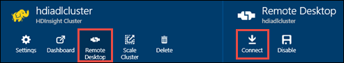

<properties
   pageTitle="HDInsight Cluster mit Azure Lake Datenspeicher mit Ressourcenmanager Vorlagen erstellen | Microsoft Azure"
   description="Verwenden Sie Ressourcenmanager Azure Vorlagen zum Erstellen und Verwenden von HDInsight Cluster mit Azure Lake Datenspeicher"
   services="data-lake-store,hdinsight"
   documentationCenter=""
   authors="nitinme"
   manager="jhubbard"
   editor="cgronlun"/>

<tags
   ms.service="data-lake-store"
   ms.devlang="na"
   ms.topic="article"
   ms.tgt_pltfrm="na"
   ms.workload="big-data"
   ms.date="10/21/2016"
   ms.author="nitinme"/>

# <a name="create-an-hdinsight-cluster-with-data-lake-store-using-azure-resource-manager-template"></a>Erstellen eines HDInsight Clusters mit Lake Datenspeicher mit Ressourcenmanager Azure-Vorlage

> [AZURE.SELECTOR] - [Mithilfe von Portal](data-lake-store-hdinsight-hadoop-use-portal.md) - [mithilfe der PowerShell](data-lake-store-hdinsight-hadoop-use-powershell.md) - [Ressourcenmanager verwenden](data-lake-store-hdinsight-hadoop-use-resource-manager-template.md)

Erfahren Sie, wie Sie mit einer Vorlage Ressourcenmanager Azure einen Cluster HDInsight Zugriff auf Azure Lake Datenspeicher konfigurieren. Einige wichtige Hinweise in dieser Version:

-   Als zusätzlichen Speicherkonto kann nur **für Spark Cluster (Linux), und Hadoop/Storm Cluster (Windows und Linux)**, die Lake Datenspeicher verwendet werden. Das Standardkonto-Speicher für die solche Cluster werden weiterhin Azure Speicher Blobs (WASB).

-   Als Standardspeicher oder weiteren Speicherplatz kann **für HBase Cluster (Windows und Linux)**, die Lake Datenspeicher verwendet werden.

> [AZURE.NOTE] Einige wichtige Punkte beachten.
>
> - Option zum Erstellen von HDInsight Cluster mit Zugriff auf Lake Datenspeicher steht nur für HDInsight Versionen 3,2 und 3.4 (für Hadoop, HBase und Storm Cluster auf Windows als auch Linux). Für Spark Cluster auf Linux ist diese Option nur auf HDInsight 3.4 Cluster verfügbar.
>
> - Wie zuvor erwähnt, ist Lake Datenspeicher als Standardspeicher für bestimmte Clustertypen (HBase) und weiteren Speicherplatz für andere Clustertypen (Hadoop, Spark Storm) verfügbar. Lake Datenspeicher als Konto zusätzlicher Speicher mit wirkt sich nicht auf Leistung oder die Möglichkeit, um die Speicherung aus dem Cluster schreibgeschützt aus. In einem Szenario, in dem Lake Datenspeicher als zusätzlichen Speicher verwendet wird, sind Cluster-bezogene Dateien (z. B. Protokolle, usw.) auf den Standardspeicher Azure Bibliothek geschrieben, während die Daten, die Sie bearbeiten möchten, in einem Konto Lake Datenspeicher gespeichert werden können.
>

In diesem Artikel bereitstellen wir einen Hadoop Cluster mit Lake Datenspeicher als zusätzlichen Speicher.

## <a name="prerequisites"></a>Erforderliche Komponenten

Bevor Sie dieses Lernprogramm beginnen, benötigen Sie Folgendes:

-   **Ein Azure-Abonnement**. Finden Sie [kostenlose Testversion Azure abrufen](https://azure.microsoft.com/pricing/free-trial/).

-   **Azure PowerShell 1.0 oder größer**. Informationen Sie [zum Installieren und Konfigurieren von Azure PowerShell](../powershell-install-configure.md).

- **Azure Active Directory-Dienst Tilgungsanteile**. Die Schritte in diesem Lernprogramm Bereitstellen von Anweisungen zum Erstellen einer Dienst Tilgungsanteile in Azure Active Directory. Jedoch müssen Sie Administrator Azure AD-werden sollen, erstellen einen Dienst Tilgungsanteile sein. Wenn Sie ein Azure AD-Administrator sind, können Sie diese Voraussetzung überspringen und Fortsetzen des Lernprogramms.
    
    **Wenn Sie kein Azure AD-Administrator sind**, werden Sie nicht die erforderlichen Schritte zum Erstellen einer Dienst Tilgungsanteile ausführen sein. In diesem Fall muss Ihre Azure AD-Administrator zuerst ein Dienst Tilgungsanteile erstellen, vor der Erstellung eines HDInsight Clusters mit Lake Datenspeicher. Darüber hinaus muss die Tilgungsanteile Dienst erstellt werden mit einem Zertifikat, wie bei [einen Dienst Hauptbenutzer mit Zertifikat erstellen](../resource-group-authenticate-service-principal.md#create-service-principal-with-certificate)beschrieben.

## <a name="create-an-hdinsight-cluster-with-azure-data-lake-store"></a>Erstellen eines HDInsight Clusters mit Azure Lake Datenspeicher

Die Vorlage Ressourcenmanager und die Voraussetzung für die Verwendung der Vorlage sind auf GitHub am [Bereitstellen einer HDInsight Linux Cluster mit neuen Datenspeicher dem](https://github.com/Azure/azure-quickstart-templates/tree/master/201-hdinsight-datalake-store-azure-storage)verfügbar. Folgen Sie den Anweisungen auf diesen Link zur Verfügung, um ein HDInsight Cluster mit Azure Lake Datenspeicher als weiteren Speicherplatz zu erstellen.

Die Anweisungen unter dem Link weiter oben erwähnten erfordern PowerShell. Bevor Sie mit diesen Anweisungen beginnen, stellen Sie sicher, dass Sie sich bei Ihrem Azure-Konto anmelden. Öffnen Sie auf dem Desktop ein neues Azure PowerShell-Fenster zu, und geben Sie die folgenden Codeausschnitte. Wenn Sie aufgefordert werden, melden Sie sich, stellen Sie sicher, dass Sie in einem von Ihrem Admininistrators/Besitzer anmelden:

```
# Log in to your Azure account
Login-AzureRmAccount

# List all the subscriptions associated to your account
Get-AzureRmSubscription

# Select a subscription
Set-AzureRmContext -SubscriptionId <subscription ID>
```

## <a name="upload-sample-data-to-the-azure-data-lake-store"></a>Hochladen von Beispieldaten in der Azure Lake Datenspeicher

Die Vorlage Ressourcenmanager erstellt ein neues Lake Datenspeicher Konto und HDInsight Cluster zugeordnet. Sie müssen einige Beispieldaten jetzt mit dem Lake Datenspeicher hochladen. Sie benötigen diese Daten später im Lernprogramm auszuführenden Einzelvorgänge aus einem HDInsight Cluster, die Daten im Datenspeicher Lake zugreifen. Anweisungen zum Hochladen von Daten finden Sie unter [Hochladen einer Datei auf dem Datenspeicher](data-lake-store-get-started-portal.md#uploaddata). Wenn Sie einige Beispieldaten hochladen suchen, können Sie den Ordner **Krankenwagen Daten** aus dem [Azure Daten dem Git Repository](https://github.com/Azure/usql/tree/master/Examples/Samples/Data/AmbulanceData)abrufen.

## <a name="set-relevant-acls-on-the-sample-data"></a>Festlegen von relevanten ACLs für die Beispieldaten

Um sicherzustellen, dass die Beispieldaten, die Sie hochladen aus dem Cluster HDInsight zugegriffen werden, müssen Sie sicherstellen, dass die Azure AD-Anwendung, die verwendet wird, um festzulegen, dass zwischen den HDInsight Cluster und Lake Datenspeicher Identität zu dem Dateiordner zugreifen, die Sie für den Zugriff auf. Führen Sie hierzu die folgenden Schritte aus.

1.  Suchen Sie den Namen der Anwendung Azure AD-, die HDInsight Cluster und Lake Datenspeicher zugeordnet ist. Eine Methode, um nach dem Namen suchen ist, öffnen Sie das HDInsight Cluster Blade, dass Sie mit der Vorlage Ressourcenmanager erstellt haben, klicken Sie auf der Registerkarte **Cluster AAD Identität** und suchen Sie nach den Wert des **Anzeigenamens Dienst Tilgungsanteile**.

2.  Geben Sie nun Zugriff auf diese Anwendung Azure AD-, auf die Datei/temporärer Ordner, den Sie aus dem Cluster HDInsight zugreifen möchten. Wenn Sie die richtigen ACLs auf dem Dateiordner in Lake Datenspeicher festlegen möchten, finden Sie unter [Sichern von Daten in dem Datenspeicher](data-lake-store-secure-data.md#assign-users-or-security-group-as-acls-to-the-azure-data-lake-store-file-system).

## <a name="run-test-jobs-on-the-hdinsight-cluster-to-use-the-data-lake-store"></a>HDInsight Cluster Lake Datenspeicher verwenden Testaufträge ausgeführt

Nachdem Sie einen HDInsight Cluster konfiguriert haben, können Sie Einzelvorgänge Test ausführen, auf dem Cluster zu testen, ob der Cluster HDInsight Lake Datenspeicher zugreifen kann. Hierzu werden wir einen Stichprobe Struktur Auftrag ausführen, der erstellt eine Tabelle mit den Beispieldaten, die Sie zuvor in Ihren Lake Datenspeicher hochgeladen.

### <a name="for-a-linux-cluster"></a>Für einen Linux cluster

In diesem Abschnitt werden Sie SSH in den Cluster und Ausführen der Abfrage Struktur Stichprobe. Windows bietet keinen integrierten SSH-Client. Es empfiehlt sich, mit **kitten**, die von [http://www.chiark.greenend.org.uk/~sgtatham/putty/download.html](http://www.chiark.greenend.org.uk/~sgtatham/putty/download.html)heruntergeladen werden kann.

Weitere Informationen zur Verwendung von kitten finden Sie unter [Verwenden SSH mit Linux-basierten Hadoop auf HDInsight von Windows ](../hdinsight/hdinsight-hadoop-linux-use-ssh-windows.md).

1.  Nachdem die Verbindung hergestellt wurde, starten Sie die Struktur CLI mit dem folgenden Befehl:

    ```
    hive
    ```

2.  Geben Sie die CLI mithilfe der folgenden Aussagen zum Erstellen einer neuen Tabelle mit dem Namen **Fahrzeuge** mithilfe der Beispieldaten im Datenspeicher Lake aus:

    ```
    DROP TABLE vehicles;
    CREATE EXTERNAL TABLE vehicles (str string) LOCATION 'adl://<mydatalakestore>.azuredatalakestore.net:443/';
    SELECT * FROM vehicles LIMIT 10;
    ```

    Sie sollte eine Ausgabe ähnlich der folgenden angezeigt:

    ```
    1,1,2014-09-14 00:00:03,46.81006,-92.08174,51,S,1
    1,2,2014-09-14 00:00:06,46.81006,-92.08174,13,NE,1
    1,3,2014-09-14 00:00:09,46.81006,-92.08174,48,NE,1
    1,4,2014-09-14 00:00:12,46.81006,-92.08174,30,W,1
    1,5,2014-09-14 00:00:15,46.81006,-92.08174,47,S,1
    1,6,2014-09-14 00:00:18,46.81006,-92.08174,9,S,1
    1,7,2014-09-14 00:00:21,46.81006,-92.08174,53,N,1
    1,8,2014-09-14 00:00:24,46.81006,-92.08174,63,SW,1
    1,9,2014-09-14 00:00:27,46.81006,-92.08174,4,NE,1
    1,10,2014-09-14 00:00:30,46.81006,-92.08174,31,N,1
    ```

### <a name="for-a-windows-cluster"></a>Bei einem Windows-cluster

Verwenden Sie die folgenden Cmdlets zum Ausführen der Abfrage Struktur. In dieser Abfrage wir Erstellen einer Tabelle aus den Daten im Datenspeicher Sees und führen Sie dann auf die erstellte Tabelle eine Auswahlabfrage.

```
$queryString = "DROP TABLE vehicles;" + "CREATE EXTERNAL TABLE vehicles (str string) LOCATION 'adl://$dataLakeStoreName.azuredatalakestore.net:443/';" + "SELECT * FROM vehicles LIMIT 10;"

$hiveJobDefinition = New-AzureRmHDInsightHiveJobDefinition -Query $queryString

$hiveJob = Start-AzureRmHDInsightJob -ResourceGroupName $resourceGroupName -ClusterName $clusterName -JobDefinition $hiveJobDefinition -ClusterCredential $httpCredentials

Wait-AzureRmHDInsightJob -ResourceGroupName $resourceGroupName -ClusterName $clusterName -JobId $hiveJob.JobId -ClusterCredential $httpCredentials
```

Dies kann die folgende Ausgabe sind. **ExitValue** von 0 in der Ausgabe schlägt vor, dass der Auftrag erfolgreich abgeschlossen.

```
Cluster         : hdiadlcluster.
HttpEndpoint    : hdiadlcluster.azurehdinsight.net
State           : SUCCEEDED
JobId           : job_1445386885331_0012
ParentId        :
PercentComplete :
ExitValue       : 0
User            : admin
Callback        :
Completed       : done
```

Rufen Sie die Ausgabe können Sie von den Auftrag ab, indem Sie das folgende Cmdlet aus:

```
Get-AzureRmHDInsightJobOutput -ClusterName $clusterName -JobId $hiveJob.JobId -DefaultContainer $containerName -DefaultStorageAccountName $storageAccountName -DefaultStorageAccountKey $storageAccountKey -ClusterCredential $httpCredentials
```

Die Auftragsausgabe sieht folgendermaßen aus:

```
1,1,2014-09-14 00:00:03,46.81006,-92.08174,51,S,1
1,2,2014-09-14 00:00:06,46.81006,-92.08174,13,NE,1
1,3,2014-09-14 00:00:09,46.81006,-92.08174,48,NE,1
1,4,2014-09-14 00:00:12,46.81006,-92.08174,30,W,1
1,5,2014-09-14 00:00:15,46.81006,-92.08174,47,S,1
1,6,2014-09-14 00:00:18,46.81006,-92.08174,9,S,1
1,7,2014-09-14 00:00:21,46.81006,-92.08174,53,N,1
1,8,2014-09-14 00:00:24,46.81006,-92.08174,63,SW,1
1,9,2014-09-14 00:00:27,46.81006,-92.08174,4,NE,1
1,10,2014-09-14 00:00:30,46.81006,-92.08174,31,N,1
```

## <a name="access-data-lake-store-using-hdfs-commands"></a>Access Lake Datenspeicher HDFS Befehle verwenden

Nachdem Sie HDInsight Cluster um Lake Datenspeicher verwenden konfiguriert haben, können Sie die HDFS Shell-Befehle, auf den Speicher zuzugreifen.

### <a name="for-a-linux-cluster"></a>Für einen Linux cluster

In diesem Abschnitt Sie SSH zum Cluster wird, und führen Sie die Befehle HDFS. Windows bietet keinen integrierten SSH-Client. Es empfiehlt sich, mit **kitten**, die von [http://www.chiark.greenend.org.uk/~sgtatham/putty/download.html](http://www.chiark.greenend.org.uk/~sgtatham/putty/download.html)heruntergeladen werden kann.

Weitere Informationen zur Verwendung von kitten finden Sie unter [Verwenden SSH mit Linux-basierten Hadoop auf HDInsight von Windows ](../hdinsight/hdinsight-hadoop-linux-use-ssh-windows.md).

Nachdem die Verbindung hergestellt wurde, verwenden Sie den folgenden Befehl ein HDFS Dateisystem die Dateien im Datenspeicher Lake aufgelistet.

```
hdfs dfs -ls adl://<Data Lake Store account name>.azuredatalakestore.net:443/
```

Dies sollte der Datei aufgeführt, die Sie zuvor in die Datenspeicher Lake hochgeladen.

```
15/09/17 21:41:15 INFO web.CaboWebHdfsFileSystem: Replacing original urlConnectionFactory with org.apache.hadoop.hdfs.web.URLConnectionFactory@21a728d6
Found 1 items
-rwxrwxrwx   0 NotSupportYet NotSupportYet     671388 2015-09-16 22:16 adl://mydatalakestore.azuredatalakestore.net:443/mynewfolder
```

Sie können auch die `hdfs dfs -put` Befehl aus, um mit dem Lake Datenspeicher einige Dateien hochladen, und verwenden Sie dann `hdfs dfs -ls` zu überprüfen, ob die Dateien erfolgreich hochgeladen wurden.

### <a name="for-a-windows-cluster"></a>Bei einem Windows-cluster

1.  Melden Sie sich auf das neue [Azure-Portal](https://portal.azure.com)an.

2.  Klicken Sie auf **Durchsuchen**, klicken Sie auf **HDInsight Cluster**, und klicken Sie dann auf HDInsight Cluster, den Sie erstellt haben.

3.  Klicken Sie auf **Remote Desktop**in das Blade Cluster, und klicken Sie dann in das Blade **Remotedesktop** auf **Verbinden**.

    

    Wenn Sie dazu aufgefordert werden, geben Sie die Anmeldeinformationen, die Sie für den remote desktop Benutzer bereitgestellt.

4.  In der remote-Sitzung starten von Windows PowerShell und verwenden Sie die HDFS Dateisystem-Befehle, die Dateien im Datenspeicher Lake Azure aufgelistet.

    ```
    hdfs dfs -ls adl://<Data Lake Store account name>.azuredatalakestore.net:443/
    ```

    Dies sollte der Datei aufgeführt, die Sie zuvor in die Datenspeicher Lake hochgeladen.

    ```
    15/09/17 21:41:15 INFO web.CaboWebHdfsFileSystem: Replacing original urlConnectionFactory with org.apache.hadoop.hdfs.web.URLConnectionFactory@21a728d6
    Found 1 items
    -rwxrwxrwx   0 NotSupportYet NotSupportYet     671388 2015-09-16 22:16 adl://mydatalakestore.azuredatalakestore.net:443/vehicle1_09142014.csv
    ```

    Sie können auch die `hdfs dfs -put` Befehl aus, um mit dem Lake Datenspeicher einige Dateien hochladen, und verwenden Sie dann `hdfs dfs -ls` zu überprüfen, ob die Dateien erfolgreich hochgeladen wurden.

## <a name="next-steps"></a>Nächste Schritte

-   [Kopieren von Daten aus Azure-Speicher Blobs in Lake Datenspeicher](data-lake-store-copy-data-wasb-distcp.md)
