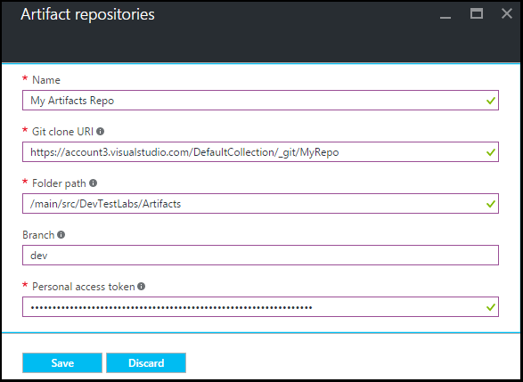

<properties
    pageTitle="Hinzufügen eines Repositorys der Git-Element zu einer Übung in Azure DevTest Kursen | Microsoft Azure"
    description="Hinzufügen eines GitHub oder Visual Studio Team Services Git Repository für Ihre benutzerdefinierte Elemente Quelle in Azure DevTest Einheiten"
    services="devtest-lab,virtual-machines,visual-studio-online"
    documentationCenter="na"
    authors="tomarcher"
    manager="douge"
    editor=""/>

<tags
    ms.service="devtest-lab"
    ms.workload="na"
    ms.tgt_pltfrm="na"
    ms.devlang="na"
    ms.topic="article"
    ms.date="09/06/2016"
    ms.author="tarcher"/>

# Hinzufügen eines Repositorys der Git-Element zu einer Übung in Azure DevTest Einheiten

> [AZURE.VIDEO how-to-add-your-private-artifacts-repository-in-a-devtest-lab]

In Azure DevTest Kursen sind die Elemente *Aktionen* – beispielsweise das Installieren von Software oder laufenden Skripts und Befehle – beim Erstellen ein virtuellen Computers. Standardmäßig umfasst eine Übung Elemente aus dem offiziellen Azure DevTest Labs Element Repository. Sie können ein Git Element Repository hinzufügen, um mit Ihrem Kurs Elemente enthalten, die Ihr Team erstellt. Das Repository kann [GitHub](https://github.com) oder [Visual Studio Team Services (VSTS)](https://visualstudio.com)gehostet werden.

- Informationen zum Erstellen eines Repositorys GitHub finden Sie unter [GitHub Bootcamp](https://help.github.com/categories/bootcamp/).
- So erstellen Sie ein Team Services-Projekt mit einem Git Repository finden Sie unter [Verbinden mit Visual Studio Team Services](https://www.visualstudio.com/get-started/setup/connect-to-visual-studio-online).

Die folgende Abbildung zeigt ein Beispiel für die Darstellung von ein Repository mit Elemente in GitHub möglicherweise:  

## Rufen Sie die Repository-Informationen und die Anmeldeinformationen

Wenn ein Element Repository mit Ihrem Kurs hinzufügen möchten, müssen Sie zuerst bestimmte Informationen aus Ihrem Repository abrufen. In den folgenden Abschnitten begleiten Sie diese Informationen für Element Repositorys auf GitHub und Visual Studio Team Services gehostet.

### Holen Sie sich die GitHub Repository datenbeschriftungsreihe URL und persönliche Access token

Um die GitHub Repository datenbeschriftungsreihe URL und persönliche Access Token erhalten möchten, gehen Sie folgendermaßen vor:

1. Navigieren Sie zu der Homepage der GitHub Repository, das die Element Definitionen enthält.

1. Wählen Sie **Klonen oder Herunterladen**.

1. Wählen Sie die Schaltfläche, um die **HTTPS Klonen Url** in die Zwischenablage zu kopieren, und speichern Sie die URL für die spätere Verwendung.

1. Wählen Sie in der oberen rechten Ecke des GitHub das Profil Bild aus, und wählen Sie **Einstellungen**aus.

1. Wählen Sie im Menü **persönlichen Einstellungen** auf der linken Seite **persönlicher Zugriffstoken**.

1. Wählen Sie **Neues Token generieren**.

1. Klicken Sie auf der Seite **Neues persönlicher Zugriffstoken** Geben Sie eine **Beschreibung der Token**, akzeptieren Sie die Standardelemente in der **Bereiche auswählen**, und wählen Sie dann auf **Token generieren**.

1. Speichern Sie das generierte Token, wie Sie es später benötigen.

1. Sie können jetzt GitHub schließen.   

1. Fahren Sie mit Abschnitt [Verbinden Ihrer Übung zum Repository Element](#connect-your-lab-to-the-artifact-repository) .

### Abrufen der URL für Visual Studio Team Services Repository klonen und persönliche Access token

Gehen Sie folgendermaßen vor, um die URL für Visual Studio Team Services Repository klonen und persönliche Access Token zu erhalten:

1. Öffnen der Homepage der Websitesammlung Team (z. B. `https://contoso-web-team.visualstudio.com`), und wählen Sie dann auf das Element Projekt.

1. Wählen Sie auf der Startseite von Project **Code**ein.

1. Wählen Sie zum Anzeigen der URL Klonen auf **Code** Projektseite **Klonen**.

1. Speichern Sie die URL, wie Sie es später in diesem Lernprogramm benötigen.

1. Wählen Sie zum Erstellen einer persönlichen Access Token **Mein Profil** aus dem Dropdownmenü Benutzer Konto ein.

1. Wählen Sie auf der Informationsseite zum Profil **Sicherheit**aus.

1. Wählen Sie auf der Registerkarte **Sicherheit** **Hinzufügen**aus.

1. **Erstellen einer persönlichen Access Token** Seite:

    - Geben Sie eine **Beschreibung** für das Token ein.
    - Wählen Sie aus der Liste **Läuft ab In** **180 Tage** aus.
    - Wählen Sie **Alle barrierefreien Konten** aus **der Kontenliste** aus.
    - Wählen Sie die Option **alle Bereiche** aus.
    - Wählen Sie die **Token erstellen**aus.

1. Wenn Sie fertig sind, wird das neue Token in der Liste der **Persönlichen Access Token** angezeigt. Wählen Sie **Token kopieren**, und klicken Sie dann speichern Sie den token Wert zur späteren Verwendung zu.

1. Fahren Sie mit Abschnitt [Verbinden Ihrer Übung zum Repository Element](#connect-your-lab-to-the-artifact-repository) .

##Herstellen einer Verbindung Repository Element mit der Übung

1. Melden Sie sich mit dem [Azure-Portal](http://go.microsoft.com/fwlink/p/?LinkID=525040)aus.

1. Wählen Sie **Weitere Dienste**, und wählen Sie dann in der Liste **DevTest Labs** .

1. Wählen Sie aus der Liste der Labs die gewünschten Übung aus.   

1. Wählen Sie in der Übung des Blade **Konfiguration**aus.

1. Wählen Sie in der Übung die **Konfiguration** Blade **Elemente Repositorys**aus.

1. Wählen Sie auf der Blade **Elemente Repositorys** **+ Hinzufügen**aus.

    
 
1. Geben Sie auf das zweite **Elemente Repositorys** Blade Folgendes ein:

    - **Name** – Geben Sie einen Namen für das Repository.
    - **Git Datenbeschriftungsreihe Url** - Geben Sie die URL der Git HTTPS-klonen, die Sie zuvor in entweder GitHub oder Visual Studio Team Services kopiert haben. 
    - **Ordnerpfad** - Geben Sie den Ordnerpfad relativ zu klonen-URL, die Ihre Definitionen Element enthält.
    - **Zweig** - Geben Sie den Zweig, um Ihre Definitionen Element zu erhalten.
    - **Persönliche Access Token** - Geben Sie das persönliche Access Token einer früheren Version von Visual Studio Team Services oder GitHub abgerufen. 
     
    

1. Wählen Sie **Speichern**aus.

[AZURE.INCLUDE [devtest-lab-try-it-out](../../includes/devtest-lab-try-it-out.md)]

## Verwandte von Blogbeiträgen
- [Behandeln von Problemen mit weiß nicht Elemente in AzureDevTestLabs](http://www.visualstudiogeeks.com/blog/DevOps/How-to-troubleshoot-failing-artifacts-in-AzureDevTestLabs)
- [Teilnehmen an eines virtuellen Computers zu vorhandenen Active Directory-Domäne in Azure testen Entwicklungslabor Cloud-Vorlage verwenden](http://www.visualstudiogeeks.com/blog/DevOps/Join-a-VM-to-existing-AD-domain-using-ARM-template-AzureDevTestLabs)