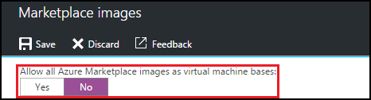

<properties
    pageTitle="Konfigurieren von Einstellungen für Azure Marketplace-Bild in Azure DevTest Kursen | Microsoft Azure"
    description="Konfigurieren der Azure Marketplace-Bilder beim Erstellen eines virtuellen Computers in Azure DevTest Kursen verwendet werden können"
    services="devtest-lab,virtual-machines"
    documentationCenter="na"
    authors="tomarcher"
    manager="douge"
    editor=""/>

<tags
    ms.service="devtest-lab"
    ms.workload="na"
    ms.tgt_pltfrm="na"
    ms.devlang="na"
    ms.topic="article"
    ms.date="09/06/2016"
    ms.author="tarcher"/>

# Konfigurieren von Einstellungen für Azure Marketplace-Bild in Azure DevTest Einheiten

DevTest Labs unterstützt das Erstellen von virtuellen Computern basierend auf Azure Marketplace-Bilder, je nach Konfiguration Azure Marketplace-Bilder in Ihrem Kurs verwendet werden. In diesem Artikel wird gezeigt, wie Sie angeben, welche, sofern vorhanden, Azure Marketplace-Bilder werden können beim Erstellen von virtuellen Computern in einer Kurs verwendet.

## Wählen Sie aus, welche Azure Marketplace-Bilder zulässig sind, beim Erstellen eines virtuellen Computers

1. Melden Sie sich mit dem [Azure-Portal](http://go.microsoft.com/fwlink/p/?LinkID=525040)aus.

1. Wählen Sie **Weitere Dienste**, und wählen Sie dann in der Liste **DevTest Labs** .

1. Wählen Sie aus der Liste der Labs die gewünschten Übung aus. 

1. Wählen Sie in der Übung des Blade **Konfiguration**aus.
    
1. Wählen Sie in der Übung **Konfiguration** Blade **Marketplace Bilder**

1. Geben Sie an, ob alle qualifizierte Azure Marketplace-Bilder für die Verwendung als Basis eines neuen virtuellen Computers verfügbar sein sollen. Wenn Sie **Ja**auswählen, werden alle Bilder, die die folgenden Kriterien erfüllen Azure Marketplace in den Kurs zulässig:

    - Das Bild erstellt einen einzelnen virtuellen Computer, **und**
    - Das Bild verwendet Ressourcenmanager Azure bereitstellen von virtuellen Computern, **und**
    - Das Bild setzt voraus kaufen eines Plans zusätzliche zur Lizenzierung
    
    Wenn Sie keine Bilder zu gewährt werden, oder angeben, welche Bilder können verwendet werden soll, wählen Sie **Nein**aus.
 
    
 
1. Wenn Sie zum vorherigen Schritt wählen Sie **Nein** aus, ist das Kontrollkästchen **Zulässige Bilder/Select all** aktiviert. Sie können diese Option zusammen mit dem Suchfeld verwenden, um schnell zu aktivieren oder deaktivieren alle Elemente in der Liste angezeigt.
Sie können auch Bilder Azure Marketplace auswählen, die Sie für die Erstellung virtueller Computer es zulässt, dass durch Aktivieren des Bilds entsprechenden Kontrollkästchens möchten.
Wählen Sie nichts aus der Liste, wenn Sie nicht möchten, dürfen keine Azure Marketplace-Bilder in der Kurs verwendet werden.

    

[AZURE.INCLUDE [devtest-lab-try-it-out](../../includes/devtest-lab-try-it-out.md)]

## Nächste Schritte

Nachdem Sie die wie Azure Marketplace-Bilder zulässig sind, beim Erstellen eines virtuellen Computers konfiguriert haben, besteht der nächste Schritt zum [Hinzufügen eines virtuellen Computers mit Ihrem Kurs](./devtest-lab-add-vm-with-artifacts.md).