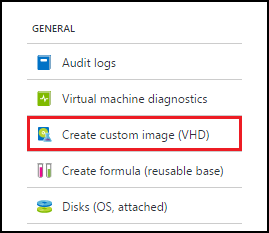
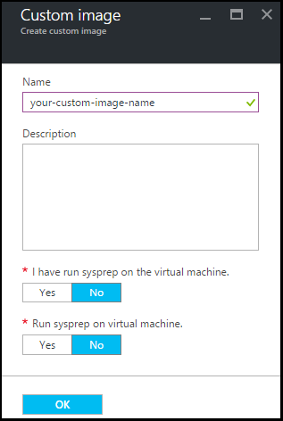

<properties
    pageTitle="Verwalten von benutzerdefinierten Images Azure DevTest Labs, zum Erstellen von virtuellen Computern | Microsoft Azure"
    description="Erfahren Sie, wie Sie ein benutzerdefiniertes Bild aus einer Datei virtuelle Festplatte oder aus einer vorhandenen virtuellen Computer in Azure DevTest Kursen erstellen"
    services="devtest-lab,virtual-machines"
    documentationCenter="na"
    authors="tomarcher"
    manager="douge"
    editor=""/>

<tags
    ms.service="devtest-lab"
    ms.workload="na"
    ms.tgt_pltfrm="na"
    ms.devlang="na"
    ms.topic="article"
    ms.date="09/07/2016"
    ms.author="tarcher"/>

# Verwalten von benutzerdefinierten Images Azure DevTest Labs, zum Erstellen von virtuellen Computern

In Azure DevTest Kursen aktivieren benutzerdefinierte Bilder Sie virtuellen Computern schnell erstellen, ohne warten auf die erforderliche Software auf die Ziel-Computer installiert sein. Benutzerdefinierte Bilder ermöglichen es Ihnen, die gesamte Software installieren, die Sie in einer Datei virtuelle Festplatte müssen vorab, und verwenden Sie dann die Datei virtuelle Festplatte ein virtuellen Computers zu erstellen. Da die Software bereits installiert ist, ist der Zeitpunkt der Erstellung virtueller Computer viel schneller. Darüber hinaus werden benutzerdefinierte Bilder, indem Sie ein benutzerdefiniertes Bild eines virtuellen Computers erstellen und erstellen dann aus dieser benutzerdefiniertes Bild virtuellen Computern virtuellen Computern zu klonen verwendet.

In diesem Artikel erfahren Sie, wie Sie:

- [Erstellen Sie ein benutzerdefiniertes Bild aus einer Datei virtuelle Festplatte](#create-a-custom-image-from-a-vhd-file) , damit Sie einen virtuellen dann aus dieser benutzerdefiniertes Bild erstellen können. 
- [Erstellen Sie ein benutzerdefiniertes Bild eines virtuellen Computers](#create-a-custom-image-from-a-vm) für schnelle virtuellen Computer klonen.

## Erstellen Sie ein benutzerdefiniertes Bild aus einer Datei virtuelle Festplatte

In diesem Abschnitt finden Sie unter So erstellen Sie ein benutzerdefiniertes Bild aus einer Datei virtuelle Festplatte.
Sie benötigen Zugriff auf eine gültige virtuelle Festplatte-Datei Ausführen aller Schritte in diesem Abschnitt.   

1. Melden Sie sich mit dem [Azure-Portal](http://go.microsoft.com/fwlink/p/?LinkID=525040)aus.

1. Wählen Sie **Weitere Dienste**aus, und wählen Sie dann in der Liste **DevTest Labs** .

1. Wählen Sie aus der Liste der Labs die gewünschten Übung aus.  

1. Wählen Sie in der Übung des Blade **Konfiguration**aus. 

1. Wählen Sie in der Übung **Konfiguration** Blade **benutzerdefinierte Bilder**aus.

1. Wählen Sie auf das **benutzerdefinierte Bilder** Blade **+ benutzerdefiniertes Bild**aus.

    

1. Geben Sie den Namen des benutzerdefinierten Bildes aus. Dieser Name wird in der Liste der Basis Bilder angezeigt, wenn ein virtuellen Computers zu erstellen.

1. Geben Sie die Beschreibung des benutzerdefinierten Bildes aus. Diese Beschreibung wird in der Liste der Basis Bilder angezeigt, beim Erstellen eines virtuellen Computers.

1. Wählen Sie **Datei virtuelle Festplatte**aus.

1. Wenn Sie Zugriff auf eine Datei virtuelle Festplatte, die nicht aufgelistet ist haben, fügen Sie ihn anhand der Anweisungen im Abschnitt [Hochladen einer Datei virtuelle Festplatte](#upload-a-vhd-file) hinzu, und hier zurückzukehren Sie, klicken Sie abschließend.

1. Wählen Sie die gewünschte virtuelle Festplatte Datei aus.

1. Wählen Sie **OK** , um das Blade **Virtuelle Festplatte Datei** zu schließen.

1. Wählen Sie **OS Konfiguration**.

1. Wählen Sie auf der Registerkarte **OS Konfiguration** **Windows** oder **Linux**.

1. Wenn Sie **Windows** ausgewählt ist, geben Sie über das Kontrollkästchen, ob *Sysprep* auf dem Computer ausgeführt wurde.

1. Wählen Sie **OK** , um das Blade **OS-Konfiguration** zu schließen.

1. Wählen Sie **OK** , um das benutzerdefinierte Bild zu erstellen.

1. Wechseln Sie zum Abschnitt [Nächsten Schritten fort](#next-steps) .

###Hochladen einer Datei virtuelle Festplatte

Wenn Sie ein benutzerdefiniertes Bild hinzufügen möchten, müssen Sie Zugriff auf eine Datei virtuelle Festplatte haben.

1. Wählen Sie in der **Datei virtuelle Festplatte** Blade **mithilfe der PowerShell virtuelle Festplatte Datei hochladen**aus.

    

1. Anweisungen für das Ändern und Ausführen eines PowerShell-Skripts, das für Ihr Abonnement Azure eine virtuelle Festplatte Datei hochgeladen wird, werden das nächste Blade angezeigt. 
**Hinweis:** Dieses Verfahren kann abhängig von der Größe der Datei virtuelle Festplatte und der Geschwindigkeit der Verbindung sehr lang sein.

## Erstellen Sie ein benutzerdefiniertes Bild eines virtuellen Computers
Wenn Sie einen virtuellen Computer, der bereits konfiguriert ist haben, können Sie ein benutzerdefiniertes Bild aus diesen virtuellen Computer erstellen und anschließend das benutzerdefinierte Bild verwenden, um anderen identischen virtuellen Computern zu erstellen. Die folgenden Schritte beschreiben, wie Sie ein benutzerdefiniertes Bild eines virtuellen Computers zu erstellen:

1. Melden Sie sich mit dem [Azure-Portal](http://go.microsoft.com/fwlink/p/?LinkID=525040)aus.

1. Wählen Sie **Weitere Dienste**aus, und wählen Sie dann in der Liste **DevTest Labs** .

1. Wählen Sie aus der Liste der Labs die gewünschten Übung aus.  

1. Wählen Sie in der Übung des Blade **Meine virtuellen Computern**aus.
 
1. Wählen Sie den virtuellen Computer, von dem Sie das benutzerdefinierte Bild erstellen möchten, klicken Sie auf das Blade **meiner virtuellen Computer** .

1. Wählen Sie auf Blade des virtuellen Computers **Erstellen benutzerdefiniertes Bild (virtuelle Festplatte)**ein.

    

1. Klicken Sie auf das **Bild erstellen** Blade Geben Sie einen Namen und eine Beschreibung für das benutzerdefinierte Bild aus. Diese Informationen werden angezeigt, in der Liste der Grundlagen beim Erstellen eines virtuellen Computers.

    

1. Wählen Sie aus, ob Sysprep des virtuellen Computers ausgeführt wurde. Wenn der Sysprep des virtuellen Computers nicht ausgeführt wurde, geben Sie an, ob Sysprep beim Erstellen ein virtuellen Computers aus diesem benutzerdefiniertes Bild ausführen soll.

1. Wählen Sie **OK** klicken Sie abschließend auf benutzerdefinierte Bild zu erstellen.

[AZURE.INCLUDE [devtest-lab-try-it-out](../../includes/devtest-lab-try-it-out.md)]

## Verwandte von Blogbeiträgen

- [Benutzerdefinierte Bilder oder Formeln?](https://blogs.msdn.microsoft.com/devtestlab/2016/04/06/custom-images-or-formulas/)
- [Kopieren die benutzerdefinierte Bilder zwischen Azure DevTest Labs](http://www.visualstudiogeeks.com/blog/DevOps/How-To-Move-CustomImages-VHD-Between-AzureDevTestLabs#copying-custom-images-between-azure-devtest-labs)

##Nächste Schritte

Nachdem Sie ein benutzerdefiniertes Bild für die Verwendung beim Erstellen eines virtuellen Computers hinzugefügt haben, besteht der nächste Schritt zum [Hinzufügen eines virtuellen Computers mit Ihrem Kurs](./devtest-lab-add-vm-with-artifacts.md).