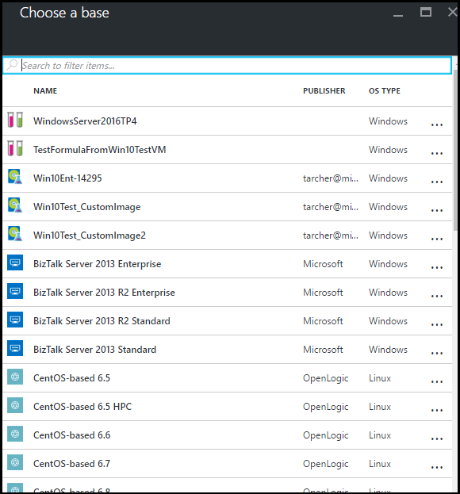
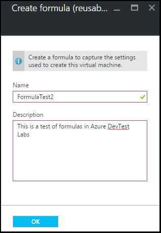
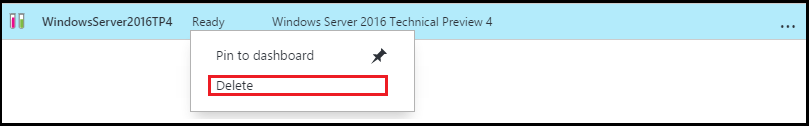

<properties
    pageTitle="Verwalten von Formeln in Azure DevTest Kursen zum Erstellen von virtuellen Computern | Microsoft Azure"
    description="Informationen Sie zum Erstellen, aktualisieren, und entfernen Sie Azure DevTest Labs Formeln und zum Erstellen von neuer virtuellen Computern verwenden können."
    services="devtest-lab,virtual-machines"
    documentationCenter="na"
    authors="tomarcher"
    manager="douge"
    editor=""/>

<tags
    ms.service="devtest-lab"
    ms.workload="na"
    ms.tgt_pltfrm="na"
    ms.devlang="na"
    ms.topic="article"
    ms.date="08/30/2016"
    ms.author="tarcher"/>

# Verwalten von DevTest Labs Formeln zum Erstellen von virtuellen Computern

Eine Formel in Azure DevTest Einheiten handelt es sich um eine Liste der Standardwerte für Eigenschaften zum Erstellen eines virtuellen Computers (virtueller Computer) verwendet. Beim Erstellen eines virtuellen Computers aus einer Formel können die Standardwerte als verwendet werden –, oder geändert wird. Wie [benutzerdefinierte Bilder](./devtest-lab-create-template.md) und [Marketplace Bilder](./devtest-lab-configure-marketplace-images.md)bieten Formeln ein Verfahren für schnelles virtueller Computer provisioning.  

In diesem Artikel erfahren Sie, wie Sie die folgenden Aufgaben ausführen:

- [Erstellen einer Formel](#create-a-formula)
- [Verwenden einer Formel zum Bereitstellen eines virtuellen Computers](#use-a-formula-to-provision-a-vm)
- [Ändern einer Formel](#modify-a-formula)
- [Löschen einer Formel](#delete-a-formula)

> [AZURE.NOTE] Formeln – wie [benutzerdefinierte Bilder](./devtest-lab-create-template.md) - können Sie ein Basis Bild aus einer Datei virtuelle Festplatte zu erstellen. Basis-Image kann dann beim Bereitstellen eines neuen virtuellen Computers verwendet werden. Wenn Sie entscheiden, welche Rechte für Ihre individuelle Umgebung ist, finden Sie im Artikel, [Vergleich benutzerdefinierte Bilder und Formeln in DevTest Einheiten](./devtest-lab-comparing-vm-base-image-types.md).

## Erstellen einer Formel
Jede Person mit Berechtigungen DevTest Labs *Benutzer* kann zum Erstellen von virtuellen Computern mit einer Formel als Basis. Es gibt zwei Methoden zum Erstellen von Formeln aus: 

- Verwenden Sie aus einer Basis – Wenn Sie alle Merkmale der Formel definieren möchten.
- Aus einer vorhandenen Übung virtueller - Computer verwenden, wenn Sie eine Formel basierend auf die Einstellungen eines vorhandenen virtuellen Computer erstellen möchten.

### Erstellen Sie eine Formel aus einer Basis
Die folgenden Schritte führen Sie durch die Vorgehensweise zum Erstellen einer Formel in eine andere Formel, Marketplace-Bild oder ein benutzerdefiniertes Bild.

1. Melden Sie sich mit dem [Azure-Portal](http://go.microsoft.com/fwlink/p/?LinkID=525040)aus.

1. Wählen Sie **Weitere Dienste**, und wählen Sie dann in der Liste **DevTest Labs** .

1. Wählen Sie aus der Liste der Labs die gewünschten Übung aus.  

1. Wählen Sie in der Übung des Blade **Formeln (wieder verwendbaren Basis)**.

    

1. Wählen Sie auf der Blade **Übung Formeln** **+ Hinzufügen**aus.

    

1. Wählen Sie die Basis (benutzerdefiniertes Bild, Marketplace-Bild oder Formel), aus der Sie die Formel erstellen möchten, klicken Sie auf das Blade **Auswählen einer Basis** .

    

1. Geben Sie in der Blade **Formel erstellen** die folgenden Werte ein:

    - **Formel Name** - Geben Sie einen Namen für die Formel ein. Dieser Wert wird beim Erstellen eines virtuellen Computers in der Liste der Basis Bilder angezeigt. Der Name wird überprüft, wie er eingegeben wurde, und wenn nicht gültig ist, wird die Anforderungen für einen gültigen Namen in eine Nachricht angegeben.
    - **Beschreibung** : Geben Sie eine aussagekräftige Beschreibung für die Formel ein. Dieser Wert steht der Formel im Kontextmenü die Option beim Erstellen eines virtuellen Computers.
    - **Benutzername** - Geben Sie einen Benutzernamen, die Administratorrechte erteilt werden soll.
    - **Kennwort** - geben – oder wählen Sie aus der Dropdownliste – einen Wert, der den Schlüssel (Kennwort) zugeordnet ist, die Sie für den angegebenen Benutzer verwenden möchten.  
    - **Bild** - dieses Feld zeigt Namen des ausgewählten Bilds Basis auf das vorherige Blade. 
    - **Größe des virtuellen Computers** - wählen Sie eine der vordefinierten Elemente, die die Prozessorkerne, RAM und der Festplattengröße für den virtuellen Computer zu erstellen, angeben.
    - **Virtuelle Netzwerk** - Geben Sie das gewünschte virtuelle Netzwerk.
    - **Subnetz** - das gewünschte Subnetz angeben.
    - **Öffentliche IP-Adresse** : Wenn die Richtlinie Übung festgelegt ist öffentliche IP-Adressen für das ausgewählte Subnetz zulassen, die angeben, ob Sie die IP-Adresse öffentlich sein, indem Sie **Ja** oder **Nein**auswählen möchten. Diese Option ist andernfalls deaktiviert und als **keine**ausgewählt.
    - **Elemente** – wählen Sie aus, und konfigurieren Sie die Elemente, die Sie zu dem Basis Bild hinzufügen möchten. Sicheren Sie Zeichenfolge, die Werte mit der Formel nicht gespeichert werden. Element-Parameter, die sichere Zeichenfolgen sind werden deshalb nicht angezeigt. 

        

1. Wählen Sie **Erstellen** , um die Formel zu erstellen.

### Erstellen einer Formel eines virtuellen Computers
Die folgenden Schritte führen Sie durch das Verfahren zum Erstellen einer Formel basierend auf einer vorhandenen virtuellen Computer an. 

> [AZURE.NOTE] Zum Erstellen einer Formel eines virtuellen Computers, muss der virtuellen Computer nach 30 März 2016 erstellt wurden. 

1. Melden Sie sich mit dem [Azure-Portal](http://go.microsoft.com/fwlink/p/?LinkID=525040)aus.

1. Wählen Sie **Weitere Dienste**, und wählen Sie dann in der Liste **DevTest Labs** .

1. Wählen Sie aus der Liste der Labs die gewünschten Übung aus.  

1. Wählen Sie in der Übung des **Übersicht** Blade den virtuellen Computer, aus der Sie die Formel erstellen möchten.

    

1. Wählen Sie in des virtuellen Computers Blade **Formel (wieder verwendbaren Basis) erstellen**.

    

1. Klicken Sie auf das Blade **Formel erstellen** Geben Sie einen **Namen** und **eine Beschreibung** für die neue Formel ein.

    

1. Wählen Sie **OK** , um die Formel zu erstellen.

## Verwenden einer Formel zum Bereitstellen eines virtuellen Computers
Nachdem Sie eine Formel erstellt haben, können Sie einen virtuellen Computer auf der Grundlage dieser Formel erstellen. Im Abschnitt [Hinzufügen eines virtuellen Computers mit Elemente](devtest-lab-add-vm-with-artifacts.md#add-a-vm-with-artifacts) führt Sie durch die Einrichtungsschritte.

## Ändern einer Formel
Wenn Sie eine Formel ändern möchten, gehen Sie folgendermaßen vor:

1. Melden Sie sich mit dem [Azure-Portal](http://go.microsoft.com/fwlink/p/?LinkID=525040)aus.

1. Wählen Sie **Weitere Dienste**, und wählen Sie dann in der Liste **DevTest Labs** .

1. Wählen Sie aus der Liste der Labs die gewünschten Übung aus.  

1. Wählen Sie in der Übung des Blade **Formeln (wieder verwendbaren Basis)**.

    

1. Wählen Sie die Formel, die Sie ändern möchten, klicken Sie auf das Blade **Übung Formeln** .

1. Klicken Sie in der **Formel aktualisieren** Blade nehmen Sie die gewünschten Änderungen vor, und wählen Sie **Aktualisieren**.

## Löschen einer Formel 
Gehen Sie folgendermaßen vor, um eine Formel zu löschen:

1. Melden Sie sich mit dem [Azure-Portal](http://go.microsoft.com/fwlink/p/?LinkID=525040)aus.

1. Wählen Sie **Weitere Dienste**, und wählen Sie dann in der Liste **DevTest Labs** .

1. Wählen Sie aus der Liste der Labs die gewünschten Übung aus.  

1. Wählen Sie in der Übung **Einstellungen** Blade **Formeln**aus.

    

1. Wählen Sie die Auslassungspunkte rechts neben der Formel, die Sie löschen möchten, klicken Sie auf das Blade **Übung Formeln** .

    

1. Wählen Sie im Kontextmenü der Formel **Löschen**.

    

1. Wählen Sie **Ja** , um das Bestätigungsdialogfeld für den Löschvorgang.

[AZURE.INCLUDE [devtest-lab-try-it-out](../../includes/devtest-lab-try-it-out.md)]

## Verwandte von Blogbeiträgen

- [Benutzerdefinierte Bilder oder Formeln?](https://blogs.msdn.microsoft.com/devtestlab/2016/04/06/custom-images-or-formulas/)

## Nächste Schritte
Nachdem Sie eine Formel für die Verwendung beim Erstellen eines virtuellen Computers erstellt haben, besteht der nächste Schritt zum [Hinzufügen eines virtuellen Computers mit Ihrem Kurs](./devtest-lab-add-vm-with-artifacts.md).