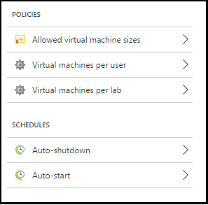
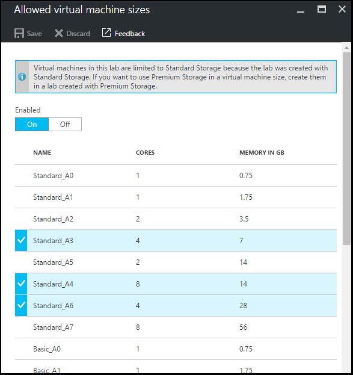
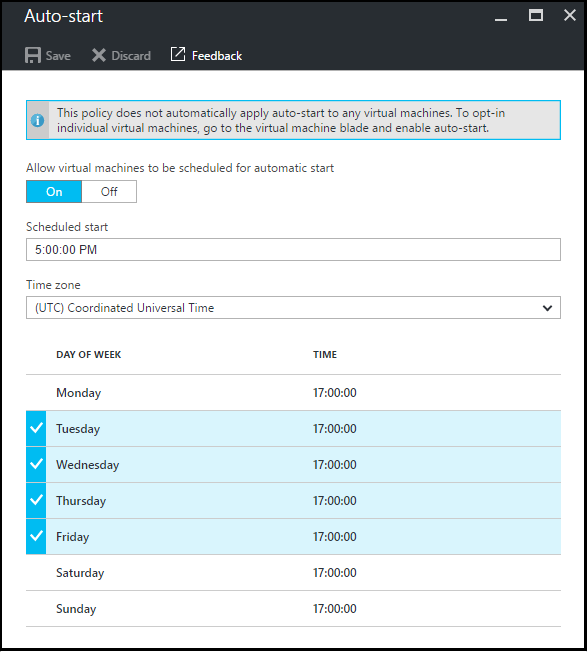

<properties
    pageTitle="Definieren von Richtlinien Übung in Azure DevTest Kursen | Microsoft Azure"
    description="Informationen Sie zum Definieren von Übung Richtlinien wie virtueller Computer an Papiergrößen, maximale virtuellen Computern pro Benutzer und Automatisierung war(en)."
    services="devtest-lab,virtual-machines"
    documentationCenter="na"
    authors="tomarcher"
    manager="douge"
    editor=""/>

<tags
    ms.service="devtest-lab"
    ms.workload="na"
    ms.tgt_pltfrm="na"
    ms.devlang="na"
    ms.topic="article"
    ms.date="09/12/2016"
    ms.author="tarcher"/>

# Definieren von Richtlinien Übung in Azure DevTest Einheiten

> [AZURE.VIDEO how-to-set-vm-policies-in-a-devtest-lab]

Azure DevTest Labs können Sie Richtlinien Schlüssel angeben, mit die Hilfe Sie steuern Kosten und Abfälle in Ihrem Kursen zu minimieren. Diese Übung Richtlinien gehören die maximale Anzahl von virtuellen Computern pro Benutzer und pro Übung und verschiedene Optionen für automatische-war(en) und automatisch gestartet werden, erstellt. 

## Zugreifen auf eine Übung Richtlinien in Azure DevTest Einheiten

Die folgenden Schritte aus, die Sie Einrichten von Richtlinien für eine Übung in Azure DevTest Kursen begleiten:

Um die Richtlinien für eine Übung anzeigen (und ändern), gehen Sie folgendermaßen vor:

1. Melden Sie sich mit dem [Azure-Portal](http://go.microsoft.com/fwlink/p/?LinkID=525040)aus.

1. Wählen Sie **Weitere Dienste**aus, und wählen Sie dann in der Liste **DevTest Labs** .

1. Wählen Sie aus der Liste der Labs die gewünschten Übung aus.   

1. Wählen Sie **Richtlinieneinstellungen**aus.

1. Das Blade **Richtlinieneinstellungen** enthält ein Menü mit Einstellungen, die Sie angeben können: 

    

    Weitere Informationen zum Festlegen einer Richtlinie zu finden, wählen Sie es in der folgenden Liste aus:

    - [Zugelassene virtuellen Computern Größen](#set-allowed-virtual-machine-sizes) – wählen Sie die Liste der virtuellen Computer Größen in den Kurs darf. Ein Benutzer kann nur aus dieser Liste virtuellen Computern erstellen.

    - [Virtuellen Computern pro Benutzer](#set-virtual-machines-per-user) - Geben Sie die maximale Anzahl von virtuellen Computern, die von einem Benutzer erstellt werden können. 

    - [Virtuellen Computern pro Übung](#set-virtual-machines-per-lab) - Geben Sie die maximale Anzahl von virtuellen Computern, die für eine Übung erstellt werden können. 

    - [Auto-war(en)](#set-auto-shutdown) - Geben Sie die Zeit an, wenn die aktuellen Übung des virtuellen Computern automatisch beendet wird.

    - [Automatisch starten](#set-auto-start) – Geben Sie die Zeit an, wenn der aktuelle Übung virtuellen Computern automatisch gestartet.

## Festlegen der virtuellen Computers Größen zugelassen

Die Richtlinie für das Festlegen der zulässigen virtuellen Computer Größen hindert minimieren Übung Abfälle ermöglicht es Ihnen, um anzugeben, welche virtuellen Computer Größen in den Kurs zulässig sind. Wenn diese Richtlinie aktiviert ist, können nur virtueller Computer Größen aus dieser Liste zum Erstellen von virtuellen Computern verwendet werden.

1. Wählen Sie in der Übung des **Richtlinieneinstellungen** Blade **Zugelassene virtuellen Computern Größen**aus.

    
 
1. Wählen Sie **auf** diese Richtlinie aktivieren und **Deaktivieren** , ihn zu deaktivieren.

1. Wenn Sie diese Richtlinie aktivieren, wählen Sie eine oder mehrere virtueller Computer Größen, die in Ihrem Kurs erstellt werden können.

1. Wählen Sie **Speichern**aus.

## Festlegen von virtuellen Computern pro Benutzer

Die Richtlinie für **virtuellen Computern pro Benutzer** können Sie die maximale Anzahl von virtuellen Computern angeben, die von einem einzelnen Benutzer erstellt werden können. Wenn ein Benutzer versucht, ein virtuellen Computers zu erstellen, wenn die Benutzer Beschränkung erfüllt ist, gibt eine Fehlermeldung an, der virtuellen Computer erstellt werden kann. 

1. Wählen Sie in der Übung des **Richtlinieneinstellungen** Blade **virtuellen Computern pro Benutzer**ein.

    

1. Wählen Sie **auf** diese Richtlinie aktivieren und **Deaktivieren** , ihn zu deaktivieren.

1. Wenn Sie diese Richtlinie aktivieren, geben Sie einen numerischen Wert, der angibt, der maximalen Anzahl von virtuellen Computern, die von einem Benutzer erstellt werden können. Wenn Sie eine Zahl, die ungültig ist eingeben, zeigt die Benutzeroberfläche die maximale Anzahl für dieses Feld zulässigen aus.

1. Wählen Sie **Speichern**aus.

## Festlegen von virtuellen Computern pro Übung

Die Richtlinie für **virtuellen Computern pro Übung** können Sie die maximale Anzahl von virtuellen Computern angeben, die für den aktuellen Übung erstellt werden können. Wenn ein Benutzer versucht, ein virtuellen Computers zu erstellen, wenn die Beschränkung Übung erfüllt ist, gibt eine Fehlermeldung an, der virtuellen Computer erstellt werden kann. 

1. Wählen Sie in der Übung des **Richtlinieneinstellungen** Blade **virtuellen Computern pro Übung**aus.

    

1. Wählen Sie **auf** diese Richtlinie aktivieren und **Deaktivieren** , ihn zu deaktivieren.

1. Wenn Sie diese Richtlinie aktivieren, geben Sie einen numerischen Wert, der angibt, der maximalen Anzahl von virtuellen Computern, die für den aktuellen Übung erstellt werden können. Wenn Sie eine Zahl, die ungültig ist eingeben, zeigt die Benutzeroberfläche die maximale Anzahl für dieses Feld zulässigen aus.

1. Wählen Sie **Speichern**aus.

## Festlegen von Auto-war(en)

Die Richtlinie Auto-war(en) hindert Übung Abfälle und ermöglicht Ihnen, den Zeitraum anzugeben, den diesem Kurs des virtuellen Computern fahren minimieren.

1. Wählen Sie in der Übung des **Richtlinieneinstellungen** Blade **Auto-war(en)**.

    

1. Wählen Sie **auf** diese Richtlinie aktivieren und **Deaktivieren** , ihn zu deaktivieren.

1. Wenn Sie diese Richtlinie aktivieren, geben Sie die lokale Zeit beendet alle virtuellen Computern in der aktuellen Kurs.

1. Wählen Sie **Speichern**aus.

1. Sobald aktiviert, gilt dieser Richtlinie standardmäßig für alle virtuellen Computern in der aktuellen Kurs. Wenn Sie diese Einstellung eines bestimmten virtuellen Computers entfernen, öffnen Sie Blade des virtuellen Computers zu, und ändern Sie die Einstellung seiner **Auto-war(en)** 

## Set automatisch starten

Die Richtlinie automatisch gestartet werden, können Sie angeben, wann die virtuellen Computern in der aktuellen Kurs gestartet werden soll.  

1. Wählen Sie in der Übung des **Richtlinieneinstellungen** Blade **automatisch gestartet werden**.

    

1. Wählen Sie **auf** diese Richtlinie aktivieren und **Deaktivieren** , ihn zu deaktivieren.

1. Wenn Sie diese Richtlinie aktivieren, geben Sie den lokalen geplante Startzeit und die Tage der Woche für die gilt die Zeit. 

1. Wählen Sie **Speichern**aus.

1. Sobald aktiviert ist, wird dieser Richtlinie zu einem beliebigen virtuellen Computern in der aktuellen Kurs nicht automatisch angewendet. Zum Anwenden dieser Einstellung auf einen bestimmten virtuellen öffnen Sie Blade des virtuellen Computers zu, und ändern Sie die Einstellung seiner **automatisch starten** 

[AZURE.INCLUDE [devtest-lab-try-it-out](../../includes/devtest-lab-try-it-out.md)]

## Nächste Schritte

Nachdem Sie die verschiedenen virtuellen Computer Richtlinieneinstellungen für Ihre Übung angewendet und definiert haben, sind hier einige Schritte, versuchen als Nächstes:

- [Konfigurieren Kostenmanagement](./devtest-lab-configure-cost-management.md) - veranschaulicht, wie das Diagramm **Monatliche geschätzte Kosten Trend**  
zum Anzeigen des aktuellen Monats des Kosten-bis-heute und der geplanten Kosten am Ende des Monats geschätzt.
- [Erstellen benutzerdefinierter Bild](./devtest-lab-create-template.md) - beim Erstellen eines virtuellen Computers, geben Sie an eine Basis, die ein benutzerdefiniertes Bild oder ein Bild Marketplace werden kann. In diesem Artikel veranschaulicht, wie Sie ein benutzerdefiniertes Bild aus einer Datei virtuelle Festplatte zu erstellen.
- [Konfigurieren von Marketplace Bilder](./devtest-lab-configure-marketplace-images.md) - Azure DevTest Labs unterstützt das Erstellen von virtuellen Computern basierend auf Bilder Azure Marketplace. In diesem Artikel wird veranschaulicht, wie Sie angeben, welche, sofern vorhanden, Azure Marketplace-Bilder werden können beim Erstellen von virtuellen Computern in einer Kurs verwendet.
- [Erstellen eines virtuellen Computers in einem Kurs](./devtest-lab-add-vm-with-artifacts.md) - veranschaulicht zum Erstellen eines virtuellen Computers aus einem Basis Bild (entweder benutzerdefinierte oder Marketplace), und wie Sie Elemente in Ihrem virtuellen Computer konzipiert.
