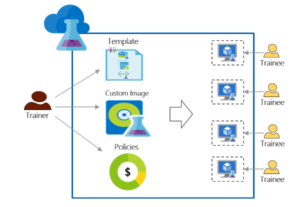

<properties
    pageTitle="Verwenden von Azure DevTest Labs für Schulung | Microsoft Azure"
    description="Erfahren Sie, wie Azure DevTest Labs für Schulung Szenarien verwendet werden soll."
    services="devtest-lab,virtual-machines"
    documentationCenter="na"
    authors="steved0x"
    manager="douge"
    editor=""/>

<tags
    ms.service="devtest-lab"
    ms.workload="na"
    ms.tgt_pltfrm="na"
    ms.devlang="na"
    ms.topic="article"
    ms.date="09/12/2016"
    ms.author="sdanie"/>

# Verwenden von Azure DevTest Labs für-Schulung

Azure DevTest Labs kann verwendet werden, viele Schlüsselszenarien sowie Test-/implementiert wird. Eine dieser Szenarios besteht darin, eine Übung für Schulung einzurichten. Azure DevTest Labs können Sie eine Übung erstellen, in dem Sie benutzerdefinierte Vorlagen bereitgestellt werden, mit denen jede Schüler identische und isolierte Umgebungen für Schulung erstellen kann. Sie können sicherstellen, dass Schulung Umgebungen nur, wenn er diese benötigt und genügend Ressourcen – wie etwa virtuellen Computern enthalten – erforderlich für die Ausbildung jede Schüler verfügbar sind. Schließlich können Sie einfach die Übung für Praktikanten, freigeben das sie in einem Klick zugreifen können.   

Azure DevTest Labs erfüllt die folgenden Anforderungen, die zum Durchführen von Schulung in jeder virtuelle Umgebung erforderlich sind: 

-   Praktikanten virtuellen Computern andere Praktikanten erstellte nicht angezeigt werden.
-   Jeder Computer Schulung muss identisch sein.
-   Praktikanten können schnell ihre Umgebung Schulung bereitzustellen.
-   Um sicherzustellen, dass Praktikanten nicht mehr virtuelle Computer für die Ausbildung und auch war(en) virtuellen Computern müssen abrufen können, wenn sie nicht arbeiten, sondern steuern Sie Kosten
-   Jeder Schüler einfach die Schulung Übung freigeben
-   Die Schulung Übung wieder wiederverwenden

In diesem Artikel erfahren Sie verschiedene Azure DevTest Labs-Features, die zu entsprechen, die zuvor beschriebenen der Ausbildung und die detaillierten Schritte, die Sie, zum Einrichten einer Übung für Schulung folgen können verwendet werden können.  

## Schulung mit Azure DevTest Labs implementieren

1. **Erstellen der Übung** 

    Übungseinheiten hängen vom Ausgangspunkt in Azure DevTest Einheiten. Nachdem Sie eine Übung erstellt haben, können Sie Aufgaben ausführen beispielsweise beim Hinzufügen von Benutzern (Praktikanten) mit den Kurs Festlegen von Richtlinien zum Steuern von Kosten definieren virtueller Computer-Bilder, die schnell erstellen können und vieles mehr.   

    Informieren Sie sich, indem Sie auf die Links in der folgenden Tabelle:

  	| Aufgabe                                                            | Gelernte                                                    |
|-----------------------------------------------------------------|----------------------------------------------------------------------|
| [Erstellen einer Übung in Azure DevTest Einheiten](devtest-lab-create-lab.md) | Erfahren Sie, wie eine Übung in Azure DevTest Kursen Azure-Portal zu erstellen. |

2. **Erstellen Sie in Minuten mithilfe von vorgefertigten Marketplace Bilder und benutzerdefinierte Bildern Schulung virtuellen Computern** 
    
    Sie können wählen vorgefertigten Bilder aus einer Vielzahl von Bildern aus dem Azure Marketplace und verfügbar machen, für die Praktikanten in den Kurs. Wenn die vorgefertigten Bilder nicht Ihren Anforderungen entsprechen, können Sie ein benutzerdefiniertes Bild erstellen, durch das Erstellen einer Übung virtueller Computer mithilfe eines vorgefertigten Bildes aus Azure Marketplace, Installation der Software aus, die Sie für die Ausbildung und Speichern der virtuellen Computer als benutzerdefiniertes Bild in den Kurs benötigen. 

    Informieren Sie sich, indem Sie auf die Links in der folgenden Tabelle:

  	| Aufgabe                                                                              | Gelernte                                                                                                                                  |
|-----------------------------------------------------------------------------------|-------------------------------------------------------------------------------------------------------------------------------------------------|
| [Konfigurieren von Bildern Azure Marketplace](devtest-lab-configure-marketplace-images.md) | Erfahren Sie, wie Sie weißen Azure Marketplace Bilder können; nur die Bilder für die Auswahl zur Verfügung stellen möchten Sie für die Ausbildung.                 |
| [Erstellen Sie ein benutzerdefiniertes Bild](devtest-lab-create-template.md)                           | Erstellen Sie ein benutzerdefiniertes Bild, indem Sie vor dem Installieren der Software, die Sie für die Ausbildung müssen, sodass Praktikanten ein virtuellen Computers verwenden das benutzerdefinierte Bild schnell erstellen können. |

3. **Erstellen von wieder verwendbarem Vorlagen für Schulung Autos** 

    Eine Formel in Azure DevTest Einheiten handelt es sich um eine Liste der Standardwerte für Eigenschaften zum Erstellen eines virtuellen Computers verwendet. Sie können eine Formel in den Kurs erstellen, indem Sie ein Bild, eine Größe virtueller Computer (eine Kombination aus CPU und RAM) und ein virtuelles Netzwerk auswählen. Jeder Schüler kann finden Sie in der Formel in der Kurs und zur Erstellung eines virtuellen Computers verwenden. 

    Informieren Sie sich, indem Sie auf die Links in der folgenden Tabelle:

  	| Aufgabe                                                                         | Gelernte                                                                                                          |
|------------------------------------------------------------------------------|-------------------------------------------------------------------------------------------------------------------------|
| [Verwalten von DevTest Labs Formeln zum Erstellen von virtuellen Computern](devtest-lab-manage-formulas.md) | Erfahren Sie, wie Sie eine Formel erstellen, indem Sie ein Bild, ein virtuelles Netzwerk und virtueller Speicher (Kombination von CPU und RAM) auswählen. |

4. **Kontrollieren der Kosten**

    Azure DevTest Labs ermöglicht das Einrichten einer Richtlinie in den Kurs an die maximale Anzahl von virtuellen Computern, die von einem Schüler in den Kurs erstellt werden kann. 

    Wenn Sie veranstalten zu diesem mehrtägigen Schulung Zweck und Beenden alle virtuellen Computern zu einem bestimmten Zeitpunkt des Tages und dann automatisch neu starten möchten sie den folgenden Tag, einfach zu erreichen, die durch Festlegen der automatischen-war(en) und Richtlinien in den Kurs automatisch starten. 

    Schließlich nach Abschluss Schulung können Sie alle virtuellen Computern auf einmal löschen durch ein einzelnes Powershellskript ausführen. 

    Informieren Sie sich, indem Sie auf die Links in der folgenden Tabelle:

  	| Aufgabe                                                                                                                                    | Gelernte                                                      |
|-----------------------------------------------------------------------------------------------------------------------------------------|---------------------------------------------------------------------|
| [Definieren von Richtlinien für Übung](devtest-lab-set-lab-policy.md)                                                                                    | Festlegen von Richtlinien in der Übung steuern Sie Kosten.                       |
| [Löschen der Übung virtuellen Computern mit einem Powershellskript](devtest-lab-faq.md#how-can-i-automate-the-process-of-deleting-all-the-vms-in-my-lab) | Löschen Sie alle Übungseinheiten in einem Vorgang nach Abschluss die Ausbildung. |

5. **Freigeben der Übung mit jeder Schüler**

    Labs können direkt über einen Link, den Sie für Ihre Praktikanten freigeben zugegriffen werden. Ihre Praktikanten keine sogar ein Azure-Konto haben, solange sie über ein [Microsoft-Konto](devtest-lab-faq.md#what-is-a-microsoft-account)verfügen. Praktikanten nicht virtuellen Computern andere Praktikanten erstellte angezeigt.  

    Informieren Sie sich, indem Sie auf die Links in der folgenden Tabelle:

  	| Aufgabe                                                                                                                                | Gelernte                                                   |
|-------------------------------------------------------------------------------------------------------------------------------------|------------------------------------------------------------------|
| [Hinzufügen einer Schüler mit einem Kurs in Azure DevTest Einheiten](devtest-lab-add-devtest-user.md)                                                     | Verwenden des Azure-Portals Praktikanten mit Ihrer Schulung Kurs hinzuzufügen.       |
| [Hinzufügen von Praktikanten mit den Kurs mit einem Powershellskript](devtest-lab-add-devtest-user.md#add-an-external-user-to-a-lab-using-powershell) | Mithilfe von PowerShell hinzufügen Praktikanten mit Ihrer Schulung Kurs automatisieren. |
| [Erstellen eines Links, die Übung](devtest-lab-faq.md#how-do-i-share-a-direct-link-to-my-lab)                                                  | Erfahren Sie, wie eine Übung direkt über einen Link zugegriffen werden kann.        |

6. **Die Übung wieder wiederverwenden** 

    Sie können die Erstellung von Übung, einschließlich der Einstellungen für benutzerdefinierte, durch Erstellen einer Vorlage Ressourcenmanager und verwenden es wieder identisch Labs erstellen automatisieren. 

    Informieren Sie sich, indem Sie auf die Links in der folgenden Tabelle:

  	| Aufgabe                                                                                                                               | Gelernte                                                      |
|------------------------------------------------------------------------------------------------------------------------------------|---------------------------------------------------------------------|
| [Erstellen einer Übung mithilfe einer Vorlage Ressourcenmanager](devtest-lab-faq.md#how-do-i-create-a-lab-from-an-azure-resource-manager-template) | Erstellen Sie Labs in Azure DevTest Kursen Ressourcenmanager Vorlagen verwenden. |

[AZURE.INCLUDE [devtest-lab-try-it-out](../../includes/devtest-lab-try-it-out.md)]  

