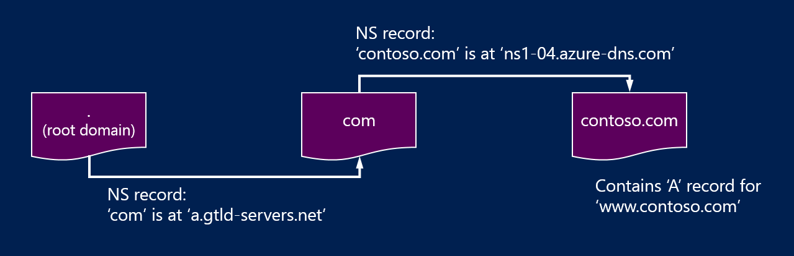

<properties
   pageTitle="Delegieren Ihrer Domäne zu Azure DNS | Microsoft Azure"
   description="Verstehen Sie, wie Sie Domäne Delegation ändern und Azure DNS-Namenserver Domäne Hostinganbieter bereitstellen."
   services="dns"
   documentationCenter="na"
   authors="sdwheeler"
   manager="carmonm"
   editor=""/>

<tags
   ms.service="dns"
   ms.devlang="na"
   ms.topic="get-started-article"
   ms.tgt_pltfrm="na"
   ms.workload="infrastructure-services"
   ms.date="06/30/2016"
   ms.author="sewhee"/>

# Delegieren einer Domänennamens zu Azure DNS-Einträge

Azure DNS ermöglicht Ihnen, eine DNS-Zone hosten und die DNS-Einträge für eine Domäne in Azure verwalten. In der Reihenfolge für DNS-Abfragen für eine Domäne Azure DNS-Einträge zu erreichen muss die Domäne bei Azure DNS-von der übergeordneten Domäne delegiert werden. Denken Sie daran Azure DNS ist nicht der domänenregistrierungsstelle. In diesem Artikel wird erläutert, wie die Domäne Delegierung funktioniert und wie Sie bei Azure DNS-Domänen delegieren.

## Funktionsweise der DNS-Delegierung

### Domänen und Zonen

Domain Name System ist eine Hierarchie von Domänen. Die Hierarchie beginnt mit der Domäne "Root", deren Name einfach ist '**.**'.  Gelangen Sie unter diese Domänen auf oberster Ebene, wie z. B. 'com', 'Netto', 'Organigramm', 'uk' oder 'jp' ein.  Sind Sie unter diese Domänen der zweiten Ebene, wie z. B. 'org.uk' oder 'co.jp' ein.  Und so weiter. Die Domänen in der DNS-Hierarchie werden gehostet separate DNS-Zonen verwenden. Diese Zonen sind global verteilt von DNS-Namenserver auf der ganzen Welt gehostet wird.

**DNS-zone**

Eine Domäne ist, einen eindeutigen Namen in das Domain Name System, beispielsweise "contoso.com". Eine DNS-Zone wird verwendet, um die DNS-Einträge für eine bestimmte Domäne gehostet wird. Beispielsweise kann die Domäne "contoso.com" eine Reihe von DNS-Einträgen wie "mail.contoso.com" (für eine e-Mail-Server) und "www.contoso.com" (für eine Website) enthalten.

**Domänenregistrierungsstelle**

Eine domänenregistrierungsstelle ist einem Unternehmen, die Internet-Domänennamen anbieten kann. Sie überprüft, ob die Internet-Domäne, die Sie verwenden möchten zur Verfügung steht und ermöglichen es Ihnen, es zu erwerben. Nachdem Sie der Domänennamen registriert ist, werden Sie der rechtmäßige Eigentümer für den Domänennamen. Wenn Sie bereits eine Internetdomäne verfügen, verwenden Sie die aktuelle domänenregistrierungsstelle Azure DNS delegieren.

>[AZURE.NOTE] Finden Sie weitere Informationen auf den Eigentümer angegebenen Domänennamen oder Informationen zum Erwerben einer Domäne finden Sie unter [Verwaltung von Internet-Domäne in Azure AD-](https://msdn.microsoft.com/library/azure/hh969248.aspx).

### Auflösung und delegation

Es gibt zwei Arten von DNS-Server:

- Ein _autorisierende_ DNS-Server hostet DNS-Zonen. Es werden DNS-Abfragen für Datensätze in diesen Zonen nur beantwortet.
- Ein _rekursive_ DNS-Server ist kein DNS-Zonen host. Es werden alle DNS-Abfragen mithilfe des autorisierenden DNS-Server, um die Daten zu erfassen, die es muss beantwortet.

>[AZURE.NOTE] Azure DNS bietet einen autorisierenden DNS-Dienst.  Es bietet keine rekursive DNS-Dienst.

> Cloud-Diensten und virtuellen Computern in Azure werden automatisch so konfiguriert, dass eine rekursive DNS-Dienste, die bereitgestellt wird separat als Teil des Azure-Infrastruktur verwenden.  Informationen zum Ändern dieser DNS-Einstellungen finden Sie unter [Mit einer Auflösung von Namen in Azure](../virtual-network/virtual-networks-name-resolution-for-vms-and-role-instances.md#name-resolution-using-your-own-dns-server).

DNS-Clients in PCs oder Ihren mobilen Geräten rufen normalerweise einen rekursive DNS-Server, um alle DNS-Abfragen ausführen, die die Clientanwendungen müssen.

Wenn ein rekursive DNS-Server eine Abfrage für einen DNS-Eintrag, beispielsweise "www.contoso.com" erhält, muss es zuerst den Namenserver die Zone für die Domäne "contoso.com" Hostinganbieter zu finden. Hierzu erkannt mit Root-Namenserver beginnt und von dort aus findet die Namenserver die Zone 'com '-Hostinganbieter. Anschließend fragt es die Namenserver 'com', um die Namenserver die Zone "contoso.com" Hostinganbieter zu finden.  Schließlich kann es Abfrage diese Namenserver für "www.contoso.com".

Beheben von der DNS-Name wird aufgerufen. Genau genommen DNS-Auflösung enthält zusätzliche Schritte wie den folgenden CNAMEs, aber ist nicht, die wichtig für das Verständnis der Funktionsweise der DNS-Delegierung.

Wie verweist eine übergeordnete Zone' die Namenserver für eine untergeordnete Zone auf'? Dies ist eine spezielle Art von DNS-Eintrag bezeichnet ein NS-Eintrag (NS steht für 'Namenserver') verwenden. Angenommen, die Quadratwurzel Zone enthält die NS-Einträge für 'com' und zeigt die Namenserver für die Zone 'com'. Wiederum enthält die Zone 'com' NS-Einträge für 'contoso.com', die die Namenserver für die Zone "contoso.com" anzeigt. Einrichten der NS-Einträge für eine untergeordnete Zone in einer übergeordneten Zone heißt Delegieren der Domäne.

Jede Delegation hat tatsächlich zwei Kopien von NS-Einträge; eine in der übergeordneten Zone auf der untergeordneten und anderen in der untergeordneten Zone selbst zeigen. Die Zone "contoso.com" enthält die NS-Einträge für "contoso.com" (zusätzlich zu den NS-Einträge in 'com'). Diese werden als autoritative NS-Einträge bezeichnet, und sie befinden sich in der Spitze der untergeordneten Zone.

## Delegieren von einer Domäne zu Azure DNS-Einträge

Nachdem Sie Ihre DNS-Zone in Azure DNS erstellen, müssen Sie die NS-Einträge in der übergeordneten Zone so einrichten, nehmen Sie die autorisierende Quelle für die Auflösung von Namen für Ihre Zone Azure DNS. Für Domänen bei einer domänenregistrierungsstelle gekauft haben bietet sich die Registrierungsstelle die Option diese NS-Einträge einrichten.

>[AZURE.NOTE] Sie müssen keine Domäne besitzen, erstellen Sie eine DNS-Zone mit diesen Domänennamen in Azure DNS. Jedoch müssen Sie Besitzer der Domäne, um die Delegierung zu Azure DNS-Einträge mit dem Registrar einzurichten sind.

Angenommen Sie, Sie erwerben die Domäne "contoso.com", und erstellen Sie eine Zone mit Namen "contoso.com" in Azure DNS. Als Besitzer der Domäne wird die Registrierungsstelle Ihnen die Option zum Konfigurieren der Name Server-Adressen (d. h., die NS-Einträge) für Ihre Domäne anbieten. Die Registrierungsstelle werden diese NS-Einträge in der übergeordneten Domäne ein, in diesem Fall ".com" gespeichert. Auf der ganzen Welt Clients werden beim DNS-Einträge in "contoso.com" Auflösen dann an Ihre Domäne in Azure DNS Zone verwiesen.

### Suchen die Namen der Name server

Bevor Sie Ihre DNS-Zone bei Azure DNS-delegieren können, müssen Sie zuerst die Namen Servernamen für Ihre Zone wissen. Azure DNS weist Namenserver aus einem Ressourcenpool jedes Mal, wenn eine Zone erstellt wird.

Am einfachsten finden Sie die Namenserver der Zone zugewiesen ist, über das Azure-Portal.  In diesem Beispiel die Zone 'contoso.net' Namenserver zugewiesen wurde ' ns1-01.azure-Dns.com', 'Dns-01.azure-ns2 .net', ' ns3-01.azure-Dns.org', und ' ns4-01.azure-Dns.info':

 

Azure DNS erstellt automatisch autorisierende NS-Einträge in der Zone, die die zugeordneten Namenserver enthält.  Wenn die Namen Servernamen über Azure PowerShell oder Azure CLI anzeigen möchten, müssen Sie einfach diese Datensätze abgerufen werden.

Mithilfe der Azure PowerShell, können der autorisierende NS-Einträge wie folgt abgerufen werden. Beachten Sie, dass der Name des Eintrags “@” wird verwendet, um Datensätze in der Spitze der Zone verweisen.

    PS> $zone = Get-AzureRmDnsZone –Name contoso.net –ResourceGroupName MyResourceGroup
    PS> Get-AzureRmDnsRecordSet –Name “@” –RecordType NS –Zone $zone

    Name              : @
    ZoneName          : contoso.net
    ResourceGroupName : MyResourceGroup
    Ttl               : 3600
    Etag              : 5fe92e48-cc76-4912-a78c-7652d362ca18
    RecordType        : NS
    Records           : {ns1-01.azure-dns.com, ns2-01.azure-dns.net, ns3-01.azure-dns.org,
                        ns4-01.azure-dns.info}
    Tags              : {}

Sie können Sie auch die Plattformen Azure CLI autorisierende NS-Einträge abrufen und daher entdecken Sie die Namenserver der Zone zugewiesen:

    C:\> azure network dns record-set show MyResourceGroup contoso.net @ NS
    info:    Executing command network dns record-set show
        + Looking up the DNS Record Set "@" of type "NS"
    data:    Id                              : /subscriptions/.../resourceGroups/MyResourceGroup/providers/Microsoft.Network/dnszones/contoso.net/NS/@
    data:    Name                            : @
    data:    Type                            : Microsoft.Network/dnszones/NS
    data:    Location                        : global
    data:    TTL                             : 172800
    data:    NS records
    data:        Name server domain name     : ns1-01.azure-dns.com.
    data:        Name server domain name     : ns2-01.azure-dns.net.
    data:        Name server domain name     : ns3-01.azure-dns.org.
    data:        Name server domain name     : ns4-01.azure-dns.info.
    data:
    info:    network dns record-set show command OK

### Einrichten von Delegierung

Jeder Registrierungsstelle verfügt über ihre eigenen DNS-Verwaltungstools die Namenservereinträge für eine Domäne zu ändern. Bearbeiten Sie in die Registrierungsstelle DNS-Verwaltungsseite die NS-Einträge zu, und Ersetzen Sie die NS-Einträge mit den erstellten Azure DNS.

Beim Delegieren von einer Domäne zu Azure DNS müssen Sie die Namen Servernamen von Azure DNS bereitgestellten verwenden.  Sie sollten stets alle 4 Namen Servernamen, unabhängig von den Namen Ihrer Domäne verwenden.  Domäne Delegierung erfordert keine den Servernamen Namen dieselbe Domäne auf oberster Ebene wie Ihre Domäne zu verwenden.

Sie sollten nicht 'Kleben Datensätze' auf verweisen Azure DNS Server den Namen IP-Adressen, da diese IP-Adressen in zukünftigen ändern können. Verwenden von Namen Servernamen in Ihrer eigenen Zone, manchmal 'Eitelkeit Name Servers', aufgerufen Stellvertretungen werden nicht aktuell in Azure DNS unterstützt.

### Arbeiten mit einer namensauflösung von überprüfen

Nach Fertigstellen, stellen Sie sicher, dass mit einer namensauflösung von funktioniert mithilfe eines Tools, wie z. B. 'Nslookup' SOA-Eintrag für Ihre Zone Abfragen (der auch automatisch erstellt wird, wenn die Zone erstellt wird).

Beachten Sie, dass Sie keinen der Azure-DNS-Namenserver angegeben werden, da der normale DNS-Auflösungsprozess Namenserver automatisch findet, wenn die Delegierung ordnungsgemäß eingerichtet wurde.

    nslookup –type=SOA contoso.com

    Server: ns1-04.azure-dns.com
    Address: 208.76.47.4

    contoso.com
    primary name server = ns1-04.azure-dns.com
    responsible mail addr = msnhst.microsoft.com
    serial = 1
    refresh = 900 (15 mins)
    retry = 300 (5 mins)
    expire = 604800 (7 days)
    default TTL = 300 (5 mins)

## Delegieren von Unterdomänen in Azure DNS

Wenn Sie eine separate untergeordnete Zone einrichten möchten, können Sie eine Unterdomäne in Azure DNS delegieren. Beispielsweise eingerichtet haben und delegierten "contoso.com" in Azure DNS, nehmen Sie an einer separaten untergeordnete Zone einrichten möchten 'partners.contoso.com'.

Einrichten einer Unterdomäne geht ähnlich wie als eine normale Delegierung. Der einzige Unterschied ist, die in Schritt 3, die NS-Einträge in der übergeordneten Zone "contoso.com" in Azure DNS, anstatt über eine domänenregistrierungsstelle einrichten erstellt werden müssen.

1. Erstellen Sie die untergeordnete Zone 'partners.contoso.com' in Azure DNS.
2. Nachschlagen der autorisierende NS-Einträge in der untergeordneten Zone, um die Namenserver die untergeordneten Zone in Azure DNS-Hostinganbieter zu erhalten.
3. Delegieren Sie die untergeordnete Zone, indem Sie die NS-Einträge in der übergeordneten Zone auf der untergeordneten Zone konfigurieren.

### Um eine untergeordnete Domäne delegieren

Das folgende PowerShell-Beispiel veranschaulicht, wie dies funktioniert. Die gleichen Schritte können über das Azure-Portal oder über die Plattformen Azure CLI ausgeführt werden.

#### Schritt 1. Erstellen Sie die übergeordneten und untergeordneten Zonen

Im ersten Schritt erstellen wir die übergeordneten und untergeordneten Zonen. Dies können in derselben Ressourcengruppe oder anderen Ressourcengruppen sein.

    $parent = New-AzureRmDnsZone -Name contoso.com -ResourceGroupName RG1
    $child = New-AzureRmDnsZone -Name partners.contoso.com -ResourceGroupName RG1

#### Schritt 2. Abrufen von NS-Einträge

Danach rufen wir autorisierende NS-Einträge aus untergeordnete Zone wie im nächsten Beispiel dargestellt.  Diese Datei enthält die Namenserver der untergeordneten zugewiesen.

    $child_ns_recordset = Get-AzureRmDnsRecordSet -Zone $child -Name "@" -RecordType NS

#### Schritt 3. Delegieren der untergeordneten zone

Erstellen Sie die entsprechenden NS-Eintrag in der übergeordneten Zone festlegen, um die Delegierung abzuschließen. Beachten Sie, dass der Name der Anzahl von Datensätzen in der übergeordneten Zone der Name der untergeordneten Zone, in diesem Fall entspricht "Partner".

    $parent_ns_recordset = New-AzureRmDnsRecordSet -Zone $parent -Name "partners" -RecordType NS -Ttl 3600
    $parent_ns_recordset.Records = $child_ns_recordset.Records
    Set-AzureRmDnsRecordSet -RecordSet $parent_ns_recordset

### Arbeiten mit einer namensauflösung von überprüfen

Sie können überprüfen, dass alles ordnungsgemäß eingerichtet ist durch den SOA-Eintrag der untergeordneten Zone nachschlagen.

    nslookup –type=SOA partners.contoso.com

    Server: ns1-08.azure-dns.com
    Address: 208.76.47.8

    partners.contoso.com
        primary name server = ns1-08.azure-dns.com
        responsible mail addr = msnhst.microsoft.com
        serial = 1
        refresh = 900 (15 mins)
        retry = 300 (5 mins)
        expire = 604800 (7 days)
        default TTL = 300 (5 mins)

## Nächste Schritte

[Verwalten von DNS-Zonen](dns-operations-dnszones.md)

[DNS-Einträge verwalten](dns-operations-recordsets.md)

