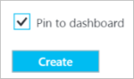

<properties
   pageTitle="So erstellen und Verwalten einer DNS-Zone Azure-Portal | Microsoft Azure"
   description="Informationen Sie zum Erstellen von DNS-Zonen für Azure DNS. Dies ist eine schrittweise Anleitung zum Erstellen und Verwalten der ersten DNS-Einträge und starten Sie Ihre DNS-Domäne, die über das Azure-Portal Hostinganbieter."
   services="dns"
   documentationCenter="na"
   authors="sdwheeler"
   manager="carmonm"
   editor=""
   tags="azure-resource-manager"/>

<tags
   ms.service="dns"
   ms.devlang="na"
   ms.topic="article"
   ms.tgt_pltfrm="na"
   ms.workload="infrastructure-services"
   ms.date="08/16/2016"
   ms.author="sewhee"/>

# Erstellen einer DNS-Zone Azure-Portal

> [AZURE.SELECTOR]
- [Azure-Portal](dns-getstarted-create-dnszone-portal.md)
- [PowerShell](dns-getstarted-create-dnszone.md)
- [Azure CLI](dns-getstarted-create-dnszone-cli.md)

In diesem Artikel führt Sie durch die Schritte zum Erstellen einer DNS Zone mithilfe des Azure-Portals. Sie können auch eine DNS-Zone mithilfe der PowerShell oder CLI erstellen.

[AZURE.INCLUDE [dns-create-zone-about](../../includes/dns-create-zone-about-include.md)]

### Informationen zu Kategorien für Azure DNS

Kategorien sind eine Liste von Name-Wert-Paare und Rechnungsadresse oder Gruppierungsebene Zwecken von Azure Ressourcenmanager zu Bezeichnung Ressourcen verwendet. Weitere Informationen zu Kategorien finden Sie im Artikel [Verwenden von Kategorien, um Ihre Azure Ressourcen zu organisieren](../resource-group-using-tags.md).

Sie können Kategorien im Portal Azure mithilfe des **Einstellungen** Blades für Ihre DNS-Zone hinzufügen.

## Erstellen einer DNS-zone

1. Melden Sie sich bei der Azure-portal

2. Klicken Sie auf das Menü Hub auf, und klicken Sie auf **Neu > Netzwerk >** , und klicken Sie dann auf **DNS-Zone** , um die DNS-Zone Blade zu öffnen.

    

3. Klicken Sie auf das Blade **DNS Zone** unten auf **Erstellen** . Dadurch wird das **Erstellen von DNS-Zone** Blade geöffnet.

    

4. Klicken Sie auf das **Erstellen von DNS-Zone** Blade benennen Sie Ihre DNS-Zone. Beispielsweise *"contoso.com"*. [Informationen zu DNS Zonennamen](#names) im Abschnitt oben angezeigt.

5. Geben Sie dann die Ressourcengruppe aus, die Sie verwenden möchten. Sie können entweder erstellen eine neuen Ressourcengruppe, oder wählen eine bereits vorhandene.

6. Geben Sie den Speicherort der Ressourcengruppe, aus der Dropdownliste den **Speicherort** . Beachten Sie, dass diese Einstellung auf den Speicherort der Ressourcengruppe, nicht den Speicherort für die DNS-Zone verweist. Die tatsächliche DNS Zone Ressource automatisch "global" und nicht etwas, das Sie können (oder müssen) im Portal angeben.

7. Lassen Sie das **Pin zum Dashboard** Kontrollkästchen aktiviert, wenn Sie einfach Ihre neue Zone auf Ihr Dashboard suchen möchten. Klicken Sie dann auf **Erstellen**.

    

8. Nachdem Sie auf erstellen klicken, sehen Sie Ihre neue Zone auf dem Dashboard konfiguriert wird.

    

9. Wenn Ihre neue Zone erstellt wurde, wird das Blade für Ihre neue Zone auf dem Dashboard geöffnet.

## Anzeigen von Datensätzen

Erstellen einer DNS-Zone erstellt auch die folgenden Einträge aus:

- Der Datensatz "Start of Authority" (SOA). Die SOA ist im Stammverzeichnis jeder DNS Zone vorhanden.
- Die autorisierende (NS) Namenservereinträge. Diese anzeigen, welche Namenserver die Zone gehostet werden. Azure DNS verwendet einen Pool von Namenserver, und so unterschiedlich Namenserver können für verschiedene Zonen in Azure DNS zugewiesen werden. Weitere Informationen finden Sie unter [Stellvertretung einer Domäne zu Azure DNS](dns-domain-delegation.md) .

Sie können die Einträge aus dem Azure-Portal anzeigen.

1. Klicken Sie aus Ihrer **DNS-Zone** Blade auf **Alle Einstellungen** , um das **Blade Einstellungen** für die DNS-Zone zu öffnen.

    

2. In den unteren Teil des Aufgabenbereichs Essentials können Sie sehen, dass legt der Eintrag für die DNS-Zone.

    

## Test

Sie können Ihre DNS-Zone mithilfe der DNS-Tools, wie z. B. Nslookup, der Vorgang oder das [Auflösen-DNS-Name PowerShell-Cmdlet](https://technet.microsoft.com/library/jj590781.aspx)testen.

Wenn Sie Ihre Domäne für die neue Zone in Azure DNS verwenden noch delegiert nicht geschehen ist, müssen Sie die DNS-Abfrage direkt auf eine der Namenserver für Ihre Zone direkte. Die Namenserver für Ihre Zone erhalten in die NS-Einträge aufgeführt durch `Get-AzureRmDnsRecordSet` über. Stellen Sie sicher das Wechseln der richtigen Werte für Ihre Zone in den folgenden Befehl.

    nslookup
    > set type=SOA
    > server ns1-01.azure-dns.com
    > contoso.com

    Server: ns1-01.azure-dns.com
    Address:  208.76.47.1

    contoso.com
            primary name server = ns1-01.azure-dns.com
            responsible mail addr = msnhst.microsoft.com
            serial  = 1
            refresh = 900 (15 mins)
            retry   = 300 (5 mins)
            expire  = 604800 (7 days)
            default TTL = 300 (5 mins)

## Löschen einer DNS zone

Sie können die DNS-Zone direkt im Portal löschen. Vor dem Löschen einer DNS-Zone in Azure DNS, müssen Sie alle Einträge Sätze, eine Ausnahme bilden jedoch die NS und SOA Einträge im Stammverzeichnis der Zone zu löschen, die automatisch erstellt wurden, wenn die Zone erstellt wurde.

1. Suchen des **DNS-Zone** Blades für die Zone, die Sie löschen möchten, und klicken Sie auf am oberen Rand der Blade **Löschen** .

2. Eine Meldung wird angezeigt, die Sie darüber informiert, dass Sie alle Einträge Sätze, mit Ausnahme der NS und SOA Datensätze löschen müssen, die automatisch erstellt wurden. Wenn Sie Ihre Datensätze gelöscht haben, klicken Sie auf **Ja**. Beachten Sie, dass beim Löschen einer DNS Zone aus dem Portal wird der Ressourcengruppe, die die DNS-Zone zugeordnet wird nicht gelöscht.

## Nächste Schritte

Erstellen Sie nach dem Erstellen einer DNS-Zone, [Datensatz Sätze und Datensätze](dns-getstarted-create-recordset-portal.md) zum Auflösen von Namen für Ihre Domäne Internet starten aus.
