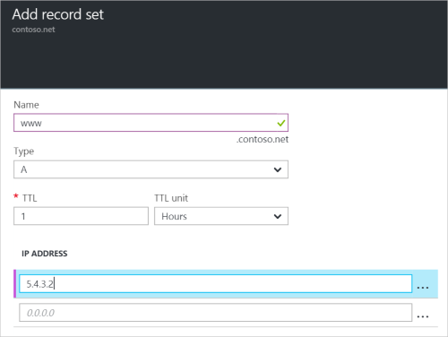

<properties
   pageTitle="Erstellen einer Datensatzgruppe und Einträge für eine DNS-Zone mit dem Portal Azure | Microsoft Azure"
   description="So erstellen Host-Einträgen für Azure DNS- und Datensätze und Datensätze, die über das Azure-Portal erstellen"
   services="dns"
   documentationCenter="na"
   authors="sdwheeler"
   manager="carmonm"
   editor=""
   tags="azure-resource-manager"/>

<tags
   ms.service="dns"
   ms.devlang="na"
   ms.topic="article"
   ms.tgt_pltfrm="na"
   ms.workload="infrastructure-services"
   ms.date="08/16/2016"
   ms.author="sewhee"/>

# Erstellen von DNS-Datensätze und Einträge mithilfe des Azure-Portals

> [AZURE.SELECTOR]
- [Azure-Portal](dns-getstarted-create-recordset-portal.md)
- [PowerShell](dns-getstarted-create-recordset.md)
- [Azure CLI](dns-getstarted-create-recordset-cli.md)

In diesem Artikel führt Sie durch die Vorgehensweise zum Erstellen von Datensätzen und Einträge Datensätze mithilfe des Azure-Portals an. Nachdem Sie Ihre DNS-Zone erstellen, fügen Sie die DNS-Einträge für Ihre Domäne hinzu. Dazu müssen Sie zuerst DNS-Einträge und Datensätze zu verstehen.

[AZURE.INCLUDE [dns-about-records-include](../../includes/dns-about-records-include.md)]

## Erstellen Sie einen Datensatz festlegen und Datensatz

Im folgende Beispiel führt Sie durch die Erstellung einer Anzahl von Datensätzen und Datensatz mithilfe des Azure-Portals an. Wir verwenden den Datensatztyp DNS "A".

1. Melden Sie sich mit dem Portal aus.

2. Wechseln Sie zu der **DNS-Zone** Blade, in dem Sie einen Datensatz erstellen möchten.

3. Wählen Sie am oberen Rand der **DNS-Zone** Blade öffnen Sie das **Festlegen von Add Record** Blade **Eintrag festlegen** .

    

4. Klicken Sie auf das Blade **Add Record festlegen** Namen Sie Anzahl von Datensätzen. Beispielsweise können Sie Ihre Datensatzgruppe "**Www**" nennen.

    

5. Wählen Sie den Typ des Datensatzes, den Sie erstellen möchten. Wählen Sie beispielsweise **A**.

6. Legen Sie die **Gültigkeitsdauer**. Die Standard-Time to live im Portal ist eine Stunde.

7. Fügen Sie die IP-Adressen eine IP-Adresse pro Zeile hinzu. Wenn Sie die vorgeschlagenen Datensatz SetName und Datensatztyp, die zuvor beschriebenen verwenden, fügen Sie die IPv4-IP-Adressen der **A** -Datensatzes für die Datensatzgruppe "www" hinzu.

8. Nachdem Sie IP-Adressen hinzugefügt haben, wählen Sie **OK** am unteren Rand der Blade. Die DNS-Datensatzgruppe wird erstellt.

## Nächste Schritte

Zum Verwalten der Anzahl von Datensätzen und Datensätzen finden Sie unter [Verwalten von DNS-Einträge und Datensatz legt mithilfe des Azure-Portals](dns-operations-recordsets-portal.md).

Weitere Informationen zu Azure DNS finden Sie unter der [Azure DNS (Übersicht)](dns-overview.md).
