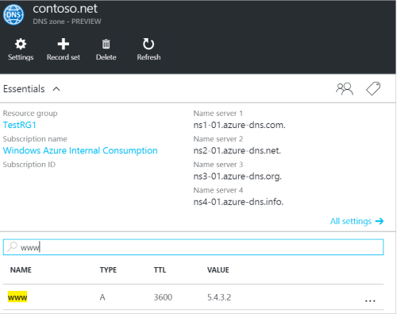
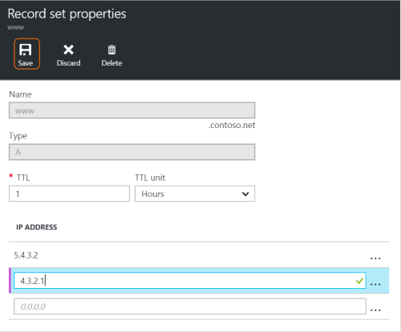
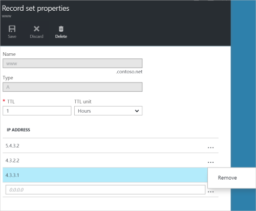

<properties
   pageTitle="Verwalten von DNS-Datensätze und Datensätze mit dem Portal Azure | Microsoft Azure"
   description="Verwalten von DNS Record legt und beim Hosten Ihrer Domäne auf Azure DNS-Einträge."
   services="dns"
   documentationCenter="na"
   authors="sdwheeler"
   manager="carmonm"
   editor=""
   tags="azure-resource-manager"/>

<tags
   ms.service="dns"
   ms.devlang="na"
   ms.topic="article"
   ms.tgt_pltfrm="na"
   ms.workload="infrastructure-services"
   ms.date="08/16/2016"
   ms.author="sewhee"/>

# DNS-Einträge verwalten und Datensatz wird mit dem Azure-portal

> [AZURE.SELECTOR]
- [Azure-Portal](dns-operations-recordsets-portal.md)
- [Azure CLI](dns-operations-recordsets-cli.md)
- [PowerShell](dns-operations-recordsets.md)

In diesem Artikel wird gezeigt, wie Eintrag Sätze und Einträge für Ihre DNS-Zone mithilfe des Azure-Portals verwaltet werden können.

Es ist wichtig, den Unterschied zwischen DNS-Datensätze und einzelnen DNS-Einträge zu verstehen. Eine Datensatzgruppe ist eine Zusammenstellung von Datensätzen in einer Zone, die denselben Namen haben und den gleichen Typ. Weitere Informationen finden Sie unter [Erstellen von DNS-Datensätze und Einträge mithilfe des Azure-Portals](dns-getstarted-create-recordset-portal.md).

## Erstellen eines neuen Datensatzes festlegen und Datensatz

Um einen Eintrag Festlegen der Azure-Portal zu erstellen, finden Sie unter [Erstellen von DNS-Einträge mithilfe des Azure-Portals](dns-getstarted-create-recordset-portal.md).

## Anzeigen einer Datensatzgruppe

1. Wechseln Sie in der Azure-Portal an die **DNS-Zone** Blade.

2. Suchen Sie für den Datensatz ein, und wählen Sie ihn aus. Dadurch wird die Anzahl von Datensätzen-Eigenschaften geöffnet.

    

## Einen neuen Datensatz zu einem Datensatz hinzufügen

Sie können bis zu 20 Datensätze an eine beliebige Anzahl von Datensätzen hinzufügen. Ein Datensatz kann nicht zwei identische Datensätze enthält. Leere Datensätze (mit 0 (null) Records) erstellt werden können, aber nicht auf die Azure DNS-Namensserver angezeigt. Datensätze vom Typ CNAME können einen Datensatz höchstens enthalten.

1. Klicken Sie auf den **Eintrag festlegen von Eigenschaften** Blade für Ihre DNS-Zone klicken Sie auf den Eintrag festlegen, dem Sie einen Datensatz hinzufügen möchten.

    

2. Geben Sie an, dass der Eintrag Eigenschaften festlegen, indem Sie die Felder ausfüllen.

    

2. Klicken Sie auf die am oberen Rand der Blade **Speichern** , um die Einstellungen zu speichern. Schließen Sie dann das Blade aus.

3. Klicken Sie in der Ecke wird angezeigt, dass der Eintrag speichern, wird.

    

Nach der Eintrag gespeichert wurde, werden die Werte auf das Blade **DNS Zone** den neuen Eintrag wiedergeben.

## Aktualisieren eines Datensatzes

Wenn Sie einen Datensatz in einem vorhandenen Datensatz Satz aktualisieren, hängen den Typ des Datensatzes, dem Sie beim Arbeiten mit die Felder, die Sie aktualisieren können.

1. Klicken Sie auf den **Eintrag festlegen von Eigenschaften** Blade für die Anzahl von Datensätzen suchen Sie nach den Eintrag.

2. Ändern Sie den Datensatz ein. Wenn Sie einen Datensatz ändern, können Sie die verfügbaren Einstellungen für den Eintrag ändern. Im folgenden Beispiel das Feld **IP-Adresse** ausgewählt ist, und die IP-Adresse gerade geändert wird.

    

3. Klicken Sie auf die am oberen Rand der Blade **Speichern** , um die Einstellungen zu speichern. In der oberen rechten Ecke sehen Sie die Benachrichtigung, die der Eintrag gespeichert wurde.

    

Nach der Eintrag gespeichert wurde, werden die Werte für den Eintrag festlegen auf das Blade **DNS Zone** den aktualisierten Datensatz wiedergeben.

## Entfernen eines Datensatzes aus einer Datensatzgruppe

Azure-Portal können Sie um Datensätze aus einer Datensatzgruppe zu entfernen. Beachten Sie, dass den letzten Datensatz in einem Datensatz Satz entfernen Datensatzgruppe nicht löschen.

1. Klicken Sie auf den **Eintrag festlegen von Eigenschaften** Blade für die Anzahl von Datensätzen suchen Sie nach den Eintrag.

2. Klicken Sie auf den Datensatz, den Sie entfernen möchten. Wählen Sie dann **Entfernen**aus.

    

3. Klicken Sie auf die am oberen Rand der Blade **Speichern** , um die Einstellungen zu speichern.

3. Nach der Eintrag entfernt wurde, wirken sich die Werte für den Datensatz auf die **DNS-Zone** Blade werden das Entfernen aus.

## Löschen einer Datensatzgruppe

1. Klicken Sie auf den **Eintrag festlegen von Eigenschaften** für Ihren Eintrag Blade festlegen, klicken Sie auf **Löschen**.

    

2. Eine Meldung angezeigt wird, mit der Frage, wenn Sie die Menge der Datensatz löschen möchten.

3. Stellen Sie sicher, dass der Name Datensatzgruppe, die Sie verwenden möchten übereinstimmt, löschen, und klicken Sie dann auf **Ja**.

4. In der **DNS-Zone** Blade stellen Sie sicher, dass die Datensatzgruppe nicht mehr angezeigt wird.

## Arbeiten Sie mit NS und SOA-Datensätzen

NS und SOA-Datensätze, die automatisch erstellt werden, werden andere Datensatztypen anders verwaltet.

### SOA Datensätze ändern

Sie können keine Datensätze hinzufügen oder Entfernen von automatisch erstellten SOA-Eintrag in der Zone Spitze festlegen (Name = "@"). Allerdings können Sie jede der Parameter innerhalb des SOA-Eintrags (außer "Host") ändern, und legen Sie der Eintrag TTL.

### Ändern Sie die NS-Einträge in der Zone Spitze

Sie können nicht hinzufügen möchten, entfernen oder ändern Sie die Datensätze in der automatisch erstellte NS-Eintrag in der Zone Spitze festlegen (Name = "@"). Die einzige Änderung, die darf besteht darin Datensatzgruppe TTL ändern.

### SOA oder NS-Datensätze löschen

Die SOA können Sie nicht löschen und NS-Eintrag in der Zone Spitze legt (Name = "@") , werden automatisch erstellt, wenn die Zone erstellt wird. Sie werden automatisch gelöscht, wenn Sie die Zone löschen.

## Nächste Schritte

-   Weitere Informationen zu Azure DNS finden Sie unter der [Azure DNS (Übersicht)](dns-overview.md).
-   Weitere Informationen zum Automatisieren von DNS finden Sie unter [Erstellen von DNS-Zonen und Datensatz legt .NET SDK verwenden](dns-sdk.md).
-   Weitere Informationen zu reverse-DNS-Einträge finden Sie unter [Verwalten von reverse DNS-Einträge für Ihre Dienstleistungen mithilfe der PowerShell](dns-reverse-dns-record-operations-ps.md).
