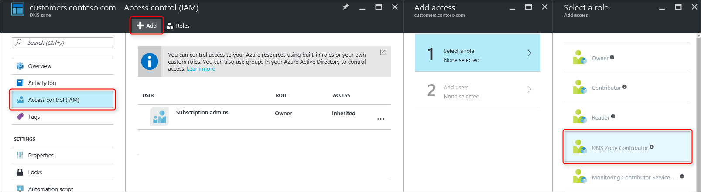
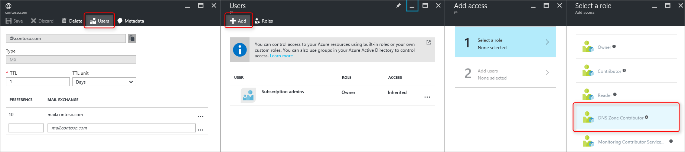

<properties 
   pageTitle="Schützen von DNS-Zonen und Einträge | Microsoft Azure" 
   description="Informationen zum Schützen von DNS-Zonen und Datensätze in Microsoft Azure DNS." 
   services="dns" 
   documentationCenter="na" 
   authors="jtuliani" 
   manager="carmonm" 
   editor=""/>

<tags
   ms.service="dns"
   ms.devlang="na"
   ms.topic="article"
   ms.tgt_pltfrm="na"
   ms.workload="infrastructure-services" 
   ms.date="10/20/2016"
   ms.author="jtuliani"/>

# Zum Schützen von DNS-Zonen und Einträge

DNS-Zonen und Einträge sind wichtige Ressourcen auf. Löschen einer DNS-Zone oder sogar nur eines DNS-Eintrags kann eine gesamte Dienstausfall führen.  Es ist daher wichtig, kritische DNS-Zonen und Einträge gegen unbefugten oder unbeabsichtigte Änderungen geschützt sind.

In diesem Artikel wird erläutert, wie Azure DNS Sie Ihre DNS-Zonen und Einträge gegen solche Änderungen schützen können.  Wir übernehmen zwei leistungsstarke Sicherheitsfeatures von Azure Ressourcenmanager: [rollenbasierte Access-Steuerelement](../active-directory/role-based-access-control-what-is.md) , und [Sperren für Ressourcen](../resource-group-lock-resources.md).

## Rollenbasierte Access-Steuerelement

Azure rollenbasierte Access Steuerelement (RBAC) ermöglicht die Verwaltung von abgestimmte Zugriff für Azure Benutzer, Gruppen und Ressourcen. Verwenden RBAC, können Sie genau dem Ausmaß des Zugriffs erteilen, dass Benutzer für ihre Aufgaben benötigen. Weitere Informationen darüber, wie RBAC Zugriff verwalten kann finden Sie unter [Was ist rollenbasierte Access Control](../active-directory/role-based-access-control-what-is.md).

### Die Rolle 'DNS Zone Mitwirkender'

Die Rolle 'DNS Zone Mitwirkender' ist eine integrierte Rolle von Azure bereitgestellt werden, für die Verwaltung von DNS-Ressourcen.  Zuweisen von DNS Zone Mitwirkender Berechtigungen für einen Benutzer oder eine Gruppe ermöglicht dieser Gruppe zum Verwalten von DNS-Ressourcen, aber keine Ressourcen für einen anderen Typ.

Nehmen Sie beispielsweise an, dass die Ressource 'Myzones' für die Firma Contoso fünf Zonen enthält. Erteilen den DNS-Administrator ' DNS Zone' Teilnehmerberechtigungen dieser Ressourcengruppe, ermöglicht Vollzugriff auf die DNS-Zonen. Es wird vermieden, unnötigen Berechtigungen erteilen, beispielsweise der DNS-Administrator kann nicht erstellt oder virtuellen Computern beenden.

Die einfachste Methode zum Zuweisen von Berechtigungen RBAC wird [über das Azure-Portal](../active-directory/role-based-access-control-configure.md).  Öffnen Sie das Blade "Access-Steuerelements (IAM)" für die Ressourcengruppe, dann klicken Sie auf 'Hinzufügen', und klicken Sie dann wählen Sie die Rolle 'DNS Zone Mitwirkender' und wählen Sie die erforderlichen Benutzern oder Gruppen Berechtigungen erteilen.

Berechtigungen können auch [mithilfe der PowerShell Azure erteilt](../active-directory/role-based-access-control-manage-access-powershell.md)werden:

    # Grant 'DNS Zone Contributor' permissions to all zones in a resource group
    New-AzureRmRoleAssignment -SignInName <user email address> -RoleDefinitionName "DNS Zone Contributor" -ResourceGroupName <resource group name>

Der entsprechende Befehl steht auch [über die CLI Azure](../active-directory/role-based-access-control-manage-access-azure-cli.md):

    # Grant 'DNS Zone Contributor' permissions to all zones in a resource group
    azure role assignment create --signInName  <user email address> --roleName "DNS Zone Contributor" --resourceGroup <resource group name>

### Zonenebene RBAC

Azure RBAC Regeln können auf ein Abonnement, eine Ressourcengruppe oder eine bestimmte Ressource angewendet werden. Im Falle von Azure DNS kann diese Ressource eine einzelne DNS Zone oder einen einzelnen Datensatz Satz.

Nehmen Sie beispielsweise an, dass die Ressource 'Myzones' enthält die Zone "contoso.com" und einer Subzone 'customers.contoso.com' in der CNAME-Einträge für jede Kundenkontos erstellt werden.  Das Konto verwendet, um die folgenden CNAME-Einträge verwalten Berechtigungen zum Erstellen von Datensätzen in der 'customers.contoso.com' Zone nur zugewiesen werden sollen, es sollte keinen Zugriff auf die anderen Zonen.

Zone Ebene RBAC-Berechtigungen können über das Azure-Portal erteilt werden.  Öffnen Sie das Blade "Access-Steuerelements (IAM)" für die Zone, dann klicken Sie auf 'Hinzufügen', und klicken Sie dann wählen Sie die Rolle 'DNS Zone Mitwirkender' und wählen Sie die erforderlichen Benutzern oder Gruppen Berechtigungen erteilen.

Berechtigungen können auch [mithilfe der PowerShell Azure erteilt](../active-directory/role-based-access-control-manage-access-powershell.md)werden:

    # Grant 'DNS Zone Contributor' permissions to a specific zone
    New-AzureRmRoleAssignment -SignInName <user email address> -RoleDefinitionName "DNS Zone Contributor" -ResourceGroupName <resource group name> -ResourceName <zone name> -ResourceType Microsoft.Network/DNSZones

Der entsprechende Befehl steht auch [über die CLI Azure](../active-directory/role-based-access-control-manage-access-azure-cli.md):

    # Grant 'DNS Zone Contributor' permissions to a specific zone
    azure role assignment create --signInName <user email address> --roleName "DNS Zone Contributor" --resource-name <zone name> --resource-type Microsoft.Network/DNSZones --resource-group <resource group name>

### Eintrag festlegen Ebene RBAC

Wir können einen Schritt weiter gehen. Erwägen Sie den e-Mail-Administrator für die Firma Contoso, wer Zugriff auf die MX und TXT-Einträge in der Spitze der Zone "contoso.com" benötigt.  Anna benötigt kein Zugriff auf andere MX oder TXT-Einträge, oder klicken Sie auf alle Datensätze für einen anderen Typ.  Azure DNS ermöglicht Ihnen, Zuweisen von Berechtigungen auf der Ebene Datensatzgruppe zu exakt die Einträge hinzu, denen der e-Mail-Administrator.  Der e-Mail-Administrator ist genau das Steuerelement erteilt, das Anna benötigt, das und kann nicht auf die anderen Änderungen vornehmen.
  
Datensatz-Set Berechtigungen der Websitesammlungsebene RBAC können über das Azure-Portal, verwenden die Schaltfläche 'Benutzer' in der Anzahl von Datensätzen Blade konfiguriert werden:

Berechtigungen der Websitesammlungsebene RBAC Datensatz-Set können auch [mithilfe der PowerShell Azure erteilt](../active-directory/role-based-access-control-manage-access-powershell.md)werden:

    # Grant permissions to a specific record set
    New-AzureRmRoleAssignment -SignInName <user email address> -RoleDefinitionName "DNS Zone Contributor" -Scope "/subscriptions/<subscription id>/resourceGroups/<resource group name>/providers/Microsoft.Network/dnszones/<zone name>/<record type>/<record name>" 

Der entsprechende Befehl steht auch [über die CLI Azure](../active-directory/role-based-access-control-manage-access-azure-cli.md):

    # Grant permissions to a specific record set
    azure role assignment create --signInName <user email address> --roleName "DNS Zone Contributor" --scope "/subscriptions/<subscription id>/resourceGroups/<resource group name>/providers/Microsoft.Network/dnszones/<zone name>/<record type>/<record name>"

### Benutzerdefinierte Rollen

Die integrierten ' DNS Zone' Teilnehmerrolle ermöglicht Vollzugriff auf eine DNS-Ressource. Es ist es möglich, eigene Kunden Azure Rollen, um noch genauer gesteuert bereitstellen zu erstellen.

Betrachten Sie erneut das Beispiel, in dem ein CNAME-Eintrag in der Zone 'customers.contoso.com' für jedes Unternehmen Contoso Kundenkontos erstellt wird.  Das Konto verwendet, um diese CNAMEs verwalten sollte über die Berechtigung zum Verwalten der CNAME-Einträge nur gewährt werden.  Es ist dann keine Datensätze zu anderen Typen (z. B. ändern MX-Einträge) ändern oder Zone Ebene Operationen wie Zone löschen.

Im folgenden Beispiel wird eine benutzerdefinierte Rollendefinition für die Verwaltung von nur CNAME-Einträge:

    {
        "Name": "DNS CNAME Contributor",
        "Id": "",
        "IsCustom": true,
        "Description": "Can manage DNS CNAME records only.",
        "Actions": [
            "Microsoft.Network/dnsZones/CNAME/*",
            "Microsoft.Network/dnsZones/read",
            "Microsoft.Authorization/*/read",
            "Microsoft.Insights/alertRules/*",
            "Microsoft.ResourceHealth/availabilityStatuses/read",
            "Microsoft.Resources/deployments/*",
            "Microsoft.Resources/subscriptions/resourceGroups/read",
            "Microsoft.Support/*"
        ],
        "NotActions": [
        ],
        "AssignableScopes": [
            "/subscriptions/ c276fc76-9cd4-44c9-99a7-4fd71546436e"
        ]
    }

Die Eigenschaft Aktionen werden die folgenden DNS-spezifischen Berechtigungen definiert:

- `Microsoft.Network/dnsZones/CNAME/*`gewährt Vollzugriff über einen CNAME-Einträge
- `Microsoft.Network/dnsZones/read`die Berechtigung zum Lesen von DNS-Zonen, nicht jedoch ändern können, damit Sie sehen die Zone, in der der CNAME-Eintrag erstellt wird.

Die verbleibenden Aktionen werden aus der [DNS-Zone-integrierten Teilnehmerrolle](../active-directory/role-based-access-built-in-roles.md#dns-zone-contributor)kopiert.

>[AZURE.NOTE] Verwenden einer benutzerdefinierten RBAC-Rolle zu verhindern, dass Datensätze löschen, dennoch zu aktualisierenden ist zwar keine effektive Kontrolle an. Verhindert, dass Datensätze gelöscht, aber es verhindert nicht, dass sie geändert werden.  Zulässige Änderungen einschließen hinzufügen und Entfernen von Einträgen aus dem Aufzeichnen Satz, einschließlich des Entfernens alle Einträge, um eine 'empty' Datensatz festlegen lassen. Dies hat dieselbe Wirkung wie das Löschen des Datensatzes aus einer Sicht der DNS-Auflösung festlegen.

Benutzerdefinierte Rollendefinitionen können nicht über das Azure-Portal aktuell definiert werden. Eine benutzerdefinierte Rolle basierend auf diese Rollendefinition kann mithilfe der PowerShell Azure erstellt werden:

    # Create new role definition based on input file
    New-AzureRmRoleDefinition -InputFile <file path>

Sie können auch über die CLI Azure erstellt werden:

    # Create new role definition based on input file
    azure role create –inputfile <file path>

Die Rolle kann Klicken Sie dann auf die gleiche Weise wie integrierte Rollen zugewiesen werden, wie weiter oben in diesem Artikel beschrieben.

Weitere Informationen zum Erstellen verwalten Sie, und weisen Sie benutzerdefinierte Rollen zu, finden Sie unter [Benutzerdefinierte Rollen in Azure RBAC](../active-directory/role-based-access-control-custom-roles.md).

## Sperren für Ressourcen

Zusätzlich zu RBAC unterstützt Azure Ressourcenmanager eine andere Art von Sicherheit Steuerelement, und zwar die Möglichkeit, Sperrenressourcen ''. Wo RBAC Regeln Sie das Steuerelement ermöglichen die Aktionen für bestimmte Benutzer und Gruppen, Sperren für Ressourcen werden angewendet, die der Ressource, und gelten für alle Benutzer und Rollen. Weitere Informationen finden Sie unter [Sperrenressourcen Azure Ressourcenmanager](../resource-group-lock-resources.md).

Es gibt zwei Arten von Ressourcen sperren: **DoNotDelete** und **schreibgeschützt**. Dies können entweder eine DNS-Zone oder einen einzelnen Datensatz Satz angewendet werden.  Den folgenden Abschnitten werden einige häufige Szenarien, und wie Sie diese unterstützen Sperren für Ressourcen verwenden.

### Schutz vor alle Änderungen

Um zu verhindern, dass alle Änderungen vorgenommen wird, wenden Sie eine schreibgeschützte Sperre zur Zone aus.  Dadurch wird verhindert, dass neue Datensätze erstellt wurden, und vorhandene Datensätze geändert oder gelöscht wird.

Zone Ebene Ressource sperren können über das Azure-Portal erstellt werden.  Aus dem Blade DNS Zone, klicken Sie auf 'Sperren', dann 'hinzufügen':

Zone Ebene Ressource sperren auch über PowerShell Azure erstellt werden können:

    # Lock a DNS zone
    New-AzureRmResourceLock -LockLevel <lock level> -LockName <lock name> -ResourceName <zone name> -ResourceType Microsoft.Network/DNSZones -ResourceGroupName <resource group name> 

Konfigurieren von Azure Ressource sperren wird derzeit über die Azure CLI nicht unterstützt.

### Schützen von einzelner Datensätze
Um zu verhindern, dass eine vorhandene DNS-Eintrag vor Änderung festlegen, wird wenden Sie eine schreibgeschützte Sperre zum Aufzeichnen Satz an.

>[AZURE.NOTE] Anwenden einer DoNotDelete Sperren zu einer ist keine effektive Steuerelement. Es wird verhindert, dass der Datensatzgruppe aus, der gelöscht, aber es verhindert nicht, dass es geändert werden.  Zulässige Änderungen einschließen hinzufügen und Entfernen von Einträgen aus dem Aufzeichnen Satz, einschließlich des Entfernens alle Einträge, um eine 'empty' Datensatz festlegen lassen. Dies hat dieselbe Wirkung wie das Löschen des Datensatzes aus einer Sicht der DNS-Auflösung festlegen.

Anzahl von Datensätzen Ebene Ressource sperren können zurzeit nur mithilfe der PowerShell Azure konfiguriert.  Sie werden nicht in der Azure-Portal oder Azure CLI unterstützt.

    # Lock a DNS record set
    New-AzureRmResourceLock -LockLevel <lock level> -LockName <lock name> -ResourceName <zone name>/<record set name> -ResourceType Microsoft.Network/DNSZones/<record type> -ResourceGroupName <resource group name> 

### Schutz vor Zone löschen

Wenn Sie eine Zone in Azure DNS löschen, werden alle Datensätze in der Zone ebenfalls gelöscht.  Dieser Vorgang kann nicht rückgängig gemacht werden.  Versehentlich löschen einer kritischen Zone hat möglicherweise zu einem erheblichen Business auswirken.  Es ist daher sehr wichtig, um unbeabsichtigtes Zone löschen zu schützen.

Anwenden einer DoNotDelete Sperren einer Zone wird verhindert, dass die Zone gelöscht.  Da Sperren von untergeordneten Ressourcen übernommen werden, verhindert es jedoch auch alle Datensätze in der Zone gelöscht wird, die möglicherweise unerwünscht.  Darüber hinaus ist wie zuvor beschrieben, auch nicht wirksam, da Einträge aus den vorhandenen Datensatz Datensätzen noch entfernt werden können.

Erwägen Sie als Alternative Schloss DoNotDelete anwenden, um einen Eintrag in der Zone, wie etwa die Datensatzgruppe SOA festlegen.  Da die Zone gelöscht werden kann, ohne auch löschen der Datensätze geschützt gegen Zone löschen, wobei Datensätze weiterhin innerhalb der Zone frei korrigiert werden muss. Wenn versucht wird, löschen die Zone, erkennt Azure Ressourcenmanager dies SOA Datensatz festlegen auch löschen möchten, und den Anruf blockiert, da die SOA gesperrt ist.  Es werden keine Datensätze gelöscht.

Der folgende PowerShell-Befehl erstellt eine Sperre DoNotDelete anhand der angegebenen Zone SOA-Eintrag:

    # Protect against zone delete with DoNotDelete lock on the record set
    New-AzureRmResourceLock -LockLevel DoNotDelete -LockName <lock name> -ResourceName <zone name>/@ -ResourceType Microsoft.Network/DNSZones/SOA -ResourceGroupName <resource group name> 

Unbeabsichtigtes Zone löschen vermieden werden mithilfe einer benutzerdefinierten Rolle, um sicherzustellen, dass den Operator und zum Verwalten von Ihrer Zones verwendete Dienstkonten verfügen nicht über die Zone Berechtigungen löschen. Wenn Sie zum Löschen einer Zone benötigen, können Sie einen zweistufigen löschen, ersten gewähren Zone Löschberechtigungen (bei der Zone Umfang, um zu verhindern, löschen die falsche Zone) und Sekunde zum Löschen der Zone erzwingen.

Der zweite Ansatz hat den Vorteil, den sie für alle Zonen, die durch diese Konten zugegriffen werden, ohne zu denken Sie daran, Sperren erstellen passt. Es hat Nachteile, dass alle Konten mit Berechtigungen löschen Zone wie des Abonnements sind, eine kritische Zone noch versehentlich löschen können.

Es ist möglich, beide Ansätze - Ressource sperren und benutzerdefinierte Rollen - als einen in Tiefenverteidigung Ansatz zum Schutz von DNS Zone gleichzeitig zu verwenden.

## Nächste Schritte

- Weitere Informationen zum Arbeiten mit RBAC finden Sie unter [Erste Schritte mit Access Management Azure-Portal](../active-directory/role-based-access-control-what-is.md). 
- Weitere Informationen zum Arbeiten mit Ressourcen Sperren finden Sie unter [Sperrenressourcen Azure Ressourcenmanager](../resource-group-lock-resources.md).
- Weitere Informationen zum Sichern von Azure Ressourcen finden Sie unter [Sicherheitsaspekte für Azure Ressourcenmanager](../best-practices-resource-manager-security.md).
