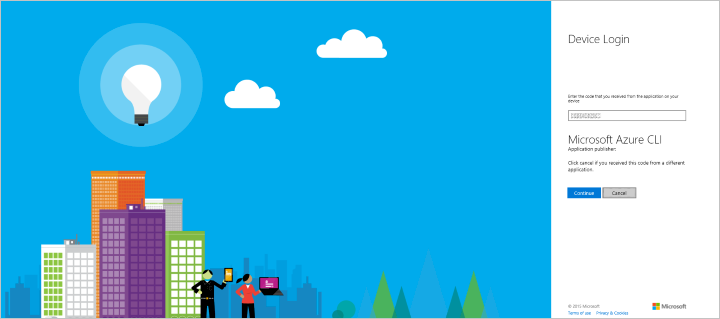

<properties
    pageTitle="DocumentDB Automatisierung - Ressourcenmanager - CLI | Microsoft Azure"
    description="Verwenden Sie Azure Ressourcenmanager Vorlagen oder CLI Bereitstellen einer DocumentDB Datenbank-Konto an. DocumentDB ist eine cloudbasierte NoSQL-Datenbank für JSON-Daten."
    services="documentdb"
    authors="mimig1"
    manager="jhubbard"
    editor=""
    tags="azure-resource-manager"
    documentationCenter=""/>

<tags 
    ms.service="documentdb" 
    ms.workload="data-services" 
    ms.tgt_pltfrm="na" 
    ms.devlang="na" 
    ms.topic="article" 
    ms.date="09/28/2016" 
    ms.author="mimig"/>

# Automatisieren von DocumentDB Erstellung des Kontos mit Azure CLI und Ressourcenmanager Azure-Vorlagen 

> [AZURE.SELECTOR]
- [Azure-portal](documentdb-create-account.md)
- [Azure CLI und Cloud](documentdb-automation-resource-manager-cli.md)

In diesem Artikel wird gezeigt, wie Sie ein DocumentDB Azure-Konto mithilfe von Vorlagen Azure Ressourcenmanager oder direkt mit den Azure Line Interface (CLI) erstellen. Zum Erstellen einer über das Azure-Portal DocumentDB-Kontos finden Sie unter [Verwenden des Portals Azure DocumentDB Datenbankkonto erstellen](documentdb-create-account.md).

DocumentDB Datenbankkonten sind derzeit die einzige DocumentDB Ressource, die mit Ressourcenmanager Vorlagen und die CLI Azure erstellt werden kann.

## Vorbereitung

Bevor Sie die Azure CLI mit Azure Ressourcengruppen verwenden können, müssen Sie rechts Azure CLI Version und ein Azure-Konto verfügen. Wenn Sie die Azure CLI, [Installieren sie](../xplat-cli-install.md)besitzen.

### Aktualisieren Sie Ihre Azure CLI version

Geben Sie an der Befehlszeile `azure --version` zu sehen, ob Sie die Version 0.10.4 bereits installiert haben oder höher. Sie möglicherweise aufgefordert, die Teilnahme an Microsoft Azure CLI Datensammlung in diesem Schritt und y oder n, um die Teilnahme oder melden Sie sich auswählen können.

    azure --version
    0.10.4 (node: 4.2.4)

Wenn Ihre Version nicht 0.10.4 oder später, muss entweder [die Azure CLI installieren](../xplat-cli-install.md) oder aktualisieren, indem Sie eine der systemeigenen Installer, oder über **Npm** durch Eingeben der `npm update -g azure-cli` aktualisieren oder `npm install -g azure-cli` zu installieren.

### Festlegen der Azure-Konto und Ihr Abonnement

Wenn kein Azure-Abonnement bereits, aber Sie ein Visual Studio-Abonnement verfügen, können Sie Ihre [Vorteile für Visual Studio Abonnenten](https://azure.microsoft.com/pricing/member-offers/msdn-benefits-details/)aktivieren. Oder Sie können für eine [kostenlose Testversion](https://azure.microsoft.com/pricing/free-trial/)registrieren.

Sie müssen eine Arbeit oder Schule-Konto oder ein Microsoft-Kontoidentität Azure Ressource Management Vorlagen verwendet haben. Wenn Sie eine der folgenden Konten verfügen, geben Sie den folgenden Befehl aus:

    azure login

Die folgende Ausgabe erzeugt: 

    info:    Executing command login
  	|info:    To sign in, use a web browser to open the page https://aka.ms/devicelogin. 
    Enter the code E1A2B3C4D to authenticate.

> [AZURE.NOTE] Wenn Sie ein Azure-Konto besitzen, wird eine Fehlermeldung, dass Sie eine andere Art von Konto benötigen. Um eine von Ihrem aktuellen Azure-Konto zu erstellen, finden Sie unter [Erstellen einer Arbeit oder Schule Identität in Azure Active Directory](../virtual-machines/virtual-machines-windows-create-aad-work-id.md).

Öffnen Sie [https://aka.ms/devicelogin](https://aka.ms/devicelogin) in einem Browser, und geben Sie den Code in der Ausgabe des Befehls bereitgestellt.

Nachdem Sie den Code eingegeben haben, wählen Sie die Identität, die Sie verwenden möchten, verwenden im Browser und geben Sie Ihren Benutzernamen und Ihr Kennwort ein, falls erforderlich.

Sie erhalten die folgenden Bestätigungsbildschirm angezeigt, wenn Sie erfolgreich angemeldet, und Sie können das Browserfenster schließen.

Die Befehlsshell bietet auch das folgende Ergebnis an:

    /info:    Added subscription Visual Studio Ultimate with MSDN
    info:    Setting subscription "Visual Studio Ultimate with MSDN" as default
    +
    info:    login command OK

Zusätzlich zu den hier beschriebenen interaktive Anmeldung-Methode werden zusätzliche Azure CLI Login Methoden zur Verfügung. Weitere Informationen zu anderen Methoden und Informationen zur Behandlung von mehreren Abonnements finden Sie unter [Verbinden zu einem Azure Abonnement aus der Azure Line Interface (CLI Azure)](../xplat-cli-connect.md).

### Wechseln Sie zu der Azure CLI Ressource Gruppenmodus

Standardmäßig wird der Azure CLI im Modus Management Service (**Asm** Modus) beginnt. Geben Sie die folgenden Ressourcen Gruppe Modus wechseln.

    azure config mode arm

Die Ausgabe die folgende enthält:

    info:    Executing command config mode
    info:    New mode is arm
    info:    config mode command OK

Bei Bedarf können Sie wechseln wieder in die Standardgruppe von Befehle mit der Eingabe `azure config mode asm`.

### Erstellen oder Abrufen der Ressourcengruppe

Zum Erstellen eines DocumentDB-Kontos benötigen Sie zuerst eine Ressourcengruppe aus. Wenn Sie bereits über den Namen der Ressourcengruppe, die Sie verwenden möchten kennen, fahren Sie mit [Schritt2](#create-documentdb-account-cli). 

Überprüfen Sie eine Liste aller aktuellen Ressource Gruppen, führen Sie den folgenden Befehl aus, und notieren Sie den Namen der Ressource-Gruppe aus, die, den Sie verwenden möchten: 

    azure group list

Um eine Ressourcengruppe erstellen möchten, führen Sie den folgenden Befehl aus, geben Sie den Namen der neuen Ressourcengruppe zu erstellen und der Bereich, in dem die Ressourcengruppe erstellen: 

    azure group create <resourcegroupname> <resourcegrouplocation>

 - `<resourcegroupname>`können nur alphanumerische Zeichen, Punkte, Unterstriche, die ' – ' Zeichen und Klammer und kann nicht mit einem Punkt enden. 
 - `<resourcegrouplocation>`muss eine der Regionen in der DocumentDB in der Regel verfügbar ist. Klicken Sie auf der [Seite Azure Regionen](https://azure.microsoft.com/regions/#services)wird die aktuelle Liste der Gebiete bereitgestellt.

Beispiel für Eingabe:

    azure group create new_res_group westus

Die folgende Ausgabe erzeugt:

    info:    Executing command group create
    + Getting resource group new_res_group
    + Creating resource group new_res_group
    info:    Created resource group new_res_group
    data:    Id:                  /subscriptions/xxxxxxxx-xxxx-xxxx-xxxx-xxxxxxxxxxxx/resourceGroups/new_res_group
    data:    Name:                new_res_group
    data:    Location:            westus
    data:    Provisioning State:  Succeeded
    data:    Tags: null
    data:
    info:    group create command OK

Wenn Fehler auftreten, finden Sie unter [Problembehandlung](#troubleshooting). 

## Grundlegendes zu Ressourcenmanager Vorlagen und Ressourcengruppen

Die meisten Applikationen werden anhand einer Kombination von verschiedenen Ressourcentypen (beispielsweise eine oder mehrere DocumentDB Firmen-, Speicherkonten, ein virtuelles Netzwerk oder einem Netzwerk Bereitstellung von Inhalten) erstellt. Der standardmäßigen Azure Servicemanagement-API und Azure-Portal diese Elemente, die mithilfe eines Dienst-Ansatzes dargestellt werden. Bei dieser Vorgehensweise müssen Sie bereitstellen und der einzelnen Dienste einzeln verwalten (oder suchen Sie nach anderen Tools, die berechtigt sind), und nicht als einzelne logische Einheit der Bereitstellung.

*Ressourcenmanager Azure Vorlagen* ermöglichen Ihnen das Bereitstellen und verwalten diese anderen Ressourcen als eine logische Bereitstellungseinheit auf deklarative Weise. Statt imperativ besagt Azure was einen Befehl nach der anderen bereitstellen, eine gesamte Bereitstellung in einer JSON-Datei – alle Ressourcen und zugeordneten Konfiguration und Bereitstellung Parameter – beschreiben und feststellen, Azure diese Ressourcen als eine Gruppe bereitstellen.

Weitere Informationen zum Azure Ressourcengruppen und diese für Sie in der [Übersicht Azure Ressourcenmanager](../azure-resource-manager/resource-group-overview.md)Möglichkeiten viele weitere. Wenn Sie beim Verfassen von Vorlagen interessiert sind, finden Sie unter [Azure Ressourcenmanager Authoring-Vorlagen](../resource-group-authoring-templates.md).

## Aufgabe: Erstellen eines einzelnen Region DocumentDB-Kontos

Verwenden Sie die Anweisungen in diesem Abschnitt, um eine einzelne Region DocumentDB Konto erstellen. Dies kann mithilfe von Azure CLI mit oder ohne Ressourcenmanager Vorlagen erreicht werden.

### Erstellen eines einzelnen Region DocumentDB-Kontos mit Azure CLI ohne Ressourcenmanager Vorlagen

Erstellen Sie ein Konto DocumentDB in der neuen oder vorhandenen Ressourcengruppe durch den folgenden Befehl in die Befehlszeile eingeben:

> [AZURE.TIP] Wenn Sie diesen Befehl in Azure PowerShell oder Windows PowerShell ausführen, erhalten Sie einen Fehler wegen ein unerwartetes Token. Führen Sie diesen Befehl stattdessen bei der Windows-Befehlszeile. 

    azure resource create -g <resourcegroupname> -n <databaseaccountname> -r "Microsoft.DocumentDB/databaseAccounts" -o 2015-04-08 -l <resourcegrouplocation> -p "{\"databaseAccountOfferType\":\"Standard\",\"locations\":["{\"locationName\":\"<databaseaccountlocation>\",\"failoverPriority\":\"<failoverPriority>\"}"]}"

 - `<resourcegroupname>`können nur alphanumerische Zeichen, Punkte, Unterstriche, die ' – ' Zeichen und Klammer und kann nicht mit einem Punkt enden.
 - `<resourcegrouplocation>`ist der Bereich der aktuellen Ressourcengruppe.
 - `<databaseaccountname>`können nur Kleinbuchstaben, Zahlen, die ' – ' Zeichen und muss zwischen 3 und 50 Zeichen.
 - `<databaseaccountlocation>`muss eine der Regionen in der DocumentDB in der Regel verfügbar ist. Klicken Sie auf der [Seite Azure Regionen](https://azure.microsoft.com/regions/#services)wird die aktuelle Liste der Gebiete bereitgestellt.

Beispiel für Eingabe: 

    azure resource create -g new_res_group -n samplecliacct -r "Microsoft.DocumentDB/databaseAccounts" -o 2015-04-08 -l westus -p "{\"databaseAccountOfferType\":\"Standard\",\"locations\":["{\"locationName\":\"westus\",\"failoverPriority\":\"0\"}"]}"

Die folgende Ausgabe erzeugt, wie Ihr neue Konto bereitgestellt wird:

    info:    Executing command resource create
    + Getting resource samplecliacct
    + Creating resource samplecliacct
    info:    Resource samplecliacct is updated
    data:
    data:    Id:        /subscriptions/xxxxxxxx-xxxx-xxxx-xxxx-xxxxxxxxxxxx/resourceGroups/new_res_group/providers/Microsoft.DocumentDB/databaseAccounts/samplecliacct
    data:    Name:      samplecliacct
    data:    Type:      Microsoft.DocumentDB/databaseAccounts
    data:    Parent:
    data:    Location:  West US
    data:    Tags:
    data:
    info:    resource create command OK

Wenn Fehler auftreten, finden Sie unter [Problembehandlung](#troubleshooting). 

Nachdem der Befehl zurückgibt, werden das Konto im Zustand **Erstellen** ein paar Minuten, bevor Sie es in den **Online** -Status ändert sich in dem zur Verfügung steht. Sie können den Status des Kontos im [Azure-Portal](https://portal.azure.com)auf das Blade **DocumentDB Konten** überprüfen.

### Erstellen eines einzelnen Region DocumentDB-Kontos Azure CLI mit Ressourcenmanager Vorlagen verwenden

Die Anweisungen in diesem Abschnitt beschreiben, wie ein Konto DocumentDB mit einer Vorlage Azure Ressourcenmanager und eine optionale Parameter-Datei, die beide als JSON-Dateien werden erstellt. Mithilfe einer Vorlage können Sie genau wie Sie möchten, und wiederholen Sie es ohne Fehler beschreiben.

Erstellen Sie eine lokale Vorlagendatei mit dem folgenden Inhalt. Benennen Sie die Datei azuredeploy.json.

    {
        "$schema": "http://schema.management.azure.com/schemas/2015-01-01/deploymentTemplate.json#",
        "contentVersion": "1.0.0.0",
        "parameters": {
            "databaseAccountName": {
                "type": "string"
            },
            "locationName1": {
                "type": "string"
            }
        },
        "variables": {},
        "resources": [
            {
                "apiVersion": "2015-04-08",
                "type": "Microsoft.DocumentDb/databaseAccounts",
                "name": "[parameters('databaseAccountName')]",
                "location": "[resourceGroup().location]",
                "properties": {
                    "databaseAccountOfferType": "Standard",
                    "locations": [
                        {
                            "failoverPriority": 0,
                            "locationName": "[parameters('locationName1')]"
                        }
                    ]
                }
            }
        ]
    }

Die FailoverPriority muss auf 0 festgelegt werden, da es sich um ein einzelnes Region-Konto handelt. Ein FailoverPriority von 0 gibt an, dass diese Region unter [Region für das Konto DocumentDB schreiben]aufbewahrt werden[scaling-globally]. Sie können entweder Geben Sie den Wert in der Befehlszeile, oder erstellen Sie eine Parameterdatei, um den Wert anzugeben.

Um eine Parameterdatei zu erstellen, kopieren Sie den folgenden Inhalt in einer neuen Datei, und benennen Sie die Datei azuredeploy.parameters.json. Wenn Sie den Namen des Datenbank-Kontos an der Befehlszeile angeben möchten, können Sie weiterhin ohne diese Datei zu erstellen.

    {
        "$schema": "http://schema.management.azure.com/schemas/2015-01-01/deploymentParameters.json#",
        "contentVersion": "1.0.0.0",
        "parameters": {
            "databaseAccountName": {
                "value": "samplearmacct"
            },
            "locationName1": {
                "value": "westus"
            }
        }
    }

Aktualisieren Sie im Wertefeld der in der Datei azuredeploy.parameters.json `"samplearmacct"` zu den Datenbanknamen, die Sie verwenden möchten, speichern Sie die Datei. `"databaseAccountName"`können nur Kleinbuchstaben, Zahlen, die ' – ' Zeichen und muss zwischen 3 und 50 Zeichen. Aktualisieren Sie das Wertefeld eines `"locationName1"` in den Bereich, in dem Sie das Konto DocumentDB erstellen möchte.

Um ein DocumentDB Konto in Ihrem Ressourcengruppe zu erstellen, führen Sie den folgenden Befehl aus, und geben Sie den Pfad der Vorlagendatei, die den Pfad zur Parameterdatei oder der Parameterwert, den Namen der Ressourcengruppe in der bereitstellen und einen Namen für die Bereitstellung (-n ist optional). 

So verwenden Sie eine Parameterdatei

    azure group deployment create -f <PathToTemplate> -e <PathToParameterFile> -g <resourcegroupname> -n <deploymentname>

 - `<PathToTemplate>`ist der Pfad zu der azuredeploy.json-Datei, die in Schritt 1 erstellt haben. Wenn Sie Ihren Pfad ein Leerzeichen enthält, setzen Sie diesen Parameter in doppelte Anführungszeichen ein.
 - `<PathToParameterFile>`ist der Pfad zu der azuredeploy.parameters.json-Datei, die in Schritt 1 erstellt haben. Wenn Sie Ihren Pfad ein Leerzeichen enthält, setzen Sie diesen Parameter in doppelte Anführungszeichen ein.
 - `<resourcegroupname>`ist der Name der vorhandenen Ressourcengruppe in dem ein DocumentDB Datenbank-Konto hinzugefügt. 
 - `<deploymentname>`ist der optionale Name der Bereitstellung.

Beispiel für Eingabe: 

    azure group deployment create -f azuredeploy.json -e azuredeploy.parameters.json -g new_res_group -n azuredeploy

ODER führen Sie zum Angeben des Parameters für Konto den Namen ohne eine Parameterdatei, und stattdessen zur Eingabe aufgefordert für den Wert, den folgenden Befehl aus:

    azure group deployment create -f <PathToTemplate> -g <resourcegroupname> -n <deploymentname>

Beispieleingabe der Aufforderung und den Eintrag für ein Datenbankkonto zeigt an, mit dem Namen Samplearmacct:

    azure group deployment create -f azuredeploy.json -g new_res_group -n azuredeploy
    info:    Executing command group deployment create
    info:    Supply values for the following parameters
    databaseAccountName: samplearmacct

Wie das Konto bereitgestellt wird, erhalten Sie die folgende Informationen: 

    info:    Executing command group deployment create
    + Initializing template configurations and parameters
    + Creating a deployment
    info:    Created template deployment "azuredeploy"
    + Waiting for deployment to complete
    + 
    + 
    info:    Resource 'new_res_group' of type 'Microsoft.DocumentDb/databaseAccounts' provisioning status is Running
    + 
    info:    Resource 'new_res_group' of type 'Microsoft.DocumentDb/databaseAccounts' provisioning status is Succeeded
    data:    DeploymentName     : azuredeploy
    data:    ResourceGroupName  : new_res_group
    data:    ProvisioningState  : Succeeded
    data:    Timestamp          : 2015-11-30T18:50:23.6300288Z
    data:    Mode               : Incremental
    data:    CorrelationId      : 4a5d4049-c494-4053-bad4-cc804d454700
    data:    DeploymentParameters :
    data:    Name                 Type    Value
    data:    -------------------  ------  ------------------
    data:    databaseAccountName  String  samplearmacct
    data:    locationName1        String  westus
    info:    group deployment create command OK

Wenn Fehler auftreten, finden Sie unter [Problembehandlung](#troubleshooting).  

Nachdem der Befehl zurückgibt, werden das Konto im Zustand **Erstellen** ein paar Minuten, bevor Sie es in den **Online** -Status ändert sich in dem zur Verfügung steht. Sie können den Status des Kontos im [Azure-Portal](https://portal.azure.com)auf das Blade **DocumentDB Konten** überprüfen.

## Aufgabe: Erstellen eines mit mehreren Region DocumentDB-Kontos

DocumentDB verfügt über eine Funktion zum [verteilen Sie Ihre Daten Global] [ distribute-globally] über verschiedene [Azure Regionen](https://azure.microsoft.com/regions/#services). Wenn Sie ein Konto DocumentDB erstellen, können die Regionen, in denen den Dienst vorhanden sein sollen, angegeben werden. Verwenden Sie die Anweisungen in diesem Abschnitt, um ein mit mehreren Region DocumentDB Konto erstellen. Dies kann mithilfe von Azure CLI mit oder ohne Ressourcenmanager Vorlagen erreicht werden.

### Erstellen eines mit mehreren Region DocumentDB-Kontos mit Azure CLI ohne Ressourcenmanager Vorlagen

Erstellen Sie ein Konto DocumentDB in der neuen oder vorhandenen Ressourcengruppe durch den folgenden Befehl in die Befehlszeile eingeben:

> [AZURE.TIP] Wenn Sie diesen Befehl in Azure PowerShell oder Windows PowerShell ausführen, erhalten Sie einen Fehler wegen ein unerwartetes Token. Führen Sie diesen Befehl stattdessen bei der Windows-Befehlszeile. 

    azure resource create -g <resourcegroupname> -n <databaseaccountname> -r "Microsoft.DocumentDB/databaseAccounts" -o 2015-04-08 -l <resourcegrouplocation> -p "{\"databaseAccountOfferType\":\"Standard\",\"locations\":["{\"locationName\":\"<databaseaccountlocation1>\",\"failoverPriority\":\"<failoverPriority1>\"},{\"locationName\":\"<databaseaccountlocation2>\",\"failoverPriority\":\"<failoverPriority2>\"}"]}"

 - `<resourcegroupname>`können nur alphanumerische Zeichen, Punkte, Unterstriche, die ' – ' Zeichen und Klammer und kann nicht mit einem Punkt enden.
 - `<resourcegrouplocation>`ist der Bereich der aktuellen Ressourcengruppe.
 - `<databaseaccountname>`können nur Kleinbuchstaben, Zahlen, die ' – ' Zeichen und muss zwischen 3 und 50 Zeichen.
 - `<databaseaccountlocation1>`und `<databaseaccountlocation2>` muss Regionen in der DocumentDB in der Regel verfügbar ist. Klicken Sie auf der [Seite Azure Regionen](https://azure.microsoft.com/regions/#services)wird die aktuelle Liste der Gebiete bereitgestellt.

Beispiel für Eingabe: 

    azure resource create -g new_res_group -n samplecliacct -r "Microsoft.DocumentDB/databaseAccounts" -o 2015-04-08 -l westus -p "{\"databaseAccountOfferType\":\"Standard\",\"locations\":["{\"locationName\":\"westus\",\"failoverPriority\":\"0\"},{\"locationName\":\"eastus\",\"failoverPriority\":\"1\"}"]}"

Die folgende Ausgabe erzeugt, wie Ihr neue Konto bereitgestellt wird:

    info:    Executing command resource create
    + Getting resource samplecliacct
    + Creating resource samplecliacct
    info:    Resource samplecliacct is updated
    data:
    data:    Id:        /subscriptions/xxxxxxxx-xxxx-xxxx-xxxx-xxxxxxxxxxxx/resourceGroups/new_res_group/providers/Microsoft.DocumentDB/databaseAccounts/samplecliacct
    data:    Name:      samplecliacct
    data:    Type:      Microsoft.DocumentDB/databaseAccounts
    data:    Parent:
    data:    Location:  West US
    data:    Tags:
    data:
    info:    resource create command OK

Wenn Fehler auftreten, finden Sie unter [Problembehandlung](#troubleshooting). 

Nachdem der Befehl zurückgibt, werden das Konto im Zustand **Erstellen** ein paar Minuten, bevor Sie es in den **Online** -Status ändert sich in dem zur Verfügung steht. Sie können den Status des Kontos im [Azure-Portal](https://portal.azure.com)auf das Blade **DocumentDB Konten** überprüfen.

### Erstellen einer Region mit mehreren DocumentDB Firma Azure CLI mit Ressourcenmanager Vorlagen verwenden

Die Anweisungen in diesem Abschnitt beschreiben, wie ein Konto DocumentDB mit einer Vorlage Azure Ressourcenmanager und eine optionale Parameter-Datei, die beide als JSON-Dateien werden erstellt. Mithilfe einer Vorlage können Sie genau wie Sie möchten, und wiederholen Sie es ohne Fehler beschreiben.

Erstellen Sie eine lokale Vorlagendatei mit dem folgenden Inhalt. Benennen Sie die Datei azuredeploy.json.

    {
        "$schema": "http://schema.management.azure.com/schemas/2015-01-01/deploymentTemplate.json#",
        "contentVersion": "1.0.0.0",
        "parameters": {
            "databaseAccountName": {
                "type": "string"
            },
            "locationName1": {
                "type": "string"
            },
            "locationName2": {
                "type": "string"
            }
        },
        "variables": {},
        "resources": [
            {
                "apiVersion": "2015-04-08",
                "type": "Microsoft.DocumentDb/databaseAccounts",
                "name": "[parameters('databaseAccountName')]",
                "location": "[resourceGroup().location]",
                "properties": {
                    "databaseAccountOfferType": "Standard",
                    "locations": [
                        {
                            "failoverPriority": 0,
                            "locationName": "[parameters('locationName1')]"
                        },
                        {
                            "failoverPriority": 1,
                            "locationName": "[parameters('locationName2')]"
                        }
                    ]
                }
            }
        ]
    }

So erstellen ein Konto DocumentDB mit zwei Bereichen, kann die vorherige Vorlagendatei verwendet werden. Um das Konto mit mehrere Bereiche zu erstellen, fügen sie zu der Matrix "Orte" und die entsprechenden Parameter hinzufügen.

Eines der Regionen FailoverPriority Wert 0, um anzugeben, dass diese Region als [Schreiben für das Konto DocumentDB Region]aufbewahrt werden müssen[scaling-globally]. Die Failover Prioritätswerte müssen unter den jeweiligen Speicherorten eindeutig sein und der höchste Wert für Failover Priorität muss kleiner als die Gesamtzahl der Bereiche. Sie können entweder Geben Sie den Wert in der Befehlszeile, oder erstellen Sie eine Parameterdatei, um den Wert anzugeben.

Um eine Parameterdatei zu erstellen, kopieren Sie den folgenden Inhalt in einer neuen Datei, und benennen Sie die Datei azuredeploy.parameters.json. Wenn Sie den Namen des Datenbank-Kontos an der Befehlszeile angeben möchten, können Sie weiterhin ohne diese Datei zu erstellen.

    {
        "$schema": "http://schema.management.azure.com/schemas/2015-01-01/deploymentParameters.json#",
        "contentVersion": "1.0.0.0",
        "parameters": {
            "databaseAccountName": {
                "value": "samplearmacct"
            },
            "locationName1": {
                "value": "westus"
            },
            "locationName2": {
                "value": "eastus"
            }
        }
    }

Aktualisieren Sie im Wertefeld der in der Datei azuredeploy.parameters.json `"samplearmacct"` zu den Datenbanknamen, die Sie verwenden möchten, speichern Sie die Datei. `"databaseAccountName"`können nur Kleinbuchstaben, Zahlen, die ' – ' Zeichen und muss zwischen 3 und 50 Zeichen. Aktualisieren Sie im Wertefeld der `"locationName1"` und `"locationName2"` in den Bereich, in dem Sie das Konto DocumentDB erstellen möchte.

Um ein DocumentDB Konto in Ihrem Ressourcengruppe zu erstellen, führen Sie den folgenden Befehl aus, und geben Sie den Pfad der Vorlagendatei, die den Pfad zur Parameterdatei oder der Parameterwert, den Namen der Ressourcengruppe in der bereitstellen und einen Namen für die Bereitstellung (-n ist optional). 

So verwenden Sie eine Parameterdatei

    azure group deployment create -f <PathToTemplate> -e <PathToParameterFile> -g <resourcegroupname> -n <deploymentname>

 - `<PathToTemplate>`ist der Pfad zu der azuredeploy.json-Datei, die in Schritt 1 erstellt haben. Wenn Sie Ihren Pfad ein Leerzeichen enthält, setzen Sie diesen Parameter in doppelte Anführungszeichen ein.
 - `<PathToParameterFile>`ist der Pfad zu der azuredeploy.parameters.json-Datei, die in Schritt 1 erstellt haben. Wenn Sie Ihren Pfad ein Leerzeichen enthält, setzen Sie diesen Parameter in doppelte Anführungszeichen ein.
 - `<resourcegroupname>`ist der Name der vorhandenen Ressourcengruppe in dem ein DocumentDB Datenbank-Konto hinzugefügt. 
 - `<deploymentname>`ist der optionale Name der Bereitstellung.

Beispiel für Eingabe: 

    azure group deployment create -f azuredeploy.json -e azuredeploy.parameters.json -g new_res_group -n azuredeploy

ODER führen Sie zum Angeben des Parameters für Konto den Namen ohne eine Parameterdatei, und stattdessen zur Eingabe aufgefordert für den Wert, den folgenden Befehl aus:

    azure group deployment create -f <PathToTemplate> -g <resourcegroupname> -n <deploymentname>

Beispieleingabe, in dem die Aufforderung und den Eintrag für eine Datenbankkonto angezeigt, mit dem Namen Samplearmacct:

    azure group deployment create -f azuredeploy.json -g new_res_group -n azuredeploy
    info:    Executing command group deployment create
    info:    Supply values for the following parameters
    databaseAccountName: samplearmacct

Wie das Konto bereitgestellt wird, erhalten Sie die folgende Informationen: 

    info:    Executing command group deployment create
    + Initializing template configurations and parameters
    + Creating a deployment
    info:    Created template deployment "azuredeploy"
    + Waiting for deployment to complete
    + 
    + 
    info:    Resource 'new_res_group' of type 'Microsoft.DocumentDb/databaseAccounts' provisioning status is Running
    + 
    info:    Resource 'new_res_group' of type 'Microsoft.DocumentDb/databaseAccounts' provisioning status is Succeeded
    data:    DeploymentName     : azuredeploy
    data:    ResourceGroupName  : new_res_group
    data:    ProvisioningState  : Succeeded
    data:    Timestamp          : 2015-11-30T18:50:23.6300288Z
    data:    Mode               : Incremental
    data:    CorrelationId      : 4a5d4049-c494-4053-bad4-cc804d454700
    data:    DeploymentParameters :
    data:    Name                 Type    Value
    data:    -------------------  ------  ------------------
    data:    databaseAccountName  String  samplearmacct
    data:    locationName1        String  westus
    data:    locationName2        String  eastus
    info:    group deployment create command OK

Wenn Fehler auftreten, finden Sie unter [Problembehandlung](#troubleshooting).  

Nachdem der Befehl zurückgibt, werden das Konto im Zustand **Erstellen** ein paar Minuten, bevor Sie es in den **Online** -Status ändert sich in dem zur Verfügung steht. Sie können den Status des Kontos im [Azure-Portal](https://portal.azure.com)auf das Blade **DocumentDB Konten** überprüfen.

## Behandlung von Problemen

Wenn Sie Fehler wie erhalten `Deployment provisioning state was not successful` beim Erstellen der Ressource Gruppe oder Datenbank-Konto, haben Sie nur einige Optionen für die Problembehandlung. 

> [AZURE.NOTE] Ungültige Zeichen in der Datenbank Kontonamen bereitstellen, oder stellen Sie einen Speicherort aus, in dem DocumentDB nicht verfügbar ist, bewirkt Bereitstellungsfehler. Datenbank-Konto Namen können nur Kleinbuchstaben, Zahlen, die ' – ' Zeichen und muss zwischen 3 und 50 Zeichen. Klicken Sie auf der [Seite Azure Regionen](https://azure.microsoft.com/regions/#services)werden alle gültige Datenbank Konto Speicherorte aufgeführt.

- Wenn Ihre Ausgabe Folgendes enthält `Error information has been recorded to C:\Users\wendy\.azure\azure.err`, überprüfen Sie die Fehlerinformationen in der Datei azure.err.

- Hilfreiche Informationen bietet in der Protokolldatei für die Ressourcengruppe. Wenn die Protokolldatei anzeigen möchten, führen Sie den folgenden Befehl aus:

        azure group log show <resourcegroupname> --last-deployment

    Beispiel für Eingabe:

        azure group log show new_res_group --last-deployment

    Klicken Sie dann finden Sie unter [Problembehandlung Ressource Gruppe Bereitstellungen in Azure](../resource-manager-troubleshoot-deployments-cli.md) , Weitere Informationen zu erhalten.

- Fehlerinformationen steht auch im Portal Azure wie im folgenden Screenshot dargestellt. Navigieren Sie zu der Fehlerinformationen: Klicken Sie auf Ressourcengruppen in der Jumpbar, wählen Sie die Ressourcengruppe aus, die den Fehler, klicken Sie dann in den Bereich des Blades Ressource Gruppe klicken Sie auf das Datum der letzten Bereitstellung Essentials aufwiesen, und wählen Sie in der Bereitstellung Verlauf Blade-Fehler beim Bereitstellung, und klicken Sie dann in der Bereitstellung Blade, klicken Sie auf den Vorgang Details für das rote Ausrufezeichen. Die Meldung zum Verbindungsstatus für die Bereitstellung fehlgeschlagene wird in den Vorgang Details Blade angezeigt. 

     

## Nächste Schritte

Jetzt, da Sie eine DocumentDB-Konto haben, besteht der nächste Schritt zum Erstellen einer Datenbank DocumentDB. Sie können eine Datenbank erstellen, mithilfe einer der folgenden Aktionen aus:

- Der Azure-Portal, wie in [einer DocumentDB-Datenbank mit dem Azure-Portal erstellen](documentdb-create-database.md)beschrieben.
- Die Beispiele c# .NET im Projekt [Datenbank-Management](https://github.com/Azure/azure-documentdb-net/tree/master/samples/code-samples/DatabaseManagement) des Repositorys [Azure-Documentdb-Dotnet](https://github.com/Azure/azure-documentdb-net/tree/master/samples/code-samples) auf GitHub.
- Die [DocumentDB SDKs](https://msdn.microsoft.com/library/azure/dn781482.aspx). DocumentDB weist .NET, Java, Python, Node.js und JavaScript-API SDKs. 

Nach dem Erstellen der Datenbank, müssen Sie [eine oder mehrere Websitesammlungen hinzufügen](documentdb-create-collection.md) , in der Datenbank, und klicken Sie dann auf die Sammlungen [Hinzufügen von Dokumenten](documentdb-view-json-document-explorer.md) . 

Nachdem Sie Dokumente in einer Websitesammlung verfügen, können [DocumentDB SQL](documentdb-sql-query.md) auszuführende [Abfragen](documentdb-sql-query.md#executing-queries) anhand von Dokumenten Sie mit dem [Abfrage-Explorer](documentdb-query-collections-query-explorer.md) in das Portal, die [REST-API](https://msdn.microsoft.com/library/azure/dn781481.aspx)oder eine [SDKs](https://msdn.microsoft.com/library/azure/dn781482.aspx).

Untersuchen Sie diese Ressourcen, um weitere Informationen zur DocumentDB:

-   [Learning Pfad für DocumentDB](https://azure.microsoft.com/documentation/learning-paths/documentdb/)
-   [DocumentDB Ressourcenmodell und Konzepte](documentdb-resources.md)

Weitere Vorlagen, die Sie verwenden können, finden Sie unter [Schnellstart Azure-Vorlagen](https://azure.microsoft.com/documentation/templates/).

<!--Reference style links - using these makes the source content way more readable than using inline links-->
[distribute-globally]: https://azure.microsoft.com/en-us/documentation/articles/documentdb-distribute-data-globally
[scaling-globally]: https://azure.microsoft.com/en-us/documentation/articles/documentdb-distribute-data-globally/#scaling-across-the-planet