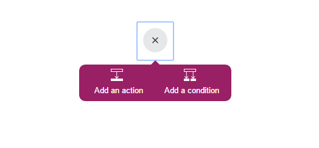
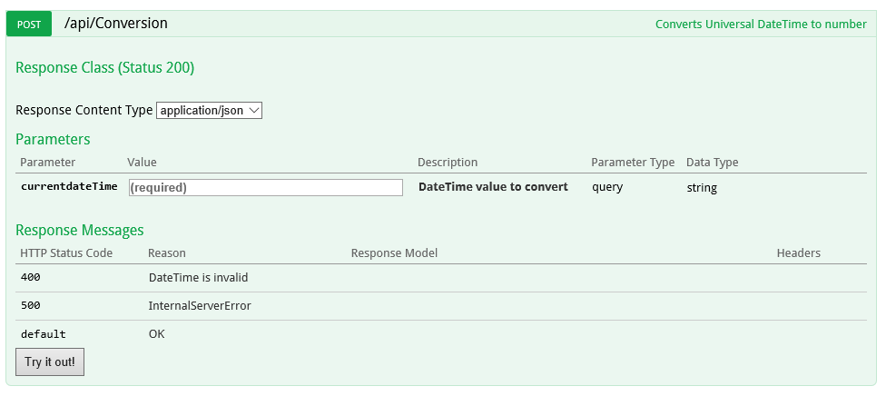
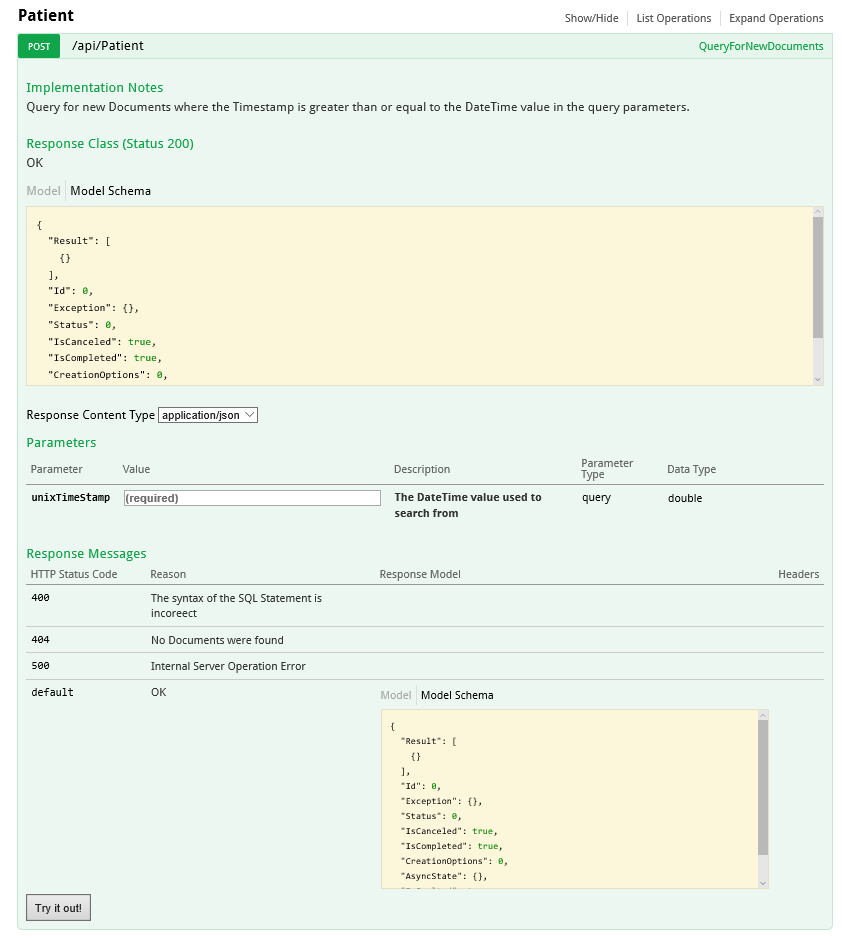

<properties 
    pageTitle="DocumentDB ändern Benachrichtigungen über Logik Apps | Microsoft Azure" 
    description="." 
    keywords="Ändern der Benachrichtigung"
    services="documentdb" 
    authors="hedidin" 
    manager="jhubbard" 
    editor="mimig" 
    documentationCenter=""/>

<tags 
    ms.service="documentdb" 
    ms.workload="data-services" 
    ms.tgt_pltfrm="na" 
    ms.devlang="rest-api" 
    ms.topic="article" 
    ms.date="09/23/2016" 
    ms.author="b-hoedid"/>

# <a name="notifications-for-new-or-changed-documentdb-resources-using-logic-apps"></a>Benachrichtigungen für neue oder geänderte DocumentDB Ressourcen mithilfe von Logik Apps

In diesem Artikel stammt über eine Frage, die ich erhalte einen der DocumentDB Azure-Community-Foren veröffentlicht. Die Frage wurde **DocumentDB bedeutet unterstützen Benachrichtigungen für geänderte Ressourcen**?

Kann ich mit BizTalk Server für viele Jahre gearbeitet haben, und dies ist ein gängiges vorgehen, wenn die [WCF LOB Netzwerkadapter](https://msdn.microsoft.com/library/bb798128.aspx)verwenden. Ich möchte also angezeigt, wenn ich diese Funktionen in DocumentDB für die neuen und/oder geänderten Dokumente doppelte konnte.

Dieser Artikel enthält eine Übersicht über die Komponenten der Lösung Benachrichtigung ändern, wozu auch ein [Trigger](documentdb-programming.md#trigger) und eine [Logik App](../app-service-logic/app-service-logic-what-are-logic-apps.md). Wichtige Codeausschnitte Inline bereitgestellt werden, und die gesamte Lösung auf [GitHub](https://github.com/HEDIDIN/DocDbNotifications)verfügbar ist.

## <a name="use-case"></a>Verwenden Sie Groß-/Kleinschreibung

Die folgende Geschichte ist die Anwendungsfall-für diesen Artikel.

DocumentDB ist das Repository für Dokumente Gesundheit Ebene sieben International (HL7) schnelles Gesundheitswesen Interoperability Ressourcen (FHIR). Angenommen, die DocumentDB-Datenbank mit Ihrer API und Logik App bilden einen HL7 FHIR Server kombiniert.  Eine im Gesundheitswesen Einrichtung ist Patienten Daten in der DocumentDB speichern "An"-Datenbank. Es gibt mehrere Websitesammlungen innerhalb der Patienten Datenbank ein. Klinische, Identifikation, usw. Patienten Informationen fällt unter Kennung.  Sie haben eine Sammlung mit dem Namen "Patienten".

Die Abteilung Kardiologische ist persönliche Health und Übung Daten nachverfolgen. Suchen nach neue oder geänderte Datensätze ist Zeit in Anspruch nehmen. Diese gefragt werden der IT-Abteilung, ob enthielt eine Möglichkeit, dass sie eine Benachrichtigung für neue oder geänderte Datensätze empfangen können.  

Die IT-Abteilung unter dem Gesichtspunkt sind, dass sie diese einfach bieten konnte. Diese als auch bezeichnet, könnten sie die Dokumente zu [Azure BLOB-Speicher](https://azure.microsoft.com/services/storage/) drücken Sie, damit die Abteilung Kardiologische einfach darauf zugreifen kann.

## <a name="how-the-it-department-solved-the-problem"></a>Wie die IT-Abteilung das Problem gelöst

Die IT-Abteilung möchte diese Anwendung zu erstellen, es zunächst modellieren.  Ein Vorteil zur Verwendung von Business Process Model and Notation (BPMN) ist, dass die technische und nicht technische Personen leicht verständlich. Dieses Verfahren für die gesamte Benachrichtigung wird einen Geschäftsprozess angesehen. 

## <a name="high-level-view-of-notification-process"></a>Allgemeine Übersicht über Benachrichtigungsprozess

1. Beginnen Sie mit einer Logik-App, die einen Timer Trigger aufweist. Standardmäßig wird der Trigger stündlich ausgeführt.
2. Als Nächstes führen Sie HTTP POST mit der Logik.
3. Die App Logik führt alle Schritte.


### <a name="lets-take-a-look-at-what-this-logic-app-does"></a>Werfen Sie einen Blick auf die Funktionsweise dieser App Logik
Wenn Sie in der folgenden Abbildung betrachten gibt es verschiedene Schritte im Workflow LogicApp an.


Die Schritte sind wie folgt aus:

1. Sie müssen den aktuellen UTC-DateTime-Wert aus einer API-App zu erhalten.  Der Standardwert ist eine Stunde vorherigen.

2. UTC-DateTime wird in einem Unix-Timestamp-Format konvertiert. Dies ist das Standardformat für Zeitstempel in DocumentDB.

3. Sie den Wert in einer App-API, die eine DocumentDB unterstützt buchen Abfrage. Der Wert wird in einer Abfrage verwendet werden.

    ```SQL
        SELECT * FROM Patients p WHERE (p._ts >= @unixTimeStamp)
    ```

    > [AZURE.NOTE] Die _ts stellt die Zeitstempel Metadaten für alle DocumentDB Ressourcen.

4. Wenn Dokumente gefunden sind, wird der Nachrichtentext der Antwort an Ihre Azure BLOB-Speicher gesendet.

    > [AZURE.NOTE] BLOB-Speicher erfordert ein Konto Azure-Speicher. Sie müssen ein Azure BLOB-Speicherkonto bereitstellen und Hinzufügen eines neuen BLOBs mit dem Namen an. Weitere Informationen finden Sie unter [Informationen zum Azure-Speicherkonten](../storage/storage-create-storage-account.md) und [Erste Schritte mit Azure Blob-Speicher](../storage/storage-dotnet-how-to-use-blobs.md).

5. Schließlich wird eine e-Mail-Nachricht gesendet, dass die benachrichtigt, dass den Empfänger die Anzahl der gefundenen Dokumente. Wenn keine Dokumente gefunden wurden, wäre der e-Mail-Text "0 Dokumente gefunden". 

Werfen wir nun, Sie eine Vorstellung haben davon, was bedeutet, dass der Workflow, wollen, wie Sie implementieren.

### <a name="lets-start-with-the-main-logic-app"></a>Beginnen wir mit dem Hauptfenster Logik-App

Wenn Sie mit Logik Apps nicht vertraut, zur Verfügung, in dem [Azure Marketplace stehen](https://portal.azure.com/), und Sie mehr über diese erfahren [Was Logik Apps werden?](../app-service-logic/app-service-logic-what-are-logic-apps.md)

Wenn Sie eine neue Logik App erstellen, werden Sie aufgefordert **Wie möchten Sie beginnen?**

Wenn Sie in das Textfeld klicken, wird Ihnen eine Auswahl von Ereignissen. Wählen Sie für diese App Logik **Handbuch – Wenn ein HTTP-Anforderung empfangen wird** , wie unten dargestellt.


### <a name="design-view-of-your-completed-logic-app"></a>Entwurfsansicht der fertigen Logik App
Lassen Sie uns springen, und schauen Sie sich für die App Logik, mit dem Namen DocDB der fertigen Entwurfsansicht.


Wenn die Aktionen in der App-Designer Logik zu bearbeiten, müssen Sie die Möglichkeit, **Ausgaben** aus der HTTP-Anforderung oder der vorherigen Aktion auswählen, wie in der nachstehenden SendMail Aktion dargestellt.


Bevor Sie jede Aktion in den Workflow können Sie sich entscheiden; **Hinzufügen einer Aktion** oder **Bedingung hinzufügen** , wie in der folgenden Abbildung gezeigt.



Wenn Sie **Hinzufügen einer Bedingung**auswählen, wird ein Formular angezeigt, wie in der folgenden Abbildung dargestellt, Ihre Logik zum eingeben.  Dies ist im Wesentlichen eine Regel Business.  Wenn Sie innerhalb eines Felds klicken, haben Sie einen Parameter aus der vorherigen Aktion auszuwählen. Sie können die Werte auch direkt eingeben.


> [AZURE.NOTE] Sie haben auch die Möglichkeit, alle Elemente in der Code eingeben.

Werfen Sie einen Blick in der fertigen Logik App in Code anzeigen aus.  

```JSON
   
    "$schema": "https://schema.management.azure.com/providers/Microsoft.Logic/schemas/2015-08-01-preview/workflowdefinition.json#",
    "actions": {
        "Conversion": {
            "conditions": [
                {
                    "dependsOn": "GetUtcDate"
                }
            ],
            "inputs": {
                "method": "post",
                "queries": {
                    "currentdateTime": "@{body('GetUtcDate')}"
                },
                "uri": "https://docdbnotificationapi-debug.azurewebsites.net/api/Conversion"
            },
            "metadata": {
                "apiDefinitionUrl": "https://docdbnotificationapi-debug.azurewebsites.net/swagger/docs/v1",
                "swaggerSource": "custom"
            },
            "type": "Http"
        },
        "Createfile": {
            "conditions": [
                {
                    "expression": "@greater(length(body('GetDocuments')), 0)"
                },
                {
                    "dependsOn": "GetDocuments"
                }
            ],
            "inputs": {
                "body": "@body('GetDocuments')",
                "host": {
                    "api": {
                        "runtimeUrl": "https://logic-apis-westus.azure-apim.net/apim/azureblob"
                    },
                    "connection": {
                        "name": "@parameters('$connections')['azureblob']['connectionId']"
                    }
                },
                "method": "post",
                "path": "/datasets/default/files",
                "queries": {
                    "folderPath": "/patients",
                    "name": "Patient_@{guid()}.json"
                }
            },
            "type": "ApiConnection"
        },
        "GetDocuments": {
            "conditions": [
                {
                    "dependsOn": "Conversion"
                }
            ],
            "inputs": {
                "method": "post",
                "queries": {
                    "unixTimeStamp": "@body('Conversion')"
                },
                "uri": "https://docdbnotificationapi-debug.azurewebsites.net/api/Patient"
            },
            "metadata": {
                "apiDefinitionUrl": "https://docdbnotificationapi-debug.azurewebsites.net/swagger/docs/v1",
                "swaggerSource": "custom"
            },
            "type": "Http"
        },
        "GetUtcDate": {
            "conditions": [],
            "inputs": {
                "method": "get",
                "queries": {
                    "hoursBack": "@{int(triggerBody()['GetUtcDate_HoursBack'])}"
                },
                "uri": "https://docdbnotificationapi-debug.azurewebsites.net/api/Authorization"
            },
            "metadata": {
                "apiDefinitionUrl": "https://docdbnotificationapi-debug.azurewebsites.net/swagger/docs/v1",
                "swaggerSource": "custom"
            },
            "type": "Http"
        },
        "sendMail": {
            "conditions": [
                {
                    "dependsOn": "GetDocuments"
                }
            ],
            "inputs": {
                "body": "api_user=@{triggerBody()['sendgridUsername']}&api_key=@{triggerBody()['sendgridPassword']}&from=@{parameters('fromAddress')}&to=@{triggerBody()['EmailTo']}&subject=@{triggerBody()['Subject']}&text=@{int(length(body('GetDocuments')))} Documents Found",
                "headers": {
                    "Content-type": "application/x-www-form-urlencoded"
                },
                "method": "POST",
                "uri": "https://api.sendgrid.com/api/mail.send.json"
            },
            "type": "Http"
        }
    },
    "contentVersion": "1.0.0.0",
    "outputs": {
        "Results": {
            "type": "String",
            "value": "@{int(length(body('GetDocuments')))} Records Found"
        }
    },
    "parameters": {
        "$connections": {
            "defaultValue": {},
            "type": "Object"
        },
        "fromAddress": {
            "defaultValue": "user@msn.com",
            "type": "String"
        },
        "toAddress": {
            "defaultValue": "XXXXX@XXXXXXX.net",
            "type": "String"
        }
    },
    "triggers": {
        "manual": {
            "inputs": {
                "schema": {
                    "properties": {},
                    "required": [],
                    "type": "object"
                }
            },
            "type": "Manual"
        }
    
```

Wenn Sie nicht vertraut sind, was die anderen Abschnitte in den Code darstellt, können Sie die [Logik App Workflow Definition Language](http://aka.ms/logicappsdocs) Dokumentation anzeigen.

Für diesen Workflow verwenden Sie eine [Http-Webhook auslösen](https://sendgrid.com/blog/whats-webhook/). Wenn Sie die oben angegebenen Code betrachten, sehen Sie Parameter wie im folgenden Beispiel wird.

```C#

    =@{triggerBody()['Subject']}

```

Die `triggerBody()` stellt die Parameter, die in den Nachrichtentext ein REST-Beitrag aus, um die Logik App REST-API enthalten sind. Die `()['Subject']` das Feld darstellt. Alle diese Parameter den JSON zusammensetzt formatiert Textkörper. 

> [AZURE.NOTE] Mithilfe einer Web Häkchen können Sie Vollzugriff auf Kopfzeile und Text, der das Auslösen der Anforderung verfügen. In dieser Anwendung möchten Sie den Text ein.

Wie zuvor schon erwähnt, können Sie den Designer Parameter zuweisen, oder gehen Sie wie folgt in Code anzeigen.
Wenn Sie in der Codeansicht ausführen, definieren Sie die Eigenschaften ein Werts erforderlich ist, wie im folgenden Beispiel gezeigt. 

```JSON

    "triggers": {
        "manual": {
            "inputs": {
            "schema": {
                "properties": {
            "Subject": {
                "type" : "String"   

            }
            },
                "required": [
            "Subject"
                 ],
                "type": "object"
            }
            },
            "type": "Manual"
        }
        }
```

Was Sie tun ist JSON Schema erstellen, die im zurückgegeben wird aus dem Textkörper des BEITRAGS HTTP.
Um Ihre Trigger auszulösen, benötigen Sie die URL einer Rückruf.  Sie lernen, wie Sie es später im Lernprogramm generieren.  

## <a name="actions"></a>Aktionen
Sehen wir uns an, was bedeutet, dass jede Aktion in unseren Logik App.

### <a name="getutcdate"></a>GetUTCDate

**Ansicht-Designer**


**Code anzeigen**

```JSON

    "GetUtcDate": {
            "conditions": [],
            "inputs": {
            "method": "get",
            "queries": {
                "hoursBack": "@{int(triggerBody()['GetUtcDate_HoursBack'])}"
            },
            "uri": "https://docdbnotificationapi-debug.azurewebsites.net/api/Authorization"
            },
            "metadata": {
            "apiDefinitionUrl": "https://docdbnotificationapi-debug.azurewebsites.net/swagger/docs/v1"
            },
            "type": "Http"
        },

```

Diese Aktion HTTP führt eine GET-Operation.  Es ruft API APP GetUtcDate-Methode. Der Uri wird in den Textkörper der Trigger übergebene 'GetUtcDate_HoursBack' Eigenschaft verwendet.  Der Wert 'GetUtcDate_HoursBack' wird in der ersten Logik App festgelegt. Später im Lernprogramm erfahren Sie mehr über die Trigger Logik App.

Diese Aktion ruft Ihre App-API um den Zeichenfolgenwert UTC-Datum zurückzugeben.

#### <a name="operations"></a>Vorgänge

**Anfordern**

```JSON

    {
        "uri": "https://docdbnotificationapi-debug.azurewebsites.net/api/Authorization",
        "method": "get",
        "queries": {
          "hoursBack": "24"
        }
    }

```

**Antwort**

```JSON

    {
        "statusCode": 200,
        "headers": {
          "pragma": "no-cache",
          "cache-Control": "no-cache",
          "date": "Fri, 26 Feb 2016 15:47:33 GMT",
          "server": "Microsoft-IIS/8.0",
          "x-AspNet-Version": "4.0.30319",
          "x-Powered-By": "ASP.NET"
        },
        "body": "Fri, 15 Jan 2016 23:47:33 GMT"
    }

```

Im nächsten Schritt wird den UTC-DateTime-Wert dem Zeitstempel Unix Konvertieren der vom Typ double .NET ist.

### <a name="conversion"></a>Konvertierung

##### <a name="designer-view"></a>Ansicht-Designer


##### <a name="code-view"></a>Code anzeigen

```JSON

    "Conversion": {
        "conditions": [
        {
            "dependsOn": "GetUtcDate"
        }
        ],
        "inputs": {
        "method": "post",
        "queries": {
            "currentDateTime": "@{body('GetUtcDate')}"
        },
        "uri": "https://docdbnotificationapi-debug.azurewebsites.net/api/Conversion"
        },
        "metadata": {
        "apiDefinitionUrl": "https://docdbnotificationapi-debug.azurewebsites.net/swagger/docs/v1"
        },
        "type": "Http"
    },

```

In diesem Schritt übergeben Sie den Wert aus der GetUTCDate zurückgegeben.  Es gibt eine Bedingung DependsOn, was bedeutet, dass die Aktion GetUTCDate erfolgreich abgeschlossen werden muss. Wenn dies nicht der Fall ist, dann wird diese Aktion übersprungen. 

Diese Aktion ruft Ihre API-App, um die Konvertierung zu behandeln.

#### <a name="operations"></a>Vorgänge

##### <a name="request"></a>Anfordern

```JSON

    {
        "uri": "https://docdbnotificationapi-debug.azurewebsites.net/api/Conversion",
        "method": "post",
        "queries": {
        "currentDateTime": "Fri, 15 Jan 2016 23:47:33 GMT"
        }
    }   
```

##### <a name="response"></a>Antwort

```JSON

    {
        "statusCode": 200,
        "headers": {
          "pragma": "no-cache",
          "cache-Control": "no-cache",
          "date": "Fri, 26 Feb 2016 15:47:33 GMT",
          "server": "Microsoft-IIS/8.0",
          "x-AspNet-Version": "4.0.30319",
          "x-Powered-By": "ASP.NET"
        },
        "body": 1452901653
    }
```

In die nächste Aktion kann Sie einen Beitrag Vorgang zu unseren API-App.

### <a name="getdocuments"></a>GetDocuments 

##### <a name="designer-view"></a>Ansicht-Designer


##### <a name="code-view"></a>Code anzeigen

```JSON

    "GetDocuments": {
        "conditions": [
        {
            "dependsOn": "Conversion"
        }
        ],
        "inputs": {
        "method": "post",
        "queries": {
            "unixTimeStamp": "@{body('Conversion')}"
        },
        "uri": "https://docdbnotificationapi-debug.azurewebsites.net/api/Patient"
        },
        "metadata": {
        "apiDefinitionUrl": "https://docdbnotificationapi-debug.azurewebsites.net/swagger/docs/v1"
        },
        "type": "Http"
    },

```

Für die Aktion GetDocuments-überschreiten Sie in den Textkörper der Antwort aus der Konvertierung Aktion zu übergeben. Dies ist ein Parameter in den Uri:

 
```C#

    unixTimeStamp=@{body('Conversion')}

```

Die Aktion QueryDocuments führt eine HTTP POST-Operation zur API-App. 

Die Methode mit dem Namen ist **QueryForNewPatientDocuments**.

#### <a name="operations"></a>Vorgänge

##### <a name="request"></a>Anfordern

```JSON

    {
        "uri": "https://docdbnotificationapi-debug.azurewebsites.net/api/Patient",
        "method": "post",
        "queries": {
        "unixTimeStamp": "1452901653"
        }
    }
```

##### <a name="response"></a>Antwort

```JSON

    {
        "statusCode": 200,
        "headers": {
        "pragma": "no-cache",
        "cache-Control": "no-cache",
        "date": "Fri, 26 Feb 2016 15:47:35 GMT",
        "server": "Microsoft-IIS/8.0",
        "x-AspNet-Version": "4.0.30319",
        "x-Powered-By": "ASP.NET"
        },
        "body": [
        {
            "id": "xcda",
            "_rid": "vCYLAP2k6gAXAAAAAAAAAA==",
            "_self": "dbs/vCYLAA==/colls/vCYLAP2k6gA=/docs/vCYLAP2k6gAXAAAAAAAAAA==/",
            "_ts": 1454874620,
            "_etag": "\"00007d01-0000-0000-0000-56b79ffc0000\"",
            "resourceType": "Patient",
            "text": {
            "status": "generated",
            "div": "<div>\n      \n      <p>Henry Levin the 7th</p>\n    \n    </div>"
            },
            "identifier": [
            {
                "use": "usual",
                "type": {
                "coding": [
                    {
                    "system": "http://hl7.org/fhir/v2/0203",
                    "code": "MR"
                    }
                ]
                },
                "system": "urn:oid:2.16.840.1.113883.19.5",
                "value": "12345"
            }
            ],
            "active": true,
            "name": [
            {
                    "family": [
                        "Levin"
                    ],
                    "given": [
                        "Henry"
                    ]
                }
            ],
            "gender": "male",
            "birthDate": "1932-09-24",
            "managingOrganization": {
                "reference": "Organization/2.16.840.1.113883.19.5",
                "display": "Good Health Clinic"
            }
        },

```

Die nächste Aktion darin, die Dokumente in [Azure-Blog-Speicher](https://azure.microsoft.com/services/storage/)zu speichern. 

> [AZURE.NOTE] BLOB-Speicher erfordert ein Konto Azure-Speicher. Sie müssen ein Azure BLOB-Speicherkonto bereitstellen und Hinzufügen eines neuen BLOBs mit dem Namen an. Weitere Informationen finden Sie unter [Erste Schritte mit Azure Blob-Speicher](../storage/storage-dotnet-how-to-use-blobs.md).

### <a name="create-file"></a>Datei erstellen

##### <a name="designer-view"></a>Ansicht-Designer


##### <a name="code-view"></a>Code anzeigen

```JSON

    {
    "host": {
        "api": {
            "runtimeUrl": "https://logic-apis-westus.azure-apim.net/apim/azureblob"
        },
        "connection": {
            "name": "subscriptions/fxxxxxc079-4e5d-b002-xxxxxxxxxx/resourceGroups/Api-Default-Central-US/providers/Microsoft.Web/connections/azureblob"
        }
    },
    "method": "post",
    "path": "/datasets/default/files",
    "queries": {
        "folderPath": "/patients",
        "name": "Patient_17513174-e61d-4b56-88cb-5cf383db4430.json"
    },
    "body": [
        {
            "id": "xcda",
            "_rid": "vCYLAP2k6gAXAAAAAAAAAA==",
            "_self": "dbs/vCYLAA==/colls/vCYLAP2k6gA=/docs/vCYLAP2k6gAXAAAAAAAAAA==/",
            "_ts": 1454874620,
            "_etag": "\"00007d01-0000-0000-0000-56b79ffc0000\"",
            "resourceType": "Patient",
            "text": {
                "status": "generated",
                "div": "<div>\n      \n      <p>Henry Levin the 7th</p>\n    \n    </div>"
            },
            "identifier": [
                {
                    "use": "usual",
                    "type": {
                        "coding": [
                            {
                                "system": "http://hl7.org/fhir/v2/0203",
                                "code": "MR"
                            }
                        ]
                    },
                    "system": "urn:oid:2.16.840.1.113883.19.5",
                    "value": "12345"
                }
            ],
            "active": true,
            "name": [
                {
                    "family": [
                        "Levin"
                    ],
                    "given": [
                        "Henry"
                    ]
                }
            ],
            "gender": "male",
            "birthDate": "1932-09-24",
            "managingOrganization": {
                "reference": "Organization/2.16.840.1.113883.19.5",
                "display": "Good Health Clinic"
            }
        },

```

Der Code wird von der Aktion im Designer generiert. Sie müssen nicht den Code ändern.

Wenn Sie nicht mit der Azure Blob-API vertraut sind, finden Sie unter [Erste Schritte mit der Azure Blob-Speicher-API](../connectors/connectors-create-api-azureblobstorage.md).

#### <a name="operations"></a>Vorgänge

##### <a name="request"></a>Anfordern

```JSON

    "host": {
        "api": {
            "runtimeUrl": "https://logic-apis-westus.azure-apim.net/apim/azureblob"
        },
        "connection": {
            "name": "subscriptions/fxxxxxc079-4e5d-b002-xxxxxxxxxx/resourceGroups/Api-Default-Central-US/providers/Microsoft.Web/connections/azureblob"
        }
    },
    "method": "post",
    "path": "/datasets/default/files",
    "queries": {
        "folderPath": "/patients",
        "name": "Patient_17513174-e61d-4b56-88cb-5cf383db4430.json"
    },
    "body": [
        {
            "id": "xcda",
            "_rid": "vCYLAP2k6gAXAAAAAAAAAA==",
            "_self": "dbs/vCYLAA==/colls/vCYLAP2k6gA=/docs/vCYLAP2k6gAXAAAAAAAAAA==/",
            "_ts": 1454874620,
            "_etag": "\"00007d01-0000-0000-0000-56b79ffc0000\"",
            "resourceType": "Patient",
            "text": {
                "status": "generated",
                "div": "<div>\n      \n      <p>Henry Levin the 7th</p>\n    \n    </div>"
            },
            "identifier": [
                {
                    "use": "usual",
                    "type": {
                        "coding": [
                            {
                                "system": "http://hl7.org/fhir/v2/0203",
                                "code": "MR"
                            }
                        ]
                    },
                    "system": "urn:oid:2.16.840.1.113883.19.5",
                    "value": "12345"
                }
            ],
            "active": true,
            "name": [
                {
                    "family": [
                        "Levin"
                    ],
                    "given": [
                        "Henry"
                    ]
                }
            ],
            "gender": "male",
            "birthDate": "1932-09-24",
            "managingOrganization": {
                "reference": "Organization/2.16.840.1.113883.19.5",
                "display": "Good Health Clinic"
            }
        },….


```

##### <a name="response"></a>Antwort

```JSON

    {
        "statusCode": 200,
        "headers": {
        "pragma": "no-cache",
        "x-ms-request-id": "2b2f7c57-2623-4d71-8e53-45c26b30ea9d",
        "cache-Control": "no-cache",
        "date": "Fri, 26 Feb 2016 15:47:36 GMT",
        "set-Cookie": "ARRAffinity=29e552cea7db23196f7ffa644003eaaf39bc8eb6dd555511f669d13ab7424faf;Path=/;Domain=127.0.0.1",
        "server": "Microsoft-HTTPAPI/2.0",
        "x-AspNet-Version": "4.0.30319",
        "x-Powered-By": "ASP.NET"
        },
        "body": {
        "Id": "0B0nBzHyMV-_NRGRDcDNMSFAxWFE",
        "Name": "Patient_47a2a0dc-640d-4f01-be38-c74690d085cb.json",
        "DisplayName": "Patient_47a2a0dc-640d-4f01-be38-c74690d085cb.json",
        "Path": "/Patient/Patient_47a2a0dc-640d-4f01-be38-c74690d085cb.json",
        "LastModified": "2016-02-26T15:47:36.215Z",
        "Size": 65647,
        "MediaType": "application/octet-stream",
        "IsFolder": false,
        "ETag": "\"c-g_a-1OtaH-kNQ4WBoXLp3Zv9s/MTQ1NjUwMTY1NjIxNQ\"",
        "FileLocator": "0B0nBzHyMV-_NRGRDcDNMSFAxWFE"
        }
    }
```

Der letzte Schritt darin ist zum Senden einer e-Mail-Benachrichtigung

### <a name="sendemail"></a>sendEmail

##### <a name="designer-view"></a>Ansicht-Designer


##### <a name="code-view"></a>Code anzeigen

```JSON


    "sendMail": {
        "conditions": [
        {
            "dependsOn": "GetDocuments"
        }
        ],
        "inputs": {
        "body": "api_user=@{triggerBody()['sendgridUsername']}&api_key=@{triggerBody()['sendgridPassword']}&from=@{parameters('fromAddress')}&to=@{triggerBody()['EmailTo']}&subject=@{triggerBody()['Subject']}&text=@{int(length(body('GetDocuments')))} Documents Found",
        "headers": {
            "Content-type": "application/x-www-form-urlencoded"
        },
        "method": "POST",
        "uri": "https://api.sendgrid.com/api/mail.send.json"
        },
        "type": "Http"
    }
```

In dieser Aktion senden Sie eine e-Mail-Benachrichtigung an.  Verwenden Sie [SendGrid](https://sendgrid.com/marketing/sendgrid-services?cvosrc=PPC.Bing.sendgrib&cvo_cid=SendGrid%20-%20US%20-%20Brand%20-%20&mc=Paid%20Search&mcd=BingAds&keyword=sendgrib&network=o&matchtype=e&mobile=&content=&search=1&utm_source=bing&utm_medium=cpc&utm_term=%5Bsendgrib%5D&utm_content=%21acq%21v2%2134335083397-8303227637-1649139544&utm_campaign=SendGrid+-+US+-+Brand+-+%28English%29).   

Der Code für diese wurde generiert mithilfe einer Vorlage für Logik App und SendGrid, die im [101-Logik-app-Sendgrid Github Repository](https://github.com/Azure/azure-quickstart-templates/tree/master/101-logic-app-sendgrid)ist.
 
Die HTTP-Operation wurde nach. 

Die Autorisierung Parameter werden in den Triggereigenschaften

```JSON

    },
        "sendgridPassword": {
             "type": "SecureString"
         },
         "sendgridUsername": {
            "type": "String"
         }

        In addition, other parameters are static values set in the Parameters section of the Logic App. These are:
        },
        "toAddress": {
            "defaultValue": "XXXX@XXXX.com",
            "type": "String"
        },
        "fromAddress": {
            "defaultValue": "XXX@msn.com",
            "type": "String"
        },
        "emailBody": {
            "defaultValue": "@{string(concat(int(length(actions('QueryDocuments').outputs.body)) Records Found),'/n', actions('QueryDocuments').outputs.body)}",
            "type": "String"
        },

```

Die EmailBody ist die Anzahl der Dokumente, die aus der Abfrage, die "0" oder zusammen mit mehr sein kann, zurückgegeben "Einträge gefunden" verketten. Der Rest der Parameter werden von den Parametern Trigger festgelegt.

Diese Aktion hängt von der Aktion **GetDocuments** ab.

#### <a name="operations"></a>Vorgänge

##### <a name="request"></a>Anfordern
```JSON

    {
        "uri": "https://api.sendgrid.com/api/mail.send.json",
        "method": "POST",
        "headers": {
        "Content-type": "application/x-www-form-urlencoded"
        },
        "body": "api_user=azureuser@azure.com&api_key=Biz@Talk&from=user@msn.com&to=XXXX@XXXX.com&subject=New Patients&text=37 Documents Found"
    }

```

##### <a name="response"></a>Antwort

```JSON

    {
        "statusCode": 200,
        "headers": {
        "connection": "keep-alive",
        "x-Frame-Options": "DENY,DENY",
        "access-Control-Allow-Origin": "https://sendgrid.com",
        "date": "Fri, 26 Feb 2016 15:47:35 GMT",
        "server": "nginx"
        },
        "body": {
        "message": "success"
        }
    }
```

Und schließlich möchten Sie die Ergebnisse aus der App Logik im Portal Azure verdeckt werden sollen. Um dies zu tun, fügen Sie einen Parameter zum Abschnitt Ausgaben aus.


```JSON

    "outputs": {
        "Results": {
            "type": "String",
            "value": "@{int(length(actions('QueryDocuments').outputs.body))} Records Found"
        }

```

Dies gibt den gleichen Wert, der in der e-Mail-Textkörper gesendet wird. Die folgende Abbildung zeigt ein Beispiel, in dem "gefunden 29 Datensätze".


## <a name="metrics"></a>Kennzahlen
Sie können die Überwachung für die wichtigsten Logik App im Portal konfigurieren. Dadurch können Sie zum Anzeigen der Wartezeit ausführen und andere Ereignisse wie in der folgenden Abbildung gezeigt.


## <a name="docdb-trigger"></a>DocDb Trigger

Diese App Logik ist der Trigger, der auf Ihre Hauptfenster Logik App der Workflow gestartet wird.

Die folgende Abbildung zeigt die Ansicht-Designer.


```JSON

    {
        "$schema": "https://schema.management.azure.com/providers/Microsoft.Logic/schemas/2015-08-01-preview/workflowdefinition.json#",
        "actions": {
        "Http": {
            "conditions": [],
            "inputs": {
            "body": {
                "EmailTo": "XXXXXX@XXXXX.net",
                "GetUtcDate_HoursBack": "24",
                "Subject": "New Patients",
                "sendgridPassword": "********",
                "sendgridUsername": "azureuser@azure.com"
            },
            "method": "POST",
            "uri": "https://prod-01.westus.logic.azure.com:443/workflows/12a1de57e48845bc9ce7a247dfabc887/triggers/manual/run?api-version=2015-08-01-preview&sp=%2Ftriggers%2Fmanual%2Frun&sv=1.0&sig=ObTlihr529ATIuvuG-dhxOgBL4JZjItrvPQ8PV6973c"
            },
            "type": "Http"
        }
        },
        "contentVersion": "1.0.0.0",
        "outputs": {
        "Results": {
            "type": "String",
            "value": "@{body('Http')['status']}"
        }
        },
        "parameters": {},
        "triggers": {
        "recurrence": {
            "recurrence": {
            "frequency": "Hour",
            "interval": 24
            },
            "type": "Recurrence"
        }
        }
    }

```

Der Trigger wird für eine Serie von 24 Stunden festgelegt. Die Aktion ist ein HTTP-POST, die den Rückruf-URL für die wichtigsten Logik App verwendet. Der Text enthält die Parameter, die im Schema JSON angegeben sind. 

#### <a name="operations"></a>Vorgänge

##### <a name="request"></a>Anfordern

```JSON

    {
        "uri": "https://prod-01.westus.logic.azure.com:443/workflows/12a1de57e48845bc9ce7a247dfabc887/triggers/manual/run?api-version=2015-08-01-preview&sp=%2Ftriggers%2Fmanual%2Frun&sv=1.0&sig=ObTlihr529ATIuvuG-dhxOgBL4JZjItrvPQ8PV6973c",
        "method": "POST",
        "body": {
        "EmailTo": "XXXXXX@XXXXX.net",
        "GetUtcDate_HoursBack": "24",
        "Subject": "New Patients",
        "sendgridPassword": "********",
        "sendgridUsername": "azureuser@azure.com"
        }
    }

```

##### <a name="response"></a>Antwort

```JSON

    {
        "statusCode": 202,
        "headers": {
        "pragma": "no-cache",
        "x-ms-ratelimit-remaining-workflow-writes": "7486",
        "x-ms-ratelimit-burst-remaining-workflow-writes": "1248",
        "x-ms-request-id": "westus:2d440a39-8ba5-4a9c-92a6-f959b8d2357f",
        "cache-Control": "no-cache",
        "date": "Thu, 25 Feb 2016 21:01:06 GMT"
        }
    }
```

Jetzt sehen wir uns die API-App.

## <a name="docdbnotificationapi"></a>DocDBNotificationApi

Obwohl es mehrere Vorgänge in der app gibt, möchten Sie nur drei verwenden.

* GetUtcDate
* ConvertToTimeStamp
* QueryForNewPatientDocuments

### <a name="docdbnotificationapi-operations"></a>DocDBNotificationApi Vorgänge
Werfen Sie einen Blick in der Dokumentation Swagger

> [AZURE.NOTE] Damit Sie die Vorgänge extern aufrufen können, müssen Sie eine zulässige Wert Origin CORS hinzufügen "*" (ohne Anführungszeichen) in den Einstellungen der App-API wie in der folgenden Abbildung gezeigt.


#### <a name="getutcdate"></a>GetUtcDate


#### <a name="converttotimestamp"></a>ConvertToTimeStamp



#### <a name="queryfornewpatientdocuments"></a>QueryForNewPatientDocuments



Werfen Sie einen Blick auf den Code hinter diesen Vorgang aus.

#### <a name="getutcdate"></a>GetUtcDate

```C#

    /// <summary>
    /// Gets the current UTC Date value
    /// </summary>
    /// <returns></returns>
    [H ttpGet]
    [Metadata("GetUtcDate", "Gets the current UTC Date value minus the Hours Back")]
    [SwaggerOperation("GetUtcDate")]
    [SwaggerResponse(HttpStatusCode.OK, type: typeof (string))]
    [SwaggerResponse(HttpStatusCode.InternalServerError, "Internal Server Operation Error")]
    public string GetUtcDate(
       [Metadata("Hours Back", "How many hours back from the current Date Time")] int hoursBack)
    {


        return DateTime.UtcNow.AddHours(-hoursBack).ToString("r");
    }
```

Dieser Vorgang gibt einfach die aktuelle UTC-DateTime abzüglich des Werts HoursBack zurück.

#### <a name="converttotimestamp"></a>ConvertToTimeStamp

``` C#

        /// <summary>
        ///     Converts DateTime to double
        /// </summary>
        /// <param name="currentdateTime"></param>
        /// <returns></returns>
        [Metadata("Converts Universal DateTime to number")]
        [SwaggerResponse(HttpStatusCode.OK, null, typeof (double))]
        [SwaggerResponse(HttpStatusCode.BadRequest, "DateTime is invalid")]
        [SwaggerResponse(HttpStatusCode.InternalServerError)]
        [SwaggerOperation(nameof(ConvertToTimestamp))]
        public double ConvertToTimestamp(
            [Metadata("currentdateTime", "DateTime value to convert")] string currentdateTime)
        {
            double result;

            try
            {
                var uncoded = HttpContext.Current.Server.UrlDecode(currentdateTime);

                var newDateTime = DateTime.Parse(uncoded);
                //create Timespan by subtracting the value provided from the Unix Epoch
                var span = newDateTime - new DateTime(1970, 1, 1, 0, 0, 0, 0).ToLocalTime();

                //return the total seconds (which is a UNIX timestamp)
                result = span.TotalSeconds;
            }
            catch (Exception e)
            {
                throw new Exception("unable to convert to Timestamp", e.InnerException);
            }

            return result;
        }

```

Dieser Vorgang konvertiert die Antwort des Vorgangs GetUtcDate in einen doppelten Wert.

#### <a name="queryfornewpatientdocuments"></a>QueryForNewPatientDocuments

```C#

        /// <summary>
        ///     Query for new Patient Documents
        /// </summary>
        /// <param name="unixTimeStamp"></param>
        /// <returns>IList</returns>
        [Metadata("QueryForNewDocuments",
            "Query for new Documents where the Timestamp is greater than or equal to the DateTime value in the query parameters."
            )]
        [SwaggerOperation("QueryForNewDocuments")]
        [SwaggerResponse(HttpStatusCode.OK, type: typeof (Task<IList<Document>>))]
        [SwaggerResponse(HttpStatusCode.BadRequest, "The syntax of the SQL Statement is incorrect")]
        [SwaggerResponse(HttpStatusCode.NotFound, "No Documents were found")]
        [SwaggerResponse(HttpStatusCode.InternalServerError, "Internal Server Operation Error")]
        // ReSharper disable once ConsiderUsingAsyncSuffix
        public IList<Document> QueryForNewPatientDocuments(
            [Metadata("UnixTimeStamp", "The DateTime value used to search from")] double unixTimeStamp)
        {
            var context = new DocumentDbContext();
            var filterQuery = string.Format(InvariantCulture, "SELECT * FROM Patient p WHERE p._ts >=  {0}",
                unixTimeStamp);
            var options = new FeedOptions {MaxItemCount = -1};


            var collectionLink = UriFactory.CreateDocumentCollectionUri(DocumentDbContext.DatabaseId,
                DocumentDbContext.CollectionId);

            var response =
                context.Client.CreateDocumentQuery<Document>(collectionLink, filterQuery, options).AsEnumerable();

            return response.ToList();
    }

```

Dieser Vorgang verwendet die [DocumentDB.NET SDK](documentdb-sdk-dotnet.md) zum Erstellen einer Dokumentabfrage ein. 

```C#
     CreateDocumentQuery<Document>(collectionLink, filterQuery, options).AsEnumerable();
```

Die Antwort des Vorgangs ConvertToTimeStamp (UnixTimeStamp) wird übergeben. Der Vorgang gibt eine Liste der Dokumente, `IList<Document>`.

Zuvor haben wir uns mit der CallbackURL. Um den Workflow in Ihrer Hauptfenster Logik App zu starten, müssen Sie es mithilfe der CallbackURL anrufen.

## <a name="callbackurl"></a>CallbackURL

Zum Deaktivieren beginnen möchten, benötigen Sie Ihre Azure AD-Token.  Sie können diese token erhältlich schwierig sein. Ich für eine einfache Methode gefunden wurde und Jeff Hollan, wer eine Azure Logik App-Programm-Manager ist, empfohlen, die [Armclient](http://blog.davidebbo.com/2015/01/azure-resource-manager-client.html) in PowerShell verwenden.  Sie können ihn nach den Anweisungen zur Verfügung gestellt installieren.

Die Vorgänge, die Sie verwenden möchten sind Anmelde- und Cloud-API aufrufen.
 
Login: Sie verwenden die gleichen Anmeldeinformationen für die Anmeldung bei Azure-Portal an. 

Der Vorgang anrufen Cloud-Api wird, die Ihre CallBackURL generiert.

In PowerShell rufen Sie ihn wie folgt:  

```powershell

    ArmClient.exe post https://management.azure.com/subscriptions/[YOUR SUBSCRIPTION ID/resourcegroups/[YOUR RESOURCE GROUP]/providers/Microsoft.Logic/workflows/[YOUR LOGIC APP NAME/triggers/manual/listcallbackurl?api-version=2015-08-01-preview

```

Das Ergebnis enthalten sollte wie folgt aussehen:

```powershell

    https://prod-02.westus.logic.azure.com:443/workflows/12a1de57e48845bc9ce7a247dfabc887/triggers/manual/run?api-version=2015-08-01-prevaiew&sp=%2Ftriggers%2Fmanual%2Frun&sv=1.0&sig=XXXXXXXXXXXXXXXXXXX

```

Ein Tool wie [Postman](http://www.getpostman.com/) können Sie das um Hauptfenster Logik App zu testen, wie in der folgenden Abbildung gezeigt.


Der folgenden Tabelle sind die Trigger Parameter, die den Textkörper der App Logik Trigger DocDB bilden.

Parameter | Beschreibung 
--- | --- 
GetUtcDate_HoursBack | Verwendet, um die Anzahl der Stunden für den Anfangstermin für die Suche festzulegen.
sendgridUsername | Verwendet, um die Anzahl der Stunden für den Anfangstermin für die Suche festzulegen.
sendgridPassword | Der Benutzername für e-Mails senden Raster
Jemanden zu | Die e-Mail-Adresse, die die e-Mail-Benachrichtigung erhalten sollen
Betreff | Der Betreff für die e-Mail-Nachricht

## <a name="viewing-the-patient-data-in-the-azure-blob-service"></a>Anzeigen der Patienten Daten im Azure Blob-Dienst

Wechseln Sie zu Ihrem Konto Azure-Speicher, und wählen Sie Blobs klicken Sie unter Dienste, wie in der folgenden Abbildung gezeigt.

 

Anzeigen die Patienten BLOB-Dateiinformationen, wie unten dargestellt werden.


## <a name="summary"></a>Zusammenfassung

In dieser Anleitung erfahren haben Sie Folgendes gelernt:

* Es ist möglich, Benachrichtigungen in DocumentDB implementieren.
* Mithilfe von Logik Apps können Sie den Prozess automatisieren.
* Mithilfe von Logik Apps können Sie die Zeit reduzieren, die benötigt wird, um eine Anwendung zu übermitteln.
* Mithilfe von HTTP können Sie einfach eine App-API innerhalb einer Logik App nutzen.
* Sie können einfach ein CallBackURL erstellen, die die HTTP-Zuhörer ersetzt.
* Sie können benutzerdefinierte Workflows problemlos mit Logik Apps-Designer erstellen.

Der Schlüssel ist im Voraus planen und den Workflow modellieren.

## <a name="next-steps"></a>Nächste Schritte
Herunterladen Sie, und verwenden Sie den Logik App-Code auf [Github](https://github.com/HEDIDIN/DocDbNotifications)bereitgestellt. Kann ich von Ihnen eingeladene Person zu erstellen, klicken Sie auf die Anwendung, und senden Sie Änderungen an der Repo. 

Weitere Informationen zum DocumentDB finden Sie auf den [Learning Path](https://azure.microsoft.com/documentation/learning-paths/documentdb/).
