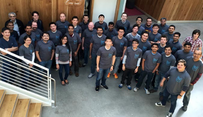

<properties
  pageTitle="DocumentDB Community und News | Microsoft Azure"
  description="Teilnehmen an der Community Azure DocumentDB zum Erstellen von Beziehungen, erweitern Sie Ihre Kenntnisse und präsentieren Sie Ihre Arbeit."
  services="documentdb"
  documentationCenter=""
  authors="aliuy"
  manager="johnmac"
  editor="mimig"/>

<tags
  ms.service="documentdb"
  ms.devlang="na"
  ms.topic="article"
  ms.tgt_pltfrm="na"
  ms.workload="data-services"
  ms.date="09/26/2016"
  ms.author="andrl"/>

# Communityportal

## Community spotlight

Lassen Sie uns hochstufen Sie Ihres Projekts! Anzeigen von großartig Projekts, das Sie mit DocumentDB arbeiten, und wir hilft, der weltweit Ihr Genius freigeben. Um Ihr Projekt zu übermitteln, senden Sie uns eine E-mail an: [askdocdb@microsoft.com](mailto:askdocdb@microsoft.com).

### Documentdb-lumenize

*durch Larry Maccherone*

Aggregationen (Group by, PivotTable und N mehrdimensional Cube) und die Anzeigedauer Reihe Transformationen als gespeicherte Prozeduren in DocumentDB.

Überprüfen Sie sie auf [Github](https://github.com/lmaccherone/documentdb-lumenize) und [Npm](https://www.npmjs.com/package/lumenize).

### DocumentDB Studio

*durch Ming Liu*

Ein Client Management Viewer/Explorer für Microsoft Azure DocumentDB Dienst.

Überprüfen Sie sie auf [Github](https://github.com/mingaliu/DocumentDBStudio).

### DoQmentDB

*durch Arial Mashraki*

DoQmentDB ist Node.js Versprechen-basierten Client, der eine MongoDB-ähnliche Ebene oberhalb der DocumentDB enthält.

Überprüfen Sie sie auf [Github](https://github.com/a8m/doqmentdb) und [Npm](https://www.npmjs.com/package/doqmentdb).

### REST-API für DocumentDB swagger

*durch Howard Edidin*

Eine DocumentDB REST API Swagger Datei, die als eine App API problemlos bereitgestellt werden kann.

Überprüfen Sie sie auf [Github](https://github.com/HEDIDIN/DocumentDB-REST/tree/master/DocumentDBRestApi).

### Fluent-Plug-Ins documentdb

*durch Yoichi Kawasaki*

Fluent-Plug-Ins Documentdb ist ein Plug-in Fluentd zur Ausgabe von Azure DocumentDB.

Überprüfen Sie sie auf [Github](https://github.com/yokawasa/fluent-plugin-documentdb) und [Rubygems](https://rubygems.org/gems/fluent-plugin-documentdb).

*Suchen nach mehr öffnen Quelle DocumentDB Projekte auf [GitHub](https://github.com/search?p=4&q=documentdb&type=Repositories).*

## Nachrichten, Blogs und Artikeln

Sie können über die neuesten DocumentDB Informationen und Features nach folgenden [unserem Blog](https://azure.microsoft.com/blog/tag/documentdb/)bleiben.

**Community Beiträge:**

- [**Mit DocumentDB für soziale Netzwerke vertraut**](https://blogs.msdn.microsoft.com/mvpawardprogram/2016/03/15/going-social-with-documentdb/) - *von Matias Quarantaas*

- [**UWP, Azure App Services und DocumentDB Suppe: eine app Freigabe von Fotos,**](https://blogs.windows.com/buildingapps/2016/03/17/uwp-azure-app-services-and-documentdb-soup-a-photo-sharing-app/) - *von Eric Langland*

- [**Benachrichtigungen für neue oder geänderte DocumentDB Ressourcen mithilfe von Logik Apps**](documentdb-change-notification.md) - *von Howard Edidin*

- [**Erfassung von Protokollen in zu Azure DocumentDB mit fluent-Plug-Ins Documentdb**](http://unofficialism.info/posts/collecting-logs-into-azure-documentdb-using-fluent-plugin-documentdb/) - *durch Yoichi Kawasaki*

- [**DocumentDB Fortsetzung Teil 1/2 – die Theorie**](https://peterintheazuresky.wordpress.com/2016/02/19/documentdb-revisited-part-12-the-theory/) - *von Peter Mannerhult*

- [**Was ist Spitze und Informationen zu den Azure DocumentDB hasse**](http://blog.falafel.com/4-what-to-love-and-hate-about-azures-documentdb/) - *durch Georg Saadeh*

- [**Azure DocumentDB serverseitigen Skripts**](https://www.simple-talk.com/cloud/cloud-data/azure-documentdb-server-side-scripting/) - *von Robert Sheldon*

- [**DocumentDB als Daten für Azure Stream Analytics ignorieren**](http://janatdevelopment.com/2015/12/11/documentdb-as-a-data-sink-for-azure-stream-analytics/?utm_source=twitterfeed&utm_medium=twitter) - *von Jan Hentschel*

- [**Azure DocumentDB Herstellung!** ](http://blog.nexapp.ca/2015/11/30/azure-documentdb-in-production/)  -  *durch Alexandre Walsh und Marc-Olivier Duval*

- [**Azure Suche Indexer – DocumentDB Abfragen (Spanisch)**](http://www.ealsur.com.ar/wp/index.php/2015/11/19/azure-search-indexers-documentdb-queries/) - *durch Matthias Quaranta*

- [**Azure DocumentDB SQL-Abfrage-Grundlagen (Japanisch)**](http://beachside.hatenablog.com/entry/2015/12/06/000045) - *durch Atsushi Yokohama*

- [**Datenpunkte – Aurelia entspricht DocumentDB: Ein Vermittler des Siteindex Reise**](https://msdn.microsoft.com/magazine/mt620011.aspx) - *durch Julie Lerman*

- [**Infrastruktur als Code und kontinuierliche Bereitstellung von einer Node.js + Azure DocumentDB Lösung**](http://www.talmeida.net/blog/2015/10/26/infrastructure-as-code-and-continuous-deployment-of-a-nodejs-azure-documentdb-solution) - *von Thiago Almedia*

- [**Warum DocumentDb gute Business sinnvoll für einige Projekte ist**](http://www.iquestllc.com/blogs/read/405/why-documentdb-makes-good-business-sense-for-some-projects) - *von Samuel Uresin*

- [**Azure DocumentDB Entwicklung verschieben weiterleiten – Entwicklung von der Client-Klasse (1 von 2) (Japanisch)**](http://beachside.hatenablog.com/entry/2015/10/01/202734) - *durch Atsushi Yokohama*

- [**Dinge, die Sie bei Verwendung von Azure DocumentDB (Japanisch) wissen müssen**](http://beachside.hatenablog.com/entry/2015/10/01/202734) - *durch Atsushi Yokohama*

- [**Umgang mit RequestRateTooLarge Fehler in Azure DocumentDB und Testen der Leistung**](http://blogs.msdn.com/b/bigdatasupport/archive/2015/09/02/dealing-with-requestratetoolarge-errors-in-azure-documentdb-and-testing-documentdb-performance.aspx) - *von Azim Uddin*

- [**Datenpunkte – Übersicht über Microsoft Azure DocumentDB**](https://msdn.microsoft.com/magazine/mt147238.aspx) - *durch Julie Lerman*

- [**Verwenden von DocumentDB mit F Nr.**](https://jamessdixon.wordpress.com/2014/12/30/using-documentdb-with-f/) - *von Frau Dixon*

- [**Analyse der Anwendung ' Protokolle ' mit DocumentDB**](http://vincentlauzon.com/2015/09/06/analysing-application-logs-with-documentdb/) - *durch Vincent-Philippe Lauzon*

- [**Azure DocumentDB – bestimmten Zeitpunkt erstellten Sicherungskopien**](http://softwarejuancarlos.com/2015/09/06/azure-documentdb-point-in-time-backups/) - *durch Juan Carlos Sanchez*

*Verfügen Sie über ein Blogbeitrag, Code Stichprobe oder Fallstudie aus, die Sie freigeben möchten? [Teilen Sie uns](mailto:askdocdb@microsoft.com)!*

## Ereignisse und Aufzeichnungen

### Zuletzt verwendete und anstehende Aufgaben und Ereignisse

| Name des Ereignisses                                                                                                                 | Lautsprecher                                                     | Speicherort             | Datum                     | Hashtags |
| -------------------------------------------------------------------------------------------------------------------------- | ----------------------------------------------------------- | -------------------- | ------------------------ | ------- |
| [Zündschnur zu legen 2016](https://myignite.microsoft.com/sessions?q=documentdb)  [Leitgedanke: Aktivieren der digitalen Transformation mithilfe der unangemessene Effektivität von A.C.I.D mit Joseph Sirosh](https://myignite.microsoft.com/sessions/34953)  [Sitzung: Azure DocumentDB bei umfangreichen: Kunden Erfolg und Entwurf Muster mit Syam Kumar Nair und Andrew Liu](https://myignite.microsoft.com/sessions/3066)  [Sitzung: Verwalten von IoT Anlagen mit Node.js und DocumentDB mit Joshua Davis](https://myignite.microsoft.com/sessions/39704)  [Sitzung: Erstellen optimiertes und skalierbare Applikationen mit Microsoft Azure-Datenbank-Services mit Tara Jana und Moshe Gutman](https://myignite.microsoft.com/sessions/2633)| Andrew Liu, Syam Kumar Nair und Tara Jana | Aachen, GA | September 26-30 2016 | [#MSIgnite](https://twitter.com/MS_Ignite) |
| [Meetup am Ignite: DocumentDB: Erweiterte Funktionen für umfangreiche Apps](http://www.meetup.com/Azure-in-the-ATL/events/234252070/) | Andrew Liu, Syam Kumar Nair |  Aachen, GA | 27 September 2016 | [#MSIgnite](https://twitter.com/MS_Ignite)[@FlatironCity](https://twitter.com/FlatironCity) |
| [Schichten + Hadoop Welt](http://conferences.oreilly.com/strata/hadoop-big-data-ny/?cmp=kn-data-confreg-home-stny16_bing_branded) | Kommen Sie, besuchen Sie unseren Booth! | New York, NY | September 26-29 2016 | [#StrataConf](https://twitter.com/strataconf) |
| [Großes Ort .NET Benutzergruppe](http://www.meetup.com/tally-dot-net/events/233768568/) | Santosh Hari | Tallahassee, FL | 3 November 2016 | n/v |

*Sie sprechen am oder Hostinganbieter ein Ereignis? [Lassen Sie uns wissen,](mailto:askdocdb@microsoft.com) wie wir helfen können!*

### Vorherige Ereignisse und aufgezeichneten

| Name des Ereignisses                                                                                                                 | Lautsprecher                                                     | Speicherort             | Datum                   | Aufzeichnung |
| -------------------------------------------------------------------------------------------------------------------------- | ----------------------------------------------------------- | -------------------- | ---------------------- | --------- |
| [DevTeach](http://devteach.com/) | Karl Cenerelli  | Montreal (Kanada) | Juli 4-8 2016 | [NoSQL, kein Problem, Azure DocumentDB verwenden](http://www.slideshare.net/KenCenerelli) |
| [Integration und IoT](http://www.btug.be/events) | Eldert Grootenboer | Kontich, Belgien | 30 Juni 2016 | n/v |
| [MongoDB Welt 2016](https://www.mongodb.com/world16) | Kirill Gavrylyuk | New York, New York | Juni 28-29 2016 | n/v |
| [Integration Benutzergruppe](http://www.integrationusergroup.com/do-logic-apps-support-error-handling/) | Howard S. Edidin | Webcast | 20 Juni 2016 | [Unterstützt gehen Sie wie folgt Logik Apps Fehlerbehandlung?](http://www.integrationusergroup.com/do-logic-apps-support-error-handling/) |
| [Meetup: Großbritannien Azure Benutzergruppe](http://www.meetup.com/UKAzureUserGroup/events/229673468/)| Andrew Liu  | London, Großbritannien | 12 Mai 2016 | n/v
|[Meetup: ONETUG - Orlando .NET Benutzergruppe](http://www.meetup.com/ONETUG/events/230797164/)| Santosh Hari| Orlando, FL| 12 Mai 2016| n/v 
| [SQLBits XV](https://sqlbits.com/)                                                                                         | Andrew Liu, Aravind Ramachandran                            | Frankfurt/Main, Großbritannien        | Mai 4 bis 7, 2016            | n/v| 
| [Meetup: NYC .NET Entwickler Gruppe](http://www.meetup.com/NYC-NET-Developers/events/230396260/)                            | Leonard Lobel                                               | New York City, NY    | 21 April 2016           | n/v |
| [Integration Benutzergruppe](http://www.integrationusergroup.com/#)                                                            | Howard Edidin                                               | Webinar              | 25 April 2016           | n/v |
| [Globale Azure Bootcamp: SoCal](http://xprs.imcreator.com/free/vishalishere/gab2016)                                        | Leonard Lobel                                               | Orange, CA           | 16 April 2016           | n/v |
| [Globale Azure Bootcamp: Redmond](https://www.eventbrite.com/e/2016-global-azure-bootcamp-redmond-wa-tickets-21387752343)   | David Makogon                                               | Redmond, WA          | 16 April 2016           | n/v |
| [SQL-Samstag #481 - Israel 2016](http://www.sqlsaturday.com/481/Sessions/Details.aspx?sid=40912)                          | Leonard Lobel                                               | HaMerkaz, Israel     | 04 April 2016         | n/v |
| [Generator 2016](https://build.microsoft.com/)                                                                                 | Johann Macintyre                                              | San Francisco, CA    | 31 März 2016         | [Applikationen an Skala mit DocumentDB, Azure des Dokuments NoSQL Datenbank Übermittlung](https://channel9.msdn.com/Events/Build/2016/B840)
| [SQL-Samstag #505 - Belgien 2016](http://www.sqlsaturday.com/505/Sessions/Details.aspx?sid=44217)                         | Mihail Mateev                                               | Antwerpen, Belgien     | 19 März 2016         | n/v |
| [Meetup: CloudTalk](http://www.meetup.com/CloudTalk/events/227963695/)                                                     | Kirat Pandya                                                | Detmold Berlin         | 3 März 2016          | n/v |
| [Meetup: Azure AUGSBURG](http://www.meetup.com/azureaustin/events/228209275/)                                                | Merwan Chinta                                               | AUGSBURG, TX           | 28 Januar 2016       | n/v |
| [Meetup: Msdevmtl](http://www.meetup.com/msdevmtl/events/223839818/)                                                       | Vincent-Philippe Lauzon                                     | Montreal, QC, Kanada | 1. Dezember 2015       | n/v |
| [Meetup: SeattleJS](http://www.meetup.com/seattlejs/events/220102664/)                                                     | David Makogon                                               | Frankfurt am Main, WA          | 12 November 2015      | n/v |
| [ÜBERGEBEN Summit 2015](http://www.sqlpass.org/summit/2015/)                                                                    | Jeff Renz, Andrew Hoh, Aravind Ramachandran, Johann Macintyre | Frankfurt am Main, WA          | Oktober 27-30 2015    | [Modernes Applications on Azure Entwickeln](https://www.youtube.com/watch?v=k5Z24HX-RyQ) |
| [CloudDevelop 2015](http://www.clouddevelop.org/)                                                                          | David Makogon, Ryan Crawcour                                | Columbus, OH         | 23 Oktober 2015       | n/v |
| [SQL-Samstag #454 - Turin 2015](http://www.sqlsaturday.com/454/Sessions/Details.aspx?sid=40130)                           | Geschützt De Nittis                                             | Turin, Italien         | 10 Oktober 2015       | n/v |
| [SQL-Samstag #430 - Sofia 2015](http://www.sqlsaturday.com/430/Sessions/Details.aspx?sid=36090)                           | Leonard Lobel                                               | Sofia, Bulgarien      | 10 Oktober 2015       | n/v |
| [SQL-Samstag #444 - Kansas City 2015](http://www.sqlsaturday.com/444/Sessions/Details.aspx?sid=38576)                     | Jeff Renz                                                   | Kansas City, MO      | 3 Oktober 2015        | n/v |
| [SQL-Samstag #429 - Oporto 2015](http://www.sqlsaturday.com/429/Sessions/Details.aspx?sid=36089)                          | Leonard Lobel                                               | Oporto, Portugal     | 3 Oktober 2015        | n/v |
| [AzureCon](https://azure.microsoft.com/azurecon/)                                                                          | David Makogon, Ryan Crawcour, Johann Macintyre                | Virtuelles Ereignis        | 29 September 2015     | [Azure-Daten und Analytics-Plattform](https://channel9.msdn.com/events/Microsoft-Azure/AzureCon-2015/ACON207) [Arbeiten mit NoSQL Daten in DocumentDB](https://channel9.msdn.com/Events/Microsoft-Azure/AzureCon-2015/ACON338) |
| [SQL-Samstag #434 - Niederlande 2015](http://www.sqlsaturday.com/434/Sessions/Details.aspx?sid=36413)                         | Leonard Lobel                                               | UTRECHT, Niederlande | 26 September 2015     | [Einführung in Azure DocumentDB](https://channel9.msdn.com/Blogs/Windows-Azure/SQL-Saturday-Holland-2015-Introduction-to-Azure-DocumentDB) |
| [SQL-Samstag #441 - Denver 2015](http://www.sqlsaturday.com/441/Sessions/Details.aspx?sid=39191)                          | Jeff Renz                                                   | Denver, CO           | 19 September 2015     | n/v |
| [Meetup: San Francisco Laufwerk Bereich Azure Entwickler](http://www.meetup.com/bayazure/events/223943785/)                        | Andrew Liu                                                  | San Francisco, CA    | 15 September 2015     | n/v |
| [Belarus Azure Benutzergruppe besprechen-nach-oben](https://www.facebook.com/events/786540124800276/)                                       | Alex Zyl                                                    | Minsk, Belarus       | 9 September 2015      | [Einführung in DocumentDB Konzept Übersicht, Konsistenz Ebenen, Sharding Strategien](https://www.youtube.com/watch?v=Uc_qwWzJKH8) |
| [NoSQL jetzt!](http://nosql2015.dataversity.net/)                                                                            | David Makogon, Ryan Crawcour                                | SAN JOSÉ         | 18-20 August 2015     | n/v |
| [@ScaleFrankfurt am Main](http://www.atscaleconference.com/)                                                                        | Dharma Shukla                                               | Frankfurt am Main, WA          | 17 Juni 2015          | [Schema unabhängig mit Azure DocumentDB Indizierung](https://www.youtube.com/watch?v=VJQ_5qFFVP4) |
| [Aktualisieren der Tech 2015](https://channel9.msdn.com/Events/DXPortugal/Tech-Refresh-2015)                                         | Bruno Lopes                                                 | Lissabon, Portugal     | 15 Juni 2015          | [DocumentDB 101](https://channel9.msdn.com/Events/DXPortugal/Tech-Refresh-2015/DPDEV01) |
| [SQL-Samstag #417 - Südkorea 2015](http://www.sqlsaturday.com/417/Sessions/Details.aspx?sid=21415)                       | Mihail Mateev                                               | Colombo, Südkorea   | 06 Juni 2015          | n/v |
| [Meetup: Seattle Skalierbarkeit Meetup](http://www.meetup.com/Seattle-Scalability-Meetup/events/204010442/)                    | Dharma Shukla                                               | Frankfurt am Main, WA          | 27 Mai 2015           | n/v |
| [SQL-Samstag #377 - Kiew 2015](http://www.sqlsaturday.com/377/Sessions/Details.aspx?sid=20322)                            | Mihail Mateev                                               | Kiew, Ukraine        | 23 Mai 2015           | n/v |
| [Datenbank Monat](http://www.databasemonth.com/database/azure-documentdb)                                                   | Dharma Shukla                                               | New York, NY         | 19 Mai 2015           | [Azure DocumentDB: Hochgradig skalierbar, mit mehreren Mandanten Dokument-Datenbank-Dienst](https://www.youtube.com/watch?v=iZsqBc3Dkbk) |
| [Meetup: London SQL Server-Benutzergruppe](http://www.meetup.com/London-SQL-Server-User-Group/events/221525058/)               | Allan Michels                                              | London, Großbritannien           | 19 Mai 2015           | n/v |
| [DevIntersection](https://devintersection.com/)                                                                            | Andrew Liu                                                  | Scottsdale, BW       | 18-21 Mai 2015        | n/v |
| [Meetup: Seattle Web App-Entwickler Gruppe](http://www.meetup.com/Seattle-Web-App-Developers-Group/events/220591071/)       | Andrew Liu                                                  | Frankfurt am Main, WA          | 14 Mai 2015           | n/v |
| [Zündschnur zu legen](http://ignite.microsoft.com/)                                                                                     | Andrew Hoh, Johann Macintyre                                  | Chicago, IL          | Mai 4-8 2015          | [Wählen Sie neueste aus DocumentDB video](https://azure.microsoft.com/documentation/videos/microsoft-ignite-2015-select-latest-from-microsoft-azure-documentdb/) [DocumentDB und Azure HDInsight: besser zusammen Video](https://azure.microsoft.com/documentation/videos/microsoft-ignite-2015-microsoft-azure-documentdb-and-azure-hdinsight-better-together/) |
| [Generator 2015](http://www.buildwindows.com/)                                                                                 | Ryan Crawcour                                               | San Francisco, CA    | 29 April - 1. Mai 2015 | [Erstellen Sie als nächste große mit Azure des NoSQL Service: DocumentDB](https://channel9.msdn.com/Events/Build/2015/2-729) |
| [Globale Azure Bootcamp 2015 - Spanien](http://azurebootcamp.es/)                                                             | Luis Ruiz Pavon, Roberto Gonzalez                           | Madrid, Spanien        | 25 April 2015         | [#DEAN DocumentDB + Express + AngularJS + NodeJS auf Windows Azure ausgeführte](https://channel9.msdn.com/events/Developers-Spain-Events/Global-Azure-Bootcamp-2015/DEAN-DocumentDB--Express--AngularJS--NodeJS-running-on-Azure) |
| [Meetup: Azure Usergroup Dänemark](http://www.meetup.com/Azure-Usergroup-Denmark/events/221026670/)                         | Karen Holm Diget                                        | Kopenhagen, Dänemark  | 16 April 2015         | n/v |
| [Meetup: Charlotte Microsoft Cloud](http://www.meetup.com/Charlotte-Microsoft-Cloud/events/221503519/)                     | Frau Rance                                                 | München        | 8 April 2015          | n/v |
| [SQL-Samstag #375 - Silicon Valley 2015](http://www.sqlsaturday.com/375/Sessions/Details.aspx?sid=15289)                  | IKE Ellis                                                   | Mountain View, CA    | 28 März 2015         | n/v |
| [Meetup: Istanbul Azure Meetup](http://www.meetup.com/istanbul-azure-meetup/events/220325538/)                             | Daron Yondem                                                | Istanbul, Türkei     | 7 März 2015          | n/v |
| [Meetup: großen Seen Bereich .net-Benutzergruppe](http://www.meetup.com/Great-Lakes-Area-NET-User-Group-MIGANG/events/220364576/) | Michael Collier                                             | Southfield, MI       | 18 Februar 2015      | n/v |
| [TechX Azure](https://www.youtube.com/channel/UCDRlI2E4z5qmHsBXTrFOE2Q)                                                    | Magnus Mårtensson                                           | Stockholm, Schweden    | Januar 28-29 2015    | [In der neuen NoSQL option für die Cloud Azure DocumentDB](https://www.youtube.com/watch?v=Hw7hDYoChNI) |

### Videos und Podcasts

| Anzeigen                                        | Lautsprecher                     | Datum               | Folge |
| ------------------------------------------- | --------------------------- | ------------------ | ------- |
| Channel 9: Microsoft + Open Source          | Jose Miguel Parrella         | 14 April 2016    | [Vom Mittelwert zu DOMINIK in Azure mit Bitnami, virtueller Computer Maßstab Sätze und DocumentDB](https://channel9.msdn.com/Blogs/Open/From-MEAN-to-DEAN-in-Azure-with-Bitnami-VM-Scale-Sets-and-DocumentDB) |
| Wired2WinWebinar                            | SAI Sankar Kunnathukuzhiyil | 9 März 2016      | [Zur Entwicklung von Lösungen mit Azure DocumentDB](https://www.youtube.com/watch?v=xKttEwXv_bs)
| Integration Benutzergruppe                      | Han Wong                    | 17 Februar 2016  | [Analysieren und Visualisieren von nicht relationaler Daten mit DocumentDB + Power BI](http://www.integrationusergroup.com/analyze-visualize-non-relational-data-documentdb-power-bi/) |
| Die Azure Podcast                           | Teeter skalieren                 | 14 Januar 2016   | [Folge 110: Verwenden von DocumentDB & Suche](http://azpodcast.azurewebsites.net/post/Episode-110-Using-DocumentDB-Search) |
| Channel 9: Modernes Applikationen              | Tara Shankar Jana           | 13 Dezember 2016  | [Optimieren Sie einen modernen Ansatz mit Daten in Ihrer apps](https://channel9.msdn.com/Series/Modern-Applications/Take-a-modern-approach-to-data-in-your-apps) |
| NinjaTips                                   | Miguel Quintero             | 10 Dezember 2015  | [DocumentDB - Un Vistazo Allgemein](https://channel9.msdn.com/Series/Ninja-Tips/31-NinjaTips-Desarrollo-DocumentDB-1-Vistazo-general) |
| Integration Benutzergruppe                      | Howard Edidin               | 9 November 2015   | [Azure DocumentDB für im Gesundheitswesen Integration – Teil 2](http://www.integrationusergroup.com/azure-documentdb-for-healthcare-integration-part-2/) |
| Integration Benutzergruppe                      | Howard Edidin               | 5 Oktober 2015    | [Azure DocumentDB zur Integration im Gesundheitswesen](http://www.integrationusergroup.com/?event=azure-documentdb-and-biztalk) |
| DX Italien - #TecHeroes                       | Alessandro Melchiori        | 2 Oktober 2015    | [#TecHeroes - DocumentDB](https://channel9.msdn.com/Shows/TecHeroes/TecHeroes-DocumentDB) |
| Anzeigen für Microsoft Cloud - Podcast              | Andrew Liu                  | 30 September 2015 | [Folge 099 - Azure DocumentDB mit Andrew Liu](http://www.microsoftcloudshow.com/podcast/Episodes/099-azure-documentdb-with-andrew-liu) |
| .NET Rocks!  -Podcast                      | Ryan Crawcour               | 29 September 2015 | [Daten auf DocumentDB mit Ryan CrawCour](https://www.dotnetrocks.com/?show=1197) |
| Daten filtern                                | Ryan Crawcour               | 28 September 2015 | [Was ist neu bei Azure DocumentDB seit GA](https://channel9.msdn.com/Shows/Data-Exposed/Whats-New-with-Azure-DocumentDB-Since-GA) |
| Die Azure Podcast                           | Teeter skalieren                 | 17 September 2015 | [Folge 94: azpodcast.com Abstände-Architektur](http://azpodcast.azurewebsites.net/post/Episode-94-azpodcastcom-re-architecture) |
| Cloud Deckblatt                                 | Ryan Crawcour               | 4 September 2015  | [Folge 185: DocumentDB Updates mit Ryan CrawCour](https://channel9.msdn.com/Shows/Cloud+Cover/Episode-185-DocDB-Updates-with-Ryan-CrawCour) |
| CodeChat 033                                | Greg Doerr                  | 28 Juli 2015      | [Greg Doerr auf Azure DocumentDB](https://channel9.msdn.com/Shows/codechat/033) |
| NoSql Central                               | King Wilder                 | 25 Mai 2015       | [Golf Tracker - Videoübersicht zum Erstellen einer Webanwendung auf AngularJS, WebApi 2 und DocumentDB.](http://www.nosqlcentral.net/Story/Details/videos/kahanu/1-documentdb-golf-tracker-overview) |
| In-Memory-Technologien PASS virtuelle Kapitel | Stephen Baron               | 25 Mai 2015       | [Hallo DocumentDB](https://www.youtube.com/watch?v=itFXQCd9-dI) |
| Daten filtern                                | Ryan Crawcour               | 8 April 2015      | [Allgemeine Verfügbarkeit DocumentDB und was ist neu!](https://channel9.msdn.com/Shows/Data-Exposed/DocumentDB-General-Availability-and-Whats-New) |
| Daten filtern                                | Andrew Liu                  | 17 März 2015     | [Java SDK für DocumentDB](https://channel9.msdn.com/Shows/Data-Exposed/Java-SDK-for-DocumentDB) |
| #DevHangout                                 | Gustavo Alzate Sandoval     | 11 März 2015     | [DocumentDB, la Basiskalender de Datos NoSql de Microsoft Azure](https://www.youtube.com/watch?v=8Ud3jB8KOBA) |
| Daten Architektur virtuelle Kapitel PASS      | IKE Ellis                   | 25 Februar 2015  | [Einführung in DocumentDB](https://www.youtube.com/watch?v=7BQYdFUkz6s) |

### Online-Kurse

| Learning partner                                                                                                                                                                      | Beschreibung |
| ------------------------------------------------------------------------------------------------------------------------------------------------------------------------------------- | ----------- |
|  | [**Microsoft Virtual Academy**](https://mva.microsoft.com/en-US/training-courses/deploying-web-apps-to-azure-app-service-16629) bietet Ihnen die Schulung von Personen, die Hilfe Azure DocumentDB erstellen. |
|                                                       | [**Pluralsight**](http://www.pluralsight.com/courses/azure-documentdb-introduction) ist ein Key Geschenk Azure Schulung Microsoft-Partner. Wenn Sie MSDN-Abonnent sind, verwenden Sie Microsoft Azure-Schulung Zugriff auf Ihre Vorteile. |
|                                                  | [**OpsGility**](https://www.opsgility.com/courses/player/introduction_to_azure_documentdb) bietet tief greifende technische Schulung auf Microsoft Azure. Abrufen von ILT-Schulung vor Ort oder über ein remote Schulungsraum durch ihre Branche bestätigt Ausbilder. |

## Diskussion

### Twitter

Folgen Sie uns auf Twitter [@DocumentDB](https://twitter.com/DocumentDB) und mit der neuesten Unterhaltung auf das [#DocumentDB](https://twitter.com/hashtag/DocumentDB) hashtags auf dem neuesten Stand zu bleiben.

### Online-Foren

| Forum-Anbieter                                                                                                                  | Beschreibung |
| ------------------------------------------------------------------------------------------------------------------------------- | ----------- |
|  | Eine Sprache unabhängig bearbeitet für Programmierer eng Frage und Antwort-Website an. Führen Sie unseren Kategorie: [Azure-Documentdb](http://stackoverflow.com/questions/tagged/azure-documentdb) |
|                                 | Ein guter für Support und Feedback auf Microsoft Azure-Features und Dienste wie Websites, DocumentDB usw.. |

## Wenden Sie sich an das team

Benötigen Sie technische Unterstützung? Haben Sie Fragen? Sie Fragen sich, ob NoSQL gut für Sie ist? Sie können [Planen einer 1:1-Chat mit dem Entwicklungsteam DocumentDB direkt](http://www.askdocdb.com/)aus. Außerdem können Sie uns eine [E-mail](mailto:askdocdb@microsoft.com) zu schießen oder tweet uns unter [@DocumentDB](https://twitter.com/DocumentDB). 

## Open Source-Projekten

Diese Projekte werden durch das Team Azure DocumentDB in Zusammenarbeit mit unseren open Source-Community aktiv entwickelt.

### SDKs

| Plattform | Github                                                                      | Paket |
| -------- | --------------------------------------------------------------------------- | ------- |
| Node.js  | [Azure-Documentdb-Knoten](https://github.com/Azure/azure-documentdb-node)     | [npm](https://www.npmjs.com/package/documentdb) |
| Java     | [Azure-Documentdb-java](https://github.com/Azure/azure-documentdb-java)     | [Maven](http://search.maven.org/#search%7Cga%7C1%7Ca%3A%22azure-documentdb%22) |
| Python   | [Azure-Documentdb-python](https://github.com/Azure/azure-documentdb-python) | [PyPI](https://pypi.python.org/pypi/pydocumentdb) |

### Andere Projekte

| Namen                | Github                                                                                            | Website |
| ------------------- | ------------------------------------------------------------------------------------------------- | ------- |
| Dokumentation       | [Azure-Inhalt](https://github.com/Azure/azure-content/tree/master/articles/documentdb)           | [Dokumentation-website](https://azure.microsoft.com/documentation/services/documentdb/) |
| Hadoop Verbinder    | [Azure-Documentdb-hadoop](https://github.com/Azure/azure-documentdb-hadoop)                       | [Maven](http://search.maven.org/#search%7Cga%7C1%7Ca%3A%22azure-documentdb-hadoop%22) |
| Migrationstools für Daten | [Azure-Documentdb-datamigrationtool](https://github.com/Azure/azure-documentdb-datamigrationtool) | [Microsoft Downloadcenter](http://www.microsoft.com/en-us/download/details.aspx?id=46436) |

## DocumentDB-Assistenten

DocumentDB-Assistenten sind Community Füllzeichen, wer eine exemplarische Zusicherung für den Schutz gezeigt haben, die andere Personen ihre Erfahrung mit Azure DocumentDB optimal nutzen. Sie freigeben mit der Community und mit dem Team DocumentDB außergewöhnlichen Leidenschaft, praktisches Wissen, und Fachwissen.

Assistenten | Bild 
 --- | --- 
 [Allan Michels](https://twitter.com/allansqlis) |  
 [Jen Stirrup](https://twitter.com/jenstirrup) |             
 [Lenni Lobel](https://twitter.com/lennilobel) |  |          
 [Mihail Mateev](https://twitter.com/mihailmateev) |  |
 [Larry Maccherone](https://twitter.com/lmaccherone) |  
 [Howard Edidin](https://twitter.com/hsedidin) |  
 [Santosh Hari](https://twitter.com/_s_hari) |  

Möchten Sie einen Assistenten DocumentDB machen? Zwar kein Vergleichspunkt für einen Assistenten DocumentDB zunehmend, enthalten einige der Kriterien, die wir Auswerten den Einfluss der eine Kandidaten Beiträge zu online-Foren wie StackOverflow und MSDN; Wikis und online-Inhalten; Konferenzen und die Benutzergruppen; Podcasts, Websites, Blogs und soziale Medien; und Artikel und Bücher. Sie können sich selbst oder an eine andere Person durch [Senden Sie uns eine e-Mail-Nachricht](mailto:askdocdb@microsoft.com)Diskussionsbeiträge.
