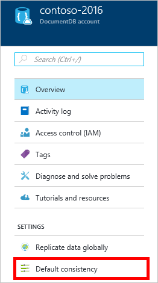

<properties
    pageTitle="So erstellen Sie ein Konto DocumentDB | Microsoft Azure"
    description="Erstellen einer NoSQL-Datenbank mit Azure DocumentDB an. Befolgen Sie diese Anweisungen zum Erstellen eines Kontos DocumentDB und Zuverlässigkeit Ihrer hervorragenden schnelle und globaler Ebene NoSQL-Datenbank." 
    keywords="Erstellen einer Datenbank"
    services="documentdb"
    documentationCenter=""
    authors="mimig1"
    manager="jhubbard"
    editor="monicar"/>

<tags
    ms.service="documentdb"
    ms.workload="data-services"
    ms.tgt_pltfrm="na"
    ms.devlang="na"
    ms.topic="get-started-article"
    ms.date="10/17/2016"
    ms.author="mimig"/>

# So erstellen Sie ein DocumentDB NoSQL-Konto über das Azure-portal

> [AZURE.SELECTOR]
- [Azure-portal](documentdb-create-account.md)
- [Azure CLI und Azure Ressourcenmanager](documentdb-automation-resource-manager-cli.md)

Zum Erstellen einer Datenbank mit Microsoft Azure DocumentDB müssen Sie folgende Aktionen ausführen:

- Haben Sie ein Azure-Konto an. Wenn Sie eine bereits besitzen, können Sie ein [kostenloses Azure-Konto](https://azure.microsoft.com/free) erhalten. 
- Erstellen Sie ein DocumentDB-Konto an.  

Sie können entweder ein DocumentDB-Konto der Azure-Portal, Azure Ressourcenmanager Vorlagen oder Azure line Interface (CLI) erstellen. In diesem Artikel veranschaulicht, wie ein DocumentDB Konto über das Azure-Portal zu erstellen. Zum Erstellen eines Kontos mit Azure Ressourcenmanager oder Azure CLI finden Sie unter [automatisieren DocumentDB Konto Webdatenbanken](documentdb-automation-resource-manager-cli.md).

Sind Sie neu bei DocumentDB? [Dieses](https://azure.microsoft.com/documentation/videos/create-documentdb-on-azure/) Video gibt vier-minütiges durch Scott Hanselman So führen Sie die am häufigsten ausgeführten Aufgaben im Portal angezeigt.

1.  Melden Sie sich mit dem [Azure-Portal](https://portal.azure.com/)aus.
2.  Klicken Sie in der Jumpbar auf **neu**, klicken Sie auf **Datenbanken**, und klicken Sie dann auf **DocumentDB (NoSQL)**. 

      

3. Geben Sie in das **neue Konto** Blade die gewünschte Konfiguration für das DocumentDB-Konto ein.

    

    - Geben Sie im Feld **ID** einen Namen für das Konto DocumentDB ein.  Wenn die **ID** überprüft wird, wird Sie in das Feld **ID** ein grünes Häkchen angezeigt. Der **ID-** Wert wird der Hostname in der URI. Die **ID** enthalten möglicherweise nur Kleinbuchstaben, Zahlen und die ' – ' Zeichen und muss zwischen 3 und 50 Zeichen. Beachten Sie, dass der Endpunktname, den Sie auswählen, die *documents.azure.com* angefügt ist das Ergebnis, von denen Ihre DocumentDB Konto Endpunkt wird.

    - Wählen Sie im Feld **NoSQL-API** programming Modell zu verwenden:
        - **DocumentDB**: das DocumentDB-API über .NET, Java, Node.js, Python und JavaScript- [SDKs](documentdb-sdk-dotnet.md)sowie HTTP ( [REST](https://msdn.microsoft.com/library/azure/dn781481.aspx)) verfügbar ist, und bietet programmgesteuerten Zugriff auf alle DocumentDB-Funktionen. 
       
        - **MongoDB**: DocumentDB bietet auch [auf Protokollstufe Support](documentdb-protocol-mongodb.md) für **MongoDB** APIs. Wenn Sie die Option MongoDB API auswählen, können Sie vorhandene MongoDB SDKs und [Tools](documentdb-mongodb-mongochef.md) verwenden, mit DocumentDB sprechen. Können [Verschieben](documentdb-import-data.md) Ihrer vorhandenen MongoDB apps zum Verwenden von DocumentDB, mit [keine Code Änderungen erforderlich](documentdb-connect-mongodb-account.md), und eine vollständig verwaltete Datenbank als Dienst, mit unbegrenzte Maßstab, globale Replikation und andere Funktionen nutzen.

    - Wählen Sie für **Abonnements**das Azure-Abonnement, das Sie für das Konto DocumentDB verwenden möchten. Wenn Ihr Konto nur ein Abonnement enthält, wird dieses Konto standardmäßig aktiviert.

    - **Ressourcengruppe**aktivieren Sie oder erstellen Sie eine Ressourcengruppe für Ihr Konto DocumentDB.  Standardmäßig wird eine neue Ressourcengruppe erstellt. Weitere Informationen finden Sie unter [Verwenden des Azure-Portals zum Verwalten Ihrer Azure Ressourcen](../articles/azure-portal/resource-group-portal.md).

    - Verwenden Sie **Speicherort** , um die geografische Position in der Ihr Konto DocumentDB hosten anzugeben. 

4.  Sobald die neuen DocumentDB Kontooptionen konfiguriert sind, klicken Sie auf **Erstellen**. Aktivieren Sie zum Überprüfen des Status der Bereitstellung den Hub Benachrichtigungen aus.  

      

    

5.  Nachdem das Konto DocumentDB erstellt wurde, ist es für die Verwendung mit Standardeinstellungen bereit. Die standardmäßige Konsistenz des Kontos DocumentDB wird auf **Sitzung**festgelegt.  Sie können die standardmäßige Konsistenz anpassen, indem Sie auf **Standard Konsistenz** Ressource im Menü. Weitere Informationen zum Konsistenz Ebenen von DocumentDB Angeboten finden Sie unter [Konsistenz Ebenen in DocumentDB](documentdb-consistency-levels.md).

      

      

[How to: Create a DocumentDB account]: #Howto
[Next steps]: #NextSteps
[documentdb-manage]:../articles/documentdb/documentdb-manage.md

## Nächste Schritte

Jetzt, da Sie eine DocumentDB-Konto haben, besteht der nächste Schritt zum Erstellen einer Websitesammlung DocumentDB und der Datenbank. 

Sie können eine neue Websitesammlung und die Datenbank erstellen, mithilfe einer der folgenden Aktionen aus:

- Der Azure-Portal, wie in [einer DocumentDB Websitesammlung mithilfe des Azure-Portals erstellen](documentdb-create-collection.md)beschrieben.
- Die umfassende Lernprogramme, die Beispieldaten enthalten: [.NET](documentdb-get-started.md), [.NET MVC](documentdb-dotnet-application.md), [Java](documentdb-java-application.md), [Node.js](documentdb-nodejs-application.md)oder [Python](documentdb-python-application.md).
- Der [.NET](documentdb-dotnet-samples.md#database-examples), [Node.js](documentdb-nodejs-samples.md#database-examples)oder [Python](documentdb-python-samples.md#database-examples) Stichprobe Code in GitHub verfügbar.
- Die [.NET](documentdb-sdk-dotnet.md), [Node.js](documentdb-sdk-node.md), [Java](documentdb-sdk-java.md), [Python](documentdb-sdk-python.md)und [REST](https://msdn.microsoft.com/library/azure/mt489072.aspx) SDKs.

Nach Ihrer Datenbank und der Websitesammlung erstellt haben, müssen Sie die Sammlungen [Dokumente hinzufügen](documentdb-view-json-document-explorer.md) .

Nachdem Sie Dokumente in einer Websitesammlung verfügen, können Sie zum [Ausführen von Abfragen](documentdb-sql-query.md#executing-queries) [DocumentDB SQL](documentdb-sql-query.md) anhand Ihrer Dokumente verwenden. Sie können Abfragen mit dem [Abfrage-Explorer](documentdb-query-collections-query-explorer.md) in das Portal, die [REST-API](https://msdn.microsoft.com/library/azure/dn781481.aspx)oder eine [SDKs](documentdb-sdk-dotnet.md)ausführen.

### Weitere Informationen

Untersuchen Sie diese Ressourcen, um weitere Informationen zur DocumentDB:

-   [Learning Pfad für DocumentDB](https://azure.microsoft.com/documentation/learning-paths/documentdb/)
-   [DocumentDB hierarchische Ressourcenmodell und Konzepte](documentdb-resources.md)
