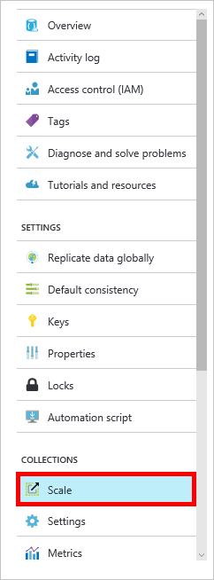

<properties 
    pageTitle="Erstellen einer Datenbank DocumentDB und Auflistung | Microsoft Azure" 
    description="Informationen zum Erstellen von nachgeforscht und JSON-Dokument Websitesammlungen im Portal Onlinedienst für Azure DocumentDB verwenden, eine cloudbasierte Dokument-Datenbank. Erhalten Sie noch heute eine kostenlose Testversion an." 
    services="documentdb" 
    authors="mimig1" 
    manager="jhubbard" 
    editor="monicar" 
    documentationCenter=""/>

<tags 
    ms.service="documentdb" 
    ms.workload="data-services" 
    ms.tgt_pltfrm="na" 
    ms.devlang="na" 
    ms.topic="article" 
    ms.date="10/17/2016" 
    ms.author="mimig"/>

# So erstellen Sie eine Sammlung, DocumentDB und Verwenden des Portals Azure-Datenbank

Wenn Sie Microsoft Azure DocumentDB verwenden zu können, müssen Sie ein [Konto DocumentDB](documentdb-create-account.md), einer Datenbank, eine Websitesammlung und Dokumente verfügen. In diesem Thema beschrieben, wie eine Auflistung DocumentDB Azure-Portal zu erstellen. 

Ist welche eine Websitesammlung? Finden Sie unter [Neuigkeiten eine Auflistung DocumentDB?](#what-is-a-documentdb-collection)

1.  Im [Portal Azure](https://portal.azure.com/)in der Jumpbar klicken Sie auf **DocumentDB (NoSQL)**, und klicken Sie dann in das Blade **DocumentDB (NoSQL)** wählen Sie das Konto aus, in dem eine Websitesammlung hinzugefügt. Wenn Sie alle aufgelisteten Konten besitzen, müssen Sie [ein Konto DocumentDB](documentdb-create-account.md)erstellen.

    
    
    Wenn **DocumentDB (NoSQL)** nicht in der Jumpbar angezeigt wird, klicken Sie auf **Weitere Dienste** , und klicken Sie dann auf **DocumentDB (NoSQL)**. Wenn Sie alle aufgelisteten Konten besitzen, müssen Sie [ein Konto DocumentDB](documentdb-create-account.md)erstellen.

2. Klicken Sie in das **Konto DocumentDB** Blade für das ausgewählte Konto auf **Sammlung hinzufügen**.

    

3. Geben Sie vorher **Sammlung hinzufügen** , in das Feld **ID** die ID für Ihre neue Websitesammlung ein. Websitesammlung Namen muss zwischen 1 und 255 Zeichen lang sein und darf keine enthalten `/ \ # ?` oder ein Leerzeichen. Wenn der Name überprüft wird, wird ein grünes Häkchen in das Feld ID angezeigt.

    

4. Standardmäßig wird **In Preise** auf **Standard** festgelegt, damit Sie für Ihre Websitesammlung Durchsatz und Speicher anpassen können. Weitere Informationen zu den Preisen Ebene finden Sie unter [Leistung Ebenen in DocumentDB](documentdb-performance-levels.md).  

5. Wählen Sie einen **Partitioning Modus** für die Websitesammlung, die entweder **Einzelpartition** oder **Partitioned**aus. 

    Eine **Einzelpartition** weist eine reservierte Speicherkapazität von 10 GB und kann Durchsatz Ebenen von 400-10.000 Anforderung Einheiten haben/Sekunde (RU/s). Eine RU entspricht der Durchsatz für das Lesen eines Dokuments 1KB. Weitere Informationen zu Anforderung Einheiten finden Sie unter [anfordern Einheiten](documentdb-request-units.md). 

    Eine **Auflistung partitionierten** kann skalieren können, um eine unbegrenzte Menge Storage über mehrere Partitionen zu behandeln, und Durchsatz Ebenen 10,100 RU/s ab. Im Portal ist des größten Speichers Ihnen reservierte können 250 GB, und der meisten Durchsatz Ihnen reservierte können beträgt 250.000 RU/s. Zum Erhöhen entweder Kontingent Datei eine Anforderung in [Anforderung größerer DocumentDB Konto Kontingente](documentdb-increase-limits.md)beschriebenen. Weitere Informationen zum partitionierten Websitesammlungen finden Sie unter [Einzelpartition und partitionierten Websitesammlungen](documentdb-partition-data.md#single-partition-and-partitioned-collections).

    Standardmäßig wird der Durchsatz für eine neue Einzelpartition Websitesammlung auf 1000 RU/s mit einer Speicherkapazität von 10 GB festgelegt. Für eine Websitesammlung partitionierten wird der Websitesammlung Durchsatz 10100 RU/s mit einer Speicherkapazität von 250 GB festgelegt. Sie können nach der Erstellung der Auflistung Durchsatz und Speicher für die Websitesammlung ändern. 

6. Wenn Sie eine partitionierte Websitesammlung erstellen, wählen Sie die **Partitionsschlüssel** für die Websitesammlung. Auswählen der richtigen Partitionsschlüssel ist wichtig, beim Erstellen einer leistungsfähigen Auflistung. Weitere Informationen zum Auswählen eines Partitionsschlüssel finden Sie unter [ProfilschlüsselwortFestplatten entwerfen](documentdb-partition-data.md#designing-for-partitioning).

7. In der **Datenbank** Blade eine neue Datenbank erstellen oder ein vorhandenes zu verwenden. Datenbanknamen muss zwischen 1 und 255 Zeichen lang sein und darf keine enthalten `/ \ # ?` oder ein Leerzeichen. Um den Namen zu überprüfen, klicken Sie auf eine Stelle außerhalb des Textfelds. Wenn der Name überprüft wird, wird ein grünes Häkchen im Feld angezeigt.

8. Klicken Sie auf **OK** am unteren Rand des Bildschirms um neue Websitesammlung erstellen. 

9. In der Lens **Websitesammlungen** auf das Blade **Übersicht** wird jetzt die neue Websitesammlung angezeigt.
 
    

10. **Optional:** Klicken Sie zum Ändern des Websitesammlung im Portal Durchsatzes **Skalieren** im Menü Ressource ein. 

    

## Was ist eine Websitesammlung DocumentDB? 

Eine Auflistung ist ein Container für JSON-Dokumente und die Logik der zugehörigen JavaScript. Eine Auflistung ist eine berechenbare Entität, wobei die [Kosten](documentdb-performance-levels.md) durch den bereitgestellte Durchsatz der Sammlung bestimmt. Websitesammlungen können einen oder mehrere Partitionen/Server umfassen und zum Behandeln von praktisch unbegrenzte Datenmengen Speicher oder Durchsatz skalieren können.

Websitesammlungen werden automatisch durch DocumentDB in einem oder mehreren physischen Servern aufgeteilt. Wenn Sie eine Websitesammlung erstellen, können Sie den bereitgestellten Durchsatz in Bezug auf die Anfrage Einheiten pro Sekunde und eine zentrale Partition-Eigenschaft angeben. Der Wert dieser Eigenschaft wird von DocumentDB zum Verteilen von Dokumenten zwischen Partitionen und Weiterleiten von Besprechungsanfragen wie Abfragen verwendet werden. Der wichtigsten Partitionswert fungiert auch als die Begrenzungslinie Transaktion für gespeicherte Prozeduren und Trigger. Jede Websitesammlung hat eine reservierte Durchsatz speziell für die Websitesammlung, die nicht gemeinsam mit anderen Websitesammlungen in demselben Konto verwendet wird. Daher können Sie Ihrer Anwendung in Bezug auf die Speicherung und Durchsatz geeignet. 

Websitesammlungen sind nicht identisch mit Tabellen in relationalen Datenbanken. Websitesammlungen Schema nicht erzwingen, wirklich DocumentDB keine Schemas erzwingen, es ist eine Datenbank Schema frei. Daher können Sie verschiedene Typen von Dokumenten mit unterschiedlichen Schemas in der gleichen Websitesammlung speichern. Sie können auch Websitesammlungen verwenden, um Objekte mit einem einzelnen Typ, wie Sie mit Tabellen zu speichern. Das beste Modell hängt nur wie die Daten zusammen in Abfragen und Transaktionen angezeigt.

## Andere Methoden zum Erstellen einer Sammlung DocumentDB

Websitesammlungen verfügen nicht über das Portal erstellt werden, Sie können auch mit der [DocumentDB SDKs](documentdb-sdk-dotnet.md) und die REST-API erstellen. 

- C#-Codebeispiel finden Sie unter der [C#-Websitesammlung Beispiele](documentdb-dotnet-samples.md#collection-examples). 
- Ein Beispiel Node.js Code finden Sie unter der [Node.js Websitesammlungs-Beispiele](documentdb-nodejs-samples.md#collection-examples).
- Beispiel einer Python Code finden Sie unter [Python Websitesammlung Beispiele](documentdb-python-samples.md#collection-examples).
- Einer Stichprobe die REST-API finden Sie unter [Erstellen einer Websitesammlung](https://msdn.microsoft.com/library/azure/mt489078.aspx).

## Behandlung von Problemen

Wenn die **Sammlung hinzufügen** der Azure-Portal deaktiviert ist, bedeutet, dass, dass Ihr Konto zurzeit deaktiviert ist, die tritt in der Regel, wenn alle Vorteile Gutschriften für den Monat verwendet werden.   

## Nächste Schritte

Nachdem Sie nun eine Auflistung vorhanden ist, besteht der nächste Schritt zum Hinzufügen von Dokumenten oder Importieren von Dokumenten in der Websitesammlung. Wenn es zum Hinzufügen von Dokumenten zu einer Websitesammlung geht, haben Sie einige Optionen aus:

- Sie können [Dokumente hinzufügen](documentdb-view-json-document-explorer.md) , mit dem Dokument-Explorer im Portal.
- Sie können [Dokumente importieren und Daten](documentdb-import-data.md) mithilfe der DocumentDB Daten Migration Tool, womit Sie JSON und CSV-Dateien importieren können als auch Daten aus SQL Server, MongoDB, Azure Table Storage und anderen Websitesammlungen DocumentDB. 
- Oder Sie können Dokumente mithilfe einer der [DocumentDB SDKs](documentdb-sdk-dotnet.md)hinzufügen. DocumentDB weist .NET, Java, Python, Node.js und JavaScript-API SDKs. C#-Codebeispiele zeigt, wie Sie mit dem DocumentDB .NET SDK mit Dokumenten zu arbeiten finden Sie unter der [C#-Dokument Beispiele](documentdb-dotnet-samples.md#document-examples). Zum Arbeiten mit Dokumenten, mit dem DocumentDB Node.js SDK mit Node.js-Codebeispielen finden Sie unter der [Node.js Dokument Beispiele](documentdb-nodejs-samples.md#document-examples).

Nachdem Sie Dokumente in einer Websitesammlung verfügen, können [DocumentDB SQL](documentdb-sql-query.md) auszuführende [Abfragen](documentdb-sql-query.md#executing-queries) anhand von Dokumenten Sie mit dem [Abfrage-Explorer](documentdb-query-collections-query-explorer.md) in das Portal, die [REST-API](https://msdn.microsoft.com/library/azure/dn781481.aspx)oder eine [SDKs](documentdb-sdk-dotnet.md). 
