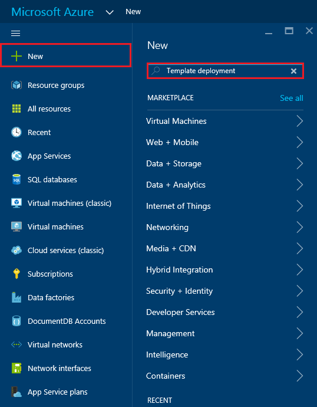

<properties 
    pageTitle="Bereitstellen von DocumentDB und Azure App Dienst Web Apps mit einer Azure Ressourcenmanager Vorlage | Microsoft Azure" 
    description="Erfahren Sie, wie ein Konto DocumentDB, Azure App Dienst Web Apps und einer Stichprobe Webanwendung mithilfe einer Vorlage Ressourcenmanager Azure bereitstellen." 
    services="documentdb, app-service\web" 
    authors="h0n" 
    manager="jhubbard" 
    editor="monicar" 
    documentationCenter=""/>

<tags 
    ms.service="documentdb" 
    ms.workload="data-services" 
    ms.tgt_pltfrm="na" 
    ms.devlang="na" 
    ms.topic="article" 
    ms.date="08/02/2016" 
    ms.author="hawong"/>

# Bereitstellen von DocumentDB und Azure App Dienst Web Apps mit einer Azure Ressourcenmanager Vorlage

In diesem Lernprogramm erfahren Sie, wie Sie mit einer Vorlage Ressourcenmanager Azure bereitstellen und Integration von [Microsoft Azure DocumentDB](https://azure.microsoft.com/services/documentdb/), einer [App-Verwaltungsdienst Azure](http://go.microsoft.com/fwlink/?LinkId=529714) Web app und einer Stichprobe Web-Anwendung.

Verwenden von Azure Ressourcenmanager Vorlagen, können Sie die Bereitstellung und Konfiguration von Azure Ressourcen problemlos automatisieren.  In diesem Lernprogramm erfahren, wie eine Webanwendung bereitstellen und DocumentDB Konto Verbindungsinformationen automatisch konfiguriert.

Am Ende dieses Lernprogramms, werden Sie die folgenden Fragen beantworten:  

-   Wie kann ich mithilfe eine Vorlage Ressourcenmanager Azure bereitstellen und ein DocumentDB-Konto und eine Web app im App-Verwaltungsdienst Azure integrieren?
-   Wie kann ich mithilfe eine Vorlage Ressourcenmanager Azure bereitstellen und ein Konto DocumentDB, eine Web-app in der App-Dienst Web Apps und eine Anwendung Webdeploy integrieren?

## Erforderliche Komponenten
> [AZURE.TIP] Während in diesem Lernprogramm nicht vorherige Erfahrung mit Azure Ressourcenmanager Vorlagen oder JSON davon aus, werden Sie die Vorlagen verwiesen wird oder die Bereitstellungsoptionen ändern möchten, sollten Kenntnisse in jedem der folgenden Bereiche erforderlich.

Bevor Sie den Anweisungen in diesem Lernprogramm folgen, stellen Sie sicher, dass Sie über Folgendes verfügen:

- Ein Azure-Abonnement. Azure ist ein Abonnement-basierten Plattform.  Weitere Informationen dazu, wie Sie ein Abonnement erhalten finden Sie unter [Optionen erwerben](https://azure.microsoft.com/pricing/purchase-options/), [Bietet Mitglied](https://azure.microsoft.com/pricing/member-offers/)oder [Kostenlose Testversion](https://azure.microsoft.com/pricing/free-trial/).

##Schritt 1: Herunterladen der Vorlagendateien ##
Beginnen wir mit Herunterladen der Vorlagendateien, die wir in diesem Lernprogramm verwendet wird.

1. Herunterladen der Vorlage [ein DocumentDB-Konto, Web Apps, erstellen und Bereitstellen eine Demo Anwendung Stichprobe](https://portalcontent.blob.core.windows.net/samples/DocDBWebsiteTodo.json) in einem lokalen Ordner (z. B. C:\DocumentDBTemplates). Mit dieser Vorlage wird ein DocumentDB-Konto, eine App-Dienst Web app und einer Webanwendung bereitstellen.  Es wird auch automatisch die Webanwendung Verbindung mit dem DocumentDB-Konto konfigurieren.

2. Herunterladen der Vorlage [DocumentDB Konto erstellen und Web Apps-Beispiel](https://portalcontent.blob.core.windows.net/samples/DocDBWebSite.json) mit einem lokalen Ordner (z. B. C:\DocumentDBTemplates). Dieser Vorlage wird ein DocumentDB-Konto, eine App-Dienst Web app bereitstellen und ändert die Website Anwendungseinstellungen um problemlos DocumentDB Verbindungsinformationen bereitstellen, aber eine Webanwendung nicht enthält.  

##Schritt 2: Bereitstellen Sie, die DocumentDB Firma, die App-Dienst Web app und Demo Anwendung Stichprobe

Jetzt wir unsere erste Vorlage bereitstellen.

> [AZURE.TIP] Die Vorlage überprüft nicht, dass die Web app und DocumentDB-Kontonamens unten eingegebenen a) gültig und b) verfügbar sind.  Es wird dringend empfohlen, dass Sie die Verfügbarkeit der Namen, den Sie angeben überprüfen, bevor Sie die Bereitstellung senden möchten.

1. Melden Sie sich [Azure-Portal](https://portal.azure.com), klicken Sie auf neu und suchen Sie nach der Bereitstellung"Vorlage".
    

2. Wählen Sie die Vorlage Bereitstellungselement aus, und klicken Sie auf **Erstellen**
    

3.  Klicken Sie auf **Vorlage bearbeiten**, fügen Sie den Inhalt der Vorlagendatei DocDBWebsiteTodo.json, und klicken Sie auf **Speichern**.
    

4. Klicken Sie auf **Parameter bearbeiten**, geben Sie Werte für jeden Parameter obligatorisch, und klicken Sie auf **OK**.  Die Parameter werden wie folgt aus:

    1. SITENAME: Gibt den App-Dienst Web app-Namen und wird verwendet, um die URL zu erstellen, die zum Zugreifen auf des Web app verwendet werden soll (z. B., wenn Sie angeben, dass "Mydemodocdbwebapp", und klicken Sie dann die URL, die Sie, die das Web app zugreifen mydemodocdbwebapp.azurewebsites.net werden).

    2. HOSTINGPLANNAME: Gibt den Namen der Hostinganbieter App Serviceplan zu erstellen.

    3. Standort: Gibt den Azure Speicherort, in dem die DocumentDB und Web app-Ressourcen erstellt.

    4. DATABASEACCOUNTNAME: Gibt den Namen des Kontos DocumentDB zu erstellen.   

    

5. Wählen Sie eine vorhandene Ressourcengruppe oder geben Sie einen Namen, um eine neue Ressourcengruppe zu erstellen, und wählen Sie einen Speicherort für die Ressourcengruppe.
    
  
6.  Klicken Sie auf **Überprüfen Vertragsbedingungen**, **Einkauf**, und klicken Sie dann auf **Erstellen** , um die Bereitstellung zu beginnen.  Wählen Sie **Pin zum Dashboard** aus, damit die resultierende Bereitstellung einfach auf der Azure-Portal Startseite angezeigt wird.
    

7.  Wenn die Bereitstellung abgeschlossen ist, wird das Ressource Gruppe Blade geöffnet.
      

8.  Wenn Sie die Anwendung verwenden möchten, navigieren Sie einfach zu Web app-URL (im obigen Beispiel die URL wäre http://mydemodocdbwebapp.azurewebsites.net).  Sehen Sie die folgenden Webanwendung an:

    

9. Fortfahren Sie und erstellen Sie ein Paar von Vorgängen in der Web-app, und klicken Sie dann auf Ressource Gruppe vorher in der Azure-Portal zurückzukehren. Klicken Sie auf die Ressource DocumentDB Konto in der Liste Ressourcen aus, und klicken Sie dann auf **Abfrage-Explorer**.
      

10. Führen Sie die Standardabfrage, "SELECT *FROM c", und prüfen Sie die Ergebnisse.  Beachten Sie, dass die Abfrage die JSON-Darstellung der Elemente erledigen abgerufen hat, die Sie in Schritt 7 weiter oben erstellt haben.  Fällt mit Abfragen experimentieren; Angenommen, versuchen Sie, wählen Sie* aus C WHERE c.isComplete = WAHR, um alle Aufgaben zurückzukehren, die als abgeschlossen gekennzeichnet wurden.

    

11. Gerne Untersuchen der Portalseite DocumentDB-Benutzeroberfläche oder die Stichprobe erledigen Anwendung ändern.  Wenn Sie bereit sind, stellen wir eine andere Vorlage aus.
    
 
## Schritt 3: Bereitstellen der Stichprobe Dokument-Konto und Web app

Jetzt wir unsere zweite Vorlage bereitstellen.  Diese Vorlage ist sinnvoll, um anzuzeigen, wie Sie Verbindungsinformationen wie Konto Endpunkt und Master Key DocumentDB in einer Web app als Anwendungseinstellungen oder eine benutzerdefinierte Verbindungszeichenfolge einfügen können. Möglicherweise müssen Sie beispielsweise Ihre eigene Webanwendung, die Sie mit einem Konto DocumentDB bereitstellen und die Verbindungsinformationen automatisch während der Bereitstellung ausgefüllt haben möchten.

> [AZURE.TIP] Die Vorlage überprüft nicht, dass die Web app und DocumentDB-Kontonamens unten eingegebenen a) gültig und b) verfügbar sind.  Es wird dringend empfohlen, dass Sie die Verfügbarkeit der Namen, den Sie angeben überprüfen, bevor Sie die Bereitstellung senden möchten.

1. Klicken Sie im [Portal Azure](https://portal.azure.com)auf neu und suchen Sie nach der Bereitstellung"Vorlage".
    

2. Wählen Sie die Vorlage Bereitstellungselement aus, und klicken Sie auf **Erstellen**
    

3.  Klicken Sie auf **Vorlage bearbeiten**, fügen Sie den Inhalt der Vorlagendatei DocDBWebSite.json, und klicken Sie auf **Speichern**.
    

4. Klicken Sie auf **Parameter bearbeiten**, geben Sie Werte für jeden Parameter obligatorisch, und klicken Sie auf **OK**.  Die Parameter werden wie folgt aus:

    1. SITENAME: Gibt den App-Dienst Web app-Namen und wird verwendet, um die URL zu erstellen, die zum Zugreifen auf des Web app verwendet werden soll (z. B., wenn Sie angeben, dass "Mydemodocdbwebapp", und klicken Sie dann die URL, die Sie, die das Web app zugreifen mydemodocdbwebapp.azurewebsites.net werden).

    2. HOSTINGPLANNAME: Gibt den Namen der Hostinganbieter App Serviceplan zu erstellen.

    3. Standort: Gibt den Azure Speicherort, in dem die DocumentDB und Web app-Ressourcen erstellt.

    4. DATABASEACCOUNTNAME: Gibt den Namen des Kontos DocumentDB zu erstellen.   

    

5. Wählen Sie eine vorhandene Ressourcengruppe oder geben Sie einen Namen, um eine neue Ressourcengruppe zu erstellen, und wählen Sie einen Speicherort für die Ressourcengruppe.
    
  
6.  Klicken Sie auf **Überprüfen Vertragsbedingungen**, **Einkauf**, und klicken Sie dann auf **Erstellen** , um die Bereitstellung zu beginnen.  Wählen Sie **Pin zum Dashboard** aus, damit die resultierende Bereitstellung einfach auf der Azure-Portal Startseite angezeigt wird.
    

7.  Wenn die Bereitstellung abgeschlossen ist, wird das Ressource Gruppe Blade geöffnet.
      

8. Klicken Sie auf im Web App-Ressource in der Liste Ressourcen, und klicken Sie dann auf **Anwendungseinstellungen**
      

9. Beachten Sie, wie es Anwendungseinstellungen für den Endpunkt DocumentDB und aller Master-Schlüssel DocumentDB vorhanden sind.
      

10. Gerne weiter zu erforschen der Azure-Portal an, oder führen Sie einen der unsere DocumentDB [Beispiele](http://go.microsoft.com/fwlink/?LinkID=402386) zum Erstellen einer eigenen DocumentDB Anwendung.

    
    

## Nächste Schritte

Herzlichen Glückwunsch! Sie haben DocumentDB, die App-Dienst Web app und einer Stichprobe Webanwendung mit Azure Ressourcenmanager Vorlagen bereitgestellt.

- Weitere Informationen zu DocumentDB zu finden, klicken Sie auf [hier](http://azure.com/docdb).
- Weitere Informationen zum Azure App Dienst Web apps zu finden, klicken Sie auf [hier](http://go.microsoft.com/fwlink/?LinkId=325362).
- Weitere Informationen zum Azure Ressourcenmanager Vorlagen zu finden, klicken Sie auf [hier](https://msdn.microsoft.com/library/azure/dn790549.aspx).

## Was hat sich geändert
* Ein Leitfaden zum Ändern von Websites-App-Dienst finden Sie unter: [Azure-App-Dienst und seinen Einfluss auf die vorhandenen Azure Services](http://go.microsoft.com/fwlink/?LinkId=529714)
* Leitfaden für die Änderung des Portals alten in das neue Portal finden Sie unter: [Verweis für die Navigation in der klassischen Azure-Portal](http://go.microsoft.com/fwlink/?LinkId=529715)

>[AZURE.NOTE] Wenn Sie mit Azure-App-Verwaltungsdienst Schritte vor dem für ein Azure-Konto anmelden möchten, wechseln Sie zu [App-Verwaltungsdienst versuchen](http://go.microsoft.com/fwlink/?LinkId=523751), in dem Sie eine kurzlebige Starter Web app sofort im App-Dienst erstellen können. Keine Kreditkarten erforderlich; keine Zusagen.
 
