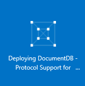
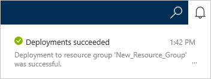

<properties 
    pageTitle="Erstellen Sie ein Konto DocumentDB mit Protokoll Unterstützung für MongoDB | Microsoft Azure" 
    description="Erfahren Sie, wie DocumentDB Erstellen eines Kontos mit MongoDB, Protokoll unterstützt jetzt für eine Vorschau verfügbar." 
    services="documentdb" 
    authors="AndrewHoh" 
    manager="jhubbard" 
    editor="" 
    documentationCenter=""/>

<tags 
    ms.service="documentdb" 
    ms.workload="data-services" 
    ms.tgt_pltfrm="na" 
    ms.devlang="na" 
    ms.topic="article" 
    ms.date="10/20/2016" 
    ms.author="anhoh"/>

# So erstellen Sie ein Konto DocumentDB mit Protokoll Unterstützung für MongoDB über das Azure-portal

Zum Erstellen eines DocumentDB Azure-Kontos mit MongoDB Protokoll unterstützt werden, müssen Sie folgende Aktionen ausführen:

- Haben Sie ein Azure-Konto an. Wenn Sie eine bereits besitzen, können Sie ein [kostenloses Azure-Konto](https://azure.microsoft.com/free/) erhalten.

## Erstellen Sie das Konto  

Führen Sie die folgenden Schritte aus, um ein Konto DocumentDB mit Protokoll Unterstützung für MongoDB erstellen.

1. Melden Sie sich in einem neuen Fenster der [Azure-Portal](https://portal.azure.com)an.
2. Klicken Sie auf **neu**, klicken Sie auf **Daten + Speicher**, klicken Sie auf **Alles anzeigen**, und suchen Sie dann auf die Kategorie **Daten + Speicher** für "DocumentDB Protokoll". Klicken Sie auf **DocumentDB - Protokoll Unterstützung für MongoDB**.

    

3. Alternativ in der Kategorie **Daten + Speicher** unter **Speicher**, klicken Sie auf **Weitere**, und klicken Sie dann auf einmal oder öfter das **Laden mehr** **DocumentDB - Protokoll Unterstützung für MongoDB**angezeigt werden. Klicken Sie auf **DocumentDB - Protokoll Unterstützung für MongoDB**.

    

4. Klicken Sie auf **Erstellen** , um die Vorschau beim Registrieren zu starten, in dem Blade **DocumentDB - Protokoll Unterstützung für MongoDB (Preview)** .

    

5. Klicken Sie auf **anmelden, um eine Vorschau anzuzeigen**, in dem Blade **DocumentDB Konto** . Lesen Sie die Informationen ein, und klicken Sie dann auf **OK**.

    

6.  Nach dem Annehmen der Preview-Ausdrücke, werden Sie an die Blade erstellen zurückgegeben.  Geben Sie in das Blade **DocumentDB Konto** die gewünschte Konfiguration für das Konto ein.

    

    - Geben Sie im Feld **ID** einen Namen für das Konto ein.  Wenn die **ID** überprüft wird, wird Sie in das Feld **ID** ein grünes Häkchen angezeigt. Der **ID-** Wert wird der Hostname in der URI. Die **ID** enthalten möglicherweise nur Kleinbuchstaben, Zahlen und die ' – ' Zeichen und muss zwischen 3 und 50 Zeichen. Beachten Sie, dass der Endpunktname, den Sie auswählen, die *documents.azure.com* angefügt ist das Ergebnis, von denen Ihr Konto Endpunkt verwendet werden soll.

    - Wählen Sie für **Abonnements**das Azure-Abonnement, das Sie für das Konto verwenden möchten. Wenn Ihr Konto nur ein Abonnement enthält, wird dieses Konto standardmäßig aktiviert.

    - **Ressourcengruppe**aktivieren Sie oder erstellen Sie eine Ressourcengruppe für das Konto.  Standardmäßig wird eine vorhandene Ressourcengruppe unter dem Azure Abonnement ausgewählt.  Sie können jedoch wählen, um eine neue Ressourcengruppe erstellen, die Sie das Konto hinzufügen möchten. Weitere Informationen finden Sie unter [Verwenden des Azure-Portals zum Verwalten Ihrer Azure Ressourcen](resource-group-portal.md).

    - Verwenden Sie **Speicherort** , um die geografische Position in der das Konto hosten anzugeben.
    
    - Optional: Kontrollkästchen **Pin zum Dashboard**. Wenn zum Dashboard angehefteten, führen Sie **Schritt 8** unten um Ihr neues Konto linken Navigationsbereich anzuzeigen.

7.  Nachdem Sie die Kontooptionen für neues konfiguriert haben, klicken Sie auf **Erstellen**.  Es kann einige Minuten zum Erstellen des Kontos dauern.  Wenn auf dem Dashboard fixiert ist, können Sie den Fortschritt provisioning, klicken Sie auf die Startboard überwachen.  
      

    Wenn Sie nicht auf dem Dashboard fixiert, können Sie den Fortschritt vom Hub Benachrichtigungen überwachen.  

      

    

8.  Um Ihr neues Konto zugreifen zu können, klicken Sie im linken Menü auf **DocumentDB (NoSQL)** . Klicken Sie in der Liste der regulären DocumentDB und DocumentDB mit Mongo Protokoll Support-Konten auf Namen für Ihr neues Konto.

9.  Es ist nun für die Verwendung mit Standardeinstellungen bereit. 

    
    

## Nächste Schritte

- Erfahren Sie, wie mit einem Konto DocumentDB mit Protokoll [Verbinden](documentdb-connect-mongodb-account.md) Unterstützung für MongoDB.

 
