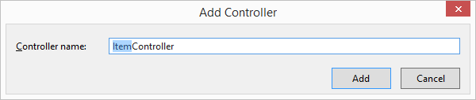
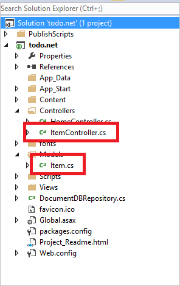
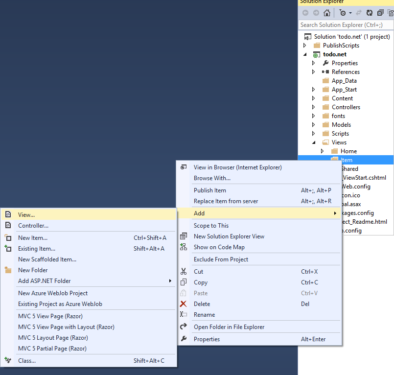
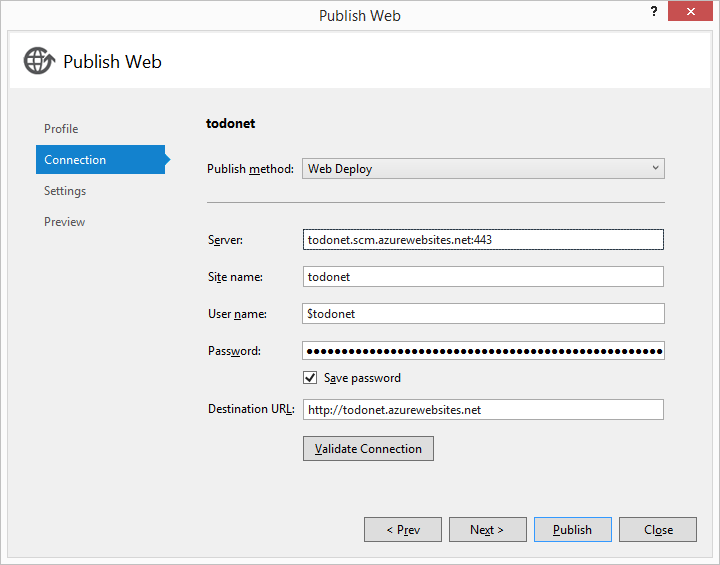

<properties 
    pageTitle="ASP.NET-MVC Lernprogramm für DocumentDB: Web Application Development | Microsoft Azure" 
    description="ASP.NET-MVC Lernprogramm zum Erstellen einer MVC Web-Anwendungs DocumentDB verwenden. Sie speichern JSON und Zugriff auf Daten aus einer erledigen app auf Websites für Azure - ASP Netz MVC Lernprogramm Schritt für Schritt gehostet." 
    keywords="ASP.NET Mvc Lernprogramm, Web Anwendungsentwicklung, Mvc Web-Anwendung, Asp Netto Mvc Lernprogramm Schritt für Schritt"
    services="documentdb" 
    documentationCenter=".net" 
    authors="syamkmsft" 
    manager="jhubbard" 
    editor="cgronlun"/>

<tags 
    ms.service="documentdb" 
    ms.workload="data-services" 
    ms.tgt_pltfrm="na" 
    ms.devlang="dotnet" 
    ms.topic="hero-article" 
    ms.date="08/25/2016" 
    ms.author="syamk"/>

# ASP.NET-MVC Lernprogramm: Web Anwendungsentwicklung mit DocumentDB

> [AZURE.SELECTOR]
- [.NET](documentdb-dotnet-application.md)
- [Node.js](documentdb-nodejs-application.md)
- [Java](documentdb-java-application.md)
- [Python](documentdb-python-application.md) 

Wie können Sie effizient nutzen Azure DocumentDB gespeichert und Abfrage JSON Dokumente dieser Artikel enthält eine umfassende – Exemplarische Vorgehensweise zeigt, wie Sie eine mit Azure DocumentDB erledigen-app erstellen hervorzuheben. Die Aufgaben werden als JSON-Dokumente in Azure DocumentDB gespeichert.

Diese exemplarische Vorgehensweise wird gezeigt, wie mithilfe des DocumentDB von angebotenen Azure Service speichern und Zugriff auf Daten aus einer Web ASP.NET-MVC-Anwendung auf Azure gehostet wird. Wenn Sie ein Lernprogramm, die sich nur auf DocumentDB und nicht die ASP.NET-MVC Komponenten konzentriert gefunden haben, finden Sie unter [erstellen eine DocumentDB c# Console-Anwendung](documentdb-get-started.md).

> [AZURE.TIP] In diesem Lernprogramm wird davon ausgegangen, dass Sie die vorherige Erfahrung mit ASP.NET-MVC und Azure Websites haben. Wenn Sie mit dem ASP.NET oder die [erforderliche Tools](#_Toc395637760)vertraut sind, wird empfohlen, das Projekt abgeschlossen Beispiel herunterladen, [GitHub][] und begonnen, den Anweisungen in diesem Beispiel. Nachdem Sie es erstellt haben, können Sie diesen Artikel, um auf den Code im Kontext des Projekts Einblick überprüfen.

## Voraussetzungen für dieses Lernprogramm Datenbank

Bevor Sie den Anweisungen in diesem Artikel folgen, sollten Sie sicherstellen, dass Sie über Folgendes verfügen:

- Ein aktives Azure-Konto. Wenn Sie kein Konto haben, können Sie ein kostenloses Testversion Konto nur wenigen Minuten erstellen. Weitere Informationen finden Sie unter [Azure kostenlose Testversion](https://azure.microsoft.com/pricing/free-trial/).
- [Visual Studio 2015](http://www.visualstudio.com/) oder Visual Studio 2013 Update 4 oder höher. Wenn Visual Studio 2013 verwenden zu können, müssen Sie das [Nuget-Paket Microsoft.Net.Compilers](https://www.nuget.org/packages/Microsoft.Net.Compilers/) zum Hinzufügen von Unterstützung für c# 6.0 zu installieren. 
- Azure SDK für .NET Version 2.5.1 oder höher, durch das [Microsoft Web Platform Installer][]erhältlich.

Die Screenshots in diesem Artikel wurden getroffen Visual Studio 2013 mit Update 4 angewendet und das Azure SDK für .NET Version 2.5.1 verwenden. Wenn Ihr System mit unterschiedlichen Versionen konfiguriert ist, ist es möglich, Ihre Seiten und-Optionen wird nicht vollständig entsprechen, dass diese Lösung sollte funktionieren, wenn Sie die oben aufgeführten erforderlichen Komponenten entsprechen.

## Schritt 1: Erstellen einer Datenbank DocumentDB-Konto

Erstes Erstellen eines Kontos DocumentDB. Wenn Sie bereits ein Konto haben, können Sie zum [Erstellen einer neuen ASP.NET-MVC-Anwendung](#_Toc395637762)überspringen.

[AZURE.INCLUDE [documentdb-create-dbaccount](../../includes/documentdb-create-dbaccount.md)]

[AZURE.INCLUDE [documentdb-keys](../../includes/documentdb-keys.md)]

 
Wir werden nun zum Erstellen einer neuen ASP.NET-MVC-Anwendung von Grund auf durchzuführen. 

## Schritt 2: Erstellen einer neuen ASP.NET-MVC-Anwendung

Jetzt, da Sie ein Konto besitzen, uns unserer neue ASP.NET-Projekt erstellen.

1. Zeigen Sie in Visual Studio im Menü **Datei** auf **neu**, und klicken Sie dann auf **Projekt**.

    Klicken Sie im Dialogfeld **Neues Projekt** wird angezeigt.
2. Klicken Sie im Bereich **Projekttypen** erweitern Sie **Vorlagen**, **Visual c#**, **Web**, und wählen Sie dann auf **ASP.NET Web-Anwendung**.

    

3. Geben Sie im Feld **Name** den Namen des Projekts aus. In diesem Lernprogramm verwendet den Namen "erledigen". Wenn Sie einen anderen Wert als dies verwenden, Stelle in diesem Lernprogramm über den Namespace erledigen spricht müssen Sie zum Anpassen der bereitgestellten Codebeispielen, um den Inhalt Ihrer Anwendung namens verwenden. 

4. Klicken Sie auf **Durchsuchen** , um zu dem Ordner zu navigieren, wo Sie möchten, erstellen Sie das Projekt, und klicken Sie dann auf **OK**.

    Das Dialogfeld **Neues Projekt von ASP.NET** angezeigt wird.

    

5. Wählen Sie im Bereich Vorlagen **MVC**aus.

6. Wenn Sie beabsichtigen, Hosten der Anwendung in Azure wählen Sie dann **in der Cloud Host** unten rechts, dass die Anwendung hosten Azure. Wir ausgewählt haben, in der Cloud zu hosten, und klicken Sie zum Ausführen der Anwendung in einer Website Azure gehostet wird. Auswahl dieser Option wird eine Azure-Website für Sie preprovision, und nehmen Sie Nutzungsdauer viel einfacher, wenn es Zeit für die endgültige arbeiten Anwendung bereitstellen geht. Wenn Sie diese an anderer Stelle zu hosten möchten oder nicht vorab Azure konfigurieren möchten, deaktivieren Sie dann einfach **in der Cloud Host**.

7. Klicken Sie auf **OK** , und lassen Sie Visual Studio, um die leere Vorlage für ASP.NET-MVC Gerüstbau führe. 

8. Wenn Sie ausgewählt haben, dies in der Cloud zu hosten, sehen Sie mindestens eine weitere Bildschirm Aufforderung zum Anmelden bei Ihrem Azure-Konto, und geben Sie einige Werte für Ihre neue Website. Alle weiteren Werte eingeben und Vorgang fortsetzen. 

    Ich noch nicht "Datenbankserver" hier ausgewählte, da wir eine Azure SQL-Datenbankserver nicht so verwenden, wir werden im Portal Azure höher ein neues DocumentDB Azure-Konto erstellen.

    Weitere Informationen zum Auswählen einer **App-Serviceplan** und die **Ressourcengruppe**finden Sie unter [Azure-App-Verwaltungsdienst Pläne detaillierter Überblick](../app-service/azure-web-sites-web-hosting-plans-in-depth-overview.md).

    

9. Sobald Visual Studio abgeschlossen ist, die häufig verwendeten MVC-Anwendung erstellen, müssen Sie eine leere ASP.NET-Anwendung, die Sie lokal ausführen können.

    Wir werden die Ausführung des Projekts lokal, da ich bin mir sicher wir haben schon einmal die ASP.NET "Hallo Welt" Überspringen Anwendung. Wechseln Sie bei wir direkt zu DocumentDB dieses Projekt hinzufügen und unsere Anwendung erstellen.

## Schritt 3: Hinzufügen von DocumentDB zum Projekt Anwendung MVC web

Nun verfügen wir über die meisten der ASP.NET-MVC Sanitär-, die wir für diese Lösung benötigen, erfahren Sie in den wahren Zweck dieses Lernprogramms, unsere Web-Anwendung MVC Azure DocumentDB hinzu.

1. DocumentDB .NET SDK ist verpackt und als NuGet-Paket verteilt. Verwenden Sie NuGet-Paket in Visual Studio, um die NuGet-Paket-Manager in Visual Studio indem Sie mit der rechten Maustaste auf das Projekt im **Solution Explorer** , und klicken Sie dann auf **NuGet-Pakete verwalten**.

    

    Das Dialogfeld " **NuGet-Pakete verwalten** " angezeigt wird.

2. Geben Sie im Feld NuGet **Durchsuchen** ***Azure DocumentDB***ein.
    
    Installieren Sie aus den Ergebnissen der das Paket **Microsoft Azure DocumentDB Client-Bibliothek** aus. Herunterladen wird und installieren das Paket DocumentDB als auch alle Abhängigkeiten an, wie Newtonsoft.Json. Klicken Sie auf **OK** im **Vorschaufenster** , und **ich stimme** im Fenster **Lizenz Annahme** um die Installation abzuschließen.

    

    Alternativ können Sie das Paket-Manager-Konsole zur Installation des Pakets aus. Klicken Sie dazu im Menü **Extras** auf **NuGet-Paket-Manager**und klicken Sie dann auf **Paket-Manager-Konsole**. Dazu aufgefordert werden Geben Sie Folgendes ein.

        Install-Package Microsoft.Azure.DocumentDB

3. Nachdem das Paket installiert wurde, etwa Ihre Visual Studio-Lösung mit zwei neue Verweise angezeigt werden, Microsoft.Azure.Documents.Client und Newtonsoft.Json Folgendes:

    

##Schritt 4: Einrichten der ASP.NET-MVC-Anwendung
 
Jetzt fügen Sie der Modelle, Ansichten und Controller zu diesem MVC-Anwendung:

- [Hinzufügen eines Modells](#_Toc395637764).
- [Hinzufügen einer Controller](#_Toc395637765).
- [Hinzufügen von Ansichten](#_Toc395637766).

### Hinzufügen eines JSON-Datenmodells

Beginnen wir mit der **M** in das Modell MVC erstellen. 

1. Im- **Lösung-Explorer**mit der rechten Maustaste in des Ordner " **Modelle** ", klicken Sie auf **Hinzufügen**und dann auf **Klasse**.

    Das Dialogfeld **Neues Element hinzufügen** wird angezeigt.

2. Benennen Sie Ihre neue Klassen **Item.cs** , und klicken Sie auf **Hinzufügen**. 

3. Fügen Sie in diese neue **Item.cs** -Datei Folgendes nach den letzten *using-Anweisung*hinzu.
        
        using Newtonsoft.Json;
    
4. Ersetzen Sie jetzt diesen code 
        
        public class Item
        {
        }

    mit den folgenden Code ein.

        public class Item
        {
            [JsonProperty(PropertyName = "id")]
            public string Id { get; set; }
             
            [JsonProperty(PropertyName = "name")]
            public string Name { get; set; }

            [JsonProperty(PropertyName = "description")]
            public string Description { get; set; }

            [JsonProperty(PropertyName = "isComplete")]
            public bool Completed { get; set; }
        }

    Alle Daten im DocumentDB wird die übertragene und JSON gespeichert. Steuern, wie sind Ihre Objekte an, indem Sie das Attribut **JsonProperty** verwenden können, wie in der Klasse **Element** veranschaulicht gerade erstellten JSON.NET serialisiert/deserialisiert. Sie nicht **haben** , führen Sie diese aber ich möchte sicherstellen, dass meine Eigenschaften die JSON-Benennungskonventionen der camelCase ändern möchten. 
    
    Nicht nur können Sie steuern des Formats der Eigenschaftenname, wenn es in JSON geht, aber Sie Ihre Eigenschaften .NET vollständig umbenennen können, wie ich mit der **Beschreibung** -Eigenschaft hat. 
    

### Fügen Sie einen controller

Die sorgt dafür, dass die **M**, jetzt wir die **C** in MVC eine Controller-Klasse erstellen.

1. Im **Explorer Lösung**mit der rechten Maustaste in des Ordners **Controller** , klicken Sie auf **Hinzufügen**, und klicken Sie dann auf **Controller**.

    Klicken Sie im Dialogfeld **Scaffold hinzufügen** wird angezeigt.

2. Wählen Sie **MVC 5 Controller - leeren** aus, und klicken Sie dann auf **Hinzufügen**.

    

3. Benennen Sie Ihre neuen Controller, **ItemController.**

    

    Nachdem die Datei erstellt wurde, sollte die Visual Studio-Lösung mit der neuen ItemController.cs-Datei im **Explorer Lösung**wie folgt aussehen. Die neue Item.cs-Datei, die zuvor erstellten wird auch angezeigt.

    

    Sie können ItemController.cs schließen, wir werden später wieder darauf. 

### Hinzufügen von Ansichten

Jetzt, lassen Sie uns die **V** in MVC Ansichten erstellen:

- [Hinzufügen eines Elementindex anzeigen](#AddItemIndexView).
- [Hinzufügen einer neuen Elementansicht](#AddNewIndexView).
- [Hinzufügen einer Ansicht Element bearbeiten](#_Toc395888515).

#### Hinzufügen einer Elementindex-Ansicht

1. Im **Explorer Lösung**erweitern Sie den Ordner **Ansichten** , mit der rechten Maustaste in des leeren **Element** -Ordners, den Visual Studio für Sie erstellt, wenn Sie die **ItemController** zuvor hinzugefügt, klicken Sie auf **Hinzufügen**, und klicken Sie dann auf **Ansicht**.

    

2. Klicken Sie im Dialogfeld **Ansicht hinzufügen** folgendermaßen Sie vor:
    - Geben Sie im Feld **Ansichtsname** ***Index***ein.
    - Wählen Sie im Feld **Vorlage** ***aus***.
    - Wählen Sie im Feld **Modell Class** ***Element (erledigen. Modelle)***.
    - Lassen Sie das Feld **Daten Kontextklasse** leer. 
    - Geben Sie im Feld Seitenlayout ***~/Views/Shared/_Layout.cshtml***ein.
    
    

3. Nachdem Sie alle folgenden Werte festgelegt sind, klicken Sie auf **Hinzufügen** , und weisen Sie Visual Studio Erstellen einer neuen Vorlagenansicht. Sobald sie fertig ist, wird es die Cshtml-Datei öffnen, die erstellt wurde. Wir können die Datei in Visual Studio schließen, wie wir zu es später zurückkehren, werden.

#### Hinzufügen einer neuen Elementansicht

Ähnlich wie wir eine Ansicht **Elementindex** erstellt haben, werden wir nun eine neue Ansicht zum Erstellen neuer **Elemente**erstellen.

1. Im- **Lösung Explorer**mit der rechten Maustaste erneut auf **des Ordners** , klicken Sie auf **Hinzufügen**, und klicken Sie dann auf **Ansicht**.

2. Klicken Sie im Dialogfeld **Ansicht hinzufügen** folgendermaßen Sie vor:
    - Geben Sie im Feld **Ansichtsname** ***Erstellen***aus.
    - Wählen Sie im Feld **Vorlage** ***Erstellen***.
    - Wählen Sie im Feld **Modell Class** ***Element (erledigen. Modelle)***.
    - Lassen Sie das Feld **Daten Kontextklasse** leer.
    - Geben Sie im Feld Seitenlayout ***~/Views/Shared/_Layout.cshtml***ein.
    - Klicken Sie auf **Hinzufügen**.

#### Hinzufügen einer Ansicht Element bearbeiten

Und schließlich fügen Sie eine letzte Ansicht zum Bearbeiten eines **Elements** in die gleiche Weise wie vor.

1. Im- **Lösung Explorer**mit der rechten Maustaste erneut auf **des Ordners** , klicken Sie auf **Hinzufügen**, und klicken Sie dann auf **Ansicht**.

2. Klicken Sie im Dialogfeld **Ansicht hinzufügen** folgendermaßen Sie vor:
    - Geben Sie im Feld **Ansichtsname** ***Bearbeiten***.
    - Wählen Sie im Feld **Vorlage** ***Bearbeiten***aus.
    - Wählen Sie im Feld **Modell Class** ***Element (erledigen. Modelle)***.
    - Lassen Sie das Feld **Daten Kontextklasse** leer. 
    - Geben Sie im Feld Seitenlayout ***~/Views/Shared/_Layout.cshtml***ein.
    - Klicken Sie auf **Hinzufügen**.

Sobald dies der Fall, schließen Sie alle Cshtml Dokumente in Visual Studio, wie wir diese Ansichten später zurückgeben.

## Schritt 5: Verknüpfung DocumentDB

Jetzt, da der standard MVC von Inhalten erledigt wird, lassen Sie uns zum Hinzufügen des Codes für DocumentDB aktivieren. 

In diesem Abschnitt fügen wir Code zur Behandlung von Folgendes:

- [Auflisten von unvollständig Elemente](#_Toc395637770).
- [Hinzufügen von Elementen](#_Toc395637771).
- [Bearbeiten von Elementen](#_Toc395637772).

### Auflisten von unvollständig Elementen in der MVC Web-Anwendung

Erstes, hier ist eine Klasse hinzufügen, die gesamte Logik zum Herstellen einer Verbindung mit und Verwenden von DocumentDB enthält. In diesem Lernprogramm werden wir alle diese Logik in ein Repository Klasse mit dem Namen DocumentDBRepository schließen. 

1. Im- **Lösung-Explorer**mit der rechten Maustaste auf das Projekt, klicken Sie auf **Hinzufügen**und dann auf **Klasse**. Nennen Sie die neue Klasse **DocumentDBRepository** , und klicken Sie auf **Hinzufügen**.
 
2. In der neu erstellten **DocumentDBRepository** Klasse, und fügen Sie den folgenden *Anweisungen verwenden* oberhalb der *Namespace* -Deklaration
        
        using Microsoft.Azure.Documents; 
        using Microsoft.Azure.Documents.Client; 
        using Microsoft.Azure.Documents.Linq; 
        using System.Configuration;
        using System.Linq.Expressions;
        using System.Threading.Tasks;

    Ersetzen Sie jetzt diesen code 

        public class DocumentDBRepository
        {
        }

    mit den folgenden Code ein.

        public static class DocumentDBRepository<T> where T : class
        {
            private static readonly string DatabaseId = ConfigurationManager.AppSettings["database"];
            private static readonly string CollectionId = ConfigurationManager.AppSettings["collection"];
            private static DocumentClient client;
    
            public static void Initialize()
            {
                client = new DocumentClient(new Uri(ConfigurationManager.AppSettings["endpoint"]), ConfigurationManager.AppSettings["authKey"]);
                CreateDatabaseIfNotExistsAsync().Wait();
                CreateCollectionIfNotExistsAsync().Wait();
            }
    
            private static async Task CreateDatabaseIfNotExistsAsync()
            {
                try
                {
                    await client.ReadDatabaseAsync(UriFactory.CreateDatabaseUri(DatabaseId));
                }
                catch (DocumentClientException e)
                {
                    if (e.StatusCode == System.Net.HttpStatusCode.NotFound)
                    {
                        await client.CreateDatabaseAsync(new Database { Id = DatabaseId });
                    }
                    else
                    {
                        throw;
                    }
                }
            }
    
            private static async Task CreateCollectionIfNotExistsAsync()
            {
                try
                {
                    await client.ReadDocumentCollectionAsync(UriFactory.CreateDocumentCollectionUri(DatabaseId, CollectionId));
                }
                catch (DocumentClientException e)
                {
                    if (e.StatusCode == System.Net.HttpStatusCode.NotFound)
                    {
                        await client.CreateDocumentCollectionAsync(
                            UriFactory.CreateDatabaseUri(DatabaseId),
                            new DocumentCollection { Id = CollectionId },
                            new RequestOptions { OfferThroughput = 1000 });
                    }
                    else
                    {
                        throw;
                    }
                }
            }
        }

    > [AZURE.TIP] Beim Erstellen eines neuen DocumentCollection können Sie einen optionalen RequestOptions-Parameter der OfferType, bereitstellen, die Sie die Leistungsstufe der neuen Sammlung angeben können. Wenn dieser Parameter nicht übergeben wird wird der Angebot Standardtyp verwendet werden. Weitere Informationen zum DocumentDB Angebotstypen bitte [DocumentDB Leistung Ebenen](documentdb-performance-levels.md) finden Sie unter

3. Wir sind einige Werte aus der Konfiguration, also öffnen Sie die Datei **Web.config** der Anwendung, und fügen Sie die folgenden Zeilen unter Lesen der `<AppSettings>` Abschnitt.
    
        <add key="endpoint" value="enter the URI from the Keys blade of the Azure Portal"/>
        <add key="authKey" value="enter the PRIMARY KEY, or the SECONDARY KEY, from the Keys blade of the Azure  Portal"/>
        <add key="database" value="ToDoList"/>
        <add key="collection" value="Items"/>
    
4. Jetzt, aktualisieren Sie die Werte für *den Endpunkt* und *AuthKey* mithilfe von Tasten Falz Azure-Portal an. Verwenden Sie den **URI** aus dem Blade Tasten als Wert der Einstellung Endpunkt, und verwenden Sie den **PRIMÄRSCHLÜSSEL**, oder **SEKUNDÄRSCHLÜSSEL** aus dem Schlüssel Blade als Wert der Einstellung AuthKey.

    Die hat Vorsicht der Kabel das Repository DocumentDB jetzt wir unsere Anwendungslogik hinzufügen.

5. Erstes werden sollen, gehen Sie wie folgt mit einer Liste-Anwendung erledigen gewünschten besteht darin, die unvollständig Elemente angezeigt werden.  Kopieren Sie und fügen Sie den folgenden Codeausschnitt an einer beliebigen Stelle in der Klasse **DocumentDBRepository ein** .

        public static async Task<IEnumerable<T>> GetItemsAsync(Expression<Func<T, bool>> predicate)
        {
            IDocumentQuery<T> query = client.CreateDocumentQuery<T>(
                UriFactory.CreateDocumentCollectionUri(DatabaseId, CollectionId))
                .Where(predicate)
                .AsDocumentQuery();

            List<T> results = new List<T>();
            while (query.HasMoreResults)
            {
                results.AddRange(await query.ExecuteNextAsync<T>());
            }

            return results;
        }

6. Öffnen Sie die **ItemController** zuvor hinzugefügt haben, und fügen Sie den folgenden *Anweisungen mit* oberhalb der Namespacedeklaration.

        using System.Net;
        using System.Threading.Tasks;
        using todo.Models;

    Wenn Ihr Projekt nicht "erledigen" heißt, müssen Sie das update "erledigen. Modelle"; um den Namen Ihres Projekts.

    Ersetzen Sie jetzt diesen code

        //GET: Item
        public ActionResult Index()
        {
            return View();
        }

    mit den folgenden Code ein.

        [ActionName("Index")]
        public async Task<ActionResult> IndexAsync()
        {
            var items = await DocumentDBRepository<Item>.GetItemsAsync(d => !d.Completed);
            return View(items);
        }
    
7. Öffnen Sie **Global.asax.cs** , und fügen Sie die folgende Zeile zur **Application_Start** -Methode 
 
        DocumentDBRepository<todo.Models.Item>.Initialize();
    
An diesem Punkt sollte Ihre Lösung ohne Fehler erstellen können.

Wenn Sie die Anwendung nun ausgeführt haben, möchten Sie die **HomeController** und der Ansicht **Index** diesen Controller wechseln. Dies ist das Standardverhalten für das Projekt der MVC-Vorlage, die, das wir zu Beginn ausgewählt haben, aber möchten wir nicht! Lassen Sie uns Ändern der routing auf dieser MVC-Anwendung, um dieses Verhalten zu ändern.

Open ***App\_Start\RouteConfig.cs*** und suchen Sie nach der Zeile, beginnend mit "Standardeinstellungen:" und ändern Sie ihn um folgendermaßen aussehen.

        defaults: new { controller = "Item", action = "Index", id = UrlParameter.Optional }

Diese jetzt erfahren ASP.NET-MVC, mit denen Sie einen Wert in der URL zum Steuern des Weiterleitung Verhaltens, stattdessen **Start**, nicht angegeben haben **Element** als Controller und Benutzer **Index** als Ansicht verwenden.

Jetzt, wenn Sie die Anwendung ausführen, es an Ihre **ItemController** ausführen, wird die Einwählen in der Repository-Klasse und verwenden die GetItems-Methode, um alle unvollständig Elemente zu den **Ansichten**zurückgegeben wird\\**Element**\\**Index** anzeigen. 

Wenn Sie erstellen und dieses Projekt jetzt ausführen, sollte jetzt etwas angezeigt werden, die diese aussieht.    

### Hinzufügen von Elementen

Sehen wir uns einige Elemente im unserer Datenbank, damit wir etwas mehr als ein leeres Raster betrachten haben.

Fügen Sie uns einige Code DocumentDBRepository und ItemController, um den Eintrag in DocumentDB beizubehalten.

1.  Fügen Sie die folgende Methode **DocumentDBRepository** Klasse hinzu.

        public static async Task<Document> CreateItemAsync(T item)
        {
            return await client.CreateDocumentAsync(UriFactory.CreateDocumentCollectionUri(DatabaseId, CollectionId), item);
        }

    Diese Methode nimmt ein Objekt übergebenen einfach und in DocumentDB so lange bestehen.

2. Öffnen Sie die Datei ItemController.cs, und fügen Sie den folgenden Codeausschnitt innerhalb der Klasse hinzu. Dies ist wie ASP.NET-MVC weiß, wie für die Aktion **Erstellen** . In diesem Fall nur die Ansicht zu rendern zugeordnete Create.cshtml zuvor erstellten.

        [ActionName("Create")]
        public async Task<ActionResult> CreateAsync()
        {
            return View();
        }

    Nun benötigen wir einige weitere Code in dieser Controller, die die Übermittlung aus der Ansicht **Erstellen** akzeptieren.

2. Fügen Sie den nächsten Codeblock zur ItemController.cs Klasse ASP.NET-MVC, was mit einem Formular Beitrag für diesen Controller ausführen soll.
    
        [HttpPost]
        [ActionName("Create")]
        [ValidateAntiForgeryToken]
        public async Task<ActionResult> CreateAsync([Bind(Include = "Id,Name,Description,Completed")] Item item)
        {
            if (ModelState.IsValid)
            {
                await DocumentDBRepository<Item>.CreateItemAsync(item);
                return RedirectToAction("Index");
            }

            return View(item);
        }

    Dieser Code ruft in auf die DocumentDBRepository und verwendet die CreateItemAsync Methode, um das neue erledigen Element in der Datenbank beibehalten werden. 
 
    **Sicherheitshinweis**: das Attribut **ValidateAntiForgeryToken** wird hier verwendet, um diese Anwendung gegen websiteübergreifende Anforderungsfälschungsangriffe zu schützen. Es geht noch weiter damit als nur dieses Attribut hinzufügen, Ihre Meinung mit auch diese Antifälschungstoken arbeiten müssen. Weitere Informationen zu den Betreff und Beispiele für wie folgt ordnungsgemäß implementiert wird finden Sie unter [Verhindern websiteübergreifende anfordern Fälschung][]. Der verfügbaren auf [GitHub][] Quellcode hat die vollständige Implementierung eingeführt.

    **Sicherheitshinweis**: Wir verwenden auch das Attribut **binden** auf den Methodenparameter zum gegen zu viel Posten Angriffen schützen. Weitere Informationen hierzu finden Sie unter [Grundlegende Vorgänge in ASP.NET-MVC][].

Zum Hinzufügen neuer Elemente unserer Datenbank erforderlichen Codes ist nun abgeschlossen.

### Bearbeiten von Elementen

Es ist eine Sache für uns zu tun ist, und das ist die Möglichkeit zum Bearbeiten der **Elemente** in der Datenbank, und diese als abgeschlossen kennzeichnen hinzufügen. Die Ansicht zum Bearbeiten wurde bereits zum Projekt hinzugefügt, damit wir nur entsprechendem Code, um unser Controller und der Klasse **DocumentDBRepository** erneut hinzufügen müssen.

1. Vor der Klasse **DocumentDBRepository** hinzufügen.

        public static async Task<Document> UpdateItemAsync(string id, T item)
        {
            return await client.ReplaceDocumentAsync(UriFactory.CreateDocumentUri(DatabaseId, CollectionId, id), item);
        }

        public static async Task<T> GetItemAsync(string id)
        {
            try
            {
                Document document = await client.ReadDocumentAsync(UriFactory.CreateDocumentUri(DatabaseId, CollectionId, id));
                return (T)(dynamic)document;
            }
            catch (DocumentClientException e)
            {
                if (e.StatusCode == HttpStatusCode.NotFound)
                {
                    return null;
                }
                else
                {
                    throw;
                }
            }
        }
    
    Die erste der folgenden Methoden, ein Element **GetItem** Abrufen von DocumentDB der übergeben wird wieder in die **ItemController** , und klicken Sie dann auf die Ansicht **Bearbeiten** .
    
    Die zweite der Methoden hinzugefügt wir gerade ersetzt, die das **Dokument** in DocumentDB mit der Version des **Dokuments** aus der **ItemController**übergeben.

2. Vor der Klasse **ItemController** hinzufügen.

        [HttpPost]
        [ActionName("Edit")]
        [ValidateAntiForgeryToken]
        public async Task<ActionResult> EditAsync([Bind(Include = "Id,Name,Description,Completed")] Item item)
        {
            if (ModelState.IsValid)
            {
                await DocumentDBRepository<Item>.UpdateItemAsync(item.Id, item);
                return RedirectToAction("Index");
            }

            return View(item);
        }

        [ActionName("Edit")]
        public async Task<ActionResult> EditAsync(string id)
        {
            if (id == null)
            {
                return new HttpStatusCodeResult(HttpStatusCode.BadRequest);
            }

            Item item = await DocumentDBRepository<Item>.GetItemAsync(id);
            if (item == null)
            {
                return HttpNotFound();
            }

            return View(item);
        }
    
    Bei der ersten Methode übernimmt die Http GET, die passiert, wenn der Benutzer klickt auf den Link " **Bearbeiten** " in der Ansicht **Index** . Diese Methode eines [**Dokuments**](http://msdn.microsoft.com/library/azure/microsoft.azure.documents.document.aspx) aus DocumentDB abgerufen und übergibt diese an die Ansicht **Bearbeiten** .

    **Der Bearbeitungsansicht** führen Sie dann eine Http POST an die **IndexController**. 
    
    Die zweite Methode, die wir hinzugefügt übernimmt übergeben das aktualisierte Objekt zu DocumentDB in der Datenbank beibehalten werden sollen.

Das war's auch, alles ist, müssen wir unsere Anwendung ausführen, unvollständig **Elemente**, neue **Elemente**hinzufügen und Bearbeiten von **Elementen**.

## Schritt 6: Führen Sie die Anwendung lokal

Klicken Sie zum Testen der Anwendungs auf dem lokalen Computer folgendermaßen Sie vor:

1. Drücken Sie F5 in Visual Studio für die Anwendung im Debuggen-Modus zu erstellen. Sie sollten die Anwendung erstellen und starten Sie einen Browser, mit der leeren Rasterseite, die, der wir bereits gesehen haben:

    

    Wenn Sie Visual Studio 2013 verwenden und die Fehlermeldung "in den Textkörper einer Catch-Klausel kann nicht erwartet werden." Sie müssen das [Microsoft.Net.Compilers Nuget-Paket](https://www.nuget.org/packages/Microsoft.Net.Compilers/)zu installieren. Sie können auch Code anhand des Projekts Stichprobe auf [GitHub][]vergleichen. 

2. Klicken Sie auf den Link **Neu erstellen** und die fügen Sie Werte in den Feldern **Name** und **Beschreibung hinzu** . Die **abgeschlossen** Kontrollkästchen deaktiviert lassen andernfalls das neue **Element** wird in einem fertigen Zustand hinzugefügt werden und werden nicht angezeigt, klicken Sie auf die ursprüngliche Liste.

    

3. Klicken Sie auf **Erstellen** und Sie wieder zur Ansicht **Index** umgeleitet werden, und Ihre **Element** in der Liste angezeigt.

    

    Ihre Aufgabenliste ein paar weitere **Elemente** hinzufügen können.

3. Klicken Sie auf neben einem **Element** in der Liste **Bearbeiten** , und Sie wechseln zur Ansicht **Bearbeiten** , in dem Sie eine Eigenschaft des Objekts, einschließlich des **erledigt** kennzeichnen aktualisiert. Wenn Sie die Kennzeichnung **abgeschlossen** markieren, und klicken Sie auf **Speichern**, wird das **Element** aus der Liste der unerledigten Aufgaben entfernt.

    

4. Einmal haben Sie die app getestet drücken Sie STRG + F5 Beenden der app. Sie können jetzt bereitstellen!

## Schritt 7: In Azure Websites bereitzustellen

Nun haben Sie die vollständige Anwendung ordnungsgemäß mit DocumentDB wird gezeigt, diese Web app zu Websites Azure bereitstellen. Wenn Sie bei der Erstellung der leeren ASP.NET-MVC-Projekt **Host in der Cloud** ausgewählt dann Visual Studio erleichtert dies wirklich und führt die meisten Aufgaben für Sie. 

1. Wenn Sie diese Anwendung veröffentlichen Sie müssen lediglich mit der rechten Maustaste auf das Projekt im **Solution Explorer** , und klicken Sie auf **Veröffentlichen**.

    

2. Alles sollte bereits entsprechend Ihrer Anmeldeinformationen konfiguriert werden. tatsächlich wurde die Website bereits erstellt in Azure für Sie am **Ziel-URL** zu sehen ist, Sie müssen, lediglich **Veröffentlichen**klicken.

    

In ein paar Sekunden Visual Studio Fertig stellen, Veröffentlichen der Webanwendung, und starten Sie einen Browser, wo Sie sehen können, Ihre praktische Arbeit in Azure ausgeführt!

## Nächste Schritte

Herzlichen Glückwunsch! Sie einfach erstellen Ihrer ersten ASP.NET-MVC Webanwendung mit Azure DocumentDB und es Azure Websites veröffentlicht. Beispiel-Quellcode für die vollständige Anwendung, einschließlich der Funktionalität Details und löschen, die nicht in diesem Lernprogramm enthalten wurden kann heruntergeladen oder aus [GitHub][]geklont werden. Also, wenn Sie Ihre app hinzu, die interessiert, werfen Sie den Code, und fügen sie diese app hinzu.

Um weitere Funktionen an Ihrer Anwendung hinzuzufügen, überprüfen Sie die APIs der [DocumentDB .NET Bibliothek](https://msdn.microsoft.com/library/azure/dn948556.aspx) und gerne zur Bibliothek .NET DocumentDB auf [GitHub][]mitwirken. 

[\*]: https://microsoft.sharepoint.com/teams/DocDB/Shared%20Documents/Documentation/Docs.LatestVersions/PicExportError
[Visual Studio Express]: http://www.visualstudio.com/products/visual-studio-express-vs.aspx
[Microsoft Web Platform Installer]: http://www.microsoft.com/web/downloads/platform.aspx
[Websiteübergreifende Anforderung Fälschung verhindern]: http://go.microsoft.com/fwlink/?LinkID=517254
[Grundlegende Vorgänge in ASP.NET-MVC]: http://go.microsoft.com/fwlink/?LinkId=317598
[GitHub]: https://github.com/Azure-Samples/documentdb-net-todo-app
