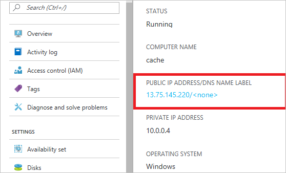

<properties
    pageTitle="DocumentDB Firewall Support | Microsoft Azure"
    description="Erfahren Sie, wie IP-Richtlinien für Firewall-Unterstützung für DocumentDB Azure-Datenbank-Konten verwendet werden soll."
    keywords="Access-IP-Steuerelements, Firewall-support"
    services="documentdb"
    authors="shahankur11"
    manager="jhubbard"
    editor=""
    tags="azure-resource-manager"
    documentationCenter=""/>

<tags 
    ms.service="documentdb" 
    ms.workload="data-services" 
    ms.tgt_pltfrm="na" 
    ms.devlang="na" 
    ms.topic="article" 
    ms.date="10/17/2016" 
    ms.author="ankshah; kraman"/>

# DocumentDB Firewall-support

Um in einem DocumentDB Azure-Datenbank-Konto gespeicherten Daten zu sichern, hat DocumentDB Unterstützung für einen geheimen basierend [Autorisierungsmodell](https://msdn.microsoft.com/library/azure/dn783368.aspx) bereitgestellt, der einen signifikante hashbasierten Nachrichtenauthentifizierungscode (HMAC) verwendet. Über das Autorisierungsmodell geheimen basierend unterstützt nun DocumentDB Richtlinie leistungsgesteuert IP-basierten Zugriff Steuerelemente für eingehenden Firewall-Unterstützung an. Dieses Modell ähnelt dem Firewall-Regeln aus einem herkömmlichen Datenbank-System und bietet eine zusätzliche Sicherheitsebene mit dem DocumentDB Datenbank-Konto. Mit diesem Modell können Sie jetzt eine DocumentDB Datenbank-Kontos zum cloud Services und/oder werden nur aus einem genehmigten Satz von Autos barrierefreien konfigurieren. Zugriff auf DocumentDB Ressourcen aus dieser genehmigte Sätze von Autos und-Diensten erfordern immer noch den Anrufer ein gültiger Autorisierungstoken präsentieren.

## Übersicht über die IP-Access-Steuerelement

Standardmäßig ist die ein DocumentDB Datenbank-Konto aus öffentlichen Internet zugänglich, solange die Anforderung einer gültigen Autorisierungstoken beigefügt ist. Um IP-Richtlinie-basierten Zugriff Steuerelement konfigurieren, muss der Benutzer den Satz von IP-Adressen oder IP-Adressbereiche CIDR Formular als die zulässige Liste der Client-IP-Adressen für ein Datenbankkonto angegebenen werden bereitstellen. Nachdem Sie diese Konfiguration angewendet wird, werden alle Anfragen aus Computern außerhalb dieser Liste zulässige vom Server blockiert.  Im folgenden Diagramm wird die Verbindung Verarbeitung Fluss für das Steuerelement IP-basierten Zugriff beschrieben.

## Verbindungen aus der Cloud-Dienste

In Azure sind Cloud Services sehr relativem für das Hosten von Logik des mittleren Ebene DocumentDB verwenden. Zum Aktivieren des Zugriffs mit einem DocumentDB Datenbank-Konto aus einem Clouddienst muss die öffentliche IP-Adresse des Cloud-Dienst zur Liste zugelassenen IP-Adressen, die mit Ihrem DocumentDB Datenbank-Konto verknüpft ist, durch [Kontaktieren des Supports Azure](#configure-ip-policy)hinzugefügt werden.  Dadurch wird sichergestellt, dass alle Rolleninstanzen der Clouddienste bei Ihrem DocumentDB Datenbank-Konto zugreifen. Sie können die IP-Adressen für Ihre Dienstleistungen Cloud im Portal Azure abrufen, wie im folgenden Screenshot dargestellt. 

Wenn Sie weitere Rolle Instanzen hinzufügen, Ihre Cloud-Dienst skalieren, werden diese neuen Instanzen automatisch haben Zugriff auf das DocumentDB Datenbank-Konto, da sie den gleichen Clouddienst gehören.

## Verbindungen aus virtuellen Computern

[Virtuellen Computern](https://azure.microsoft.com/services/virtual-machines/) oder [virtuellen Computern Maßstab legt](../virtual-machine-scale-sets/virtual-machine-scale-sets-overview.md) kann auch verwendet werden, mittlere Ebene Services verwenden DocumentDB hosten.  Zum Konfigurieren der DocumentDB muss Datenbankkonto für den Zugriff von virtuellen Computern, öffentliche IP-Adressen von virtuellen Computern und/oder virtuellen Computern Skalieren festlegen durch [Kontaktieren des Supports Azure](#configure-ip-policy)als eines der zulässigen IP-Adressen für Ihr DocumentDB Datenbank-Konto konfiguriert sein. Sie können die IP-Adressen für virtuellen Computern im Portal Azure abrufen, wie im folgenden Screenshot dargestellt.

Wenn Sie weitere virtuellen Computern Instanzen der Gruppe hinzufügen, werden sie automatisch Zugriff auf Ihr Konto der DocumentDB Datenbank bereitgestellt.

## Verbindungen aus dem internet

Wenn Sie ein DocumentDB Datenbank-Konto über einen Computer im Internet zugreifen, muss die IP-Adresse oder die IP-Adressbereich des Computers zur Liste zugelassenen IP-Adresse für das DocumentDB Datenbank-Konto hinzugefügt werden. 

## Konfigurieren der IP-Zugriffsrichtlinie

Verwenden des Azure-Portals auf die Datei einer Besprechungsanfrage mit [Azure-Unterstützung](https://portal.azure.com/?#blade/Microsoft_Azure_Support/HelpAndSupportBlade) zu der IP-Richtlinien für Ihr Datenbankkonto aktivieren.

1. Wählen Sie das Blade [Unterstützung + Hilfe](https://portal.azure.com/?#blade/Microsoft_Azure_Support/HelpAndSupportBlade) **neu support-Anfragen**.
2. Wählen Sie das Blade **neu support-Anfragen** **Grundlagen**.
3. Wählen Sie in die **Grundlagen** Blade Folgendes aus:
    - **Problemtyp**: Kontingent
    - **Abonnements**: das Abonnement verknüpft ist, mit dem Konto, in dem die IP-Steuerelement Zugriffsrichtlinie hinzugefügt.
    - **Speicherkontingent Typ**: DocumentDB
    - **Support-Plan**: Quote-Support - enthalten.
4. Führen Sie folgende Schritte aus, in das **Problem** Blade:
    - **Schwere**: Wählen Sie C - minimaler Auswirkung
    - **Details**: Kopieren Sie den folgenden Text in das Feld, und Ihr Konto Name/s und IP-Adresse/en enden einschließen: "Ich möchte Firewall-Unterstützung für mein DocumentDB Datenbank-Konto zu aktivieren. Datenbank-Konto: *einschließen Konto Name/s*. IP-Adressbereiche zulässig: *einschließen IP-Adresse/Bereich im CIDR-Format, beispielsweise 13.91.6.132, 13.91.6.1/24*. "
    - Klicken Sie auf **Weiter**. 
5. Füllen Sie Ihre Kontaktdaten das Blade **Kontaktinformationen** und klicken Sie auf **Erstellen**. 

Sobald die Anforderung eingegangen ist, sollte die IP-Steuerung des Benutzerzugriffs innerhalb von 24 Stunden aktiviert werden. Sie werden benachrichtigt, wenn die Anforderung abgeschlossen ist.

## Problembehandlung bei der IP-Zugriffsrichtlinie

### Portal Vorgänge

Durch das Aktivieren einer IP-Richtlinien für Ihr DocumentDB Datenbank-Konto an, zulässig alle Zugriff auf Ihr DocumentDB Datenbank-Konto aus Computern außerhalb der konfigurierten Liste der IP-Adressbereiche blockiert werden. Aufgrund dieses Modell wird den Daten Ebene Vorgang aus dem Portal durchsuchen auch um die Integrität des Access-Steuerelements zu gewährleisten blockiert werden. 

### SDK und Rest-API

Für aus Gründen der Sicherheit, Zugriff über SDK oder REST-API aus Computern, die sich nicht auf der Liste der zugelassenen eine generische 404 nicht gefunden Antwort mit keine zusätzliche Details zurück. Überprüfen Sie die IP-Adresse für Ihr DocumentDB Datenbank-Konto konfiguriert Liste der zugelassenen um sicherzustellen, dass die richtige Richtlinienkonfiguration bei Ihrem Konto der DocumentDB Datenbank angewendet wird.

## Nächste Schritte

Informationen zum Netzwerk verwandte Leistungstipps finden Sie unter [Tipps für Leistung](documentdb-performance-tips.md).