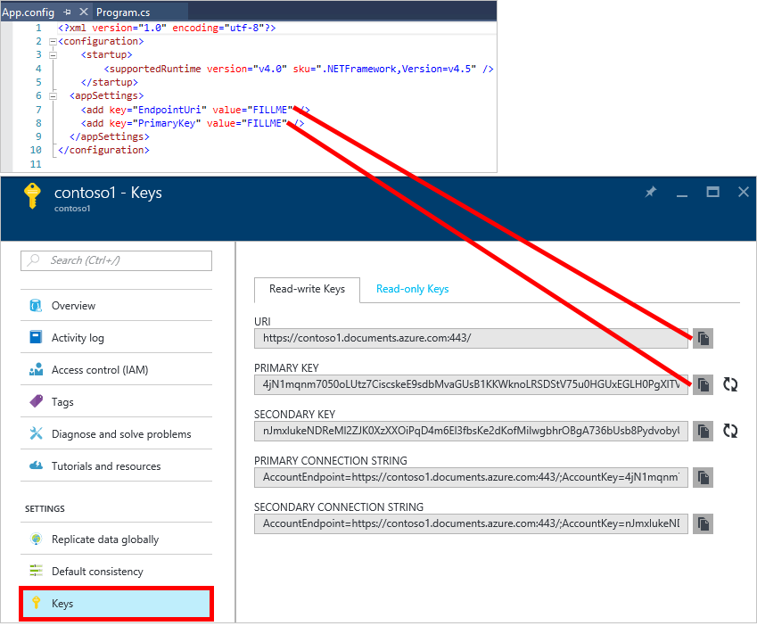

<properties
    pageTitle="NoSQL Lernprogramm: DocumentDB .NET SDK | Microsoft Azure"
    description="Ein NoSQL-Lernprogramm, die eine C#-Console-Anwendung mit dem DocumentDB .NET SDK und online-Datenbank erstellt wird. DocumentDB ist eine Datenbank NoSQL für JSON."
    keywords="NoSQL Lernprogramm, online-Datenbank, c# Console-Anwendung"
    services="documentdb"
    documentationCenter=".net"
    authors="AndrewHoh"
    manager="jhubbard"
    editor="monicar"/>

<tags
    ms.service="documentdb"
    ms.workload="data-services"
    ms.tgt_pltfrm="na"
    ms.devlang="dotnet"
    ms.topic="hero-article"
    ms.date="09/01/2016"
    ms.author="anhoh"/>

# NoSQL Lernprogramm: Erstellen einer DocumentDB c# Console-Anwendung

> [AZURE.SELECTOR]
- [.NET](documentdb-get-started.md)
- [Node.js](documentdb-nodejs-get-started.md)

Willkommen Sie bei des NoSQL Lernprogramms für Azure DocumentDB .NET SDK! Nachdem Sie das Projekt Schnellstart erste oder Abschließen des Lernprogramms, müssen Sie eine Console-Anwendung, die erstellt und Abfragen DocumentDB Ressourcen.

- **[Schnellstart](#quickstart)**: Laden Sie das Beispielprojekt, Ihre Verbindungsinformationen hinzufügen und eine DocumentDB app in weniger als 10 Minuten ausgeführt haben.
- **[Lernprogramm](#tutorial)**: erstellen die app Schnellstart Seitenvorlage in 30 Minuten.

## Erforderliche Komponenten

- Ein aktives Azure-Konto. Wenn Sie eine besitzen, können Sie für ein [kostenloses Konto](https://azure.microsoft.com/free/)anmelden.
- [Visual Studio-2013 oder Visual Studio 2015](http://www.visualstudio.com/).
- .NET Framework 4.6

## Schnellstart

1. Herunterladen Sie der Stichprobe Project ZIP aus [GitHub](https://github.com/Azure-Samples/documentdb-dotnet-getting-started-quickstart/archive/master.zip) oder Klonen Sie die [Documentdb-Dotnet-erste-Schritte-Schnellstart](https://github.com/Azure-Samples/documentdb-dotnet-getting-started-quickstart) Repo.
2. [Erstellen Sie ein Konto DocumentDB](documentdb-create-account.md)das Azure Portal verwendet werden.
3. Ersetzen Sie in der App die Werte EndpointUri und PrimaryKey mit den Werten aus der [Azure-Portal](https://portal.azure.com/)durch Navigieren zu Blade **DocumentDB (NoSQL)** , und klicken Sie dann auf den **Kontonamen**klicken und dann auf **Tasten** im Menü Ressource abgerufen.
    
4. Erstellen Sie das Projekt an. Das Konsolenfenster zeigt die neuen Ressourcen erstellt, abgefragt und dann bereinigt wird.
    
    

## Lernprogramm

Dieses Lernprogramm führt Sie durch die Erstellung einer Datenbank DocumentDB, eine Auflistung DocumentDB und JSON-Dokumente. Sie erhalten dann Abfrage in der Websitesammlung und Aufräumen und löschen Sie die Datenbank. In diesem Lernprogramm erstellt, das gleiche Projekt wie das Projekt Schnellstart, aber Sie werden inkrementell erstellen und Erläuterung über den Code, den Sie dem Projekt hinzugefügt haben, erhalten.

## Schritt 1: Erstellen eines DocumentDB-Kontos

Erstellen Sie uns ein DocumentDB-Konto ein. Wenn Sie bereits über ein Konto, die Sie verwenden möchten verfügen, können Sie zum [Einrichten Ihrer Visual Studio-Lösung](#SetupVS)springen.

[AZURE.INCLUDE [documentdb-create-dbaccount](../../includes/documentdb-create-dbaccount.md)]

## Schritt 2: Einrichten Sie Ihrer Visual Studio-Lösung

1. Öffnen Sie **Visual Studio 2015** auf Ihrem Computer.
2. Klicken Sie im Menü **Datei** wählen Sie **neu**, und wählen Sie dann auf **Projekt**.
3. Wählen Sie im Dialogfeld **Neues Projekt** aus **Vorlagen** / **C#-** / **Console-Anwendung**, benennen Sie Ihr Projekt, und klicken Sie dann auf **OK**.

4. Klicken Sie in der **Lösung Explorer**auf Ihre neue Console-Anwendung, die unter der Visual Studio-Lösung ist.
5. Klicken Sie dann auf ohne zu verlassen, klicken Sie im Menü, auf **NuGet-Pakete verwalten...** 
 
6. Klicken Sie auf der Registerkarte **Nuget** klicken Sie auf **Durchsuchen**, und geben Sie in das Suchfeld **Azure Documentdb** .
7. Klicken Sie in die Ergebnisse suchen Sie **Microsoft.Azure.DocumentDB** , und klicken Sie auf **Installieren**.
Die Paket-ID für die DocumentDB-Client-Bibliothek ist [Microsoft.Azure.DocumentDB](https://www.nuget.org/packages/Microsoft.Azure.DocumentDB)

Großartige! Jetzt, da wir die Einrichtung abgeschlossen haben, beginnen wir mit entsprechendem Code schreiben. Sie können ein fertigen Codeprojekt dieses Lernprogramms am [GitHub](https://github.com/Azure-Samples/documentdb-dotnet-getting-started/blob/master/src/Program.cs)suchen.

## Schritt 3: Verbinden mit einem DocumentDB-Konto

Fügen Sie zunächst diese Verweise an den Anfang der C#-Anwendung, in der Datei Program.cs hinzu:

    using System;
    using System.Linq;
    using System.Threading.Tasks;

    // ADD THIS PART TO YOUR CODE
    using System.Net;
    using Microsoft.Azure.Documents;
    using Microsoft.Azure.Documents.Client;
    using Newtonsoft.Json;

> [AZURE.IMPORTANT] Um dieses Lernprogramms NoSQL abgeschlossen haben, stellen Sie sicher, dass Sie die oben angegebenen Abhängigkeiten hinzufügen.

Fügen Sie nun die zwei Konstanten und Ihre *Client* -Variable unterhalb Ihrer öffentlichen Class *Program*.

    public class Program
    {
        // ADD THIS PART TO YOUR CODE
        private const string EndpointUri = "<your endpoint URI>";
        private const string PrimaryKey = "<your key>";
        private DocumentClient client;

Nächste, Kopf [Azure-Portal](https://portal.azure.com) zum Abrufen Ihrer URI und Primärschlüssel. Für eine Anwendung zu verstehen, wo Sie das Herstellen einer Verbindung mit sowie für DocumentDB Ihrer Anwendung Verbindung als vertrauenswürdig erforderlich sind, die DocumentDB URI und Primärschlüssel.

Navigieren Sie zu Ihrem Konto DocumentDB im Portal Azure, und klicken Sie dann auf **Schlüssel**.

Kopieren Sie den URI aus dem Portal und fügen Sie ihn in `<your endpoint URI>` in der Datei program.cs. Klicken Sie dann den PRIMÄRSCHLÜSSEL aus dem Portal kopieren, und fügen Sie ihn in `<your key>`.

![Screenshot des Portals Azure von der NoSQL Lernprogramm verwendet, um eine C#-Console-Anwendung zu erstellen. Zeigt ein Konto DocumentDB mit der aktiven Hub hervorgehoben, die Tasten Schaltfläche auf das DocumentDB Konto Blade hervorgehoben und die URI, primären und SEKUNDÄRSCHLÜSSEL Werte, die die Tasten Blade hervorgehoben][keys]

Die erste Schritte Anwendung zunächst wird durch Erstellen einer neuen Instanz der **DocumentClient**.

Fügen Sie diese neue asynchrone Aufgabe aufgerufen **GetStartedDemo**, die unserer neuen **DocumentClient**instanziiert wird unterhalb der **Main** -Methode hinzu.

    static void Main(string[] args)
    {
    }

    // ADD THIS PART TO YOUR CODE
    private async Task GetStartedDemo()
    {
        this.client = new DocumentClient(new Uri(EndpointUri), PrimaryKey);
    }

Fügen Sie den folgenden Code ein, um Ihre **Main** -Methode die asynchrone Aufgabe auszuführen. Die Methode **Main** Ausnahmen abgefangen und in die Konsole zu schreiben.

    static void Main(string[] args)
    {
            // ADD THIS PART TO YOUR CODE
            try
            {
                    Program p = new Program();
                    p.GetStartedDemo().Wait();
            }
            catch (DocumentClientException de)
            {
                    Exception baseException = de.GetBaseException();
                    Console.WriteLine("{0} error occurred: {1}, Message: {2}", de.StatusCode, de.Message, baseException.Message);
            }
            catch (Exception e)
            {
                    Exception baseException = e.GetBaseException();
                    Console.WriteLine("Error: {0}, Message: {1}", e.Message, baseException.Message);
            }
            finally
            {
                    Console.WriteLine("End of demo, press any key to exit.");
                    Console.ReadKey();
            }

Drücken Sie **F5** , um die Anwendung ausführen.

Herzlichen Glückwunsch! Sie erfolgreich eine Verbindung mit einem DocumentDB-Konto hergestellt haben, lassen Sie uns nun sehen Sie sich mit DocumentDB Ressourcen arbeiten.  

## Schritt 4: Erstellen einer Datenbank
Bevor Sie den Code zum Erstellen einer Datenbank hinzugefügt haben, fügen Sie eine Helper-Methode zum Schreiben in der Verwaltungskonsole.

Kopieren und Einfügen der Methode **WriteToConsoleAndPromptToContinue** unterhalb der **GetStartedDemo** Methode.

    // ADD THIS PART TO YOUR CODE
    private void WriteToConsoleAndPromptToContinue(string format, params object[] args)
    {
            Console.WriteLine(format, args);
            Console.WriteLine("Press any key to continue ...");
            Console.ReadKey();
    }

Die DocumentDB [Datenbank](documentdb-resources.md#databases) kann mithilfe der Methode [CreateDatabaseAsync](https://msdn.microsoft.com/library/microsoft.azure.documents.client.documentclient.createdatabaseasync.aspx) der Klasse **DocumentClient** erstellt werden. Eine Datenbank ist die logischen Container JSON-Dokument-Speicher über Websitesammlungen aufgeteilt.

Kopieren und Einfügen der Methode **CreateDatabaseIfNotExists** unterhalb der **WriteToConsoleAndPromptToContinue** Methode.

    // ADD THIS PART TO YOUR CODE
    private async Task CreateDatabaseIfNotExists(string databaseName)
    {
            // Check to verify a database with the id=FamilyDB does not exist
            try
            {
                    await this.client.ReadDatabaseAsync(UriFactory.CreateDatabaseUri(databaseName));
                    this.WriteToConsoleAndPromptToContinue("Found {0}", databaseName);
            }
            catch (DocumentClientException de)
            {
                    // If the database does not exist, create a new database
                    if (de.StatusCode == HttpStatusCode.NotFound)
                    {
                            await this.client.CreateDatabaseAsync(new Database { Id = databaseName });
                            this.WriteToConsoleAndPromptToContinue("Created {0}", databaseName);
                    }
                    else
                    {
                            throw;
                    }
            }
    }

Kopieren Sie und fügen Sie den folgenden Code an Ihre Methode **GetStartedDemo** unterhalb der Erstellung Client ein. Dadurch wird eine Datenbank namens *FamilyDB*erstellt.

    private async Task GetStartedDemo()
    {
        this.client = new DocumentClient(new Uri(EndpointUri), PrimaryKey);

        // ADD THIS PART TO YOUR CODE
        await this.CreateDatabaseIfNotExists("FamilyDB_va");

Drücken Sie **F5** , um die Anwendung ausführen.

Herzlichen Glückwunsch! Sie haben eine Datenbank DocumentDB erfolgreich erstellt.  

## Schritt 5: Erstellen einer Websitesammlung  

> [AZURE.WARNING] **CreateDocumentCollectionAsync** erstellt eine neue Websitesammlung mit reservierte Durchsatz, die Preise Auswirkungen hat. Weitere Informationen hierzu finden Sie auf unserer [Seite Preise](https://azure.microsoft.com/pricing/details/documentdb/).

Eine [Auflistung](documentdb-resources.md#collections) kann mithilfe der Methode [CreateDocumentCollectionAsync](https://msdn.microsoft.com/library/microsoft.azure.documents.client.documentclient.createdocumentcollectionasync.aspx) der Klasse **DocumentClient** erstellt werden. Eine Auflistung ist ein Container für JSON-Dokumente und zugehörigen JavaScript-Anwendungslogik.

Kopieren und Einfügen der Methode **CreateDocumentCollectionIfNotExists** unterhalb der **CreateDatabaseIfNotExists** Methode.

    // ADD THIS PART TO YOUR CODE
    private async Task CreateDocumentCollectionIfNotExists(string databaseName, string collectionName)
    {
        try
        {
            await this.client.ReadDocumentCollectionAsync(UriFactory.CreateDocumentCollectionUri(databaseName, collectionName));
            this.WriteToConsoleAndPromptToContinue("Found {0}", collectionName);
        }
        catch (DocumentClientException de)
        {
            // If the document collection does not exist, create a new collection
            if (de.StatusCode == HttpStatusCode.NotFound)
            {
                DocumentCollection collectionInfo = new DocumentCollection();
                collectionInfo.Id = collectionName;

                // Configure collections for maximum query flexibility including string range queries.
                collectionInfo.IndexingPolicy = new IndexingPolicy(new RangeIndex(DataType.String) { Precision = -1 });

                // Here we create a collection with 400 RU/s.
                await this.client.CreateDocumentCollectionAsync(
                    UriFactory.CreateDatabaseUri(databaseName),
                    collectionInfo,
                    new RequestOptions { OfferThroughput = 400 });

                this.WriteToConsoleAndPromptToContinue("Created {0}", collectionName);
            }
            else
            {
                throw;
            }
        }
    }

Kopieren Sie und fügen Sie den folgenden Code an Ihre Methode **GetStartedDemo** unterhalb der Erstellung der Datenbank ein. Dadurch wird eine Auflistung des Dokuments, mit dem Namen *FamilyCollection_va*erstellt.

        this.client = new DocumentClient(new Uri(EndpointUri), PrimaryKey);

        await this.CreateDatabaseIfNotExists("FamilyDB_oa");

        // ADD THIS PART TO YOUR CODE
        await this.CreateDocumentCollectionIfNotExists("FamilyDB_va", "FamilyCollection_va");

Drücken Sie **F5** , um die Anwendung ausführen.

Herzlichen Glückwunsch! Sie haben eine Auflistung der DocumentDB Dokument erfolgreich erstellt.  

## Schritt 6: Erstellen von JSON-Dokumenten
Ein [Dokument](documentdb-resources.md#documents) kann mithilfe der Methode [CreateDocumentAsync](https://msdn.microsoft.com/library/microsoft.azure.documents.client.documentclient.createdocumentasync.aspx) der Klasse **DocumentClient** erstellt werden. Dokumente sind, dass Benutzer (beliebigen) JSON-Inhalt definiert. Jetzt können wir ein oder mehrere Dokumente einfügen. Wenn Sie bereits Daten, die Sie in Ihrer Datenbank speichern möchten enthalten, können Sie DocumentDBs [Migrationstools Daten](documentdb-import-data.md)verwenden.

Zuerst müssen wir zum Erstellen einer **Familie** -Klasse, die innerhalb der DocumentDB in diesem Beispiel gespeicherten Objekte darstellt. Wir werden auch erstellen **übergeordnete**, **untergeordnete**, **Pet**, **Adresse** untergeordneten Klassen, die innerhalb der **Familie**verwendet werden. Beachten Sie, dass Dokumente müssen als **Id** in JSON serialisiert **Id** -Eigenschaften verfügen. Erstellen Sie diese Klassen, indem Sie die folgenden internen untergeordnete Klassen nach der Methode **GetStartedDemo** hinzufügen.

Kopieren Sie und fügen Sie der **Familie**, **übergeordnete**, **untergeordnete**, **Pet**und **Adresse** Klassen unterhalb der **WriteToConsoleAndPromptToContinue** Methode ein.

    private void WriteToConsoleAndPromptToContinue(string format, params object[] args)
    {
        Console.WriteLine(format, args);
        Console.WriteLine("Press any key to continue ...");
        Console.ReadKey();
    }

    // ADD THIS PART TO YOUR CODE
    public class Family
    {
        [JsonProperty(PropertyName = "id")]
        public string Id { get; set; }
        public string LastName { get; set; }
        public Parent[] Parents { get; set; }
        public Child[] Children { get; set; }
        public Address Address { get; set; }
        public bool IsRegistered { get; set; }
        public override string ToString()
        {
                return JsonConvert.SerializeObject(this);
        }
    }

    public class Parent
    {
        public string FamilyName { get; set; }
        public string FirstName { get; set; }
    }

    public class Child
    {
        public string FamilyName { get; set; }
        public string FirstName { get; set; }
        public string Gender { get; set; }
        public int Grade { get; set; }
        public Pet[] Pets { get; set; }
    }

    public class Pet
    {
        public string GivenName { get; set; }
    }

    public class Address
    {
        public string State { get; set; }
        public string County { get; set; }
        public string City { get; set; }
    }

Kopieren und Einfügen der Methode **CreateFamilyDocumentIfNotExists** unterhalb der **CreateDocumentCollectionIfNotExists** Methode.

    // ADD THIS PART TO YOUR CODE
    private async Task CreateFamilyDocumentIfNotExists(string databaseName, string collectionName, Family family)
    {
        try
        {
            await this.client.ReadDocumentAsync(UriFactory.CreateDocumentUri(databaseName, collectionName, family.Id));
            this.WriteToConsoleAndPromptToContinue("Found {0}", family.Id);
        }
        catch (DocumentClientException de)
        {
            if (de.StatusCode == HttpStatusCode.NotFound)
            {
                await this.client.CreateDocumentAsync(UriFactory.CreateDocumentCollectionUri(databaseName, collectionName), family);
                this.WriteToConsoleAndPromptToContinue("Created Family {0}", family.Id);
            }
            else
            {
                throw;
            }
        }
    }

Und fügen Sie zwei Dokumente, die jeweils eine für die Andersen Familie und mit der Familie Wakefield.

Kopieren Sie und fügen Sie den folgenden Code an Ihre Methode **GetStartedDemo** unterhalb der Erstellung des Dokuments Websitesammlung ein.

    await this.CreateDatabaseIfNotExists("FamilyDB_va");

    await this.CreateDocumentCollectionIfNotExists("FamilyDB_va", "FamilyCollection_va");

    // ADD THIS PART TO YOUR CODE
    Family andersenFamily = new Family
    {
            Id = "Andersen.1",
            LastName = "Andersen",
            Parents = new Parent[]
            {
                    new Parent { FirstName = "Thomas" },
                    new Parent { FirstName = "Mary Kay" }
            },
            Children = new Child[]
            {
                    new Child
                    {
                            FirstName = "Henriette Thaulow",
                            Gender = "female",
                            Grade = 5,
                            Pets = new Pet[]
                            {
                                    new Pet { GivenName = "Fluffy" }
                            }
                    }
            },
            Address = new Address { State = "WA", County = "King", City = "Seattle" },
            IsRegistered = true
    };

    await this.CreateFamilyDocumentIfNotExists("FamilyDB_va", "FamilyCollection_va", andersenFamily);

    Family wakefieldFamily = new Family
    {
            Id = "Wakefield.7",
            LastName = "Wakefield",
            Parents = new Parent[]
            {
                    new Parent { FamilyName = "Wakefield", FirstName = "Robin" },
                    new Parent { FamilyName = "Miller", FirstName = "Ben" }
            },
            Children = new Child[]
            {
                    new Child
                    {
                            FamilyName = "Merriam",
                            FirstName = "Jesse",
                            Gender = "female",
                            Grade = 8,
                            Pets = new Pet[]
                            {
                                    new Pet { GivenName = "Goofy" },
                                    new Pet { GivenName = "Shadow" }
                            }
                    },
                    new Child
                    {
                            FamilyName = "Miller",
                            FirstName = "Lisa",
                            Gender = "female",
                            Grade = 1
                    }
            },
            Address = new Address { State = "NY", County = "Manhattan", City = "NY" },
            IsRegistered = false
    };

    await this.CreateFamilyDocumentIfNotExists("FamilyDB_va", "FamilyCollection_va", wakefieldFamily);

Drücken Sie **F5** , um die Anwendung ausführen.

Herzlichen Glückwunsch! Sie haben zwei DocumentDB Dokumente erfolgreich erstellt.  

##Schritt 7: Abfrage DocumentDB Ressourcen

DocumentDB unterstützt Rich- [Abfragen](documentdb-sql-query.md) für JSON-Dokumente, die in jeder Websitesammlung gespeichert.  Der folgende Code zeigt verschiedene Abfragen - beide DocumentDB SQL-Syntax verwenden sowie LINQ -, können wir ausführen gegen die Dokumente wir eingefügt im vorherigen Schritt.

Kopieren und Einfügen der Methode **ExecuteSimpleQuery** unterhalb der **CreateFamilyDocumentIfNotExists** Methode.

    // ADD THIS PART TO YOUR CODE
    private void ExecuteSimpleQuery(string databaseName, string collectionName)
    {
        // Set some common query options
        FeedOptions queryOptions = new FeedOptions { MaxItemCount = -1 };

            // Here we find the Andersen family via its LastName
            IQueryable<Family> familyQuery = this.client.CreateDocumentQuery<Family>(
                    UriFactory.CreateDocumentCollectionUri(databaseName, collectionName), queryOptions)
                    .Where(f => f.LastName == "Andersen");

            // The query is executed synchronously here, but can also be executed asynchronously via the IDocumentQuery<T> interface
            Console.WriteLine("Running LINQ query...");
            foreach (Family family in familyQuery)
            {
                    Console.WriteLine("\tRead {0}", family);
            }

            // Now execute the same query via direct SQL
            IQueryable<Family> familyQueryInSql = this.client.CreateDocumentQuery<Family>(
                    UriFactory.CreateDocumentCollectionUri(databaseName, collectionName),
                    "SELECT * FROM Family WHERE Family.LastName = 'Andersen'",
                    queryOptions);

            Console.WriteLine("Running direct SQL query...");
            foreach (Family family in familyQueryInSql)
            {
                    Console.WriteLine("\tRead {0}", family);
            }

            Console.WriteLine("Press any key to continue ...");
            Console.ReadKey();
    }

Kopieren Sie und fügen Sie den folgenden Code an Ihre Methode **GetStartedDemo** unterhalb der zweiten Erstellung des Dokuments ein.

    await this.CreateFamilyDocumentIfNotExists("FamilyDB_va", "FamilyCollection_va", wakefieldFamily);

    // ADD THIS PART TO YOUR CODE
    this.ExecuteSimpleQuery("FamilyDB_va", "FamilyCollection_va");

Drücken Sie **F5** , um die Anwendung ausführen.

Herzlichen Glückwunsch! Sie verfügen über eine Auflistung DocumentDB erfolgreich abgefragt.

Das folgende Diagramm veranschaulicht, wie der DocumentDB SQL-Abfragesyntax heißt anhand der Websitesammlung, die Sie erstellt haben, und die gleiche Logik gilt die LINQ-Abfrage.

Das [FROM](documentdb-sql-query.md#from-clause) -Schlüsselwort ist optional in der Abfrage, da DocumentDB Abfragen bereits auf eine einzelne Sammlung beschränkt sind. Daher "Von Familien f" können werden durch ausgetauscht "Von Root R" oder eine anderen Variablen benennen Sie wählen Sie aus. DocumentDB wird ein abzuleiten dieser Familien, Stamm oder dem Variablennamen, die, den Sie ausgewählt haben, die aktuelle Auflistung standardmäßig verweisen.

##Schritt 8: Ersetzen JSON-Dokument

DocumentDB unterstützt das JSON-Dokumente austauschen.  

Kopieren und Einfügen der Methode **ReplaceFamilyDocument** unterhalb der **ExecuteSimpleQuery** Methode.

    // ADD THIS PART TO YOUR CODE
    private async Task ReplaceFamilyDocument(string databaseName, string collectionName, string familyName, Family updatedFamily)
    {
        try
        {
            await this.client.ReplaceDocumentAsync(UriFactory.CreateDocumentUri(databaseName, collectionName, familyName), updatedFamily);
            this.WriteToConsoleAndPromptToContinue("Replaced Family {0}", familyName);
        }
        catch (DocumentClientException de)
        {
            throw;
        }
    }

Kopieren Sie und fügen Sie den folgenden Code an Ihre Methode **GetStartedDemo** unterhalb der Ausführung der Abfrage ein. Nach dem Ersetzen des Dokuments, kann dies die gleiche Abfrage erneut aus, um das geänderte Dokument anzuzeigen ausgeführt.

    await this.CreateFamilyDocumentIfNotExists("FamilyDB_va", "FamilyCollection_va", wakefieldFamily);

    this.ExecuteSimpleQuery("FamilyDB_va", "FamilyCollection_va");

    // ADD THIS PART TO YOUR CODE
    // Update the Grade of the Andersen Family child
    andersenFamily.Children[0].Grade = 6;

    await this.ReplaceFamilyDocument("FamilyDB_va", "FamilyCollection_va", "Andersen.1", andersenFamily);

    this.ExecuteSimpleQuery("FamilyDB_va", "FamilyCollection_va");

Drücken Sie **F5** , um die Anwendung ausführen.

Herzlichen Glückwunsch! Sie haben ein Dokument DocumentDB erfolgreich ersetzt.

##Schritt 9: Löschen Sie JSON-Dokument

DocumentDB unterstützt das JSON-Dokumente löschen.  

Kopieren und Einfügen der Methode **DeleteFamilyDocument** unterhalb der **ReplaceFamilyDocument** Methode.

    // ADD THIS PART TO YOUR CODE
    private async Task DeleteFamilyDocument(string databaseName, string collectionName, string documentName)
    {
        try
        {
            await this.client.DeleteDocumentAsync(UriFactory.CreateDocumentUri(databaseName, collectionName, documentName));
            Console.WriteLine("Deleted Family {0}", documentName);
        }
        catch (DocumentClientException de)
        {
            throw;
        }
    }

Kopieren Sie und fügen Sie den folgenden Code an Ihre Methode **GetStartedDemo** unterhalb der Ausführung der zweiten Abfrage ein.

    await this.ReplaceFamilyDocument("FamilyDB_va", "FamilyCollection_va", "Andersen.1", andersenFamily);

    this.ExecuteSimpleQuery("FamilyDB_va", "FamilyCollection_va");

    // ADD THIS PART TO CODE
    await this.DeleteFamilyDocument("FamilyDB_va", "FamilyCollection_va", "Andersen.1");

Drücken Sie **F5** , um die Anwendung ausführen.

Herzlichen Glückwunsch! Sie haben ein Dokument DocumentDB erfolgreich gelöscht.

##Schritt 10: Löschen der Datenbank

Löschen die Datenbank erstellte werden die Datenbank und alle untergeordneten Elementen Ressourcen (Websitesammlungen, Dokumente usw.) entfernt.

Kopieren Sie und fügen Sie dem folgenden Code an Ihre Methode **GetStartedDemo** unterhalb des Dokuments zu löschen, die gesamte Datenbank und alle untergeordneten Elementen Ressourcen.

    this.ExecuteSimpleQuery("FamilyDB_va", "FamilyCollection_va");

    await this.DeleteFamilyDocument("FamilyDB_va", "FamilyCollection_va", "Andersen.1");

    // ADD THIS PART TO CODE
    // Clean up/delete the database
    await this.client.DeleteDatabaseAsync(UriFactory.CreateDatabaseUri("FamilyDB_va"));

Drücken Sie **F5** , um die Anwendung ausführen.

Herzlichen Glückwunsch! Sie haben eine Datenbank DocumentDB erfolgreich gelöscht.

##Schritt 11: Ausführen der C#-Konsole Anwendung alles zusammen!

Drücken Sie F5 in Visual Studio für die Anwendung im Debuggen-Modus zu erstellen.

Die Ausgabe der erste Schritte app sollte angezeigt werden. Die Ausgabe zeigt die Ergebnisse der Abfragen, die wir hinzugefügt haben und sollte der folgenden Beispieltext übereinstimmen.

    Created FamilyDB_va
    Press any key to continue ...
    Created FamilyCollection_va
    Press any key to continue ...
    Created Family Andersen.1
    Press any key to continue ...
    Created Family Wakefield.7
    Press any key to continue ...
    Running LINQ query...
        Read {"id":"Andersen.1","LastName":"Andersen","District":"WA5","Parents":[{"FamilyName":null,"FirstName":"Thomas"},{"FamilyName":null,"FirstName":"Mary Kay"}],"Children":[{"FamilyName":null,"FirstName":"Henriette Thaulow","Gender":"female","Grade":5,"Pets":[{"GivenName":"Fluffy"}]}],"Address":{"State":"WA","County":"King","City":"Seattle"},"IsRegistered":true}
    Running direct SQL query...
        Read {"id":"Andersen.1","LastName":"Andersen","District":"WA5","Parents":[{"FamilyName":null,"FirstName":"Thomas"},{"FamilyName":null,"FirstName":"Mary Kay"}],"Children":[{"FamilyName":null,"FirstName":"Henriette Thaulow","Gender":"female","Grade":5,"Pets":[{"GivenName":"Fluffy"}]}],"Address":{"State":"WA","County":"King","City":"Seattle"},"IsRegistered":true}
    Replaced Family Andersen.1
    Press any key to continue ...
    Running LINQ query...
        Read {"id":"Andersen.1","LastName":"Andersen","District":"WA5","Parents":[{"FamilyName":null,"FirstName":"Thomas"},{"FamilyName":null,"FirstName":"Mary Kay"}],"Children":[{"FamilyName":null,"FirstName":"Henriette Thaulow","Gender":"female","Grade":6,"Pets":[{"GivenName":"Fluffy"}]}],"Address":{"State":"WA","County":"King","City":"Seattle"},"IsRegistered":true}
    Running direct SQL query...
        Read {"id":"Andersen.1","LastName":"Andersen","District":"WA5","Parents":[{"FamilyName":null,"FirstName":"Thomas"},{"FamilyName":null,"FirstName":"Mary Kay"}],"Children":[{"FamilyName":null,"FirstName":"Henriette Thaulow","Gender":"female","Grade":6,"Pets":[{"GivenName":"Fluffy"}]}],"Address":{"State":"WA","County":"King","City":"Seattle"},"IsRegistered":true}
    Deleted Family Andersen.1
    End of demo, press any key to exit.

Herzlichen Glückwunsch! Sie haben in diesem Lernprogramm NoSQL geführte und verfügen über eine Anwendung C arbeiten Console!

## Nächste Schritte

- Möchten Sie eine komplexere ASP.NET MVC NoSQL Lernprogramm? Finden Sie unter [erstellen eine Webanwendung mit ASP.NET-MVC DocumentDB verwenden](documentdb-dotnet-application.md).
- Skalierung und Performance-Tests mit DocumentDB vornehmen möchten? Finden Sie unter [Leistung und Skala mit Azure DocumentDB testen](documentdb-performance-testing.md)
-   Erfahren Sie, wie [Monitor ein Konto DocumentDB](documentdb-monitor-accounts.md).
-   Unser Dataset Beispiel, in dem [Abfrage-Umgebung](https://www.documentdb.com/sql/demo)-Abfragen ausführen.
-   Weitere Informationen zum Modell Programmierung im Abschnitt Entwicklung der [DocumentDB Dokumentationsseite](https://azure.microsoft.com/documentation/services/documentdb/).

[documentdb-create-account]: documentdb-create-account.md
[documentdb-manage]: documentdb-manage.md
[keys]: media/documentdb-get-started-quickstart/nosql-tutorial-keys.png

