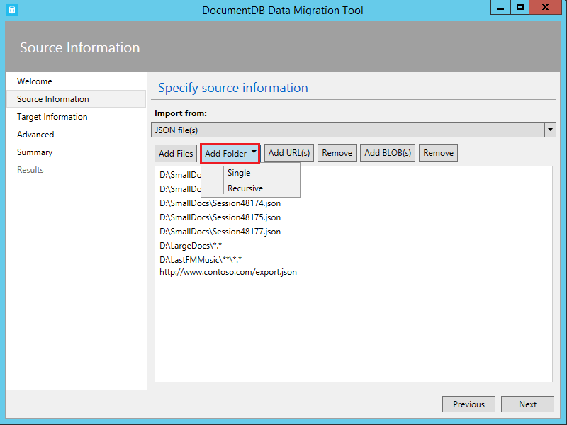
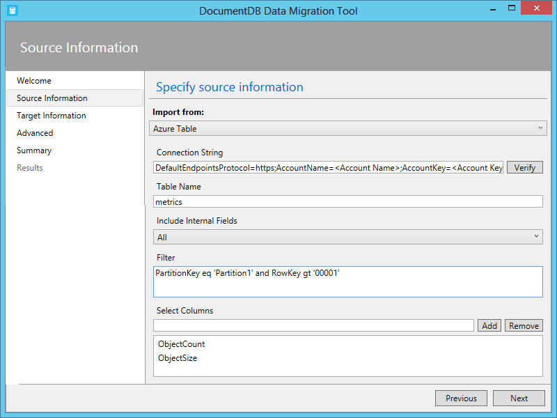
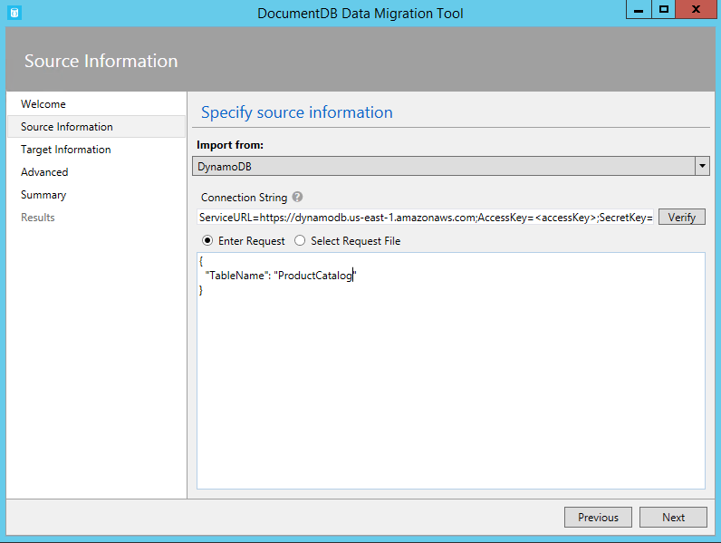
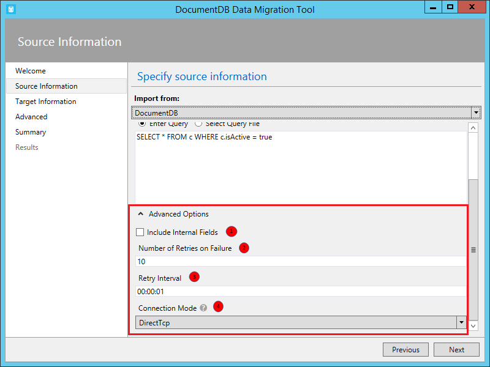
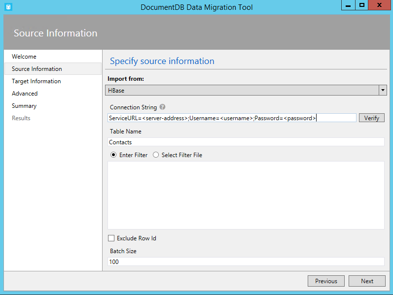
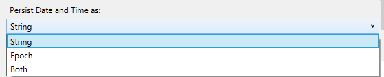
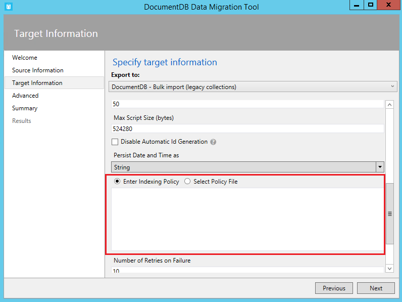
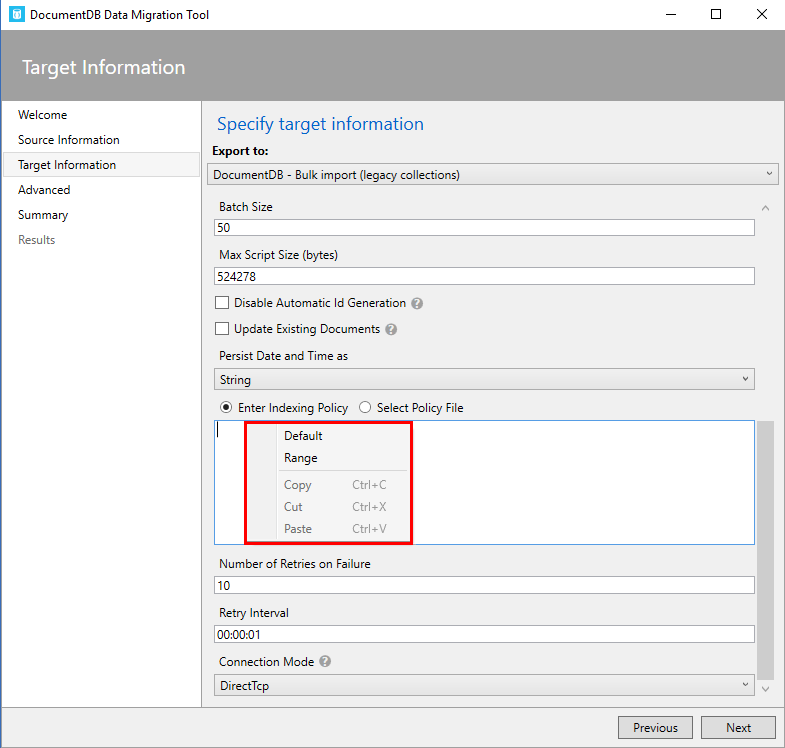
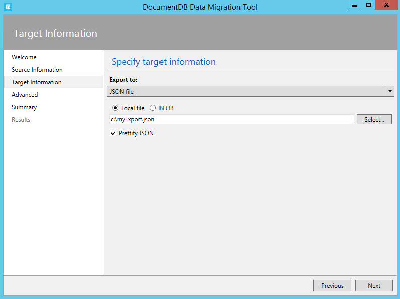
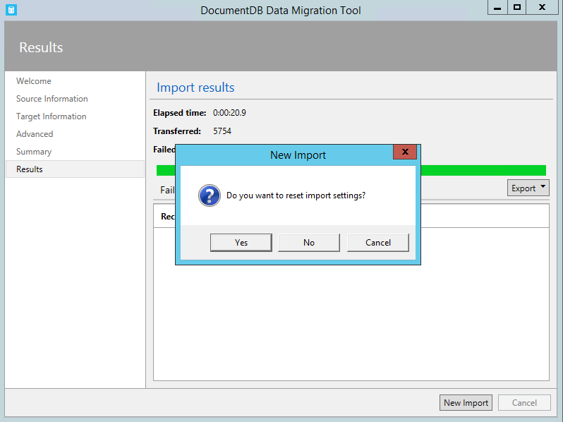

<properties
    pageTitle="Migration Datenbanktool für DocumentDB | Microsoft Azure"
    description="Erfahren Sie, wie die Quelle öffnen DocumentDB Daten Migrationstools zum Importieren von Daten aus verschiedenen Quellen, einschließlich MongoDB, SQL Server, Tabelle Speicher, Amazon DynamoDB, CSV und JSON-Dateien zu DocumentDB verwenden. CSV in JSON-Konvertierung."
    keywords="CSV JSON, Datenbank-Migrationstools Csv in Json konvertieren"
    services="documentdb"
    authors="andrewhoh"
    manager="jhubbard"
    editor="monicar"
    documentationCenter=""/>

<tags
    ms.service="documentdb"
    ms.workload="data-services"
    ms.tgt_pltfrm="na"
    ms.devlang="na"
    ms.topic="article"
    ms.date="10/06/2016"
    ms.author="anhoh"/>

# Importieren von Daten in DocumentDB mit dem Migrationstool der Datenbank

In diesem Artikel wird gezeigt, wie offizielle öffnen Quelle DocumentDB Daten Migration mit das Tool zum Importieren von Daten in [Microsoft Azure DocumentDB](https://azure.microsoft.com/services/documentdb/) aus verschiedenen Quellen, einschließlich JSON-Dateien, CSV-Dateien, SQL, MongoDB, Azure Table Storage, Amazon DynamoDB und DocumentDB Websitesammlungen erstellt wird.

Nach dem Lesen dieses Artikels, können Sie die folgenden Fragen beantworten ausführen:  

-   Wie kann ich JSON-Datei, CSV-Datei, SQL Server-Daten oder Daten MongoDB DocumentDB importieren?
-   Wie kann ich Daten aus Azure Table Storage, Amazon DynamoDB und HBase in DocumentDB importieren?
-   Wie kann ich Daten zwischen DocumentDB Websitesammlungen migrieren?

##Erforderliche Komponenten

Bevor Sie den Anweisungen in diesem Artikel folgen, stellen Sie sicher, dass Sie Folgendes installiert haben:

- [Microsoft .NET Framework 4.51](https://www.microsoft.com/download/developer-tools.aspx) oder höher.

##Übersicht über das Migrationstool DocumentDB Daten

Das Migrationstool für DocumentDB Daten ist eine open-Source-Lösung, die Daten in DocumentDB aus einer Vielzahl von Datenquellen, einschließlich importiert:

- JSON-Dateien
- MongoDB
- SqlServer
- CSV-Dateien
- Azure Table storage
- Amazon DynamoDB
- HBase
- DocumentDB Websitesammlungen

Während Sie das Tool zum Importieren eine Benutzeroberfläche (dtui.exe) enthält, können sie auch über die Befehlszeile (dt.exe) gesteuert werden. Es gibt sogar eine Option aus, um den zugeordneten Befehl ausgeben nach dem Einrichten eines Imports über die Benutzeroberfläche. Tabellarischen Quelldaten (z. B. SQL Server oder CSV-Dateien) können umgewandelt werden, sodass hierarchische Beziehungen (Filialdokumenten) während des Importvorgangs erstellt werden können. Lesen Sie weitere Informationen zu Quelle Optionen, Befehl Zeilen aus, um die Ergebnisse aus jeder Quelle, Ziel-Optionen und Anzeige importieren zu importieren (Beispiel).

##Installieren des Migrationstools für DocumentDB Daten

Der Migration Tool-Quellcode steht auf GitHub in [diesem Repository](https://github.com/azure/azure-documentdb-datamigrationtool) und eine kompilierte Version vom [Microsoft Download Center](http://www.microsoft.com/downloads/details.aspx?FamilyID=cda7703a-2774-4c07-adcc-ad02ddc1a44d)verfügbar ist. Sie können entweder Kompilieren die Lösung oder einfach herunterladen und die kompilierte Version in ein Verzeichnis Ihrer Wahl zu extrahieren. Führen Sie dann entweder aus:

- **Dtui.exe**: Grafischen Oberfläche Version des Tools
- **Dt.exe**: Befehlszeile Version des Tools

##Importieren von JSON-Dateien

Die Option JSON-Datei Quelle Importer können Sie importieren eine oder mehrere einzelnes Dokument JSON-Dateien oder JSON-Dateien, dass jede ein Array von JSON-Dokumente enthält. Wenn Sie Ordner hinzufügen, die zu importierenden JSON-Dateien enthalten, müssen Sie die Möglichkeit, Suchen nach Dateien in Unterordnern rekursiv.

Hier sind einige Beispiele Befehlszeile JSON-Dateien importieren:

    #Import a single JSON file
    dt.exe /s:JsonFile /s.Files:.\Sessions.json /t:DocumentDBBulk /t.ConnectionString:"AccountEndpoint=<DocumentDB Endpoint>;AccountKey=<DocumentDB Key>;Database=<DocumentDB Database>;" /t.Collection:Sessions /t.CollectionThroughput:2500

    #Import a directory of JSON files
    dt.exe /s:JsonFile /s.Files:C:\TESessions\*.json /t:DocumentDBBulk /t.ConnectionString:" AccountEndpoint=<DocumentDB Endpoint>;AccountKey=<DocumentDB Key>;Database=<DocumentDB Database>;" /t.Collection:Sessions /t.CollectionThroughput:2500

    #Import a directory (including sub-directories) of JSON files
    dt.exe /s:JsonFile /s.Files:C:\LastFMMusic\**\*.json /t:DocumentDBBulk /t.ConnectionString:" AccountEndpoint=<DocumentDB Endpoint>;AccountKey=<DocumentDB Key>;Database=<DocumentDB Database>;" /t.Collection:Music /t.CollectionThroughput:2500

    #Import a directory (single), directory (recursive), and individual JSON files
    dt.exe /s:JsonFile /s.Files:C:\Tweets\*.*;C:\LargeDocs\**\*.*;C:\TESessions\Session48172.json;C:\TESessions\Session48173.json;C:\TESessions\Session48174.json;C:\TESessions\Session48175.json;C:\TESessions\Session48177.json /t:DocumentDBBulk /t.ConnectionString:"AccountEndpoint=<DocumentDB Endpoint>;AccountKey=<DocumentDB Key>;Database=<DocumentDB Database>;" /t.Collection:subs /t.CollectionThroughput:2500

    #Import a single JSON file and partition the data across 4 collections
    dt.exe /s:JsonFile /s.Files:D:\\CompanyData\\Companies.json /t:DocumentDBBulk /t.ConnectionString:"AccountEndpoint=<DocumentDB Endpoint>;AccountKey=<DocumentDB Key>;Database=<DocumentDB Database>;" /t.Collection:comp[1-4] /t.PartitionKey:name /t.CollectionThroughput:2500

##Importieren von MongoDB

Die Option MongoDB Quelle Importer können Sie aus einer einzelnen MongoDB Sammlung importieren und optional Dokumente mithilfe einer Abfrage filtern und/oder Struktur des Dokuments ändern, indem Sie eine Projektion verwenden.  

Die Verbindungszeichenfolge ist das Standardformat MongoDB:

    mongodb://<dbuser>:<dbpassword>@<host>:<port>/<database>

> [AZURE.NOTE] Verwenden Sie den Befehl überprüfen, um sicherzustellen, dass die im Feld Verbindungszeichenfolge angegebenen MongoDB Instanz zugegriffen werden kann.

Geben Sie den Namen der Websitesammlung, aus denen Daten importiert werden sollen. Sie können optional angeben oder eine Datei für eine Abfrage angeben (z. B. {ansprechend: {$gt: 5000}}) und/oder Projektion (z. B. {Loc:0}) sowohl filtern und modellieren die Daten importiert werden sollen.

Hier sind einige Beispiele Befehlszeile zu importierender MongoDB aus:

    #Import all documents from a MongoDB collection
    dt.exe /s:MongoDB /s.ConnectionString:mongodb://<dbuser>:<dbpassword>@<host>:<port>/<database> /s.Collection:zips /t:DocumentDBBulk /t.ConnectionString:"AccountEndpoint=<DocumentDB Endpoint>;AccountKey=<DocumentDB Key>;Database=<DocumentDB Database>;" /t.Collection:BulkZips /t.IdField:_id /t.CollectionThroughput:2500

    #Import documents from a MongoDB collection which match the query and exclude the loc field
    dt.exe /s:MongoDB /s.ConnectionString:mongodb://<dbuser>:<dbpassword>@<host>:<port>/<database> /s.Collection:zips /s.Query:{pop:{$gt:50000}} /s.Projection:{loc:0} /t:DocumentDBBulk /t.ConnectionString:"AccountEndpoint=<DocumentDB Endpoint>;AccountKey=<DocumentDB Key>;Database=<DocumentDB Database>;" /t.Collection:BulkZipsTransform /t.IdField:_id/t.CollectionThroughput:2500

##Importieren von MongoDB Exportieren von Dateien

Die Option MongoDB exportieren JSON-Datei Quelle Importer können Sie eine oder mehrere JSON-Dateien, die aus dem Programm Mongoexport importieren.  

Wenn Sie Ordner hinzufügen, die MongoDB exportieren JSON-Dateien für den Import enthalten, müssen Sie die Möglichkeit, Suchen nach Dateien in Unterordnern rekursiv.

Hier ist ein Beispiel Befehlszeile zu importierender MongoDB exportieren JSON-Dateien:

    dt.exe /s:MongoDBExport /s.Files:D:\mongoemployees.json /t:DocumentDBBulk /t.ConnectionString:"AccountEndpoint=<DocumentDB Endpoint>;AccountKey=<DocumentDB Key>;Database=<DocumentDB Database>;" /t.Collection:employees /t.IdField:_id /t.Dates:Epoch /t.CollectionThroughput:2500

##Importieren von SQLServer

Die SQL-Quelle Importer Option können Sie aus einer einzelnen SQL Server-Datenbank importieren und optional Filtern der Datensätze, die mit einer Abfrage importiert werden. Darüber hinaus können Sie die Struktur des Dokuments ändern, durch das Schachteln Trennzeichen (mehr dazu in Kürze) angeben.  

Das Format der Verbindungszeichenfolge ist das Format der Verbindungszeichenfolge standard SQL.

> [AZURE.NOTE] Verwenden Sie den Befehl überprüfen, um sicherzustellen, dass im Feld Verbindungszeichenfolge angegebenen SQL Server-Instanz zugegriffen werden kann.

Die schachteln Trennzeichen-Eigenschaft wird verwendet, um hierarchische Beziehungen (untergeordnete Dokumente) während des Importvorgangs zu erstellen. Beachten Sie die folgende SQL-Abfrage:

*Wählen Sie als Id Namen AddressType als [Address.AddressType] Adresszeile 1 als [Address.AddressLine1] Ort als [Address.Location.City] StateProvinceName als [Address.Location.StateProvinceName] Postleitzahl als [Address.PostalCode], CountryRegionName als [Address.CountryRegionName] aus Sales.vStoreWithAddresses, wo AddressType CAST (BusinessEntityID AS Varchar) = 'Primär Office'*

Die folgende (teilweise) Ergebnisse zurückgegeben:

Beachten Sie die Aliasnamen wie Address.AddressType und Address.Location.StateProvinceName. Durch das Schachteln von Trennzeichen angeben '.', das Tool importieren erstellt Adresse und Address.Location Filialdokumenten während des Imports. Hier ist ein Beispiel für eine sich daraus ergebende Dokument in DocumentDB ein:

*{"Id": "956", "Name": "Feiner Sales und Service", "Address": {"AddressType": "Primär Office", "Adresszeile 1": "#500-75 O'Connor Straße", "Speicherort": {"Ort": "Ottawa", "StateProvinceName": "Ontario"}, "Postleitzahl": "K4B 1S2", "CountryRegionName": "Kanada"}}*

Hier sind einige Beispiele Befehlszeile von SQL Server zu importieren:

    #Import records from SQL which match a query
    dt.exe /s:SQL /s.ConnectionString:"Data Source=<server>;Initial Catalog=AdventureWorks;User Id=advworks;Password=<password>;" /s.Query:"select CAST(BusinessEntityID AS varchar) as Id, * from Sales.vStoreWithAddresses WHERE AddressType='Main Office'" /t:DocumentDBBulk /t.ConnectionString:" AccountEndpoint=<DocumentDB Endpoint>;AccountKey=<DocumentDB Key>;Database=<DocumentDB Database>;" /t.Collection:Stores /t.IdField:Id /t.CollectionThroughput:2500

    #Import records from sql which match a query and create hierarchical relationships
    dt.exe /s:SQL /s.ConnectionString:"Data Source=<server>;Initial Catalog=AdventureWorks;User Id=advworks;Password=<password>;" /s.Query:"select CAST(BusinessEntityID AS varchar) as Id, Name, AddressType as [Address.AddressType], AddressLine1 as [Address.AddressLine1], City as [Address.Location.City], StateProvinceName as [Address.Location.StateProvinceName], PostalCode as [Address.PostalCode], CountryRegionName as [Address.CountryRegionName] from Sales.vStoreWithAddresses WHERE AddressType='Main Office'" /s.NestingSeparator:. /t:DocumentDBBulk /t.ConnectionString:" AccountEndpoint=<DocumentDB Endpoint>;AccountKey=<DocumentDB Key>;Database=<DocumentDB Database>;" /t.Collection:StoresSub /t.IdField:Id /t.CollectionThroughput:2500

##Importieren der CSV-Dateien - CSV JSON konvertieren

Die Option CSV-Datei Quelle Importer können Sie mindestens eine CSV-Datei importieren. Wenn Sie Ordner hinzufügen, die CSV-Dateien für den Import enthalten, müssen Sie die Möglichkeit, Suchen nach Dateien in Unterordnern rekursiv.

Ähnlich wie der SQL-Quelle, kann die Schachtelung Trennzeichen-Eigenschaft verwendet werden hierarchische Beziehungen (untergeordnete Dokumente) während des Importvorgangs zu erstellen. Beachten Sie die folgende CSV-Kopfzeile Zeile und Datenzeilen aus:

Beachten Sie die Aliasnamen wie DomainInfo.Domain_Name und RedirectInfo.Redirecting. Durch das Schachteln von Trennzeichen angeben '.', das Tool importieren erstellt DomainInfo und RedirectInfo Filialdokumenten während des Imports. Hier ist ein Beispiel für eine sich daraus ergebende Dokument in DocumentDB ein:

*{"DomainInfo": {"Domain_Name": "ACUS.GOV", "Domain_Name_Address": "http://www.ACUS.GOV"}, "Bundesbehörde": "Administrative Moderatoren von der USA", "RedirectInfo": {"Umleiten": "0", "Redirect_Destination": ""}, "Id": "9cc565c5-ebcd-1c03-ebd3-cc3e2ecd814d"}*

Import-Tool versucht, ein abzuleiten Typinformationen für nicht in Anführungszeichen eingeschlossene Werte in der CSV-Dateien (Werte in Anführungszeichen werden immer als Zeichenfolgen behandelt).  Datentypen werden in der folgenden Reihenfolge identifiziert: Zahl, Datetime, Boolean.  

Es gibt zwei weitere wichtige Informationen zum Importieren der CSV-beachten:

1.  Standardmäßig nicht in Anführungszeichen eingeschlossene Werte werden immer zugeschnitten für Tabstopps und Leerzeichen, während die Werte in Anführungszeichen als beibehalten werden – ist. Dieses Verhalten kann mit dem Kontrollkästchen Glätten Werte in Anführungszeichen oder der Befehlszeilenoption /s.TrimQuoted überschrieben werden.

2.  Standardmäßig wird eine nicht in Anführungszeichen eingeschlossene Null als null-Wert behandelt. Dieses Verhalten überschrieben werden kann (d. h. behandeln ein nicht in Anführungszeichen eingeschlossene Null als Zeichenfolge "null") mit dem behandeln ohne Anführungszeichen NULL als Zeichenfolge Kontrollkästchen oder der Befehlszeilenoption /s.NoUnquotedNulls.

Hier ist eine Befehlszeile Stichproben CSV-Dateien importieren:

    dt.exe /s:CsvFile /s.Files:.\Employees.csv /t:DocumentDBBulk /t.ConnectionString:"AccountEndpoint=<DocumentDB Endpoint>;AccountKey=<DocumentDB Key>;Database=<DocumentDB Database>;" /t.Collection:Employees /t.IdField:EntityID /t.CollectionThroughput:2500

##Importieren Sie aus Azure Table storage

Die Option Tabelle Azure-Speicher Quelle Importer können Sie importieren aus einer einzelnen Tabelle Azure-Speicher Datentabelle und Filtern Sie optional die Tabelle Elemente importiert werden sollen.  

Das Format der Verbindungszeichenfolge Tabelle Azure-Speicher lautet:

    DefaultEndpointsProtocol=<protocol>;AccountName=<Account Name>;AccountKey=<Account Key>;

> [AZURE.NOTE] Verwenden Sie den Befehl überprüfen, um sicherzustellen, dass im Feld Verbindungszeichenfolge angegebene Tabelle Azure Speicherinstanz zugegriffen werden kann.

Geben Sie den Namen der Tabelle Azure ab der Daten importiert werden sollen. Optional können Sie einen [Filter](https://msdn.microsoft.com/library/azure/ff683669.aspx)angeben.

Die Option Tabelle Azure-Speicher Quelle Importer weist die folgenden zusätzlichen Optionen:

1. Einschließen von internen (Felder)
    2. Alle – fügen Sie alle internen Felder (PartitionKey, RowKey und Zeitstempel)
    3. Keine - ausschließen alle internen Felder
    4. RowKey - nur das Feld RowKey einschließen
3. Wählen Sie Spalten aus.
    1. Projektionen unterstützt Azure Tabelle Speicher Filter nicht. Wenn Sie nur bestimmte Azure Entität Tabelleneigenschaften importieren möchten, fügen Sie sie zur Liste Spalten auswählen. Alle anderen Entitätseigenschaften werden ignoriert.

Hier ist ein Beispiel Befehlszeile zu importierender Azure Table Storage:

    dt.exe /s:AzureTable /s.ConnectionString:"DefaultEndpointsProtocol=https;AccountName=<Account Name>;AccountKey=<Account Key>" /s.Table:metrics /s.InternalFields:All /s.Filter:"PartitionKey eq 'Partition1' and RowKey gt '00001'" /s.Projection:ObjectCount;ObjectSize  /t:DocumentDBBulk /t.ConnectionString:" AccountEndpoint=<DocumentDB Endpoint>;AccountKey=<DocumentDB Key>;Database=<DocumentDB Database>;" /t.Collection:metrics /t.CollectionThroughput:2500

##Importieren von Amazon DynamoDB

Die Option für Amazon DynamoDB Quelle Importer können Sie importieren aus einer einzelnen Amazon DynamoDB Datentabelle und Filtern Sie optional die Elemente importiert werden sollen. Mehrere Vorlagen werden bereitgestellt, damit das Einrichten eines Imports so einfach wie möglich ist.

Das Format der Verbindungszeichenfolge Amazon DynamoDB lautet:

    ServiceURL=<Service Address>;AccessKey=<Access Key>;SecretKey=<Secret Key>;

> [AZURE.NOTE] Verwenden Sie den Befehl überprüfen, um sicherzustellen, dass die im Feld Verbindungszeichenfolge angegebenen Amazon DynamoDB Instanz zugegriffen werden kann.

Hier ist ein Beispiel Befehlszeile zu importierender Amazon DynamoDB:

    dt.exe /s:DynamoDB /s.ConnectionString:ServiceURL=https://dynamodb.us-east-1.amazonaws.com;AccessKey=<accessKey>;SecretKey=<secretKey> /s.Request:"{   """TableName""": """ProductCatalog""" }" /t:DocumentDBBulk /t.ConnectionString:"AccountEndpoint=<DocumentDB Endpoint>;AccountKey=<DocumentDB Key>;Database=<DocumentDB Database>;" /t.Collection:catalogCollection /t.CollectionThroughput:2500

##Importieren von Dateien aus Azure Blob-Speicher

Den JSON-Datei, MongoDB Exportdatei, und CSV-Datei Quelle Importer Optionen können Sie eine oder mehrere Dateien aus Azure Blob-Speicher zu importieren. Geben Sie nach Angabe eines Blob Container URL und Kontoschlüssel einfach einen regulären Ausdruck zum Wählen Sie die Datei(en) aus, um zu importieren.

Hier ist Befehlszeile Beispiel um JSON-Dateien aus Azure Blob-Speicher zu importieren:

    dt.exe /s:JsonFile /s.Files:"blobs://<account key>@account.blob.core.windows.net:443/importcontainer/.*" /t:DocumentDBBulk /t.ConnectionString:"AccountEndpoint=<DocumentDB Endpoint>;AccountKey=<DocumentDB Key>;Database=<DocumentDB Database>;" /t.Collection:doctest

##Importieren von DocumentDB

Die Option DocumentDB Quelle Importer können Sie zum Importieren von Daten aus einer oder mehrerer DocumentDB Sammlungen und optional Dokumente mithilfe einer Abfrage filtern.  

Das Format der Verbindungszeichenfolge DocumentDB lautet:

    AccountEndpoint=<DocumentDB Endpoint>;AccountKey=<DocumentDB Key>;Database=<DocumentDB Database>;

Die DocumentDB, die Konto Verbindungszeichenfolge aus dem Blade Tasten des Portals Azure abgerufen werden kann, muss in [zum Verwalten von einem Konto DocumentDB](documentdb-manage-account.md), beschriebenen jedoch der Namen der Datenbank die Verbindungszeichenfolge in folgendem Format angefügt werden:

    Database=<DocumentDB Database>;

> [AZURE.NOTE] Verwenden Sie den Befehl überprüfen, um sicherzustellen, dass die im Feld Verbindungszeichenfolge angegebene DocumentDB-Instanz zugegriffen werden kann.

Geben Sie den Namen der Websitesammlung, aus denen Daten importiert werden sollen, zum Importieren aus einer einzelnen DocumentDB Auflistung. Zum Importieren von mehreren DocumentDB Websitesammlungen bereitstellen ein regulären Ausdrucks einen oder mehrere Websitesammlungen Namen übereinstimmt (z. B. collection01 | collection02 | collection03). Optional können Sie angeben, oder geben Sie eine Datei für eine Abfrage sowohl Filter und Form, die zu importierenden Daten.

> [AZURE.NOTE] Da Feld Sammlung reguläre Ausdrücke akzeptiert, wenn Sie von einer einzelnen Auflistung importieren, deren Name reguläre Ausdrücke gültigen Zeichen enthält, müssen diese Zeichen entsprechend Escapezeichen.

Die Option DocumentDB Quelle Importer weist die folgenden erweiterten Optionen:

1. Interne Felder einschließen: Gibt an, ob DocumentDB System Dokumenteigenschaften in den Export (z. B. _rid, _ts) aufnehmen möchten.
2. Anzahl der Wiederholungsversuche bei einem Fehler: Gibt die Anzahl der Wiederholungsversuche der Verbindungs zu DocumentDB bei vorübergehende Fehler (z. B. Unterbrechung der Netzwerkkonnektivität).
3. Wiederholungsintervalls: Gibt an, wie lange warten zwischen wiederholen die Verbindung zu DocumentDB bei vorübergehende Fehler (z. B. Unterbrechung der Netzwerkkonnektivität).
4. Verbindungsmodus: Gibt den Verbindungsmodus zur Verwendung mit DocumentDB an. Die verfügbaren Optionen sind DirectTcp, DirectHttps und Gateway. Die direkte Verbindungsmodi sind schneller, während Sie der Gateway-Modus mehr Firewall geeignet ist, wie es nur Port 443 verwendet.

> [AZURE.TIP] Das Tool importieren standardmäßig Verbindungsmodus DirectTcp. Wenn die Firewallprobleme auftreten, zu Verbindungsmodus wechseln Sie Gateway, wie es Port 443 genügt

Hier sind einige Beispiele Befehlszeile zu importierender DocumentDB aus:

    #Migrate data from one DocumentDB collection to another DocumentDB collections
    dt.exe /s:DocumentDB /s.ConnectionString:"AccountEndpoint=<DocumentDB Endpoint>;AccountKey=<DocumentDB Key>;Database=<DocumentDB Database>;" /s.Collection:TEColl /t:DocumentDBBulk /t.ConnectionString:" AccountEndpoint=<DocumentDB Endpoint>;AccountKey=<DocumentDB Key>;Database=<DocumentDB Database>;" /t.Collection:TESessions /t.CollectionThroughput:2500

    #Migrate data from multiple DocumentDB collections to a single DocumentDB collection
    dt.exe /s:DocumentDB /s.ConnectionString:"AccountEndpoint=<DocumentDB Endpoint>;AccountKey=<DocumentDB Key>;Database=<DocumentDB Database>;" /s.Collection:comp1|comp2|comp3|comp4 /t:DocumentDBBulk /t.ConnectionString:"AccountEndpoint=<DocumentDB Endpoint>;AccountKey=<DocumentDB Key>;Database=<DocumentDB Database>;" /t.Collection:singleCollection /t.CollectionThroughput:2500

    #Export a DocumentDB collection to a JSON file
    dt.exe /s:DocumentDB /s.ConnectionString:"AccountEndpoint=<DocumentDB Endpoint>;AccountKey=<DocumentDB Key>;Database=<DocumentDB Database>;" /s.Collection:StoresSub /t:JsonFile /t.File:StoresExport.json /t.Overwrite /t.CollectionThroughput:2500

##Importieren von HBase

Die Option HBase Quelle Importer können Sie zum Importieren von Daten aus einer Tabelle HBase und optional die Daten zu filtern. Mehrere Vorlagen werden bereitgestellt, damit das Einrichten eines Imports so einfach wie möglich ist.

Das Format der Verbindungszeichenfolge HBase Stargate lautet:

    ServiceURL=<server-address>;Username=<username>;Password=<password>

> [AZURE.NOTE] Verwenden Sie den Befehl überprüfen, um sicherzustellen, dass die im Feld Verbindungszeichenfolge angegebene HBase-Instanz zugegriffen werden kann.

Hier ist ein Beispiel Befehlszeile zu importierender HBase:

    dt.exe /s:HBase /s.ConnectionString:ServiceURL=<server-address>;Username=<username>;Password=<password> /s.Table:Contacts /t:DocumentDBBulk /t.ConnectionString:"AccountEndpoint=<DocumentDB Endpoint>;AccountKey=<DocumentDB Key>;Database=<DocumentDB Database>;" /t.Collection:hbaseimport

##Import DocumentDB (Massenimport)

Der DocumentDB Massen Importer können Sie von jedem der Verwendung einer DocumentDB gespeicherte Prozedur zum Effizienz Optionen zur Verfügung Quelle zu importieren. Das Tool unterstützt ein einzelnes aufgeteilt DocumentDB Auflistung importieren und sharded importieren, bei dem Daten über mehrere Websitesammlungen für einzelne aufgeteilt DocumentDB aufgeteilt ist. Weitere Informationen über das Aufteilen von Daten finden Sie unter [Partitioning und dieselbe Skalierung in Azure DocumentDB](documentdb-partition-data.md). Das Tool erstellen, ausführen und löschen Sie dann die gespeicherte Prozedur die Websitesammlung(en) Ziel.  

Das Format der Verbindungszeichenfolge DocumentDB lautet:

    AccountEndpoint=<DocumentDB Endpoint>;AccountKey=<DocumentDB Key>;Database=<DocumentDB Database>;

Die DocumentDB, die Konto Verbindungszeichenfolge aus dem Blade Tasten des Portals Azure abgerufen werden kann, muss in [zum Verwalten von einem Konto DocumentDB](documentdb-manage-account.md), beschriebenen jedoch der Namen der Datenbank die Verbindungszeichenfolge in folgendem Format angefügt werden:

    Database=<DocumentDB Database>;

> [AZURE.NOTE] Verwenden Sie den Befehl überprüfen, um sicherzustellen, dass die im Feld Verbindungszeichenfolge angegebene DocumentDB-Instanz zugegriffen werden kann.

Informationen zum Importieren in eine einzelne Sammlung Geben Sie den Namen der Websitesammlung, auf die Daten importiert werden, und klicken Sie auf die Schaltfläche hinzufügen. Um mehrere Websitesammlungen zu importieren, geben Sie jeder Websitesammlung Namen einzeln oder verwenden Sie die folgende Syntax, um mehrere Websitesammlungen anzugeben: *Collection_prefix*[Index Anfang - Ende Index]. Wenn Sie mehrere Websitesammlungen über die Syntax der oben genannten angeben, beachten Sie Folgendes beachten:

1. Nur ganze Zahl Bereich Namen Muster werden unterstützt. Angeben der Websitesammlung [0-3] beispielsweise wird liefern die folgenden Sammlungen: collection0, collection1, collection2, collection3.
2. Sie können eine abgekürzte Syntax verwenden: Websitesammlung [3] demselben Satz von Websitesammlungen in Schritt 1 erwähnten ausgegeben wird.
3. Mehrere ersetzen kann bereitgestellt werden. Beispielsweise generiert Websitesammlung [0; 1] [0-9] 20 Websitesammlung Namen mit führenden Nullen an (collection01,... 02,... 03).

Nachdem Sie die Namen der Websitesammlung angegeben wurden, wählen Sie den gewünschten Durchsatz für die Websitesammlung(en) (400 RUs zu 10.000 RUs) aus. Wählen Sie zur Optimierung der Systemleistung importieren einen höheren Durchsatz aus. Weitere Informationen zu den Performance finden Sie unter [Leistung Ebenen in DocumentDB](documentdb-performance-levels.md).

> [AZURE.NOTE] Die Leistung Durchsatz Einstellung gilt nur für Websitesammlung erstellen. Wenn die angegebene Auflistung bereits vorhanden ist, werden deren Durchsatz nicht geändert werden.

Importziel mehrere Websitesammlungen, basiert der importieren Tool unterstützt Hash Sharding aus. In diesem Szenario geben Sie die Dokumenteigenschaft, die als die Partitionsschlüssel verwendet werden soll (wenn Partitionsschlüssel leer ist, Dokumente werden sharded zufällig über die Zielsammlungen).

Optional können Sie angeben, welches Feld in der Datenquelle importieren als die DocumentDB Dokument-Id-Eigenschaft verwendet werden sollte, während des Importvorgangs (Beachten Sie, dass wenn Dokumente diese Eigenschaft nicht enthalten, klicken Sie dann das Tool zum Importieren eine GUID als Wert für die Id-Eigenschaft generiert).

Es gibt eine Reihe von erweiterten Optionen während des Importvorgangs zur Verfügung. Zunächst wird, während das Tool enthält einer standardmäßigen Massenimport gespeicherte Prozedur (BulkInsert.js), Sie auch eigene importieren gespeicherte Prozedur angeben:

 

Darüber hinaus können beim Importieren von Datumstypen (z. B. von SQL Server oder MongoDB) Sie zwischen drei Optionen für den Import auswählen:

 

-   Zeichenfolge: Als Zeichenfolgenwert beibehalten
-   Epoche: Beibehalten werden Sie als ein Zahlenwert Epoche
-   Beide: Beibehalten werden sowohl Zeichenfolge und die Zahlenwerte Epoche. Diese Option erstellt ein Filialdokument, zum Beispiel: "Date_joined": {"Wert": "2013-10-21T21:17:25.2410000Z", "Epoche": 1382390245}

Der DocumentDB Massen Importer weist die folgenden zusätzlichen erweiterte Optionen:

1. : Stapel das Tool Standardgröße entspricht einem Stapelgröße von 50.  Wenn die Dokumente zu importierenden groß sind, sollten Sie verringern der Stapelgröße aus. Umgekehrt, wenn Dokumente zu importierenden klein sind, sollten Sie die Stapelgröße auslösen.
2. Max Skriptgröße (Byte): das Tool wird standardmäßig eine max Skriptgröße von 512KB
3. Deaktivieren automatische Id Generation: Wenn jedes Dokument zu importierenden ein ID-Feld enthält, kann diese Option Leistung erhöhen. Fehlt ein Feld Einmalige Nr. Dokumente werden nicht importiert.
4. Update vorhandenen Dokumente: Das Tool standardmäßig keine vorhandenen Dokumente mit Id Konflikte ersetzen. Durch Auswahl dieser Option können vorhandene Dokumente mit übereinstimmenden Ids überschreiben. Dieses Feature ist für die Datenmigration geplanten, die vorhandenen Dokumente zu aktualisieren.
5. Anzahl der Wiederholungsversuche bei einem Fehler: Gibt die Anzahl der Wiederholungsversuche der Verbindungs zu DocumentDB bei vorübergehende Fehler (z. B. Unterbrechung der Netzwerkkonnektivität).
6. Wiederholungsintervalls: Gibt an, wie lange warten zwischen wiederholen die Verbindung zu DocumentDB bei vorübergehende Fehler (z. B. Unterbrechung der Netzwerkkonnektivität).
7. Verbindungsmodus: Gibt den Verbindungsmodus zur Verwendung mit DocumentDB an. Die verfügbaren Optionen sind DirectTcp, DirectHttps und Gateway. Die direkte Verbindungsmodi sind schneller, während Sie der Gateway-Modus mehr Firewall geeignet ist, wie es nur Port 443 verwendet.

> [AZURE.TIP] Das Tool importieren standardmäßig Verbindungsmodus DirectTcp. Wenn die Firewallprobleme auftreten, zu Verbindungsmodus wechseln Sie Gateway, wie es Port 443 genügt

##Import DocumentDB (sequenziellen Datensatz importieren)

Der DocumentDB sequenziellen Datensatz Importer können Sie in jedem der Quelle verfügbaren Optionen auf Basis von einem Datensatz zu importieren. Wenn Sie auf eine vorhandene Auflistung importieren, die ihre Quote von gespeicherten Prozeduren erreicht hat, könnten Sie diese Option auswählen. Das Tool unterstützt Importieren einer einzigen (sowohl Single- und mehrere Partition) auch als sharded DocumentDB Websitesammlung importieren, bei dem Daten über mehrere einzelne-Scheibe und/oder mit mehreren Partition DocumentDB Sammlungen aufgeteilt ist. Weitere Informationen über das Aufteilen von Daten finden Sie unter [Partitioning und dieselbe Skalierung in Azure DocumentDB](documentdb-partition-data.md).

Das Format der Verbindungszeichenfolge DocumentDB lautet:

    AccountEndpoint=<DocumentDB Endpoint>;AccountKey=<DocumentDB Key>;Database=<DocumentDB Database>;

Die DocumentDB, die Konto Verbindungszeichenfolge aus dem Blade Tasten des Portals Azure abgerufen werden kann, muss in [zum Verwalten von einem Konto DocumentDB](documentdb-manage-account.md), beschriebenen jedoch der Namen der Datenbank die Verbindungszeichenfolge in folgendem Format angefügt werden:

    Database=<DocumentDB Database>;

> [AZURE.NOTE] Verwenden Sie den Befehl überprüfen, um sicherzustellen, dass die im Feld Verbindungszeichenfolge angegebene DocumentDB-Instanz zugegriffen werden kann.

Informationen zum Importieren in eine einzelne Sammlung Geben Sie den Namen der Websitesammlung, auf die Daten importiert werden, und klicken Sie auf die Schaltfläche hinzufügen. Um mehrere Websitesammlungen zu importieren, geben Sie jeder Websitesammlung Namen einzeln oder verwenden Sie die folgende Syntax, um mehrere Websitesammlungen anzugeben: *Collection_prefix*[Index Anfang - Ende Index]. Wenn Sie mehrere Websitesammlungen über die Syntax der oben genannten angeben, beachten Sie Folgendes beachten:

1. Nur ganze Zahl Bereich Namen Muster werden unterstützt. Angeben der Websitesammlung [0-3] beispielsweise wird liefern die folgenden Sammlungen: collection0, collection1, collection2, collection3.
2. Sie können eine abgekürzte Syntax verwenden: Websitesammlung [3] demselben Satz von Websitesammlungen in Schritt 1 erwähnten ausgegeben wird.
3. Mehrere ersetzen kann bereitgestellt werden. Beispielsweise generiert Websitesammlung [0; 1] [0-9] 20 Websitesammlung Namen mit führenden Nullen an (collection01,... 02,... 03).

Nachdem Sie die Namen der Websitesammlung angegeben wurden, wählen Sie den gewünschten Durchsatz für die Websitesammlung(en) (400 RUs zu 250.000 RUs) aus. Wählen Sie zur Optimierung der Systemleistung importieren einen höheren Durchsatz aus. Weitere Informationen zu den Performance finden Sie unter [Leistung Ebenen in DocumentDB](documentdb-performance-levels.md). Alle Websitesammlungen mit Durchsatz Import > 10.000 RUs Partitionsschlüssel erforderlich sind. Wenn Sie mehr als 250.000 RUs lassen, finden Sie unter [anfordern DocumentDB Konto erhöht](documentdb-increase-limits.md).

> [AZURE.NOTE] Die Einstellung Durchsatz gilt nur für Websitesammlung erstellen. Wenn die angegebene Auflistung bereits vorhanden ist, werden deren Durchsatz nicht geändert werden.

Importziel mehrere Websitesammlungen, basiert der importieren Tool unterstützt Hash Sharding aus. In diesem Szenario geben Sie die Dokumenteigenschaft, die als die Partitionsschlüssel verwendet werden soll (wenn Partitionsschlüssel leer ist, Dokumente werden sharded zufällig über die Zielsammlungen).

Optional können Sie angeben, welches Feld in der Datenquelle importieren als die DocumentDB Dokument-Id-Eigenschaft verwendet werden sollte, während des Importvorgangs (Beachten Sie, dass wenn Dokumente diese Eigenschaft nicht enthalten, klicken Sie dann das Tool zum Importieren eine GUID als Wert für die Id-Eigenschaft generiert).

Es gibt eine Reihe von erweiterten Optionen während des Importvorgangs zur Verfügung. Zunächst können beim Importieren von Datumstypen (z. B. von SQL Server oder MongoDB) Sie zwischen drei Optionen für den Import auswählen:

 

-   Zeichenfolge: Als Zeichenfolgenwert beibehalten
-   Epoche: Beibehalten werden Sie als ein Zahlenwert Epoche
-   Beide: Beibehalten werden sowohl Zeichenfolge und die Zahlenwerte Epoche. Diese Option erstellt ein Filialdokument, zum Beispiel: "Date_joined": {"Wert": "2013-10-21T21:17:25.2410000Z", "Epoche": 1382390245}

Die DocumentDB - weist sequenziellen Datensatz Importer die folgenden zusätzlichen erweiterten Optionen:

1. Anzahl der parallele Anfragen: das Tool wird standardmäßig 2 parallele Serviceanfragen. Wenn Dokumente zu importierenden klein sind, sollten Sie die Anzahl der parallele Anfragen auslösen. Beachten Sie, dass, wenn diese Anzahl zu viel ausgelöst wird wird, der Import begrenzungsebene auftreten kann.
2. Deaktivieren automatische Id Generation: Wenn jedes Dokument zu importierenden ein ID-Feld enthält, kann diese Option Leistung erhöhen. Fehlt ein Feld Einmalige Nr. Dokumente werden nicht importiert.
3. Update vorhandenen Dokumente: Das Tool standardmäßig keine vorhandenen Dokumente mit Id Konflikte ersetzen. Durch Auswahl dieser Option können vorhandene Dokumente mit übereinstimmenden Ids überschreiben. Dieses Feature ist für die Datenmigration geplanten, die vorhandenen Dokumente zu aktualisieren.
4. Anzahl der Wiederholungsversuche bei einem Fehler: Gibt die Anzahl der Wiederholungsversuche der Verbindungs zu DocumentDB bei vorübergehende Fehler (z. B. Unterbrechung der Netzwerkkonnektivität).
5. Wiederholungsintervalls: Gibt an, wie lange warten zwischen wiederholen die Verbindung zu DocumentDB bei vorübergehende Fehler (z. B. Unterbrechung der Netzwerkkonnektivität).
6. Verbindungsmodus: Gibt den Verbindungsmodus zur Verwendung mit DocumentDB an. Die verfügbaren Optionen sind DirectTcp, DirectHttps und Gateway. Die direkte Verbindungsmodi sind schneller, während Sie der Gateway-Modus mehr Firewall geeignet ist, wie es nur Port 443 verwendet.

> [AZURE.TIP] Das Tool importieren standardmäßig Verbindungsmodus DirectTcp. Wenn die Firewallprobleme auftreten, zu Verbindungsmodus wechseln Sie Gateway, wie es Port 443 genügt

##Geben Sie eine Indizierung Richtlinie DocumentDB Websitesammlungen erstellen

Wenn Sie das Migrationstool zum Erstellen von Websitesammlungen während des Importvorgangs zulassen, können Sie die Indizierung Richtlinie der Sammlungen angeben. In den erweiterten Optionen Abschnitt der DocumentDB Massen importieren und DocumentDB sequenziellen Aufzeichnungsoptionen, navigieren Sie zum Abschnitt Richtlinie Indizierung.

Verwenden die Option erweiterte Indizierung-Richtlinie, können Sie Indizierung Richtliniendatei auswählen, manuell eingeben eine Richtlinie Indizierung oder wählen Sie in einem Satz von Standardvorlagen (durch Klicken auf mit der rechten Maustaste im Textfeld Indizierung Richtlinie) aus.

Die Vorlagen, die das Tool bietet sind:

- Standardmäßig haben. Dieser Richtlinie empfiehlt sich, wenn Sie durchführen von Zeichenfolgen Gleichheit Abfragen und mithilfe von ORDER BY, Bereichs- und Gleichheit Abfragen für Zahlen sind. Diese Richtlinie enthält eine niedrigere Index Speicher Verwaltungsaufwand als Bereich.
- Bereich. Dieser Richtlinie empfiehlt sich, dass Sie ORDER BY, Bereichs- und Gleichheit Abfragen auf Zahlen und Zeichenfolgen verwenden. Diese Richtlinie weist eine höhere Index Speicher Verwaltungsaufwand als Standard oder Hashing.

> [AZURE.NOTE] Wenn Sie eine Richtlinie Indizierung nicht angeben, wird die Standardrichtlinie angewendet werden. Weitere Informationen zu den Richtlinien indizieren finden Sie unter [DocumentDB Indizierung Richtlinien](documentdb-indexing-policies.md).

## Exportieren in JSON-Datei

Der Ausführer DocumentDB JSON können Sie eine der Optionen zur Verfügung Quelle in eine JSON-Datei exportieren, die ein Array von JSON-Dokumente enthält. Das Tool Export für Sie verarbeitet werden, oder die Möglichkeit, den sich daraus ergebende Migrationsbefehl anzeigen, und führen den Befehl selbst. Die resultierende JSON-Datei kann lokal oder in Azure Blob Storage gespeichert werden.

Sie können optional in die resultierende JSON prettify was gewahrt wird der Inhalt mehr erhöht die Größe der sich daraus ergebende Dokument auch visuell lesbar.

    Standard JSON export
    [{"id":"Sample","Title":"About Paris","Language":{"Name":"English"},"Author":{"Name":"Don","Location":{"City":"Paris","Country":"France"}},"Content":"Don's document in DocumentDB is a valid JSON document as defined by the JSON spec.","PageViews":10000,"Topics":[{"Title":"History of Paris"},{"Title":"Places to see in Paris"}]}]

    Prettified JSON export
    [
    {
    "id": "Sample",
    "Title": "About Paris",
    "Language": {
      "Name": "English"
    },
    "Author": {
      "Name": "Don",
      "Location": {
        "City": "Paris",
        "Country": "France"
      }
    },
    "Content": "Don's document in DocumentDB is a valid JSON document as defined by the JSON spec.",
    "PageViews": 10000,
    "Topics": [
      {
        "Title": "History of Paris"
      },
      {
        "Title": "Places to see in Paris"
      }
    ]
    }]

## Erweiterte Konfiguration

Geben Sie im Bildschirm Erweiterte Konfiguration des Orts für die Protokolldatei auf die Fehlern geschrieben werden soll. Diese Seite gelten die folgenden Regeln:

1.  Wenn eine Datei nicht angegeben ist, werden alle Fehler auf der Seite Ergebnisse zurückgegeben werden.
2.  Wenn Sie ein Dateinamen ein, ohne ein Verzeichnis bereitgestellt wird, klicken Sie dann die Datei wird erstellt (überschrieben im aktuellen Umgebung Verzeichnis oder werden).
3.  Wenn Sie eine vorhandene Datei, und klicken Sie dann auf die Datei überschrieben werden, es gibt keine Option anfügen.

Klicken Sie dann auswählen, ob alle, melden Sie sich kritische, oder keine Fehlermeldungen angezeigt. Schließlich entscheiden Sie, wie häufig auf Bildschirm durchstellen Nachricht mit den Fortschritt aktualisiert werden sollen.

    

## Vergewissern Sie sich importieren und Befehlszeile anzeigen

1. Nach der Angabe von Datenquelleninformationen, Informationen zum Ziel und erweiterte Konfiguration, überprüfen die Migration Zusammenfassung und, optional Ansicht/kopieren den resultierende Migrationsbefehl (den Befehl Kopieren ist sinnvoll, um Importvorgänge automatisieren):

    

    

2. Nachdem Sie Ihre Optionen für Quell- und Zielwebsites sind, klicken Sie auf **Importieren**. Der verstrichenen Zeit, übertragenen zählen und Fehlerinformationen (Wenn Sie einen Dateinamen ein, in der erweiterten Konfiguration bereitstellen haben) werden aktualisiert, während des Importvorgangs verarbeitet wird. Sobald Sie fertig sind, können Sie die Ergebnisse exportieren (z. B. importieren Fehler behandelt).

    

3. Sie können auch eine neue importieren, starten, entweder planmäßigen die vorhandenen Einstellungen (z. B. Verbindung Zeichenfolge Informationen, Quell- und Zielwebsites Wahlmöglichkeiten usw.) oder alle Werte zurücksetzen.

    

## Nächste Schritte

- Weitere Informationen zum DocumentDB finden Sie unter den [Learning Path](https://azure.microsoft.com/documentation/learning-paths/documentdb/).
