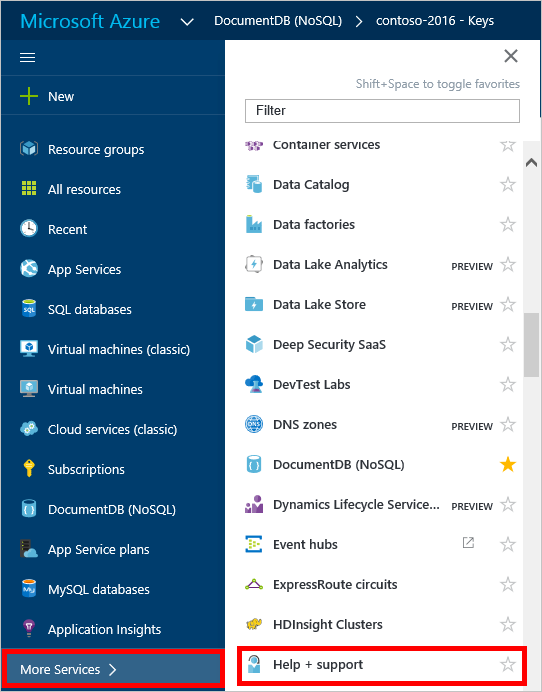
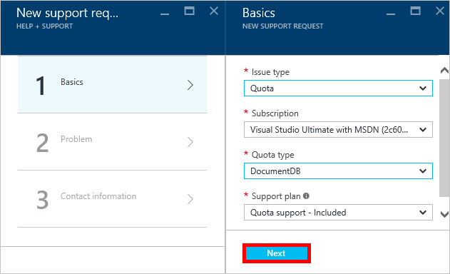
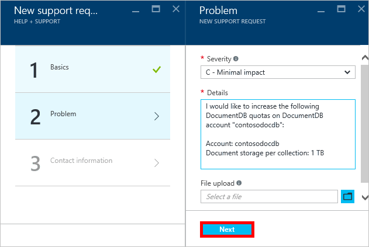

<properties
    pageTitle="Anforderung größerer DocumentDB Konto Kontingente | Microsoft Azure"
    description="Erfahren Sie, wie eine Anpassung auf DocumentDB Datenbank Kontingente wie Speicherung von Dokumenten und Durchsatz pro Websitesammlung anfordern."
    services="documentdb"
    authors="AndrewHoh"
    manager="jhubbard"
    editor="monicar"
    documentationCenter=""/>

<tags
    ms.service="documentdb"
    ms.workload="data-services"
    ms.tgt_pltfrm="na"
    ms.devlang="na"
    ms.topic="article"
    ms.date="08/25/2016"
    ms.author="anhoh"/>

# Anfordern von erhöhten DocumentDB Konto Grenzwerte

[Microsoft Azure DocumentDB](https://azure.microsoft.com/services/documentdb/) verfügt über eine Reihe von Standardkontingente, die durch Kontaktieren des Supports Azure angepasst werden kann.  In diesem Artikel wird gezeigt, wie ein Kontingent erhöhen anfordern.

Nach dem Lesen dieses Artikels, können Sie die folgenden Fragen beantworten ausführen:  

-   Das DocumentDB Datenbank Kontingente durch Kontaktieren des Supports Azure angepasst werden können?
-   Wie kann ich eine DocumentDB Konto Kontingent Anpassung anfordern?

##DocumentDB Konto von Kontingenten

Die folgende Tabelle beschreibt die Kontingente DocumentDB. Die Kontingente, die ein Sternchen (*) enthalten können durch Kontaktieren des Supports Azure angepasst werden:

[AZURE.INCLUDE [azure-documentdb-limits](../../includes/azure-documentdb-limits.md)]

##Anfordern einer Kontingent Anpassung
Die folgenden Schritte zeigen, wie eine Anpassung Kontingent anfordern.

1. Im [Portal Azure](https://portal.azure.com)klicken Sie auf **Weitere Dienste**, und klicken Sie dann auf **Hilfe + Support**.

    

2. Klicken Sie in das Blade **Hilfe + Support** auf **neu support-Anfragen**.

    

3. Klicken Sie in das **neue support-Anfragen** Blade **Grundlagen**auf. Nächste, legen **Problemtyp** auf **Kontingent**, Ihr Abonnement, die Ihre DocumentDB hostet- **Abonnement** zu berücksichtigen, **Kontingent Typ** auf **DocumentDB**und **Support-Plan** , **Kontingent SUPPORT - enthalten**. Klicken Sie dann auf **Weiter**.

    

4. Das **Problem** Blade wählen Sie eine schwere aus und enthalten Sie Informationen zu Ihrer Kontingent erhöhen **Details**. Klicken Sie auf **Weiter**.

    

5. Schließlich geben Sie Ihre Kontaktinformationen in das Blade **Kontaktinformationen** , und klicken Sie auf **Erstellen**.

Nachdem das Support-Ticket erstellt wurde, sollten Sie die Anzahl der Support Anforderung per e-Mail erhalten.  Sie können auch die Supportanfrage anzeigen, indem Sie auf in der **Hilfe + Support** Blade **Management Support anfordert** .

##Nächste Schritte
- Weitere Informationen zu DocumentDB zu finden, klicken Sie auf [hier](http://azure.com/docdb).
