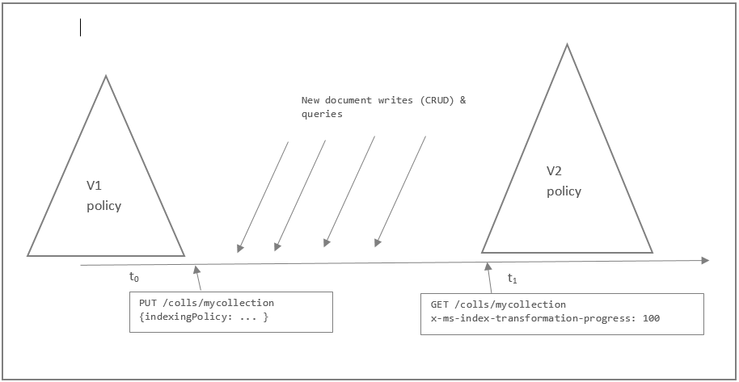

<properties 
    pageTitle="Indizierung Richtlinien DocumentDB | Microsoft Azure" 
    description="Indizierung Funktionsweise DocumentDB Informationen zum Konfigurieren und die Indizierung Richtlinie ändern. Konfigurieren der Indizierung Richtlinie innerhalb DocumentDB für die automatische Indizierung und eine höhere Performance." 
    keywords="wie Indizierung funktioniert, automatische Indizierung, Datenbank, Documentdb, Azure, Microsoft Azure Indizierung"
    services="documentdb" 
    documentationCenter="" 
    authors="arramac" 
    manager="jhubbard" 
    editor="monicar"/>

<tags 
    ms.service="documentdb" 
    ms.devlang="na" 
    ms.topic="article" 
    ms.tgt_pltfrm="na" 
    ms.workload="data-services" 
    ms.date="10/27/2016" 
    ms.author="arramac"/>

# DocumentDB Indizierung Richtlinien

Während viele Kunden gerne Azure DocumentDB automatisch [alle Aspekte der Indizierung](documentdb-indexing.md)behandeln lassen sind, unterstützt DocumentDB auch während der Erstellung angeben einer benutzerdefinierten **Richtlinie Indizierung** für Websitesammlungen. Indizierung Richtlinien in DocumentDB sind flexibler und leistungsfähige als sekundäre Indizes in einer anderen Datenbankplattformen angeboten, da sie mit entwerfen, und passen Sie die Form des Indexes ohne Schema Flexibilität beeinträchtigen. Wie Indizierung funktioniert in DocumentDB zu finden, müssen Sie wissen, dass durch die Verwaltung von Indizierung Richtlinie aus, die abgestimmte Kompromisse zwischen Index Speicher Verwaltungsaufwand, schreiben und Abfrage Durchsatz und Konsistenz der Abfrage vorgenommen werden können.  

In diesem Artikel wir betrachten Sie schließen DocumentDB Indizierung Richtlinien, wie Sie indizieren Richtlinie und die zugehörigen Kompromisse anpassen können. 

Nach dem Lesen dieses Artikels, können Sie die folgenden Fragen beantworten ausführen:

- Wie kann ich die Eigenschaften ein-oder Ausschließen von Indizierung überschreiben?
- Wie kann ich den Index tatsächlichen Updates konfigurieren?
- Wie kann ich konfigurieren, indizieren, um die Order By oder Bereich Abfragen ausführen?
- Wie ändern ich eine Auflistung indizieren Richtlinie?
- Wie vergleichen ich Speicherplatz und Leistung von anderen Indizierung Richtlinien?

##Anpassen der Richtlinie Indizierung einer Websitesammlung

Entwickler können die Kompromisse zwischen Speicher, Schreiben/Abfrage Leistung und Konsistenz Abfrage, durch die Indizierung Standardrichtlinie auf eine Auflistung DocumentDB überschreiben und so konfigurieren die folgenden Aspekte anpassen.

- **Einschließen/Ausschließen von Dokumenten und Pfade von/Index**. Entwickler können wählen Sie bestimmte Dokumente ausgeschlossen oder zum Zeitpunkt der einfügen oder Ersetzen von der Auflistung in den Index eingeschlossen werden soll. Entwickler haben die Möglichkeit zum ein- oder Ausschließen von bestimmter JSON-Eigenschaften auch bekannt als Pfade (einschließlich Platzhaltermustern) über Dokumente indiziert werden sollen, die in einem Index enthalten sind.
- **Konfigurieren von verschiedenen Indextypen**. Für alle Pfade enthalten können Entwickler auch angeben, der Typ des Indexes über eine Auflistung benötigten basierend auf ihre Daten und Abfrage Arbeitsbelastung und die numerischen/Zeichenfolge "Genauigkeit" für jeden Pfad erwartet.
- **Index aktualisieren Modi konfigurieren**. DocumentDB unterstützt drei Indizierung Modi, die über die Indizierung Richtlinien auf eine Auflistung DocumentDB konfiguriert werden können: konsistent, Lazy und keine. 

Im folgende .NET Codeausschnitt veranschaulicht, wie eine benutzerdefinierte Indizierung Richtlinie während der Erstellung einer Websitesammlung festlegen. Legen Sie hier die Richtlinie mit Bereich Index für Zeichenfolgen und Zahlen in der maximalen Genauigkeit. Bei dieser Richtlinie können uns die Order By-Abfragen für Zeichenfolgen ausführen.

    DocumentCollection collection = new DocumentCollection { Id = "myCollection" };
    
    collection.IndexingPolicy = new IndexingPolicy(new RangeIndex(DataType.String) { Precision = -1 });
    collection.IndexingPolicy.IndexingMode = IndexingMode.Consistent;
    
    await client.CreateDocumentCollectionAsync(UriFactory.CreateDatabaseUri("db"), collection);   

>[AZURE.NOTE] Das JSON-Schema für Indizierung Richtlinie wurde mit der Veröffentlichung von REST-API Version 2015-06-03 zur Unterstützung von Bereich Indizes gegen Zeichenfolgen geändert. .NET SDK 1.2.0 und Java, Python und Node.js SDKs 1.1.0 unterstützt das neue Richtlinienschema. Ältere SDKs die REST-API Version 2015-04-08 verwenden und das ältere Schema der Richtlinie Indizierung unterstützen.
>
>DocumentDB indiziert standardmäßig alle Zeichenfolgeneigenschaften innerhalb von Dokumenten mit einem Hashindex konsistente und numerische Eigenschaften mit einem Bereich Index.  

### Indizierung Modi Datenbank

DocumentDB unterstützt drei Indizierung Modi die über die Indizierung Richtlinien auf eine Auflistung DocumentDB – konfiguriert werden können konsistent, Lazy und keine.

**Konsistent**: Wenn eine DocumentDB-Auflistung Richtlinie als "konsistent" festgelegt ist, führen Sie die Abfragen auf einer bestimmten DocumentDB Auflistung die gleichen Ebene der Konsistenz gemäß Angabe für den Punkt-lesen (d. h. signifikante, begrenzt Veraltung Sitzung oder tatsächlichen). Der Index wird synchron als Teil der Aktualisierung (d. h. einfügen, ersetzen, aktualisieren und Löschen eines Dokuments in einer Websitesammlung DocumentDB) des Dokuments aktualisiert.  Konsistente Indizierung unterstützt konsistente Abfragen aber mögliche Reduzierung Eingangsdurchsatz schreiben. Diese Reduzierung ist eine Funktion der eindeutige Pfade, die indiziert werden müssen, und die Ebene"Konsistenz". Konsistente Indizierung Modus dient zur Auslastung "Abfrage sofort schnell, Schreiben".

**Lazy**: um maximale Aufnahme Dokumentdurchsatz zulassen, kann eine Auflistung DocumentDB mit aus-Konsistenz; konfiguriert werden Abfragen von Bedeutung sind später konsistent. Der Index ist asynchrone aktualisiert, wenn eine Auflistung DocumentDB quiescent h. ist, wenn der Auflistung Durchsatzkapazität nicht vollständig zu benutzeranforderungen dienen genutzt wird. "Aufnahme nun Abfrage später" Auslastung mit Anforderung der Erfassung ungehindert Dokument eventuell "aus-" Indizierung Modus geeignet.

**Keine**: eine Auflistung mit Indexmodus von "Keine" markiert hat keinen Index zugeordnet. Dies wird häufig verwendet, wenn DocumentDB als eine Schlüsselwert Speicher eingesetzt wird und Dokumente werden nur die ID-Eigenschaft zugreifen. 

>[AZURE.NOTE] Konfigurieren der Indizierung Richtlinie mit "Keine" wirkt sich auf alle vorhandenen Index löschen. Verwenden Sie diese Option aus, wenn Ihre Access-Mustern sind nur "Id" und/oder "Self link" anfordern.

Im folgenden Beispiel anzeigen, wie eine DocumentDB Auflistung mit .NET SDK und konsistente automatische Indizierung auf alle Dokument einfügungen erstellen.

Die folgende Tabelle zeigt die Konsistenz für Abfragen auf Grundlage der Indizierung Modus (konsistent und Lazy) so konfiguriert, dass für die Websitesammlung und die Konsistenz Ebene für die Abfrage Anforderung angegeben. Dies gilt für Abfragen, die mithilfe eines Benutzeroberflächen - REST-API SDKs vorgenommen oder innerhalb von gespeicherten Prozeduren und Trigger. 

<table border="0" cellspacing="0" cellpadding="0">
    <tbody>
        <tr>
            <td valign="top">
                

                

            </td>
            <td valign="top">
                

                    <strong>Konsistente</strong>
                

            </td>
            <td valign="top">
                

                    <strong>Verzögerte</strong>
                

            </td>            
        </tr>
        <tr>
            <td valign="top">
                

                    <strong>Starken</strong>
                

            </td>
            <td valign="top">
                

Starken 

            </td>
            <td valign="top">
                

Tatsächlichen 

            </td>            
        </tr>       
        <tr>
            <td valign="top">
                

                    <strong>Begrenzte Veraltung</strong>
                

            </td>
            <td valign="top">
                

Begrenzte Veraltung 

            </td>
            <td valign="top">
                

Tatsächlichen 

            </td>            
        </tr>          
        <tr>
            <td valign="top">
                

                    <strong>Sitzung</strong>
                

            </td>
            <td valign="top">
                

Sitzung 

            </td>
            <td valign="top">
                

Tatsächlichen 

            </td>            
        </tr>      
        <tr>
            <td valign="top">
                

                    <strong>Tatsächlichen</strong>
                

            </td>
            <td valign="top">
                

Tatsächlichen 

            </td>
            <td valign="top">
                

Tatsächlichen 

            </td>            
        </tr>         
    </tbody>
</table>

DocumentDB gibt einen Fehler für die Abfragen auf Websitesammlungen mit keine Indizierung Modus zurück. Abfragen können weiterhin ausgeführt werden, da scannt über die explizite `x-ms-documentdb-enable-scan` Kopf-oder Fußzeile die REST-API oder die `EnableScanInQuery` Option, die mit dem .NET SDK anfordern. Einige Abfragefeatures wie ORDER BY werden nicht unterstützt, als scannt mit `EnableScanInQuery`.

Die folgende Tabelle zeigt die Konsistenz für Abfragen auf Grundlage der Indizierung Modus (konsistent, Lazy und keiner) Wenn EnableScanInQuery angegeben wird.

<table border="0" cellspacing="0" cellpadding="0">
    <tbody>
        <tr>
            <td valign="top">
                

                

            </td>
            <td valign="top">
                

                    <strong>Konsistente</strong>
                

            </td>
            <td valign="top">
                

                    <strong>Verzögerte</strong>
                

            </td>       
            <td valign="top">
                

                    <strong>Keine</strong>
                

            </td>             
        </tr>
        <tr>
            <td valign="top">
                

                    <strong>Starken</strong>
                

            </td>
            <td valign="top">
                

Starken 

            </td>
            <td valign="top">
                

Tatsächlichen 

            </td>    
            <td valign="top">
                

Starken 

            </td>                
        </tr>       
        <tr>
            <td valign="top">
                

                    <strong>Begrenzte Veraltung</strong>
                

            </td>
            <td valign="top">
                

Begrenzte Veraltung 

            </td>
            <td valign="top">
                

Tatsächlichen 

            </td>      
            <td valign="top">
                

Begrenzte Veraltung 

            </td> 
        </tr>          
        <tr>
            <td valign="top">
                

                    <strong>Sitzung</strong>
                

            </td>
            <td valign="top">
                

Sitzung 

            </td>
            <td valign="top">
                

Tatsächlichen 

            </td>   
            <td valign="top">
                

Sitzung 

            </td>             
        </tr>      
        <tr>
            <td valign="top">
                

                    <strong>Tatsächlichen</strong>
                

            </td>
            <td valign="top">
                

Tatsächlichen 

            </td>
            <td valign="top">
                

Tatsächlichen 

            </td>      
            <td valign="top">
                

Tatsächlichen 

            </td>              
        </tr>         
    </tbody>
</table>

Im folgenden Beispiel Code anzeigen und erstellen wie eine DocumentDB Auflistung mit .NET SDK und konsistente Indizierung auf alle Dokument einfügungen aus.

     // Default collection creates a hash index for all string and numeric    
     // fields. Hash indexes are compact and offer efficient
     // performance for equality queries.
     
     var collection = new DocumentCollection { Id ="defaultCollection" };
     
     collection.IndexingPolicy.IndexingMode = IndexingMode.Consistent;
     
     collection = await client.CreateDocumentCollectionAsync(UriFactory.CreateDatabaseUri("mydb"), collection);

### Index Wege

DocumentDB Modelle JSON-Dokumente und den Index als Strukturen und ermöglicht es Ihnen, Richtlinien für Pfade innerhalb der Struktur zu optimieren. Weitere Informationen hierzu finden Sie in dieser [Einführung DocumentDB Indizierung](documentdb-indexing.md). In Dokumenten können Sie auswählen, welche Pfade enthalten oder von der Indizierung ausgeschlossen werden müssen. Wenn die Abfragemuster im Voraus bekannt sind, kann dies schreiben verbesserte Leistung und unteren Index-Speicher für Szenarien anbieten.

Index Pfade mit dem Stamm (/) beginnen und enden normalerweise mit der? Platzhalterzeichen, die angibt, dass es mehrere mögliche Werte für das Präfix gibt. Um beispielsweise wählen dienen * von Familien F WHERE F.familyName = "Andersen" suchen, müssen Sie einen Indexpfad für /familyName/ einbeziehen? in der Auflistung Index Richtlinie.

Index Pfade können auch das Platzhalterzeichen *zur Angabe des Verhaltens für Pfade rekursiv unter dem Präfix. Beispielsweise /payload/* alles unter der Eigenschaft Nutzlast Indizierung ausschließen verwendet werden können.

Hier sind die allgemeine Muster zum Angeben von Pfaden Index:

<table border="0" cellspacing="0" cellpadding="0">
    <tbody>
        <tr>
            <td valign="top">
                

                    <strong>Pfad</strong>
                

            </td>
            <td valign="top">
                

                    <strong>Beschreibung/Anwendungsfall-</strong>
                

            </td>
        </tr>
        <tr>
            <td valign="top">
                

                    /*
                

            </td>
            <td valign="top">
                

Standardpfad für die Websitesammlung. Rekursive und gesamte Dokumentstruktur gilt.
                

            </td>
        </tr>
        <tr>
            <td valign="top">
                

/ Prop /?
                

            </td>
            <td valign="top">
                

Indexpfad zum Verarbeiten der Abfragen wie den folgenden erforderlichen (mit Hash oder Bereich eingibt Hilfethemas): 

                

Wählen Sie * aus Websitesammlung c WHERE c.prop = "Wert" 

                

Wählen Sie * aus Websitesammlung c WHERE c.prop &gt; 5 

                

Wählen Sie * aus Websitesammlung C ORDER BY c.prop 
                
            </td>
        </tr>
        <tr>
            <td valign="top">
                

/ Prop / * 

            </td>
            <td valign="top">
                

Indexpfad für alle Pfade unter der angegebenen Bezeichnung. Funktioniert mit den folgenden Abfragen 

                

Wählen Sie * aus Websitesammlung c WHERE c.prop = "Wert" 

                

Wählen Sie * aus Websitesammlung c WHERE c.prop.subprop &gt; 5 

                

Wählen Sie * aus Websitesammlung c WHERE c.prop.subprop.nextprop = "Wert" 

                

Wählen Sie * aus Websitesammlung C ORDER BY c.prop 

            </td>
        </tr>
        <tr>
            <td valign="top">
                

/ Ausstellungsstücke / [] /?
                

            </td>
            <td valign="top">
                

Indexpfad verpflichtet, dienen Iteration und Abfragen für Arrays von skalare wie ["a", "b", "C"] teilnehmen: 

                

Wählen Sie Kategorisieren von Kategorie IN collection.props WHERE Kategorie = "Wert" 

                

SELECT-Tags aus einer Websitesammlung C Verknüpfung Kategorie IN c.props, kategorisieren > 5 

            </td>
        </tr>
        <tr>
            <td valign="top">
                

/props/ [] /subprop/?
                

            </td>
            <td valign="top">
                

Indexpfad zum Verarbeiten der Iteration erforderlichen und Verknüpfungsabfragen für Arrays von Objekten wie [{Subprop: "a"}, {Subprop: "b"}]: 

                

Wählen Sie Kategorisieren von Kategorie IN collection.props WHERE tag.subprop = "Wert" 

                

Wählen Sie Kategorisieren von Websitesammlung C Verknüpfung Kategorie IN c.props WHERE tag.subprop = "Wert" 

            </td>
        </tr>        
        <tr>
            <td valign="top">
                

/ Prop/Subprop /?
                

            </td>
            <td valign="top">
                

Indexpfad zum Verarbeiten der Abfragen erforderlichen (mit Hash oder Bereich eingibt Hilfethemas): 

                

Wählen Sie * aus Websitesammlung c WHERE c.prop.subprop = "Wert" 

                

Wählen Sie * aus Websitesammlung c WHERE c.prop.subprop &gt; 5 

                

Wählen Sie * aus Websitesammlung C ORDER BY c.prop.subprop 
                
            </td>
        </tr>
    </tbody>
</table>

>[AZURE.NOTE] Beim Festlegen von benutzerdefinierten Index Wege, müssen Sie die Indizierung Standard-Regel für die gesamte Dokumentstruktur gekennzeichnet durch den Pfad der Inhalte angeben "/ *". 

Im folgenden Beispiel konfiguriert einen bestimmten Pfad mit Bereich Indizierung und einen benutzerdefinierten Genauigkeitswert 20 Bytes:

    var collection = new DocumentCollection { Id = "rangeSinglePathCollection" };    
    
    collection.IndexingPolicy.IncludedPaths.Add(
        new IncludedPath { 
            Path = "/Title/?", 
            Indexes = new Collection<Index> { 
                new RangeIndex(DataType.String) { Precision = 20 } } 
            });

    // Default for everything else
    collection.IndexingPolicy.IncludedPaths.Add(
        new IncludedPath { 
            Path = "/*" ,
            Indexes = new Collection<Index> {
                new HashIndex(DataType.String) { Precision = 3 }, 
                new RangeIndex(DataType.Number) { Precision = -1 } 
            }
        });
        
    collection = await client.CreateDocumentCollectionAsync(UriFactory.CreateDatabaseUri("db"), pathRange);

### Index Datentypen, Arten und geht

Jetzt, da wir wollen so Pfade angeben geöffnet haben, sehen wir uns den Optionen, die wir verwenden können, um die Indizierung Richtlinie für einen Pfad zu konfigurieren. Sie können eine oder mehrere Indizierung Definitionen für jede Pfad angeben:

- Datentyp: **Zeichenfolge**, **Zahl**, **Punkt**, **Polygon**oder **LineString** (nur einen Eintrag pro Datentyp pro Pfad können enthalten)
- Indizieren Art: **Hash** (Gleichheit Abfragen), **Bereich** (Gleichheit, Bereich oder Order By-Abfragen) oder **räumlichen** (raumbezogener Abfragen) 
- Genauigkeit: 1-8 oder-1 (Maximum Genauigkeit) für eine Zahl, Zeichenfolge (maximale Genauigkeit) mit 1-100

#### Index Art

DocumentDB unterstützt Raute und Bereich Index Arten für jede Pfad (die Zeichenfolgen, Zahlen oder beides konfiguriert können).

- **Hash** unterstützt effiziente Gleichheit und JOIN-Abfragen. In den meisten Fällen verwenden Hash Indizes eine höhere Genauigkeit als den Standardwert von 3 Bytes ist erforderlich. Datentyp kann Zeichenfolge oder eine Zahl sein.
- **Bereich** unterstützt effiziente Gleichheit Abfragen Bereichsabfragen (mit >, <>; =, < =,! =), und die Order By-Abfragen. Standardmäßig die Order By-Abfragen erfordern auch maximale Index Genauigkeit (-1). Datentyp kann Zeichenfolge oder eine Zahl sein.

DocumentDB unterstützt auch die Art der räumlichen Index für jede Path, die für den Punkt, Polygon oder LineString-Datentypen angegeben werden kann. Der Wert unter dem angegebenen Pfad muss ein gültiger GeoJSON Fragment wie `{"type": "Point", "coordinates": [0.0, 10.0]}`.

- **Räumlichen** unterstützt effiziente räumliche (innerhalb und Abstand) Abfragen. Datentyp kann Punkt, Polygon oder LineString sein.

>[AZURE.NOTE] DocumentDB unterstützt das automatische Indizierung Punkte, Polygone und LineStrings.

Hier sind die unterstützten Index Arten und Beispiele für Abfragen, bei denen es sich um können verwendet, um dienen:

<table border="0" cellspacing="0" cellpadding="0">
    <tbody>
        <tr>
            <td valign="top">
                

                    <strong>Index Art</strong>
                

            </td>
            <td valign="top">
                

                    <strong>Beschreibung/Anwendungsfall-</strong>
                

            </td>
        </tr>
        <tr>
            <td valign="top">
                

Hash 

            </td>
            <td valign="top">
                

Hashing über/Prop /? (oder /*) können verwendet werden, um die folgenden Abfragen effektiv zu bedienen: Wählen Sie* AUS Sammlung c WHERE c.prop = "Wert" Hash über/Ausstellungsstücke / [] /? (oder /* oder /props/*) können verwendet werden, um die folgenden Abfragen effektiv zu bedienen: Wählen Sie kategorisieren aus Websitesammlung C Verknüpfung Kategorie IN c.props WHERE Kategorie = 5 

            </td>
        </tr>
        <tr>
            <td valign="top">
                

Bereich 

            </td>
            <td valign="top">
                

Bereich über/Prop /? (oder /*) können verwendet werden, um die folgenden Abfragen effektiv zu bedienen: Wählen Sie* AUS Sammlung c WHERE c.prop = "Wert" auswählen *aus einer Websitesammlung c, in dem c.prop > 5 auswählen,* aus einer Websitesammlung C ORDER BY c.prop 

            </td>
        </tr>
        <tr>
            <td valign="top">
                

Räumliche 

            </td>
            <td valign="top">
                

Bereich über/Prop /? (oder /*) können verwendet werden, um die folgenden Abfragen effektiv zu bedienen: Wählen Sie* AUS Sammlung wählen Sie c, wo ST_DISTANCE(c.prop, {"type": "Point", "coordinates": [0.0, 10.0]}) < 40 *Websitesammlung c, wo ST_WITHIN(c.prop, {"type": "Polygon",...}) – mit Indizierung aktiviert Punkte wählen* aus Websitesammlung c, wo ST_WITHIN({"type": "Point",...}, c.prop) – mit Indizierung auf Polygone aktiviert 

            </td>
        </tr>        
    </tbody>
</table>

Standardmäßig wird ein Fehler zurückgegeben, für Abfragen mit Operatoren wie Bereichs > = Wenn akzeptieren, um darauf hinzuweisen, dass ein Scan erforderlich sind, um die Abfrage dienen möglicherweise kein Bereich Index (an einem beliebigen Genauigkeit) vorliegt. Bereichsabfragen können ohne einen Bereich Index mithilfe der Kopfzeile X-ms-Documentdb-aktivieren-Scan in die REST-API oder die EnableScanInQuery Anforderung Option mit .NET SDK ausgeführt werden. Wenn in der Abfrage, dass DocumentDB den Index verwenden, um gegen filtern, und klicken Sie dann kein Fehler zurückgegeben werden wird, alle anderen Filter sind.

Die gleichen Regeln gelten für raumbezogener Abfragen. Standardmäßig wird ein Fehler für raumbezogener Abfragen zurückgegeben, wenn kein räumlichen Index, und es werden keine weiteren Filter, die der Index bereitgestellt werden können. Sie können ein Scan mit X-ms-Documentdb-aktivieren-Scan/EnableScanInQuery ausgeführt werden.

#### Index Genauigkeit

Index Genauigkeit können Sie Abfrageeffizienz Index-Speicher Verwaltungsaufwand und Leistung von Abfragen. Zahlen wird empfohlen, mit der standardmäßigen Genauigkeit Konfiguration von-1 ("maximum"). Da die Zahlen in JSON 8 Bytes sind, ist dies gleichbedeutend mit einer Konfiguration von 8 Bytes. Auswählen eines unteren Werts für Genauigkeit, z. B. 1 bis 7, bedeutet, dass die Werte in einige Bereiche mit dem gleichen Indexeintrag zuordnen. Fordern Sie Einheiten, daher reduziert Sie Speicherplatz Index, aber Ausführung der Abfrage möglicherweise mehrere Dokumente verarbeiten und daher mehr Durchsatz d. h. nutzen.

Index Genauigkeit Konfiguration verfügt über weitere praktische Anwendung mit Zeichenfolge Bereiche. Da Zeichenfolgen alle beliebiger Länge sein können, kann die Wahl der Genauigkeit Index beeinflussen, die Leistung von Zeichenfolge Bereichsabfragen und beeinflussen, den verfügbaren Speicherplatz Index erforderlich. Zeichenfolge Bereich Indizes können mit 100-1 oder-1 ("maximum") konfiguriert sein. Wenn Sie die Order By-Abfragen in Zeichenfolgeneigenschaften ausführen möchten, müssen Sie eine Genauigkeit von-1 für den entsprechenden Pfaden angeben.

Indizes immer verwenden die standardmäßigen Index Genauigkeit für alle Typen (Punkte, LineStrings und Polygone) und können nicht außer Kraft gesetzt werden. 

Im folgenden Beispiel wird gezeigt, wie um die Genauigkeit für Bereich Indizes in einer Websitesammlung mit .NET SDK zu erhöhen. 

**Erstellen einer Websitesammlung mit einer benutzerdefinierten Index Genauigkeit**

    var rangeDefault = new DocumentCollection { Id = "rangeCollection" };
    
    // Override the default policy for Strings to range indexing and "max" (-1) precision
    rangeDefault.IndexingPolicy = new IndexingPolicy(new RangeIndex(DataType.String) { Precision = -1 });

    await client.CreateDocumentCollectionAsync(UriFactory.CreateDatabaseUri("db"), rangeDefault);   

> [AZURE.NOTE] DocumentDB gibt einen Fehler zurück, wenn eine Abfrage Order By verwendet, aber keinen Bereich Index gegen den abgefragte Pfad mit der maximalen Genauigkeit. 

Auf ähnliche Weise können Pfade vollständig Indizierung ausgeschlossen werden müssen. Im nächsten Beispiel wird gezeigt, wie einen gesamten Abschnitt der Dokumente (auch bekannt als ausschließen eine untergeordnete Struktur) aus Indizierung mithilfe der "*" Platzhalterzeichen.

    var collection = new DocumentCollection { Id = "excludedPathCollection" };
    collection.IndexingPolicy.IncludedPaths.Add(new IncludedPath { Path = "/*" });
    collection.IndexingPolicy.ExcludedPaths.Add(new ExcludedPath { Path = "/nonIndexedContent/*");
    
    collection = await client.CreateDocumentCollectionAsync(UriFactory.CreateDatabaseUri("db"), excluded);

## Explizite und sich entscheiden, von Indizierung

Sie können auswählen, ob die Sammlung automatisch alle Dokumente indiziert werden soll. Standardmäßig alle Dokumente werden automatisch indiziert, aber Sie können auswählen, um diese zu deaktivieren. Wenn die Indizierung deaktiviert ist, Dokumente zugegriffen werden können nur über ihre Self links oder von Abfragen mit ID

Mit der automatischen Indizierung deaktiviert, können Sie dennoch Selektives nur bestimmte Dokumente auf den Index hinzufügen. Umgekehrt können lassen Sie automatische Indizierung auf und nur bestimmte Dokumente ausschließen einzeln auswählen. Ein-/ausschalten Konfigurationen Indizierung sind nützlich, wenn Sie nur eine Teilmenge der Dokumente haben, die abgefragt werden müssen.

Im folgende Beispiel zeigt beispielsweise wie ein Dokuments explizit mithilfe der [DocumentDB.NET SDK](https://github.com/Azure/azure-documentdb-java) und die Eigenschaft [RequestOptions.IndexingDirective](http://msdn.microsoft.com/library/microsoft.azure.documents.client.requestoptions.indexingdirective.aspx) aufnehmen möchten.

    // If you want to override the default collection behavior to either
    // exclude (or include) a Document from indexing,
    // use the RequestOptions.IndexingDirective property.
    client.CreateDocumentAsync(UriFactory.CreateDocumentCollectionUri("db", "coll"),
        new { id = "AndersenFamily", isRegistered = true },
        new RequestOptions { IndexingDirective = IndexingDirective.Include });

## Ändern der Richtlinie Indizierung einer Websitesammlung

DocumentDB können Sie die Richtlinie Indizierung einer Websitesammlung im laufenden Betrieb zu ändern. Eine Änderung in Indizierung Richtlinie auf eine Auflistung DocumentDB kann dazu führen, dass eine Änderung in der Form von den Index, einschließlich, den der Pfade indiziert werden können, deren Genauigkeit als auch das Modell Konsistenz des Indexes selbst. Daher erfordert eine Änderung im Indizierung Richtlinie, effektiv eine Transformation des alten Indexes in ein neues. 

**Online Index Transformationen**

Index Transformationen vorgenommen wurden online, was bedeutet, dass die Dokumente, die pro die alte Richtlinie indiziert effizient pro der neuen Richtlinie **ohne Auswirkung auf die Verfügbarkeit schreiben oder der bereitgestellte Durchsatz** der Sammlung transformiert werden. Die Konsistenz der lesen und Schreiben Sie mithilfe der REST-API, SDKs vorgenommenen Vorgänge oder innerhalb von gespeicherten Prozeduren und Triggern wird nicht beeinträchtigt, während Index Transformation. Dies bedeutet, dass es ist kein Leistungsabfall oder die Ausfallzeiten zu Ihrer apps, wenn Sie eine Indizierung Richtlinie ändern.

Während der Zeit, die Index Transformation Fortschritt ist, sind jedoch Abfragen später konsistent unabhängig von der Modus Indizierungskonfiguration (konsistent oder Lazy). Dies auch gilt für Abfragen von allen Schnittstellen – REST-API-SDK, und innerhalb von gespeicherten Prozeduren und Trigger. Wie wird mit Lazy Indizierung, Index Transformation asynchrone im Hintergrund auf den Replikaten mit den verfügbaren freien Ressourcen für ein bestimmtes Replikat ausgeführt. 

Index Transformationen auch **in-situ-** (an Ort) vorgenommen wurden, d. h. DocumentDB nicht zwei Kopien des Indexes verwalten und den alten Index, durch den neuen austauschen. Dies bedeutet, dass kein zusätzlicher Speicherplatz erforderlich ist, oder in Ihrer Websitesammlungen verbraucht, während die Index-Transformation.

Wenn Sie die Indizierung Richtlinie ändern, wie die Änderungen angewendet werden, um den alten Index in das neue eine hauptsächlich hängen davon ab, die Indizierung Modus Konfigurationen ähnlicher, als die anderen Werte wie verschieben aufgenommen oder daraus ausgeschlossen Pfade, Index Arten und geht. Wenn Ihre alten und neuen Richtlinien konsistent Indizierung verwenden möchten, klicken Sie dann DocumentDB eine Transformation online Index ausgeführt. Eine weitere Indizierung Richtlinie Änderung mit konsistenten Indizierung Modus können nicht angewendet werden, während die Transformation ausgeführt wird.

Sie können jedoch verschieben Lazy oder keine Indizierung Modus, während eine Transformation ausgeführt wird. 

- Wenn Sie an Lazy verschieben, die Index Richtlinie Änderung vorgenommen effektiven sofort und DocumentDB startet den Index asynchrone Neuerstellen. 
- Wenn Sie keine verschieben, wird der Index effektiven sofort verworfen. Verschieben keine ist sinnvoll, wenn Sie in Bearbeitung befindlichen stornieren möchten Transformation und mit einer anderen Indizierung Richtlinie frisch starten. 

Wenn Sie das .NET SDK verwenden, können Sie eine Indizierung Richtlinie Änderung mithilfe der neuen **ReplaceDocumentCollectionAsync** Methode Starten eines und die Index-Transformation mithilfe der **IndexTransformationProgress** Antwort Eigenschaft aus einem Anruf **ReadDocumentCollectionAsync** Prozentsatz überwachen. Andere SDKs und die REST-API unterstützen entsprechenden Eigenschaften und Methoden für die Indizierung Richtlinie Änderung.

Hier ist ein Codeausschnitt, der wird gezeigt, wie eine Auflistung indizieren Richtlinie aus konsistenten Indizierung Modus Lazy ändern.

**Ändern der Indizierung Richtlinie aus konsistent aus-**

    // Switch to lazy indexing.
    Console.WriteLine("Changing from Default to Lazy IndexingMode.");

    collection.IndexingPolicy.IndexingMode = IndexingMode.Lazy;

    await client.ReplaceDocumentCollectionAsync(collection);

Wie unten dargestellt, können Sie den Fortschritt einer Transformation Index überprüfen, indem Sie ReadDocumentCollectionAsync, beispielsweise.

**Nachverfolgen des Status von Index-Transformation zurück**

    long smallWaitTimeMilliseconds = 1000;
    long progress = 0;

    while (progress < 100)
    {
        ResourceResponse<DocumentCollection> collectionReadResponse = await client.ReadDocumentCollectionAsync(
            UriFactory.CreateDocumentCollectionUri("db", "coll"));

        progress = collectionReadResponse.IndexTransformationProgress;

        await Task.Delay(TimeSpan.FromMilliseconds(smallWaitTimeMilliseconds));
    }

Sie können den Index für eine Websitesammlung löschen, indem Sie keine Indizierung Modus verschieben. Dies möglicherweise Betrieb hilfreich sein, wenn Sie eine Transformation in Bearbeitung abbrechen und eine neue sofort starten möchten.

**Löschen des Indexes für eine Websitesammlung**

    // Switch to lazy indexing.
    Console.WriteLine("Dropping index by changing to to the None IndexingMode.");

    collection.IndexingPolicy.IndexingMode = IndexingMode.None;

    await client.ReplaceDocumentCollectionAsync(collection);

Wann würden Sie indizieren Richtlinie Ihrer Websitesammlungen DocumentDB ändern? Im folgenden sind die am häufigsten verwendeten Anwendungsmöglichkeiten:

- Dienen Sie konsistente Ergebnisse während normaler Vorgang, aber Herbst wieder in die verzögerte Indizierung während Massenimporte
- Z. B., wie Geodaten Abfragen, der die Art der räumlichen Index erforderlich, oder sortieren / Bereichsabfragen, die die Zeichenfolge Bereich Index Art erfordern Zeichenfolge Indizierung Features auf Ihrer aktuellen DocumentDB Websitesammlungen Start mit der neuen
- Hand wählen Sie die Eigenschaften indiziert werden und ändern diese über einen Zeitraum
- Optimieren von Indizierung Genauigkeit zum Verbessern der Leistung von Abfragen oder Speicher verbraucht verringern

>[AZURE.NOTE] Wenn Indizierung mit ReplaceDocumentCollectionAsync Richtlinie ändern möchten, benötigen Sie Version > = 1.3.0 von .NET SDK
>
> Für Index Transformation erfolgreich abgeschlossen müssen Sie sicherstellen, dass Sie auf die Auflistung ausreichend freier Speicherplatz verfügbar ist. Wenn die Sammlung das Speicherkontingent erreicht, wird die Index-Transformation angehalten werden. Index Transformation wird automatisch fortsetzen, wenn Speicherplatz zur Verfügung steht, z. B., wenn Sie einige Dokumente löschen.

## Optimieren der Leistung

Die DocumentDB-APIs bieten Informationen zu Performance-Werte, wie etwa die Index-Speicher verwendet, und die Kosten Durchsatz (Anforderung Einheiten) für jeden Vorgang an. Diese Informationen kann zum Vergleichen von verschiedenen Indizierung Richtlinien verwendet werden und für die Leistung zu optimieren.

Aktivieren Sie das Speicherkontingent und die Verwendung einer Websitesammlung, führen Sie eine Kopf oder GET-Anforderung für die Websitesammlung Ressource, und prüfen die X-ms-Anforderung-Kontingent und die X-ms-Anforderung-Verwendung Überschriften. In den Eigenschaften .NET SDK, [DocumentSizeQuota](http://msdn.microsoft.com/library/dn850325.aspx) und [DocumentSizeUsage](http://msdn.microsoft.com/library/azure/dn850324.aspx) in [ResourceResponse < T\> ](http://msdn.microsoft.com/library/dn799209.aspx) diese entsprechender Werte enthalten.

     // Measure the document size usage (which includes the index size) against   
     // different policies.
     ResourceResponse<DocumentCollection> collectionInfo = await client.ReadDocumentCollectionAsync(UriFactory.CreateDocumentCollectionUri("db", "coll"));  
     Console.WriteLine("Document size quota: {0}, usage: {1}", collectionInfo.DocumentQuota, collectionInfo.DocumentUsage);

Messen, den Verwaltungsaufwand der Indizierung auf jedem Schreibvorgang (erstellen, aktualisieren oder löschen), prüfen Sie die X-ms-Anforderung-Gebühr Kopfzeile (oder die entsprechende [RequestCharge](http://msdn.microsoft.com/library/dn799099.aspx) -Eigenschaft in [ResourceResponse < T\> ](http://msdn.microsoft.com/library/dn799209.aspx) im .NET SDK) messen, die Anzahl der Anfrage Einheiten, die von diesen Operationen verbraucht.

     // Measure the performance (request units) of writes.     
     ResourceResponse<Document> response = await client.CreateDocumentAsync(UriFactory.CreateDocumentCollectionUri("db", "coll"), myDocument);              
     Console.WriteLine("Insert of document consumed {0} request units", response.RequestCharge);
     
     // Measure the performance (request units) of queries.    
     IDocumentQuery<dynamic> queryable =  client.CreateDocumentQuery(UriFactory.CreateDocumentCollectionUri("db", "coll"), queryString).AsDocumentQuery();

     double totalRequestCharge = 0;
     while (queryable.HasMoreResults)
     {
        FeedResponse<dynamic> queryResponse = await queryable.ExecuteNextAsync<dynamic>(); 
        Console.WriteLine("Query batch consumed {0} request units",queryResponse.RequestCharge);
        totalRequestCharge += queryResponse.RequestCharge;
     }
     
     Console.WriteLine("Query consumed {0} request units in total", totalRequestCharge);

## Änderungen an der Indizierung Richtlinie Spezifikation
Eine Änderung im Schema für Indizierung Richtlinie wurde am 7 Juli 2015 REST API Version 2015-06-03 eingeführt werden. Die entsprechenden Klassen in den SDK-Versionen haben neue Implementierungen, um das Schema zu entsprechen. 

Die folgenden Änderungen wurden in der JSON-Spezifikation implementiert:

- Indizierung Richtlinie unterstützt Bereich Indizes für Zeichenfolgen
- Jeder Pfad kann mehrere Indexdefinitionen, eine für jeden Datentyp aufweisen.
- Indizierung Genauigkeit unterstützt 1-8 für Zahlen, 1-100 für Zeichenfolgen und-1 (maximale Genauigkeit)
- Einen doppelten Anführungszeichen jeder Pfad Escapezeichen für erforderlich Pfade Segmente nicht. Beispielsweise können Sie einen Pfad für/Titel/hinzufügen? statt / "Titel" /?
- Als Stammpfad darstellt "alle Pfade" dargestellt werden kann / * (zusätzlich zu /)

Wenn Sie Code dieser Vorschriften Websitesammlungen mit einer benutzerdefinierten Indizierung Richtlinie mit Version 1.1.0 .NET SDK oder ältere geschrieben haben, müssen Sie den Anwendungscode, um diese Änderungen zu behandeln, um zu SDK, Version 1.2.0 verschieben zu ändern. Wenn Sie nicht Code, der Indizierung Richtlinie konfiguriert haben, oder weiterhin eine ältere Version des SDK verwenden möchten, sind keine Änderungen erforderlich.

Einen praktischen Vergleich zwischen ist hier ein Beispiel für benutzerdefinierte Indizierung Richtlinie geschrieben, verwenden die REST-API Version 2015-06-03 als auch die vorherige Version 2015-04-08.

**Vorherige Indizierung Richtlinie JSON**

    {
       "automatic":true,
       "indexingMode":"Consistent",
       "IncludedPaths":[
          {
             "IndexType":"Hash",
             "Path":"/",
             "NumericPrecision":7,
             "StringPrecision":3
          }
       ],
       "ExcludedPaths":[
          "/\"nonIndexedContent\"/*"
       ]
    }

**Aktuelle Indizierung Richtlinie JSON**

    {
       "automatic":true,
       "indexingMode":"Consistent",
       "includedPaths":[
          {
             "path":"/*",
             "indexes":[
                {
                   "kind":"Hash",
                   "dataType":"String",
                   "precision":3
                },
                {
                   "kind":"Hash",
                   "dataType":"Number",
                   "precision":7
                }
             ]
          }
       ],
       "ExcludedPaths":[
          {
             "path":"/nonIndexedContent/*"
          }
       ]
    }

## Nächste Schritte

Führen Sie die Links unterhalb Index Richtlinie Management Beispiele und Weitere Informationen zu DocumentDBs Abfragesprache aus.

1.  [DocumentDB .NET Index Management Codebeispielen](https://github.com/Azure/azure-documentdb-net/blob/master/samples/code-samples/IndexManagement/Program.cs)
2.  [DocumentDB REST-API Collection Vorgänge](https://msdn.microsoft.com/library/azure/dn782195.aspx)
3.  [Abfrage mit DocumentDB SQL](documentdb-sql-query.md)

 

