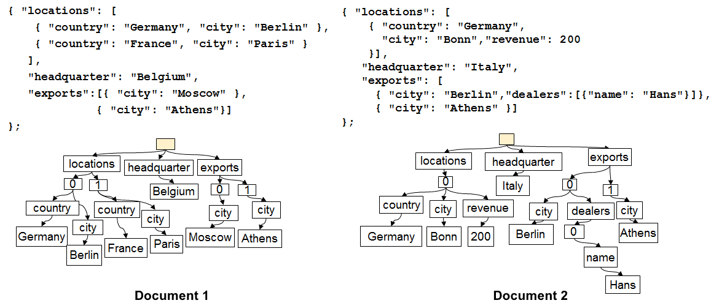
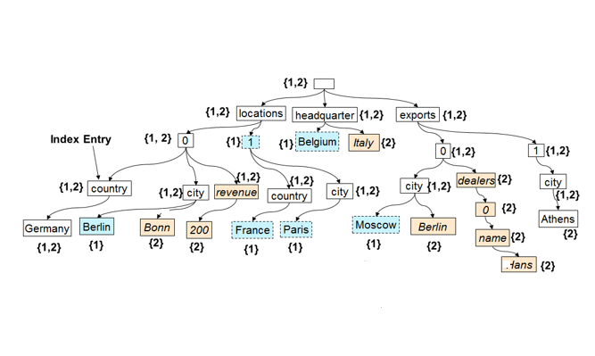

<properties 
    pageTitle="Automatische Indizierung in DocumentDB | Microsoft Azure" 
    description="Informationen Sie zu Funktionsweise der automatischen Indizierung arbeitet in Azure DocumentDB." 
    services="documentdb" 
    authors="arramac" 
    manager="jhubbard" 
    editor="mimig" 
    documentationCenter=""/>

<tags 
    ms.service="documentdb" 
    ms.workload="data-services" 
    ms.tgt_pltfrm="na" 
    ms.devlang="na" 
    ms.topic="article" 
    ms.date="10/27/2016" 
    ms.author="arramac"/>
    
# Automatische in Azure DocumentDB Indizierung

In diesem Artikel stammt aus Papier ["Schema-unabhängige Indizierung mit Azure DocumentDB"](http://www.vldb.org/pvldb/vol8/p1668-shukla.pdf) , die auf der [41st internen Konferenz bei sehr großen Datenbanken](http://www.vldb.org/2015/) zwischen dem 31. August - 4 September 2015 präsentiert wird, und ist eine Einführung in wie Indizierung arbeitet in Azure DocumentDB. 

Nach dem Lesen, Sie werden werden die folgenden Fragen beantworten:

- Wie leitet DocumentDB das Schema aus einem JSON-Dokument?
- Wie wird DocumentDB ein Indexes in unterschiedlichen Dokumenten erstellt?
- Wie führt DocumentDB durch automatische Indizierung bei?

##Funktionsweise der DocumentDB Indizierung

[Microsoft Azure DocumentDB](https://azure.microsoft.com/services/documentdb/) ist WAHR Schema frei Datenbank zwecks für JSON erstellt. Nicht erwartet oder Schema oder sekundären Indexdefinitionen zum Indizieren von Daten bei benötigt. So können Sie schnell erkennen und bewerten Anwendung Datenmodelle DocumentDB verwenden. Wenn Sie Dokumente zu einer Websitesammlung hinzufügen, indiziert DocumentDB automatisch alle Dokumenteigenschaften, damit sie Sie für die Abfrage verfügbar sind. Automatische Indizierung ermöglicht Ihnen das Speichern von Dokumenten, die vollständig beliebig Schemas ohne kümmern Schemas oder sekundäre Indizes angehören.

Mit dem Ziel, um die Impedanz Nichtübereinstimmung zwischen der Datenbank und die Application programming Modelle unterdrücken nutzt DocumentDB einfach zu verwendenden JSON und verbessert die einer Spezifikation Schema aus. Es kann keine Rückschlüsse Dokumente und kann Dokumente in einer Sammlung DocumentDB im Schema, zusammen mit den Werten, bestimmte Instanz variieren. Im Gegensatz zu anderen Dokumentendatenbanken arbeitet DocumentDBs Datenbank-Engine direkt auf der Ebene der JSON-Grammatik, verbleibende unabhängig zu des Konzepts der ein Dokumentschema und Weichzeichnen die Begrenzungslinie zwischen den Werten Struktur und Instanz von Dokumenten aus. Diese, in-aktivieren, er automatisch indizieren Dokumenten ohne Schema oder sekundäre Indizes, ermöglicht.

Die Indizierung in DocumentDB nutzt das Verhalten von JSON-Grammatik Dokumente, die **als Strukturen dargestellt**werden kann. Für ein JSON-Dokument als Struktur dargestellt werden soll muss ein-platzhalterprodukt-Stammknoten die Eltern dabei, des Rest der ist-Knoten im Dokument unter erstellt werden. Jedes Etikett, einschließlich der Matrix Indizes in einem JSON-Dokument wird ein Knoten in der Baumstruktur. Die folgende Abbildung illustriert ein Beispiel JSON-Dokument und die Darstellung der entsprechenden Struktur.

>[AZURE.NOTE] Da JSON sich selbst beschreiben ist d. h. jedes Dokument enthält Schema (Metadaten) und Daten, z. B. `{"locationId": 5, "city": "Moscow"}` werden, dass es zwei Eigenschaften gibt `locationId` und `city`, und dass sie einen numerischen und Eigenschaftswerte aufweisen. DocumentDB kann das Schema von Dokumenten und Indizieren Sie diese Option, wenn sie eingefügt oder ersetzt, ohne dass jemals Schemas oder sekundäre Indizes definiert werden.

**JSON-Dokumente als Strukturen:**

Angenommen, in der oben gezeigten Beispiel:

- Die JSON-Eigenschaft `{"headquarters": "Belgium"}` Eigenschaft im obigen Beispiel der Pfad/zentrale/Belgien entspricht.
- Das JSON-Array `{"exports": [{"city": “Moscow"}`, `{"city": Athens"}]}` Pfade entspricht `/exports/[]/city/Moscow` und `/exports/[]/city/Athens`.

Mit automatische Indizierung, (1) (es sei denn, der Entwickler explizit die Indizierung Richtlinie zum Ausschließen bestimmter Muster Pfad konfiguriert hat), wird jeder Pfad in eine Dokumentstruktur indiziert. (2) jeder Aktualisierung eines Dokuments in einer Websitesammlung DocumentDB führt um zu der Struktur des Indexes (d. h., Ursachen hinzufügen oder Entfernen von Knoten) zu aktualisieren. Eine der primären Vorschriften automatische indizieren Dokumenten besteht darin, sicherzustellen, dass die Kosten zum Indizieren und Abfragen eines Dokuments mit tief geschachtelte Struktur, 10 Ebenen angenommen, flachen JSON Dokument besteht aus Schlüssel-Wert-Paare nur eine Ebene tief identisch ist. Daher ist eine standardisierten Pfad Darstellung der Foundation auf der beide automatischen Indizierung und Abfrage Teilsystemen aufgebaut werden.

Eine wichtige Auswirkung beide zu behandeln Schema und Instanz Werte in Form von Pfaden einheitlich ist, der den einzelne Dokumente, einen Index, der zwei Dokumente angezeigt, dass eine Zuordnung zwischen Pfaden beibehält zufrieden sind logisch, nur und die Dokument-Ids mit, dass der Pfad auch als eine Struktur dargestellt werden können. DocumentDB verwendet dies eine Indexstruktur erstellen, die aus der Gesamtmenge aller der Strukturen für einzelne Dokumente in der Sammlung erstellt wird. Die Indexstruktur in DocumentDB Websitesammlungen mit zunehmender über einen Zeitraum neue Dokumente hinzugefügt oder aktualisiert der Auflistung abrufen.

**DocumentDB Index als Struktur:**

Trotz wird das Schema frei, SQL und JavaScript DocumentDB der Abfrage Sprachen sorgen Sie relationale Projektionen und Filter, die hierarchische Navigation für Dokumente, räumliche Vorgänge sowie das Aufrufen von UDFs vollständig in JavaScript geschrieben. Die DocumentDBs Abfrage-Laufzeit kann diese Abfragen unterstützen, da es direkt für diesen Index Struktur Darstellung der Daten verwendet werden kann.

Indizierung Standardrichtlinie automatisch alle Eigenschaften aller Dokumente indiziert und konsistente Abfragen (d. h., die der Index synchron mit dem Dokument schreiben aktualisiert wird) enthält. Wie unterstützt DocumentDB einheitliche Aktualisierungen an die Indexstruktur bei? DocumentDB verwendet schreiben optimiert, kostenlosen sperren, und der Protokolldateien strukturierten Index Wartung Techniken. Dies bedeutet, dass DocumentDB einer längeren Lautstärke schnelle schreibt während des weiterhin bedienen konsistente Abfragen unterstützen. 

Indizierung des DocumentDB für effizientes Speichern und mehrere Mandanten verarbeitet dient. Für Kosten Effektivität ist der Speicherplatz auf dem Datenträger Aufwand des Indexes, Niedrig und vorhersehbar. Die Aktualisierung von Indizes sind auch budgetgerecht Systemressourcen pro Websitesammlung DocumentDB durchgeführt.

##Nächste Schritte
- Herunterladen von ["Schema-unabhängige Indizierung mit Azure DocumentDB"](http://www.vldb.org/pvldb/vol8/p1668-shukla.pdf)auf der internen 41st Conference bei sehr großen Datenbanken 31. August - 4 September 2015 dargestellt werden.
- [Abfrage mit DocumentDB SQL](documentdb-sql-query.md)
- Informationen zum Anpassen des Indexes DocumentDB [hier](documentdb-indexing-policies.md)
 
