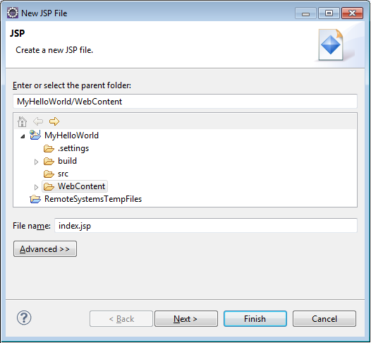

<properties
    pageTitle="Java-Anwendung Entwicklung Lernprogramm mit DocumentDB | Microsoft Azure"
    description="Diese Java-Web-Anwendung-Lernprogramm erfahren Sie, wie den DocumentDB Azure-Dienst verwenden, um zu speichern und Access-Daten aus einer Java-Anwendung auf Azure Websites gehostet."
    keywords="Entwicklung, Lernprogramm, Java-Anwendung, Java Web Anwendung Lernprogramm, Documentdb, Azure, Microsoft azure"
    services="documentdb"
    documentationCenter="java"
    authors="dennyglee"
    manager="jhubbard"
    editor="mimig"/>

<tags
    ms.service="documentdb"
    ms.devlang="java"
    ms.topic="hero-article"
    ms.tgt_pltfrm="NA"
    ms.workload="data-services"
    ms.date="08/24/2016"
    ms.author="denlee"/>

# Erstellen einer Java-Webanwendung mit DocumentDB

> [AZURE.SELECTOR]
- [.NET](documentdb-dotnet-application.md)
- [Node.js](documentdb-nodejs-application.md)
- [Java](documentdb-java-application.md)
- [Python](documentdb-python-application.md)

Diese Java-Web-Anwendung-Lernprogramm erfahren Sie, wie mit [Microsoft Azure DocumentDB](https://portal.azure.com/#gallery/Microsoft.DocumentDB) Dienst speichern und Access-Daten aus einer Java-Anwendung auf Azure Websites gehostet. In diesem Thema lernen Sie:

- So erstellen Sie eine einfache JSP-Anwendung in "Ellipse".
- Informationen zum Arbeiten mit dem DocumentDB Azure-Dienst, mit dem [DocumentDB Java SDK](https://github.com/Azure/azure-documentdb-java).

In diesem Lernprogramm der Java-Anwendung wird gezeigt, wie eine Aufgabe-Management webbasierten Anwendung zu erstellen, die können Sie erstellen, abrufen und Aufgaben als erledigt markieren, wie in der folgenden Abbildung dargestellt, werden kann. Alle Aufgaben in der Aufgabenliste werden als JSON-Dokumenten in Azure DocumentDB gespeichert.

> [AZURE.TIP] In diesem Lernprogramm der Anwendung Entwicklung wird davon ausgegangen, dass Sie die vorherige Erfahrung mit Java haben. Wenn Sie mit dem Java oder die [erforderliche Tools](#Prerequisites)vertraut sind, empfehlen wir das Projekt abgeschlossen [erledigen](https://github.com/Azure-Samples/documentdb-java-todo-app) von GitHub herunterladen und erstellen sie mithilfe [der Anweisungen am Ende dieses Artikels](#GetProject). Nachdem Sie es erstellt haben, können Sie den Artikel, um auf den Code im Kontext des Projekts Einblick überprüfen.  

##Voraussetzungen für diese Java-Web-Anwendung Lernprogramm
Bevor Sie diese Anwendung Entwicklung Lernprogramm beginnen, benötigen Sie Folgendes:

- Ein aktives Azure-Konto. Wenn Sie kein Konto haben, können Sie ein kostenloses Testversion Konto nur wenigen Minuten erstellen. Weitere Informationen finden Sie unter [Azure kostenlose Testversion](https://azure.microsoft.com/pricing/free-trial/).
- [Java Development Kit (JDK 7 +)](http://www.oracle.com/technetwork/java/javase/downloads/index.html).
- [Ellipse IDE für Java EE-Entwickler.](http://www.eclipse.org/downloads/packages/eclipse-ide-java-ee-developers/lunasr1)
- [Eine Azure-Website mit einer Java Runtime-Umgebung (z. B. Tomcat oder Pier) aktiviert werden soll.](../app-service-web/web-sites-java-get-started.md)

Wenn Sie diese Tools zum ersten Mal installieren, bietet coreservlets.com eine exemplarische Vorgehensweise des Installationsvorgangs im Abschnitt Schnellstart von deren [Lernprogramm: TomCat7 installieren und verwenden es mit "Ellipse"](http://www.coreservlets.com/Apache-Tomcat-Tutorial/tomcat-7-with-eclipse.html) Artikel.

##Schritt 1: Erstellen einer Datenbank DocumentDB-Konto

Erstes Erstellen eines Kontos DocumentDB. Wenn Sie bereits ein Konto haben, können Sie fahren Sie mit [Schritt2: erstellen die Anwendung Java JSP](#CreateJSP).

[AZURE.INCLUDE [documentdb-create-dbaccount](../../includes/documentdb-create-dbaccount.md)]

[AZURE.INCLUDE [documentdb-keys](../../includes/documentdb-keys.md)]

##Schritt 2: Erstellen der Java JSP-Anwendungs

So erstellen Sie die Anwendung JSP

1. Zunächst wird zunächst deaktivieren ein Java-Projekt erstellen. Starten Sie "Ellipse", und klicken Sie dann klicken Sie auf **Datei**, klicken Sie auf **neu**, und klicken Sie dann auf **Dynamische Web-Projekt**. Wenn Sie **Dynamische Web Project** aufgeführt, die als ein Projekt verfügbar angezeigt werden, gehen Sie folgendermaßen vor: Klicken Sie auf **Datei**, klicken Sie auf **neu**, klicken Sie auf **Projekt**..., **Web**erweitern, klicken Sie auf **Dynamische Web-Projekt**, und klicken Sie auf **Weiter**.

    

2. Geben Sie den Namen eines Projekts in das Feld **Projektname** und in der **Zielliste Laufzeit** Dropdown-Menü, wählen Sie optional einen Wert (z. B. Apache Tomcat 7.0), und klicken Sie dann auf **Fertig stellen**. Eine Laufzeit Ziel auswählen, können Sie Ihres Projekts lokal über "Ellipse" ausführen.
3. Erweitern Sie in "Ellipse" in der Projekt-Explorer-Ansicht Ihres Projekts aus. Mit der rechten Maustaste **Inhaltsordner**, klicken Sie auf **neu**, und klicken Sie dann auf **JSP-Datei**.
4. Klicken Sie im Dialogfeld **Neue JSP-Datei** benennen Sie die Datei **index.jsp**. Behalten Sie den übergeordneten Ordner als **Inhaltsordner**, wie in der folgenden Abbildung dargestellt, und klicken Sie dann auf **Weiter**.

    

5. Klicken Sie im Dialogfeld **Wählen Sie JSP Vorlage** innerhalb dieses Lernprogramms wählen Sie **Neue JSP-Datei (html)**, und klicken Sie dann auf **Fertig stellen**.

6. Wenn Sie die Datei index.jsp in "Ellipse" geöffnet wird, Hinzufügen von Text zum Anzeigen **Hallo Welt!** innerhalb des aktuellen <body> Element. Der aktualisierten <body> Inhalt sollte wie den folgenden Code aussehen:

        <body>
            <% out.println("Hello World!"); %>
        </body>

8. Speichern Sie die Datei index.jsp.
9. Wenn Sie in Schritt 2 eine Laufzeit Ziel festlegen möchten, können Sie **Project** und klicken Sie dann **Ausführen** Ihrer Anwendung JSP lokal ausführen klicken, um:

    

##Schritt 3: Installieren der DocumentDB Java SDK ##

Die einfachste Möglichkeit, ziehen Sie in der DocumentDB Java SDK und die zugehörigen Dateien erfolgt über [Apache Maven](http://maven.apache.org/).

Dazu müssen Sie Ihr Projekt zu einem Projekt Maven konvertieren, indem Sie die folgenden Schritte durchführen:

1. Mit der rechten Maustaste in Ihrem Projekts im Projekt-Explorer, klicken Sie auf **Konfigurieren**, klicken Sie auf **Konvertieren zu Maven Projekt**.
2. Übernehmen Sie die Standardeinstellungen, und klicken Sie auf **Fertig stellen**, klicken Sie im Fenster **neue POM erstellen** .
3. Öffnen Sie im **Projekt-Explorer**pom.xml Datei ein.
4. Klicken Sie auf der Registerkarte **Abhängigkeiten** im Bereich **Abhängigkeiten** auf **Hinzufügen**.
4. Klicken Sie im Fenster **Wählen Sie Abhängigkeit** folgendermaßen Sie vor:
 - Geben Sie im Feld **Gruppen-ID** com.microsoft.azure aus.
 - Geben Sie im Feld **Element-Id** Azure-Documentdb aus.
 - Geben Sie im Feld **Version** 1.5.1 aus.

    

    Oder die Abhängigkeit XML für die Gruppen-ID und ArtifactId direkt an den pom.xml über einen Text-Editor hinzufügen:

        <dependency>
            <groupId>com.microsoft.azure</groupId>
            <artifactId>azure-documentdb</artifactId>
            <version>1.5.1</version>
        </dependency>

5. Klicken Sie auf **Ok** und Maven wird die DocumentDB Java SDK installiert.
6. Speichern Sie die Datei pom.xml.

##Schritt 4: Verwenden des DocumentDB-Diensts in einer Java-Anwendung

1. Zunächst definieren wir auf das Objekt TodoItem:

        @Data
        @Builder
        public class TodoItem {
            private String category;
            private boolean complete;
            private String id;
            private String name;
        }

    [Project Lombok](http://projectlombok.org/) verwenden wir in dieses Projekt den Konstruktor, Get-, Set-Methoden und eines Generators generieren. Alternativ können Sie diesen Code manuell schreiben oder die IDE generieren, die sie besitzen.

2. Um den Dienst DocumentDB aufzurufen, müssen Sie eine neue **DocumentClient**instanziieren. Im Allgemeinen empfiehlt es sich, erstellen einen neuen Client für jede nachfolgende Anforderung statt der **DocumentClient** - wiederverwenden. Wir können den Client wiederverwenden, indem Sie den Kunden in einer **DocumentClientFactory**umbrechen. Dies ist auch die Stelle, an der Sie müssen den Wert URI und PRIMÄRSCHLÜSSEL einfügen, die, den Sie in der Zwischenablage in [Schritt 1](#CreateDB)gespeichert haben. Ersetzen Sie [Ihre\_ENDPUNKT\_hier] mit Ihrem URI und Ersetzen [Ihre\_Schlüssel\_hier] mit Ihrem PRIMÄRSCHLÜSSEL.

        private static final String HOST = "[YOUR_ENDPOINT_HERE]";
        private static final String MASTER_KEY = "[YOUR_KEY_HERE]";

        private static DocumentClient documentClient;

        public static DocumentClient getDocumentClient() {
            if (documentClient == null) {
                documentClient = new DocumentClient(HOST, MASTER_KEY,
                        ConnectionPolicy.GetDefault(), ConsistencyLevel.Session);
            }

            return documentClient;
        }

3. Jetzt erstellen wir eine Data Access Objekt (DAO) um abstrakte unsere erledigen Elemente DocumentDB beibehalten.

    Um erledigen Elemente in einer Websitesammlung gespeichert werden soll, muss der Client wissen, welche Datenbank und Websitesammlung zu beibehalten werden (als verwiesen wird, indem Sie Self links). Im Allgemeinen empfiehlt es sich, die Datenbank und der Websitesammlung, wenn möglich, vermeiden Sie zusätzliche Schleifen in der Datenbank Zwischenspeichern.

    Mit dem folgende Code veranschaulicht, wie unsere Datenbank und Websitesammlung abzurufen, sofern vorhanden, oder Erstellen eines neuen Kontos aus, wenn es nicht vorhanden ist:

        public class DocDbDao implements TodoDao {
            // The name of our database.
            private static final String DATABASE_ID = "TodoDB";

            // The name of our collection.
            private static final String COLLECTION_ID = "TodoCollection";

            // The DocumentDB Client
            private static DocumentClient documentClient = DocumentClientFactory
                    .getDocumentClient();

            // Cache for the database object, so we don't have to query for it to
            // retrieve self links.
            private static Database databaseCache;

            // Cache for the collection object, so we don't have to query for it to
            // retrieve self links.
            private static DocumentCollection collectionCache;

            private Database getTodoDatabase() {
                if (databaseCache == null) {
                    // Get the database if it exists
                    List<Database> databaseList = documentClient
                            .queryDatabases(
                                    "SELECT * FROM root r WHERE r.id='" + DATABASE_ID
                                            + "'", null).getQueryIterable().toList();

                    if (databaseList.size() > 0) {
                        // Cache the database object so we won't have to query for it
                        // later to retrieve the selfLink.
                        databaseCache = databaseList.get(0);
                    } else {
                        // Create the database if it doesn't exist.
                        try {
                            Database databaseDefinition = new Database();
                            databaseDefinition.setId(DATABASE_ID);

                            databaseCache = documentClient.createDatabase(
                                    databaseDefinition, null).getResource();
                        } catch (DocumentClientException e) {
                            // TODO: Something has gone terribly wrong - the app wasn't
                            // able to query or create the collection.
                            // Verify your connection, endpoint, and key.
                            e.printStackTrace();
                        }
                    }
                }

                return databaseCache;
            }

            private DocumentCollection getTodoCollection() {
                if (collectionCache == null) {
                    // Get the collection if it exists.
                    List<DocumentCollection> collectionList = documentClient
                            .queryCollections(
                                    getTodoDatabase().getSelfLink(),
                                    "SELECT * FROM root r WHERE r.id='" + COLLECTION_ID
                                            + "'", null).getQueryIterable().toList();

                    if (collectionList.size() > 0) {
                        // Cache the collection object so we won't have to query for it
                        // later to retrieve the selfLink.
                        collectionCache = collectionList.get(0);
                    } else {
                        // Create the collection if it doesn't exist.
                        try {
                            DocumentCollection collectionDefinition = new DocumentCollection();
                            collectionDefinition.setId(COLLECTION_ID);

                            collectionCache = documentClient.createCollection(
                                    getTodoDatabase().getSelfLink(),
                                    collectionDefinition, null).getResource();
                        } catch (DocumentClientException e) {
                            // TODO: Something has gone terribly wrong - the app wasn't
                            // able to query or create the collection.
                            // Verify your connection, endpoint, and key.
                            e.printStackTrace();
                        }
                    }
                }

                return collectionCache;
            }
        }

4. Im nächsten Schritt wird zum Schreiben von entsprechendem Code, um die TodoItems in der Auflistung beibehalten werden. In diesem Beispiel verwenden wir [Gson](https://code.google.com/p/google-gson/) serialisiert und Entserialisierung TodoItem einfarbigen alten Java-Objekte (POJOs) JSON-Dokumente. [Jackson-](http://jackson.codehaus.org/) oder eigene benutzerdefinierte Serialisierungsprogramm sind auch hervorragend Alternativen für die Serialisierung POJOs.

        // We'll use Gson for POJO <=> JSON serialization for this example.
        private static Gson gson = new Gson();

        @Override
        public TodoItem createTodoItem(TodoItem todoItem) {
            // Serialize the TodoItem as a JSON Document.
            Document todoItemDocument = new Document(gson.toJson(todoItem));

            // Annotate the document as a TodoItem for retrieval (so that we can
            // store multiple entity types in the collection).
            todoItemDocument.set("entityType", "todoItem");

            try {
                // Persist the document using the DocumentClient.
                todoItemDocument = documentClient.createDocument(
                        getTodoCollection().getSelfLink(), todoItemDocument, null,
                        false).getResource();
            } catch (DocumentClientException e) {
                e.printStackTrace();
                return null;
            }

            return gson.fromJson(todoItemDocument.toString(), TodoItem.class);
        }

5. Wie DocumentDB Datenbanken und Websitesammlungen, Dokumente auch verwiesen Self nach links. Die folgenden Helper-Funktion können uns Abrufen von Dokumenten von einem anderen Attribut (z. B. "Id"), statt Self link:

        private Document getDocumentById(String id) {
            // Retrieve the document using the DocumentClient.
            List<Document> documentList = documentClient
                    .queryDocuments(getTodoCollection().getSelfLink(),
                            "SELECT * FROM root r WHERE r.id='" + id + "'", null)
                    .getQueryIterable().toList();

            if (documentList.size() > 0) {
                return documentList.get(0);
            } else {
                return null;
            }
        }

6. Wir können die Methode Helper in Schritt 5 ein TodoItem JSON-Dokument-ID abrufen, und klicken Sie dann auf eine POJO deserialisieren:

        @Override
        public TodoItem readTodoItem(String id) {
            // Retrieve the document by id using our helper method.
            Document todoItemDocument = getDocumentById(id);

            if (todoItemDocument != null) {
                // De-serialize the document in to a TodoItem.
                return gson.fromJson(todoItemDocument.toString(), TodoItem.class);
            } else {
                return null;
            }
        }

7. Die DocumentClient können wir um eine Websitesammlung oder eine Liste von TodoItems mit DocumentDB SQL zu erhalten:

        @Override
        public List<TodoItem> readTodoItems() {
            List<TodoItem> todoItems = new ArrayList<TodoItem>();

            // Retrieve the TodoItem documents
            List<Document> documentList = documentClient
                    .queryDocuments(getTodoCollection().getSelfLink(),
                            "SELECT * FROM root r WHERE r.entityType = 'todoItem'",
                            null).getQueryIterable().toList();

            // De-serialize the documents in to TodoItems.
            for (Document todoItemDocument : documentList) {
                todoItems.add(gson.fromJson(todoItemDocument.toString(),
                        TodoItem.class));
            }

            return todoItems;
        }

8. Es gibt viele Methoden, um ein Dokument mit der DocumentClient zu aktualisieren. In der Liste unserer Anwendung erledigen möchten Lage, schalten Sie, ob ein TodoItem abgeschlossen ist. Dies kann erreicht werden, indem Sie das "abgeschlossen" Attribut innerhalb des Dokuments aktualisieren:

        @Override
        public TodoItem updateTodoItem(String id, boolean isComplete) {
            // Retrieve the document from the database
            Document todoItemDocument = getDocumentById(id);

            // You can update the document as a JSON document directly.
            // For more complex operations - you could de-serialize the document in
            // to a POJO, update the POJO, and then re-serialize the POJO back in to
            // a document.
            todoItemDocument.set("complete", isComplete);

            try {
                // Persist/replace the updated document.
                todoItemDocument = documentClient.replaceDocument(todoItemDocument,
                        null).getResource();
            } catch (DocumentClientException e) {
                e.printStackTrace();
                return null;
            }

            return gson.fromJson(todoItemDocument.toString(), TodoItem.class);
        }

9. Schließlich wollen wir die Möglichkeit, eine TodoItem von unserer Liste löschen. Hierzu können wir die Helper-Methode verwenden, die wir zuvor erstellt haben, Self link abrufen, und weisen Sie dann den Client zu löschen:

        @Override
        public boolean deleteTodoItem(String id) {
            // DocumentDB refers to documents by self link rather than id.

            // Query for the document to retrieve the self link.
            Document todoItemDocument = getDocumentById(id);

            try {
                // Delete the document by self link.
                documentClient.deleteDocument(todoItemDocument.getSelfLink(), null);
            } catch (DocumentClientException e) {
                e.printStackTrace();
                return false;
            }

            return true;
        }

##Schritt 5: Kabel die restlichen der Java-Anwendung Entwicklung Projekt nicht trennen

Jetzt, da wir die spaßige Bits - alle, die Links besteht darin, erstellen einen schnellen Benutzer Schnittstelle, und verbinden es auf unsere DAO abgeschlossen haben.

1. Zunächst beginnen wir mit der Erstellung eines Controllers, um unser DAO anrufen:

        public class TodoItemController {
            public static TodoItemController getInstance() {
                if (todoItemController == null) {
                    todoItemController = new TodoItemController(TodoDaoFactory.getDao());
                }
                return todoItemController;
            }

            private static TodoItemController todoItemController;

            private final TodoDao todoDao;

            TodoItemController(TodoDao todoDao) {
                this.todoDao = todoDao;
            }

            public TodoItem createTodoItem(@NonNull String name,
                    @NonNull String category, boolean isComplete) {
                TodoItem todoItem = TodoItem.builder().name(name).category(category)
                        .complete(isComplete).build();
                return todoDao.createTodoItem(todoItem);
            }

            public boolean deleteTodoItem(@NonNull String id) {
                return todoDao.deleteTodoItem(id);
            }

            public TodoItem getTodoItemById(@NonNull String id) {
                return todoDao.readTodoItem(id);
            }

            public List<TodoItem> getTodoItems() {
                return todoDao.readTodoItems();
            }

            public TodoItem updateTodoItem(@NonNull String id, boolean isComplete) {
                return todoDao.updateTodoItem(id, isComplete);
            }
        }

    In einer Anwendung komplexere möglicherweise der Controller komplizierte Geschäftslogik auf die DAO unterbringen.

2. Erstellen Sie dann ein Servlet Routing HTTP-Anfragen an den Controller:

        public class TodoServlet extends HttpServlet {
            // API Keys
            public static final String API_METHOD = "method";

            // API Methods
            public static final String CREATE_TODO_ITEM = "createTodoItem";
            public static final String GET_TODO_ITEMS = "getTodoItems";
            public static final String UPDATE_TODO_ITEM = "updateTodoItem";

            // API Parameters
            public static final String TODO_ITEM_ID = "todoItemId";
            public static final String TODO_ITEM_NAME = "todoItemName";
            public static final String TODO_ITEM_CATEGORY = "todoItemCategory";
            public static final String TODO_ITEM_COMPLETE = "todoItemComplete";

            public static final String MESSAGE_ERROR_INVALID_METHOD = "{'error': 'Invalid method'}";

            private static final long serialVersionUID = 1L;
            private static final Gson gson = new Gson();

            @Override
            protected void doGet(HttpServletRequest request,
                    HttpServletResponse response) throws ServletException, IOException {

                String apiResponse = MESSAGE_ERROR_INVALID_METHOD;

                TodoItemController todoItemController = TodoItemController
                        .getInstance();

                String id = request.getParameter(TODO_ITEM_ID);
                String name = request.getParameter(TODO_ITEM_NAME);
                String category = request.getParameter(TODO_ITEM_CATEGORY);
                boolean isComplete = StringUtils.equalsIgnoreCase("true",
                        request.getParameter(TODO_ITEM_COMPLETE)) ? true : false;

                switch (request.getParameter(API_METHOD)) {
                case CREATE_TODO_ITEM:
                    apiResponse = gson.toJson(todoItemController.createTodoItem(name,
                            category, isComplete));
                    break;
                case GET_TODO_ITEMS:
                    apiResponse = gson.toJson(todoItemController.getTodoItems());
                    break;
                case UPDATE_TODO_ITEM:
                    apiResponse = gson.toJson(todoItemController.updateTodoItem(id,
                            isComplete));
                    break;
                default:
                    break;
                }

                response.getWriter().println(apiResponse);
            }

            @Override
            protected void doPost(HttpServletRequest request,
                    HttpServletResponse response) throws ServletException, IOException {
                doGet(request, response);
            }
        }

3. Wir benötigen eine Web-Benutzeroberfläche für den Benutzer angezeigt werden. Erneutes Schreiben wir die index.jsp, dass wir zuvor erstellt haben:

        <html>
        <head>
          <meta http-equiv="Content-Type" content="text/html; charset=ISO-8859-1">
          <meta http-equiv="X-UA-Compatible" content="IE=edge;" />
          <title>Azure DocumentDB Java Sample</title>

          <!-- Bootstrap -->
          <link href="//ajax.aspnetcdn.com/ajax/bootstrap/3.2.0/css/bootstrap.min.css" rel="stylesheet">

          
        </head>
        <body>
          <!-- Nav Bar -->
          

            

              

                <a class="navbar-brand" href="#">My Tasks</a>
              

            

          

          <!-- Body -->
          

            <h1>My ToDo List</h1>

            

            <!-- The ToDo List -->
            

              <table class="table table-bordered table-striped" id="todoItems">
                <thead>
                  <tr>
                    <th>Name</th>
                    <th>Category</th>
                    <th>Complete</th>
                  </tr>
                </thead>
                <tbody>
                </tbody>
              </table>

              <!-- Update Button -->
              

                <form class="form-horizontal" role="form">
                  <button type="button" class="btn btn-primary">Update Tasks</button>
                </form>
              

            

            

            <!-- Item Input Form -->
            

              <form class="form-horizontal" role="form">
                

                  <label for="inputItemName" class="col-sm-2">Task Name</label>
                  

                    <input type="text" class="form-control" id="inputItemName" placeholder="Enter name">
                  

                

                

                  <label for="inputItemCategory" class="col-sm-2">Task Category</label>
                  

                    <input type="text" class="form-control" id="inputItemCategory" placeholder="Enter category">
                  

                

                <button type="button" class="btn btn-primary">Add Task</button>
              </form>
            

          

          <!-- Placed at the end of the document so the pages load faster -->
          
          
          
        </body>
        </html>

4. Und schließlich clientseitige Javascript zum Verknüpfen von der Web-Benutzeroberfläche und den Servlet schreiben:

        var todoApp = {
          /*
           * API methods to call Java backend.
           */
          apiEndpoint: "api",

          createTodoItem: function(name, category, isComplete) {
            $.post(todoApp.apiEndpoint, {
                "method": "createTodoItem",
                "todoItemName": name,
                "todoItemCategory": category,
                "todoItemComplete": isComplete
              },
              function(data) {
                var todoItem = data;
                todoApp.addTodoItemToTable(todoItem.id, todoItem.name, todoItem.category, todoItem.complete);
              },
              "json");
          },

          getTodoItems: function() {
            $.post(todoApp.apiEndpoint, {
                "method": "getTodoItems"
              },
              function(data) {
                var todoItemArr = data;
                $.each(todoItemArr, function(index, value) {
                  todoApp.addTodoItemToTable(value.id, value.name, value.category, value.complete);
                });
              },
              "json");
          },

          updateTodoItem: function(id, isComplete) {
            $.post(todoApp.apiEndpoint, {
                "method": "updateTodoItem",
                "todoItemId": id,
                "todoItemComplete": isComplete
              },
              function(data) {},
              "json");
          },

          /*
           * UI Methods
           */
          addTodoItemToTable: function(id, name, category, isComplete) {
            var rowColor = isComplete ? "active" : "warning";

            todoApp.ui_table().append($("<tr>")
              .append($("<td>").text(name))
              .append($("<td>").text(category))
              .append($("<td>")
                .append($("<input>")
                  .attr("type", "checkbox")
                  .attr("id", id)
                  .attr("checked", isComplete)
                  .attr("class", "isComplete")
                ))
              .addClass(rowColor)
            );
          },

          /*
           * UI Bindings
           */
          bindCreateButton: function() {
            todoApp.ui_createButton().click(function() {
              todoApp.createTodoItem(todoApp.ui_createNameInput().val(), todoApp.ui_createCategoryInput().val(), false);
              todoApp.ui_createNameInput().val("");
              todoApp.ui_createCategoryInput().val("");
            });
          },

          bindUpdateButton: function() {
            todoApp.ui_updateButton().click(function() {
              // Disable button temporarily.
              var myButton = $(this);
              var originalText = myButton.text();
              $(this).text("Updating...");
              $(this).prop("disabled", true);

              // Call api to update todo items.
              $.each(todoApp.ui_updateId(), function(index, value) {
                todoApp.updateTodoItem(value.name, value.value);
                $(value).remove();
              });

              // Re-enable button.
              setTimeout(function() {
                myButton.prop("disabled", false);
                myButton.text(originalText);
              }, 500);
            });
          },

          bindUpdateCheckboxes: function() {
            todoApp.ui_table().on("click", ".isComplete", function(event) {
              var checkboxElement = $(event.currentTarget);
              var rowElement = $(event.currentTarget).parents('tr');
              var id = checkboxElement.attr('id');
              var isComplete = checkboxElement.is(':checked');

              // Toggle table row color
              if (isComplete) {
                rowElement.addClass("active");
                rowElement.removeClass("warning");
              } else {
                rowElement.removeClass("active");
                rowElement.addClass("warning");
              }

              // Update hidden inputs for update panel.
              todoApp.ui_updateForm().children("input[name='" + id + "']").remove();

              todoApp.ui_updateForm().append($("<input>")
                .attr("type", "hidden")
                .attr("class", "updateComplete")
                .attr("name", id)
                .attr("value", isComplete));

            });
          },

          /*
           * UI Elements
           */
          ui_createNameInput: function() {
            return $(".todoForm #inputItemName");
          },

          ui_createCategoryInput: function() {
            return $(".todoForm #inputItemCategory");
          },

          ui_createButton: function() {
            return $(".todoForm button");
          },

          ui_table: function() {
            return $(".todoList table tbody");
          },

          ui_updateButton: function() {
            return $(".todoUpdatePanel button");
          },

          ui_updateForm: function() {
            return $(".todoUpdatePanel form");
          },

          ui_updateId: function() {
            return $(".todoUpdatePanel .updateComplete");
          },

          /*
           * Install the TodoApp
           */
          install: function() {
            todoApp.bindCreateButton();
            todoApp.bindUpdateButton();
            todoApp.bindUpdateCheckboxes();

            todoApp.getTodoItems();
          }
        };

        $(document).ready(function() {
          todoApp.install();
        });

5. Prima! Jetzt nur noch die Anwendung zu testen ist. Führen Sie die Anwendung lokal, und fügen Sie einige Elemente erledigen, indem Sie ausfüllen in der Kategorie and Elementnamen und **Aufgabe hinzufügen**.

6. Nachdem das Element angezeigt wird, können Sie aktualisieren, ob er abgeschlossen ist, indem Sie das Kontrollkästchen umschalten und auf **Vorgänge aktualisieren**.

##Schritt 6: Bereitstellen der Java-Anwendung in Azure-Websites

Azure Websites ist so einfach wie das Ihrer Anwendung als WAR-Datei exportieren und sie entweder über Datenquellen-Steuerelements (z. B. GIT) hochladen Java-Applikationen bereitstellen oder FTP.

1. Exportieren Ihrer Anwendung als eine WAR, mit der rechten Maustaste auf das Projekt im **Projekt-Explorer**, klicken Sie auf **Exportieren**, und klicken Sie dann auf **WAR-Datei**.
2. Klicken Sie im Fenster **Exportieren WAR** folgendermaßen Sie vor:
 - Geben Sie im Feld Project Web Azure-Documentdb-Java-Stichproben aus.
 - Wählen Sie im Feld Ziel eines Ziels die WAR-Datei speichern.
 - Klicken Sie auf **Fertig stellen**.

3. Jetzt, da Sie eine WAR-Datei in vorliegen, können Sie einfach auf Ihre Azure-Website **Webapps** Verzeichnis hochladen. Hochladen der Datei Anweisungen finden Sie unter [Hinzufügen einer Anwendung zu Ihrer Website Java auf Azure](../app-service-web/web-sites-java-add-app.md).

    Sobald die WAR-Datei in das Verzeichnis Webapps hochgeladen wird, erkennt die Runtime-Umgebung, die Sie hinzugefügt haben, und es werden automatisch geladen.
4. Navigieren Sie zum Anzeigen der fertigen Produkts zu http://YOUR\_Website\_NAME.azurewebsites.net/azure-documentdb-java-sample/ und beginnt mit dem Hinzufügen von Vorgängen!

##Rufen Sie das Projekt in GitHub

Alle in den Beispielen in diesem Lernprogramm sind im Projekt [erledigen](https://github.com/Azure-Samples/documentdb-java-todo-app) auf GitHub enthalten. Um das Projekt erledigen in "Ellipse" zu importieren, stellen Sie sicher, dass die Software und Ressourcen, die im Abschnitt [erforderliche Komponenten](#Prerequisites) aufgeführt sein, und dann gehen Sie folgendermaßen vor:

1. Installieren von [Project Lombok](http://projectlombok.org/). Lombok wird verwendet, um Konstruktoren, Get- und Set-Methoden im Projekt zu generieren. Nachdem Sie die Datei lombok.jar heruntergeladen haben, doppelklicken Sie auf, um es zu installieren oder über die Befehlszeile zu installieren.
2. Wenn "Ellipse" geöffnet ist, schließen Sie es, und starten Sie darauf, um die Lombok zu laden.
3. Klicken Sie in "Ellipse" klicken Sie im Menü **Datei** auf **Importieren**.
4. Im Fenster **Importieren** **Git**klicken Sie auf, klicken Sie auf **Projekte aus Git**, und klicken Sie dann auf **Weiter**.
5. Klicken Sie auf dem Bildschirm **Repository Quelle auswählen** auf **Datenbeschriftungsreihe URI**.
6. Klicken Sie auf dem Bildschirm **Quelle Git Repository** im Feld **URI** Geben Sie https://github.com/Azure-Samples/documentdb-java-todo-app.git, und klicken Sie dann auf **Weiter**.
7. Vergewissern Sie sich auf dem Bildschirm **Verzweigung Auswahl** dieser- **master** ausgewählt ist, und klicken Sie dann auf **Weiter**.
8. Klicken Sie auf dem Bildschirm **Lokalen Ziel** auf **Durchsuchen** , um wählen einen Ordner, in dem das Repository kopiert werden können, und klicken Sie dann auf **Weiter**.
9. Auf dem Bildschirm **Wählen Sie einen Assistenten zum Importieren von Projekten verwenden** stellen Sie sicher, dass die **vorhandenen Projekte importieren** aktiviert ist, und klicken Sie dann auf **Weiter**.
10. Klicken Sie auf dem Bildschirm **Importieren von Projekten** Aufheben der Markierung eines Projekts **DocumentDB** , und klicken Sie dann auf **Fertig stellen**. Das Projekt DocumentDB enthält die DocumentDB Java SDK, die wir stattdessen als Abhängigkeit hinzugefügt werden.
11. Navigieren Sie zu azure-documentdb-java-sample\src\com.microsoft.azure.documentdb.sample.dao\DocumentClientFactory.java im **Projekt-Explorer**ersetzen Sie die Werte für HOST und MASTER_KEY mit dem URI und PRIMÄRSCHLÜSSEL für Ihr Konto DocumentDB, und speichern Sie die Datei. Weitere Informationen finden Sie unter [Schritt 1. Erstellen eines Datenbank-Kontos DocumentDB](#CreateDB).
12. Klicken Sie im **Projekt-Explorer**mit der rechten Maustaste auf der **Azure-Documentdb-Java-Stichproben**, klicken Sie auf **Pfad erstellen**, und klicken Sie dann auf **Erstellen Pfad konfigurieren**.
13. Klicken Sie auf dem Bildschirm **Java erstellen Pfad** im rechten Bereich Wählen Sie die Registerkarte **Bibliotheken** , und klicken Sie dann auf **Externe JARs hinzufügen**. Navigieren Sie zum Speicherort der Datei lombok.jar, und klicken Sie auf **Öffnen**, und klicken Sie dann auf **OK**.
14. Verwenden Sie Schritt 12 **Eigenschaftenfenster** erneut öffnen, und klicken Sie dann im linken Bereich auf **Laufzeiten ausgerichtet**.
15. Klicken Sie auf dem Bildschirm **Als Ziel Laufzeiten** auf **neu**, wählen Sie **Apache Tomcat 7.0**aus und klicken Sie dann auf **OK**.
16. Verwenden Sie Schritt 12 **Eigenschaftenfenster** erneut öffnen, und klicken Sie dann im linken Bereich auf **Aspekte des Projekts**.
17. Klicken Sie auf dem Bildschirm **Project Aspekte** wählen Sie **Dynamische Web-Modul** und **Java**, und klicken Sie dann auf **OK**.
18. Klicken Sie auf der Registerkarte **Server** am unteren Rand des Bildschirms mit der rechten Maustaste **Tomcat 7.0 Server unter Localhost** , und klicken Sie dann auf **Hinzufügen und entfernen**.
19. Klicken Sie auf das Fenster **Hinzufügen und Entfernen von** verschieben Sie **Azure-Documentdb-Java-Stichproben** in das **konfiguriert** , und klicken Sie dann auf **Fertig stellen**.
20. Klicken Sie auf der Registerkarte **Server** mit der rechten Maustaste **Tomcat 7.0 Server unter Localhost**, und klicken Sie dann auf **neu starten**.
21. Navigieren Sie in einem Browser zu http://localhost: 8080/Azure-Documentdb-Java-Stichproben /, und fangen Sie die Aufgabenliste. Notiz, die, wenn Sie Ihre Standardwerte Port geändert 8080 auf den Wert geändert, die Sie ausgewählt haben.
22. Zum Bereitstellen des Projekts mit einer Azure-Website finden Sie unter [Schritt 6 fort. Bereitstellen der Anwendung in Azure Websites](#Deploy).

[1]: media/documentdb-java-application/keys.png
