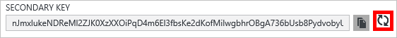

<properties
    pageTitle="Verwalten von einem Konto DocumentDB über das Azure-Portal | Microsoft Azure"
    description="Erfahren Sie, wie Ihr Konto DocumentDB über das Azure-Portal zu verwalten. Suchen nach einer Führungslinie mit Azure-Portal anzeigen, kopieren, löschen und Konten zugreifen."
    keywords="Azure-Portal Documentdb, Azure, Microsoft azure"
    services="documentdb"
    documentationCenter=""
    authors="kirillg"
    manager="jhubbard"
    editor="cgronlun"/>

<tags
    ms.service="documentdb"
    ms.workload="data-services"
    ms.tgt_pltfrm="na"
    ms.devlang="na"
    ms.topic="article"
    ms.date="10/14/2016"
    ms.author="kirillg"/>

# So verwalten Sie ein Konto DocumentDB

Informationen Sie zum Festlegen globaler Konsistenz, arbeiten mit Tasten und löschen ein Konto DocumentDB Azure-Portal.

## Verwalten von DocumentDB Konsistenz

Auswählen der richtigen Konsistenz Ebene, hängt von der Semantik der Anwendung ab. Sie sollten Vertrautmachen mit verfügbaren Konsistenz Ebenen in DocumentDB durch [verwenden Konsistenz Ebenen, um die Verfügbarkeit und Leistung in DocumentDB maximieren]lesen [consistency]. DocumentDB stellt Konsistenz, Verfügbarkeit und Leistung Garantien, jeder Konsistenz Ebene für Ihr Datenbankkonto verfügbar. Konfigurieren Ihr Datenbankkonto mit einem Konsistenz Maß starken erfordert, dass Ihre Daten in einem einzigen Azure Bereich begrenzt und Global nicht verfügbar sind. Andererseits, Ebenen niedrige Konsistenz - begrenzte Veraltung, Sitzung oder tatsächlichen aktivieren Sie eine beliebige Anzahl von Azure Regionen mit Ihrem Datenbankkonto zuordnen. Die folgenden einfachen Schritte gezeigt, wie die Konsistenz Standardstufe für Ihr Datenbankkonto auswählen. 

### Angeben die standardmäßigen Konsistenz für ein Konto DocumentDB

1. Im [Azure-Portal](https://portal.azure.com/)zugreifen Sie auf Ihr Konto DocumentDB.
2. Klicken Sie in das Konto Blade auf **Konsistenz Standard**.
3. Das **Standardformat Konsistenz** Blade wählen Sie die neue Konsistenz und dann auf **Speichern**.
    ![Standard-Konsistenz-Sitzung][5]

## Anzeigen, kopieren und neu generieren von Tastenkombinationen
Wenn Sie ein Konto DocumentDB erstellen, erstellt der Dienst zwei master Tastenkombinationen, die für die Authentifizierung verwendet werden können, wenn das Konto DocumentDB zugegriffen werden kann. Durch die Bereitstellung von zwei Zugriffstasten, können mit DocumentDB die Tasten ohne Unterbrechung bei Ihrem Konto DocumentDB neu zu generieren. 

Im [Azure-Portal](https://portal.azure.com/)zugreifen Sie, das **Tasten** Blade aus dem Menü "Ressourcen" auf das **Konto DocumentDB** Blade anzeigen, kopieren und neu generieren der Tastenkombinationen, die Zugriff auf Ihr Konto DocumentDB verwendet werden.

> [AZURE.NOTE] Das **Tasten** Blade enthält darüber hinaus primären und sekundären Verbindungszeichenfolgen, die Verbindung zu Ihrem Konto aus dem [Migrationstool Daten](documentdb-import-data.md)verwendet werden können.

Schreibgeschützte Schlüssel sind auch auf diese Blade verfügbar. Lese- und Abfragen schreibgeschützte Vorgänge, Weile erstellt, löscht, und ersetzt nicht sind.

### Kopieren einer Zugriffstaste Azure-Portal

Klicken Sie auf das Blade **Tasten** auf die Schaltfläche **Kopieren** , rechts neben der Schlüssel, die, den Sie kopieren möchten.

### Neu generieren von Tastenkombinationen

Sie sollten die Tastenkombinationen bei Ihrem Konto DocumentDB regelmäßig, um Ihre Verbindungen mehr Sicherheit beitragen ändern. Aktivieren Sie zum Verwalten von Verbindungen mit dem DocumentDB-Konto, verwenden eine Access-Taste gedrückt, während Sie die anderen Zugriffstaste neu generieren sind zwei Tastenkombinationen zugewiesen.

> [AZURE.WARNING] Erneutes Generieren der Zugriffstasten und wirkt sich auf alle Programme, die den aktuellen Schlüssel abhängig sind. Alle Clients, die die Zugriffstaste zu verwenden, um das Konto DocumentDB zuzugreifen müssen aktualisiert werden, um den neuen Product Key zu verwenden.

Wenn Sie Applikationen oder Cloud-Diensten mit dem DocumentDB-Konto verfügen, verloren Verbindungen, wenn Sie Tasten, erneut generieren, wenn Sie Ihre Schlüssel einsatzbereit. Die folgenden Schritte beschreiben die Vorgehensweise bei die Tasten parallelen.

1. Aktualisieren Sie die Zugriffstaste in Ihrer Anwendungscode in Bezug auf die sekundäre Zugriffstaste für das Konto DocumentDB.
2. Die primäre Zugriffstaste für Ihr Konto DocumentDB neu zu generieren. Im [Azure-Portal](https://portal.azure.com/)zugreifen Sie auf Ihr Konto DocumentDB.
3. Klicken Sie in das Blade **DocumentDB Konto** **Tasten**auf.
4. Klicken Sie auf das Blade **Tasten** klicken Sie auf die Schaltfläche erstellen, jeweils, und klicken Sie auf **Ok,** um zu bestätigen, dass Sie einen neuen Product Key generieren möchten.
    

5. Nachdem Sie überprüft haben, dass der neue Product Key für verwenden (etwa 5 Minuten nach der Regenerierung) verfügbar ist, aktualisieren Sie die Zugriffstaste in Ihrer Anwendungscode in Bezug auf die neue primäre Zugriffstaste.
6. Sekundäre Zugriffstaste neu zu generieren.

    

> [AZURE.NOTE] Es kann mehrere Minuten dauern vor ein neu erstellten Schlüssel Zugriff auf Ihr Konto DocumentDB verwendet werden kann.

## Abrufen der Verbindungszeichenfolge

Zum Abrufen der Verbindungszeichenfolge folgendermaßen Sie vor: 

1. Im [Azure-Portal](https://portal.azure.com)zugreifen Sie auf Ihr Konto DocumentDB.
2. Klicken Sie im Menü Ressource **Tasten**auf.
3. Klicken Sie auf die Schaltfläche **Kopieren** , neben dem Feld **Verbindungszeichenfolge primäre** oder **Sekundäre Verbindungszeichenfolge** . 

Wenn Sie die Verbindungszeichenfolge im [DocumentDB Migration Datenbanktool](documentdb-import-data.md)verwenden, fügen Sie den Datenbanknamen am Ende der Verbindungszeichenfolge. `AccountEndpoint=< >;AccountKey=< >;Database=< >`.

## Löschen eines Kontos DocumentDB
Um ein Konto DocumentDB vom Azure-Portal zu entfernen, die Sie nicht länger verwenden, verwenden Sie den Befehl **Konto löschen** auf das **Konto DocumentDB** Blade.

1. Klicken Sie in der [Azure-Portal](https://portal.azure.com/)zugreifen Sie das DocumentDB-Konto, das Sie löschen möchten.
2. Klicken Sie auf das **Konto DocumentDB** Blade klicken Sie auf **Weitere**, und klicken Sie dann auf **Konto löschen**. Oder, mit der rechten Maustaste in des Namens der Datenbank, und klicken Sie auf **Konto löschen**.
3. Geben Sie den Kontonamen DocumentDB, um zu bestätigen, dass Sie das Konto löschen möchten, auf das sich daraus ergebende Bestätigung Blade.
4. Klicken Sie auf die Schaltfläche **Löschen** .

## Nächste Schritte

Erfahren Sie, wie Sie [Erste Schritte mit Ihrem Konto DocumentDB](http://go.microsoft.com/fwlink/p/?LinkId=402364).

Um weitere Informationen zu DocumentDB finden Sie unter der Dokumentation Azure DocumentDB auf [azure.com](http://go.microsoft.com/fwlink/?LinkID=402319&clcid=0x409).

<!--Image references-->
[1]: ./media/documentdb-manage-account/documentdb_add_region-1.png
[2]: ./media/documentdb-manage-account/documentdb_add_region-2.png
[3]: ./media/documentdb-manage-account/documentdb_change_write_region-1.png
[4]: ./media/documentdb-manage-account/documentdb_change_write_region-2.png
[5]: ./media/documentdb-manage-account/documentdb_change_consistency-1.png
[6]: ./media/documentdb-manage-account/chooseandsaveconsistency.png

<!--Reference style links - using these makes the source content way more readable than using inline links-->
[bcdr]: https://azure.microsoft.com/documentation/articles/best-practices-availability-paired-regions/
[consistency]: https://azure.microsoft.com/documentation/articles/documentdb-consistency-levels/
[azureregions]: https://azure.microsoft.com/en-us/regions/#services
[offers]: https://azure.microsoft.com/en-us/pricing/details/documentdb/
