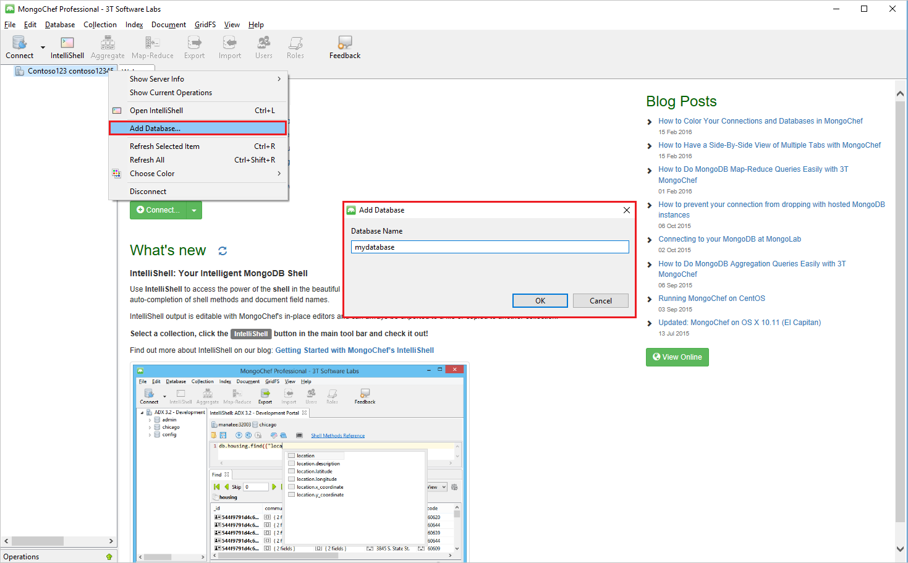
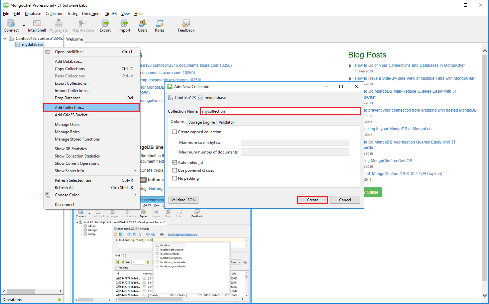

<properties 
    pageTitle="Verwenden Sie MongoChef mit einem Konto DocumentDB mit Protokoll Unterstützung für MongoDB | Microsoft Azure" 
    description="Erfahren Sie, wie MongoChef mit einem Konto DocumentDB mit Protokoll Unterstützung für MongoDB, jetzt erhältlich für Vorschau verwenden." 
    keywords="mongochef"
    services="documentdb" 
    authors="AndrewHoh" 
    manager="jhubbard" 
    editor="" 
    documentationCenter=""/>

<tags 
    ms.service="documentdb" 
    ms.workload="data-services" 
    ms.tgt_pltfrm="na" 
    ms.devlang="na" 
    ms.topic="article" 
    ms.date="08/25/2016" 
    ms.author="anhoh"/>

# Verwenden von MongoChef mit einem Konto DocumentDB mit MongoDB Protokoll unterstützt werden

Informationen zum Verbinden mit einer Firma Azure DocumentDB mit Protokoll Unterstützung für MongoDB MongoChef verwenden müssen Sie folgende Aktionen ausführen:

- Herunterladen und Installieren von [MongoChef](http://3t.io/mongochef)
- Haben Sie Ihr Konto DocumentDB mit Protokoll Unterstützung für MongoDB [Verbindungszeichenfolge](documentdb-connect-mongodb-account.md) Informationen

## Erstellen Sie die Verbindung in MongoChef  

Führen Sie die folgenden Schritte aus, um Ihr Konto DocumentDB mit Protokoll Unterstützung für MongoDB MongoChef Verbindungs-Managers hinzuzufügen.

1. Abrufen Ihrer DocumentDB mit Protokoll Unterstützung für MongoDB Verbindungsinformationen anhand der Anweisungen [hier](documentdb-connect-mongodb-account.md).

    

2. Klicken Sie auf **Verbinden** , um den Verbindungs-Manager zu öffnen, und klicken Sie auf **Neue Verbindung**

    
    
2. Geben Sie im Fenster **Neue Verbindung** auf der Registerkarte **Server** die HOST (FQDN) des Kontos DocumentDB mit Protocol-Unterstützung für MongoDB und den PORT ein.
    
    

3. Im Fenster **Neue Verbindung** auf der Registerkarte **Authentifizierung** Authentifizierungsmodus **Standard (MONGODB-CR oder SCARM-SHA-1)** wählen Sie aus, und geben Sie den Benutzernamen und das Kennwort ein.  Übernehmen Sie die standardmäßigen Authentifizierung Db (Admin), oder geben Sie einen eigenen Wert.

    

4. Das Fenster **Neue Verbindung** auf der Registerkarte **SSL** aktivieren Sie das Kontrollkästchen **verwenden SSL-Protokoll Verbindung** und das Optionsfeld **akzeptieren selbstsignierten SSL-Zertifikate** .

    

5. Klicken Sie auf die Schaltfläche **Verbindung testen** , um die Verbindungsinformationen zu überprüfen, klicken Sie auf **OK** , um das Fenster Neue Verbindung zurückzukehren, und klicken Sie dann auf **Speichern**.

    

## Verwenden Sie zum Erstellen einer Datenbank, die Sammlung und Dokumente MongoChef  

Führen Sie zum Erstellen einer Datenbank, die Sammlung und Dokumente mithilfe von MongoChef die folgenden Schritte aus.

1. **Verbindungs-Manager**markieren Sie die Verbindung aus, und klicken Sie auf **Verbinden**.

    

2. Klicken Sie mit der rechten Maustaste auf den Host, und wählen Sie die **Datenbank hinzufügen**.  Geben Sie einen Datenbanknamen, und klicken Sie auf **OK**.
    
    

3. Klicken Sie mit der rechten Maustaste auf die Datenbank, und wählen Sie **Sammlung hinzufügen**aus.  Geben Sie einen Namen für die Websitesammlung ein, und klicken Sie auf **Erstellen**.

    

4. Klicken Sie auf das Menüelement **Auflistung** , und klicken Sie auf **Dokument hinzufügen**.

    

5. Klicken Sie im Dialogfeld Dokument hinzufügen fügen Sie die folgenden, und klicken Sie dann auf **Dokument hinzufügen**.

        {
        "_id": "AndersenFamily",
        "lastName": "Andersen",
        "parents": [
            { "firstName": "Thomas" },
            { "firstName": "Mary Kay"}
        ],
        "children": [
        {
            "firstName": "Henriette Thaulow", "gender": "female", "grade": 5,
            "pets": [{ "givenName": "Fluffy" }]
        }
        ],
        "address": { "state": "WA", "county": "King", "city": "seattle" },
        "isRegistered": true
        }

    
6. Fügen Sie ein anderes Dokument diesmal mit dem folgenden Inhalt hinzu.

        {
        "_id": "WakefieldFamily",
        "parents": [
            { "familyName": "Wakefield", "givenName": "Robin" },
            { "familyName": "Miller", "givenName": "Ben" }
        ],
        "children": [
            {
                "familyName": "Merriam", 
                "givenName": "Jesse", 
                "gender": "female", "grade": 1,
                "pets": [
                    { "givenName": "Goofy" },
                    { "givenName": "Shadow" }
                ]
            },
            { 
                "familyName": "Miller", 
                "givenName": "Lisa", 
                "gender": "female", 
                "grade": 8 }
        ],
        "address": { "state": "NY", "county": "Manhattan", "city": "NY" },
        "isRegistered": false
        }

7. Ausführen einer Abfrage für die Stichprobe. Beispielsweise für Familien mit dem Nachnamen "Andersen" Suchen und die Eltern und Statusfelder zurückzukehren.

    
    

## Nächste Schritte

- Untersuchen Sie DocumentDB mit MongoDB [Beispiele](documentdb-mongodb-samples.md)Protokoll unterstützt werden.

 
