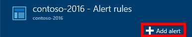
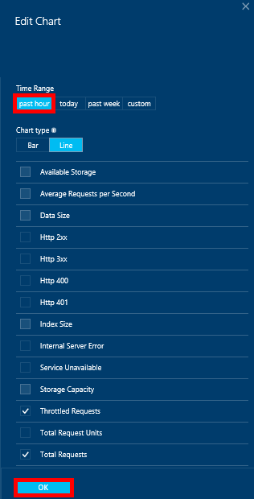

<properties
    pageTitle="Überwachen von DocumentDB Besprechungsanfragen und Speicher | Microsoft Azure"
    description="Erfahren Sie, wie Ihr Konto DocumentDB für Performance-Werte, wie z. B. Anfragen und Serverfehler und Verwendung Kriterien, wie z. B. Speichers überwachen."
    services="documentdb"
    documentationCenter=""
    authors="mimig1"
    manager="jhubbard"
    editor="cgronlun"/>

<tags
    ms.service="documentdb"
    ms.workload="data-services"
    ms.tgt_pltfrm="na"
    ms.devlang="na"
    ms.topic="article"
    ms.date="10/17/2016"
    ms.author="mimig"/>

# Überwachen von DocumentDB Besprechungsanfragen, Verwendung und Speicher

Sie können Ihre Konten Azure DocumentDB im [Azure-Portal](https://portal.azure.com/)überwachen. Für jedes Konto DocumentDB sind beide Performance-Werte, wie Besprechungsanfragen und Serverfehlern und Verwendung Kennzahlen, wie z. B. Speicher Ernährung verfügbar.

Kennzahlen können auf das Konto Blade oder auf das neue Metrik Blade überprüft werden.

## Performance-Werte auf das Blade Kennzahlen anzeigen

1. Öffnen Sie in einem neuen Fenster das [Azure-Portal](https://portal.azure.com/), klicken Sie auf **Weitere Dienste**, klicken Sie auf **DocumentDB (NoSQL)**, und klicken Sie dann auf den Namen des Kontos DocumentDB für die Sie Leistungswerte anzeigen möchten.
2. Klicken Sie auf **Kriterien**, klicken Sie im Menü Ressource.

Das Blade Metrik wird geöffnet, und Sie können die Auflistung, um zu überprüfen, auswählen. Sie können Überprüfen der Verfügbarkeit, Besprechungsanfragen, Durchsatz und Speicher Kennzahlen und vergleichen Sie diese mit der DocumentDB SLAs.

## Anzeigen von Performance-Werte auf das Konto blade
1.  Öffnen Sie in einem neuen Fenster das [Azure-Portal](https://portal.azure.com/), klicken Sie auf **Weitere Dienste**, klicken Sie auf **DocumentDB (NoSQL)**, und klicken Sie dann auf den Namen des Kontos DocumentDB für die Sie Leistungswerte anzeigen möchten.

2.  Die **Überwachung** Lens wird standardmäßig die folgenden Kacheln angezeigt:
    *   Anfragen für den aktuellen Tag insgesamt.
    *   Speicher verwendet.

    Wenn die Tabelle **keine Daten zur Verfügung zeigt** , und Sie der Meinung sind, dass die Daten in Ihrer Datenbank vorhanden ist, finden Sie im Abschnitt [Problembehandlung](#troubleshooting) .

    

3.  Klick auf die **Anfragen** oder **Speicher** öffnen Kachel eine ausführliche **Metrisch** Blade.
4.  Das Blade **Metrisch** werden Details zu den Kriterien, die Sie ausgewählt haben.  Am oberen Rand der Blade ist ein Diagramm der Anfragen des Diagramms stündlich und unterhalb, die Tabelle, Aggregationswerte für reduzierten und total Anfragen angezeigt werden.  Das metrische Blade zeigt auch die Liste der Benachrichtigungen die definiert worden sind, gefiltert nach der Kriterien, die auf dem aktuellen metrischen Blade angezeigt werden (auf diese Weise, wenn Sie eine Anzahl von Benachrichtigungen, haben Sie nur sehen die hier aufgeführten relevant sind).   

    

## Anpassen der Leistung metrischen Ansichten im Portal

1.  Um die Metrik anzupassen, die in einem bestimmten Diagramm angezeigt, klicken Sie auf das Diagramm, um es in das Blade **Metrisch** zu öffnen, und klicken Sie dann auf **Diagramm bearbeiten**.  
    

2.  Klicken Sie auf das **Diagramm bearbeiten** Blade gibt es Optionen aus, um die Metrik ändern, die in das Diagramm sowie deren Zeitraums angezeigt.  
    

3.  Zum Ändern der Metrik, die im Webpart angezeigt werden, klicken Sie einfach auf oder deaktivieren Sie der verfügbaren Performance-Werte, und klicken Sie dann auf **OK** am unteren Rand der Blade.  
4.  Zum Ändern des Zeitraums, wählen Sie einen anderen Bereich (beispielsweise **benutzerdefinierte**) aus, und klicken Sie dann auf **OK** am unteren Rand der Blade.  

    

## Erstellen Sie Diagramme nebeneinander im portal
Im Portal Azure ermöglicht Ihnen, metrischen Diagramme nebeneinander erstellen.  

1.  Zunächst mit der rechten Maustaste auf das Diagramm, das Sie kopieren, und wählen **Anpassen**möchten.

    

2.  Klicken Sie auf das Menü, um das Webpart kopieren und dann auf **Fertig anpassen**auf **Klonen** .

      

Sie können jetzt dieses Teils anpassen den Kennzahlen und Zeitbereich, die im Webpart angezeigt als andere metrischen Teil behandeln.  Auf diese Weise können Sie gleichzeitig zwei unterschiedliche Maße Diagramm-nebeneinander anzeigen.  
      

## Einrichten von Benachrichtigungen im Portal
1.  Im [Portal Azure](https://portal.azure.com/)-klicken Sie auf **Weitere Dienste**, klicken Sie auf **DocumentDB (NoSQL)**, und klicken Sie dann auf den Namen des Kontos DocumentDB für die Sie die Leistung metrischen Benachrichtigungen einrichten möchten.

2.  Klicken Sie im Menü Ressourcen auf **Warnungsregeln** , um das Blade Warnungsregeln zu öffnen.  
    

3.  Klicken Sie in das Blade **Warnungsregeln** auf **Benachrichtigung hinzufügen**.  
    

4.  Füllen Sie das Blade **Fügen Sie eine Regel hinzu** :
    *   Der Name der Regel, die Sie einrichten benachrichtigen.
    *   Eine Beschreibung für die neue Regel.
    *   Die Metrik für die Regel.
    *   Bedingung, Schwellenwert und Zeitraum, die bestimmen, wann die Benachrichtigung aktiviert. Beispielsweise ein Serverfehler zählen größer als 5 über den letzten 15 Minuten.
    *   Gibt an, ob die Dienstadministrator und Coadministrators per e-Mail gesendet werden, wenn die Warnung wird ausgelöst.
    *   Zusätzliche e-Mail-Adressen für die Benachrichtigung.  
    

## Überwachen Sie DocumentDB programmgesteuert
Die Konto Kennzahlen Ebene im Portal, z. B. Konto Speicher-Verwendung und Summe Anfragen verfügbar sind nicht über die DocumentDB-APIs verfügbar. Allerdings können Sie mithilfe der DocumentDB-APIs Verwendungsdaten auf Ebene der Websitesammlung abzurufen. Um Websitesammlung Ebene Daten abzurufen, führen Sie folgende Schritte aus:

- Die REST-API, [Führen Sie einen GET auf die Auflistung](https://msdn.microsoft.com/library/mt489073.aspx)verwenden zu können. Das Kontingent und die Verwendung Informationen für die Sammlung wird in die X-ms-Ressource-Kontingent und x ms Ressource: Einsatz Header in der Antwort zurückgegeben.
- Um .NET SDK verwenden zu können, verwenden Sie die [DocumentClient.ReadDocumentCollectionAsync](https://msdn.microsoft.com/library/microsoft.azure.documents.client.documentclient.readdocumentcollectionasync.aspx) -Methode, die ein [ResourceResponse](https://msdn.microsoft.com/library/dn799209.aspx) zurückgibt, die eine Reihe von Eigenschaften wie **CollectionSizeUsage**, **DatabaseUsage**, **DocumentUsage**und weitere Verwendung enthält.

Verwenden Sie das [Azure Monitor SDK](https://www.nuget.org/packages/Microsoft.Azure.Insights)aus, um zusätzliche Statistiken zuzugreifen. Verfügbare metrische Definitionen können mithilfe des abgerufen werden:

    https://management.azure.com/subscriptions/{SubscriptionId}/resourceGroups/{ResourceGroup}/providers/Microsoft.DocumentDb/databaseAccounts/{DocumentDBAccountName}/metricDefinitions?api-version=2015-04-08

Abfragen zum Abrufen von einzelner Kennzahlen verwenden Sie das folgende Format:

    https://management.azure.com/subscriptions/{SubecriptionId}/resourceGroups/{ResourceGroup}/providers/Microsoft.DocumentDb/databaseAccounts/{DocumentDBAccountName}/metrics?api-version=2015-04-08&$filter=%28name.value%20eq%20%27Total%20Requests%27%29%20and%20timeGrain%20eq%20duration%27PT5M%27%20and%20startTime%20eq%202016-06-03T03%3A26%3A00.0000000Z%20and%20endTime%20eq%202016-06-10T03%3A26%3A00.0000000Z

Weitere Informationen finden Sie unter [Abrufen von Ressourcen Kennzahlen über die Azure Monitor REST-API](https://blogs.msdn.microsoft.com/cloud_solution_architect/2016/02/23/retrieving-resource-metrics-via-the-azure-insights-api/). Beachten Sie, dass "Azure Inights" umbenannt wurde "Azure Monitor".  In diesem Blogeintrag bezieht sich auf den Namen der ältere.

## Behandlung von Problemen
Wenn Ihre überwachen Kacheln der Nachricht **keine Daten verfügbar anzeigen** und zuletzt vorgenommenen Anfragen oder Daten zur Datenbank hinzugefügt, können Sie die Kachel, um die zuletzt verwendete Verwendung widerspiegeln bearbeiten.

### Bearbeiten einer Kachel, um die aktuelle Daten aktualisieren.
1.  Um die Metrik anzupassen, die in einem bestimmten Teil angezeigt, klicken Sie auf das Diagramm, um das Blade **Metrisch** öffnen, und klicken Sie dann auf **Diagramm bearbeiten**.  
    

2.  Klicken Sie auf **Diagramm bearbeiten** vorher, in dem Abschnitt **Zeitraums** **ältere Stunde**klicken Sie auf, und klicken Sie dann auf **OK**.  
    

3.  Kachel sollte jetzt aktualisieren Ihrer aktuellen Daten und die Verwendung mit.  
    

## Nächste Schritte
Weitere Informationen zum DocumentDB Kapazität, finden Sie unter [Verwalten von DocumentDB Kapazität](documentdb-manage.md).
