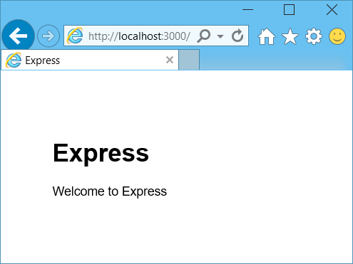

<properties 
    pageTitle="Erfahren Sie, Node.js - DocumentDB Node.js Lernprogramm | Microsoft Azure" 
    description="Erfahren Sie, Node.js! Lernprogramm untersucht wie mit Microsoft Azure DocumentDB speichern und Access-Daten aus einer Node.js Express-Webanwendung auf Websites Azure gehostet wird." 
    keywords="Entwicklung Datenbank Lernprogramm erfahren Sie, node.js, node.js Lernprogramm, Documentdb, Azure, Microsoft azure"
    services="documentdb" 
    documentationCenter="nodejs" 
    authors="syamkmsft" 
    manager="jhubbard" 
    editor="cgronlun"/>

<tags 
    ms.service="documentdb" 
    ms.workload="data-services" 
    ms.tgt_pltfrm="na" 
    ms.devlang="nodejs" 
    ms.topic="hero-article" 
    ms.date="08/25/2016" 
    ms.author="syamk"/>

# Erstellen einer Node.js Webanwendung mit DocumentDB

> [AZURE.SELECTOR]
- [.NET](documentdb-dotnet-application.md)
- [Node.js](documentdb-nodejs-application.md)
- [Java](documentdb-java-application.md)
- [Python](documentdb-python-application.md)

Diese Node.js-Lernprogramm erfahren Sie, wie zum Speichern den DocumentDB Azure-Dienst verwenden und Access-Daten aus einer Node.js Express-Anwendung auf Websites Azure gehostet wird.

Es empfiehlt sich das folgende Video an, wo Sie so ein DocumentDB Azure-Datenbank-Konto bereitstellen und Speichern von JSON-Dokumenten in Ihrer Anwendung Node.js mich heraus erste Schritte. 

> [AZURE.VIDEO azure-demo-getting-started-with-azure-documentdb-on-nodejs-in-linux]

Klicken Sie dann zurück zu diesem Lernprogramm Node.js, erfahren Sie, die Antworten auf die folgenden Fragen:

- Wie arbeite ich mit DocumentDB mit Documentdb Npm Module?
- Wie bereit kann ich die Webanwendung mit Azure Websites?

Anhand dieses Lernprogramms Datenbank erstellen Sie eine einfache webbasierte Task-Management-Anwendung, die erstellen, abrufen und Durchführen von Vorgängen ermöglicht. Die Aufgaben werden als JSON-Dokumente in Azure DocumentDB gespeichert.

Keine haben Zeit des Lernprogramms abgeschlossen, und nur die vollständige Lösung erhalten möchten? Kein Problem, können Sie die vollständige Beispiel Lösung von [GitHub][]erhalten.

## Erforderliche Komponenten

> [AZURE.TIP] In diesem Lernprogramm Node.js wird davon ausgegangen, dass Sie einige vorherige Erfahrung mit Node.js und Azure Websites haben.

Bevor Sie den Anweisungen in diesem Artikel folgen, sollten Sie sicherstellen, dass Sie über Folgendes verfügen:

- Ein aktives Azure-Konto. Wenn Sie kein Konto haben, können Sie ein kostenloses Testversion Konto nur wenigen Minuten erstellen. Weitere Informationen finden Sie unter [Azure kostenlose Testversion](https://azure.microsoft.com/pricing/free-trial/).
- [Node.js][] Version v0.10.29 oder höher.
- [Express-generator](http://www.expressjs.com/starter/generator.html) (Sie können dieses über installieren `npm install express-generator -g`)
- [Git][].

## Schritt 1: Erstellen einer Datenbank DocumentDB-Konto

Erstes Erstellen eines Kontos DocumentDB. Wenn Sie bereits ein Konto haben, können Sie fahren Sie mit [Schritt2: Erstellen einer neuen Node.js Anwendung](#_Toc395783178).

[AZURE.INCLUDE [documentdb-create-dbaccount](../../includes/documentdb-create-dbaccount.md)]

[AZURE.INCLUDE [documentdb-keys](../../includes/documentdb-keys.md)]

## Schritt 2: Informationen Sie zum Erstellen einer neuen Node.js-Anwendungs

Jetzt wir lernen, wie ein grundlegendes Hallo Welt Node.js Projekt mit [Express](http://expressjs.com/) Framework erstellt.

1. Öffnen Sie Ihre bevorzugte Terminal.

2. Verwenden Sie den express-Generator, um eine neue Anwendung namens **erledigen**generieren.

        express todo

3. Öffnen Sie Ihre neue **erledigen** Verzeichnis und installieren Sie Abhängigkeiten.

        cd todo
        npm install

4. Führen Sie eine neue Anwendung.

        npm start

5. Sie können Sie Ihre neue Anwendung durch Navigieren [Http://localhost:3000](http://localhost:3000)im Browser anzeigen.

    

## Schritt 3: Installieren Sie zusätzliche Module

Die Datei **package.json** ist eine der Dateien im Stamm des Projekts erstellt. Diese Datei enthält eine Liste der zusätzliche Module, die für die Anwendung Node.js erforderlich sind. Beim Bereitstellen von dieser Anwendungs zu einer Azure-Websites wird später diese Datei verwendet, um zu bestimmen, welche Module auf Azure zur Unterstützung der Anwendungs installiert werden müssen. Wir müssen immer noch zwei weitere Pakete in diesem Lernprogramm zu installieren.

1. Zurück in das Terminal installieren Sie das Modul **asynchrone** über Npm.

        npm install async --save

1. Installieren Sie das Modul **Documentdb** über Npm an. Dies ist das Modul, in dem alle die DocumentDB magische geschieht.

        npm install documentdb --save

3. Eine schnelle Überprüfung der Datei **package.json** der Anwendung sollte die zusätzliche Module anzeigen. Diese Datei wird Azure informieren welche Pakete zum Herunterladen und installieren, wenn die Anwendung ausgeführt. Es sollte im folgenden Beispiel ähneln.

    

    Dies weist Knoten (und höher Azure), dass diese zusätzlichen Module Ihrer Anwendung abhängt.

## Schritt 4: Verwenden des DocumentDB-Diensts in einer Knoten-Anwendung

Die sorgt dafür, dass alle Erstinstallation und Konfiguration jetzt uns abrufen nach unten, warum wir hier sind, und das ist mit Azure DocumentDB Code schreiben.

### Erstellen Sie das Modell

1. Erstellen Sie im Projektverzeichnis ein neues Verzeichnis **Modelle**.
2. Erstellen Sie eine neue Datei namens **taskDao.js**im Verzeichnis **Modelle** . Diese Datei wird das Modell für die erstellte unsere Anwendungs Aufgaben enthalten.
3. Erstellen Sie im selben **Modelle** Verzeichnis eine weitere neue Datei mit dem Namen **docdbUtils.js**ein. Diese Datei enthält einige hilfreiche, wieder verwendbare, Code, den wir in der gesamten unsere Anwendung verwendet wird. 
4. Kopieren Sie den folgenden Code in in **docdbUtils.js**

        var DocumentDBClient = require('documentdb').DocumentClient;
            
        var DocDBUtils = {
            getOrCreateDatabase: function (client, databaseId, callback) {
                var querySpec = {
                    query: 'SELECT * FROM root r WHERE r.id= @id',
                    parameters: [{
                        name: '@id',
                        value: databaseId
                    }]
                };
        
                client.queryDatabases(querySpec).toArray(function (err, results) {
                    if (err) {
                        callback(err);
        
                    } else {
                        if (results.length === 0) {
                            var databaseSpec = {
                                id: databaseId
                            };
        
                            client.createDatabase(databaseSpec, function (err, created) {
                                callback(null, created);
                            });
        
                        } else {
                            callback(null, results[0]);
                        }
                    }
                });
            },
        
            getOrCreateCollection: function (client, databaseLink, collectionId, callback) {
                var querySpec = {
                    query: 'SELECT * FROM root r WHERE r.id=@id',
                    parameters: [{
                        name: '@id',
                        value: collectionId
                    }]
                };             
                
                client.queryCollections(databaseLink, querySpec).toArray(function (err, results) {
                    if (err) {
                        callback(err);
        
                    } else {        
                        if (results.length === 0) {
                            var collectionSpec = {
                                id: collectionId
                            };
                            
                            client.createCollection(databaseLink, collectionSpec, function (err, created) {
                                callback(null, created);
                            });
        
                        } else {
                            callback(null, results[0]);
                        }
                    }
                });
            }
        };
                
        module.exports = DocDBUtils;

    > [AZURE.TIP] CreateCollection nimmt optional RequestOptions Parameter, der an den Typ bieten für die Websitesammlung verwendet werden kann. Wenn kein requestOptions.offerType Wert angegeben wird wird die Sammlung mit Standard anbieten Typ erstellt werden.
    >
    > Weitere Informationen zum DocumentDB bieten Typen Näheres [Leistung Ebenen in DocumentDB](documentdb-performance-levels.md) 
        
3. Speichern Sie und schließen Sie die Datei **docdbUtils.js** .

4. Fügen Sie am Anfang der Datei **taskDao.js** , die **DocumentDBClient** und die **docdbUtils.js** weiter oben erstellten verweisen folgenden Code ein:

        var DocumentDBClient = require('documentdb').DocumentClient;
        var docdbUtils = require('./docdbUtils');

4. Fügen Sie als Nächstes Code zum Definieren und das Aufgabenobjekt exportieren. Dies ist für unsere Aufgabenobjekt Initialisierung und Einrichten von Datenbank und das Dokument Websitesammlung verwendeten wir verantwortlich.

        function TaskDao(documentDBClient, databaseId, collectionId) {
          this.client = documentDBClient;
          this.databaseId = databaseId;
          this.collectionId = collectionId;
        
          this.database = null;
          this.collection = null;
        }
        
        module.exports = TaskDao;

5. Fügen Sie den folgenden Code ein, um zusätzliche Methoden für das Objekt Vorgang definieren die Interaktionen mit in DocumentDB gespeicherten Daten zu ermöglichen.

        TaskDao.prototype = {
            init: function (callback) {
                var self = this;
        
                docdbUtils.getOrCreateDatabase(self.client, self.databaseId, function (err, db) {
                    if (err) {
                        callback(err);
                    } else {
                        self.database = db;
                        docdbUtils.getOrCreateCollection(self.client, self.database._self, self.collectionId, function (err, coll) {
                            if (err) {
                                callback(err);
        
                            } else {
                                self.collection = coll;
                            }
                        });
                    }
                });
            },
        
            find: function (querySpec, callback) {
                var self = this;
        
                self.client.queryDocuments(self.collection._self, querySpec).toArray(function (err, results) {
                    if (err) {
                        callback(err);
        
                    } else {
                        callback(null, results);
                    }
                });
            },
        
            addItem: function (item, callback) {
                var self = this;
        
                item.date = Date.now();
                item.completed = false;
        
                self.client.createDocument(self.collection._self, item, function (err, doc) {
                    if (err) {
                        callback(err);
        
                    } else {
                        callback(null, doc);
                    }
                });
            },
        
            updateItem: function (itemId, callback) {
                var self = this;
        
                self.getItem(itemId, function (err, doc) {
                    if (err) {
                        callback(err);
        
                    } else {
                        doc.completed = true;
        
                        self.client.replaceDocument(doc._self, doc, function (err, replaced) {
                            if (err) {
                                callback(err);
        
                            } else {
                                callback(null, replaced);
                            }
                        });
                    }
                });
            },
        
            getItem: function (itemId, callback) {
                var self = this;
        
                var querySpec = {
                    query: 'SELECT * FROM root r WHERE r.id = @id',
                    parameters: [{
                        name: '@id',
                        value: itemId
                    }]
                };
        
                self.client.queryDocuments(self.collection._self, querySpec).toArray(function (err, results) {
                    if (err) {
                        callback(err);
        
                    } else {
                        callback(null, results[0]);
                    }
                });
            }
        };

6. Speichern Sie und schließen Sie die Datei **taskDao.js** . 

### Erstellen des Controllers

1. Erstellen Sie eine neue Datei namens **tasklist.js**im Verzeichnis **leitet** Ihres Projekts. 
2. Fügen Sie den folgenden Code zu **tasklist.js**. Dadurch wird die DocumentDBClient und asynchrone Module, die verwendet werden, indem Sie **tasklist.js**geladen. Dies definiert auch die **Aufgabenliste** -Funktion, die eine Instanz des **Task** -Objekts übergeben wird, die zuvor von uns definiert:

        var DocumentDBClient = require('documentdb').DocumentClient;
        var async = require('async');
        
        function TaskList(taskDao) {
          this.taskDao = taskDao;
        }
        
        module.exports = TaskList;

3. Vervollständigen Sie die Datei **tasklist.js** durch die Methoden zur **ShowTasks, AddTask**und **CompleteTasks**hinzufügen:
        
        TaskList.prototype = {
            showTasks: function (req, res) {
                var self = this;
        
                var querySpec = {
                    query: 'SELECT * FROM root r WHERE r.completed=@completed',
                    parameters: [{
                        name: '@completed',
                        value: false
                    }]
                };
        
                self.taskDao.find(querySpec, function (err, items) {
                    if (err) {
                        throw (err);
                    }
        
                    res.render('index', {
                        title: 'My ToDo List ',
                        tasks: items
                    });
                });
            },
        
            addTask: function (req, res) {
                var self = this;
                var item = req.body;
        
                self.taskDao.addItem(item, function (err) {
                    if (err) {
                        throw (err);
                    }
        
                    res.redirect('/');
                });
            },
        
            completeTask: function (req, res) {
                var self = this;
                var completedTasks = Object.keys(req.body);
        
                async.forEach(completedTasks, function taskIterator(completedTask, callback) {
                    self.taskDao.updateItem(completedTask, function (err) {
                        if (err) {
                            callback(err);
                        } else {
                            callback(null);
                        }
                    });
                }, function goHome(err) {
                    if (err) {
                        throw err;
                    } else {
                        res.redirect('/');
                    }
                });
            }
        };

4. Speichern Sie und schließen Sie die Datei **tasklist.js** .
 
### Hinzufügen von config.js

1. Erstellen Sie eine neue Datei namens **config.js**in den Ordner Ihres Projekts.
2. Fügen Sie die folgenden **config.js**. Dadurch werden die Konfiguration Einstellungen und für unsere Anwendung benötigten Werte definiert.

        var config = {}
        
        config.host = process.env.HOST || "[the URI value from the DocumentDB Keys blade on http://portal.azure.com]";
        config.authKey = process.env.AUTH_KEY || "[the PRIMARY KEY value from the DocumentDB Keys blade on http://portal.azure.com]";
        config.databaseId = "ToDoList";
        config.collectionId = "Items";
        
        module.exports = config;

3. Aktualisieren Sie die Werte des Hosts und AUTH_KEY mit den Werten in der Schlüssel Blade-Ihres Kontos DocumentDB in [Microsoft Azure-Portal](https://portal.azure.com)gefunden in der Datei **config.js** :

4. Speichern Sie und schließen Sie die Datei **config.js** .
 
### Ändern der app.js

1. Öffnen Sie in dem Projektverzeichnis die **app.js** -Datei ein. Diese Datei wurde zuvor erstellt werden, wenn die Express-Webanwendung erstellt wurde.
2. Fügen Sie den folgenden Code an den Anfang der **app.js**
    
        var DocumentDBClient = require('documentdb').DocumentClient;
        var config = require('./config');
        var TaskList = require('./routes/tasklist');
        var TaskDao = require('./models/taskDao');

3. Dieser Code definiert die Config-Datei verwendet werden, und geht zum Werte aus dieser Datei in einige Variablen lesen wir bald verwenden.
4. Ersetzen Sie die folgenden zwei Zeilen in der Datei **app.js** ein:

        app.use('/', routes);
        app.use('/users', users); 

      mit den folgenden Codeausschnitt:

        var docDbClient = new DocumentDBClient(config.host, {
            masterKey: config.authKey
        });
        var taskDao = new TaskDao(docDbClient, config.databaseId, config.collectionId);
        var taskList = new TaskList(taskDao);
        taskDao.init();
        
        app.get('/', taskList.showTasks.bind(taskList));
        app.post('/addtask', taskList.addTask.bind(taskList));
        app.post('/completetask', taskList.completeTask.bind(taskList));
        app.set('view engine', 'jade');

6. Diese Zeilen definieren eine neue Instanz des Objekts **TaskDao** , mit eine neue Verbindung DocumentDB (mit den Werten aus der **config.js**lesen), Initialisierung das Task-Objekt und dann auf Methoden für unser **Aufgabenliste** Controller binden Formularaktionen. 

7. Schließlich speichern und schließen Sie die Datei **app.js** , wir fast fertig sind.
 
## Schritt 5: Erstellen einer Benutzeroberfläche

Jetzt werfen wir bis hin zum Erstellen der Benutzeroberfläche aus, damit ein Benutzer mit unserer Anwendung tatsächlich interagieren kann. Die Express-Anwendung, die wir erstellt wird als Ansicht-Engine **Jade** verwendet. Weitere Informationen zum Jade Näheres [http://jade-lang.com/](http://jade-lang.com/).

1. Die Datei **layout.jade** im Verzeichnis **Ansichten** wird als globale Vorlage für andere Dateien **.jade** verwendet. In diesem Schritt ändern Sie darauf, um verwenden [Twitter-Bootstrap](https://github.com/twbs/bootstrap), welche ist ein Toolkit, die eine übersichtliche aussehende Website entwerfen erleichtert. 
2. Öffnen Sie die Datei **layout.jade** im Ordner " **Ansichten** ", und Ersetzen Sie den Inhalt mit den folgenden;
    
        doctype html
        html
          head
            title= title
            link(rel='stylesheet', href='//ajax.aspnetcdn.com/ajax/bootstrap/3.3.2/css/bootstrap.min.css')
            link(rel='stylesheet', href='/stylesheets/style.css')
          body
            nav.navbar.navbar-inverse.navbar-fixed-top
              div.navbar-header
                a.navbar-brand(href='#') My Tasks
            block content
            script(src='//ajax.aspnetcdn.com/ajax/jQuery/jquery-1.11.2.min.js')
            script(src='//ajax.aspnetcdn.com/ajax/bootstrap/3.3.2/bootstrap.min.js')

    Dies effektiv weist die **Jade** -Engine zum Rendern von HTML-Code für unsere Anwendung und erstellt einen **Block** aufgerufen **Inhalte** können wir das Layout für unsere Inhaltsseiten abgeben.
    Speichern Sie und schließen Sie diese Datei **layout.jade** .

4. Jetzt öffnen Sie die **index.jade** -Datei, die Ansicht, die von unserem Anwendung verwendet werden, und Ersetzen Sie den Inhalt der Datei durch Folgendes ein:

        extends layout
        
        block content
          h1 #{title}
          br
        
          form(action="/completetask", method="post")
            table.table.table-striped.table-bordered
              tr
                td Name
                td Category
                td Date
                td Complete
              if (typeof tasks === "undefined")
                tr
                  td
              else
                each task in tasks
                  tr
                    td #{task.name}
                    td #{task.category}
                    - var date  = new Date(task.date);
                    - var day   = date.getDate();
                    - var month = date.getMonth() + 1;
                    - var year  = date.getFullYear();
                    td #{month + "/" + day + "/" + year}
                    td
                      input(type="checkbox", name="#{task.id}", value="#{!task.completed}", checked=task.completed)
            button.btn(type="submit") Update tasks
          hr
          form.well(action="/addtask", method="post")
            label Item Name:
            input(name="name", type="textbox")
            label Item Category:
            input(name="category", type="textbox")
            br
            button.btn(type="submit") Add item

    Dieses Layout erweitert und Inhalte für den **Inhalt** Platzhalter, die in der Datei **layout.jade** bereits zuvor gesehen stellt.
    
    Bei diesem Layout erstellt zwei HTML-Formulare. 
    Das erste Formular enthält eine Tabelle mit unseren Daten und einer Schaltfläche, die wir Elemente durch die Veröffentlichung auf **/completetask** Methode zum unser Controller aktualisieren kann.
    Das zweite Formular enthält zwei Eingabefelder und eine Schaltfläche, die uns zum Erstellen eines neuen Elements durch die Veröffentlichung auf **/addtask** Methode zum unser Controller ermöglicht.
    
    Dies sollte alle sein, die wir für unsere Anwendung arbeiten müssen.

5. Öffnen Sie die **style.css** -Datei im Verzeichnis **Public\stylesheets** , und Ersetzen Sie den Code mit den folgenden:

        body {
          padding: 50px;
          font: 14px "Lucida Grande", Helvetica, Arial, sans-serif;
        }
        a {
          color: #00B7FF;
        }
        .well label {
          display: block;
        }
        .well input {
          margin-bottom: 5px;
        }
        .btn {
          margin-top: 5px;
          border: outset 1px #C8C8C8;
        }

    Speichern Sie und schließen Sie diese **style.css** -Datei.

## Schritt 6: Führen Sie die Anwendung lokal

1. Klicken Sie zum Testen der Anwendungs auf dem lokalen Computer ausführen `npm start` in ein Terminal Ihrer Anwendung zu starten, und starten Sie einen Browser mit einer Seite, die im Bild unten aussieht:

    

2. Verwenden Sie die bereitgestellten Felder für das Element, Elementnamen und Kategorie, um Informationen einzugeben, und klicken Sie dann auf **Element hinzufügen**.

3. Die Seite sollte zur Anzeige des neu erstellten Elements in der Aufgabenliste zu aktualisieren.

    

4. Um einen Vorgang abgeschlossen haben, aktivieren Sie das Kontrollkästchen in der Spalte abgeschlossen einfach, und klicken Sie dann auf **Aktualisieren von Vorgängen**.

## Schritt 7: Bereitstellen Sie Ihrer Anwendung Entwicklungsprojekts Azure-Websites

1. Wenn Sie noch nicht geschehen ist, aktivieren Sie ein Git Repository für Ihre Website Azure. Sie können Anweisungen zum Zweck im [Lokalen Bereitstellung von Git Azure App Dienst](../app-service-web/app-service-deploy-local-git.md) Thema suchen.

2. Fügen Sie Ihrer Website Azure als eine remote Git hinzu.

        git remote add azure https://username@your-azure-website.scm.azurewebsites.net:443/your-azure-website.git

3. Drücken Sie nach der Fernbedienung bereitstellen.

        git push azure master

4. In ein paar Sekunden wird Git Fertig stellen, Veröffentlichen der Webanwendung, und starten Sie einen Browser, wo Sie sehen können, Ihre praktische Arbeit in Azure ausgeführt!

## Nächste Schritte

Herzlichen Glückwunsch! Sie haben gerade erstellen Ihrer ersten Node.js Express Webanwendung mit Azure DocumentDB und es Azure Websites veröffentlicht.

Beispiel-Quellcode für die Anwendung vollständige Referenz kann von [GitHub][]heruntergeladen werden.

Weitere Informationen finden Sie unter der [Node.js Developer Center](https://azure.microsoft.com/develop/nodejs/).

[Node.js]: http://nodejs.org/
[Git]: http://git-scm.com/
[Github]: https://github.com/Azure-Samples/documentdb-node-todo-app
 
