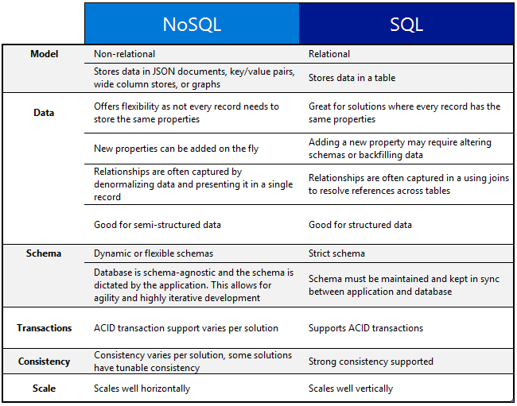

<properties
    pageTitle="Verwenden von NoSQL im Vergleich mit einer SQL | Microsoft Azure"
    description="Vergleichen Sie die Vorteile von NoSQL nicht relationalen Lösungen im Vergleich zu SQL-Lösungen. Erfahren Sie, ob eine der Dienste von Microsoft Azure NoSQL oder SQL Server am besten Ihrem Szenario passt."
    keywords="NoSQL im Vergleich mit einer Sql, NoSQL, Sql im Vergleich mit einer Nosql verwenden"
    services="documentdb"
    documentationCenter=""
    authors="mimig1"
    manager="jhubbard"
    editor=""/>

<tags
    ms.service="documentdb"
    ms.workload="data-services"
    ms.tgt_pltfrm="na"
    ms.devlang="dotnet"
    ms.topic="article" 
    ms.date="06/24/2016"
    ms.author="mimig"/>

# NoSQL im Vergleich mit einer SQL

SQL Server und relationalen Datenbanken (RDBMS) wurden die Gehe zu-Datenbanken für mehr als 20 Jahren. Die höhere müssen höhere Datenmengen und Arten von Daten in einem hohen Tempo verarbeiten können jedoch weist die Art der Daten Speicher Anforderungen für Entwickler geändert. Um dieses Szenario zu aktivieren, haben NoSQL-Datenbanken, mit denen Speichern von unstrukturierten und gemischten Daten bei in Beliebtheit gewonnen. 

NoSQL ist eine Kategorie von Datenbanken deutlich unterschiedliche aus SQL-Datenbanken. NoSQL wird häufig verwendet, um Daten Managementsysteme, um verweisen "Nicht SQL" oder ein Ansatz für die datenverwaltung, die "nicht nur SQL" enthält. Es gibt eine Reihe von Technologien in der NoSQL Kategorie, einschließlich Dokumentendatenbanken, Schlüsselwert Stores, Spalte familiäre Stores und Graph-Datenbanken mit Spiele, sozialen, beliebte sind und IoT apps ein.

Das Ziel dieses Artikels ist, mit deren Hilfe Sie erfahren Sie mehr über die Unterschiede zwischen NoSQL und SQL, und geben Ihnen eine Einführung in die NoSQL und SQL-Angebote von Microsoft.  

## Wann NoSQL verwenden?

Lassen Sie uns weiterhin an, dass Sie eine neue sozialen Engagement Website erstellen. Benutzer können Beiträge erstellen und Hinzufügen von Bildern, Videos und Musik können. Andere Benutzer können der Beiträge Kommentieren und geben Sie Punkte (gefällt mir) können Sie die Beiträge bewerten. Die Startseite haben einen Feed der Beiträge, die Benutzer freizugeben und zu interagieren. 

Wie werden diese Daten gespeichert? Wenn Sie mit SQL vertraut sind, können Sie beginnen, Zeichnung ungefähr wie folgt aus:

Denken Sie also Herzlichen Glückwunsch, aber jetzt die Struktur der einen einzelnen Beitrag und wie Sie ihn anzuzeigen. Wenn Sie den Beitrag und die zugehörigen Bilder, Audio, Video, Kommentare, Punkte und Benutzerinformationen auf einer Website oder einer Anwendung anzeigen möchten, müssten Sie zum Ausführen einer Abfrage mit acht nur zum Abrufen des Inhalts gezählt. Nehmen Sie nun einen Stream von Beiträgen, die dynamisch laden und auf dem Bildschirm angezeigt werden und Sie können ganz einfach Vorhersagen, geht's Tausende von Abfragen und viele Verknüpfungen der Aufgabe erforderlich sind.

Sie können jetzt eine relationale Lösung wie SQL Server zum Speichern der Daten - verwenden, aber es gibt eine weitere Möglichkeit, eine NoSQL-Option, die den Ansatz vereinfacht. Transformiert der Beitrag in ein Dokument JSON wie den folgenden und speichern es in DocumentDB, einer Datenbank-Dienst Azure NoSQL Dokument, können die Leistung erhöhen und abgerufen werden den gesamten Post mit einer Abfrage und keine Verknüpfungen. Es ist ein einfacheres mehr einfach, und weitere leistungsfähige ergeben.

    {
        "id":"ew12-res2-234e-544f",
        "title":"post title",
        "date":"2016-01-01",
        "body":"this is an awesome post stored on NoSQL",
        "createdBy":User,
        "images":["http://myfirstimage.png","http://mysecondimage.png"],
        "videos":[
            {"url":"http://myfirstvideo.mp4", "title":"The first video"},
            {"url":"http://mysecondvideo.mp4", "title":"The second video"}
        ],
        "audios":[
            {"url":"http://myfirstaudio.mp3", "title":"The first audio"},
            {"url":"http://mysecondaudio.mp3", "title":"The second audio"}
        ]
    }

Darüber hinaus können diese Daten nach Beitrag-Id, wobei die Daten nach natürlich skalieren und Nutzen von NoSQL Maßstab Merkmale, unterteilt werden. Außerdem können NoSQL Systeme Entwickler lösen Sie Konsistenz und bieten hoch verfügbaren apps.  Schließlich erfordert diese Lösung keine Entwickler definieren, verwalten und Schema in der Datenebene für schnelle Iteration gleicht verwalten.

Anschließend können Sie auf diese mit anderen Diensten Azure Lösung erstellen:

- [Azure suchen](https://azure.microsoft.com/services/search/) können über das Web app verwendet werden, damit Benutzer Beiträge zu suchenden können.
- [Azure App Services](https://azure.microsoft.com/services/app-service/) können host für Applikationen und Hintergrundprozesse verwendet werden.
- [Azure BLOB-Speicher](https://azure.microsoft.com/services/storage/) kann verwendet werden, einschließlich Bildern vollständige Benutzerprofile gespeichert.
- [Azure SQL-Datenbank](https://azure.microsoft.com/services/sql-database/) kann verwendet werden, um große Mengen von Daten, z. B. Anmeldeinformationen und Daten für Nutzungsanalysen zu speichern.
- [Azure maschinellen Learning](https://azure.microsoft.com/services/machine-learning/) kann verwendet werden, Erstellen von Knowledge und Intelligence, die ebenfalls Feedback an den Prozess und helfen, die richtige Inhalte an die richtigen Benutzer übermitteln kann.

Diese Website für soziale Netzwerke Engagement ist nur eine ein Szenario, in dem eine NoSQL-Datenbank rechts Datenmodell für das Projekt ist. Wenn Sie weitere Informationen zu diesem Szenario und wie Sie Ihre Daten für DocumentDB in sozialen Medien Clientanwendungen modellieren lesen möchten, finden Sie unter [mit DocumentDB für soziale Netzwerke vertraut](documentdb-social-media-apps.md). 

## NoSQL im Vergleich mit einer SQL-Vergleich

In der folgenden Tabelle werden die wichtigsten Unterschiede zwischen NoSQL und SQL verglichen. 

Wenn Ihren Anforderungen von eine NoSQL-Datenbank am besten geeignet ist, fahren Sie mit dem nächsten Abschnitt erfahren Sie mehr über die verfügbaren aus Azure NoSQL-Dienste. Wenn eine SQL-Datenbank, die am besten Ihren Bedürfnissen entspricht, fahren Sie andernfalls mit [wie Microsoft SQL-Angebote werden?](#what-are-the-microsoft-sql-offerings)

## Was sind die Microsoft Azure NoSQL Angebote?

Azure hat vier vollständig verwaltete NoSQL Dienste: 

- [Azure DocumentDB](https://azure.microsoft.com/services/documentdb/)
- [Azure Table Storage](https://azure.microsoft.com/services/storage/)
- [Azure HBase als Teil des HDInsight](https://azure.microsoft.com/services/hdinsight/)
- [Azure Redis Cache](https://azure.microsoft.com/services/cache/)

Die folgenden Vergleichstabelle zugeordnet ist, die Hauptmerkmale für jeden Dienst. Welche beschreibt am genauesten die Anforderungen Ihrer Anwendung? 

Wenn eine oder mehrere der folgenden Dienste möglicherweise die Anforderungen Ihrer Anwendung entsprechen, erfahren Sie mehr mit den folgenden Ressourcen: 

- [DocumentDB Learning Pfad](https://azure.microsoft.com/documentation/learning-paths/documentdb/) und [DocumentDB Anwendungsmöglichkeiten](documentdb-use-cases.md)
- [Erste Schritte mit Azure Table storage](../storage/storage-dotnet-how-to-use-tables.md)
- [Was ist HBase in HDInsight](../hdinsight/hdinsight-hbase-overview.md)
- [Learning Path Cache redis](https://azure.microsoft.com/documentation/learning-paths/redis-cache/)

Klicken Sie dann auf die [Nächste Schritte](#next-steps) kostenlose Testversion Informationen wechseln.

## Was sind die Microsoft SQL-Angebote?

Microsoft hat fünf SQL-Angebote: 

- [SQL Azure-Datenbank](https://azure.microsoft.com/services/sql-database/)
- [SQLServer auf Azure-virtuellen Computern](https://azure.microsoft.com/services/virtual-machines/sql-server/)
- [SqlServer](https://www.microsoft.com/server-cloud/products/sql-server-2016/)
- [SQL Azure Datawarehouse (Preview)](https://azure.microsoft.com/services/sql-data-warehouse/)
- [Analytics Plattform System (lokale Einheit)](https://www.microsoft.com/en-us/server-cloud/products/analytics-platform-system/)

Wenn Sie SQL Server auf einem virtuellen Computern oder SQL-Datenbank interessiert sind, klicken Sie dann weitere [Wählen Sie eine Cloud SQL Server-Option aus: Azure SQL (PaaS)-Datenbank oder SQL Server auf Azure-virtuellen Computern (IaaS)](../sql-database/sql-database-paas-vs-sql-server-iaas.md) erfahren Sie mehr über die Unterschiede zwischen den beiden.

Wenn SQL Sounds die beste Option zufrieden sind, wechseln Sie dann auf [SQL Server](https://www.microsoft.com/server-cloud/products/) Weitere Informationen dazu, was unsere Microsoft SQL-Produkte und Dienstleistungen zu bieten haben.

Wechseln Sie dann zu [Nächste Schritte](#next-steps) kostenlosen Testversion und Bewertung Links.

## Nächste Schritte

Wir laden Sie weitere Informationen zu unseren Produkten SQL und NoSQL erfahren Sie, indem Sie diese kostenlos ausprobieren. 

- Für alle Azure Dienste können Sie registrieren für eine [Testversion einen Monat](https://azure.microsoft.com/pricing/free-trial/) und erhalten $200 für beliebige dieser Dienste Azure ausgeben.
    - [Azure DocumentDB](https://azure.microsoft.com/services/documentdb/)
    - [Azure HBase als Teil des HDInsight](https://azure.microsoft.com/services/hdinsight/)
    - [Azure Redis Cache](https://azure.microsoft.com/services/cache/)
    - [SQL Azure Datawarehouse (Preview)](https://azure.microsoft.com/services/sql-data-warehouse/)
    - [SQL Azure-Datenbank](https://azure.microsoft.com/services/sql-database/)
    - [Azure Table Storage](https://azure.microsoft.com/services/storage/)

- Sie können Drehen von einer [Testversion von SQL Server 2016 auf einem virtuellen Computer](https://azure.microsoft.com/marketplace/partners/microsoft/sqlserver2016ctp33evaluationwindowsserver2012r2/) oder Herunterladen einer [Testversion von SQL Server](https://www.microsoft.com/en-us/evalcenter/evaluate-sql-server-2016).
    - [SqlServer](https://www.microsoft.com/server-cloud/products/sql-server-2016/)
    - [SQLServer auf Azure-virtuellen Computern](https://azure.microsoft.com/services/virtual-machines/sql-server/)

