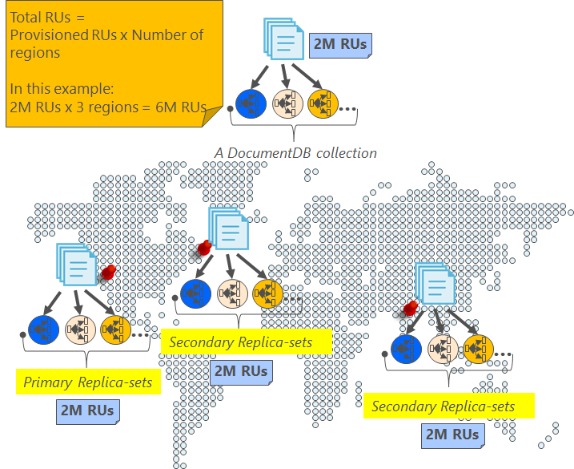

<properties
    pageTitle="Online-Sicherung und Wiederherstellung mit DocumentDB | Microsoft Azure"
    description="Informationen Sie zum automatischen sichern und Wiederherstellen von NoSQL-Datenbanken mit Azure DocumentDB ausführen."
    keywords="Sichern und wiederherstellen, online-Sicherung"
    services="documentdb"
    documentationCenter=""
    authors="RahulPrasad16"
    manager="jhubbard"
    editor="monicar"/>

<tags
    ms.service="documentdb"
    ms.workload="data-services"
    ms.tgt_pltfrm="na"
    ms.devlang="multiple"
    ms.topic="article"
    ms.date="09/23/2016"
    ms.author="raprasa"/>

# Automatische online-Sicherung und Wiederherstellung mit DocumentDB 

Azure DocumentDB nimmt automatisch Sicherungskopien all Ihrer Daten in regelmäßigen Abständen. Die automatischen Sicherung aktivieren werden entnommen, ohne die Leistung oder Verfügbarkeit Ihrer NoSQL-Datenbank-Vorgänge. Alle Sicherungskopien in einem anderen Speicherdienst separat gespeichert sind, und diese Sicherungskopien global für Stabilität gegen Landes-/ Datenverluste repliziert werden. Die automatischen Sicherung aktivieren dienen zur Szenarien, wenn Sie versehentlich gelöscht haben Ihre Sammlung DocumentDB und später Daten Wiederherstellung oder eine Disaster Wiederherstellung-Lösung benötigen.  

In diesem Artikel beginnt mit: eine kurze Zusammenfassung der Datenredundanz und Verfügbarkeit in DocumentDB, und klicken Sie dann erläutert Sicherungskopien. 

## Hohe Verfügbarkeit mit DocumentDB - eine Zusammenfassung

DocumentDB [Global verteilt](documentdb-distribute-data-globally.md) werden soll – es ermöglicht Ihnen, Durchsatz über mehrere Azure Regionen zusammen mit der Richtlinie leistungsgesteuert Failover und transparent Multi-homing APIs skalieren. Als Geschenk [99,99 % Verfügbarkeit SLAs](https://azure.microsoft.com/support/legal/sla/documentdb/v1_0/)Datenbanksystem werden alle schreibt in DocumentDB vor dem bestätigen an den Kunden als verpflichtet lokalen Festplatten durch ein Quorum von Replikaten in einem lokalen Data Center. Beachten Sie, dass die hohe Verfügbarkeit von DocumentDB auf dem lokalen Speicher basiert und keine externen Technologien abhängig. Wenn Ihr Datenbankkonto mehrere Azure Region zugeordnet ist, werden Ihre schreibt darüber hinaus über anderen Regionen ebenfalls repliziert. Um Ihre Durchsatz und Access-Daten auf niedrige Wartezeiten zu skalieren, haben Sie, wie viele Regionen mit Ihrer Datenbankkonto verknüpft ist, wie Sie lesen. In jeder Region gelesen werden (replizierten) Daten über eine Replikatgruppe als beibehalten.  

Wie in der folgenden Abbildung gezeigt wird, ist eine einzelne DocumentDB Sammlung [horizontal aufgeteilt](documentdb-partition-data.md). Eine "Partition" wird durch einen Kreis in der folgenden Abbildung gekennzeichnet, und jeder Partition hochgradig über eine Replikatgruppe zur Verfügung gestellt wird. Dies ist die lokale Verteilung in einem einzigen Azure Bereich (gekennzeichnet durch die X-Achse). Darüber hinaus wird jeder Partition (mit festgelegter Replikat entsprechenden) dann Global auf mehrere Bereiche, die mit Ihrem Datenbankkonto (z. B. in dieser Abbildung drei Regionen – ostasiatischen US, Westen US und zentralen Indien) verbundene verteilt. "Partitionsgruppe" ist eine Global verteilten Entität, umfasst mehrere Kopien Ihrer Daten in jeder Region (gekennzeichnet durch die y-Achse). Sie können die Regionen mit Ihrem Datenbankkonto verbundene Priorität zuweisen und DocumentDB wird transparent Failover auf den nächsten Bereich Fall der Fälle. Sie können auch manuell Failover zum Testen der End-to-End-Verfügbarkeit der Anwendung simulieren.  

Die folgende Abbildung zeigt den hohen Redundanzgrad von mit DocumentDB.

## Vollständige, online automatische Sicherungskopien

Huch, gelöschte ich meine Websitesammlung oder Datenbank! Mit DocumentDB nicht nur die Daten, sondern die Sicherungskopien Ihrer Daten auch hochgradig redundant und robuste zu regionalen Datenverluste vorgenommen wurden. Diese automatischen Sicherungskopien werden derzeit ungefähr alle vier Stunden übernommen. 

Die Sicherungskopien werden entnommen, ohne die Leistung oder Verfügbarkeit Ihrer Datenbank-Vorgänge. DocumentDB nimmt die Sicherung im Hintergrund, ohne die Leistung beeinträchtigt oder nutzen Ihre bereitgestellte RUs und ohne Auswirkung auf die Verfügbarkeit der Datenbank NoSQL. 

Im Gegensatz zu Ihrer Daten, die innerhalb der DocumentDB gespeichert ist, werden die automatischen Sicherungskopien in Azure BLOB-Speicher Service gespeichert. Um den niedrigen Wartezeit/effiziente Upload sichergestellt ist, wird der Snapshot Ihrer Sicherung zu einer Instanz von Azure Blob-Speicher in derselben Region als aktuelle Region Schreiben Ihres DocumentDB Datenbank-Kontos hochgeladen. Für Stabilität gegen regionalen Ausfall wird jede Momentaufnahme der Sicherungsdatei Daten in Azure BLOB-Speicher erneut über Geo redundante Speicher (GRS) in eine andere Region repliziert. Das folgende Diagramm veranschaulicht, dass die gesamte Sammlung von DocumentDB (mit allen drei Primärpartitionen in Westen US, in diesem Beispiel) in einem remote Azure BLOB-Speicher-Konto in Westen US gesichert wird und dann GRS ostasiatischen US repliziert. 

Die folgende Abbildung zeigt die periodische vollständige Sicherungskopien aller DocumentDB Elemente in GRS Azure-Speicher.

## Aufbewahrungszeitraum für einen angegebenen snapshot

Wie zuvor beschrieben, wir regelmäßig Momentaufnahmen der Daten und pro unsere Compliance-Vorschriften, wir die neueste Momentaufnahme von beibehalten, auf 90 Tage, bevor sie schließlich gelöscht wird. Wenn eine Websitesammlung oder Konto gelöscht wird, speichert DocumentDB die letzte Sicherung 90 Tage lang.

## Stellen Sie die Datenbank aus der online Sicherung wieder her

Für den Fall, dass Sie Ihre Daten versehentlich gelöscht haben, können Sie die [Datei ein Support Ticket](https://portal.azure.com/?#blade/Microsoft_Azure_Support/HelpAndSupportBlade) oder [Azure Support anrufen](https://azure.microsoft.com/support/options/) , um die Daten aus der letzten automatischen Sicherung wiederherzustellen. Für eine bestimmte Momentaufnahme Ihrer Sicherung wiederhergestellt werden erfordert DocumentDB an, dass die Daten für die Dauer des Zyklus Sicherungsdatei für diese Momentaufnahme mindestens mit uns verfügbar waren.

## Nächste Schritte

Um Ihre NoSQL-Datenbank in mehreren Data Center repliziert wird, finden Sie unter [Verteilen von Daten mit DocumentDB Global](documentdb-distribute-data-globally.md). 

Datei Kontakt Azure Support [Datei ein Ticket vom Azure-Portal](https://portal.azure.com/?#blade/Microsoft_Azure_Support/HelpAndSupportBlade).